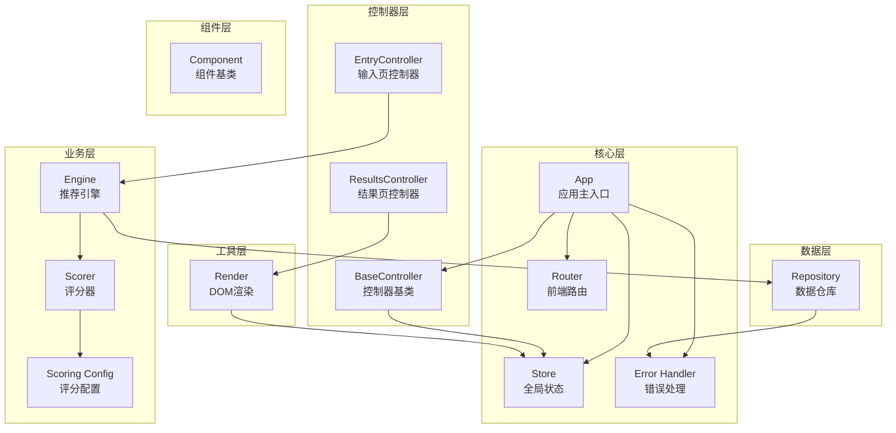
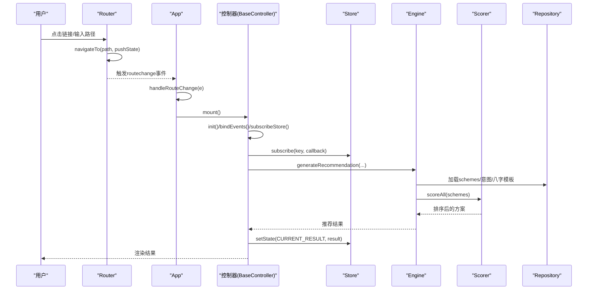
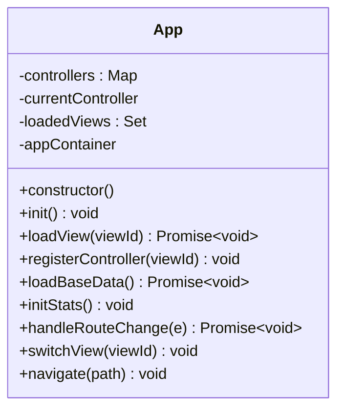
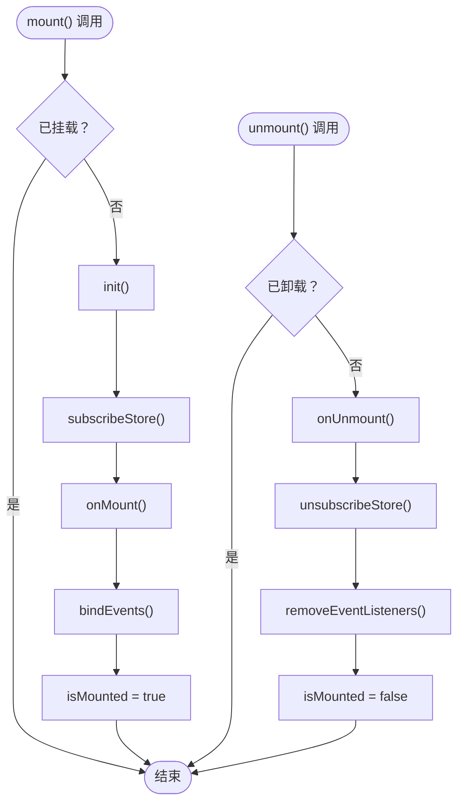
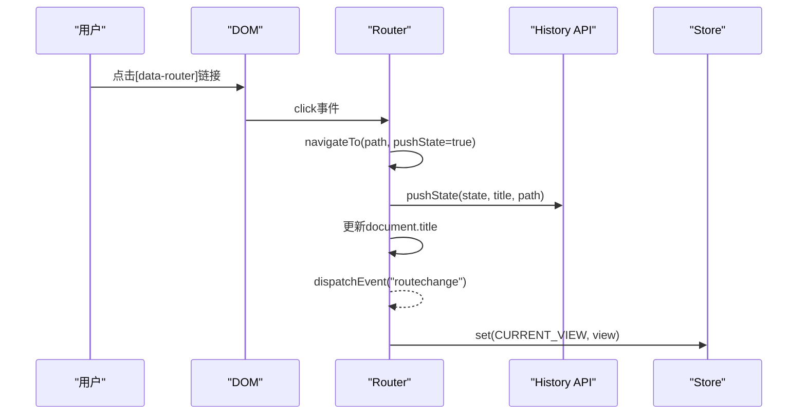
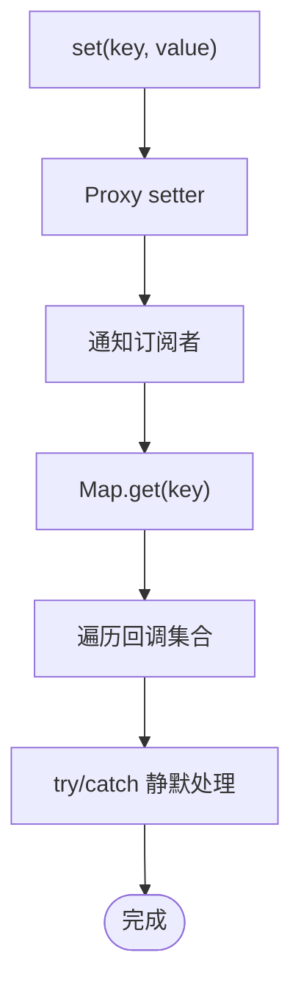
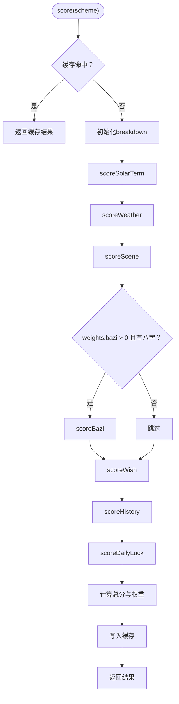
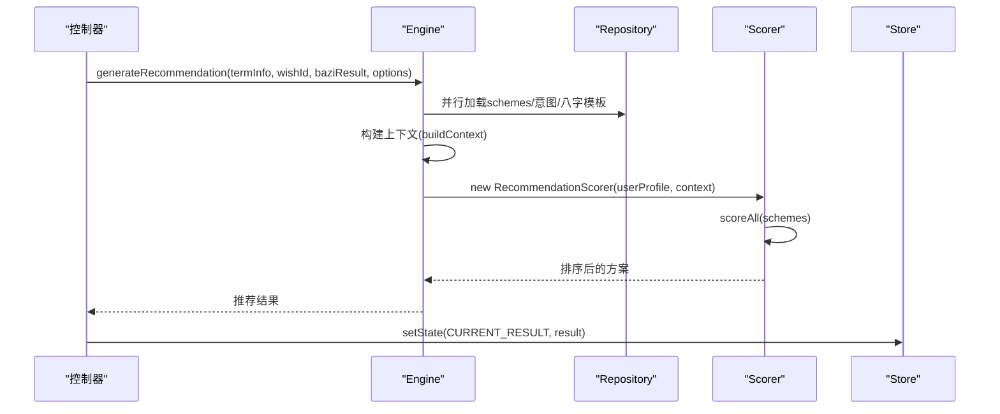
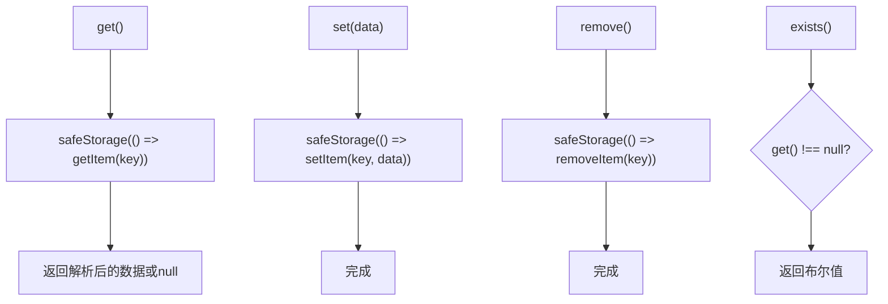
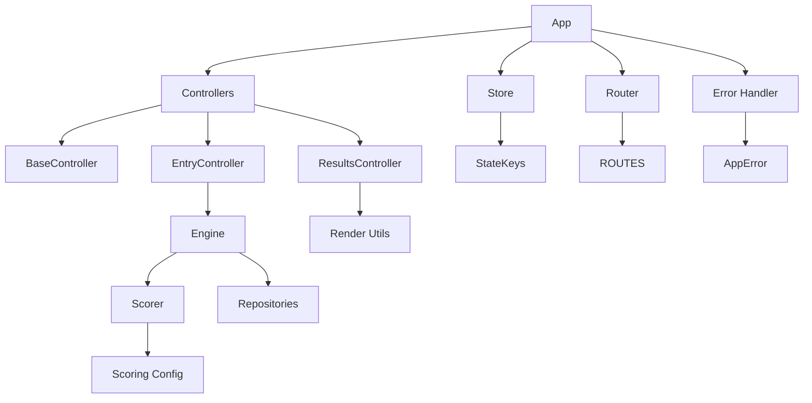

# API参考手册

<cite>
**本文档引用的文件**
- [js/core/app.js](file://js/core/app.js)
- [js/core/router.js](file://js/core/router.js)
- [js/core/store.js](file://js/core/store.js)
- [js/core/scorer.js](file://js/core/scorer.js)
- [js/core/scoring-config.js](file://js/core/scoring-config.js)
- [js/core/error-handler.js](file://js/core/error-handler.js)
- [js/services/engine.js](file://js/services/engine.js)
- [js/data/repository.js](file://js/data/repository.js)
- [js/controllers/base.js](file://js/controllers/base.js)
- [js/controllers/entry.js](file://js/controllers/entry.js)
- [js/controllers/results.js](file://js/controllers/results.js)
- [js/components/base.js](file://js/components/base.js)
- [js/utils/render.js](file://js/utils/render.js)
</cite>

## 目录
1. [简介](#简介)
2. [项目结构](#项目结构)
3. [核心组件](#核心组件)
4. [架构概览](#架构概览)
5. [详细组件分析](#详细组件分析)
6. [依赖分析](#依赖分析)
7. [性能考虑](#性能考虑)
8. [故障排除指南](#故障排除指南)
9. [结论](#结论)

## 简介
本参考手册面向五行穿搭建议项目的开发者与集成者，系统性梳理应用的公共接口与API规范，涵盖以下模块：
- App类：应用启动、视图动态加载、控制器生命周期协调
- BaseController基类：控制器生命周期、事件绑定、状态订阅
- Router路由系统：页面跳转、路由参数、导航控制
- Store状态管理器：状态读取、状态更新、订阅机制
- Scorer评分器：评分计算、参数配置、结果获取
- Engine推荐引擎：推荐请求、参数说明、结果格式
- Repository数据访问：查询、插入、更新、删除操作
- 错误处理：统一错误包装、安全执行、全局错误监听

## 项目结构
应用采用模块化组织，核心模块位于js目录下，按职责划分为core（核心）、services（业务服务）、data（数据访问）、controllers（控制器）、components（组件）、utils（工具）等。

**图表来源**
- [js/core/app.js](file://js/core/app.js#L36-L196)
- [js/core/router.js](file://js/core/router.js#L25-L50)
- [js/core/store.js](file://js/core/store.js#L30-L187)
- [js/core/error-handler.js](file://js/core/error-handler.js#L168-L189)
- [js/services/engine.js](file://js/services/engine.js#L323-L393)
- [js/core/scorer.js](file://js/core/scorer.js#L14-L317)
- [js/core/scoring-config.js](file://js/core/scoring-config.js#L74-L92)
- [js/data/repository.js](file://js/data/repository.js#L46-L394)
- [js/controllers/base.js](file://js/controllers/base.js#L11-L131)
- [js/controllers/entry.js](file://js/controllers/entry.js#L14-L241)
- [js/controllers/results.js](file://js/controllers/results.js#L13-L614)
- [js/components/base.js](file://js/components/base.js#L9-L107)
- [js/utils/render.js](file://js/utils/render.js#L13-L21)

**章节来源**
- [js/core/app.js](file://js/core/app.js#L23-L31)
- [js/core/router.js](file://js/core/router.js#L9-L17)
- [js/core/store.js](file://js/core/store.js#L33-L51)
- [js/data/repository.js](file://js/data/repository.js#L9-L21)

## 核心组件

### App类API
- 职责：应用初始化、视图动态加载、控制器注册与挂载、路由协调、全局错误处理、基础数据加载、统计初始化
- 关键方法
  - init(): Promise<void> - 初始化应用，注册路由变化监听，预加载首屏视图，注册控制器，加载基础数据，初始化路由，统计标记
  - loadView(viewId): Promise<void> - 动态加载指定视图HTML并插入到应用容器，避免重复加载
  - registerController(viewId): void - 注册视图对应的控制器实例，避免重复注册
  - loadBaseData(): Promise<void> - 通过withErrorHandler加载节气信息并写入Store
  - initStats(): void - 通过statsRepo.increment记录访问次数
  - handleRouteChange(e): Promise<void> - 处理路由变化事件，卸载当前控制器，挂载目标控制器，切换视图显示
  - switchView(viewId): void - 隐藏所有视图，显示目标视图并滚动到顶部
  - navigate(path): void - 导航到指定路径
- 生命周期与事件
  - 监听window.routechange事件以驱动控制器挂载/卸载
  - 通过VIEW_CONFIG映射视图ID到控制器与HTML资源
- 错误处理
  - 使用initGlobalErrorHandler进行全局错误捕获
  - 使用withErrorHandler包装异步操作，统一错误提示与日志

**章节来源**
- [js/core/app.js](file://js/core/app.js#L47-L73)
- [js/core/app.js](file://js/core/app.js#L79-L104)
- [js/core/app.js](file://js/core/app.js#L110-L117)
- [js/core/app.js](file://js/core/app.js#L122-L131)
- [js/core/app.js](file://js/core/app.js#L136-L139)
- [js/core/app.js](file://js/core/app.js#L145-L168)
- [js/core/app.js](file://js/core/app.js#L174-L184)
- [js/core/app.js](file://js/core/app.js#L190-L192)

### BaseController基类API
- 职责：控制器生命周期管理、事件绑定、Store订阅、状态读写、Toast消息
- 关键方法
  - mount(): void - 挂载流程：init → subscribeStore → onMount → bindEvents；确保仅挂载一次
  - unmount(): void - 卸载流程：onUnmount → unsubscribeStore → removeEventListeners；确保仅卸载一次
  - init(): void - 子类覆盖，初始化逻辑
  - bindEvents(): void - 子类覆盖，事件绑定逻辑
  - subscribeStore(): void - 子类覆盖，订阅Store逻辑
  - onMount(): void - 子类覆盖，挂载完成回调
  - onUnmount(): void - 子类覆盖，卸载前回调
  - addEventListener(target, type, handler, options): void - 添加事件监听并自动管理
  - removeEventListeners(): void - 移除所有事件监听
  - subscribe(key, callback): void - 订阅Store特定键，返回取消订阅函数
  - unsubscribeStore(): void - 取消所有Store订阅
  - getState(key): any - 读取Store状态
  - setState(key, value): void - 写入Store状态
  - showToast(message): void - 触发全局Toast事件
- 设计要点
  - 生命周期严格区分init/bindEvents/subscribeStore/onMount顺序，避免子类在未准备时绑定事件
  - 自动管理事件监听器集合，防止内存泄漏

**章节来源**
- [js/controllers/base.js](file://js/controllers/base.js#L21-L42)
- [js/controllers/base.js](file://js/controllers/base.js#L72-L85)
- [js/controllers/base.js](file://js/controllers/base.js#L92-L103)
- [js/controllers/base.js](file://js/controllers/base.js#L109-L120)
- [js/controllers/base.js](file://js/controllers/base.js#L126-L129)

### Router路由系统API
- 职责：前端路由初始化、导航控制、URL与视图映射、历史记录管理
- 路由配置
  - ROUTES: Record<string, { view: string; title: string }> - 路由到视图与标题的映射
- 关键方法
  - initRouter(): void - 监听popstate与链接点击，拦截导航，调用navigateTo
  - navigateTo(path, pushState = true): void - 更新history、title、触发routechange事件、更新Store.currentView
  - getCurrentRoute(): string - 获取当前路由路径
  - getCurrentRouteConfig(): Object - 获取当前路由配置
  - getRoutes(): Object - 获取所有路由配置副本
  - isValidRoute(path): boolean - 检查路径有效性
  - goBack(): void - 返回上一页
  - createRouteLink(path, text, options): string - 生成带data-router属性的链接HTML
- 导航控制
  - 支持pushState与非pushState两种模式，分别用于浏览器前进后退与内部导航
  - 未知路径自动重定向至'/'并提示

**章节来源**
- [js/core/router.js](file://js/core/router.js#L25-L50)
- [js/core/router.js](file://js/core/router.js#L57-L79)
- [js/core/router.js](file://js/core/router.js#L85-L95)
- [js/core/router.js](file://js/core/router.js#L101-L112)
- [js/core/router.js](file://js/core/router.js#L117-L119)
- [js/core/router.js](file://js/core/router.js#L137-L141)

### Store状态管理器API
- 职责：集中管理应用状态、响应式更新、订阅通知、调试与重置
- 状态键名常量
  - StateKeys: CURRENT_TERM_INFO, CURRENT_WISH_ID, CURRENT_BAZI_RESULT, CURRENT_RESULT, FAVORITES, CURRENT_VIEW, IS_LOADING, ERROR
- 关键方法
  - get(key): any - 读取状态
  - set(key, value): void - 设置状态（触发Proxy setter与通知）
  - setMultiple(updates): void - 批量设置状态
  - subscribe(key, callback): Function - 订阅状态变化，返回取消订阅函数
  - subscribeMultiple(keys, callback): Function - 订阅多个状态变化，返回统一取消订阅函数
  - reset(keys?): void - 重置状态，可指定键或全部重置
  - snapshot(): Object - 获取状态快照（调试用）
  - setDebug(enabled): void - 开启/关闭调试模式
- 响应式与通知
  - 使用Proxy拦截set，仅在值真正改变时触发通知
  - 订阅者错误被静默处理，保证通知链稳定

**章节来源**
- [js/core/store.js](file://js/core/store.js#L70-L81)
- [js/core/store.js](file://js/core/store.js#L87-L91)
- [js/core/store.js](file://js/core/store.js#L99-L110)
- [js/core/store.js](file://js/core/store.js#L118-L124)
- [js/core/store.js](file://js/core/store.js#L130-L141)
- [js/core/store.js](file://js/core/store.js#L147-L170)
- [js/core/store.js](file://js/core/store.js#L176-L178)
- [js/core/store.js](file://js/core/store.js#L184-L186)
- [js/core/store.js](file://js/core/store.js#L193-L202)

### Scorer评分器API
- 职责：封装推荐评分逻辑，支持单元测试，提供批量评分与解释
- 关键方法
  - score(scheme): { total: number; breakdown: Object; weights: Object } - 计算单个方案总分与分项明细
  - scoreAll(schemes): Array - 对方案列表批量评分并按总分降序排序
  - getExplanation(scheme): Array - 获取推荐理由（前三大维度及其占比）
  - scoreSolarTerm(scheme): number - 节气匹配评分
  - scoreBazi(scheme): number - 八字评分（含喜用神/忌神机制）
  - scoreScene(scheme): number - 场景适配评分
  - scoreWeather(scheme): number - 天气联动评分（含温度调候与材质实用性）
  - scoreWish(scheme): number - 心愿契合评分
  - scoreHistory(scheme): number - 历史偏好评分（五行/颜色/材质）
  - scoreDailyLuck(scheme): number - 今日运势评分
- 权重与配置
  - 基础权重：solarTerm(25%)、bazi(20%)、scene(20%)、weather(15%)、wish(15%)
  - 奖励权重：history(10%)、dailyLuck(5%)
  - 动态权重：无八字时重新分配权重；新用户降低节气与场景权重
- 缓存
  - 使用Map缓存评分结果，避免重复计算

**章节来源**
- [js/core/scorer.js](file://js/core/scorer.js#L29-L75)
- [js/core/scorer.js](file://js/core/scorer.js#L266-L276)
- [js/core/scorer.js](file://js/core/scorer.js#L283-L313)
- [js/core/scorer.js](file://js/core/scorer.js#L81-L86)
- [js/core/scorer.js](file://js/core/scorer.js#L91-L116)
- [js/core/scorer.js](file://js/core/scorer.js#L121-L147)
- [js/core/scorer.js](file://js/core/scorer.js#L152-L193)
- [js/core/scorer.js](file://js/core/scorer.js#L198-L210)
- [js/core/scorer.js](file://js/core/scorer.js#L215-L237)
- [js/core/scorer.js](file://js/core/scorer.js#L242-L259)
- [js/core/scoring-config.js](file://js/core/scoring-config.js#L7-L19)
- [js/core/scoring-config.js](file://js/core/scoring-config.js#L74-L92)

### Engine推荐引擎API
- 职责：加载数据、构建上下文、调用评分器、梯度推荐、生成结果
- 关键方法
  - generateRecommendation(termInfo, wishId, baziResult, options): Promise<Object> - 生成推荐结果
  - regenerateRecommendation(termInfo, wishId, baziResult, excludeIds, options): Promise<Object> - 换一批推荐
- 参数说明
  - termInfo: 节气信息（包含current.wuxing、id等）
  - wishId: 心愿ID（映射到INTENTION_MAP）
  - baziResult: 八字分析结果（包含recommend字段）
  - options: { sceneId: string, weatherData?: Object, userPreferences?: Object }
- 结果格式
  - schemes: 推荐方案数组（包含_score、_breakdown、_type）
  - termInfo, wishId, sceneId, intentionTemplate, baziResult, baziTemplate, dailyLuck, weather, generatedAt
  - explanations: 每个方案的推荐理由（包含schemeId、type、score、breakdown）
- 数据加载
  - 并行加载schemes.json、intention-templates.json、bazi-templates.json
  - 可选加载天气数据，否则使用getCurrentWeather
- 梯度推荐策略
  - 最佳匹配（最高分）
  - 保守替代（同五行不同风格/材质）
  - 平衡方案（不同五行，与节气五行相克或平衡）

**章节来源**
- [js/services/engine.js](file://js/services/engine.js#L323-L393)
- [js/services/engine.js](file://js/services/engine.js#L398-L421)
- [js/services/engine.js](file://js/services/engine.js#L60-L85)
- [js/services/engine.js](file://js/services/engine.js#L110-L125)
- [js/services/engine.js](file://js/services/engine.js#L130-L158)
- [js/services/engine.js](file://js/services/engine.js#L163-L182)
- [js/services/engine.js](file://js/services/engine.js#L187-L212)
- [js/services/engine.js](file://js/services/engine.js#L218-L299)

### Repository数据访问API
- 职责：抽象存储实现，支持localStorage封装与多种实体仓库
- 基础仓库
  - BaseRepository: get(), set(data), remove(), exists()
- 实体仓库
  - FavoritesRepository: getAll(), add(scheme), remove(schemeId), exists(schemeId), count(), clear()
  - PreferencesRepository: get()（默认偏好）、updateWuxingScore()、updateColorScore()、updateMaterialScore()
  - FeedbackRepository: getAll()、record(schemeId, action, metadata)
  - BaziRepository: save(bazi), get()
  - StatsRepository: get()（默认统计）、increment(key)、isFirstVisit()
  - OutfitRepository: getByDate(date)、save(date, imageData)、remove(date)
- 存储工具
  - storageUtils: get(key)、set(key, value)、remove(key)、clear()

**章节来源**
- [js/data/repository.js](file://js/data/repository.js#L46-L81)
- [js/data/repository.js](file://js/data/repository.js#L86-L146)
- [js/data/repository.js](file://js/data/repository.js#L151-L201)
- [js/data/repository.js](file://js/data/repository.js#L206-L259)
- [js/data/repository.js](file://js/data/repository.js#L264-L287)
- [js/data/repository.js](file://js/data/repository.js#L292-L337)
- [js/data/repository.js](file://js/data/repository.js#L342-L377)
- [js/data/repository.js](file://js/data/repository.js#L388-L394)

### 错误处理API
- 职责：统一错误类型、包装异步函数、安全执行、全局错误监听
- 错误类型
  - NETWORK, TIMEOUT, DATA_PARSE, VALIDATION, STORAGE, UNKNOWN
- 关键方法
  - withErrorHandler(fn, options): Function - 包装异步函数，统一错误处理与提示
  - safeFetch(url, options, timeout): Promise<Response> - 带超时控制的安全fetch
  - safeJsonParse(response): Promise<Object> - 安全JSON解析
  - safeStorage(operation): any - 安全本地存储操作
  - initGlobalErrorHandler(): void - 全局未处理Promise与错误监听
- 设计要点
  - AppError继承Error，携带type、timestamp、originalError
  - 错误日志结构化输出，便于调试

**章节来源**
- [js/core/error-handler.js](file://js/core/error-handler.js#L8-L25)
- [js/core/error-handler.js](file://js/core/error-handler.js#L45-L79)
- [js/core/error-handler.js](file://js/core/error-handler.js#L101-L133)
- [js/core/error-handler.js](file://js/core/error-handler.js#L140-L146)
- [js/core/error-handler.js](file://js/core/error-handler.js#L153-L163)
- [js/core/error-handler.js](file://js/core/error-handler.js#L168-L189)

## 架构概览

**图表来源**
- [js/core/router.js](file://js/core/router.js#L57-L79)
- [js/core/app.js](file://js/core/app.js#L145-L168)
- [js/controllers/base.js](file://js/controllers/base.js#L21-L42)
- [js/services/engine.js](file://js/services/engine.js#L323-L393)
- [js/core/scorer.js](file://js/core/scorer.js#L266-L276)
- [js/data/repository.js](file://js/data/repository.js#L60-L85)

## 详细组件分析

### App类详细分析

**图表来源**
- [js/core/app.js](file://js/core/app.js#L36-L42)
- [js/core/app.js](file://js/core/app.js#L47-L73)
- [js/core/app.js](file://js/core/app.js#L79-L104)
- [js/core/app.js](file://js/core/app.js#L110-L117)
- [js/core/app.js](file://js/core/app.js#L122-L131)
- [js/core/app.js](file://js/core/app.js#L136-L139)
- [js/core/app.js](file://js/core/app.js#L145-L168)
- [js/core/app.js](file://js/core/app.js#L174-L184)
- [js/core/app.js](file://js/core/app.js#L190-L192)

**章节来源**
- [js/core/app.js](file://js/core/app.js#L36-L196)

### BaseController生命周期与事件处理

**图表来源**
- [js/controllers/base.js](file://js/controllers/base.js#L21-L42)
- [js/controllers/base.js](file://js/controllers/base.js#L35-L42)

**章节来源**
- [js/controllers/base.js](file://js/controllers/base.js#L11-L131)

### Router导航流程

**图表来源**
- [js/core/router.js](file://js/core/router.js#L42-L49)
- [js/core/router.js](file://js/core/router.js#L57-L79)
- [js/core/store.js](file://js/core/store.js#L79-L81)

**章节来源**
- [js/core/router.js](file://js/core/router.js#L25-L50)
- [js/core/router.js](file://js/core/router.js#L57-L79)

### Store订阅机制

**图表来源**
- [js/core/store.js](file://js/core/store.js#L11-L25)
- [js/core/store.js](file://js/core/store.js#L130-L141)

**章节来源**
- [js/core/store.js](file://js/core/store.js#L30-L187)

### Scorer评分流程

**图表来源**
- [js/core/scorer.js](file://js/core/scorer.js#L29-L75)
- [js/core/scorer.js](file://js/core/scorer.js#L81-L86)
- [js/core/scorer.js](file://js/core/scorer.js#L152-L193)
- [js/core/scorer.js](file://js/core/scorer.js#L215-L237)
- [js/core/scorer.js](file://js/core/scorer.js#L242-L259)

**章节来源**
- [js/core/scorer.js](file://js/core/scorer.js#L14-L317)

### Engine推荐流程

**图表来源**
- [js/services/engine.js](file://js/services/engine.js#L323-L393)
- [js/services/engine.js](file://js/services/engine.js#L218-L299)
- [js/core/scorer.js](file://js/core/scorer.js#L266-L276)
- [js/data/repository.js](file://js/data/repository.js#L60-L85)

**章节来源**
- [js/services/engine.js](file://js/services/engine.js#L323-L393)

### Repository操作流程

**图表来源**
- [js/data/repository.js](file://js/data/repository.js#L55-L80)
- [js/data/repository.js](file://js/data/repository.js#L24-L41)
- [js/core/error-handler.js](file://js/core/error-handler.js#L153-L163)

**章节来源**
- [js/data/repository.js](file://js/data/repository.js#L46-L81)
- [js/core/error-handler.js](file://js/core/error-handler.js#L153-L163)

## 依赖分析

**图表来源**
- [js/core/app.js](file://js/core/app.js#L6-L21)
- [js/controllers/entry.js](file://js/controllers/entry.js#L5-L12)
- [js/controllers/results.js](file://js/controllers/results.js#L5-L12)
- [js/services/engine.js](file://js/services/engine.js#L6-L9)
- [js/core/scorer.js](file://js/core/scorer.js#L6-L12)
- [js/core/store.js](file://js/core/store.js#L193-L202)
- [js/core/router.js](file://js/core/router.js#L9-L17)
- [js/core/error-handler.js](file://js/core/error-handler.js#L30-L37)

**章节来源**
- [js/core/app.js](file://js/core/app.js#L6-L21)
- [js/controllers/entry.js](file://js/controllers/entry.js#L5-L12)
- [js/controllers/results.js](file://js/controllers/results.js#L5-L12)
- [js/services/engine.js](file://js/services/engine.js#L6-L9)
- [js/core/scorer.js](file://js/core/scorer.js#L6-L12)
- [js/core/store.js](file://js/core/store.js#L193-L202)
- [js/core/router.js](file://js/core/router.js#L9-L17)
- [js/core/error-handler.js](file://js/core/error-handler.js#L30-L37)

## 性能考虑
- 视图懒加载：App在init阶段仅预加载首屏视图，其余视图按需loadView，减少初始加载压力
- 评分缓存：Scorer内部使用Map缓存评分结果，避免重复计算
- 并行数据加载：Engine使用Promise.all并行加载多份数据，缩短等待时间
- 响应式更新：Store使用Proxy拦截set，仅在值变化时触发通知，减少无效渲染
- 超时控制：safeFetch提供10秒超时，防止长时间阻塞

## 故障排除指南
- 网络错误
  - 现象：safeFetch抛出NETWORK错误，withErrorHandler返回null
  - 处理：检查网络连接、重试请求、查看控制台日志
- 超时错误
  - 现象：fetch被AbortController中断，抛出TIMEOUT错误
  - 处理：适当延长timeout或优化数据源
- 数据解析错误
  - 现象：safeJsonParse抛出DATA_PARSE错误
  - 处理：检查数据格式、服务端响应、缓存一致性
- 存储错误
  - 现象：safeStorage捕获QuotaExceededError或其它Storage异常
  - 处理：清理缓存、检查隐私模式、降级存储策略
- 全局错误监听
  - 作用：捕获未处理Promise拒绝与全局错误，统一提示用户

**章节来源**
- [js/core/error-handler.js](file://js/core/error-handler.js#L101-L133)
- [js/core/error-handler.js](file://js/core/error-handler.js#L140-L146)
- [js/core/error-handler.js](file://js/core/error-handler.js#L153-L163)
- [js/core/error-handler.js](file://js/core/error-handler.js#L168-L189)

## 结论
本API参考手册系统梳理了五行穿搭建议项目的核心模块与公共接口，明确了各组件的职责边界、调用关系与数据流。通过统一的错误处理、响应式状态管理与模块化的控制器设计，项目实现了清晰的架构与良好的可维护性。建议在扩展新功能时遵循现有模式，确保一致的API体验与错误处理策略。