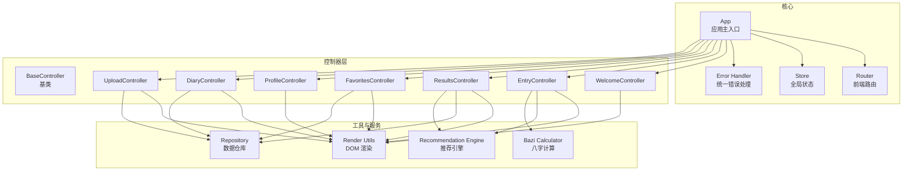
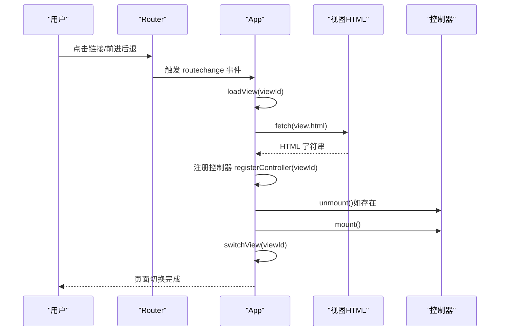
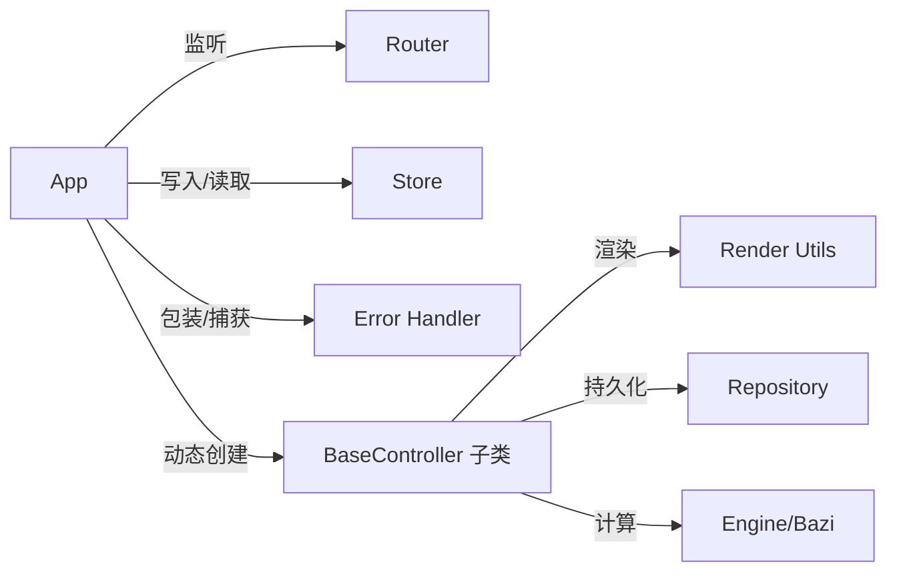

# 应用API

<cite>
**本文引用的文件**
- [js/core/app.js](file://js/core/app.js)
- [js/core/router.js](file://js/core/router.js)
- [js/core/store.js](file://js/core/store.js)
- [js/core/error-handler.js](file://js/core/error-handler.js)
- [js/controllers/base.js](file://js/controllers/base.js)
- [js/controllers/welcome.js](file://js/controllers/welcome.js)
- [js/controllers/entry.js](file://js/controllers/entry.js)
- [js/controllers/results.js](file://js/controllers/results.js)
- [js/controllers/favorites.js](file://js/controllers/favorites.js)
- [js/controllers/profile.js](file://js/controllers/profile.js)
- [js/controllers/diary.js](file://js/controllers/diary.js)
- [js/controllers/upload.js](file://js/controllers/upload.js)
- [js/utils/render.js](file://js/utils/render.js)
- [js/utils/diary.js](file://js/utils/diary.js)
- [js/data/repository.js](file://js/data/repository.js)
- [js/services/engine.js](file://js/services/engine.js)
- [js/services/bazi.js](file://js/services/bazi.js)
</cite>

## 目录
1. [简介](#简介)
2. [项目结构](#项目结构)
3. [核心组件](#核心组件)
4. [架构总览](#架构总览)
5. [详细组件分析](#详细组件分析)
6. [依赖分析](#依赖分析)
7. [性能考虑](#性能考虑)
8. [故障排查指南](#故障排查指南)
9. [结论](#结论)
10. [附录](#附录)

## 简介
本文件为应用主入口类 App 的详细 API 文档，面向开发者与产品同学，系统性说明以下能力：
- 初始化流程 init()：参数、执行步骤、错误处理与依赖注入
- 视图加载 loadView()：异步加载、缓存策略、错误恢复
- 控制器注册 registerController()：动态创建与生命周期管理
- 路由处理 handleRouteChange()：事件监听、控制器切换
- 视图切换 switchView()：DOM 操作与滚动行为
- 导航 navigate()：路由跳转与参数传递
- 并配套最佳实践与性能优化建议

## 项目结构
应用采用“模块化 + 控制器驱动”的前端架构：
- 核心模块：App、Router、Store、Error Handler
- 控制器层：每个视图一个控制器，继承 BaseController
- 工具与服务：渲染、数据仓库、推荐引擎、八字计算等
- 视图资源：按需异步加载 HTML 片段

图表来源
- [js/core/app.js](file://js/core/app.js#L36-L196)
- [js/core/router.js](file://js/core/router.js#L9-L17)
- [js/core/store.js](file://js/core/store.js#L30-L63)
- [js/core/error-handler.js](file://js/core/error-handler.js#L8-L25)
- [js/controllers/base.js](file://js/controllers/base.js#L11-L16)
- [js/utils/render.js](file://js/utils/render.js#L13-L21)
- [js/data/repository.js](file://js/data/repository.js#L8-L21)
- [js/services/engine.js](file://js/services/engine.js#L323-L393)
- [js/services/bazi.js](file://js/services/bazi.js#L241-L266)

章节来源
- [js/core/app.js](file://js/core/app.js#L22-L31)
- [js/core/router.js](file://js/core/router.js#L9-L17)

## 核心组件
- App：应用主入口，负责初始化、路由协调、视图与控制器生命周期管理、基础数据加载与统计初始化
- Router：前端路由系统，拦截链接点击、处理 popstate、维护当前路由状态
- Store：全局状态中心，响应式状态、订阅通知、重置与调试
- Error Handler：统一错误包装、安全存储、网络超时、错误日志与全局错误捕获
- BaseController：控制器基类，提供挂载/卸载、事件绑定、Store 订阅、状态读写、Toast 发布

章节来源
- [js/core/app.js](file://js/core/app.js#L36-L196)
- [js/core/router.js](file://js/core/router.js#L25-L87)
- [js/core/store.js](file://js/core/store.js#L30-L187)
- [js/core/error-handler.js](file://js/core/error-handler.js#L45-L189)
- [js/controllers/base.js](file://js/controllers/base.js#L11-L130)

## 架构总览
App 作为中枢，串联 Router、Store、Error Handler，并与各控制器协作。视图通过 loadView() 异步加载，控制器通过 registerController() 动态创建并在 handleRouteChange() 中切换。

图表来源
- [js/core/router.js](file://js/core/router.js#L42-L79)
- [js/core/app.js](file://js/core/app.js#L145-L168)

章节来源
- [js/core/app.js](file://js/core/app.js#L47-L73)
- [js/core/router.js](file://js/core/router.js#L25-L79)

## 详细组件分析

### App 类 API

- 类型与职责
  - 类型：App
  - 职责：应用初始化、路由协调、动态视图加载、控制器生命周期管理、基础数据与统计初始化

- 成员变量
  - controllers: Map<string, BaseController> —— 控制器实例缓存
  - currentController: BaseController —— 当前活动控制器
  - loadedViews: Set<string> —— 已加载视图集合
  - appContainer: HTMLElement —— 应用根容器

- 方法清单与说明

  - init(): Promise<void>
    - 参数：无
    - 功能：初始化全局错误处理器、获取应用容器、预加载首屏视图、注册首屏控制器、监听路由变化、加载基础数据、初始化路由、初始化统计
    - 返回：Promise<void>
    - 异常：通过全局错误处理器捕获未处理异常
    - 使用示例：bootstrap() 在 DOMContentLoaded 后调用 app.init()

    章节来源
    - [js/core/app.js](file://js/core/app.js#L47-L73)
    - [js/core/error-handler.js](file://js/core/error-handler.js#L168-L189)
    - [js/core/router.js](file://js/core/router.js#L25-L49)

  - loadView(viewId: string): Promise<void>
    - 参数：viewId(string) —— 视图标识，如 'view-welcome'
    - 功能：若未加载则通过 fetch 获取对应 HTML，解析为 DOM 节点并插入 appContainer，同时记录 loadedViews
    - 返回：Promise<void>
    - 缓存策略：loadedViews 去重，避免重复加载
    - 错误恢复：捕获网络/解析错误并打印日志
    - 使用示例：handleRouteChange() 内部自动调用

    章节来源
    - [js/core/app.js](file://js/core/app.js#L79-L104)

  - registerController(viewId: string): void
    - 参数：viewId(string)
    - 功能：若控制器未注册，则从 VIEW_CONFIG 中取出对应控制器构造函数并实例化，存入 controllers
    - 返回：void
    - 生命周期：由 App 统一管理，配合 mount/unmount 使用
    - 使用示例：handleRouteChange() 内部自动调用

    章节来源
    - [js/core/app.js](file://js/core/app.js#L110-L117)

  - handleRouteChange(e: CustomEvent<{ route: Route }>): Promise<void>
    - 参数：e(CustomEvent) —— 事件 detail 含 { route: Route }
    - 功能：动态加载目标视图、注册控制器、卸载当前控制器、挂载新控制器、切换视图显示
    - 返回：Promise<void>
    - 控制器切换：先 unmount()，再 mount()，最后更新 currentController
    - 使用示例：init() 中监听 window.routechange

    章节来源
    - [js/core/app.js](file://js/core/app.js#L145-L168)

  - switchView(viewId: string): void
    - 参数：viewId(string)
    - 功能：隐藏所有 .view，显示目标视图并滚动到顶部
    - 返回：void
    - DOM 操作：通过类名控制显隐
    - 使用示例：handleRouteChange() 末尾调用

    章节来源
    - [js/core/app.js](file://js/core/app.js#L174-L184)

  - navigate(path: string): void
    - 参数：path(string) —— 目标路径，如 '/entry'
    - 功能：调用 navigateTo(path, true)，将新路由推入历史记录
    - 返回：void
    - 使用示例：各控制器内通过 navigate('/path') 触发路由跳转

    章节来源
    - [js/core/app.js](file://js/core/app.js#L190-L192)
    - [js/core/router.js](file://js/core/router.js#L57-L79)

  - loadBaseData(): Promise<void>
    - 功能：使用 withErrorHandler 包装 detectCurrentTerm，获取节气信息并写入 Store
    - 返回：Promise<void>
    - 错误处理：通过 withErrorHandler 统一包装网络/解析错误
    - 使用示例：init() 中调用

    章节来源
    - [js/core/app.js](file://js/core/app.js#L122-L131)
    - [js/core/error-handler.js](file://js/core/error-handler.js#L45-L79)

  - initStats(): void
    - 功能：调用 statsRepo.increment('visits') 记录访问次数
    - 返回：void
    - 使用示例：init() 中调用

    章节来源
    - [js/core/app.js](file://js/core/app.js#L136-L139)
    - [js/data/repository.js](file://js/data/repository.js#L292-L337)

- 视图配置
  - VIEW_CONFIG：将视图 ID 映射到控制器构造函数与 HTML 路径，用于 loadView/registerController

章节来源
- [js/core/app.js](file://js/core/app.js#L23-L31)

### Router 模块 API
- initRouter(): void
  - 功能：监听 popstate、处理初始路由、拦截链接点击并调用 navigateTo
  - 返回：void

- navigateTo(path: string, pushState?: boolean): void
  - 功能：更新当前路由、history、title、触发 routechange 事件、写入 Store
  - 返回：void

- 其他查询与校验
  - getCurrentRoute(): string
  - getCurrentRouteConfig(): Object
  - getRoutes(): Object
  - isValidRoute(path: string): boolean
  - goBack(): void
  - createRouteLink(path: string, text: string, options?: Object): string

章节来源
- [js/core/router.js](file://js/core/router.js#L25-L142)

### Store 模块 API
- Store 类
  - get(key: string): any
  - set(key: string, value: any): void
  - setMultiple(updates: Object): void
  - subscribe(key: string, callback: Function): Function
  - subscribeMultiple(keys: string[], callback: Function): Function
  - reset(keys?: string[]): void
  - snapshot(): Object
  - setDebug(enabled: boolean): void

- 状态键名常量
  - StateKeys：CURRENT_TERM_INFO、CURRENT_WISH_ID、CURRENT_BAZI_RESULT、CURRENT_RESULT、FAVORITES、CURRENT_VIEW、IS_LOADING、ERROR

章节来源
- [js/core/store.js](file://js/core/store.js#L30-L202)

### Error Handler 模块 API
- withErrorHandler(fn: Function, options?: Object): Function
  - 功能：包装异步函数，统一封装错误类型、用户提示、日志记录与回调
  - 返回：Function

- 安全封装
  - safeFetch(url, options?, timeout?): Promise<Response>
  - safeJsonParse(response: Response): Promise<Object>
  - safeStorage(operation: Function): any

- 全局错误监听
  - initGlobalErrorHandler(): void

章节来源
- [js/core/error-handler.js](file://js/core/error-handler.js#L45-L189)

### BaseController 基类 API
- 生命周期
  - mount(): void
  - unmount(): void
- 事件与订阅
  - addEventListener(target, type, handler, options?): void
  - removeEventListeners(): void
  - subscribeStore(): void
  - subscribe(key: string, callback: Function): void
  - unsubscribeStore(): void
- 状态读写
  - getState(key: string): any
  - setState(key: string, value: any): void
- 工具
  - showToast(message: string): void

章节来源
- [js/controllers/base.js](file://js/controllers/base.js#L11-L130)

### 控制器使用示例（以入口页为例）
- WelcomeController
  - onMount()：绑定事件、渲染节气卡片
  - bindEvents()：点击“开始”跳转到 /entry
- EntryController
  - onMount()：初始化表单、恢复上次选择、初始化天气组件
  - handleGenerate()：保存八字、生成推荐、导航到 /results
- ResultsController
  - onMount()：渲染结果页、今日运势、天气影响、收藏/分享/反馈
  - toggleFavorite()/shareScheme()/showDetail()
- FavoritesController
  - onMount()：渲染收藏列表
  - removeFavorite()/showDetail()
- ProfileController
  - onMount()：渲染画像与数据管理面板
- DiaryController
  - onMount()：渲染日历/时间线、统计
  - switchView()/renderCalendar()/renderTimeline()/renderStats()
  - openDiaryEditor()/saveDiaryRecord()/deleteDiaryRecord()
- UploadController
  - onMount()：检查今日上传并预览
  - handleFileSelect()/removeImage()/saveFeedback()

章节来源
- [js/controllers/welcome.js](file://js/controllers/welcome.js#L13-L151)
- [js/controllers/entry.js](file://js/controllers/entry.js#L14-L241)
- [js/controllers/results.js](file://js/controllers/results.js#L13-L614)
- [js/controllers/favorites.js](file://js/controllers/favorites.js#L10-L89)
- [js/controllers/profile.js](file://js/controllers/profile.js#L9-L91)
- [js/controllers/diary.js](file://js/controllers/diary.js#L19-L440)
- [js/controllers/upload.js](file://js/controllers/upload.js#L11-L118)

## 依赖分析
- App 对 Router/Store/Error Handler 的依赖
  - init() 依赖 Router 初始化、Store 写入、错误处理初始化
  - handleRouteChange() 依赖 Router 事件、Store 当前视图
- 视图与控制器的耦合
  - VIEW_CONFIG 将视图 ID 与控制器/HTML 解耦
  - BaseController 提供统一生命周期与事件管理
- 数据流
  - Engine/Repository 通过 Store 与控制器交互
  - Render 工具负责 DOM 更新

图表来源
- [js/core/app.js](file://js/core/app.js#L6-L11)
- [js/controllers/base.js](file://js/controllers/base.js#L6-L10)
- [js/utils/render.js](file://js/utils/render.js#L13-L21)
- [js/data/repository.js](file://js/data/repository.js#L380-L393)
- [js/services/engine.js](file://js/services/engine.js#L323-L393)
- [js/services/bazi.js](file://js/services/bazi.js#L241-L266)

章节来源
- [js/core/app.js](file://js/core/app.js#L6-L11)
- [js/controllers/base.js](file://js/controllers/base.js#L6-L10)

## 性能考虑
- 视图加载与缓存
  - loadView() 使用 loadedViews 去重，避免重复请求与 DOM 插入
  - 首屏预加载：init() 中预加载首屏视图，缩短首次切换延迟
- 控制器生命周期
  - 每次路由切换先卸载旧控制器，再挂载新控制器，避免内存泄漏
- 异步与并发
  - Router 的 navigateTo() 与 Engine 的数据加载采用 Promise 并行，提升响应速度
- 错误与回退
  - withErrorHandler 提供静默/提示/回调三段式处理，保障用户体验
- DOM 操作
  - switchView() 仅切换类名，避免复杂重排；滚动到顶部减少视觉跳跃

[本节为通用指导，无需特定文件引用]

## 故障排查指南
- 初始化失败
  - 检查 DOMContentLoaded 是否触发、appContainer 是否存在
  - 查看全局错误处理器日志，确认网络与解析错误
- 视图无法切换
  - 确认 VIEW_CONFIG 中是否存在对应 viewId
  - 检查 loadView() 是否成功插入 DOM
- 控制器未生效
  - 确认 registerController() 是否被调用
  - 检查控制器 onMount() 是否正确绑定事件与容器
- 路由无效
  - 使用 isValidRoute() 校验路径
  - 检查 createRouteLink() 生成的链接是否正确
- 数据加载异常
  - 使用 withErrorHandler 包裹异步调用，查看错误类型与提示
  - 检查 safeFetch/safeJsonParse 的返回状态

章节来源
- [js/core/error-handler.js](file://js/core/error-handler.js#L168-L189)
- [js/core/router.js](file://js/core/router.js#L110-L112)
- [js/utils/render.js](file://js/utils/render.js#L457-L486)

## 结论
App 类以“视图按需加载 + 控制器生命周期管理 + 路由事件驱动”的方式，构建了清晰、可扩展的前端架构。结合 Router/Store/Error Handler 与工具/服务层，形成从路由到渲染、从状态到数据的完整闭环。遵循本文的最佳实践与性能建议，可进一步提升稳定性与用户体验。

[本节为总结，无需特定文件引用]

## 附录

### API 速查表

- App.init()
  - 参数：无
  - 返回：Promise<void>
  - 异常：全局错误捕获
  - 示例：bootstrap() 中调用

- App.loadView(viewId)
  - 参数：viewId(string)
  - 返回：Promise<void>
  - 缓存：Set 去重
  - 示例：handleRouteChange() 内部调用

- App.registerController(viewId)
  - 参数：viewId(string)
  - 返回：void
  - 示例：handleRouteChange() 内部调用

- App.handleRouteChange(e)
  - 参数：CustomEvent<{ route }>
  - 返回：Promise<void>
  - 示例：init() 中监听 window.routechange

- App.switchView(viewId)
  - 参数：viewId(string)
  - 返回：void
  - 示例：handleRouteChange() 末尾调用

- App.navigate(path)
  - 参数：path(string)
  - 返回：void
  - 示例：控制器内调用

- Router.initRouter()
  - 返回：void

- Router.navigateTo(path, pushState?)
  - 返回：void

- Store.get/set/reset/subscribe
  - 返回：状态值/取消订阅函数

- Error Handler.withErrorHandler(fn, options)
  - 返回：包装后的函数

### 最佳实践
- 在 init() 中进行最小必要初始化，其余在路由切换时按需加载
- 控制器内部避免直接操作 DOM，通过 Render 工具与 Store 驱动
- 使用 withErrorHandler 包裹所有外部请求与存储操作
- 控制器生命周期内，先绑定事件，再订阅 Store，卸载时反向清理
- 使用 createRouteLink 生成链接，确保 pushState 行为一致

[本节为通用指导，无需特定文件引用]