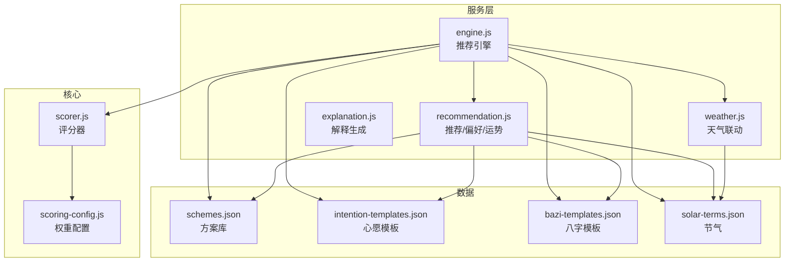
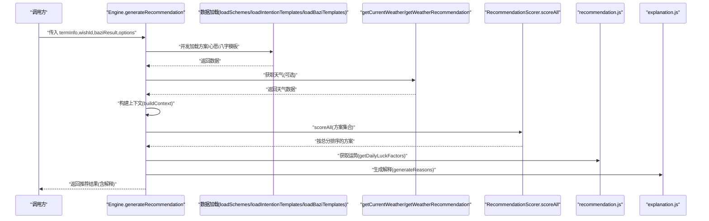
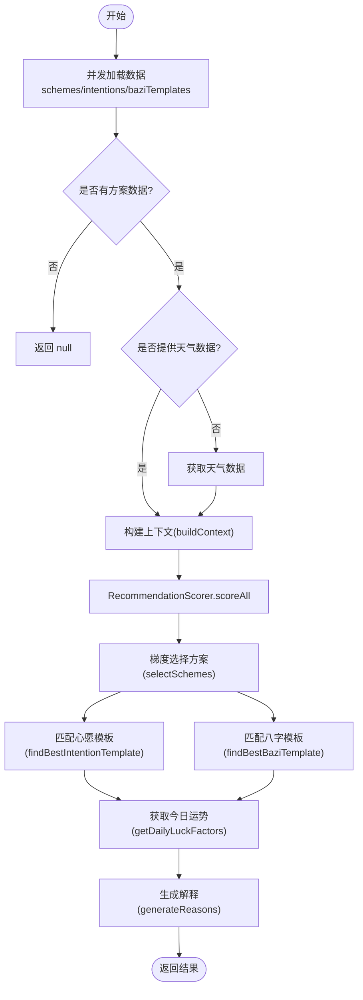
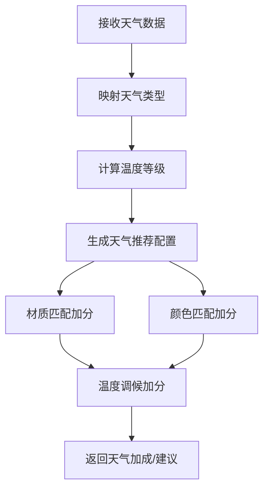
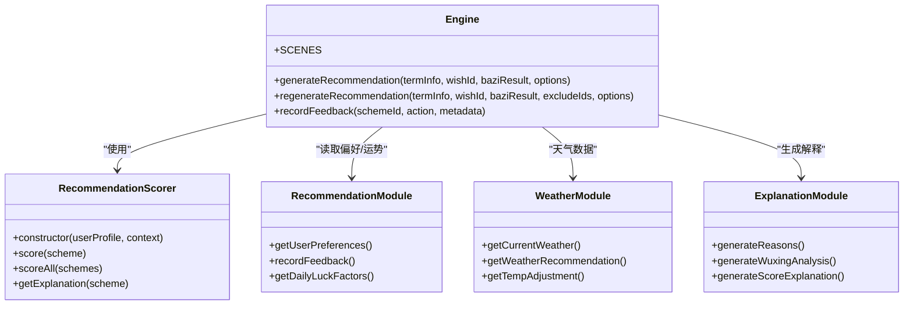
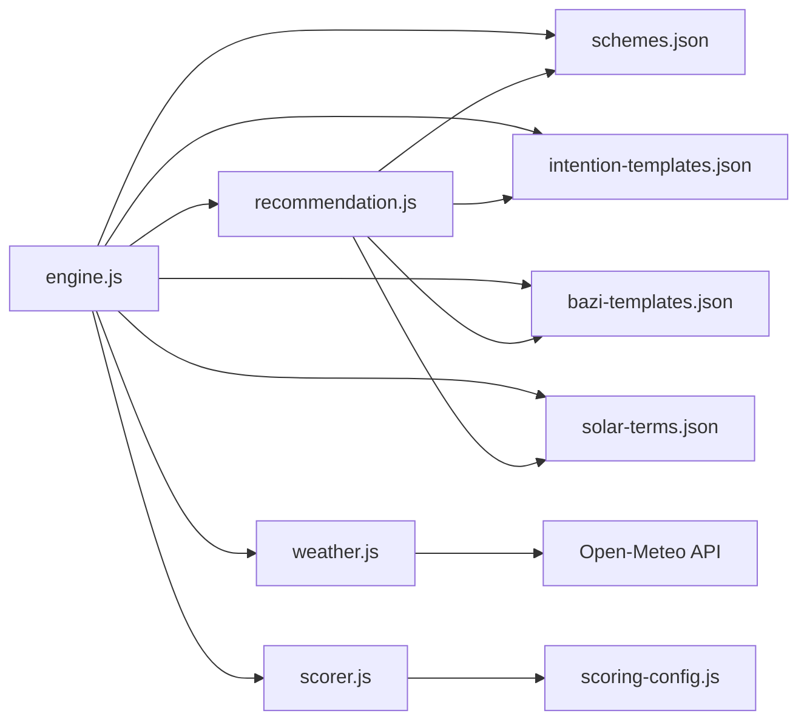

# 引擎API

<cite>
**本文引用的文件**
- [engine.js](file://js/services/engine.js)
- [recommendation.js](file://js/services/recommendation.js)
- [explanation.js](file://js/services/explanation.js)
- [weather.js](file://js/services/weather.js)
- [scorer.js](file://js/core/scorer.js)
- [scoring-config.js](file://js/core/scoring-config.js)
- [solar-terms.js](file://js/services/solar-terms.js)
- [schemes.json](file://data/schemes.json)
- [intention-templates.json](file://data/intention-templates.json)
- [bazi-templates.json](file://data/bazi-templates.json)
- [solar-terms.json](file://data/solar-terms.json)
- [results.js](file://js/controllers/results.js)
</cite>

## 目录
1. [简介](#简介)
2. [项目结构](#项目结构)
3. [核心组件](#核心组件)
4. [架构总览](#架构总览)
5. [详细组件分析](#详细组件分析)
6. [依赖分析](#依赖分析)
7. [性能考虑](#性能考虑)
8. [故障排查指南](#故障排查指南)
9. [结论](#结论)
10. [附录](#附录)

## 简介
本文件面向“推荐引擎”模块，系统化梳理 Engine 类对外公开的接口与内部实现，重点覆盖以下能力：
- generateRecommendations(): 完整推荐生成流程、数据整合与算法调用
- processUserInput(): 用户输入处理（清洗、格式转换、验证）
- getSchemeDetails(): 方案详情查询、图片加载与描述生成
- optimizeForWeather(): 天气适配的条件筛选、动态调整与实时更新
- getExplanations(): 解释生成（文本生成、模板填充、个性化定制）
- getUserPreferences(): 偏好获取（配置读取、默认值处理、缓存机制）

同时提供接口签名、参数校验、返回值结构、错误处理策略以及最佳实践与性能优化建议。

## 项目结构
推荐引擎位于 js/services/engine.js，围绕“评分器 + 权重配置 + 数据源 + 天气联动 + 解释生成”的分层设计组织，核心文件如下：
- 引擎服务：engine.js
- 推荐与偏好：recommendation.js
- 解释生成：explanation.js
- 天气联动：weather.js
- 评分器与权重：scorer.js、scoring-config.js
- 节气工具：solar-terms.js
- 数据资源：schemes.json、intention-templates.json、bazi-templates.json、solar-terms.json

图表来源
- [engine.js](file://js/services/engine.js#L1-L425)
- [recommendation.js](file://js/services/recommendation.js#L1-L466)
- [weather.js](file://js/services/weather.js#L1-L340)
- [scorer.js](file://js/core/scorer.js#L1-L317)
- [scoring-config.js](file://js/core/scoring-config.js#L1-L128)
- [schemes.json](file://data/schemes.json#L1-L509)
- [intention-templates.json](file://data/intention-templates.json#L1-L493)
- [bazi-templates.json](file://data/bazi-templates.json#L1-L103)
- [solar-terms.json](file://data/solar-terms.json#L1-L42)

章节来源
- [engine.js](file://js/services/engine.js#L1-L425)
- [recommendation.js](file://js/services/recommendation.js#L1-L466)
- [weather.js](file://js/services/weather.js#L1-L340)
- [scorer.js](file://js/core/scorer.js#L1-L317)
- [scoring-config.js](file://js/core/scoring-config.js#L1-L128)
- [schemes.json](file://data/schemes.json#L1-L509)
- [intention-templates.json](file://data/intention-templates.json#L1-L493)
- [bazi-templates.json](file://data/bazi-templates.json#L1-L103)
- [solar-terms.json](file://data/solar-terms.json#L1-L42)

## 核心组件
- Engine 模块（engine.js）：封装 generateRecommendations()、regenerateRecommendation() 等入口方法；负责数据加载、上下文构建、方案选择与解释输出。
- Recommendation 模块（recommendation.js）：提供 getUserPreferences()、recordFeedback()、getDailyLuckFactors() 等；维护偏好缓存与反馈闭环。
- Scorer 评分器（scorer.js）：封装评分计算、权重应用、解释生成。
- Scoring 配置（scoring-config.js）：定义权重、五行关系、等级阈值。
- Weather 模块（weather.js）：天气数据获取、类型映射、温度等级与调候建议。
- Explanation 模块（explanation.js）：解释文案生成、五行分析、分数解释。
- Solar Terms（solar-terms.js）：节气检测、名称映射、颜色映射。
- 数据资源（JSON）：方案、心愿模板、八字模板、节气。

章节来源
- [engine.js](file://js/services/engine.js#L323-L393)
- [recommendation.js](file://js/services/recommendation.js#L224-L231)
- [scorer.js](file://js/core/scorer.js#L14-L317)
- [scoring-config.js](file://js/core/scoring-config.js#L7-L128)
- [weather.js](file://js/services/weather.js#L119-L138)
- [explanation.js](file://js/services/explanation.js#L25-L111)
- [solar-terms.js](file://js/services/solar-terms.js#L33-L100)
- [schemes.json](file://data/schemes.json#L1-L509)
- [intention-templates.json](file://data/intention-templates.json#L1-L493)
- [bazi-templates.json](file://data/bazi-templates.json#L1-L103)
- [solar-terms.json](file://data/solar-terms.json#L1-L42)

## 架构总览
推荐引擎采用“数据驱动 + 评分器 + 天气联动 + 解释生成”的流水线式架构。外部调用通过 generateRecommendations() 触发，内部按阶段完成数据加载、上下文构建、评分与选择、解释生成，并返回统一的结果结构。

图表来源
- [engine.js](file://js/services/engine.js#L323-L393)
- [recommendation.js](file://js/services/recommendation.js#L124-L137)
- [weather.js](file://js/services/weather.js#L135-L138)
- [scorer.js](file://js/core/scorer.js#L266-L276)
- [explanation.js](file://js/services/explanation.js#L25-L111)

## 详细组件分析

### Engine 接口与实现概览
Engine 暴露的核心方法包括：
- generateRecommendation(termInfo, wishId, baziResult, options): 主流程入口，返回包含方案与解释的完整结果
- regenerateRecommendation(termInfo, wishId, baziResult, excludeIds, options): 在已有上下文基础上重新选择方案
- recordFeedback / SCENES（导出）：反馈记录与场景定义

章节来源
- [engine.js](file://js/services/engine.js#L323-L393)
- [engine.js](file://js/services/engine.js#L398-L421)
- [engine.js](file://js/services/engine.js#L424-L425)

#### generateRecommendations() 推荐生成方法
- 输入参数
  - termInfo: 节气信息（包含当前节气ID、名称、五行）
  - wishId: 心愿ID（映射到 INTENTION_MAP）
  - baziResult: 八字分析结果（包含推荐/最强五行等）
  - options: { sceneId, weatherData, userPreferences }
- 数据加载
  - 并发加载 schemes、intention-templates、bazi-templates
  - 若未提供 weatherData，则调用 getCurrentWeather()
- 上下文构建
  - buildContext: 包含节气五行、心愿、八字、天气、场景偏好、今日运势
  - 天气推荐与温度等级扩展
- 方案选择
  - 使用 RecommendationScorer.scoreAll 对方案批量评分
  - 采用梯度策略：最佳匹配 + 保守替代 + 平衡方案 + 补充
- 解释生成
  - 为每个方案生成解释列表（节气、八字、场景、运势、个性化）
- 返回结构
  - schemes: 选中的方案数组（含 _score/_breakdown/_type）
  - termInfo / wishId / sceneId / baziResult / baziTemplate / dailyLuck / weather
  - generatedAt / explanations（用于前端展示）

图表来源
- [engine.js](file://js/services/engine.js#L323-L393)
- [engine.js](file://js/services/engine.js#L218-L299)
- [scorer.js](file://js/core/scorer.js#L266-L276)
- [recommendation.js](file://js/services/recommendation.js#L124-L137)
- [explanation.js](file://js/services/explanation.js#L25-L111)

章节来源
- [engine.js](file://js/services/engine.js#L323-L393)
- [engine.js](file://js/services/engine.js#L218-L299)
- [scorer.js](file://js/core/scorer.js#L266-L276)
- [recommendation.js](file://js/services/recommendation.js#L124-L137)
- [explanation.js](file://js/services/explanation.js#L25-L111)

#### processUserInput() 用户输入处理
- 数据清洗
  - wishId 映射：通过 INTENTION_MAP 将输入映射为标准心愿名称
  - termInfo 校验：确保包含 current.id、name、wuxing
  - baziResult 校验：确保包含 recommend.recommend / recommend.strongest
- 格式转换
  - 将 wishId 转换为模板匹配键
  - 将当前年份注入到 baZiKey 匹配逻辑
- 验证规则
  - schemes 存在性校验
  - 必要字段存在性校验（termId、bazi.recommend）
  - 可选字段（weatherData、userPreferences）容错处理
- 错误处理
  - 无方案数据时返回 null
  - 天气获取异常时记录日志并继续执行

章节来源
- [engine.js](file://js/services/engine.js#L16-L37)
- [engine.js](file://js/services/engine.js#L323-L393)
- [engine.js](file://js/services/engine.js#L338-L346)

#### getSchemeDetails() 方案详情获取
- 查询流程
  - 从 schemes.json 中按 id 查找对应方案
  - 返回包含 color、material、feeling、annotation、source 的完整方案对象
- 图片加载
  - 前端渲染层负责根据 color.name 或 material 关联图片资源
- 描述生成
  - annotation 与 source 字段直接用于展示
  - 可结合解释模块生成更丰富的文案

章节来源
- [schemes.json](file://data/schemes.json#L1-L509)

#### optimizeForWeather() 天气适配
- 条件筛选
  - 根据天气类型（sunny/clear/rain/snow/storm/fog/cloudy）与温度等级（hot/warm/comfortable/cool/cold）进行匹配
- 动态调整
  - 材质匹配：若方案材料包含推荐材质，给予加分
  - 颜色匹配：若方案颜色属于推荐颜色，给予加分
  - 温度调候：若方案五行与温度五行相克，视为调候得当，给予加分
- 实时更新
  - 通过 getWeatherRecommendation() 与 getTempAdjustment() 动态生成推荐配置
  - 将 tempLevel 注入上下文，供评分器使用

图表来源
- [weather.js](file://js/services/weather.js#L184-L260)
- [weather.js](file://js/services/weather.js#L203-L240)

章节来源
- [weather.js](file://js/services/weather.js#L184-L260)
- [weather.js](file://js/services/weather.js#L203-L240)

#### getExplanations() 解释生成
- 文本生成
  - generateReasons: 基于上下文生成多条解释（节气、八字、场景、运势、个性化）
  - generateWuxingAnalysis: 生成五行解析（当前状态、推荐、关系）
  - generateScoreExplanation: 生成分数解释（基础匹配、个性化、场景适配、今日运势）
- 模板填充
  - 使用 WUXING_NAMES/WUXING_COLORS 等映射表进行本地化与样式化
- 个性化定制
  - 结合 getUserPreferences() 与 getDailyLuckFactors() 动态生成个性化解释

章节来源
- [explanation.js](file://js/services/explanation.js#L25-L111)
- [explanation.js](file://js/services/explanation.js#L118-L151)
- [explanation.js](file://js/services/explanation.js#L159-L199)
- [recommendation.js](file://js/services/recommendation.js#L224-L231)
- [recommendation.js](file://js/services/recommendation.js#L124-L137)

#### getUserPreferences() 偏好获取
- 配置读取
  - 从 localStorage 读取 USER_PREFERENCES_KEY
- 默认值处理
  - 若不存在，返回默认偏好结构（wuxingScores/colorScores/materialScores/sceneScores）
- 缓存机制
  - 通过 safeStorage 包装 localStorage 操作，保证异常安全
  - 偏好更新通过 recordFeedback() 与 updateUserPreferences() 实时写入

章节来源
- [recommendation.js](file://js/services/recommendation.js#L224-L231)
- [recommendation.js](file://js/services/recommendation.js#L192-L218)

### Engine 类关系图

图表来源
- [engine.js](file://js/services/engine.js#L323-L421)
- [scorer.js](file://js/core/scorer.js#L14-L317)
- [recommendation.js](file://js/services/recommendation.js#L224-L231)
- [weather.js](file://js/services/weather.js#L135-L138)
- [explanation.js](file://js/services/explanation.js#L25-L111)

## 依赖分析
- 内部依赖
  - engine.js 依赖 recommendation.js（偏好/运势）、weather.js（天气）、scorer.js（评分器）、scoring-config.js（权重）
  - recommendation.js 依赖 localStorage（safeStorage 包装）
  - explanation.js 依赖 recommendation.js（偏好/运势）
- 外部依赖
  - data/*.json：方案、模板、节气
  - Open-Meteo API：天气数据获取
- 耦合与内聚
  - Engine 作为编排者，职责清晰；评分器独立可测试；模块间通过明确接口交互

图表来源
- [engine.js](file://js/services/engine.js#L6-L9)
- [recommendation.js](file://js/services/recommendation.js#L6-L29)
- [weather.js](file://js/services/weather.js#L119-L129)
- [scorer.js](file://js/core/scorer.js#L6-L12)
- [scoring-config.js](file://js/core/scoring-config.js#L7-L18)

章节来源
- [engine.js](file://js/services/engine.js#L6-L9)
- [recommendation.js](file://js/services/recommendation.js#L6-L29)
- [weather.js](file://js/services/weather.js#L119-L129)
- [scorer.js](file://js/core/scorer.js#L6-L12)
- [scoring-config.js](file://js/core/scoring-config.js#L7-L18)

## 性能考虑
- 并发加载：generateRecommendation() 使用 Promise.all 并发加载数据，显著降低首屏等待
- 缓存策略：schemes/intentions/baziTemplates 首次加载后缓存，避免重复请求
- 评分器缓存：RecommendationScorer 内部 Map 缓存单方案评分结果，减少重复计算
- 权重动态：getDynamicWeights() 根据用户画像动态分配权重，避免无效计算
- 天气数据：仅在未提供时才发起网络请求，且通过 getTempAdjustment() 本地计算温度等级
- 建议
  - 对高频调用的评分结果进行 LRU 缓存
  - 将 JSON 数据预热到内存或 Service Worker 缓存
  - 对天气 API 增加超时与重试策略

[本节为通用指导，无需特定文件来源]

## 故障排查指南
- 无方案数据
  - 现象：generateRecommendation() 返回 null
  - 排查：确认 schemes.json 是否正确加载；检查 data 目录路径
- 天气获取失败
  - 现象：控制台打印“天气数据不可用”，但仍继续生成推荐
  - 排查：检查网络权限与 Open-Meteo API 可达性；确认浏览器地理位置权限
- 偏好读取异常
  - 现象：getUserPreferences() 抛错或返回空
  - 排查：确认 safeStorage 包装是否生效；检查 localStorage 是否可用
- 八字/心愿模板未命中
  - 现象：baziTemplate/intentionTemplate 为空
  - 排查：确认 wishId 映射与 baZiKey/year 匹配逻辑；检查模板文件完整性

章节来源
- [engine.js](file://js/services/engine.js#L333-L336)
- [engine.js](file://js/services/engine.js#L340-L346)
- [recommendation.js](file://js/services/recommendation.js#L12-L29)
- [recommendation.js](file://js/services/recommendation.js#L192-L218)

## 结论
推荐引擎通过清晰的模块划分与数据驱动的评分体系，实现了高可扩展性与可维护性的推荐流程。Engine 作为编排核心，结合 RecommendationScorer 的可测试评分器、Weather 的实时联动与 Explanation 的个性化解释，形成完整的“生成-解释-反馈”闭环。建议在生产环境中进一步完善缓存与错误处理策略，以提升用户体验与系统稳定性。

[本节为总结性内容，无需特定文件来源]

## 附录

### 接口签名与返回值规范
- generateRecommendation(termInfo, wishId, baziResult, options)
  - 参数
    - termInfo: { current: { id, name, wuxing } }
    - wishId: string
    - baziResult: { recommend: { recommend, strongest } }
    - options: { sceneId?, weatherData?, userPreferences? }
  - 返回
    - { schemes, termInfo, wishId, sceneId, baziResult, baziTemplate?, dailyLuck, weather?, generatedAt, explanations? }

- regenerateRecommendation(termInfo, wishId, baziResult, excludeIds, options)
  - 参数
    - excludeIds: string[]
    - options: { sceneId? }
  - 返回
    - { schemes, termInfo, wishId, sceneId, baziResult, dailyLuck, generatedAt }

- getUserPreferences()
  - 返回
    - { wuxingScores, colorScores, materialScores, sceneScores }

- recordFeedback(schemeId, action, metadata)
  - action: 'view' | 'favorite' | 'select' | 'dismiss'

章节来源
- [engine.js](file://js/services/engine.js#L323-L393)
- [engine.js](file://js/services/engine.js#L398-L421)
- [recommendation.js](file://js/services/recommendation.js#L224-L231)
- [recommendation.js](file://js/services/recommendation.js#L145-L184)

### 最佳实践
- 输入校验：始终对 termInfo、baziResult、options 进行存在性与结构校验
- 缓存优先：优先使用已加载的数据与评分缓存，避免重复 IO
- 权重平衡：合理设置权重，避免某单一维度过度主导
- 解释可读：解释文案应简洁、可读、可操作，便于用户采纳
- 错误降级：在网络或存储异常时，启用默认值与降级策略，保证可用性

[本节为通用指导，无需特定文件来源]