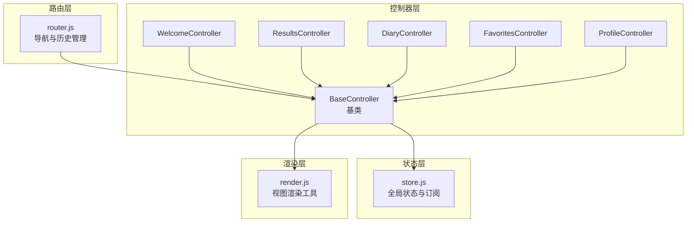
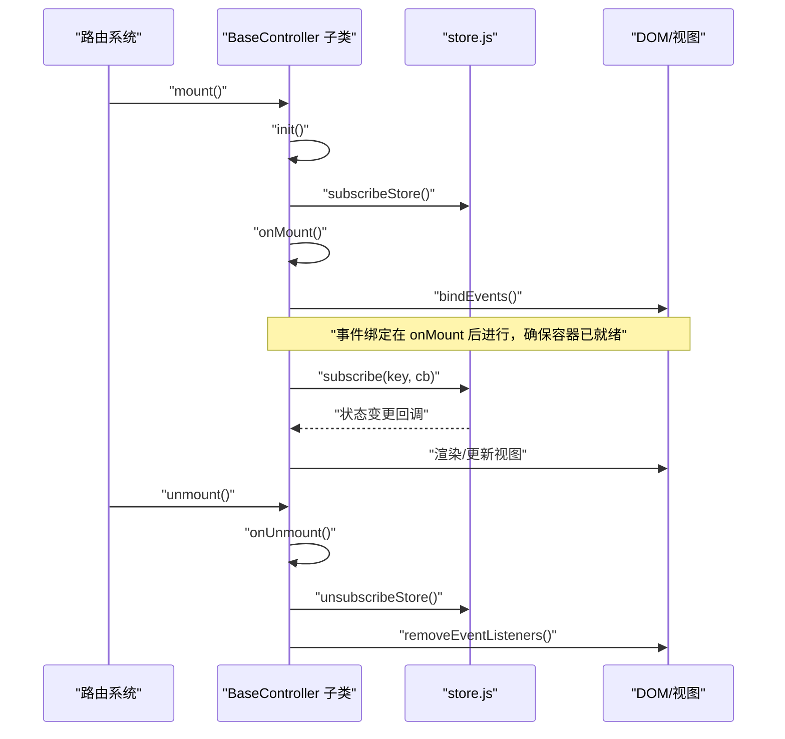
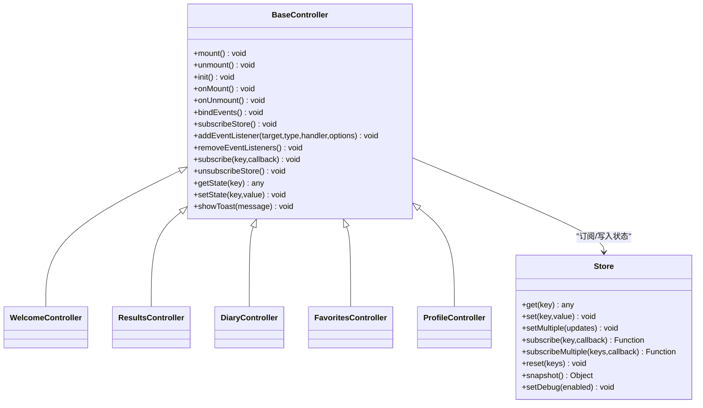

# 控制器API

<cite>
**本文引用的文件**
- [js/controllers/base.js](file://js/controllers/base.js)
- [js/core/store.js](file://js/core/store.js)
- [js/controllers/diary.js](file://js/controllers/diary.js)
- [js/controllers/results.js](file://js/controllers/results.js)
- [js/controllers/welcome.js](file://js/controllers/welcome.js)
- [js/controllers/favorites.js](file://js/controllers/favorites.js)
- [js/controllers/profile.js](file://js/controllers/profile.js)
- [js/utils/render.js](file://js/utils/render.js)
- [js/core/router.js](file://js/core/router.js)
</cite>

## 目录
1. [简介](#简介)
2. [项目结构](#项目结构)
3. [核心组件](#核心组件)
4. [架构总览](#架构总览)
5. [详细组件分析](#详细组件分析)
6. [依赖关系分析](#依赖关系分析)
7. [性能考量](#性能考量)
8. [故障排查指南](#故障排查指南)
9. [结论](#结论)
10. [附录](#附录)

## 简介
本文件面向控制器开发者，系统性梳理 BaseController 基类的公共接口与使用规范，涵盖挂载/卸载生命周期、事件委托与监听管理、状态订阅与变更通知、以及渲染与数据绑定等关键能力。文档同时结合具体控制器实现，说明接口签名、参数校验、错误处理与最佳实践，并提供可视化流程图帮助理解。

## 项目结构
本项目采用“视图-控制器”分离的前端架构：
- 视图通过路由系统动态加载，控制器负责生命周期管理、事件绑定、状态订阅与视图渲染。
- BaseController 提供统一的挂载/卸载流程与通用工具方法；各业务控制器继承自 BaseController 并覆盖生命周期钩子与事件绑定逻辑。
- 全局状态通过 store 管理，控制器通过 getState/subscribe/subscribeStore 等方法与状态交互。

图表来源
- [js/core/router.js](file://js/core/router.js#L1-L142)
- [js/controllers/base.js](file://js/controllers/base.js#L1-L131)
- [js/core/store.js](file://js/core/store.js#L1-L212)
- [js/utils/render.js](file://js/utils/render.js#L1-L487)

章节来源
- [js/core/router.js](file://js/core/router.js#L1-L142)
- [js/controllers/base.js](file://js/controllers/base.js#L1-L131)
- [js/core/store.js](file://js/core/store.js#L1-L212)
- [js/utils/render.js](file://js/utils/render.js#L1-L487)

## 核心组件
本节聚焦 BaseController 的公共接口与职责边界，包括：
- 生命周期：init、onMount、onUnmount
- 挂载/卸载：mount、unmount
- 事件管理：addEventListener、removeEventListeners
- 状态管理：getState、setState、subscribe、unsubscribeStore、subscribeStore
- 辅助：showToast

章节来源
- [js/controllers/base.js](file://js/controllers/base.js#L11-L131)

## 架构总览
BaseController 与子类控制器的协作关系如下：
- 子类通过覆盖 init/subscribeStore/bindEvents/onMount/onUnmount 等方法实现业务逻辑。
- BaseController 在 mount/unmount 中编排生命周期顺序，确保事件绑定在容器可用后再进行。
- 状态通过 store 的 subscribe 机制驱动视图更新；控制器也可直接 setState 写入状态。

图表来源
- [js/controllers/base.js](file://js/controllers/base.js#L21-L42)
- [js/core/store.js](file://js/core/store.js#L99-L141)

章节来源
- [js/controllers/base.js](file://js/controllers/base.js#L18-L67)
- [js/core/store.js](file://js/core/store.js#L99-L141)

## 详细组件分析

### BaseController 基类 API

- 接口概览
  - mount(): void
  - unmount(): void
  - init(): void
  - onMount(): void
  - onUnmount(): void
  - bindEvents(): void
  - subscribeStore(): void
  - addEventListener(target, type, handler, options?): void
  - removeEventListeners(): void
  - subscribe(key, callback): void
  - unsubscribeStore(): void
  - getState(key): any
  - setState(key, value): void
  - showToast(message): void

- 初始化流程（mount）
  - 防重复挂载：若已挂载则直接返回
  - 调用 init() 完成子类初始化
  - 调用 subscribeStore() 订阅状态变化
  - 标记 isMounted = true
  - 调用 onMount()，子类在此阶段通常获取容器并首次渲染
  - 最后调用 bindEvents() 进行事件绑定（注意：事件绑定放在 onMount 之后，保证容器已就绪）

- 卸载流程（unmount）
  - 防重复卸载：未挂载则直接返回
  - 调用 onUnmount()，子类在此阶段清理内部资源
  - 调用 unsubscribeStore() 取消所有状态订阅
  - 调用 removeEventListeners() 解绑所有事件监听
  - 标记 isMounted = false

- 事件管理
  - addEventListener(target, type, handler, options?)：注册事件监听并记录到内部列表，便于统一解绑
  - removeEventListeners()：遍历内部记录，逐个移除监听

- 状态管理
  - getState(key)：从 store 获取状态值
  - setState(key, value)：写入状态，触发 store 的变更通知（由 store 内部代理拦截）
  - subscribe(key, callback)：订阅某状态键的变化，返回取消订阅函数
  - unsubscribeStore()：批量取消订阅
  - subscribeStore()：子类覆盖以实现按需订阅状态键

- 辅助方法
  - showToast(message)：通过全局事件派发 toast 消息，供全局 toast 组件消费

章节来源
- [js/controllers/base.js](file://js/controllers/base.js#L18-L131)
- [js/core/store.js](file://js/core/store.js#L69-L110)

### 生命周期钩子详解

- init()
  - 用途：子类初始化，如设置默认状态、准备数据源
  - 注意：此时容器尚未就绪，不要尝试 DOM 查询或事件绑定
  - 示例参考：DiaryController 在 init() 中初始化日期与视图模式

- onMount()
  - 用途：容器已就绪后的首次渲染与事件绑定
  - 注意：子类通常在此处获取容器、首次渲染视图、绑定事件
  - 示例参考：ResultsController 在 onMount() 中获取容器、渲染结果、绑定事件

- onUnmount()
  - 用途：卸载前清理，如取消定时器、停止动画、解除外部订阅
  - 示例参考：各控制器在 onUnmount() 中重置事件绑定标志位

章节来源
- [js/controllers/diary.js](file://js/controllers/diary.js#L20-L38)
- [js/controllers/results.js](file://js/controllers/results.js#L20-L46)
- [js/controllers/favorites.js](file://js/controllers/favorites.js#L85-L89)
- [js/controllers/profile.js](file://js/controllers/profile.js#L87-L89)

### 事件处理与委托

- 事件委托策略
  - 子类在 bindEvents() 中注册事件监听，优先使用容器元素进行事件委托，减少监听器数量
  - 对于动态内容（如列表项），通过容器监听 click 事件并使用 closest() 精确识别目标元素
  - 通过 addEventListener() 注册的监听会被统一记录，便于在卸载时批量移除

- 参数传递与事件对象
  - 事件处理器接收标准 Event 对象，可通过 dataset、target、currentTarget 等属性读取上下文
  - 对于列表项操作，通常通过 data-* 属性传递索引或标识

- 示例参考
  - ResultsController 在 bindEvents() 中对方案卡片容器进行委托，处理收藏、分享、查看详情、反馈等操作
  - FavoritesController 在 bindEvents() 中对收藏列表进行委托，处理取消收藏与查看详情

章节来源
- [js/controllers/results.js](file://js/controllers/results.js#L255-L359)
- [js/controllers/favorites.js](file://js/controllers/favorites.js#L32-L67)

### 状态订阅与变更通知

- 订阅机制
  - 子类覆盖 subscribeStore()，调用 subscribe(key, callback) 订阅所需状态键
  - subscribe() 返回取消订阅函数，BaseController 内部会收集这些函数以便统一取消
  - 变更通知由 store 内部代理拦截并在值真正改变时触发回调

- 变更检测
  - store 使用 Proxy 拦截 set 操作，仅在新旧值不相等时触发通知
  - 订阅者错误被静默处理，避免影响其他订阅者

- 写入状态
  - 子类通过 setState(key, value) 写入状态，触发 store 的变更通知
  - 若需要批量更新，可使用 store.setMultiple()

- 示例参考
  - ResultsController 在 onMount() 中通过 getState(StateKeys.CURRENT_RESULT) 获取当前推荐结果并渲染
  - router.js 在导航时通过 store.set(StateKeys.CURRENT_VIEW, ...) 更新当前视图状态

章节来源
- [js/core/store.js](file://js/core/store.js#L11-L25)
- [js/core/store.js](file://js/core/store.js#L99-L141)
- [js/controllers/results.js](file://js/controllers/results.js#L31-L45)
- [js/core/router.js](file://js/core/router.js#L77-L78)

### 渲染与视图更新

- 渲染职责划分
  - BaseController 负责生命周期与事件管理；渲染主要由工具模块完成
  - 子类在 onMount() 中调用渲染工具函数（如 renderSchemeCards、renderResultHeader 等）进行视图更新
  - 渲染工具函数负责 DOM 操作与 UI 更新

- 渲染工具函数
  - renderSchemeCards(schemes)：渲染推荐方案卡片列表
  - renderResultHeader(termInfo)：渲染结果页标题
  - renderDetailModal(scheme, context)：渲染详情模态框
  - renderFavoritesList(favorites)：渲染收藏列表
  - showToast(message)：全局 toast 消息展示

- 示例参考
  - ResultsController 在 onMount() 中调用 renderSchemeCards 与 renderResultHeader
  - FavoritesController 在 onMount() 中调用 renderFavoritesList
  - DiaryController 在 renderCalendar()/renderTimeline() 中直接更新 DOM

章节来源
- [js/utils/render.js](file://js/utils/render.js#L119-L132)
- [js/utils/render.js](file://js/utils/render.js#L109-L114)
- [js/utils/render.js](file://js/utils/render.js#L324-L365)
- [js/utils/render.js](file://js/utils/render.js#L429-L452)
- [js/utils/render.js](file://js/utils/render.js#L457-L486)
- [js/controllers/results.js](file://js/controllers/results.js#L30-L45)
- [js/controllers/favorites.js](file://js/controllers/favorites.js#L27-L30)
- [js/controllers/diary.js](file://js/controllers/diary.js#L163-L206)

### 接口签名与参数校验

- mount()
  - 签名：mount(): void
  - 行为：幂等，重复调用无副作用
  - 错误处理：无显式异常抛出，内部通过 isMounted 防止重复挂载

- unmount()
  - 签名：unmount(): void
  - 行为：幂等，重复调用无副作用
  - 错误处理：无显式异常抛出，内部通过 isMounted 防止重复卸载

- addEventListener(target, type, handler, options?)
  - 签名：addEventListener(target, type, handler, options?): void
  - 参数校验：target 必须为 EventTarget；type 必须为字符串；handler 必须为函数；options 可选
  - 错误处理：若传入非法参数，addEventListener 将抛出标准 DOM 异常

- subscribe(key, callback)
  - 签名：subscribe(key, callback): Function
  - 参数校验：key 必须为字符串；callback 必须为函数
  - 返回值：取消订阅函数，调用后移除该回调

- getState(key)/setState(key, value)
  - 签名：getState(key): any；setState(key, value): void
  - 参数校验：key 必须为字符串；value 可为任意类型
  - 错误处理：store 内部通过 Proxy 拦截 set，仅在值真正改变时触发通知

- showToast(message)
  - 签名：showToast(message): void
  - 参数校验：message 必须为字符串
  - 错误处理：通过全局事件派发，不阻塞主线程

章节来源
- [js/controllers/base.js](file://js/controllers/base.js#L21-L131)
- [js/core/store.js](file://js/core/store.js#L69-L110)

### 实际使用示例

- 基本挂载/卸载
  - 子类在路由导航时调用 mount() 完成初始化与渲染；在离开视图时调用 unmount() 清理资源
  - 参考：router.js 在导航时更新 store 状态，间接驱动控制器生命周期

- 事件委托与参数传递
  - ResultsController 在 bindEvents() 中对卡片容器进行委托，通过 dataset.index 传递索引
  - FavoritesController 在 handleListClick() 中识别 .scheme-favorite-btn 与 .scheme-detail-btn 并执行对应操作

- 状态订阅与渲染
  - ResultsController 在 onMount() 中通过 getState(StateKeys.CURRENT_RESULT) 获取推荐结果并调用 renderSchemeCards
  - router.js 在 navigateTo() 中通过 store.set(StateKeys.CURRENT_VIEW, ...) 更新当前视图

章节来源
- [js/core/router.js](file://js/core/router.js#L57-L79)
- [js/controllers/results.js](file://js/controllers/results.js#L255-L359)
- [js/controllers/favorites.js](file://js/controllers/favorites.js#L54-L67)

## 依赖关系分析

图表来源
- [js/controllers/base.js](file://js/controllers/base.js#L11-L131)
- [js/core/store.js](file://js/core/store.js#L30-L187)

章节来源
- [js/controllers/base.js](file://js/controllers/base.js#L11-L131)
- [js/core/store.js](file://js/core/store.js#L30-L187)

## 性能考量
- 事件委托与批量解绑
  - 使用容器级事件委托减少监听器数量，提高事件处理性能
  - 在卸载时统一调用 removeEventListeners()，避免内存泄漏

- 状态变更通知
  - store 使用 Proxy 拦截 set，仅在值真正改变时触发通知，避免无效渲染
  - 订阅者错误静默处理，防止个别订阅者异常影响整体性能

- DOM 操作
  - 渲染工具函数集中处理 DOM 更新，减少重复查询与多次重排
  - 对于列表渲染，优先使用一次性 innerHTML 或批量 appendChild

- 生命周期顺序
  - 将事件绑定放在 onMount() 之后，确保容器已就绪，避免不必要的查询失败与重试

章节来源
- [js/controllers/base.js](file://js/controllers/base.js#L72-L85)
- [js/core/store.js](file://js/core/store.js#L11-L25)
- [js/utils/render.js](file://js/utils/render.js#L119-L132)

## 故障排查指南
- 重复挂载/卸载
  - 现象：控制台出现重复初始化或事件重复绑定
  - 处理：确认 isMounted 标志位，避免在未卸载的情况下重复 mount()

- 事件未解绑导致内存泄漏
  - 现象：切换视图后仍响应旧事件
  - 处理：确保在 onUnmount() 中调用 unsubscribeStore() 与 removeEventListeners()

- 容器未找到
  - 现象：onMount() 报错“Container not found”
  - 处理：确认视图已动态加载且容器 ID 正确；在 onMount() 中添加容错与日志输出

- 状态未更新
  - 现象：视图未随状态变化刷新
  - 处理：检查 subscribeStore() 是否正确订阅；确认 setState(key, value) 写入了正确的 key；核对 store.setMultiple() 使用

- 事件委托失效
  - 现象：动态内容点击无响应
  - 处理：确保委托容器存在且事件在委托容器上注册；使用 closest() 精确识别目标元素

章节来源
- [js/controllers/base.js](file://js/controllers/base.js#L21-L42)
- [js/controllers/diary.js](file://js/controllers/diary.js#L25-L31)
- [js/controllers/results.js](file://js/controllers/results.js#L20-L26)

## 结论
BaseController 为控制器提供了清晰的生命周期与事件/状态管理抽象，使各业务控制器能够专注于视图渲染与交互逻辑。遵循“先初始化、再订阅、后挂载、最后事件绑定”的顺序，配合统一的事件委托与状态订阅机制，可显著提升应用的可维护性与性能。建议在实际开发中严格遵守接口签名与参数校验，完善错误处理与资源清理，确保良好的用户体验与稳定性。

## 附录

### BaseController 方法速查
- mount(): void —— 挂载控制器，编排生命周期顺序
- unmount(): void —— 卸载控制器，清理资源
- init(): void —— 子类初始化
- onMount(): void —— 容器就绪后的首次渲染与事件绑定
- onUnmount(): void —— 卸载前清理
- bindEvents(): void —— 子类事件绑定
- subscribeStore(): void —— 子类状态订阅
- addEventListener(target, type, handler, options?): void —— 注册事件监听
- removeEventListeners(): void —— 解绑所有事件监听
- subscribe(key, callback): Function —— 订阅状态变化
- unsubscribeStore(): void —— 取消所有状态订阅
- getState(key): any —— 获取状态值
- setState(key, value): void —— 写入状态
- showToast(message): void —— 全局 toast 消息

章节来源
- [js/controllers/base.js](file://js/controllers/base.js#L18-L131)