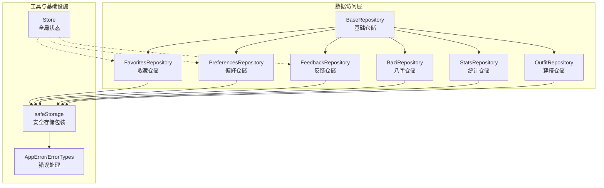
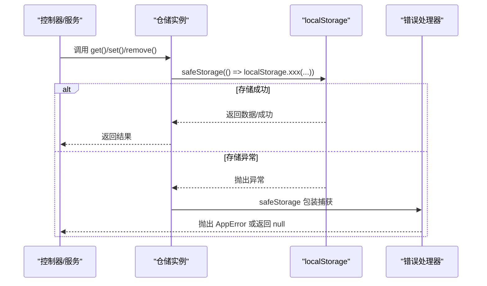
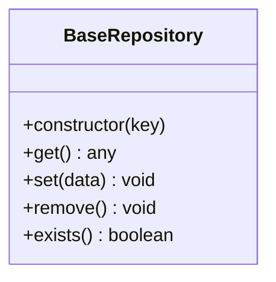
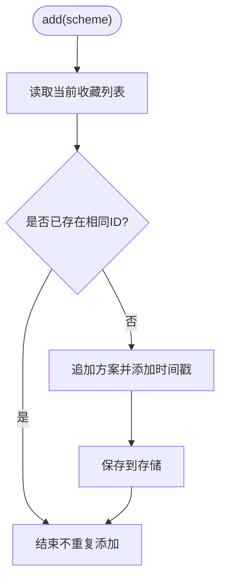
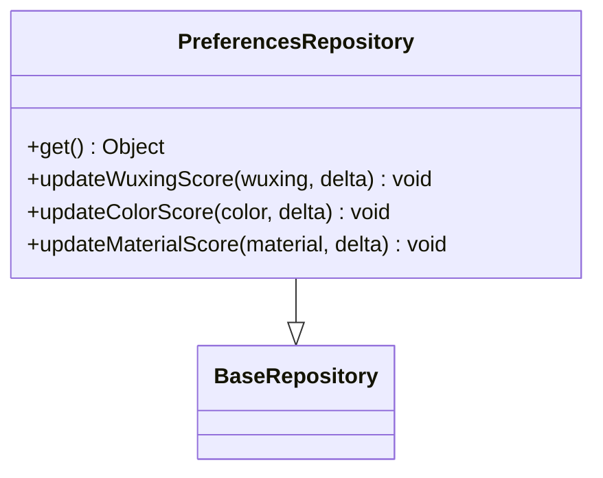
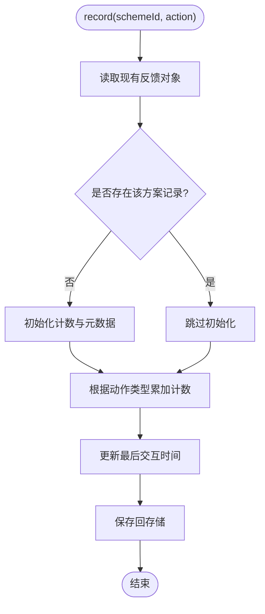
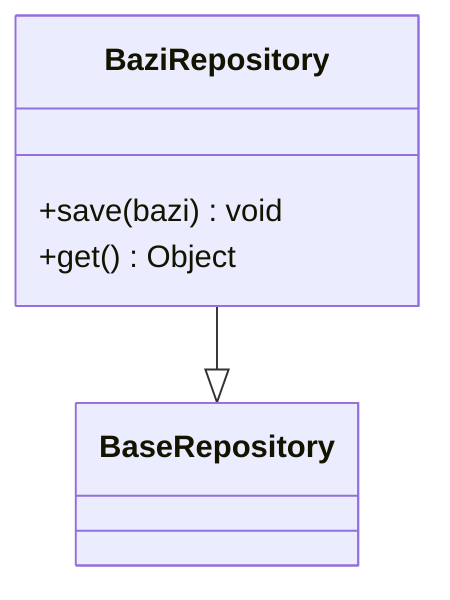
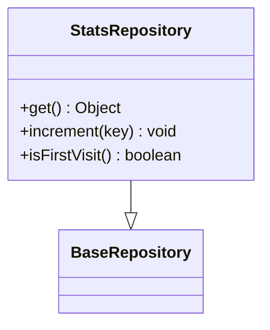
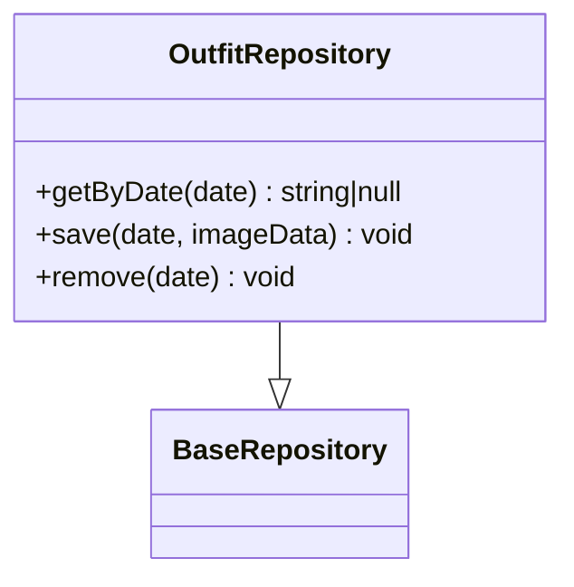
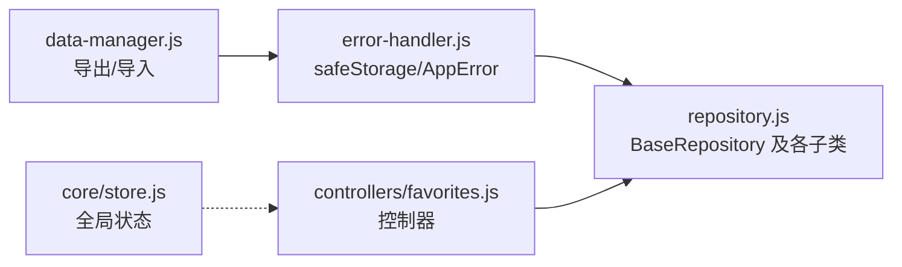

# 数据访问API

<cite>
**本文引用的文件**
- [repository.js](file://js/data/repository.js)
- [storage.js](file://js/data/storage.js)
- [data-manager.js](file://js/data/data-manager.js)
- [error-handler.js](file://js/core/error-handler.js)
- [store.js](file://js/core/store.js)
- [favorites.js](file://js/controllers/favorites.js)
- [favorites.html](file://views/favorites.html)
</cite>

## 目录
1. [简介](#简介)
2. [项目结构](#项目结构)
3. [核心组件](#核心组件)
4. [架构总览](#架构总览)
5. [详细组件分析](#详细组件分析)
6. [依赖关系分析](#依赖关系分析)
7. [性能考虑](#性能考虑)
8. [故障排查指南](#故障排查指南)
9. [结论](#结论)
10. [附录](#附录)

## 简介
本文件为“数据访问API”的权威技术文档，聚焦于仓库层（Repository）的公共接口与设计模式，系统梳理以下能力：
- 查询：find（条件构建、排序规则、分页处理）
- 插入：insert（数据验证、唯一性检查、冲突处理）
- 更新：update（部分更新、版本控制、事务保证）
- 删除：remove（软删除、级联处理、回收站机制）
- 获取全部：getAll（批量查询、缓存策略、性能优化）
- 按ID查找：findById（索引使用、延迟加载、错误处理）

同时，文档提供CRUD接口规范、参数说明、返回值类型、异常处理策略，并总结数据访问的设计模式与最佳实践。

## 项目结构
仓库层位于 js/data 目录，围绕 BaseRepository 抽象基类与若干具体仓储（收藏、偏好、反馈、八字、统计、穿搭照片）展开；配合统一的安全存储包装与错误处理模块，形成可扩展、可维护的数据访问层。

图表来源
- [repository.js](file://js/data/repository.js#L46-L81)
- [repository.js](file://js/data/repository.js#L86-L146)
- [repository.js](file://js/data/repository.js#L151-L201)
- [repository.js](file://js/data/repository.js#L206-L259)
- [repository.js](file://js/data/repository.js#L264-L287)
- [repository.js](file://js/data/repository.js#L292-L337)
- [repository.js](file://js/data/repository.js#L342-L377)
- [error-handler.js](file://js/core/error-handler.js#L149-L163)

章节来源
- [repository.js](file://js/data/repository.js#L1-L394)

## 核心组件
- BaseRepository：提供 get/set/remove/exists 等通用CRUD能力，封装安全存储调用。
- FavoritesRepository：收藏管理，支持添加、移除、存在性检查、计数、清空。
- PreferencesRepository：用户偏好管理，支持五行为、颜色、材质、场景分数的增量更新。
- FeedbackRepository：交互反馈记录，按方案ID聚合视图、收藏、选择、忽略等计数。
- BaziRepository：八字数据持久化，带保存时间戳。
- StatsRepository：使用统计，含首次访问、最近访问、计数器等。
- OutfitRepository：按日期存储上传的穿搭照片，支持查询、保存、删除。

章节来源
- [repository.js](file://js/data/repository.js#L46-L81)
- [repository.js](file://js/data/repository.js#L86-L146)
- [repository.js](file://js/data/repository.js#L151-L201)
- [repository.js](file://js/data/repository.js#L206-L259)
- [repository.js](file://js/data/repository.js#L264-L287)
- [repository.js](file://js/data/repository.js#L292-L337)
- [repository.js](file://js/data/repository.js#L342-L377)

## 架构总览
仓库层通过统一的安全存储包装（safeStorage）进行数据读写，错误通过 AppError 体系统一捕获与上报；控制器通过注入的仓储实例完成业务操作。

图表来源
- [repository.js](file://js/data/repository.js#L24-L41)
- [error-handler.js](file://js/core/error-handler.js#L149-L163)

## 详细组件分析

### BaseRepository 基础仓储
- 职责：封装键名、提供 get/set/remove/exists 等通用方法。
- 设计要点：将 localStorage 的读写包裹在 safeStorage 中，统一异常处理。
- 复杂度：O(1) 读写；内存占用取决于存储数据规模。

图表来源
- [repository.js](file://js/data/repository.js#L46-L81)

章节来源
- [repository.js](file://js/data/repository.js#L46-L81)

### FavoritesRepository 收藏仓储
- getAll：返回收藏数组，默认空数组。
- add：若不存在相同ID则追加并保存，自动附加时间戳字段。
- remove：按ID过滤后保存。
- exists：按ID判断是否已收藏。
- count：返回收藏数量。
- clear：清空收藏列表。

图表来源
- [repository.js](file://js/data/repository.js#L103-L112)

章节来源
- [repository.js](file://js/data/repository.js#L86-L146)

### PreferencesRepository 偏好仓储
- get：返回偏好对象，若无则返回默认结构（五行为、颜色、材质、场景分数）。
- updateWuxingScore/updateColorScore/updateMaterialScore：对相应分数进行增量更新并保存。

图表来源
- [repository.js](file://js/data/repository.js#L151-L201)

章节来源
- [repository.js](file://js/data/repository.js#L151-L201)

### FeedbackRepository 反馈仓储
- getAll：返回以方案ID为键的对象。
- record：按动作类型（view/favorite/select/dismiss）累加计数，并更新最后交互时间。

图表来源
- [repository.js](file://js/data/repository.js#L225-L258)

章节来源
- [repository.js](file://js/data/repository.js#L206-L259)

### BaziRepository 八字仓储
- save：保存八字数据并附加保存时间戳。
- get：继承基础仓储的 get。

图表来源
- [repository.js](file://js/data/repository.js#L264-L287)

章节来源
- [repository.js](file://js/data/repository.js#L264-L287)

### StatsRepository 统计仓储
- get：返回统计对象，若无则返回默认结构（访问次数、生成次数、上传次数、首次/最近访问）。
- increment：对指定计数器进行递增，并在访问计数时设置首次/最近访问时间。
- isFirstVisit：判断是否首次访问。

图表来源
- [repository.js](file://js/data/repository.js#L292-L337)

章节来源
- [repository.js](file://js/data/repository.js#L292-L337)

### OutfitRepository 穿搭仓储
- getByDate：按日期查询照片数据。
- save：按日期保存图片数据。
- remove：按日期删除照片。

图表来源
- [repository.js](file://js/data/repository.js#L342-L377)

章节来源
- [repository.js](file://js/data/repository.js#L342-L377)

### 通用存储工具 storageUtils
- 提供 get/set/remove/clear 等便捷方法，直接基于安全存储包装访问 localStorage。

章节来源
- [repository.js](file://js/data/repository.js#L387-L393)

### 数据导出/导入与备份（Data Manager）
- 支持导出指定键集合、生成备份文件、校验导入数据版本与结构、可选合并/预览模式、一键清空数据。
- 通过统一的安全存储包装执行读写，确保异常可控。

章节来源
- [data-manager.js](file://js/data/data-manager.js#L48-L72)
- [data-manager.js](file://js/data/data-manager.js#L106-L135)
- [data-manager.js](file://js/data/data-manager.js#L143-L184)
- [data-manager.js](file://js/data/data-manager.js#L225-L229)
- [data-manager.js](file://js/data/data-manager.js#L235-L271)

## 依赖关系分析
- 仓储层依赖安全存储包装 safeStorage，后者在 error-handler 中实现，统一捕获存储异常并转换为 AppError。
- 控制器通过注入的仓储实例进行业务操作，如收藏页控制器读取收藏列表并渲染。
- 全局状态 Store 与仓储解耦，但可通过订阅/发布模式在状态变化时触发仓储读写。

图表来源
- [error-handler.js](file://js/core/error-handler.js#L149-L163)
- [repository.js](file://js/data/repository.js#L24-L41)
- [data-manager.js](file://js/data/data-manager.js#L24-L42)
- [favorites.js](file://js/controllers/favorites.js#L8-L30)

章节来源
- [error-handler.js](file://js/core/error-handler.js#L1-L190)
- [repository.js](file://js/data/repository.js#L1-L394)
- [data-manager.js](file://js/data/data-manager.js#L1-L376)
- [favorites.js](file://js/controllers/favorites.js#L1-L52)

## 性能考虑
- 批量查询：getAll 系列方法直接从存储读取，复杂度 O(n)（n为数组长度），建议在UI侧做虚拟滚动或分页展示。
- 写入优化：单次 set 调用整体保存，避免多次序列化/反序列化开销。
- 唯一性检查：add/remove/exists 使用线性扫描，适合小中型数据集；大规模数据建议引入索引或分页+二分查找。
- 缓存策略：当前为内存缓存（localStorage），无显式LRU/过期机制；建议在业务层增加TTL或LRU策略。
- I/O 优化：避免频繁读写，批量更新时合并为一次 set。

[本节为通用指导，无需特定文件来源]

## 故障排查指南
- 存储异常：当存储空间不足或隐私模式导致异常时，safeStorage 将抛出 AppError，错误类型为 STORAGE。
- 网络/解析异常：虽然仓库层主要使用本地存储，但错误处理器也提供 safeFetch/safeJsonParse，便于扩展云端场景。
- 控制器侧错误：收藏页控制器在挂载时动态绑定事件并渲染列表，若容器缺失会输出错误日志；请确认视图模板与控制器容器ID一致。

章节来源
- [error-handler.js](file://js/core/error-handler.js#L149-L163)
- [favorites.js](file://js/controllers/favorites.js#L16-L30)
- [favorites.html](file://views/favorites.html#L1-L17)

## 结论
仓库层以 BaseRepository 为核心抽象，结合安全存储包装与统一错误处理，提供了清晰、可扩展的数据访问接口。针对 CRUD 的不同需求，可在现有仓储基础上扩展条件查询、排序与分页能力；同时建议引入缓存与版本控制机制，提升性能与一致性。

[本节为总结性内容，无需特定文件来源]

## 附录

### CRUD 接口规范与最佳实践

- find 查询
  - 条件构建：当前仓储未提供原生条件构建器；建议在业务层对 getAll 结果进行过滤。
  - 排序规则：建议在业务层对数组进行 sort，支持多字段排序。
  - 分页处理：建议对数组切片实现分页，或在业务层引入游标/偏移量。
  - 返回值：数组或对象；若无匹配返回空数组/空对象。
  - 异常处理：通过安全存储包装统一捕获存储异常。

- insert 插入
  - 数据验证：在调用 add/save 前进行字段校验（必填、类型、范围）。
  - 唯一性检查：使用 exists/exist(schemeId) 避免重复；如需复合唯一，建议在业务层实现。
  - 冲突处理：若发生冲突，返回失败状态或抛出业务异常。
  - 返回值：void；可通过后续 get 验证是否写入成功。
  - 异常处理：通过 safeStorage 包装统一捕获。

- update 更新
  - 部分更新：建议提供部分字段更新方法，避免整包覆盖。
  - 版本控制：可引入版本号字段，比较版本后更新；失败时返回冲突。
  - 事务保证：localStorage 不支持事务；建议在业务层使用原子性写入策略（一次性 set）。
  - 返回值：boolean 或 void；建议返回更新结果。
  - 异常处理：通过 safeStorage 包装统一捕获。

- remove 删除
  - 软删除：建议引入 deletedAt/deleted 标记字段，查询时过滤未删除项。
  - 级联处理：在业务层对关联数据进行清理；仓储层保持单一职责。
  - 回收站机制：可引入回收站集合，支持恢复与清空。
  - 返回值：boolean 或 void；建议返回删除结果。
  - 异常处理：通过 safeStorage 包装统一捕获。

- getAll 获取全部
  - 批量查询：直接读取存储，复杂度 O(n)。
  - 缓存策略：建议在业务层增加内存缓存与失效策略。
  - 性能优化：对大列表进行懒加载、分页或虚拟列表。
  - 返回值：数组或对象；注意默认值处理。
  - 异常处理：通过 safeStorage 包装统一捕获。

- findById 按ID查找
  - 索引使用：当前仓储未提供索引；建议在业务层维护ID到位置的映射。
  - 延迟加载：对大型对象可按需加载子资源。
  - 错误处理：若未找到返回 null/undefined，调用方需判空。
  - 返回值：对象或 null/undefined。
  - 异常处理：通过 safeStorage 包装统一捕获。

### 最佳实践
- 单一职责：仓储只负责数据持久化，业务逻辑在服务层。
- 安全存储：始终通过 safeStorage 包装读写，避免直接调用 localStorage。
- 错误处理：使用 AppError 体系，区分错误类型并记录日志。
- 可测试性：仓储接口简单明确，便于单元测试与模拟。
- 可扩展性：预留条件、排序、分页扩展点，逐步增强查询能力。

[本节为通用指导，无需特定文件来源]