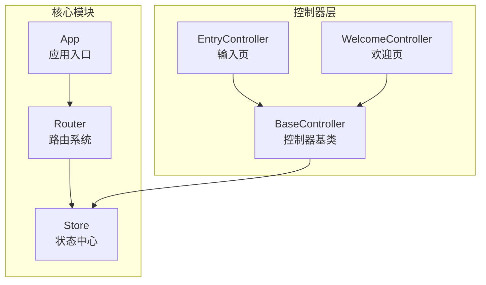
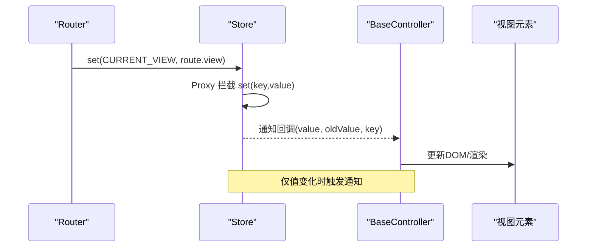
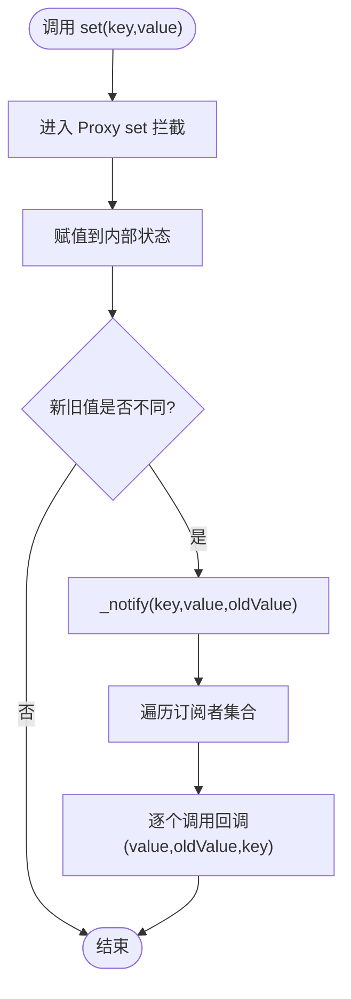
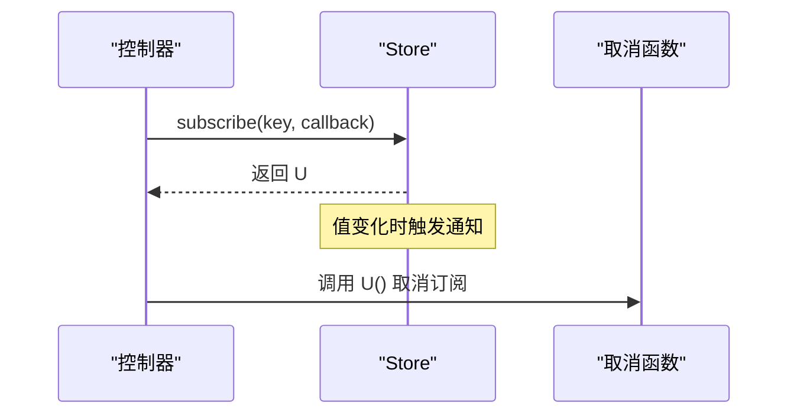
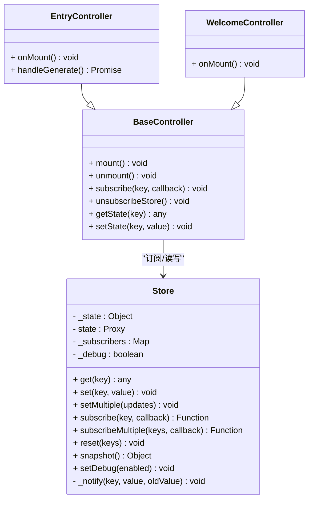
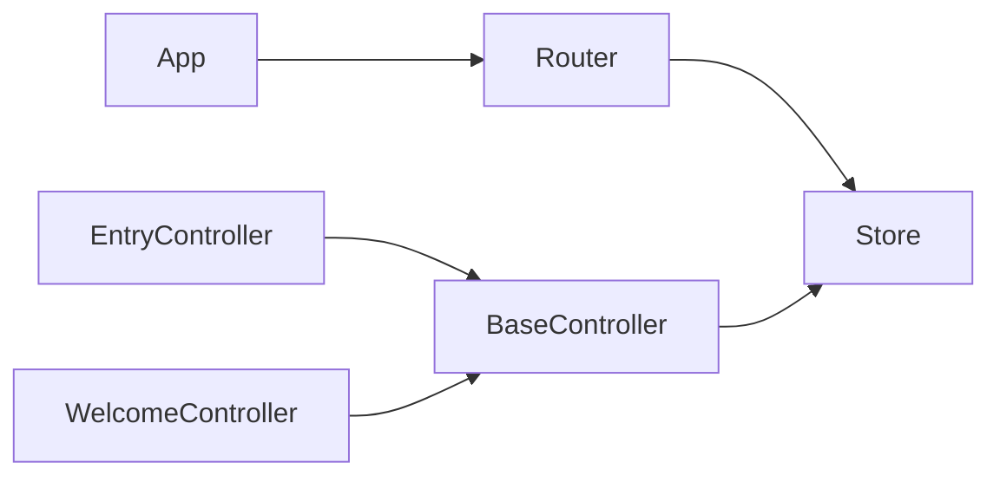

# 状态管理API

<cite>
**本文引用的文件**
- [store.js](file://js/core/store.js)
- [base.js](file://js/controllers/base.js)
- [entry.js](file://js/controllers/entry.js)
- [welcome.js](file://js/controllers/welcome.js)
- [router.js](file://js/core/router.js)
- [app.js](file://js/core/app.js)
</cite>

## 目录
1. [简介](#简介)
2. [项目结构](#项目结构)
3. [核心组件](#核心组件)
4. [架构总览](#架构总览)
5. [详细组件分析](#详细组件分析)
6. [依赖关系分析](#依赖关系分析)
7. [性能考量](#性能考量)
8. [故障排查指南](#故障排查指南)
9. [结论](#结论)
10. [附录](#附录)

## 简介
本文件为前端应用的状态管理API文档，聚焦于 Store 类的公共接口与行为规范。内容涵盖：
- set() 状态设置：键值对存储、代理拦截与变更通知
- get() 状态获取：直接访问、默认值与类型特性
- subscribe()/subscribeMultiple() 订阅：回调注册、事件触发与取消订阅
- getState()（通过控制器封装）：完整状态树访问与快照创建
- setState()（通过控制器封装）：批量更新、事务化与性能优化
- reset() 重置：默认状态恢复与清理机制
- API签名、参数校验、返回值与异常处理
- 设计模式与最佳实践

## 项目结构
Store 位于核心模块，被控制器与路由等模块广泛依赖，形成“控制器-路由-状态”的协作关系。

图表来源
- [store.js](file://js/core/store.js#L30-L187)
- [router.js](file://js/core/router.js#L7-L107)
- [base.js](file://js/controllers/base.js#L6-L130)
- [entry.js](file://js/controllers/entry.js#L14-L241)
- [welcome.js](file://js/controllers/welcome.js#L13-L151)
- [app.js](file://js/core/app.js#L6-L196)

章节来源
- [store.js](file://js/core/store.js#L1-L212)
- [router.js](file://js/core/router.js#L1-L171)
- [base.js](file://js/controllers/base.js#L1-L131)
- [entry.js](file://js/controllers/entry.js#L1-L241)
- [welcome.js](file://js/controllers/welcome.js#L1-L151)
- [app.js](file://js/core/app.js#L1-L206)

## 核心组件
- Store：全局状态中心，提供 get/set/subscribe/reset/snapshot/setDebug 等公共接口
- BaseController：控制器基类，封装了对 Store 的订阅、取消订阅、状态读取与写入
- 路由系统：负责导航与视图切换，并同步更新 Store 中的当前视图状态
- 应用入口：初始化错误处理、预加载视图、注册控制器、监听路由变化

章节来源
- [store.js](file://js/core/store.js#L30-L187)
- [base.js](file://js/controllers/base.js#L11-L130)
- [router.js](file://js/core/router.js#L42-L108)
- [app.js](file://js/core/app.js#L47-L196)

## 架构总览
Store 通过 Proxy 对内部状态进行拦截，仅在值真正变化时触发通知；控制器通过 subscribe 订阅特定键，路由系统在导航时更新当前视图键，形成“状态驱动视图”的单向数据流。

图表来源
- [router.js](file://js/core/router.js#L106-L107)
- [store.js](file://js/core/store.js#L11-L24)
- [store.js](file://js/core/store.js#L129-L141)
- [base.js](file://js/controllers/base.js#L92-L95)

## 详细组件分析

### Store 类与公共接口
- 构造函数：初始化默认状态树、创建响应式状态代理、订阅者映射与调试开关
- get(key)：直接从响应式状态读取值
- set(key, value)：通过代理写入值，触发变更通知
- setMultiple(updates)：批量写入，逐项调用 set
- subscribe(key, callback)：为指定键注册回调，返回取消订阅函数
- subscribeMultiple(keys, callback)：批量订阅，返回统一取消函数
- reset(keys?)：按需重置部分键或全部键为初始值
- snapshot()：返回当前内部状态快照（浅拷贝）
- setDebug(enabled)：开启/关闭调试模式

章节来源
- [store.js](file://js/core/store.js#L30-L63)
- [store.js](file://js/core/store.js#L70-L81)
- [store.js](file://js/core/store.js#L87-L91)
- [store.js](file://js/core/store.js#L99-L124)
- [store.js](file://js/core/store.js#L147-L170)
- [store.js](file://js/core/store.js#L176-L178)
- [store.js](file://js/core/store.js#L184-L186)

#### set() 状态设置方法
- 键值对存储：通过 Proxy 的 set 拦截，将值写入内部状态
- 深层复制：当前实现未对嵌套对象执行深拷贝；如需深拷贝，应在业务侧自行处理
- 变更通知：仅当新旧值不相等时触发通知；订阅者回调接收 (value, oldValue, key)
- 异常处理：通知阶段的回调异常会被静默捕获，不影响后续订阅者

图表来源
- [store.js](file://js/core/store.js#L11-L24)
- [store.js](file://js/core/store.js#L129-L141)

章节来源
- [store.js](file://js/core/store.js#L79-L81)
- [store.js](file://js/core/store.js#L11-L24)
- [store.js](file://js/core/store.js#L129-L141)

#### get() 状态获取方法
- 路径访问：当前实现为直接键访问；若需路径式访问，可在业务侧封装
- 默认值处理：直接返回内部状态值，无显式默认值逻辑
- 类型转换：返回值类型取决于写入值类型；如需类型约束，应在业务侧进行校验与转换

章节来源
- [store.js](file://js/core/store.js#L70-L72)

#### subscribe()/subscribeMultiple() 订阅方法
- 回调注册：为指定键建立订阅者集合，添加回调
- 事件触发：值变化时调用回调，传递 (value, oldValue, key)
- 取消订阅：返回的取消函数可移除回调；subscribeMultiple 返回统一取消函数，逐一调用

图表来源
- [store.js](file://js/core/store.js#L99-L110)
- [store.js](file://js/core/store.js#L118-L124)
- [store.js](file://js/core/store.js#L129-L141)

章节来源
- [store.js](file://js/core/store.js#L99-L124)
- [store.js](file://js/core/store.js#L129-L141)

#### getState() 状态获取方法（通过 BaseController 封装）
- 完整状态树访问：可通过 snapshot() 获取内部状态快照
- 快照创建：浅拷贝当前内部状态，便于调试与持久化

章节来源
- [store.js](file://js/core/store.js#L176-L178)
- [base.js](file://js/controllers/base.js#L109-L111)

#### setState() 批量更新方法（通过 BaseController 封装）
- 合并策略：通过 setMultiple 逐键写入，遵循 set 的变更通知机制
- 事务处理：当前实现为多次 set 调用，非原子事务；如需强一致，可在业务侧聚合后再写入
- 性能优化：减少多次通知开销，但仍然会触发多次回调；如需批处理通知，可在 Store 层扩展

章节来源
- [store.js](file://js/core/store.js#L87-L91)
- [base.js](file://js/controllers/base.js#L118-L120)

#### reset() 重置方法
- 默认状态恢复：将指定键或全部键重置为初始状态
- 清理机制：按需清理部分键，避免影响其他状态

章节来源
- [store.js](file://js/core/store.js#L147-L170)

### 类关系图（代码级）

图表来源
- [store.js](file://js/core/store.js#L30-L187)
- [base.js](file://js/controllers/base.js#L11-L130)
- [entry.js](file://js/controllers/entry.js#L14-L241)
- [welcome.js](file://js/controllers/welcome.js#L13-L151)

## 依赖关系分析
- 路由系统依赖 Store 更新当前视图键，驱动视图切换
- 控制器基类封装 Store 访问与订阅，降低耦合
- 应用入口负责初始化与事件协调，间接依赖 Store

图表来源
- [router.js](file://js/core/router.js#L7-L107)
- [base.js](file://js/controllers/base.js#L6-L130)
- [entry.js](file://js/controllers/entry.js#L14-L241)
- [welcome.js](file://js/controllers/welcome.js#L13-L151)
- [app.js](file://js/core/app.js#L6-L196)

章节来源
- [router.js](file://js/core/router.js#L1-L171)
- [base.js](file://js/controllers/base.js#L1-L131)
- [entry.js](file://js/controllers/entry.js#L1-L241)
- [welcome.js](file://js/controllers/welcome.js#L1-L151)
- [app.js](file://js/core/app.js#L1-L206)

## 性能考量
- 通知频率：每次 set 都可能触发通知，大量键频繁更新会带来回调开销
- 批量写入：使用 setMultiple 减少多次通知；如需更强事务性，可在 Store 层引入批处理队列
- 深拷贝成本：当前未做深拷贝，避免不必要的内存与序列化开销；如需持久化，建议在业务侧自行深拷贝
- 订阅粒度：尽量按最小必要键订阅，避免过度订阅导致的冗余通知

[本节为通用指导，无需具体文件引用]

## 故障排查指南
- 订阅回调报错：通知阶段的回调异常会被静默捕获，不会中断后续订阅者；建议在回调内做好容错
- 取消订阅失效：确认返回的取消函数是否被正确调用；subscribeMultiple 返回的统一取消函数需逐一执行
- 状态未更新：检查 set 的键名是否正确；确保值确实发生变化（Proxy 仅在值变化时通知）
- 快照不一致：snapshot 返回浅拷贝，修改其属性不会影响内部状态；如需深拷贝，请在业务侧处理

章节来源
- [store.js](file://js/core/store.js#L134-L139)
- [store.js](file://js/core/store.js#L176-L178)

## 结论
该 Store 提供了简洁而实用的状态管理能力：通过 Proxy 实现响应式写入与变更通知，结合控制器与路由形成清晰的数据流。建议在业务侧补充类型校验、深拷贝与批处理事务，以满足复杂场景需求。

[本节为总结性内容，无需具体文件引用]

## 附录

### API 签名与行为摘要
- get(key): 读取状态值；无路径访问与默认值处理
- set(key, value): 写入状态值；仅值变化时触发通知
- setMultiple(updates): 批量写入；逐键调用 set
- subscribe(key, callback): 订阅指定键；返回取消函数
- subscribeMultiple(keys, callback): 批量订阅；返回统一取消函数
- reset(keys?): 重置状态；可按键或全部重置
- snapshot(): 返回内部状态快照（浅拷贝）
- setDebug(enabled): 切换调试模式

章节来源
- [store.js](file://js/core/store.js#L70-L186)

### 使用示例（路径引用）
- 在控制器中订阅与取消订阅：[base.js](file://js/controllers/base.js#L92-L103)
- 在控制器中读取与写入状态：[base.js](file://js/controllers/base.js#L109-L120)
- 在路由中更新当前视图：[router.js](file://js/core/router.js#L106-L107)
- 在控制器中使用状态键常量：[entry.js](file://js/controllers/entry.js#L8-L176), [welcome.js](file://js/controllers/welcome.js#L7-L31)