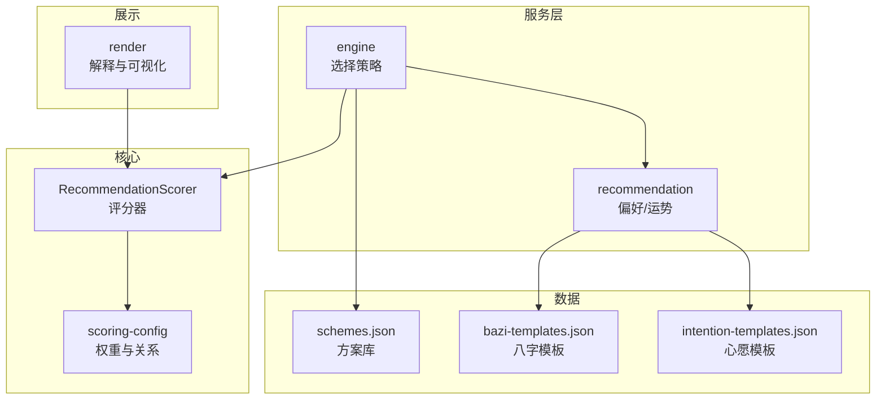
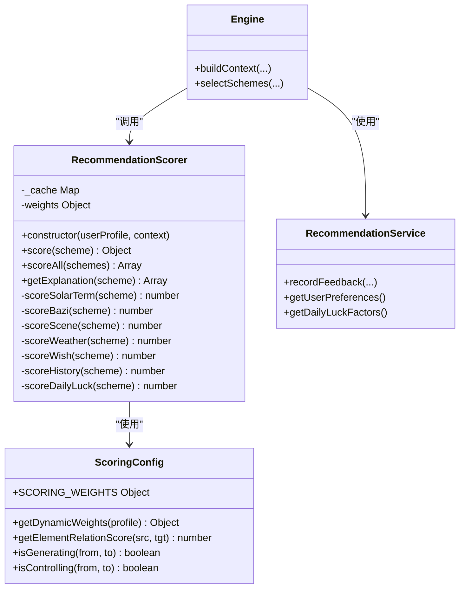
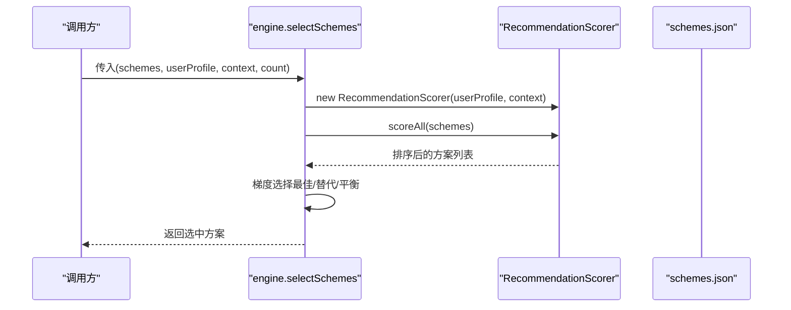
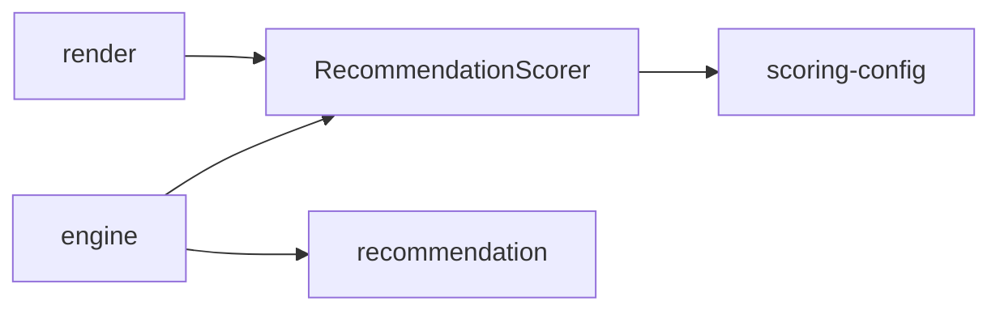

# 评分器API

<cite>
**本文引用的文件**
- [scorer.js](file://js/core/scorer.js)
- [scoring-config.js](file://js/core/scoring-config.js)
- [engine.js](file://js/services/engine.js)
- [recommendation.js](file://js/services/recommendation.js)
- [render.js](file://js/utils/render.js)
- [schemes.json](file://data/schemes.json)
- [bazi-templates.json](file://data/bazi-templates.json)
- [intention-templates.json](file://data/intention-templates.json)
</cite>

## 目录
1. [简介](#简介)
2. [项目结构](#项目结构)
3. [核心组件](#核心组件)
4. [架构概览](#架构概览)
5. [详细组件分析](#详细组件分析)
6. [依赖分析](#依赖分析)
7. [性能考虑](#性能考虑)
8. [故障排查指南](#故障排查指南)
9. [结论](#结论)
10. [附录](#附录)

## 简介
本文件系统化梳理 RecommendationScorer 类的公共接口与评分算法，覆盖以下能力：
- calculateScore（已重构为 score）：计算单个方案的总分与分项分解
- getScoreBreakdown：获取分项得分明细与权重占比
- getTopSchemes（已重构为 scoreAll + 选择策略）：批量评分与梯度推荐
- getCompatibility（未在当前版本暴露）：兼容性评估（概念性说明）
- updateWeights（动态权重）：基于用户画像的权重调整
- validateContext（上下文校验）：输入上下文的合法性检查

文档同时给出算法原理、参数配置、返回值格式、性能指标与调优建议，并提供可视化图示帮助理解。

## 项目结构
与评分器相关的模块分布如下：
- 核心评分器：js/core/scorer.js
- 评分配置与五行关系：js/core/scoring-config.js
- 引擎与选择策略：js/services/engine.js
- 推荐服务与用户偏好：js/services/recommendation.js
- 结果渲染与解释：js/utils/render.js
- 数据源：data/schemes.json、data/bazi-templates.json、data/intention-templates.json

图表来源
- [scorer.js](file://js/core/scorer.js#L14-L316)
- [scoring-config.js](file://js/core/scoring-config.js#L1-L128)
- [engine.js](file://js/services/engine.js#L184-L260)
- [recommendation.js](file://js/services/recommendation.js#L1-L200)
- [render.js](file://js/utils/render.js#L220-L284)

章节来源
- [scorer.js](file://js/core/scorer.js#L1-L316)
- [scoring-config.js](file://js/core/scoring-config.js#L1-L128)
- [engine.js](file://js/services/engine.js#L1-L200)
- [recommendation.js](file://js/services/recommendation.js#L1-L200)
- [render.js](file://js/utils/render.js#L220-L284)

## 核心组件
- RecommendationScorer：封装评分计算、缓存、解释生成与批量评分
- scoring-config：提供权重配置、五行相生相克、动态权重与关系得分
- engine：构建上下文、调用评分器并执行梯度推荐策略
- recommendation：用户偏好存储、反馈记录、今日运势因子
- render：将评分分解转换为可读的解释卡片

章节来源
- [scorer.js](file://js/core/scorer.js#L14-L316)
- [scoring-config.js](file://js/core/scoring-config.js#L1-L128)
- [engine.js](file://js/services/engine.js#L184-L260)
- [recommendation.js](file://js/services/recommendation.js#L1-L200)
- [render.js](file://js/utils/render.js#L220-L284)

## 架构概览
RecommendationScorer 的职责边界清晰：只负责评分计算与解释，不直接访问外部数据源；上下文与数据加载由上层服务完成。

图表来源
- [scorer.js](file://js/core/scorer.js#L14-L316)
- [scoring-config.js](file://js/core/scoring-config.js#L1-L128)
- [engine.js](file://js/services/engine.js#L184-L260)
- [recommendation.js](file://js/services/recommendation.js#L1-L200)

## 详细组件分析

### RecommendationScorer 类
- 构造函数
  - 接收用户画像与上下文
  - 初始化动态权重与缓存
- score(scheme)
  - 返回 { total, breakdown, weights }
  - breakdown 包含 solarTerm、bazi、scene、weather、wish、history、dailyLuck
  - 使用权重对各分项加权求和，保留两位小数并四舍五入为整数
- scoreAll(schemes)
  - 对方案数组批量评分并按总分降序排列
- getExplanation(scheme)
  - 输出前三大贡献维度及占比，便于前端渲染

章节来源
- [scorer.js](file://js/core/scorer.js#L14-L316)

#### 评分算法与权重
- 基础权重（来自配置）
  - solarTerm: 25%
  - bazi: 20%
  - scene: 20%
  - weather: 15%
  - wish: 15%
- 奖励权重
  - history: 10%
  - dailyLuck: 5%
- 动态权重调整
  - 无八字时，将 bazi 权重平分给 solarTerm 与 scene
  - 新用户时，适度提升 solarTerm 与 scene 权重
- 关系得分
  - 相同：100
  - 相生：80
  - 被相生：60
  - 相克：40
  - 被相克：20
  - 其他：0

章节来源
- [scoring-config.js](file://js/core/scoring-config.js#L6-L19)
- [scoring-config.js](file://js/core/scoring-config.js#L74-L92)
- [scoring-config.js](file://js/core/scoring-config.js#L120-L127)

#### 分项评分细则
- 节气匹配（scoreSolarTerm）
  - 依据节气五行与方案颜色五行的关系得分
- 八字匹配（scoreBazi）
  - 喜用神匹配：100
  - 忌神匹配：-20
  - 与喜用神相生：70
  - 其他：30
- 场景适配（scoreScene）
  - 五行匹配：60
  - 材质匹配：40
  - 默认：50~60（日常场景）
- 天气联动（scoreWeather）
  - 天气五行能量场：相生40、相克80、其他60
  - 温度调候：相克+20
  - 材质实用性：+20
- 心愿契合（scoreWish）
  - 有模板时：70（简化处理）
- 个人偏好（scoreHistory）
  - 五行、颜色、材质偏好归一化累加
- 今日运势（scoreDailyLuck）
  - 幸运五行：100
  - 增益五行：70
  - 其他：40

章节来源
- [scorer.js](file://js/core/scorer.js#L81-L193)
- [scorer.js](file://js/core/scorer.js#L198-L259)

#### 批量评分与解释
- scoreAll：map + sort，O(n log n)
- getExplanation：按贡献降序取前三，输出维度名、得分与占比

章节来源
- [scorer.js](file://js/core/scorer.js#L266-L313)

### getTopSchemes（重构为梯度推荐）
- 使用 RecommendationScorer.scoreAll 获取排序后的方案
- 选择策略（engine.js）
  - 最佳匹配：最高分方案
  - 保守替代：同五行但不同方案
  - 平衡方案：不同五行，平衡今日能量
- 数量限制：默认3套，可配置

图表来源
- [engine.js](file://js/services/engine.js#L218-L260)
- [scorer.js](file://js/core/scorer.js#L266-L276)

章节来源
- [engine.js](file://js/services/engine.js#L218-L260)
- [schemes.json](file://data/schemes.json#L1-L509)

### getCompatibility（兼容性评估）
- 当前版本未直接暴露此方法
- 可通过 score 方法的 breakdown 与权重组合推导兼容性
- 五行相生相克关系由 scoring-config 提供，可用于解释“相生/相克/相克平衡”等

章节来源
- [scoring-config.js](file://js/core/scoring-config.js#L21-L37)
- [scoring-config.js](file://js/core/scoring-config.js#L120-L127)

### updateWeights（动态权重）
- 通过 getDynamicWeights 实现
  - 无八字：bazi 权重清零，并将一半权重分配给 solarTerm 与 scene
  - 新用户：适度提高 solarTerm 与 scene 权重
- 权重来源：SCORING_WEIGHTS.base + 动态调整

章节来源
- [scoring-config.js](file://js/core/scoring-config.js#L74-L92)

### validateContext（上下文校验）
- 上下文字段建议校验
  - termWuxing：节气五行
  - sceneId：场景ID
  - scenePreferences：场景偏好映射
  - weather/current：天气对象
  - weatherRecommendation：天气建议
  - dailyLuck：今日运势因子
  - bazi：用户八字
  - wishId/intentionTemplate：心愿相关
- 建议在 engine.buildContext 中进行字段存在性与类型检查，缺失时提供默认值或抛错

章节来源
- [engine.js](file://js/services/engine.js#L187-L211)

## 依赖分析
- RecommendationScorer 依赖 scoring-config 的权重与关系函数
- engine 负责组装上下文并调用评分器
- recommendation 负责用户偏好与今日运势
- render 将评分分解转换为解释卡片

图表来源
- [scorer.js](file://js/core/scorer.js#L6-L12)
- [engine.js](file://js/services/engine.js#L184-L211)
- [recommendation.js](file://js/services/recommendation.js#L1-L200)
- [render.js](file://js/utils/render.js#L220-L284)

章节来源
- [scorer.js](file://js/core/scorer.js#L6-L12)
- [engine.js](file://js/services/engine.js#L184-L211)
- [recommendation.js](file://js/services/recommendation.js#L1-L200)
- [render.js](file://js/utils/render.js#L220-L284)

## 性能考虑
- 缓存策略：RecommendationScorer 内置 Map 缓存，避免重复计算
- 时间复杂度
  - 单方案评分：O(1)
  - 批量评分：O(n log n)，主要由排序决定
- 内存占用：缓存键为方案ID，建议在长会话中控制缓存大小
- I/O 优化：数据源（schemes.json 等）在应用初始化阶段加载

章节来源
- [scorer.js](file://js/core/scorer.js#L20-L22)
- [scorer.js](file://js/core/scorer.js#L266-L276)

## 故障排查指南
- 评分异常为负
  - 可能原因：八字忌神匹配导致 bazi 得分为负
  - 解决：检查用户八字与方案五行
- 得分偏低
  - 检查上下文字段是否完整（天气、运势、场景偏好）
  - 确认动态权重是否被正确应用
- 解释为空
  - 确认方案是否已评分并带有 breakdown
  - 检查 render 的维度配置与百分比计算

章节来源
- [scorer.js](file://js/core/scorer.js#L91-L116)
- [engine.js](file://js/services/engine.js#L187-L211)
- [render.js](file://js/utils/render.js#L220-L284)

## 结论
RecommendationScorer 将复杂的五行情感与命理因素转化为可解释、可调优的评分体系。通过清晰的分项设计、动态权重与缓存机制，既保证了性能，又提供了良好的可扩展性。建议在生产环境中：
- 在 engine 层完善 validateContext 的字段校验
- 将 getCompatibility 作为扩展能力逐步开放
- 通过 recommendation 的反馈闭环持续优化权重与偏好

## 附录

### API 定义与返回值格式
- score(scheme)
  - 输入：scheme（包含 color.wuxing、material 等）
  - 输出：{ total, breakdown, weights }
- scoreAll(schemes)
  - 输入：方案数组
  - 输出：按 total 降序排列的数组
- getExplanation(scheme)
  - 输出：前三大贡献维度的解释列表

章节来源
- [scorer.js](file://js/core/scorer.js#L29-L75)
- [scorer.js](file://js/core/scorer.js#L266-L313)

### 算法参数与配置选项
- 权重配置（SCORING_WEIGHTS）
  - base：solarTerm、bazi、scene、weather、wish
  - bonus：history、dailyLuck
- 动态权重（getDynamicWeights）
  - 无八字：bazi 清零并分配给 solarTerm 与 scene
  - 新用户：适度提升 solarTerm 与 scene
- 五行关系得分（getElementRelationScore）
  - 相同：100；相生：80；被相生：60；相克：40；被相克：20；其他：0

章节来源
- [scoring-config.js](file://js/core/scoring-config.js#L6-L19)
- [scoring-config.js](file://js/core/scoring-config.js#L74-L92)
- [scoring-config.js](file://js/core/scoring-config.js#L120-L127)

### 调优指南
- 权重调优
  - 业务目标驱动：若强调命理匹配，可提高 bazi 权重；若强调场景适配，提高 scene 权重
  - 动态权重：结合用户画像（是否有八字、是否新用户）自适应调整
- 分项评分
  - 场景适配：细化 SCENE_PREFERENCES，提升材质匹配权重
  - 天气联动：根据地区气候差异调整天气与温度映射
- 性能优化
  - 批量评分时复用 RecommendationScorer 实例
  - 控制缓存容量，避免内存膨胀

章节来源
- [scoring-config.js](file://js/core/scoring-config.js#L6-L19)
- [scoring-config.js](file://js/core/scoring-config.js#L74-L92)
- [engine.js](file://js/services/engine.js#L218-L260)