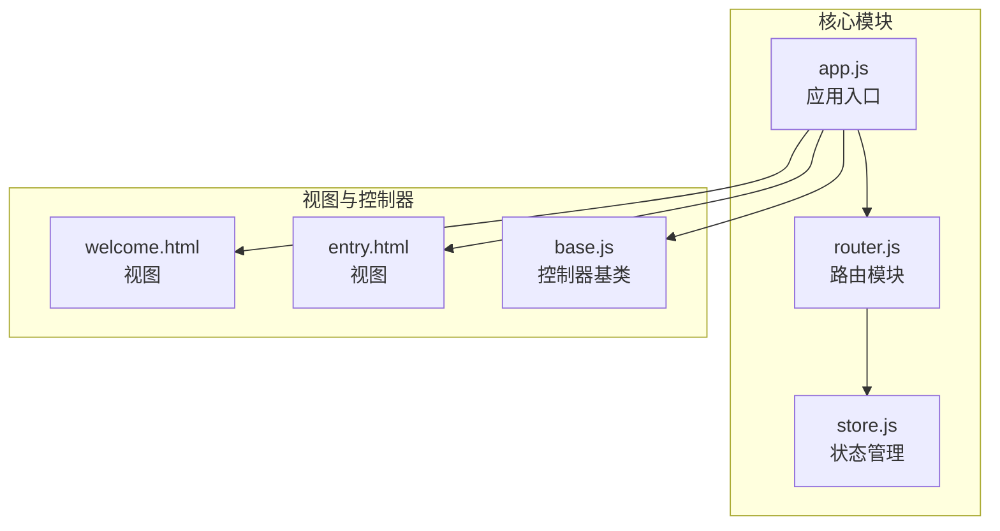
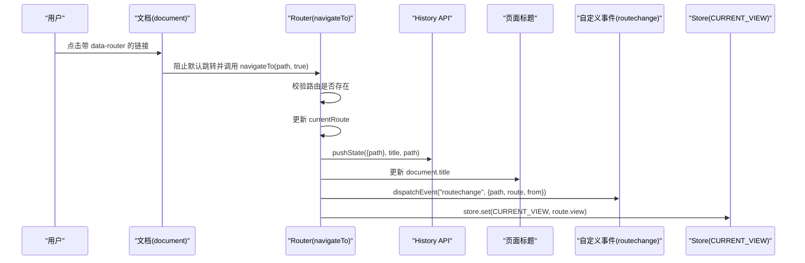
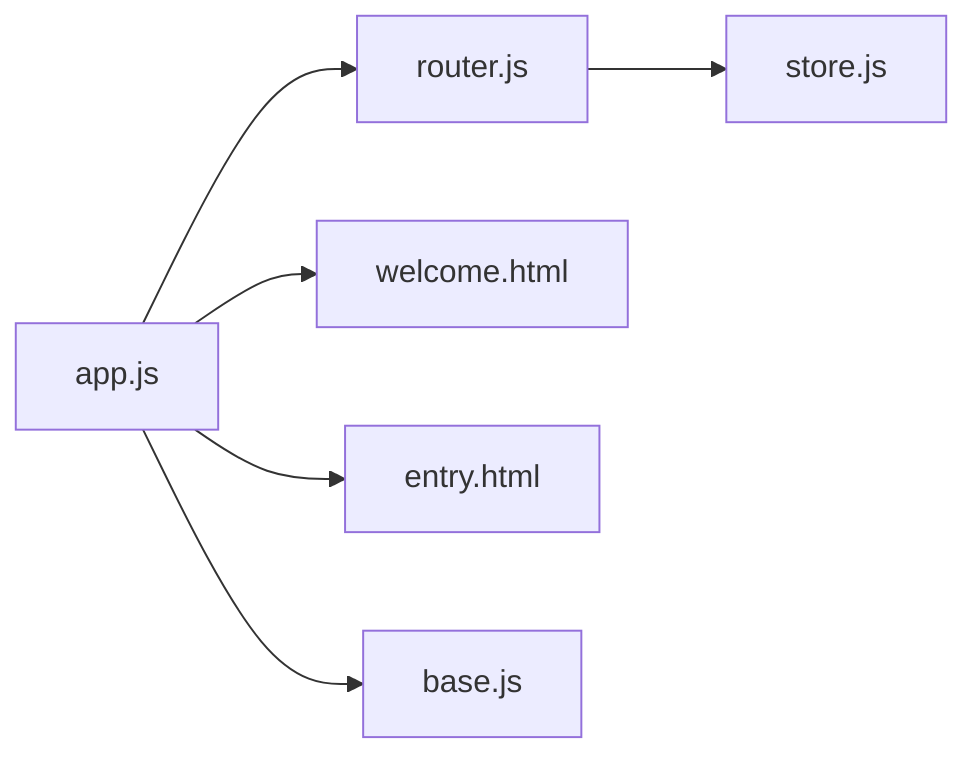

# 路由API

<cite>
**本文引用的文件**
- [router.js](file://js/core/router.js)
- [app.js](file://js/core/app.js)
- [store.js](file://js/core/store.js)
- [base.js](file://js/controllers/base.js)
- [index.html](file://index.html)
- [welcome.html](file://views/welcome.html)
- [entry.html](file://views/entry.html)
</cite>

## 目录
1. [简介](#简介)
2. [项目结构](#项目结构)
3. [核心组件](#核心组件)
4. [架构总览](#架构总览)
5. [详细组件分析](#详细组件分析)
6. [依赖关系分析](#依赖关系分析)
7. [性能考量](#性能考量)
8. [故障排查指南](#故障排查指南)
9. [结论](#结论)
10. [附录](#附录)

## 简介
本文件为前端路由系统 Router 模块的详细API文档，面向开发者与产品/测试人员，系统性说明路由初始化、导航、当前路由获取、路由有效性校验、历史记录处理、事件绑定等能力，并给出最佳实践与调试技巧。Router 模块通过浏览器 History API 与自定义事件实现 URL 与应用状态的同步，配合应用层的视图加载与控制器挂载，形成完整的单页应用导航体系。

## 项目结构
Router 模块位于 js/core/router.js，主要职责包括：
- 定义路由配置表
- 初始化路由系统（事件绑定、初始路径处理）
- 导航到指定路径（History 管理、标题更新、事件派发、状态同步）
- 提供查询与工具方法（当前路由、路由配置、有效性检查、返回上一页、生成路由链接）

图表来源
- [router.js](file://js/core/router.js#L1-L142)
- [app.js](file://js/core/app.js#L1-L206)
- [store.js](file://js/core/store.js#L1-L212)
- [base.js](file://js/controllers/base.js#L1-L131)
- [welcome.html](file://views/welcome.html#L1-L34)
- [entry.html](file://views/entry.html#L1-L234)

章节来源
- [router.js](file://js/core/router.js#L1-L142)
- [app.js](file://js/core/app.js#L1-L206)

## 核心组件
- 路由配置表 ROUTES：静态声明可用路径及其视图与标题信息
- 当前路由 currentRoute：内存中的当前路径状态
- 导航函数 navigateTo：执行路径切换、History 更新、标题更新、事件派发、状态同步
- 初始化函数 initRouter：绑定 popstate、初始路径处理、链接点击拦截
- 查询与工具函数：getCurrentRoute、getCurrentRouteConfig、getRoutes、isValidRoute、goBack、createRouteLink

章节来源
- [router.js](file://js/core/router.js#L8-L119)
- [store.js](file://js/core/store.js#L30-L81)

## 架构总览
Router 与应用层协作流程如下：
- 应用启动时，App 监听自定义路由变化事件 routechange
- Router 初始化时，监听浏览器 popstate 与链接点击，调用 navigateTo
- navigateTo 内部更新 currentRoute、History、页面标题、派发 routechange 事件、写入 Store 的当前视图键

图表来源
- [router.js](file://js/core/router.js#L25-L79)
- [app.js](file://js/core/app.js#L62-L63)

## 详细组件分析

### 初始化 initRouter()
- 监听浏览器前进/后退事件 popstate，根据当前 URL 解析并导航
- 处理初始路径：若为已知路径则直接导航；否则重定向至首页
- 拦截所有带 data-router 的链接点击，阻止默认跳转，调用 navigateTo 并推入历史

API 签名
- initRouter()

行为说明
- popstate 事件回调中读取 window.location.pathname，调用 navigateTo(path, false)
- 初始路径判断：存在则 navigateTo(initialPath, false)，否则 navigateTo("/", true)
- 链接拦截：document.addEventListener('click')，命中 a[data-router] 时 e.preventDefault() 并 navigateTo(href, true)

错误处理
- 若初始路径不在 ROUTES 中，会强制导航到根路径并推入历史

章节来源
- [router.js](file://js/core/router.js#L25-L50)

### 导航 navigateTo(path, pushState?)
- 参数
  - path: string，目标路径
  - pushState: boolean，默认 true，是否调用 history.pushState
- 行为
  - 校验 ROUTES[path] 存在性，不存在直接返回
  - 更新 currentRoute
  - 若 pushState 为真，调用 history.pushState，状态对象包含 path，标题为路由配置的 title，URL 为 path
  - 更新 document.title
  - 派发自定义事件 routechange，携带 { path, route, from }
  - 将 route.view 写入 Store 的 CURRENT_VIEW 键
- 返回值
  - 无返回值（void）

注意
- 该方法不负责视图加载与控制器挂载，这些由 App 监听 routechange 后异步完成

章节来源
- [router.js](file://js/core/router.js#L57-L79)
- [store.js](file://js/core/store.js#L79-L81)

### 获取当前路由 getCurrentRoute()
- 返回值
  - string，当前内存中的路径
- 用途
  - 业务逻辑中查询当前所在路径

章节来源
- [router.js](file://js/core/router.js#L85-L87)

### 获取当前路由配置 getCurrentRouteConfig()
- 返回值
  - Object，形如 { view, title }，来自 ROUTES[currentRoute]
- 用途
  - 获取当前视图标识与页面标题文案

章节来源
- [router.js](file://js/core/router.js#L93-L95)

### 获取所有路由配置 getRoutes()
- 返回值
  - Object，ROUTES 的浅拷贝
- 用途
  - 调试或动态生成导航菜单时使用

章节来源
- [router.js](file://js/core/router.js#L101-L103)

### 路由有效性检查 isValidRoute(path)
- 参数
  - path: string
- 返回值
  - boolean，是否在 ROUTES 中存在
- 用途
  - 在导航前进行白名单校验

章节来源
- [router.js](file://js/core/router.js#L110-L112)

### 返回上一页 goBack()
- 行为
  - 调用 window.history.back()
- 用途
  - 快速返回上一历史记录项

章节来源
- [router.js](file://js/core/router.js#L117-L119)

### 生成路由链接 createRouteLink(path, text, options?)
- 参数
  - path: string，链接地址
  - text: string，显示文本
  - options: Object，可选
    - className: string，附加 CSS 类名
    - icon: string，图标 HTML 片段
- 返回值
  - string，带 data-router 的 a 标签字符串
- 用途
  - 在模板中生成统一的路由链接，确保被 Router 拦截

章节来源
- [router.js](file://js/core/router.js#L137-L141)

### 历史记录处理 handlePopState()
- 说明
  - Router 未单独导出名为 handlePopState 的函数；其功能由 initRouter 中的 popstate 监听器实现
  - 监听器内部逻辑：从 window.location.pathname 读取路径，调用 navigateTo(path, false)
- 行为
  - 不推入历史（pushState=false），仅更新当前路由与视图
- 注意
  - 该监听器不负责初始路径处理，初始路径处理在 initRouter 的另一分支中完成

章节来源
- [router.js](file://js/core/router.js#L27-L29)

### 路由匹配 matchRoute()
- 说明
  - Router 未提供名为 matchRoute 的函数；当前实现为直接按路径键查找 ROUTES
  - 该模块不支持正则表达式或通配符匹配，也不进行优先级排序
- 替代方案
  - 如需参数化路径或通配符，可在现有基础上扩展：例如将 ROUTES 改为数组，遍历匹配并提取参数，或引入第三方路由库

章节来源
- [router.js](file://js/core/router.js#L57-L59)

### 路由创建 createRoute()
- 说明
  - Router 未提供名为 createRoute 的函数；路由配置通过常量 ROUTES 直接声明
- 替代方案
  - 如需运行时动态创建路由，可在现有基础上扩展：例如提供一个函数接收 { path, view, title }，并更新 ROUTES 或返回新的路由表

章节来源
- [router.js](file://js/core/router.js#L9-L17)

### getCurrentRoute() 获取当前路由
- 说明
  - Router 未提供名为 getCurrentRoute 的函数；当前实现为导出 getCurrentRoute 与 getCurrentRouteConfig
- 行为
  - getCurrentRoute 返回内存中的 currentRoute
  - getCurrentRouteConfig 返回 ROUTES[currentRoute]

章节来源
- [router.js](file://js/core/router.js#L85-L95)

## 依赖关系分析
- Router 依赖 Store（写入 CURRENT_VIEW）
- App 监听 Router 派发的 routechange 事件，负责动态加载视图与控制器
- 视图文件通过 id 与控制器关联（如 view-welcome、view-entry）

图表来源
- [router.js](file://js/core/router.js#L6-L7)
- [app.js](file://js/core/app.js#L6-L11)
- [store.js](file://js/core/store.js#L190-L202)
- [base.js](file://js/controllers/base.js#L1-L131)
- [welcome.html](file://views/welcome.html#L2)
- [entry.html](file://views/entry.html#L2)

章节来源
- [router.js](file://js/core/router.js#L6-L7)
- [app.js](file://js/core/app.js#L62-L63)

## 性能考量
- 路由切换为轻量操作：仅更新 currentRoute、History、标题与派发事件，不阻塞主线程
- 链接拦截使用事件委托，避免为每个链接单独绑定监听器
- 初始路径处理与 popstate 处理均为 O(1) 查找
- 建议
  - 对于大型应用，可考虑引入参数化路由与懒加载策略，减少首屏体积
  - 使用 createRouteLink 生成链接，确保统一的导航体验与可追踪性

## 故障排查指南
- 症状：点击导航链接无效
  - 检查链接是否带有 data-router 属性
  - 确认 Router 已初始化（initRouter 被调用）
- 症状：浏览器前进/后退无反应
  - 确认 popstate 监听器已绑定
  - 检查初始路径是否在 ROUTES 中，否则会被重定向到首页
- 症状：页面标题未更新
  - 确认 navigateTo 被调用且 ROUTES 中存在对应路由
- 症状：视图未切换
  - 确认 App 已监听 routechange 事件并正确加载视图与控制器
- 调试技巧
  - 在 navigateTo 中添加日志，观察 path、route、from
  - 使用 isValidRoute(path) 进行白名单校验
  - 在 App.handleRouteChange 中打印 route.view，确认视图加载与控制器挂载顺序

章节来源
- [router.js](file://js/core/router.js#L25-L79)
- [app.js](file://js/core/app.js#L62-L63)

## 结论
Router 模块提供了简洁高效的前端路由能力：静态路由表、History 同步、自定义事件驱动的应用层协作。对于当前项目规模而言，该实现已足够稳定可靠；若未来需要参数化路径、嵌套路由或权限控制，可在现有架构上平滑扩展。

## 附录

### API 签名与参数说明

- initRouter()
  - 无参数
  - 返回值：无
  - 作用：初始化 popstate 监听、初始路径处理、链接点击拦截

- navigateTo(path, pushState=true)
  - path: string，目标路径
  - pushState: boolean，是否推入历史
  - 返回值：无
  - 作用：导航到指定路径，更新 History、标题、派发事件、写入 Store

- getCurrentRoute()
  - 返回值：string，当前路径

- getCurrentRouteConfig()
  - 返回值：Object，形如 { view, title }

- getRoutes()
  - 返回值：Object，路由配置表副本

- isValidRoute(path)
  - 返回值：boolean

- goBack()
  - 返回值：无

- createRouteLink(path, text, options={})
  - 返回值：string，带 data-router 的 a 标签字符串

### 最佳实践
- 所有导航均通过 Router 提供的链接生成或 navigateTo 方法，避免直接修改 URL
- 在 App 层统一处理视图加载与控制器挂载，保持路由层职责单一
- 使用 isValidRoute 进行白名单校验，防止非法路径
- 对于复杂导航需求（参数化、嵌套路由），建议引入专用路由库并在现有事件机制上集成