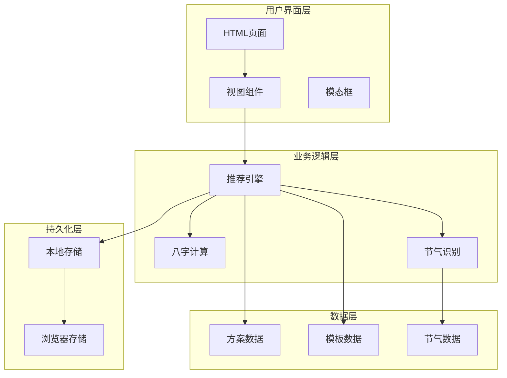
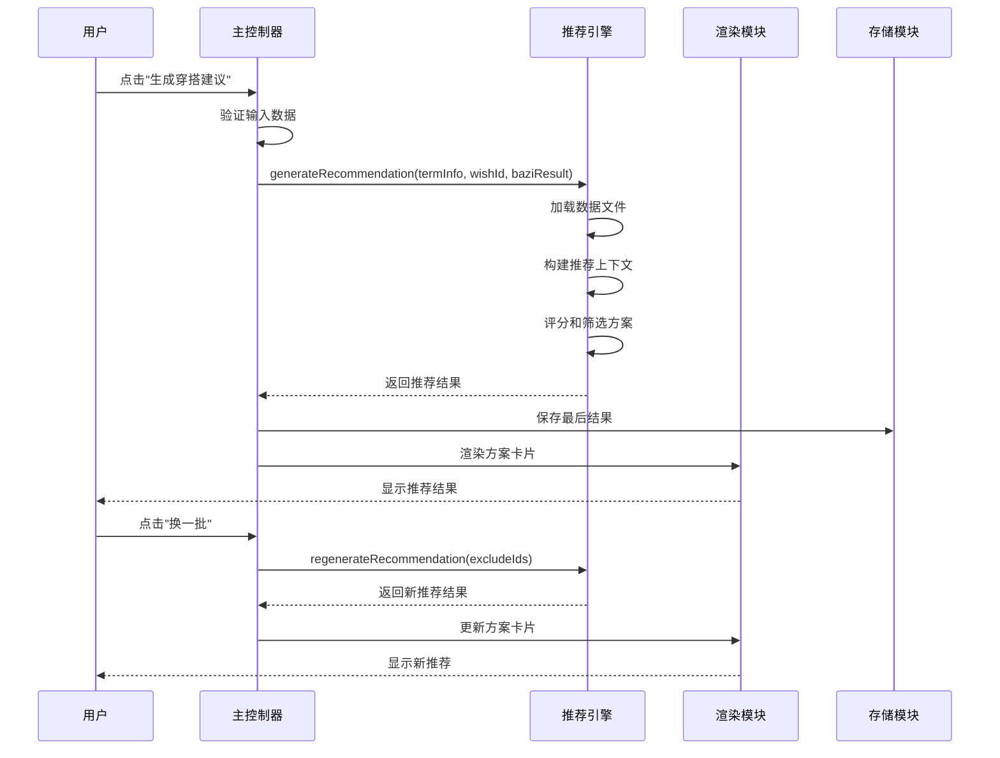
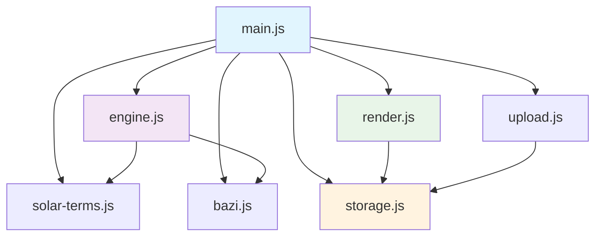

# API参考文档

<cite>
**本文档引用的文件**
- [engine.js](file://js/engine.js)
- [render.js](file://js/render.js)
- [storage.js](file://js/storage.js)
- [main.js](file://js/main.js)
- [bazi.js](file://js/bazi.js)
- [solar-terms.js](file://js/solar-terms.js)
- [upload.js](file://js/upload.js)
- [index.html](file://index.html)
</cite>

## 目录
1. [简介](#简介)
2. [项目结构](#项目结构)
3. [核心组件](#核心组件)
4. [架构概览](#架构概览)
5. [详细组件分析](#详细组件分析)
6. [依赖分析](#依赖分析)
7. [性能考虑](#性能考虑)
8. [故障排除指南](#故障排除指南)
9. [结论](#结论)
10. [附录](#附录)

## 简介
本项目是一个基于中国传统文化理论的智能穿搭建议系统，结合节气变化、个人八字命理和心愿目标，为用户提供个性化的服装搭配建议。系统采用模块化设计，包含推荐引擎、渲染层、存储管理和业务逻辑控制等核心模块。

## 项目结构
项目采用模块化架构，主要分为以下层次：
- **数据层**: JSON配置文件（schemes.json、intention-templates.json、bazi-templates.json、solar-terms.json）
- **业务逻辑层**: 引擎模块（推荐算法）、八字计算模块、节气识别模块
- **表现层**: 渲染模块（DOM操作、UI交互）
- **持久化层**: 本地存储模块（localStorage封装）
- **入口层**: 主控制器（事件绑定、流程协调）



**图表来源**
- [main.js](file://js/main.js#L1-L317)
- [engine.js](file://js/engine.js#L1-L335)
- [bazi.js](file://js/bazi.js#L1-L193)
- [solar-terms.js](file://js/solar-terms.js#L1-L118)

**章节来源**
- [index.html](file://index.html#L1-L236)
- [main.js](file://js/main.js#L1-L317)

## 核心组件
系统包含以下核心API模块：

### 推荐引擎API
负责生成和重新生成穿搭推荐方案，包含复杂的五行相生相克算法和多维度评分机制。

### 渲染API
负责UI界面的动态更新、模态框显示、Toast消息提示等功能。

### 存储API
提供本地数据持久化功能，包括用户偏好设置、历史记录、统计信息等。

### 主控制器API
协调整个应用的生命周期，处理用户交互事件和业务流程。

**章节来源**
- [engine.js](file://js/engine.js#L268-L334)
- [render.js](file://js/render.js#L1-L272)
- [storage.js](file://js/storage.js#L1-L116)
- [main.js](file://js/main.js#L26-L67)

## 架构概览
系统采用事件驱动的架构模式，主控制器作为中央协调者，各模块通过明确的接口进行通信。



**图表来源**
- [main.js](file://js/main.js#L202-L244)
- [engine.js](file://js/engine.js#L268-L310)
- [render.js](file://js/render.js#L114-L127)

## 详细组件分析

### 推荐引擎API

#### generateRecommendation 方法
**方法描述**: 根据节气信息、心愿目标和个人八字生成个性化穿搭推荐方案。

**参数列表**:
- `termInfo` (Object): 节气信息对象
  - `current` (Object): 当前节气信息
    - `id` (string): 节气ID
    - `name` (string): 节气名称
    - `wuxing` (string): 五行属性
    - `wuxingName` (string): 五行中文名称
  - `next` (Object): 下一个节气信息
  - `seasonInfo` (Object): 季节信息
- `wishId` (string): 心愿ID，可选
- `baziResult` (Object): 八字分析结果，可选

**返回值**: 
- `Object`: 推荐结果对象
  - `schemes` (Array): 推荐的方案数组
  - `termInfo` (Object): 节气信息
  - `wishId` (string): 心愿ID
  - `intentionTemplate` (Object): 匹配的心愿模板
  - `baziResult` (Object): 八字分析结果
  - `baziTemplate` (Object): 匹配的八字模板
  - `generatedAt` (string): 生成时间戳

**异常处理**:
- 数据加载失败时返回null
- 缺少必要数据时记录错误日志
- 网络请求异常时捕获并记录

**使用示例**:
```javascript
// 基本用法
const result = await generateRecommendation(
  currentTermInfo,
  currentWishId,
  currentBaziResult
);

// 检查结果有效性
if (result && result.schemes.length > 0) {
  // 处理推荐结果
}
```

**最佳实践**:
- 始终检查返回结果的有效性
- 在调用前确保termInfo和baziResult数据完整
- 处理异步加载过程中的用户体验

**章节来源**
- [engine.js](file://js/engine.js#L268-L310)

#### regenerateRecommendation 方法
**方法描述**: 重新生成推荐方案，提供"换一批"功能。

**参数列表**:
- `termInfo` (Object): 节气信息
- `wishId` (string): 心愿ID
- `baziResult` (Object): 八字分析结果
- `excludeIds` (Array): 要排除的方案ID数组

**返回值**: 
- `Object`: 新的推荐结果对象，格式同generateRecommendation

**异常处理**:
- 过滤排除ID时进行数据验证
- 处理可用方案不足的情况

**使用示例**:
```javascript
// 获取已排除的方案ID
const excludeIds = currentResult.schemes.map(s => s.id);
// 重新生成推荐
const newResult = await regenerateRecommendation(
  currentTermInfo,
  currentWishId,
  currentBaziResult,
  excludeIds
);
```

**最佳实践**:
- 传入完整的excludeIds数组避免重复
- 处理重新生成失败的情况

**章节来源**
- [engine.js](file://js/engine.js#L315-L334)

#### 内部算法函数

##### scoreScheme 函数
**方法描述**: 计算单个方案的综合得分，考虑节气匹配度和八字相生关系。

**评分规则**:
- 节气完全匹配: 50分
- 节气相生关系: 30分
- 八字完全匹配: 20分
- 八字相生关系: 12分

**章节来源**
- [engine.js](file://js/engine.js#L178-L199)

##### selectSchemes 函数
**方法描述**: 从可用方案中选择最优的推荐组合，确保五行多样性。

**选择策略**:
1. 优先选择与当前节气相关的方案
2. 使用评分算法排序
3. 确保至少包含两种不同的五行元素
4. 补充高分方案以达到数量要求

**章节来源**
- [engine.js](file://js/engine.js#L218-L259)

### 渲染API

#### showView 方法
**方法描述**: 切换显示指定的视图页面。

**参数列表**:
- `viewId` (string): 目标视图的DOM ID

**返回值**: 无

**异常处理**: 
- 视图不存在时安全忽略
- DOM查询失败时记录警告

**使用示例**:
```javascript
// 显示结果页面
showView('view-results');
```

**最佳实践**:
- 确保viewId对应正确的DOM元素
- 在切换前清理可能的状态

**章节来源**
- [render.js](file://js/render.js#L8-L16)

#### renderSchemeCards 方法
**方法描述**: 渲染推荐方案卡片列表。

**参数列表**:
- `schemes` (Array): 方案对象数组

**返回值**: 无

**异常处理**:
- 容器不存在时安全忽略
- 保存全局方案供详情模态框使用

**使用示例**:
```javascript
// 渲染推荐结果
renderSchemeCards(currentResult.schemes);
```

**最佳实践**:
- 在调用前确保容器元素存在
- 注意动画延迟的性能影响

**章节来源**
- [render.js](file://js/render.js#L114-L127)

#### showModal 和 closeModal 方法
**方法描述**: 控制模态框的显示和隐藏状态。

**参数列表**:
- `modalId` (string): 模态框的DOM ID

**返回值**: 无

**异常处理**:
- 模态框不存在时安全忽略
- 隐藏时恢复页面滚动

**使用示例**:
```javascript
// 显示详情模态框
showModal('modal-detail');

// 关闭模态框
closeModal('modal-detail');
```

**最佳实践**:
- 确保模态框有适当的遮罩层
- 处理ESC键关闭的键盘事件

**章节来源**
- [render.js](file://js/render.js#L198-L215)

#### showToast 方法
**方法描述**: 显示短暂的Toast消息提示。

**参数列表**:
- `message` (string): 提示消息文本
- `duration` (number): 显示持续时间（毫秒），默认2000ms

**返回值**: 无

**异常处理**:
- 移除已存在的Toast元素
- 动画完成后清理DOM节点

**使用示例**:
```javascript
// 显示成功消息
showToast('上传成功');

// 显示自定义时长的消息
showToast('操作完成', 3000);
```

**最佳实践**:
- 消息长度适中，避免过长文本
- 合理设置显示时长

**章节来源**
- [render.js](file://js/render.js#L242-L271)

### 存储API

#### 通用存储函数

##### get 函数
**方法描述**: 从localStorage获取指定键的值。

**参数列表**:
- `key` (string): 存储键名

**返回值**: 
- `any`: 解析后的存储值，不存在时返回null

**异常处理**:
- JSON解析失败时返回null
- localStorage访问异常时返回null

**使用示例**:
```javascript
// 获取用户选择的心愿
const selectedWish = get('selected_wish');
```

**最佳实践**:
- 所有键名自动添加前缀避免冲突
- 处理返回值的类型检查

**章节来源**
- [storage.js](file://js/storage.js#L7-L14)

##### set 函数
**方法描述**: 向localStorage设置指定键值对。

**参数列表**:
- `key` (string): 存储键名
- `value` (any): 要存储的值

**返回值**: 
- `boolean`: 存储是否成功

**异常处理**:
- JSON序列化失败时返回false
- localStorage容量不足时返回false

**使用示例**:
```javascript
// 保存用户偏好设置
set('selected_wish', 'career');
```

**最佳实践**:
- 存储前进行数据验证
- 处理存储失败的情况

**章节来源**
- [storage.js](file://js/storage.js#L16-L23)

#### 业务专用函数

##### saveLastResult 和 getLastResult
**方法描述**: 保存和获取最后一次的推荐结果。

**参数列表**:
- `result` (Object): 推荐结果对象

**返回值**: 
- `Object`: 保存的推荐结果或null

**异常处理**: 无

**使用示例**:
```javascript
// 保存结果
saveLastResult(currentResult);

// 获取结果
const lastResult = getLastResult();
```

**最佳实践**:
- 结果对象包含完整的生成信息
- 注意localStorage的存储限制

**章节来源**
- [storage.js](file://js/storage.js#L64-L66)

##### saveSelectedWish 和 getSelectedWish
**方法描述**: 保存和获取用户选择的心愿。

**参数列表**:
- `wishId` (string): 心愿ID

**返回值**: 
- `string`: 保存的心愿ID或null

**异常处理**: 无

**使用示例**:
```javascript
// 保存用户选择
saveSelectedWish('career');

// 恢复用户选择
const wish = getSelectedWish();
```

**最佳实践**:
- 支持心愿选择的持久化
- 提供默认值处理

**章节来源**
- [storage.js](file://js/storage.js#L109-L115)

### 主控制器API

#### initialize 方法
**方法描述**: 初始化应用，加载基础数据并绑定事件。

**参数列表**: 无

**返回值**: 无

**异常处理**:
- 节气数据加载失败时使用默认值
- 本地存储访问异常时记录警告

**使用示例**:
```javascript
// 应用启动时自动初始化
document.addEventListener('DOMContentLoaded', init);
```

**最佳实践**:
- 异步加载所有必要数据
- 绑定事件监听器
- 处理首次访问的引导逻辑

**章节来源**
- [main.js](file://js/main.js#L26-L67)

#### handleViewChange 方法
**方法描述**: 处理视图切换的业务逻辑。

**参数列表**:
- `fromView` (string): 源视图ID
- `toView` (string): 目标视图ID

**返回值**: 无

**异常处理**: 无

**使用示例**:
```javascript
// 通过事件处理器调用
document.getElementById('btn-start').addEventListener('click', () => {
  handleViewChange('view-welcome', 'view-entry');
});
```

**最佳实践**:
- 确保视图切换的完整性
- 清理不必要的状态

**章节来源**
- [main.js](file://js/main.js#L72-L153)

#### handleGenerate 方法
**方法描述**: 处理生成推荐的核心业务流程。

**参数列表**: 无

**返回值**: 无

**异常处理**:
- 八字数据验证失败时跳过计算
- 推荐生成失败时显示错误提示
- 异常情况下的用户反馈

**使用示例**:
```javascript
// 通过事件绑定调用
document.getElementById('btn-generate').addEventListener('click', handleGenerate);
```

**最佳实践**:
- 完整的数据验证流程
- 成功和失败的不同处理分支
- 用户体验的渐进式反馈

**章节来源**
- [main.js](file://js/main.js#L202-L244)

## 依赖分析



**图表来源**
- [main.js](file://js/main.js#L5-L15)
- [engine.js](file://js/engine.js#L1-L8)
- [render.js](file://js/render.js#L1-L3)

### 模块间依赖关系
- **main.js** 是核心协调者，依赖所有其他模块
- **engine.js** 依赖 **solar-terms.js** 和 **bazi.js** 的数据
- **render.js** 依赖 **storage.js** 进行状态持久化
- **upload.js** 依赖 **storage.js** 进行文件存储

### 数据流分析
1. **输入数据**: 节气信息、心愿目标、八字数据
2. **处理流程**: 数据验证 → 推荐计算 → 结果筛选 → 渲染输出
3. **输出结果**: 推荐方案、UI更新、本地存储

**章节来源**
- [main.js](file://js/main.js#L1-L317)
- [engine.js](file://js/engine.js#L1-L335)

## 性能考虑

### 推荐引擎性能优化
- **数据缓存**: schemes、intention-templates、bazi-templates 数据加载后缓存
- **异步处理**: 使用Promise.all并发加载多个数据源
- **评分算法**: O(n log n)复杂度的排序算法
- **内存管理**: 及时清理不需要的中间变量

### 渲染性能优化
- **批量DOM操作**: 合并多个DOM更新操作
- **CSS动画**: 使用硬件加速的transform属性
- **事件委托**: 减少事件监听器的数量
- **懒加载**: 模态框内容按需渲染

### 存储性能优化
- **JSON序列化**: 避免循环引用导致的序列化失败
- **键名前缀**: 统一的命名空间避免键冲突
- **增量更新**: 使用部分更新而非全量替换

### 网络性能优化
- **数据预加载**: 应用启动时预加载必要的配置文件
- **错误重试**: 网络请求失败时的重试机制
- **缓存策略**: 浏览器级别的HTTP缓存利用

## 故障排除指南

### 常见问题及解决方案

#### 推荐结果为空
**症状**: generateRecommendation返回null或空数组
**原因**:
- 数据文件加载失败
- 缺少必要的输入参数
- 网络连接问题

**解决方法**:
```javascript
// 检查数据加载状态
if (!schemes || !schemes.schemes) {
  console.error('[Engine] 数据加载失败');
  showToast('数据加载失败，请刷新页面');
  return null;
}

// 验证输入参数
if (!termInfo || !termInfo.current) {
  console.error('[Engine] 缺少节气信息');
  return null;
}
```

#### UI渲染异常
**症状**: 页面元素无法正常显示或更新
**原因**:
- DOM元素不存在
- CSS样式冲突
- JavaScript执行错误

**解决方法**:
```javascript
// 检查DOM元素是否存在
const container = document.getElementById('scheme-cards');
if (!container) {
  console.error('[Render] 容器元素不存在');
  return;
}

// 使用事件委托避免直接绑定
document.getElementById('scheme-cards').addEventListener('click', (e) => {
  const btn = e.target.closest('.scheme-detail-btn');
  if (btn) {
    // 处理按钮点击
  }
});
```

#### 本地存储失败
**症状**: 用户偏好设置无法保存或恢复
**原因**:
- 浏览器禁用localStorage
- 存储空间不足
- JSON序列化失败

**解决方法**:
```javascript
// 检查存储状态
function safeSet(key, value) {
  try {
    localStorage.setItem(PREFIX + key, JSON.stringify(value));
    return true;
  } catch (error) {
    console.error('[Storage] 存储失败:', error);
    showToast('存储失败，请检查浏览器设置');
    return false;
  }
}

// 提供降级方案
function get(key) {
  try {
    const value = localStorage.getItem(PREFIX + key);
    return value ? JSON.parse(value) : null;
  } catch {
    // 降级到内存存储
    return memoryStore[key] || null;
  }
}
```

#### 网络请求错误
**症状**: 数据加载超时或失败
**原因**:
- 网络连接不稳定
- 服务器响应超时
- 文件路径错误

**解决方法**:
```javascript
// 添加超时控制
async function fetchWithTimeout(url, timeout = 5000) {
  const controller = new AbortController();
  const id = setTimeout(() => controller.abort(), timeout);
  
  try {
    const response = await fetch(url, {
      signal: controller.signal
    });
    clearTimeout(id);
    return response;
  } catch (error) {
    clearTimeout(id);
    if (error.name === 'AbortError') {
      throw new Error('请求超时');
    }
    throw error;
  }
}
```

**章节来源**
- [engine.js](file://js/engine.js#L41-L48)
- [render.js](file://js/render.js#L114-L127)
- [storage.js](file://js/storage.js#L7-L23)

## 结论
本项目提供了一个完整的五行穿搭建议系统，具有以下特点：

### 技术优势
- **模块化设计**: 清晰的职责分离和接口定义
- **异步架构**: 优秀的用户体验和性能表现
- **数据驱动**: 基于真实数据的智能推荐算法
- **本地化**: 完全在客户端运行，保护用户隐私

### 扩展性考虑
- **插件化架构**: 易于添加新的推荐算法
- **配置驱动**: 通过JSON文件轻松调整推荐规则
- **主题化**: 支持不同风格的UI定制
- **国际化**: 便于扩展多语言支持

### 最佳实践建议
1. **错误处理**: 始终提供完善的错误处理和用户反馈
2. **性能监控**: 建立性能指标监控体系
3. **数据备份**: 提供用户数据导出功能
4. **版本管理**: 建立数据格式的版本兼容机制

## 附录

### API调用最佳实践

#### 推荐引擎调用
```javascript
// 1. 验证输入数据
if (!validateTermInfo(termInfo)) {
  showToast('请先选择有效的节气信息');
  return;
}

// 2. 并发加载数据
try {
  const [result, templates] = await Promise.all([
    generateRecommendation(termInfo, wishId, baziResult),
    loadTemplates()
  ]);
  
  // 3. 处理结果
  if (result && result.schemes.length > 0) {
    renderResults(result);
    saveToHistory(result);
  }
} catch (error) {
  console.error('推荐生成失败:', error);
  showToast('推荐生成失败，请稍后重试');
}
```

#### 渲染API使用
```javascript
// 1. 统一的视图切换
function navigateToView(viewId) {
  // 1. 隐藏所有视图
  document.querySelectorAll('.view').forEach(view => {
    view.classList.add('hidden');
  });
  
  // 2. 显示目标视图
  const target = document.getElementById(viewId);
  if (target) {
    target.classList.remove('hidden');
  }
}

// 2. 批量DOM操作优化
function renderCards(schemes) {
  const fragment = document.createDocumentFragment();
  
  schemes.forEach((scheme, index) => {
    const card = createCardElement(scheme, index);
    fragment.appendChild(card);
  });
  
  document.getElementById('cards-container').appendChild(fragment);
}
```

#### 存储API使用
```javascript
// 1. 类型安全的存储操作
class SafeStorage {
  static set(key, value) {
    try {
      const serialized = JSON.stringify(value);
      localStorage.setItem(this.prefix + key, serialized);
      return true;
    } catch (error) {
      console.error(`存储失败: ${key}`, error);
      return false;
    }
  }
  
  static get(key, defaultValue = null) {
    try {
      const item = localStorage.getItem(this.prefix + key);
      return item ? JSON.parse(item) : defaultValue;
    } catch (error) {
      console.error(`读取失败: ${key}`, error);
      return defaultValue;
    }
  }
}

// 2. 数据迁移支持
function migrateOldData() {
  const oldKeys = ['last_recommendation', 'selected_wish'];
  const newKeys = ['last_result', 'selected_wish'];
  
  oldKeys.forEach((oldKey, index) => {
    const data = get(oldKey);
    if (data) {
      set(newKeys[index], data);
      remove(oldKey); // 清理旧数据
    }
  });
}
```

### 第三方集成指南

#### 外部API集成
```javascript
// 1. 天气API集成
class WeatherIntegration {
  static async getCurrentWeather(location) {
    try {
      const response = await fetch(
        `https://api.weather.com/v1/current.json?q=${location}&apiKey=${API_KEY}`
      );
      return response.json();
    } catch (error) {
      console.warn('天气API调用失败:', error);
      return null;
    }
  }
  
  static async enhanceRecommendation(baseResult, weatherData) {
    // 基于天气数据调整推荐
    return {
      ...baseResult,
      weatherEnhanced: true,
      temperature: weatherData?.temperature
    };
  }
}

// 2. 社交分享API
class SocialShare {
  static shareToWeChat(content) {
    if (this.isWeChat()) {
      // 微信内置浏览器分享
      WeixinJSBridge.invoke('sendAppMessage', content);
    } else {
      // 普通浏览器下载二维码
      this.generateQRCode(content);
    }
  }
  
  static isWeChat() {
    return /micromessenger/i.test(navigator.userAgent);
  }
}
```

#### 自定义推荐算法
```javascript
// 1. 扩展推荐引擎
class ExtendedEngine extends Engine {
  constructor() {
    super();
    this.customAlgorithms = [];
  }
  
  addCustomAlgorithm(algorithm) {
    this.customAlgorithms.push(algorithm);
  }
  
  async generateRecommendationWithCustom(termInfo, wishId, baziResult) {
    // 1. 基础推荐
    const baseResult = await super.generateRecommendation(
      termInfo, wishId, baziResult
    );
    
    // 2. 自定义算法增强
    let enhancedResult = baseResult;
    for (const algorithm of this.customAlgorithms) {
      enhancedResult = await algorithm.enhance(enhancedResult);
    }
    
    return enhancedResult;
  }
}

// 2. 插件化模板系统
class TemplatePlugin {
  constructor(templateConfig) {
    this.config = templateConfig;
    this.processors = templateConfig.processors || [];
  }
  
  processTemplate(template) {
    let processed = template;
    this.processors.forEach(processor => {
      processed = processor(processed);
    });
    return processed;
  }
}
```

### 性能监控和调试

#### 性能指标收集
```javascript
// 1. 关键性能指标
class PerformanceMonitor {
  constructor() {
    this.metrics = {
      loadTime: 0,
      renderTime: 0,
      apiResponseTime: 0,
      userActionCount: 0
    };
  }
  
  measureLoadTime() {
    const startTime = performance.now();
    return () => {
      this.metrics.loadTime = performance.now() - startTime;
    };
  }
  
  measureRenderTime() {
    const startTime = performance.now();
    return (callback) => {
      return (...args) => {
        const result = callback(...args);
        this.metrics.renderTime = performance.now() - startTime;
        return result;
      };
    };
  }
  
  recordApiCall(apiName, duration) {
    this.metrics.apiResponseTime = duration;
    this.metrics.userActionCount++;
  }
}

// 2. 错误追踪
class ErrorTracker {
  static track(error, context) {
    const errorInfo = {
      timestamp: new Date().toISOString(),
      message: error.message,
      stack: error.stack,
      context: context,
      userAgent: navigator.userAgent,
      url: window.location.href
    };
    
    // 发送到监控服务
    this.sendToMonitoring(errorInfo);
  }
  
  static sendToMonitoring(errorInfo) {
    // 实现监控服务集成
    console.error('Error tracked:', errorInfo);
  }
}
```