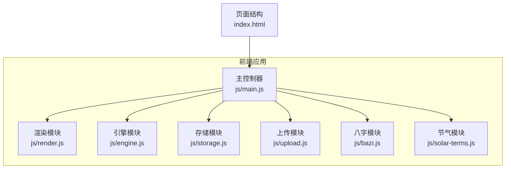
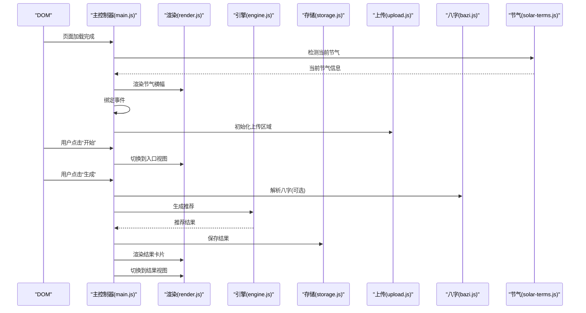
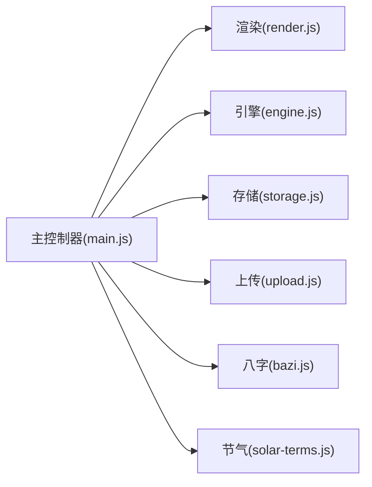

# 主控制器API

<cite>
**本文引用的文件**
- [main.js](file://js/main.js)
- [engine.js](file://js/engine.js)
- [render.js](file://js/render.js)
- [storage.js](file://js/storage.js)
- [upload.js](file://js/upload.js)
- [bazi.js](file://js/bazi.js)
- [solar-terms.js](file://js/solar-terms.js)
- [index.html](file://index.html)
</cite>

## 目录
1. [简介](#简介)
2. [项目结构](#项目结构)
3. [核心组件](#核心组件)
4. [架构总览](#架构总览)
5. [详细组件分析](#详细组件分析)
6. [依赖关系分析](#依赖关系分析)
7. [性能考虑](#性能考虑)
8. [故障排查指南](#故障排查指南)
9. [结论](#结论)
10. [附录](#附录)

## 简介
本文件为主控制器模块的API参考文档，聚焦于应用初始化、视图切换、用户输入处理、推荐生成等核心能力，并说明事件绑定机制、状态管理模式、生命周期管理、错误处理策略、用户体验优化与调试工具使用方式，以及与各子模块的集成与扩展建议。

## 项目结构
主控制器位于前端模块化架构的核心位置，负责：
- 应用初始化与依赖加载
- 视图切换与路由控制
- 用户输入事件监听与数据校验
- 推荐生成的触发与结果展示
- 与渲染、存储、上传、八字与节气等模块的协作

图表来源
- [main.js](file://js/main.js#L1-L317)
- [render.js](file://js/render.js#L1-L272)
- [engine.js](file://js/engine.js#L1-L335)
- [storage.js](file://js/storage.js#L1-L116)
- [upload.js](file://js/upload.js#L1-L145)
- [bazi.js](file://js/bazi.js#L1-L193)
- [solar-terms.js](file://js/solar-terms.js#L1-L118)
- [index.html](file://index.html#L1-L236)

章节来源
- [main.js](file://js/main.js#L1-L317)
- [index.html](file://index.html#L1-L236)

## 核心组件
- initialize(): 应用初始化接口，负责加载节气信息、初始化表单、渲染节气横幅、恢复用户选择与历史数据、绑定事件、初始化上传区域、统计访问次数等。
- handleViewChange(): 视图切换接口，接收视图标识，隐藏当前视图并显示目标视图。
- handleUserInput(): 用户输入处理接口，负责监听各类交互事件（开始、返回、心愿选择、生成、换一批、上传、反馈等），进行数据收集、校验与状态更新。
- handleRecommendation(): 推荐生成接口，负责调用引擎生成推荐方案，保存结果，渲染结果页并切换视图。

章节来源
- [main.js](file://js/main.js#L26-L67)
- [main.js](file://js/main.js#L72-L153)
- [main.js](file://js/main.js#L202-L244)
- [main.js](file://js/main.js#L249-L269)

## 架构总览
主控制器作为应用入口与协调者，采用模块化设计，通过导入各功能模块实现职责分离。初始化阶段完成依赖加载与事件绑定；运行期通过事件驱动的状态变更与渲染模块协作，完成UI更新与用户交互闭环。

图表来源
- [main.js](file://js/main.js#L26-L67)
- [main.js](file://js/main.js#L202-L244)
- [render.js](file://js/render.js#L8-L16)
- [engine.js](file://js/engine.js#L268-L310)
- [storage.js](file://js/storage.js#L64-L66)
- [upload.js](file://js/upload.js#L87-L136)
- [bazi.js](file://js/bazi.js#L182-L192)
- [solar-terms.js](file://js/solar-terms.js#L36-L103)

## 详细组件分析

### initialize() 方法（应用初始化）
- 功能概述
  - 加载节气信息并渲染节气横幅
  - 初始化年份与日期下拉框
  - 恢复上次选择的心愿与八字
  - 绑定页面交互事件
  - 初始化上传区域
  - 首次访问标记与使用统计
- 参数定义
  - 无显式参数；内部通过模块导入完成依赖加载
- 初始化流程
  - 检测当前节气 -> 渲染节气横幅 -> 初始化表单 -> 恢复用户选择与历史 -> 绑定事件 -> 初始化上传区域 -> 首次访问标记与统计
- 依赖加载
  - 节气检测：依赖节气模块的数据与算法
  - 表单初始化：依赖渲染模块的初始化函数
  - 上传区域：依赖上传模块的初始化函数
  - 存储：依赖存储模块的读写函数
- 生命周期
  - 在DOM加载完成后执行，确保页面元素可用
- 错误处理
  - 节气数据加载失败时记录错误并继续初始化
  - 上传区域初始化失败时忽略并提示用户
- 用户体验
  - 首次访问提示与统计埋点，提升留存与分析能力
  - 自动恢复用户选择与历史，减少重复输入

章节来源
- [main.js](file://js/main.js#L26-L67)
- [solar-terms.js](file://js/solar-terms.js#L36-L103)
- [render.js](file://js/render.js#L19-L50)
- [storage.js](file://js/storage.js#L52-L89)
- [upload.js](file://js/upload.js#L87-L136)

### handleViewChange() 方法（视图切换）
- 功能概述
  - 接收视图标识，隐藏所有视图并将目标视图显示
- 参数定义
  - 视图标识：字符串，对应页面中的视图容器ID（如“view-welcome”、“view-entry”、“view-results”、“view-upload”）
- 路由控制
  - 通过切换视图容器的隐藏/显示实现简单路由
- 状态管理
  - 依赖全局DOM状态（视图容器类名）进行切换
- 用户体验
  - 切换动画与无障碍标签配合，保证流畅与可访问性

章节来源
- [main.js](file://js/main.js#L72-L153)
- [render.js](file://js/render.js#L8-L16)
- [index.html](file://index.html#L23-L196)

### handleUserInput() 方法（用户输入处理）
- 功能概述
  - 监听并处理多种用户交互事件，包括开始、返回、心愿选择、生成、换一批、上传、反馈等
- 事件监听
  - 开始按钮：切换到入口视图
  - 返回按钮：返回上一视图
  - 心愿标签：切换激活状态并保存选择
  - 生成按钮：收集八字数据、调用引擎生成推荐、保存结果并渲染
  - 换一批：排除已选方案后重新生成
  - 上传按钮：切换到上传视图并预览今日图片
  - 移除图片：清除本地存储并更新预览
  - 保存反馈：校验输入并保存到本地存储
- 数据验证
  - 八字输入完整性校验
  - 上传文件类型、大小校验
  - 反馈内容非空校验
- 状态更新
  - 更新当前心愿ID、八字结果、推荐结果
  - 通过存储模块持久化用户选择与历史
- 用户体验
  - Toast消息提示与模态框细节展示
  - ESC键关闭模态框与键盘支持

章节来源
- [main.js](file://js/main.js#L72-L153)
- [main.js](file://js/main.js#L158-L164)
- [main.js](file://js/main.js#L202-L244)
- [main.js](file://js/main.js#L249-L269)
- [main.js](file://js/main.js#L274-L292)
- [main.js](file://js/main.js#L297-L313)
- [upload.js](file://js/upload.js#L12-L26)
- [render.js](file://js/render.js#L198-L215)

### handleRecommendation() 方法（推荐生成）
- 功能概述
  - 触发推荐生成流程，包括加载数据、构建上下文、选择方案、模板匹配与结果封装
- 参数传递
  - termInfo：节气信息对象（包含当前节气ID、名称、五行等）
  - wishId：心愿ID（可选）
  - baziResult：八字分析结果（可选）
- 异步处理
  - 并行加载方案、心愿模板与八字模板
  - 选择方案与模板匹配均为异步操作
- 结果展示
  - 保存结果到本地存储
  - 渲染结果页标题与方案卡片
  - 切换到结果视图
- 错误处理
  - 数据加载失败时返回空结果并记录错误
  - 无可用方案时提示用户

章节来源
- [main.js](file://js/main.js#L224-L244)
- [engine.js](file://js/engine.js#L268-L310)
- [engine.js](file://js/engine.js#L315-L334)
- [storage.js](file://js/storage.js#L64-L66)
- [render.js](file://js/render.js#L104-L127)

## 依赖关系分析
主控制器通过模块导入与导出与各子模块建立松耦合依赖，形成清晰的职责边界与调用链路。

图表来源
- [main.js](file://js/main.js#L5-L16)
- [engine.js](file://js/engine.js#L1-L335)
- [render.js](file://js/render.js#L1-L272)
- [storage.js](file://js/storage.js#L1-L116)
- [upload.js](file://js/upload.js#L1-L145)
- [bazi.js](file://js/bazi.js#L1-L193)
- [solar-terms.js](file://js/solar-terms.js#L1-L118)

章节来源
- [main.js](file://js/main.js#L5-L16)

## 性能考虑
- 并行加载：推荐生成阶段并行加载多类数据，缩短首屏等待时间
- 本地存储：使用localStorage减少网络请求与服务器压力
- 图片压缩：上传阶段对图片进行压缩与尺寸调整，降低带宽占用
- 动画与渲染：卡片渲染采用延迟动画，避免一次性大量DOM操作
- 节气计算：节气数据按需加载并缓存，避免重复请求

## 故障排查指南
- 初始化失败
  - 检查节气数据加载是否成功，确认网络与数据文件路径
  - 确认DOM元素是否存在，避免事件绑定失败
- 推荐为空
  - 检查方案数据是否正确加载
  - 确认心愿ID与八字结果是否符合预期
- 上传失败
  - 检查文件类型与大小限制
  - 查看压缩过程是否抛出异常
- 本地存储异常
  - 检查浏览器隐私模式或存储配额限制
  - 使用开发者工具查看localStorage内容

章节来源
- [main.js](file://js/main.js#L26-L67)
- [main.js](file://js/main.js#L274-L292)
- [engine.js](file://js/engine.js#L268-L310)
- [storage.js](file://js/storage.js#L7-L23)

## 结论
主控制器通过明确的初始化流程、稳定的事件绑定机制、清晰的状态管理模式与完善的错误处理策略，实现了从用户输入到推荐结果的完整闭环。其模块化设计便于扩展与维护，适合在此基础上增加更多业务场景与交互能力。

## 附录

### API定义与调用规范

- initialize()
  - 输入：无
  - 输出：void
  - 依赖：节气模块、渲染模块、存储模块、上传模块
  - 时机：页面DOMContentLoaded后
  - 示例路径：[初始化流程](file://js/main.js#L26-L67)

- handleViewChange(viewId)
  - 输入：viewId（字符串，视图容器ID）
  - 输出：void
  - 依赖：渲染模块
  - 示例路径：[视图切换](file://js/render.js#L8-L16)

- handleUserInput(eventType, payload)
  - 输入：eventType（字符串，事件类型）、payload（对象，事件相关数据）
  - 输出：void
  - 依赖：渲染模块、存储模块、上传模块、八字模块、引擎模块
  - 示例路径：[事件绑定与处理](file://js/main.js#L72-L153)

- handleRecommendation(termInfo, wishId, baziResult)
  - 输入：termInfo（对象）、wishId（字符串）、baziResult（对象）
  - 输出：Promise（推荐结果对象）
  - 依赖：引擎模块、存储模块、渲染模块
  - 示例路径：[推荐生成](file://js/main.js#L224-L244)

### 事件绑定机制
- 事件委托：详情按钮使用事件委托，避免频繁绑定/解绑
- 键盘支持：上传区域支持Enter/Space键触发
- ESC关闭：模态框支持ESC键关闭
- 模块化绑定：事件绑定集中在bindEvents()中，便于维护

章节来源
- [main.js](file://js/main.js#L72-L153)
- [render.js](file://js/render.js#L198-L215)
- [upload.js](file://js/upload.js#L99-L104)

### 状态管理模式
- 全局状态：当前节气信息、心愿ID、八字结果、推荐结果
- 本地持久化：使用存储模块统一管理用户选择与历史
- 渲染联动：状态变化通过渲染模块更新UI

章节来源
- [main.js](file://js/main.js#L17-L22)
- [storage.js](file://js/storage.js#L52-L115)
- [render.js](file://js/render.js#L114-L127)

### 生命周期管理
- 初始化：DOMContentLoaded触发
- 运行期：事件驱动的状态变更
- 销毁：页面卸载时自动清理（无显式销毁逻辑）

章节来源
- [main.js](file://js/main.js#L316-L317)

### 错误处理策略
- 数据加载失败：记录错误并降级处理
- 用户输入校验：即时提示并阻止无效操作
- 异常捕获：上传阶段try/catch包裹
- 友好提示：Toast消息与模态框展示

章节来源
- [main.js](file://js/main.js#L26-L67)
- [main.js](file://js/main.js#L274-L292)
- [render.js](file://js/render.js#L242-L271)

### 用户体验优化
- 动画与过渡：卡片渲染延迟动画、Toast淡入淡出
- 无障碍：视图与模态框具备aria标签
- 键盘友好：上传区域支持键盘触发
- 本地化：节气与五行名称本地化展示

章节来源
- [render.js](file://js/render.js#L132-L154)
- [render.js](file://js/render.js#L242-L271)
- [index.html](file://index.html#L23-L196)

### 调试工具使用指南
- 控制台日志：初始化、生成、上传等关键步骤均输出日志
- 浏览器开发者工具：检查localStorage、网络请求与事件绑定
- 网络面板：确认数据文件加载状态
- 存储面板：核对用户选择与历史数据

章节来源
- [main.js](file://js/main.js#L26-L67)
- [main.js](file://js/main.js#L202-L244)
- [main.js](file://js/main.js#L274-L292)

### 与其他模块的集成方式
- 渲染模块：负责视图切换、卡片渲染、模态框与Toast
- 引擎模块：负责数据加载、上下文构建、方案评分与选择
- 存储模块：负责本地持久化与统计数据
- 上传模块：负责文件校验、压缩与上传区域初始化
- 八字模块：负责生辰八字解析与五行分析
- 节气模块：负责当前节气检测与季节信息

章节来源
- [main.js](file://js/main.js#L5-L16)
- [engine.js](file://js/engine.js#L1-L335)
- [render.js](file://js/render.js#L1-L272)
- [storage.js](file://js/storage.js#L1-L116)
- [upload.js](file://js/upload.js#L1-L145)
- [bazi.js](file://js/bazi.js#L1-L193)
- [solar-terms.js](file://js/solar-terms.js#L1-L118)

### 扩展开发建议
- 新增视图：在HTML中添加视图容器，使用渲染模块的showView切换
- 新增事件：在bindEvents中添加事件监听，必要时引入新的处理函数
- 新增推荐规则：在引擎模块中扩展上下文构建与评分逻辑
- 新增数据源：在存储模块中新增键值，或在数据文件中扩展JSON结构
- 新增上传格式：在上传模块中扩展校验与压缩策略
- 新增分析维度：在八字模块中扩展分析算法与模板匹配

章节来源
- [index.html](file://index.html#L23-L196)
- [render.js](file://js/render.js#L8-L16)
- [engine.js](file://js/engine.js#L268-L334)
- [storage.js](file://js/storage.js#L52-L115)
- [upload.js](file://js/upload.js#L12-L82)
- [bazi.js](file://js/bazi.js#L182-L192)