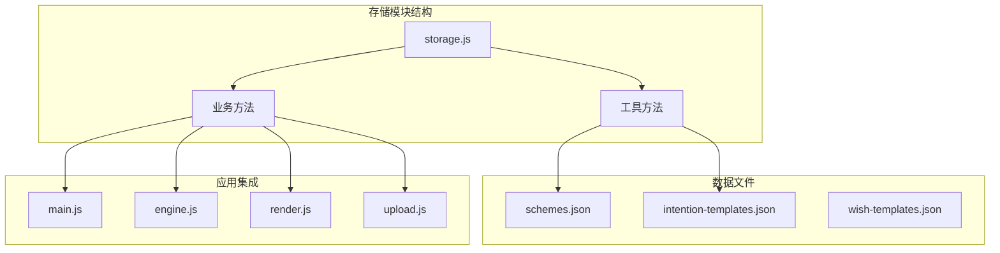
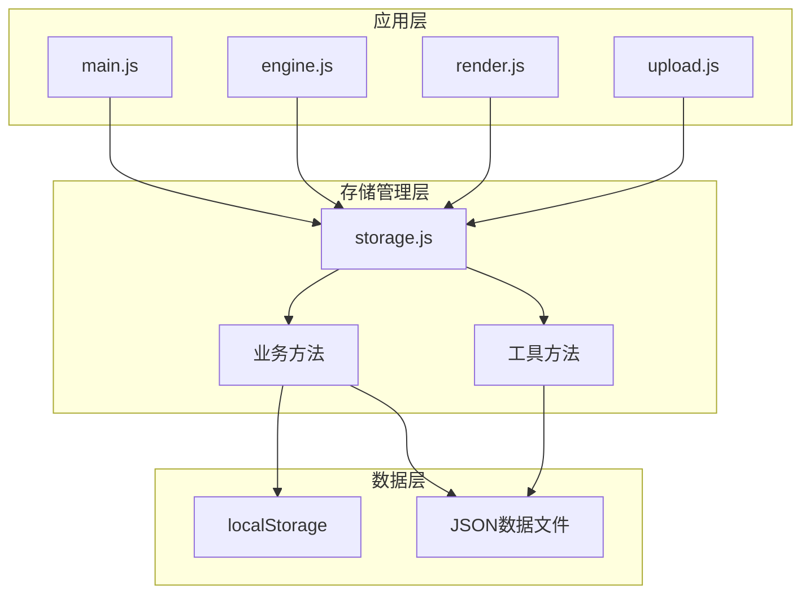
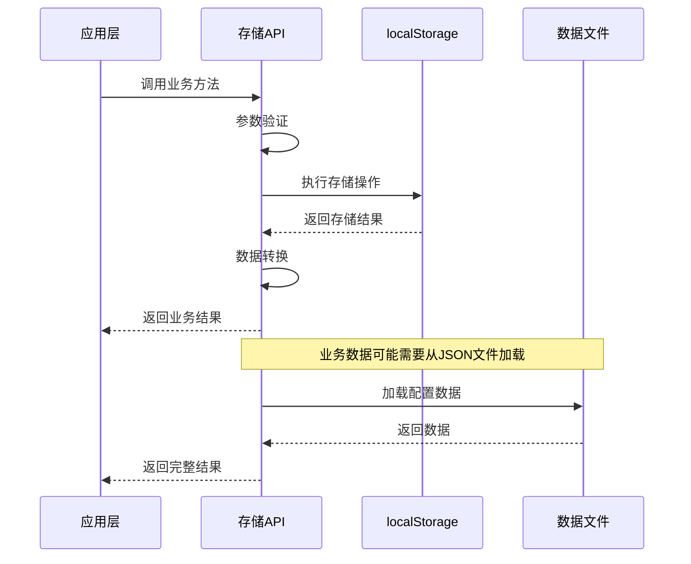
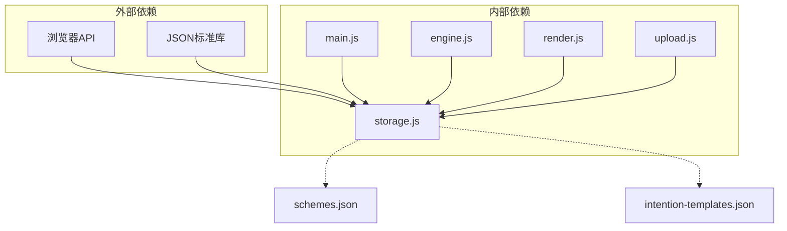
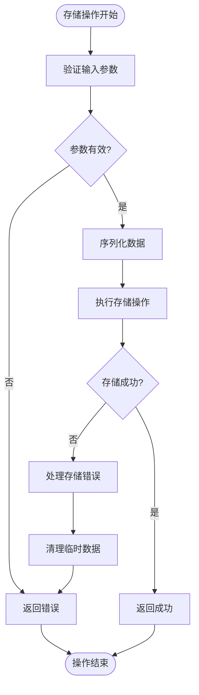

# 存储API

<cite>
**本文档引用的文件**
- [storage.js](file://js/storage.js)
- [main.js](file://js/main.js)
- [engine.js](file://js/engine.js)
- [render.js](file://js/render.js)
- [upload.js](file://js/upload.js)
- [schemes.json](file://data/schemes.json)
- [intention-templates.json](file://data/intention-templates.json)
- [index.html](file://index.html)
</cite>

## 目录
1. [简介](#简介)
2. [项目结构](#项目结构)
3. [核心组件](#核心组件)
4. [架构概览](#架构概览)
5. [详细组件分析](#详细组件分析)
6. [依赖关系分析](#依赖关系分析)
7. [性能考虑](#性能考虑)
8. [故障排除指南](#故障排除指南)
9. [结论](#结论)

## 简介

存储API是五行情装建议系统的核心数据持久化模块，负责管理用户的选择、生成结果、上传的图片以及应用使用统计等数据。该模块基于浏览器的LocalStorage技术，提供了简单易用的键值对存储接口，并封装了业务相关的存储方法。

系统采用模块化设计，将通用的存储操作与具体的业务逻辑分离，确保了代码的可维护性和可测试性。存储API不仅处理基本的增删改查操作，还包含了数据序列化、错误处理和缓存管理等高级功能。

## 项目结构

存储模块位于JavaScript目录下，采用单一文件模块化设计，所有存储相关的功能都集中在storage.js文件中。

**图表来源**
- [storage.js](file://js/storage.js#L1-L116)
- [main.js](file://js/main.js#L1-L317)

**章节来源**
- [storage.js](file://js/storage.js#L1-L116)
- [index.html](file://index.html#L1-L236)

## 核心组件

存储API包含两个主要层次的功能：基础存储层和业务存储层。

### 基础存储层

基础存储层提供了通用的localStorage操作接口，包括：
- 数据获取：`get(key)` - 安全地从localStorage读取数据
- 数据设置：`set(key, value)` - 安全地向localStorage写入数据
- 数据删除：`remove(key)` - 删除指定键的数据
- 批量操作：`getKeysByPrefix(prefix)` 和 `clearAll()` - 支持前缀匹配和批量清理

### 业务存储层

业务存储层封装了应用特定的存储需求，包括：
- 用户选择存储：`saveSelectedWish(wishId)` 和 `getSelectedWish()`
- 推荐结果存储：`saveLastResult(result)` 和 `getLastResult()`
- 八字信息存储：`saveLastBazi(bazi)` 和 `getLastBazi()`
- 上传图片存储：`saveUploadedOutfit(date, imageData)` 等
- 反馈数据存储：`saveFeedback(date, feedback)` 和 `getFeedback(date)`
- 使用统计：`incrementUsage(type)` 和 `getUsageStats()`

**章节来源**
- [storage.js](file://js/storage.js#L7-L115)

## 架构概览

存储API采用分层架构设计，实现了关注点分离和职责明确的模块化结构。

**图表来源**
- [storage.js](file://js/storage.js#L1-L116)
- [main.js](file://js/main.js#L5-L15)

## 详细组件分析

### 基础存储接口

#### get(key) 方法
- **功能**：安全地从localStorage读取数据并进行JSON解析
- **参数**：`key` - 存储键名
- **返回值**：解析后的数据对象，如果不存在返回null
- **错误处理**：使用try-catch包装JSON.parse，防止解析错误导致应用崩溃
- **数据格式**：自动处理JSON序列化和反序列化

#### set(key, value) 方法
- **功能**：将数据安全地存储到localStorage
- **参数**：
  - `key` - 存储键名
  - `value` - 要存储的数据对象
- **返回值**：存储成功返回true，失败返回false
- **错误处理**：捕获localStorage写入异常，确保应用稳定性
- **数据格式**：自动进行JSON序列化

#### remove(key) 方法
- **功能**：删除指定键的localStorage数据
- **参数**：`key` - 要删除的键名
- **返回值**：void

#### getKeysByPrefix(prefix) 方法
- **功能**：根据前缀获取所有匹配的键名
- **参数**：`prefix` - 键名前缀
- **返回值**：匹配键名数组
- **复杂度**：O(n)，其中n为localStorage中键的数量

#### clearAll() 方法
- **功能**：清除所有以特定前缀开头的键
- **参数**：无
- **返回值**：void
- **用途**：数据清理和重置功能

**章节来源**
- [storage.js](file://js/storage.js#L7-L49)

### 业务存储接口

#### 心愿选择存储

##### saveSelectedWish(wishId) 方法
- **功能**：保存用户选择的心愿ID
- **参数**：`wishId` - 心愿标识符
- **存储位置**：localStorage中键名为"selected_wish"
- **数据类型**：字符串类型的心愿ID
- **使用场景**：应用初始化时恢复用户选择

##### getSelectedWish() 方法
- **功能**：获取用户上次选择的心愿
- **参数**：无
- **返回值**：心愿ID字符串或null
- **用途**：应用启动时的用户偏好恢复

**章节来源**
- [storage.js](file://js/storage.js#L109-L115)

#### 推荐结果存储

##### saveLastResult(result) 方法
- **功能**：保存最后一次生成的推荐结果
- **参数**：`result` - 推荐结果对象
- **存储位置**：localStorage中键名为"last_result"
- **数据结构**：完整的推荐结果对象，包含方案列表、节气信息、生成时间等
- **序列化策略**：使用JSON.stringify进行序列化
- **存储时机**：每次成功生成推荐后调用

##### getLastResult() 方法
- **功能**：获取上次的推荐结果
- **参数**：无
- **返回值**：推荐结果对象或null
- **用途**：应用重启后恢复之前的推荐结果
- **错误处理**：返回null表示无可用数据

**章节来源**
- [storage.js](file://js/storage.js#L60-L66)

#### 八字信息存储

##### saveLastBazi(bazi) 方法
- **功能**：保存用户的八字信息
- **参数**：`bazi` - 八字数据对象
- **存储位置**：localStorage中键名为"last_bazi"
- **数据结构**：包含年、月、日、时字段的对象
- **用途**：简化用户输入，提升用户体验

##### getLastBazi() 方法
- **功能**：获取上次保存的八字信息
- **参数**：无
- **返回值**：八字数据对象或null

**章节来源**
- [storage.js](file://js/storage.js#L52-L58)

#### 上传图片存储

##### saveUploadedOutfit(date, imageData) 方法
- **功能**：保存用户上传的穿搭图片
- **参数**：
  - `date` - 日期字符串（格式：YYYY-MM-DD）
  - `imageData` - 图片数据（Base64编码）
- **存储位置**：localStorage中键名为"outfit_" + 日期
- **数据类型**：Base64字符串
- **存储策略**：按日期分隔存储，避免单一键过大

##### getUploadedOutfit(date) 方法
- **功能**：获取指定日期的上传图片
- **参数**：`date` - 日期字符串
- **返回值**：图片数据或null

##### removeUploadedOutfit(date) 方法
- **功能**：删除指定日期的上传图片
- **参数**：`date` - 日期字符串
- **返回值**：void

**章节来源**
- [storage.js](file://js/storage.js#L79-L89)

#### 反馈数据存储

##### saveFeedback(date, feedback) 方法
- **功能**：保存用户的穿搭反馈
- **参数**：
  - `date` - 日期字符串
  - `feedback` - 反馈数据对象
- **存储位置**：localStorage中键名为"feedbacks"
- **数据结构**：对象形式，键为日期，值为反馈内容
- **反馈内容**：包含文本内容和保存时间戳

##### getFeedback(date) 方法
- **功能**：获取指定日期的反馈
- **参数**：`date` - 日期字符串
- **返回值**：反馈对象或null

**章节来源**
- [storage.js](file://js/storage.js#L68-L77)

#### 使用统计存储

##### getUsageStats() 方法
- **功能**：获取应用使用统计数据
- **参数**：无
- **返回值**：统计对象，包含访问次数、生成次数、上传次数
- **默认值**：如果不存在则返回预设的统计结构

##### incrementUsage(type) 方法
- **功能**：增加指定类型的使用计数
- **参数**：`type` - 统计类型（visits/generates/uploads）
- **返回值**：void
- **更新策略**：原子性更新，避免并发问题

##### isFirstVisit() 方法
- **功能**：检查是否为首次访问
- **参数**：无
- **返回值**：布尔值

##### markVisited() 方法
- **功能**：标记用户已访问
- **参数**：无
- **返回值**：void

**章节来源**
- [storage.js](file://js/storage.js#L91-L107)

### 数据流分析

存储API的数据流遵循统一的模式：应用层调用业务方法 -> 存储层执行数据操作 -> 返回结果给调用方。

**图表来源**
- [storage.js](file://js/storage.js#L1-L116)
- [main.js](file://js/main.js#L202-L244)

## 依赖关系分析

存储API与其他模块的依赖关系体现了清晰的关注点分离原则。

**图表来源**
- [storage.js](file://js/storage.js#L1-L116)
- [main.js](file://js/main.js#L5-L15)

### 主要依赖关系

1. **浏览器依赖**：完全依赖浏览器的localStorage API
2. **JSON依赖**：使用标准JSON序列化处理复杂数据结构
3. **应用集成**：被多个业务模块调用，包括主应用、引擎、渲染和上传模块

### 耦合度分析

存储API与业务模块之间保持低耦合：
- 通过明确的接口定义进行交互
- 数据格式标准化，便于扩展
- 异常处理独立，不影响业务流程

**章节来源**
- [main.js](file://js/main.js#L5-L15)
- [engine.js](file://js/engine.js#L1-L10)

## 性能考虑

存储API在设计时充分考虑了性能和用户体验：

### 存储策略优化

1. **增量更新**：使用对象合并的方式更新反馈数据，避免覆盖整个存储空间
2. **前缀匹配**：提供批量清理功能，支持按前缀删除，便于数据维护
3. **异步处理**：虽然localStorage是同步API，但通过合理的调用时机避免阻塞主线程

### 内存管理

1. **数据压缩**：图片数据采用Base64编码，虽然会增加约33%的大小，但便于存储
2. **生命周期管理**：提供专门的清理方法，支持按日期删除过期数据
3. **容量监控**：localStorage容量有限，需要合理规划存储策略

### 缓存机制

1. **应用级缓存**：业务模块在内存中缓存常用数据，减少重复存储操作
2. **懒加载**：数据文件采用按需加载，避免不必要的网络请求
3. **失效策略**：通过时间戳和版本控制确保数据一致性

## 故障排除指南

### 常见问题及解决方案

#### 存储失败
- **症状**：set()方法返回false
- **原因**：localStorage空间不足或浏览器限制
- **解决方案**：清理旧数据或使用其他存储方案

#### 数据损坏
- **症状**：get()方法抛出异常或返回null
- **原因**：JSON解析失败或数据格式错误
- **解决方案**：使用try-catch包装，提供默认值

#### 数据丢失
- **症状**：应用重启后数据消失
- **原因**：浏览器清除缓存或隐私模式
- **解决方案**：提供数据导出/导入功能

### 错误恢复策略

**图表来源**
- [storage.js](file://js/storage.js#L7-L23)

### 调试技巧

1. **开发者工具**：使用浏览器的Application面板查看localStorage内容
2. **日志记录**：在关键存储操作处添加console.log输出
3. **单元测试**：为存储方法编写测试用例，确保功能正确性

**章节来源**
- [storage.js](file://js/storage.js#L7-L23)

## 结论

存储API作为五行情装建议系统的核心基础设施，成功实现了以下目标：

1. **功能完整性**：涵盖了应用所需的所有数据持久化需求
2. **架构清晰**：分层设计使得代码结构清晰，易于维护
3. **性能优化**：通过合理的存储策略和缓存机制提升了用户体验
4. **错误处理**：完善的异常处理确保了应用的稳定性
5. **扩展性**：模块化设计为未来的功能扩展奠定了基础

存储API的设计体现了现代Web应用的最佳实践，既满足了当前的功能需求，又为未来的发展预留了充足的空间。通过合理使用localStorage和JSON序列化，系统能够在保证数据完整性的同时提供流畅的用户体验。