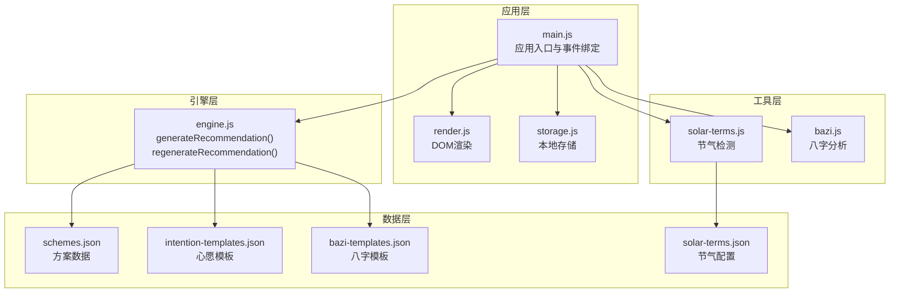
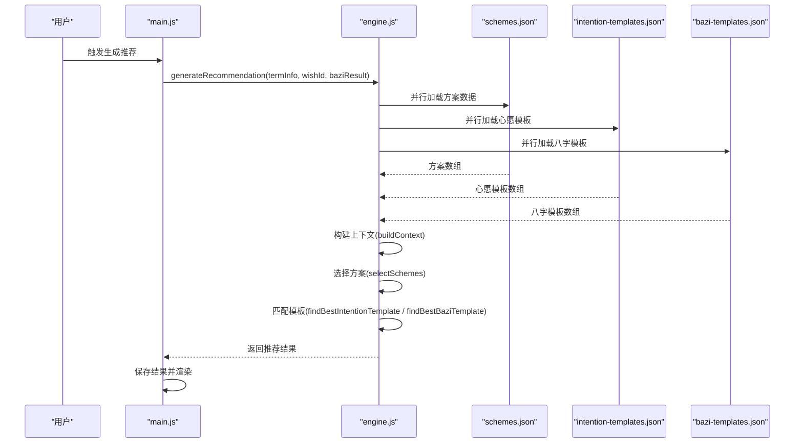
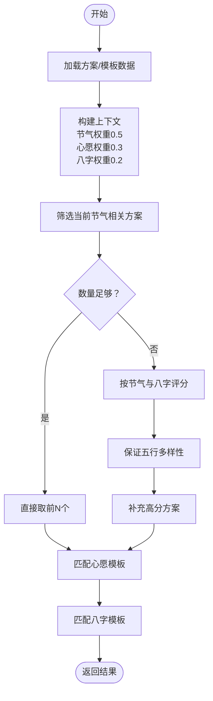
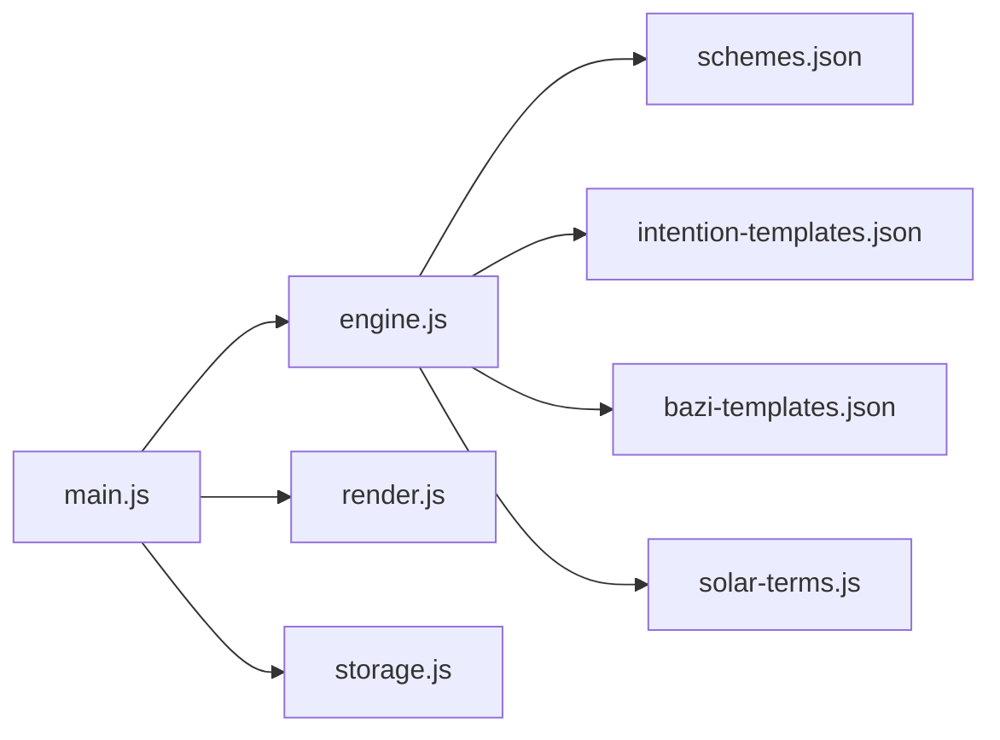

# 推荐引擎API

<cite>
**本文引用的文件列表**
- [engine.js](file://js/engine.js)
- [main.js](file://js/main.js)
- [solar-terms.js](file://js/solar-terms.js)
- [bazi.js](file://js/bazi.js)
- [render.js](file://js/render.js)
- [storage.js](file://js/storage.js)
- [schemes.json](file://data/schemes.json)
- [bazi-templates.json](file://data/bazi-templates.json)
- [intention-templates.json](file://data/intention-templates.json)
- [solar-terms.json](file://data/solar-terms.json)
- [index.html](file://index.html)
</cite>

## 目录
1. [简介](#简介)
2. [项目结构](#项目结构)
3. [核心组件](#核心组件)
4. [架构总览](#架构总览)
5. [详细组件分析](#详细组件分析)
6. [依赖关系分析](#依赖关系分析)
7. [性能考量](#性能考量)
8. [故障排查指南](#故障排查指南)
9. [结论](#结论)
10. [附录](#附录)

## 简介
本文件为“推荐引擎”模块的详细API文档，聚焦于两个核心方法：
- generateRecommendation(termInfo, wishId, baziResult)
- regenerateRecommendation(termInfo, wishId, baziResult, excludeIds)

文档涵盖参数结构、返回值格式、调用示例、错误处理策略、性能优化建议与最佳实践，并深入解释推荐算法的关键技术点，包括权重分配、五行相生相克关系、节气距离计算等。

## 项目结构
推荐引擎位于前端模块化架构中，采用“数据驱动 + 算法模块”的设计：
- 数据层：从 data 目录加载方案、模板与节气配置
- 引擎层：核心算法与评分逻辑
- 应用层：入口与UI交互，负责组装参数并展示结果

图表来源
- [engine.js](file://js/engine.js#L268-L334)
- [main.js](file://js/main.js#L1-L317)
- [solar-terms.js](file://js/solar-terms.js#L1-L118)
- [bazi.js](file://js/bazi.js#L1-L193)
- [schemes.json](file://data/schemes.json#L1-L509)
- [intention-templates.json](file://data/intention-templates.json#L1-L253)
- [bazi-templates.json](file://data/bazi-templates.json#L1-L103)
- [solar-terms.json](file://data/solar-terms.json#L1-L42)

章节来源
- [engine.js](file://js/engine.js#L1-L335)
- [main.js](file://js/main.js#L1-L317)

## 核心组件
- 推荐引擎模块（engine.js）
  - 提供 generateRecommendation() 与 regenerateRecommendation() 两个API
  - 内置数据加载、上下文构建、评分与选择逻辑
- 应用入口（main.js）
  - 负责收集用户输入（节气、心愿、八字），调用引擎并渲染结果
- 工具模块
  - 节气检测（solar-terms.js）
  - 八字分析（bazi.js）

章节来源
- [engine.js](file://js/engine.js#L268-L334)
- [main.js](file://js/main.js#L202-L269)

## 架构总览
推荐流程概览（generateRecommendation）：
1. 加载方案、心愿模板、八字模板
2. 构建推荐上下文（包含节气五行、心愿权重、八字推荐五行）
3. 基于节气与八字进行方案筛选与打分
4. 选择满足多样性的前N个方案
5. 匹配心愿模板与八字模板
6. 返回包含方案与上下文信息的结果对象

图表来源
- [engine.js](file://js/engine.js#L268-L310)
- [main.js](file://js/main.js#L224-L244)
- [schemes.json](file://data/schemes.json#L1-L509)
- [intention-templates.json](file://data/intention-templates.json#L1-L253)
- [bazi-templates.json](file://data/bazi-templates.json#L1-L103)

## 详细组件分析

### generateRecommendation(termInfo, wishId, baziResult)
- 功能：生成个性化穿搭推荐
- 参数
  - termInfo: 节气信息对象
    - current: 当前节气对象
      - id: 节气ID（字符串）
      - name: 节气名称（字符串）
      - wuxing: 节气对应五行（字符串，取值范围见“附录-数据模型”）
      - wuxingName: 五行中文名（字符串）
    - next: 下一个节气对象（同上，可能为空）
    - seasonInfo: 季节信息（对象，包含 name 与 wuxing）
    - wuxingNames: 五行中文名映射（对象）
  - wishId: 心愿ID（字符串，枚举值见“附录-心愿ID枚举”）
  - baziResult: 八字分析结果（对象，结构见“附录-八字结果结构”）
- 返回值
  - schemes: 推荐方案数组（长度通常为3，每个元素包含 id、termId、rank、color、material、feeling、annotation、source）
  - termInfo: 原样返回的节气信息
  - wishId: 原样返回的心愿ID
  - intentionTemplate: 匹配到的心愿模板（若未匹配则为null）
  - baziResult: 原样返回的八字分析结果
  - baziTemplate: 匹配到的八字模板（若未匹配则为null）
  - generatedAt: 生成时间戳（ISO 8601字符串）
- 错误处理
  - 若任一数据加载失败，返回 null
  - 若方案数据缺失，记录错误并返回 null
- 性能优化
  - 使用 Promise.all 并行加载多源数据
  - 评分与选择过程避免重复计算
- 最佳实践
  - 在调用前确保 termInfo 来自 detectCurrentTerm() 的正确结果
  - wishId 为可选；若提供，将尝试匹配相应心愿模板
  - baziResult 为可选；若提供，将用于匹配八字模板并影响方案权重

章节来源
- [engine.js](file://js/engine.js#L268-L310)
- [main.js](file://js/main.js#L224-L244)

### regenerateRecommendation(termInfo, wishId, baziResult, excludeIds)
- 功能：在已有推荐基础上“换一批”，排除已显示的方案
- 参数
  - termInfo, wishId, baziResult: 同 generateRecommendation()
  - excludeIds: 已显示方案ID数组（字符串数组）
- 返回值
  - schemes: 排除已显示后的推荐方案数组
  - termInfo, wishId, baziResult, generatedAt: 同 generateRecommendation()
- 错误处理
  - 若方案数据缺失，返回 null
- 性能优化
  - 先过滤掉已排除ID，再进行评分与选择
- 最佳实践
  - excludeIds 通常来自上一次 generateRecommendation() 的 schemes.map(s => s.id)

章节来源
- [engine.js](file://js/engine.js#L315-L334)
- [main.js](file://js/main.js#L254-L269)

### 推荐算法核心逻辑
- 上下文构建（buildContext）
  - 从 termInfo.current.wuxing 获取节气五行
  - 设置权重：节气权重0.5、心愿权重0.3、八字权重0.2
  - 若存在 baziResult.recommend，则设置 baziWuxing
- 方案评分（scoreScheme）
  - 节气匹配：完全匹配加100%，相生加60%
  - 八字匹配：完全匹配加100%，相生加60%
- 方案选择（selectSchemes）
  - 优先选择与当前节气相同的方案
  - 不足数量时按得分排序
  - 保证五行多样性（至少包含两种不同五行）
  - 若仍不足，补充高分方案
- 模板匹配
  - 心愿模板：按节气距离最近匹配
  - 八字模板：按“日主某五行旺”且年份匹配优先

图表来源
- [engine.js](file://js/engine.js#L157-L259)

章节来源
- [engine.js](file://js/engine.js#L157-L259)

### 数据模型与映射

#### 节气信息对象（termInfo）
- current: 当前节气对象
  - id: 节气ID（字符串）
  - name: 节气名称（字符串）
  - wuxing: 节气对应五行（字符串）
  - wuxingName: 五行中文名（字符串）
- next: 下一个节气对象（同上，可能为空）
- seasonInfo: 季节信息（对象，包含 name 与 wuxing）
- wuxingNames: 五行中文名映射（对象）

章节来源
- [solar-terms.js](file://js/solar-terms.js#L88-L102)
- [solar-terms.json](file://data/solar-terms.json#L1-L42)

#### 心愿ID枚举（wishId）
- career: 求职
- guiren: 贵人运
- travel: 远行顺利
- focus: 静心专注
- health: 健康舒畅

章节来源
- [engine.js](file://js/engine.js#L10-L16)
- [index.html](file://index.html#L54-L58)

#### 八字结果结构（baziResult）
- bazi: 四柱（year、month、day、hour），每柱包含 gan、zhi、full
- profile: 五行分布统计（wood、fire、earth、metal、water）
- recommend: 推荐元素
  - weakest: 最弱五行
  - strongest: 最强五行
  - recommend: 推荐补充的五行
  - analysis: 分析文本

章节来源
- [bazi.js](file://js/bazi.js#L182-L192)

#### 方案数据结构（schemes.json）
- schemes: 数组，每个元素包含
  - id: 方案ID（字符串）
  - termId: 所属节气ID（字符串）
  - rank: 排序权重（数字）
  - color: 对象，包含 name、hex、wuxing
  - material: 材质（字符串）
  - feeling: 感受（字符串）
  - annotation: 五行解读（字符串）
  - source: 典籍出处（字符串）

章节来源
- [schemes.json](file://data/schemes.json#L1-L509)

#### 模板数据结构
- 心愿模板（intention-templates.json）
  - intention: 心愿类型（字符串）
  - solarTerm: 节气（字符串）
  - color/material/feeling/annotation/source: 字段同方案
- 八字模板（bazi-templates.json）
  - baZiKey: 关键词（如“日主木旺｜2024甲辰年”）
  - solarTerm: 节气（字符串）
  - color/material/feeling/annotation/source: 字段同方案

章节来源
- [intention-templates.json](file://data/intention-templates.json#L1-L253)
- [bazi-templates.json](file://data/bazi-templates.json#L1-L103)

## 依赖关系分析
- generateRecommendation 依赖
  - 并行加载：schemes.json、intention-templates.json、bazi-templates.json
  - 上下文：solar-terms.js 提供的节气信息
  - 模板匹配：engine.js 内部函数
- regenerateRecommendation 依赖
  - 仅加载 schemes.json
  - 基于 excludeIds 过滤方案
- 数据耦合
  - 方案与节气ID关联（termId）
  - 模板与节气名称/ID关联（solarTerm）

图表来源
- [engine.js](file://js/engine.js#L268-L334)
- [main.js](file://js/main.js#L1-L317)

章节来源
- [engine.js](file://js/engine.js#L268-L334)
- [main.js](file://js/main.js#L1-L317)

## 性能考量
- 并行加载：使用 Promise.all 同时读取三个数据源，减少等待时间
- 评分与选择：先按节气过滤，再按得分排序，避免对无关方案计算
- 五行多样性：通过集合去重，控制循环次数
- 模板匹配：按心愿类型与年份优先匹配，减少遍历成本
- 建议
  - 将常用数据缓存于内存（当前已做）
  - 控制模板数量，避免过多匹配开销
  - 对大数据量场景可考虑分页或懒加载

[本节为通用性能建议，无需特定文件引用]

## 故障排查指南
- generateRecommendation 返回 null
  - 检查数据加载是否成功（控制台错误日志）
  - 确认 schemes.json 是否包含 schemes 字段
- regenerateRecommendation 返回 null
  - 检查 schemes.json 是否加载成功
  - 确认 excludeIds 为字符串数组
- 模板未匹配
  - 心愿模板：确认 wishId 与 intention 名称一致
  - 八字模板：确认 baziResult.recommend.recommend 存在且与模板关键词匹配
- 节气信息异常
  - 确认 detectCurrentTerm() 返回的 termInfo.current.wuxing 正确
- UI不更新
  - 检查 main.js 中 handleGenerate()/handleRegenerate() 是否正确保存并渲染结果

章节来源
- [engine.js](file://js/engine.js#L40-L49)
- [engine.js](file://js/engine.js#L54-L64)
- [engine.js](file://js/engine.js#L69-L79)
- [main.js](file://js/main.js#L224-L244)
- [main.js](file://js/main.js#L254-L269)

## 结论
推荐引擎通过“节气 + 心愿 + 八字”三要素构建上下文，结合方案评分与模板匹配，输出兼具文化依据与用户体验的个性化推荐。API设计清晰、职责分离明确，具备良好的扩展性与可维护性。建议在生产环境中配合缓存与错误监控，持续优化加载与渲染性能。

[本节为总结性内容，无需特定文件引用]

## 附录

### 方法调用示例（路径引用）
- 生成推荐
  - 调用位置：[main.js](file://js/main.js#L224-L228)
  - 参数来源：当前节气信息、心愿ID、八字结果
- 换一批
  - 调用位置：[main.js](file://js/main.js#L254-L259)
  - 参数来源：当前节气信息、心愿ID、八字结果、已显示方案ID数组

章节来源
- [main.js](file://js/main.js#L224-L228)
- [main.js](file://js/main.js#L254-L259)

### 错误处理策略
- 数据加载失败：记录错误并返回 null
- 缺失关键字段：返回 null 并提示
- 模板匹配不到：返回 null 或保留 null 字段

章节来源
- [engine.js](file://js/engine.js#L40-L49)
- [engine.js](file://js/engine.js#L54-L64)
- [engine.js](file://js/engine.js#L69-L79)
- [engine.js](file://js/engine.js#L276-L279)

### 性能优化建议
- 使用缓存：内存中缓存已加载的数据
- 并行请求：Promise.all 同时加载多个数据源
- 评分剪枝：先按节气过滤，再按得分排序
- 模板索引：按心愿类型与年份建立索引，加速匹配

章节来源
- [engine.js](file://js/engine.js#L270-L274)
- [engine.js](file://js/engine.js#L218-L259)

### 最佳实践
- 输入校验：确保 termInfo 来自 detectCurrentTerm()，wishId 属于枚举值
- 可选参数：wishId 与 baziResult 可为空，不影响基本推荐
- 排除机制：换一批时传入 excludeIds，避免重复展示
- 渲染与存储：使用 render.js 与 storage.js 协作，提升用户体验

章节来源
- [solar-terms.js](file://js/solar-terms.js#L36-L103)
- [engine.js](file://js/engine.js#L10-L16)
- [engine.js](file://js/engine.js#L315-L334)
- [render.js](file://js/render.js#L114-L127)
- [storage.js](file://js/storage.js#L60-L66)