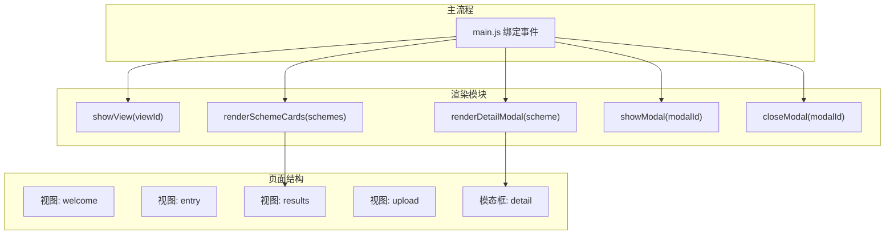
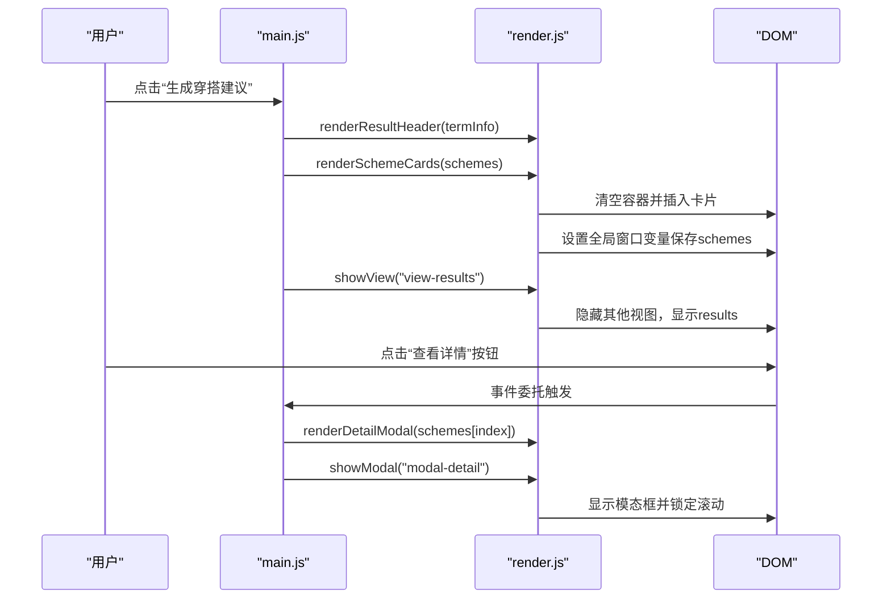
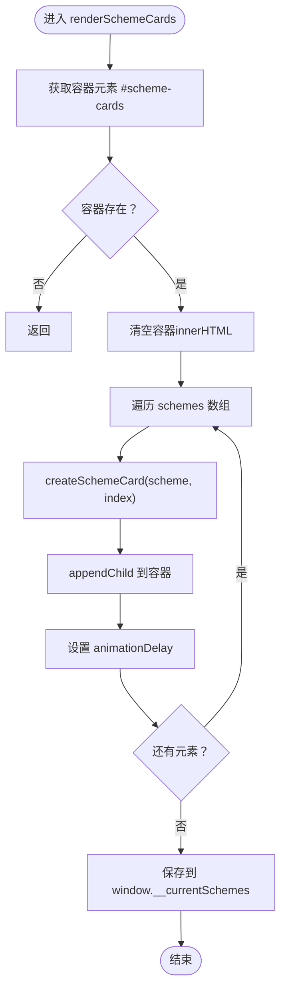
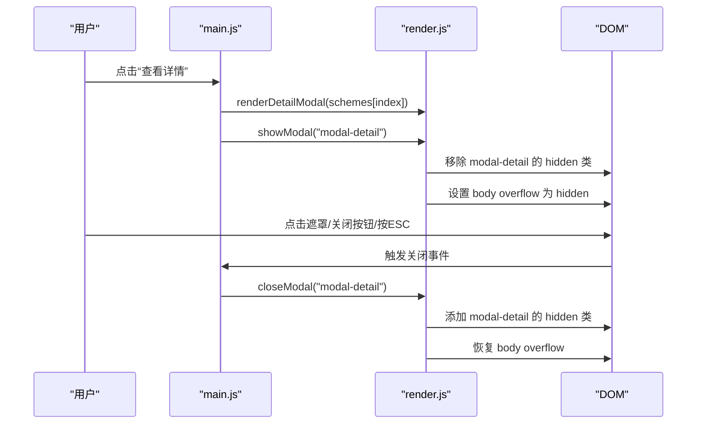
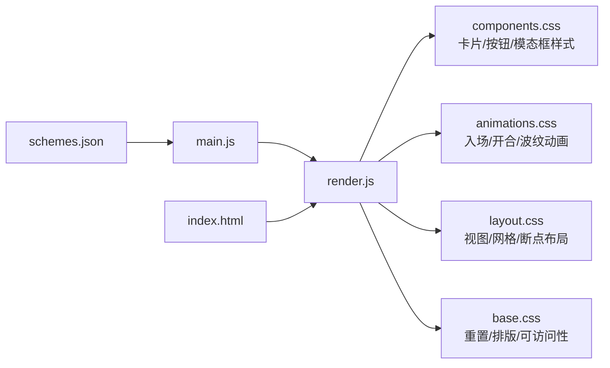

# 渲染API

<cite>
**本文引用的文件**
- [render.js](file://js/render.js)
- [main.js](file://js/main.js)
- [index.html](file://index.html)
- [components.css](file://css/components.css)
- [animations.css](file://css/animations.css)
- [layout.css](file://css/layout.css)
- [base.css](file://css/base.css)
- [schemes.json](file://data/schemes.json)
</cite>

## 目录
1. [简介](#简介)
2. [项目结构](#项目结构)
3. [核心组件](#核心组件)
4. [架构总览](#架构总览)
5. [详细组件分析](#详细组件分析)
6. [依赖关系分析](#依赖关系分析)
7. [性能考虑](#性能考虑)
8. [故障排查指南](#故障排查指南)
9. [结论](#结论)
10. [附录](#附录)

## 简介
本文件为渲染模块的完整API参考文档，聚焦以下关键能力：
- renderSchemeCards()：渲染推荐方案卡片，负责将推荐结果对象数组渲染到页面容器，并暴露给详情模态框使用。
- showModal()/closeModal()：显示/隐藏模态对话框，控制遮罩层与内容区的显示状态，以及页面滚动锁定。
- 视图切换机制：通过类hidden控制不同视图的显示与隐藏，配合动画系统实现平滑过渡。
- 动画效果控制：卡片入场动画、模态框开合动画、按钮波纹等。
- 用户交互事件处理：详情按钮点击、ESC键关闭、点击遮罩关闭等。
- 性能优化建议：批量DOM更新、延迟动画、骨架屏占位等。
- 响应式设计适配：移动端优先、断点布局、触摸友好。
- 跨浏览器兼容性：基础样式重置、表单控件美化、焦点可见性。
- 样式系统集成：CSS变量、原子类、组件类、动画类的协同工作方式。

## 项目结构
渲染模块位于js/render.js，主要职责是：
- 视图切换：showView()
- 方案卡片渲染：renderSchemeCards()、createSchemeCard()
- 详情模态框渲染：renderDetailModal()
- 模态框控制：showModal()、closeModal()
- 其他UI辅助：initYearSelect()、initDaySelect()、renderSolarBanner()、renderResultHeader()、updateUploadPreview()、showToast()

页面结构由index.html提供，包含视图容器、方案卡片容器、详情模态框等。

图表来源
- [index.html](file://index.html#L24-L214)
- [render.js](file://js/render.js#L8-L215)
- [main.js](file://js/main.js#L72-L153)

章节来源
- [index.html](file://index.html#L24-L214)
- [render.js](file://js/render.js#L8-L215)
- [main.js](file://js/main.js#L72-L153)

## 核心组件
本节梳理渲染API的关键函数及其职责边界。

- 视图切换
  - showView(viewId): 将所有视图隐藏，仅显示目标视图；用于welcome、entry、results、upload之间的切换。
- 方案卡片渲染
  - renderSchemeCards(schemes): 清空容器并逐个渲染方案卡片，同时将当前方案数组保存到全局以供详情模态框使用。
  - createSchemeCard(scheme, index): 构造单个方案卡片DOM节点，设置动画延迟，注入颜色条、关键词、注解、来源与“查看详情”按钮。
- 详情模态框渲染
  - renderDetailModal(scheme): 将方案的色彩、材质、感受、五行注解、典籍出处渲染到模态框内容区。
- 模态框控制
  - showModal(modalId): 显示指定模态框，锁定页面滚动。
  - closeModal(modalId): 隐藏指定模态框，恢复页面滚动。
- 其他UI辅助
  - initYearSelect()/initDaySelect(): 初始化年份/日期下拉框。
  - renderSolarBanner()/renderResultHeader(): 渲染节气横幅与结果页标题。
  - updateUploadPreview(imageData): 控制上传预览与反馈区域的显示。
  - showToast(message, duration?): 显示Toast提示，自动消失。

章节来源
- [render.js](file://js/render.js#L8-L272)

## 架构总览
渲染模块与主流程的交互如下：

图表来源
- [main.js](file://js/main.js#L202-L244)
- [render.js](file://js/render.js#L104-L127)
- [index.html](file://index.html#L127-L155)

章节来源
- [main.js](file://js/main.js#L202-L244)
- [render.js](file://js/render.js#L104-L127)
- [index.html](file://index.html#L127-L155)

## 详细组件分析

### renderSchemeCards() API参考
- 函数签名
  - renderSchemeCards(schemes)
- 参数
  - schemes: 推荐方案对象数组。每个对象至少包含：color（名称、十六进制色值、五行）、material（材质）、feeling（感受）、annotation（注解）、source（典籍出处）、id（可选）。
- 行为
  - 定位容器元素#scheme-cards，若不存在则直接返回。
  - 清空容器innerHTML。
  - 遍历schemes，为每个方案调用createSchemeCard()生成DOM节点并追加到容器。
  - 将当前方案数组保存到window.__currentSchemes，以便详情模态框读取。
- DOM操作
  - 清空容器后批量插入多个卡片节点。
  - 单个卡片包含颜色条、关键词标签、注解文本、来源文本、查看详情按钮。
- 动画与延迟
  - 单个卡片设置animationDelay，形成错峰入场动画。
- 错误处理
  - 容器不存在时直接返回，避免异常。
- 使用示例路径
  - 生成推荐后调用：[handleGenerate()](file://js/main.js#L202-L244)
  - 换一批时调用：[handleRegenerate()](file://js/main.js#L249-L269)

图表来源
- [render.js](file://js/render.js#L114-L127)
- [render.js](file://js/render.js#L132-L154)

章节来源
- [render.js](file://js/render.js#L114-L127)
- [render.js](file://js/render.js#L132-L154)
- [main.js](file://js/main.js#L202-L244)
- [main.js](file://js/main.js#L249-L269)

### showModal()/closeModal() API参考
- 函数签名
  - showModal(modalId)
  - closeModal(modalId)
- 参数
  - modalId: 模态框元素的ID字符串（如"modal-detail"）。
- 行为
  - showModal: 移除对应模态框的hidden类，同时设置document.body.style.overflow为"hidden"以禁用页面滚动。
  - closeModal: 添加hidden类并恢复document.body.style.overflow为空字符串。
- DOM操作
  - 切换类名hidden，控制模态框显示/隐藏。
  - 修改body的overflow属性以控制滚动。
- 事件绑定
  - 主流程中通过事件监听器触发：点击“查看详情”按钮、点击模态框遮罩、点击关闭按钮、按ESC键。
- 使用示例路径
  - 打开详情模态框：[事件委托与调用](file://js/main.js#L125-L136)
  - 关闭模态框：[关闭按钮与遮罩](file://js/main.js#L139-L145)，[ESC键](file://js/main.js#L147-L152)

图表来源
- [main.js](file://js/main.js#L125-L152)
- [render.js](file://js/render.js#L198-L215)
- [index.html](file://index.html#L198-L214)

章节来源
- [render.js](file://js/render.js#L198-L215)
- [main.js](file://js/main.js#L125-L152)
- [index.html](file://index.html#L198-L214)

### 视图切换机制
- 实现方式
  - 通过查询所有具有.view类的元素并添加hidden类，再移除目标视图的hidden类，实现视图切换。
- 动画
  - 每个视图容器有fadeIn动画，配合CSS变量与动画文件中的keyframes。
- 使用场景
  - 开始体验、返回上一视图、跳转上传视图等。

章节来源
- [render.js](file://js/render.js#L8-L16)
- [animations.css](file://css/animations.css#L96-L98)
- [index.html](file://index.html#L24-L196)

### 动画效果控制
- 卡片入场动画
  - 通过CSS类.skeleton与.skeleton-*实现骨架屏加载态；卡片本身通过fadeInUp与错峰delay实现逐个出现。
- 模态框动画
  - 遮罩backdrop使用fadeIn，内容content使用fadeInScale，提升打开体验。
- 交互反馈
  - 按钮波纹效果、wish标签选中bounce、上传区域dragover脉冲等。
- 减少运动偏好
  - 媒体查询prefers-reduced-motion下，将动画时长设为极短或禁用过渡。

章节来源
- [animations.css](file://css/animations.css#L100-L124)
- [animations.css](file://css/animations.css#L198-L206)
- [components.css](file://css/components.css#L90-L153)

### 用户交互事件处理
- 详情按钮
  - 在#scheme-cards上进行事件委托，匹配.data-index，从window.__currentSchemes读取方案并渲染详情，随后显示模态框。
- ESC键
  - 监听keydown事件，当按键为Escape时关闭详情模态框。
- 遮罩与关闭按钮
  - 点击.modal-backdrop或.modal-close均关闭模态框。
- 上传预览
  - 上传成功后更新预览与反馈区域显示状态。

章节来源
- [main.js](file://js/main.js#L125-L152)
- [render.js](file://js/render.js#L125-L127)

## 依赖关系分析
渲染模块与样式系统的耦合关系如下：

图表来源
- [render.js](file://js/render.js#L8-L272)
- [components.css](file://css/components.css#L89-L337)
- [animations.css](file://css/animations.css#L1-L207)
- [layout.css](file://css/layout.css#L1-L252)
- [base.css](file://css/base.css#L1-L168)
- [main.js](file://js/main.js#L1-L317)
- [index.html](file://index.html#L1-L236)
- [schemes.json](file://data/schemes.json#L1-L509)

章节来源
- [render.js](file://js/render.js#L8-L272)
- [components.css](file://css/components.css#L89-L337)
- [animations.css](file://css/animations.css#L1-L207)
- [layout.css](file://css/layout.css#L1-L252)
- [base.css](file://css/base.css#L1-L168)
- [main.js](file://js/main.js#L1-L317)
- [index.html](file://index.html#L1-L236)
- [schemes.json](file://data/schemes.json#L1-L509)

## 性能考虑
- DOM批量更新
  - renderSchemeCards()先清空容器，再逐个追加节点，最后一次性保存全局数组，减少多次查询与重绘。
- 动画延迟与节流
  - 卡片错峰延迟避免同时大量动画造成掉帧；可通过调整delay步长或在大数据量时采用虚拟滚动。
- 骨架屏占位
  - 可在请求期间为#scheme-cards添加.skeleton类，等待数据到达后再替换为真实卡片。
- 事件委托
  - 在容器上绑定事件，避免为每个按钮单独绑定监听器，降低内存占用。
- 滚动锁定
  - showModal()锁定滚动，closeModal()恢复，避免模态框打开时页面滚动带来的额外重排。
- 减少运动偏好
  - 通过prefers-reduced-motion媒体查询，自动降低动画复杂度，提升可访问性与性能。

## 故障排查指南
- 容器不存在
  - renderSchemeCards()会直接返回，检查HTML中是否存在#scheme-cards。
- 详情按钮无效
  - 确认事件委托绑定在#scheme-cards上，按钮类名为.scheme-detail-btn且包含data-index。
- 模态框无法关闭
  - 检查closeModal调用是否传入正确ID；确认ESC键监听、遮罩点击、关闭按钮点击事件是否绑定。
- 滚动未恢复
  - closeModal()需确保body的overflow被重置为空字符串。
- 动画不生效
  - 确认CSS类名与动画文件已加载；检查动画延迟是否过大导致感知迟滞。
- 响应式布局异常
  - 检查@media断点与grid布局配置；确保视图容器的最大宽度与间距变量一致。

章节来源
- [render.js](file://js/render.js#L114-L127)
- [render.js](file://js/render.js#L198-L215)
- [main.js](file://js/main.js#L125-L152)
- [animations.css](file://css/animations.css#L198-L206)
- [layout.css](file://css/layout.css#L225-L251)

## 结论
渲染模块通过清晰的API边界与事件驱动的交互模式，实现了从推荐方案到详情模态框的完整渲染链路。配合CSS变量与动画系统，提供了良好的视觉体验与可访问性支持。建议在大规模数据场景下引入骨架屏与虚拟滚动，进一步优化性能与用户体验。

## 附录

### API清单与参数说明
- renderSchemeCards(schemes)
  - 参数：schemes: 推荐方案对象数组
  - 返回：无
  - 作用：渲染方案卡片并保存当前方案列表
- showModal(modalId)
  - 参数：modalId: 模态框ID
  - 返回：无
  - 作用：显示模态框并锁定页面滚动
- closeModal(modalId)
  - 参数：modalId: 模态框ID
  - 返回：无
  - 作用：隐藏模态框并恢复页面滚动
- 其他常用API
  - showView(viewId): 切换视图
  - renderDetailModal(scheme): 渲染详情内容
  - initYearSelect()/initDaySelect(): 初始化下拉框
  - renderSolarBanner()/renderResultHeader(): 渲染节气与标题
  - updateUploadPreview(imageData): 控制上传预览
  - showToast(message, duration?): 显示Toast

章节来源
- [render.js](file://js/render.js#L8-L272)

### 样式系统集成与自定义扩展
- CSS变量与主题
  - 通过tokens.css定义变量，base.css与components.css统一消费变量，便于主题切换与品牌定制。
- 组件类与原子类
  - 组件类（如.scheme-card、.modal-content）封装语义化样式；原子类（如.hidden、.text-center）提供通用工具样式。
- 动画类
  - animate-*系列类提供可复用的动画效果，便于在不同组件中快速应用。
- 自定义样式扩展建议
  - 新增组件样式时，遵循现有命名规范与层级结构，优先使用CSS变量与媒体查询保证一致性与响应式。
  - 若需新增动画，建议在animations.css中定义keyframes并在组件类中引用，保持动画风格统一。

章节来源
- [components.css](file://css/components.css#L1-L338)
- [animations.css](file://css/animations.css#L1-L207)
- [base.css](file://css/base.css#L1-L168)
- [layout.css](file://css/layout.css#L1-L252)