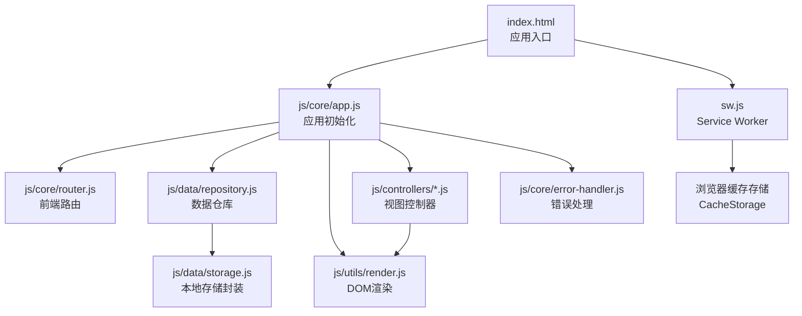
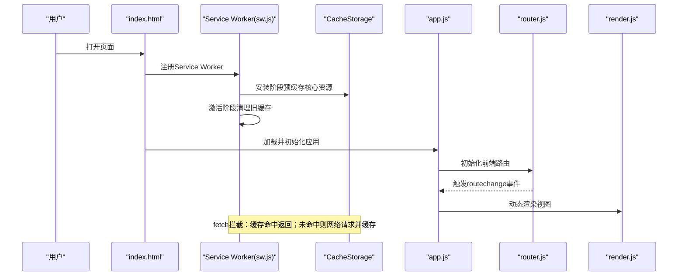
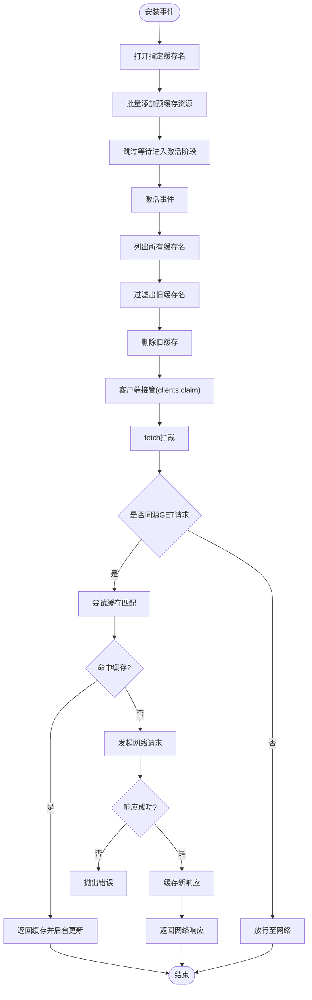
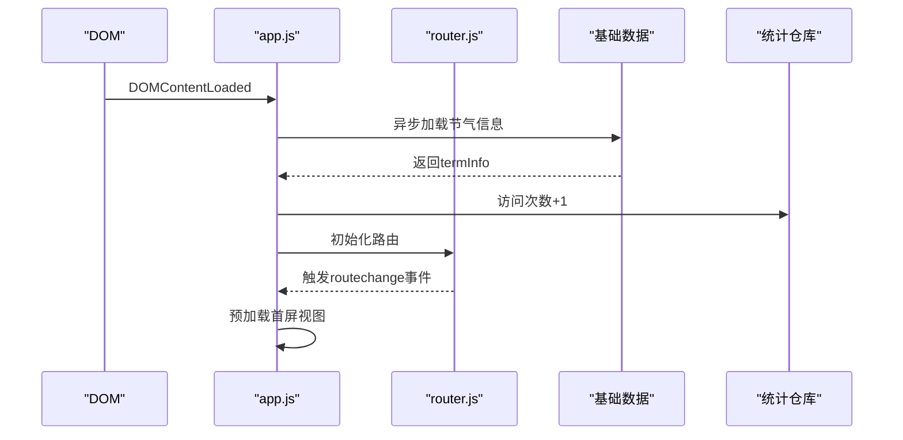
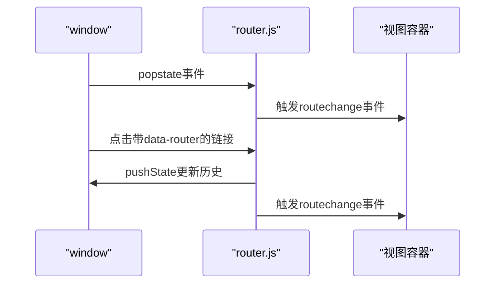
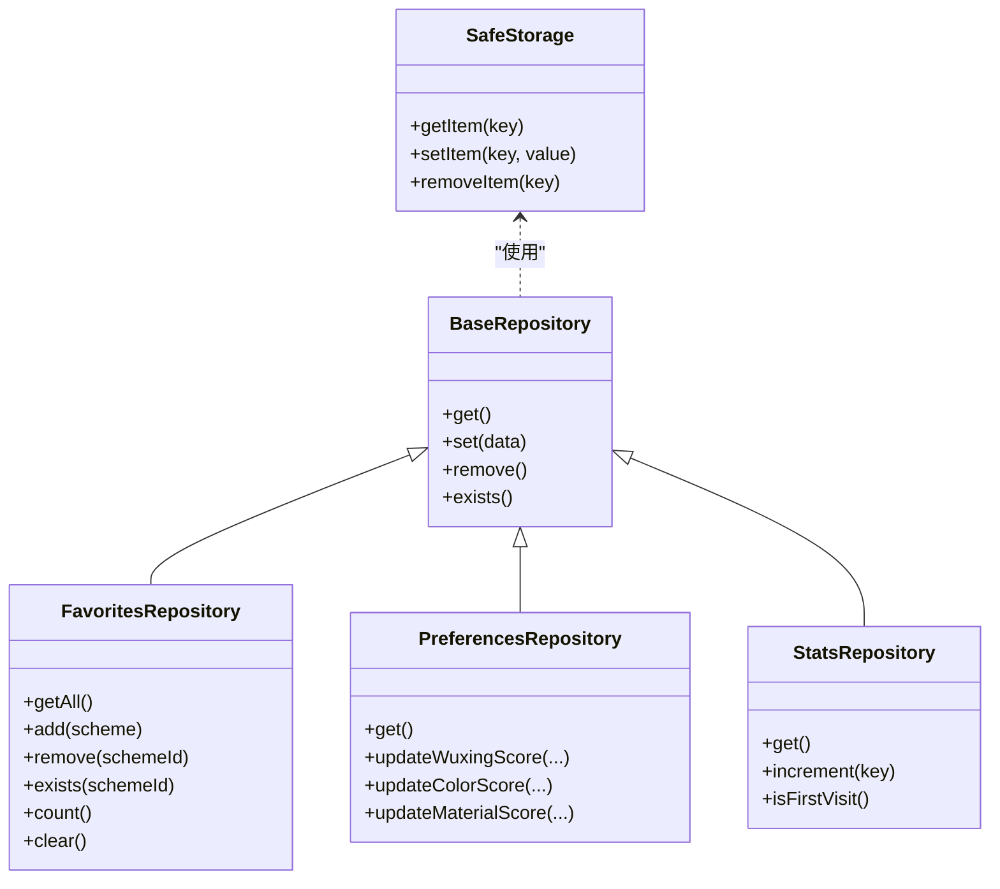
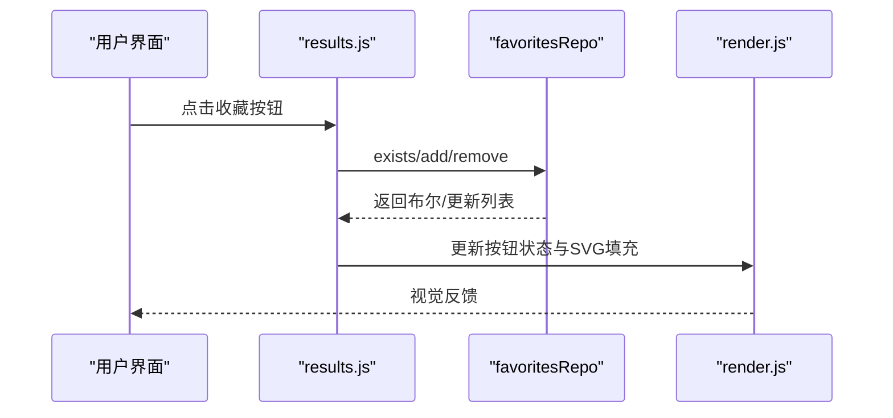
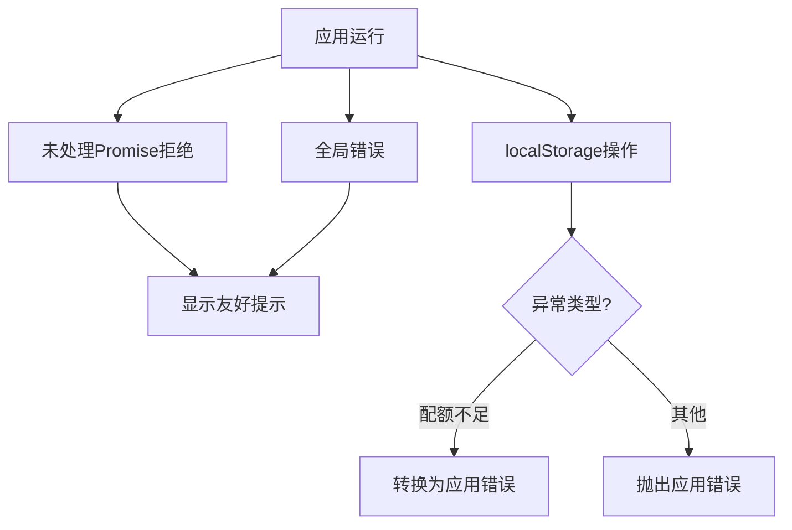
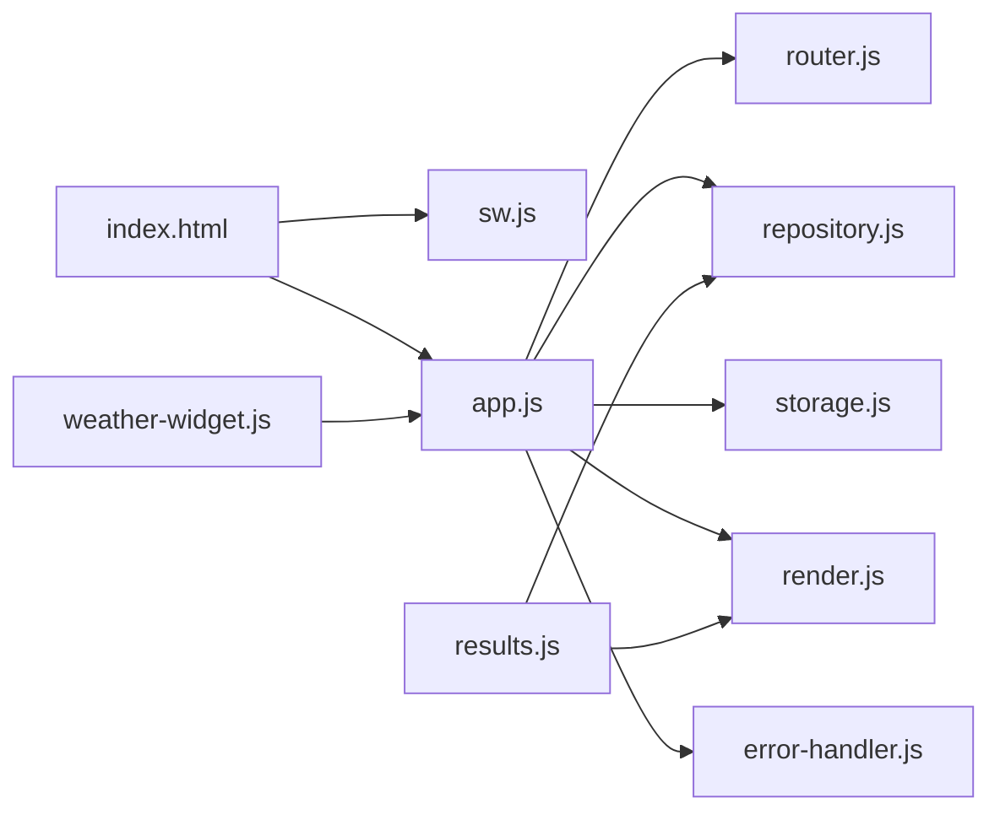

# PWA功能实现

<cite>
**本文档引用的文件**
- [sw.js](file://sw.js)
- [index.html](file://index.html)
- [app.js](file://js/core/app.js)
- [router.js](file://js/core/router.js)
- [repository.js](file://js/data/repository.js)
- [storage.js](file://js/data/storage.js)
- [render.js](file://js/utils/render.js)
- [share.js](file://js/utils/share.js)
- [error-handler.js](file://js/core/error-handler.js)
- [results.js](file://js/controllers/results.js)
- [weather-widget.js](file://js/components/weather-widget.js)
- [recommendation.js](file://js/services/recommendation.js)
</cite>

## 目录
1. [简介](#简介)
2. [项目结构](#项目结构)
3. [核心组件](#核心组件)
4. [架构总览](#架构总览)
5. [详细组件分析](#详细组件分析)
6. [依赖关系分析](#依赖关系分析)
7. [性能考量](#性能考量)
8. [故障排查指南](#故障排查指南)
9. [结论](#结论)
10. [附录](#附录)

## 简介
本文件面向“五行穿搭建议”项目，系统性梳理其渐进式Web应用（PWA）能力，重点覆盖以下方面：
- Service Worker 的配置与实现：预缓存、激活清理、缓存优先策略、后台更新与消息通信
- 离线缓存策略：预缓存清单、Stale-While-Revalidate 动态缓存与失效处理
- 安装流程：Service Worker 注册、安装时机与作用域
- 性能优化：首屏预加载、模块化路由、错误处理与存储安全封装
- 与传统Web应用的差异与优势：离线可用性、可安装性、性能与体验提升

本项目已具备基础的PWA能力（Service Worker、静态资源缓存），但尚未包含推送通知与Web App Manifest等高级特性。本文将基于现有代码进行深入分析，并给出扩展建议。

## 项目结构
项目采用前端单页应用（SPA）架构，核心入口为 index.html，通过模块化的 JS 文件组织业务逻辑。PWA相关的关键位置如下：
- Service Worker：sw.js
- 应用入口与初始化：js/core/app.js
- 前端路由：js/core/router.js
- 数据仓库与本地存储：js/data/repository.js、js/data/storage.js
- UI渲染与交互：js/utils/render.js、js/utils/share.js
- 错误处理与存储安全：js/core/error-handler.js
- 控制器与视图：js/controllers/results.js 等
- 组件化UI：js/components/weather-widget.js
- 推荐服务：js/services/recommendation.js

图表来源
- [index.html](file://index.html#L64-L76)
- [app.js](file://js/core/app.js#L47-L73)
- [router.js](file://js/core/router.js#L25-L49)
- [repository.js](file://js/data/repository.js#L24-L41)
- [storage.js](file://js/data/storage.js#L9-L27)
- [render.js](file://js/utils/render.js#L13-L21)
- [error-handler.js](file://js/core/error-handler.js#L168-L189)
- [sw.js](file://sw.js#L52-L69)

章节来源
- [index.html](file://index.html#L1-L79)
- [app.js](file://js/core/app.js#L1-L206)
- [router.js](file://js/core/router.js#L1-L142)
- [repository.js](file://js/data/repository.js#L1-L355)
- [storage.js](file://js/data/storage.js#L1-L66)
- [render.js](file://js/utils/render.js#L1-L487)
- [error-handler.js](file://js/core/error-handler.js#L148-L189)
- [sw.js](file://sw.js#L1-L165)

## 核心组件
- Service Worker（sw.js）：负责预缓存、激活清理、fetch拦截与消息通信，实现离线可用与资源缓存
- 应用初始化（app.js）：首屏视图预加载、路由初始化、基础数据加载、统计埋点
- 前端路由（router.js）：浏览器前进后退、链接拦截、URL状态同步
- 数据仓库（repository.js）：抽象存储实现，统一读写接口，配合安全存储封装
- 本地存储（storage.js）：带前缀的本地存储工具，提供批量清理与查询
- 渲染与交互（render.js）：视图切换、Toast提示、模态框、收藏/分享按钮渲染
- 错误处理（error-handler.js）：全局Promise与错误捕获、存储安全封装
- 控制器（results.js）：收藏切换、分享菜单、按钮状态更新
- 组件（weather-widget.js）：天气数据展示与影响提示
- 推荐服务（recommendation.js）：反馈闭环与偏好存储

章节来源
- [sw.js](file://sw.js#L1-L165)
- [app.js](file://js/core/app.js#L47-L73)
- [router.js](file://js/core/router.js#L25-L49)
- [repository.js](file://js/data/repository.js#L24-L41)
- [storage.js](file://js/data/storage.js#L9-L27)
- [render.js](file://js/utils/render.js#L13-L21)
- [error-handler.js](file://js/core/error-handler.js#L168-L189)
- [results.js](file://js/controllers/results.js#L527-L570)
- [weather-widget.js](file://js/components/weather-widget.js#L164-L214)
- [recommendation.js](file://js/services/recommendation.js#L1-L29)

## 架构总览
下图展示了从用户访问到资源加载、缓存与路由控制的整体流程：

图表来源
- [index.html](file://index.html#L64-L76)
- [sw.js](file://sw.js#L52-L94)
- [app.js](file://js/core/app.js#L47-L73)
- [router.js](file://js/core/router.js#L25-L79)
- [render.js](file://js/utils/render.js#L13-L21)

## 详细组件分析

### Service Worker：缓存策略与离线能力
- 预缓存清单：安装阶段打开指定缓存名并批量缓存核心资源，确保离线可用
- 激活清理：激活阶段遍历缓存名，删除与当前版本不同的旧缓存，释放空间
- fetch拦截：仅处理同源GET请求；命中缓存立即返回并后台更新；未命中则网络请求并缓存
- 消息通信：接收特定消息以跳过等待，加速更新生效

图表来源
- [sw.js](file://sw.js#L52-L94)
- [sw.js](file://sw.js#L99-L155)

章节来源
- [sw.js](file://sw.js#L52-L94)
- [sw.js](file://sw.js#L99-L155)

### 应用初始化与首屏优化
- 首屏视图预加载：在初始化阶段提前加载关键视图，减少首次切换延迟
- 路由初始化：监听浏览器前进后退与链接点击，保持URL与视图一致
- 基础数据加载：异步加载节气信息并写入全局状态，供后续组件使用
- 统计埋点：访问次数自增，便于产品分析

图表来源
- [app.js](file://js/core/app.js#L47-L73)
- [router.js](file://js/core/router.js#L25-L49)
- [repository.js](file://js/data/repository.js#L292-L337)

章节来源
- [app.js](file://js/core/app.js#L47-L73)
- [router.js](file://js/core/router.js#L25-L49)
- [repository.js](file://js/data/repository.js#L292-L337)

### 前端路由：SPA导航与状态同步
- popstate监听：浏览器前进后退时更新当前路由
- 链接拦截：委托处理带路由属性的链接，避免整页刷新
- URL同步：更新浏览器历史、标题与Store中的当前视图

图表来源
- [router.js](file://js/core/router.js#L25-L49)
- [router.js](file://js/core/router.js#L57-L79)

章节来源
- [router.js](file://js/core/router.js#L25-L79)

### 数据仓库与本地存储：安全封装与批量操作
- 安全存储：对localStorage读写进行包装，捕获配额不足等异常并转换为应用错误
- 仓库抽象：统一get/set/remove/exists等接口，屏蔽底层实现细节
- 批量清理：按前缀批量删除键，便于版本升级后的数据迁移

图表来源
- [repository.js](file://js/data/repository.js#L24-L41)
- [repository.js](file://js/data/repository.js#L46-L81)
- [repository.js](file://js/data/repository.js#L86-L146)
- [repository.js](file://js/data/repository.js#L151-L201)
- [repository.js](file://js/data/repository.js#L292-L337)

章节来源
- [repository.js](file://js/data/repository.js#L24-L41)
- [repository.js](file://js/data/repository.js#L46-L81)
- [repository.js](file://js/data/repository.js#L86-L146)
- [repository.js](file://js/data/repository.js#L151-L201)
- [repository.js](file://js/data/repository.js#L292-L337)

### 渲染与交互：视图切换、Toast与收藏/分享
- 视图切换：隐藏全部视图，显示目标视图并滚动至顶部
- Toast提示：全局消息展示，自动淡出
- 收藏/分享：渲染收藏按钮与分享菜单，支持系统分享与复制

图表来源
- [results.js](file://js/controllers/results.js#L527-L570)
- [render.js](file://js/utils/render.js#L457-L486)

章节来源
- [render.js](file://js/utils/render.js#L13-L21)
- [render.js](file://js/utils/render.js#L457-L486)
- [results.js](file://js/controllers/results.js#L527-L570)

### 错误处理与存储安全
- 全局错误捕获：未处理Promise拒绝与全局错误，统一转为用户可感知的消息
- 存储安全：捕获QuotaExceededError等异常，转换为应用错误并提示用户

图表来源
- [error-handler.js](file://js/core/error-handler.js#L168-L189)
- [error-handler.js](file://js/core/error-handler.js#L153-L163)

章节来源
- [error-handler.js](file://js/core/error-handler.js#L153-L163)
- [error-handler.js](file://js/core/error-handler.js#L168-L189)

### 推荐服务与天气组件
- 推荐服务：封装反馈与偏好存储，提供安全的本地存储接口
- 天气组件：根据坐标获取天气数据，展示天气影响分数与温度

章节来源
- [recommendation.js](file://js/services/recommendation.js#L1-L29)
- [weather-widget.js](file://js/components/weather-widget.js#L164-L214)

## 依赖关系分析
- index.html 通过脚本注册 Service Worker，确保应用生命周期内具备离线能力
- app.js 依赖 router.js 进行视图切换，依赖 repository.js 与 storage.js 进行数据持久化
- render.js 作为UI渲染中枢，被各控制器调用以更新视图
- error-handler.js 为全局错误与存储安全提供支撑

图表来源
- [index.html](file://index.html#L64-L76)
- [app.js](file://js/core/app.js#L6-L11)
- [router.js](file://js/core/router.js#L6-L11)
- [repository.js](file://js/data/repository.js#L6-L11)
- [storage.js](file://js/data/storage.js#L5-L11)
- [render.js](file://js/utils/render.js#L5-L8)
- [error-handler.js](file://js/core/error-handler.js#L8-L11)
- [results.js](file://js/controllers/results.js#L1-L20)
- [weather-widget.js](file://js/components/weather-widget.js#L1-L20)

章节来源
- [index.html](file://index.html#L64-L76)
- [app.js](file://js/core/app.js#L6-L11)
- [router.js](file://js/core/router.js#L6-L11)
- [repository.js](file://js/data/repository.js#L6-L11)
- [storage.js](file://js/data/storage.js#L5-L11)
- [render.js](file://js/utils/render.js#L5-L8)
- [error-handler.js](file://js/core/error-handler.js#L8-L11)
- [results.js](file://js/controllers/results.js#L1-L20)
- [weather-widget.js](file://js/components/weather-widget.js#L1-L20)

## 性能考量
- 首屏加载优化
  - 预缓存核心资源：Service Worker 安装阶段缓存关键JS/CSS/HTML，显著降低首次访问延迟
  - 首屏视图预加载：应用初始化时预加载欢迎页与入口页，减少路由切换等待
- 缓存策略
  - Stale-While-Revalidate：缓存命中即刻返回，同时后台更新缓存，兼顾速度与新鲜度
  - 同源限制：仅对同源GET请求进行缓存拦截，避免跨域资源带来的复杂性
- 错误与存储
  - 全局错误捕获：避免页面崩溃，提升稳定性
  - 存储安全封装：捕获配额不足等异常，引导用户清理空间或降级使用
- 内存与电池
  - 按需渲染：仅在路由变化时加载对应视图，避免一次性渲染过多DOM
  - 事件委托：通过router.js统一处理链接点击，减少事件绑定数量

章节来源
- [sw.js](file://sw.js#L52-L94)
- [sw.js](file://sw.js#L99-L155)
- [app.js](file://js/core/app.js#L54-L56)
- [error-handler.js](file://js/core/error-handler.js#L168-L189)
- [repository.js](file://js/data/repository.js#L24-L41)

## 故障排查指南
- Service Worker 注册失败
  - 检查浏览器控制台是否有跨域或HTTPS限制导致注册失败
  - 确认 sw.js 路径正确且服务器可访问
- 缓存未更新
  - 激活阶段会清理旧缓存，若未生效，检查缓存名版本号是否变更
  - 使用消息通信触发 skipWaiting，加速更新生效
- 离线页面不可用
  - 确认预缓存清单包含 index.html 与关键视图
  - 检查 fetch 拦截是否正确处理同源请求
- 收藏/分享异常
  - 检查系统分享 API 支持情况与权限
  - 确保渲染逻辑正确绑定事件与更新按钮状态
- 存储空间不足
  - 使用安全存储封装捕获异常并提示用户清理空间

章节来源
- [index.html](file://index.html#L64-L76)
- [sw.js](file://sw.js#L74-L94)
- [sw.js](file://sw.js#L160-L164)
- [results.js](file://js/controllers/results.js#L527-L570)
- [error-handler.js](file://js/core/error-handler.js#L153-L163)

## 结论
本项目已实现基础的PWA能力，通过 Service Worker 提供离线缓存与快速回退，结合 SPA 路由与首屏预加载，显著提升了用户体验。建议后续扩展：
- 添加 Web App Manifest，完善应用图标、启动画面与屏幕适配
- 实现推送通知与后台同步，增强用户触达与数据一致性
- 引入更细粒度的缓存策略（如按资源类型区分缓存策略）
- 增强性能监控与遥测，持续优化加载与交互体验

## 附录
- 安装提示与桌面快捷方式
  - 当满足安装条件时，浏览器通常会在地址栏右侧显示安装入口
  - 用户点击后可将应用添加到桌面，获得接近原生的启动体验
- 全屏显示支持
  - 可通过 Web App Manifest 中的 display 配置实现全屏启动
- 部署与兼容性测试
  - 使用 Lighthouse 或 Chrome DevTools 进行 PWA 兼容性与性能评估
  - 在不同浏览器（Chrome、Safari、Edge）验证 Service Worker 与缓存行为