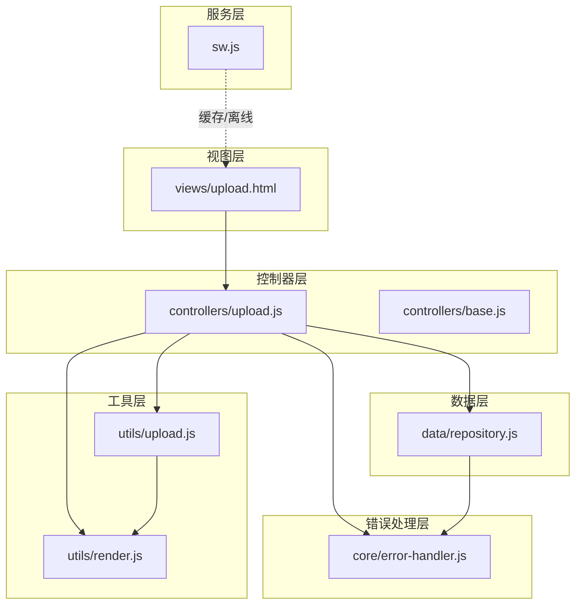
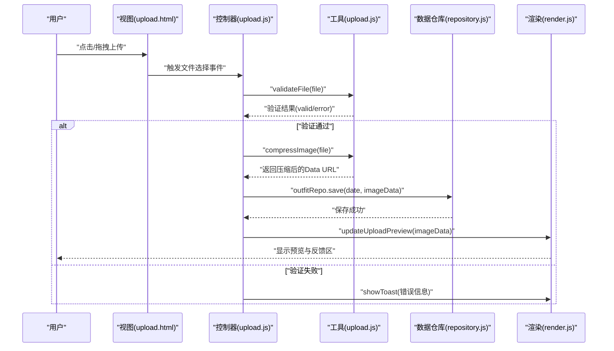
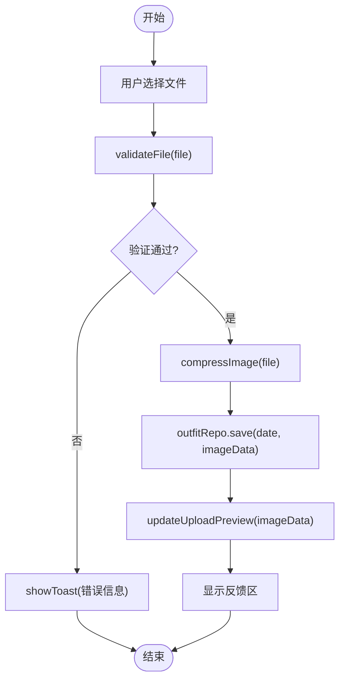
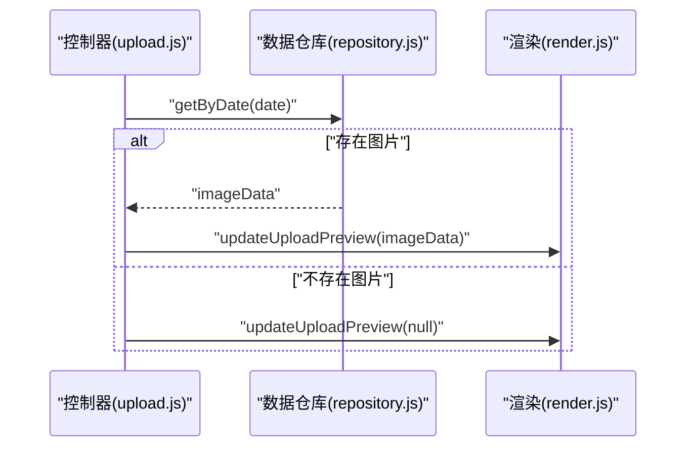
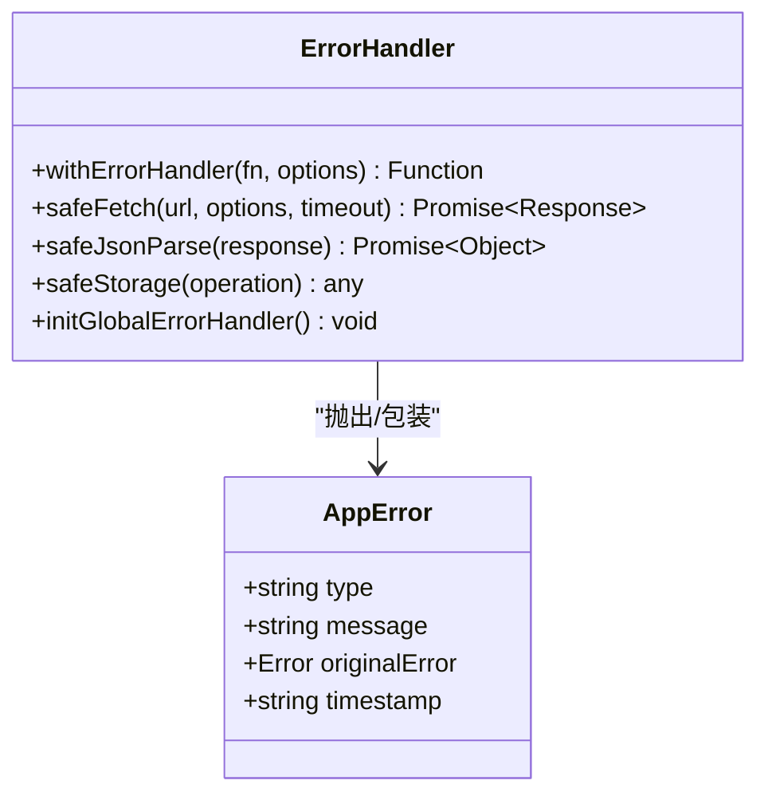
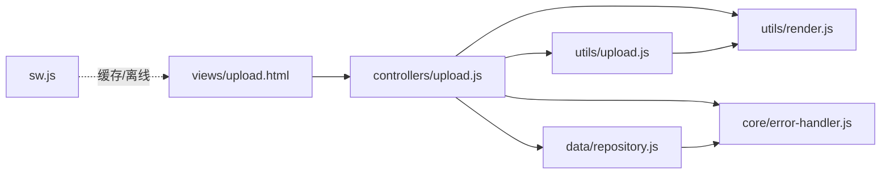

# 上传工具模块

<cite>
**本文引用的文件**
- [upload.js](file://js/utils/upload.js)
- [upload.html](file://views/upload.html)
- [upload.js](file://js/controllers/upload.js)
- [render.js](file://js/utils/render.js)
- [repository.js](file://js/data/repository.js)
- [error-handler.js](file://js/core/error-handler.js)
- [base.js](file://js/controllers/base.js)
- [sw.js](file://sw.js)
</cite>

## 目录
1. [简介](#简介)
2. [项目结构](#项目结构)
3. [核心组件](#核心组件)
4. [架构总览](#架构总览)
5. [详细组件分析](#详细组件分析)
6. [依赖关系分析](#依赖关系分析)
7. [性能考虑](#性能考虑)
8. [故障排查指南](#故障排查指南)
9. [结论](#结论)
10. [附录](#附录)

## 简介
本技术文档围绕上传工具模块进行系统性梳理，重点覆盖以下方面：
- 文件上传与图片处理的完整流程：文件选择、格式验证、大小限制、安全检查、Canvas 缩放与压缩、预览展示。
- 上传进度监控：当前实现未包含进度条、速度计算与剩余时间估算，后续可扩展。
- 错误处理与异常恢复：网络中断、服务器错误、客户端异常的处理策略与统一错误包装。
- 文件类型与大小验证：MIME 类型检查、白名单管理与前端限制。
- 上传队列与并发控制：当前未实现队列与并发控制，后续可按需扩展。
- 性能优化：内存管理、缓存策略与用户体验改进建议。
- 与后端集成：认证机制、签名 URL 与回调处理的对接建议。

## 项目结构
上传工具模块由视图、控制器、工具函数、数据仓库与错误处理等多层协作构成，采用“视图-控制器-工具-数据-错误”分层设计，职责清晰、耦合度低。

图表来源
- [upload.html](file://views/upload.html#L1-L41)
- [upload.js](file://js/controllers/upload.js#L1-L118)
- [base.js](file://js/controllers/base.js#L1-L131)
- [upload.js](file://js/utils/upload.js#L1-L145)
- [render.js](file://js/utils/render.js#L407-L425)
- [repository.js](file://js/data/repository.js#L340-L377)
- [error-handler.js](file://js/core/error-handler.js#L1-L190)
- [sw.js](file://sw.js#L140-L164)

章节来源
- [upload.html](file://views/upload.html#L1-L41)
- [upload.js](file://js/controllers/upload.js#L1-L118)
- [base.js](file://js/controllers/base.js#L1-L131)
- [upload.js](file://js/utils/upload.js#L1-L145)
- [render.js](file://js/utils/render.js#L407-L425)
- [repository.js](file://js/data/repository.js#L340-L377)
- [error-handler.js](file://js/core/error-handler.js#L1-L190)
- [sw.js](file://sw.js#L140-L164)

## 核心组件
- 视图层：负责上传区域、占位符、预览区、移除按钮与反馈区的渲染与交互。
- 控制器层：负责生命周期管理、事件绑定、业务逻辑协调与状态更新。
- 工具层：提供文件验证、Canvas 压缩、上传区域初始化与日期工具。
- 数据层：提供本地存储封装与穿搭照片仓库，支持按日期读写。
- 错误处理层：提供统一错误类型、AppError、withErrorHandler、safeFetch、safeJsonParse、safeStorage 等能力。

章节来源
- [upload.html](file://views/upload.html#L12-L39)
- [upload.js](file://js/controllers/upload.js#L11-L33)
- [upload.js](file://js/utils/upload.js#L5-L7)
- [repository.js](file://js/data/repository.js#L340-L377)
- [error-handler.js](file://js/core/error-handler.js#L7-L163)

## 架构总览
上传工具模块遵循“视图-控制器-工具-数据-错误”的分层架构，通过事件驱动与状态管理实现松耦合。当前上传流程为单文件直存本地，未涉及后端上传；后续可在此基础上扩展为“前端压缩 -> 生成签名URL -> 上传 -> 回调处理”。

图表来源
- [upload.html](file://views/upload.html#L13-L30)
- [upload.js](file://js/controllers/upload.js#L80-L93)
- [upload.js](file://js/utils/upload.js#L12-L26)
- [upload.js](file://js/utils/upload.js#L31-L82)
- [repository.js](file://js/data/repository.js#L352-L366)
- [render.js](file://js/utils/render.js#L407-L425)

## 详细组件分析

### 文件上传与图片处理流程
- 文件选择与拖拽支持：通过上传区域与隐藏的文件输入控件实现，支持键盘激活与拖拽放置。
- 格式验证：仅允许 JPEG/PNG，超出范围直接拒绝。
- 大小限制：最大 5MB，超限提示。
- 图片压缩：使用 Canvas 进行缩放与质量压缩，目标约 200KB，保证最大边不超过 1200px。
- 预览展示：将压缩后的 Data URL 写入预览图片，并显示反馈区。

图表来源
- [upload.js](file://js/utils/upload.js#L12-L26)
- [upload.js](file://js/utils/upload.js#L31-L82)
- [repository.js](file://js/data/repository.js#L352-L366)
- [render.js](file://js/utils/render.js#L407-L425)

章节来源
- [upload.js](file://js/utils/upload.js#L87-L136)
- [upload.js](file://js/utils/upload.js#L12-L26)
- [upload.js](file://js/utils/upload.js#L31-L82)
- [upload.js](file://js/utils/upload.js#L141-L144)
- [upload.html](file://views/upload.html#L13-L30)
- [render.js](file://js/utils/render.js#L407-L425)
- [repository.js](file://js/data/repository.js#L352-L366)

### 图片预览与反馈区
- 预览切换：当存在图片数据时，隐藏占位符，显示预览与移除按钮，并显示反馈区。
- 移除功能：删除本地存储中的当日图片并清空预览。
- 反馈保存：当前为占位逻辑，后续可接入后端接口。

图表来源
- [upload.js](file://js/controllers/upload.js#L28-L32)
- [repository.js](file://js/data/repository.js#L352-L355)
- [render.js](file://js/utils/render.js#L407-L425)

章节来源
- [upload.js](file://js/controllers/upload.js#L28-L32)
- [render.js](file://js/utils/render.js#L407-L425)
- [repository.js](file://js/data/repository.js#L352-L355)

### 错误处理与异常恢复
- 统一错误类型：NETWORK/TIMEOUT/DATA_PARSE/VALIDATION/STORAGE/UNKNOWN。
- AppError：封装错误类型、原始错误与时间戳。
- withErrorHandler：包装异步函数，统一捕获与提示。
- safeFetch/safeJsonParse：带超时与响应校验的安全网络请求。
- safeStorage：包装本地存储，捕获配额不足等异常。
- 全局错误监听：捕获未处理 Promise 与全局错误，统一提示。

图表来源
- [error-handler.js](file://js/core/error-handler.js#L28-L37)
- [error-handler.js](file://js/core/error-handler.js#L45-L79)
- [error-handler.js](file://js/core/error-handler.js#L101-L133)
- [error-handler.js](file://js/core/error-handler.js#L140-L146)
- [error-handler.js](file://js/core/error-handler.js#L153-L163)
- [error-handler.js](file://js/core/error-handler.js#L168-L189)

章节来源
- [error-handler.js](file://js/core/error-handler.js#L7-L25)
- [error-handler.js](file://js/core/error-handler.js#L28-L37)
- [error-handler.js](file://js/core/error-handler.js#L45-L79)
- [error-handler.js](file://js/core/error-handler.js#L101-L133)
- [error-handler.js](file://js/core/error-handler.js#L140-L146)
- [error-handler.js](file://js/core/error-handler.js#L153-L163)
- [error-handler.js](file://js/core/error-handler.js#L168-L189)

### 与后端集成建议
- 认证机制：在上传前通过安全通道获取会话令牌，随请求头携带。
- 签名 URL：前端向后端申请带时效的上传签名 URL，避免暴露真实存储凭证。
- 上传流程：前端压缩完成后，向签名 URL 发送二进制数据，监听网络状态与超时。
- 回调处理：上传成功后，后端返回结果并触发前端回调，更新 UI 与统计数据。

（本节为概念性说明，不直接对应具体源码）

## 依赖关系分析
- 视图依赖控制器：upload.html 通过 ID 与控制器交互。
- 控制器依赖工具与数据：upload.js 依赖 upload.js 的验证与压缩、repository.js 的本地存储、render.js 的预览更新。
- 工具依赖渲染：upload.js 的预览更新依赖 render.js 的 updateUploadPreview。
- 错误处理贯穿各层：控制器与工具均可通过 withErrorHandler/safeFetch 等进行错误包装与统一处理。
- Service Worker：sw.js 提供缓存与离线兜底，提升网络异常下的可用性。

图表来源
- [upload.html](file://views/upload.html#L1-L41)
- [upload.js](file://js/controllers/upload.js#L1-L118)
- [upload.js](file://js/utils/upload.js#L1-L145)
- [render.js](file://js/utils/render.js#L407-L425)
- [repository.js](file://js/data/repository.js#L340-L377)
- [error-handler.js](file://js/core/error-handler.js#L1-L190)
- [sw.js](file://sw.js#L140-L164)

章节来源
- [upload.js](file://js/controllers/upload.js#L1-L118)
- [upload.js](file://js/utils/upload.js#L1-L145)
- [render.js](file://js/utils/render.js#L407-L425)
- [repository.js](file://js/data/repository.js#L340-L377)
- [error-handler.js](file://js/core/error-handler.js#L1-L190)
- [sw.js](file://sw.js#L140-L164)

## 性能考虑
- 内存管理
  - Canvas 压缩后及时释放临时对象，避免长时间持有大对象。
  - 预览与反馈区切换时，确保旧节点被正确移除，防止内存泄漏。
- 缓存策略
  - 利用 Service Worker 对静态资源进行缓存，提升离线与弱网体验。
  - 本地存储采用安全包装，避免因配额不足导致崩溃。
- 用户体验
  - 在上传区域提供视觉反馈（拖拽高亮、禁用状态）。
  - 提供“移除图片”快捷入口，减少用户操作成本。
  - 对于大图，建议在压缩前给出提示，避免长时间等待。

（本节为通用性能建议，不直接对应具体源码）

## 故障排查指南
- 常见问题
  - 文件格式不支持：检查 accept 与 validateFile 白名单。
  - 文件过大：确认 MAX_FILE_SIZE 限制与提示文案。
  - 图片加载失败：检查 FileReader 与 Image 加载回调。
  - 存储失败：safeStorage 会捕获配额不足等异常。
  - 网络错误：safeFetch 会区分超时与网络异常。
- 排查步骤
  - 打开控制台查看错误日志与堆栈。
  - 确认上传区域事件绑定是否生效。
  - 检查本地存储键值是否存在与格式正确。
  - 在弱网环境下测试 Service Worker 缓存效果。

章节来源
- [upload.js](file://js/utils/upload.js#L12-L26)
- [upload.js](file://js/utils/upload.js#L31-L82)
- [error-handler.js](file://js/core/error-handler.js#L153-L163)
- [error-handler.js](file://js/core/error-handler.js#L101-L133)
- [sw.js](file://sw.js#L140-L164)

## 结论
上传工具模块以简洁清晰的分层设计实现了从文件选择到本地预览的完整链路，具备基础的格式与大小验证、Canvas 压缩与预览展示能力。当前未包含上传进度监控、队列并发控制与后端集成，后续可在现有架构上平滑扩展，以满足更复杂的业务需求与性能要求。

## 附录

### 文件类型与大小验证规则
- 支持格式：JPG、PNG（白名单管理）。
- 大小上限：5MB。
- 验证时机：文件选择后立即执行，失败时通过 Toast 提示。

章节来源
- [upload.js](file://js/utils/upload.js#L5-L7)
- [upload.js](file://js/utils/upload.js#L12-L26)
- [upload.html](file://views/upload.html#L14-L20)

### 上传队列与并发控制现状
- 当前实现：单文件直存本地，未实现队列与并发控制。
- 建议：如需扩展，可在控制器层引入任务队列与并发限制，结合 withErrorHandler 实现失败重试与回退策略。

（本节为概念性建议，不直接对应具体源码）

### 上传进度监控现状
- 当前实现：未包含进度条、速度计算与剩余时间估算。
- 建议：若接入后端上传，可通过 XMLHttpRequest 或 fetch 的进度事件实现进度条更新与速度计算。

（本节为概念性建议，不直接对应具体源码）