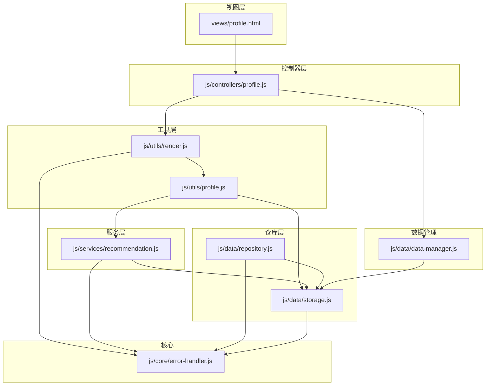
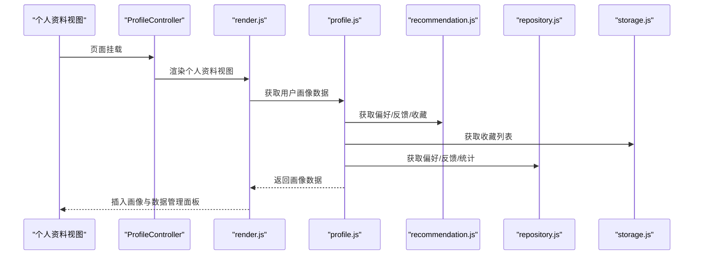
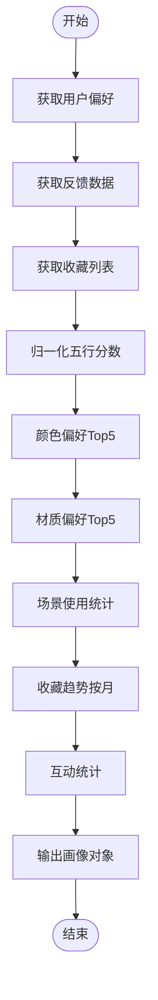
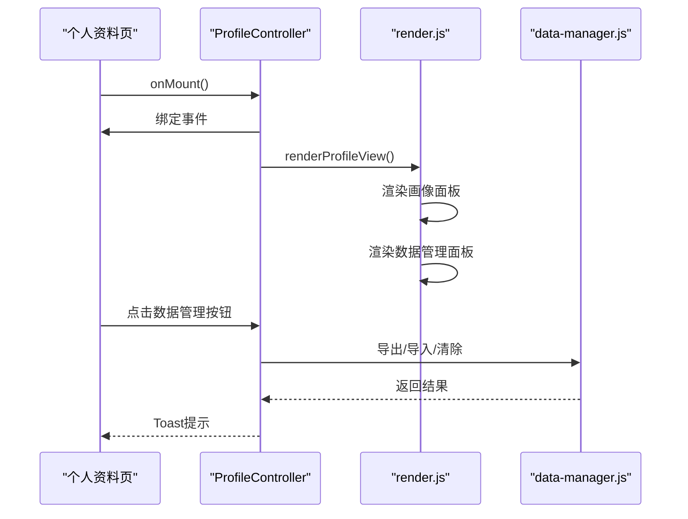
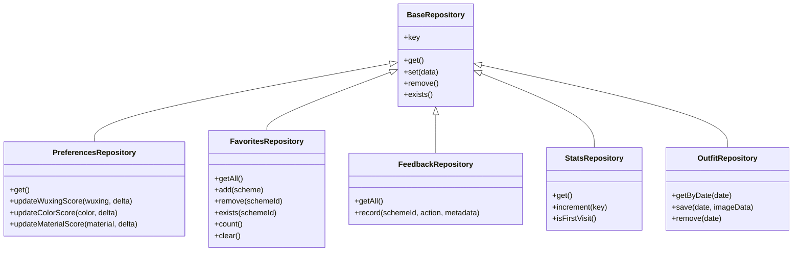
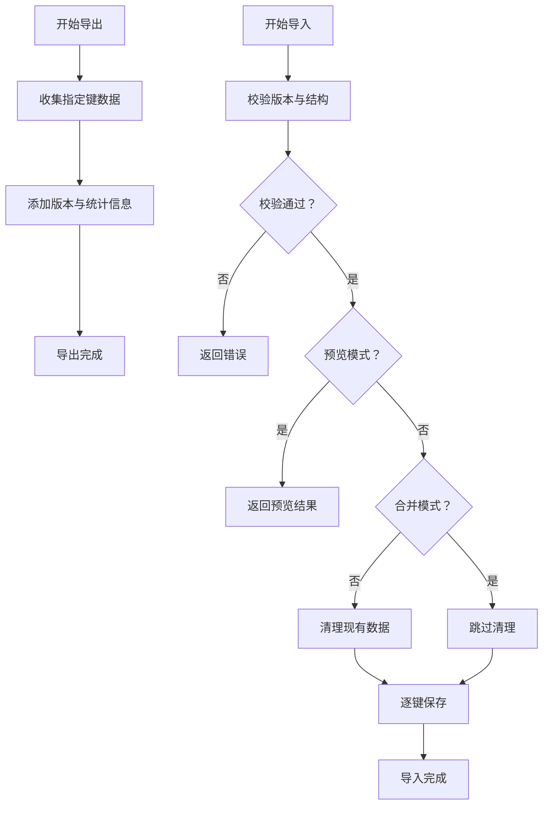
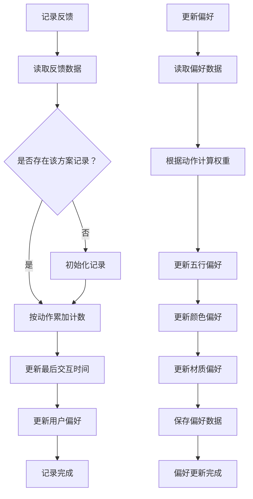
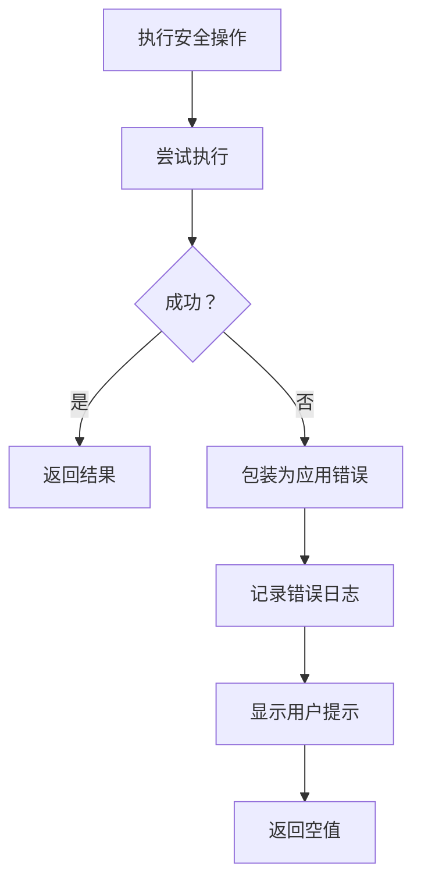
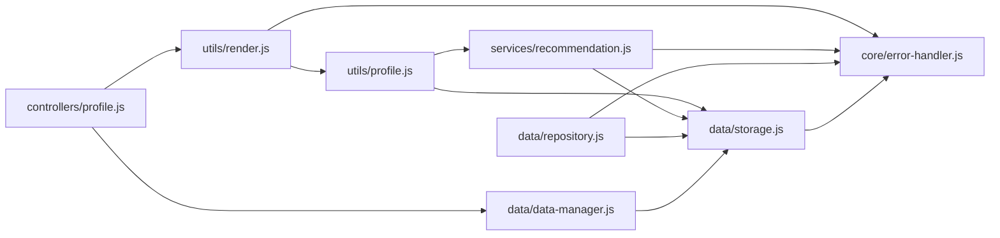

# 个人资料工具模块

<cite>
**本文档引用的文件**
- [js/utils/profile.js](file://js/utils/profile.js)
- [js/controllers/profile.js](file://js/controllers/profile.js)
- [views/profile.html](file://views/profile.html)
- [js/data/storage.js](file://js/data/storage.js)
- [js/data/repository.js](file://js/data/repository.js)
- [js/services/recommendation.js](file://js/services/recommendation.js)
- [js/utils/render.js](file://js/utils/render.js)
- [js/data/data-manager.js](file://js/data/data-manager.js)
- [js/core/error-handler.js](file://js/core/error-handler.js)
</cite>

## 目录
1. [简介](#简介)
2. [项目结构](#项目结构)
3. [核心组件](#核心组件)
4. [架构总览](#架构总览)
5. [详细组件分析](#详细组件分析)
6. [依赖关系分析](#依赖关系分析)
7. [性能考量](#性能考量)
8. [故障排查指南](#故障排查指南)
9. [结论](#结论)
10. [附录](#附录)

## 简介
本模块围绕“个人资料工具”展开，聚焦于用户画像的生成与展示、偏好数据的存储与检索、收藏与反馈的统计分析，以及与数据管理模块的协同。模块通过服务层收集用户偏好与反馈，仓库层抽象本地存储，工具层负责数据可视化与渲染，控制器负责页面生命周期与事件绑定，最终在个人资料视图中呈现完整的用户画像。

## 项目结构
个人资料工具涉及以下关键文件：
- 视图层：个人资料页面模板
- 控制器层：个人资料页控制器，负责挂载、事件绑定与数据管理入口
- 工具层：用户画像生成与可视化渲染
- 服务层：用户偏好与反馈数据的采集与聚合
- 仓库层：本地存储抽象与偏好更新
- 数据管理：数据导出/导入/清理
- 核心错误处理：统一错误包装与提示

图表来源
- [views/profile.html](file://views/profile.html#L1-L21)
- [js/controllers/profile.js](file://js/controllers/profile.js#L1-L91)
- [js/utils/profile.js](file://js/utils/profile.js#L1-L420)
- [js/utils/render.js](file://js/utils/render.js#L1-L487)
- [js/services/recommendation.js](file://js/services/recommendation.js#L1-L466)
- [js/data/repository.js](file://js/data/repository.js#L1-L394)
- [js/data/storage.js](file://js/data/storage.js#L1-L145)
- [js/data/data-manager.js](file://js/data/data-manager.js#L1-L376)
- [js/core/error-handler.js](file://js/core/error-handler.js#L1-L190)

章节来源
- [views/profile.html](file://views/profile.html#L1-L21)
- [js/controllers/profile.js](file://js/controllers/profile.js#L1-L91)
- [js/utils/profile.js](file://js/utils/profile.js#L1-L420)
- [js/utils/render.js](file://js/utils/render.js#L1-L487)
- [js/services/recommendation.js](file://js/services/recommendation.js#L1-L466)
- [js/data/repository.js](file://js/data/repository.js#L1-L394)
- [js/data/storage.js](file://js/data/storage.js#L1-L145)
- [js/data/data-manager.js](file://js/data/data-manager.js#L1-L376)
- [js/core/error-handler.js](file://js/core/error-handler.js#L1-L190)

## 核心组件
- 用户画像生成器：聚合偏好、反馈、收藏与互动数据，计算归一化分数与趋势，并输出可视化所需数据结构
- 个人资料控制器：负责页面挂载、事件绑定与数据管理入口渲染
- 本地存储与仓库：提供偏好、收藏、反馈、使用统计等数据的读写与默认值处理
- 数据管理：提供导出、导入、清理与概览能力，保障数据可移植性
- 错误处理：统一包装存储与网络操作，提供用户友好的错误提示

章节来源
- [js/utils/profile.js](file://js/utils/profile.js#L24-L61)
- [js/controllers/profile.js](file://js/controllers/profile.js#L9-L28)
- [js/data/repository.js](file://js/data/repository.js#L151-L201)
- [js/data/data-manager.js](file://js/data/data-manager.js#L48-L72)
- [js/core/error-handler.js](file://js/core/error-handler.js#L153-L163)

## 架构总览
个人资料工具采用“服务-仓库-工具-控制器-视图”的分层架构：
- 服务层负责偏好与反馈的聚合与计算
- 仓库层抽象本地存储，提供默认值与类型安全
- 工具层负责数据可视化与渲染
- 控制器负责页面生命周期与事件绑定
- 视图层承载渲染容器与数据管理面板

图表来源
- [js/controllers/profile.js](file://js/controllers/profile.js#L15-L28)
- [js/utils/render.js](file://js/utils/render.js#L370-L381)
- [js/utils/profile.js](file://js/utils/profile.js#L24-L61)
- [js/services/recommendation.js](file://js/services/recommendation.js#L224-L239)
- [js/data/repository.js](file://js/data/repository.js#L151-L201)
- [js/data/storage.js](file://js/data/storage.js#L118-L120)

## 详细组件分析

### 用户画像生成器（profile.js）
- 职责：聚合偏好、反馈、收藏与互动数据，计算归一化分数与趋势，输出可视化数据
- 关键流程：
  - 获取偏好、反馈、收藏数据
  - 归一化五行偏好分数至0-100
  - 计算颜色与材质偏好Top5
  - 统计场景使用与互动统计
  - 计算收藏趋势（按月）
  - 输出包含总收藏数与最后更新时间的画像对象

图表来源
- [js/utils/profile.js](file://js/utils/profile.js#L24-L61)
- [js/utils/profile.js](file://js/utils/profile.js#L68-L86)
- [js/utils/profile.js](file://js/utils/profile.js#L110-L137)
- [js/utils/profile.js](file://js/utils/profile.js#L144-L156)

章节来源
- [js/utils/profile.js](file://js/utils/profile.js#L24-L61)
- [js/utils/profile.js](file://js/utils/profile.js#L68-L86)
- [js/utils/profile.js](file://js/utils/profile.js#L110-L137)
- [js/utils/profile.js](file://js/utils/profile.js#L144-L156)

### 个人资料控制器（profile.js）
- 职责：页面挂载、事件绑定、渲染个人资料与数据管理面板
- 关键流程：
  - 获取容器并绑定事件
  - 绑定返回按钮与数据管理按钮
  - 委托处理导入/导出/清除操作
  - 渲染个人资料视图与数据管理面板

图表来源
- [js/controllers/profile.js](file://js/controllers/profile.js#L15-L28)
- [js/controllers/profile.js](file://js/controllers/profile.js#L30-L63)
- [js/utils/render.js](file://js/utils/render.js#L370-L381)
- [js/data/data-manager.js](file://js/data/data-manager.js#L48-L72)

章节来源
- [js/controllers/profile.js](file://js/controllers/profile.js#L9-L28)
- [js/controllers/profile.js](file://js/controllers/profile.js#L30-L63)
- [js/utils/render.js](file://js/utils/render.js#L370-L381)
- [js/data/data-manager.js](file://js/data/data-manager.js#L48-L72)

### 本地存储与仓库（repository.js、storage.js）
- 仓库层：
  - 提供偏好、收藏、反馈、使用统计、上传照片等仓库类
  - 默认值处理：偏好与使用统计提供默认结构
  - 类型安全：统一的 get/set/remove 接口
- 本地存储层：
  - 封装 localStorage 的安全读写
  - 提供前缀键管理与批量清理
  - 收藏列表的去重与时间戳添加

图表来源
- [js/data/repository.js](file://js/data/repository.js#L46-L81)
- [js/data/repository.js](file://js/data/repository.js#L151-L201)
- [js/data/repository.js](file://js/data/repository.js#L86-L146)
- [js/data/repository.js](file://js/data/repository.js#L206-L259)
- [js/data/repository.js](file://js/data/repository.js#L292-L337)
- [js/data/repository.js](file://js/data/repository.js#L342-L377)

章节来源
- [js/data/repository.js](file://js/data/repository.js#L151-L201)
- [js/data/repository.js](file://js/data/repository.js#L86-L146)
- [js/data/storage.js](file://js/data/storage.js#L118-L144)

### 数据管理（data-manager.js）
- 职责：导出/导入/清理用户数据，提供数据概览与版本兼容性检查
- 关键流程：
  - 导出：遍历指定键，生成包含版本与统计信息的对象
  - 导入：校验版本与结构，支持覆盖或合并，返回导入结果
  - 清理：删除指定键的所有数据
  - 概览：统计键数量、总大小与各键简要信息

图表来源
- [js/data/data-manager.js](file://js/data/data-manager.js#L48-L72)
- [js/data/data-manager.js](file://js/data/data-manager.js#L106-L135)
- [js/data/data-manager.js](file://js/data/data-manager.js#L143-L184)
- [js/data/data-manager.js](file://js/data/data-manager.js#L225-L229)
- [js/data/data-manager.js](file://js/data/data-manager.js#L235-L284)

章节来源
- [js/data/data-manager.js](file://js/data/data-manager.js#L48-L72)
- [js/data/data-manager.js](file://js/data/data-manager.js#L106-L135)
- [js/data/data-manager.js](file://js/data/data-manager.js#L143-L184)
- [js/data/data-manager.js](file://js/data/data-manager.js#L225-L229)
- [js/data/data-manager.js](file://js/data/data-manager.js#L235-L284)

### 服务层（recommendation.js）
- 职责：记录用户反馈、更新偏好、计算个性化得分与运势因子
- 关键流程：
  - 记录反馈：根据动作类型累加视图/收藏/选择/忽略次数，并更新最后交互时间
  - 更新偏好：根据动作权重更新五行、颜色、材质偏好分数
  - 个性化得分：结合历史反馈、偏好、材质与今日运势因子计算综合得分
  - 运势因子：基于日期生成随机种子，打乱五行顺序得到幸运/增益五行

图表来源
- [js/services/recommendation.js](file://js/services/recommendation.js#L145-L184)
- [js/services/recommendation.js](file://js/services/recommendation.js#L192-L218)
- [js/services/recommendation.js](file://js/services/recommendation.js#L247-L284)
- [js/services/recommendation.js](file://js/services/recommendation.js#L93-L108)

章节来源
- [js/services/recommendation.js](file://js/services/recommendation.js#L145-L184)
- [js/services/recommendation.js](file://js/services/recommendation.js#L192-L218)
- [js/services/recommendation.js](file://js/services/recommendation.js#L247-L284)
- [js/services/recommendation.js](file://js/services/recommendation.js#L93-L108)

### 错误处理（error-handler.js）
- 职责：统一包装存储与网络操作，提供错误类型映射与用户提示
- 关键流程：
  - 安全存储：捕获存储异常（如配额不足），抛出应用错误
  - 安全网络：封装 fetch，支持超时控制与响应状态检查
  - 错误包装：withErrorHandler 统一捕获异常，记录日志并显示 toast

图表来源
- [js/core/error-handler.js](file://js/core/error-handler.js#L153-L163)
- [js/core/error-handler.js](file://js/core/error-handler.js#L101-L133)
- [js/core/error-handler.js](file://js/core/error-handler.js#L45-L79)

章节来源
- [js/core/error-handler.js](file://js/core/error-handler.js#L153-L163)
- [js/core/error-handler.js](file://js/core/error-handler.js#L101-L133)
- [js/core/error-handler.js](file://js/core/error-handler.js#L45-L79)

## 依赖关系分析
- 低耦合高内聚：工具层与服务层解耦，通过数据接口交互；仓库层提供统一的读写抽象
- 依赖方向：控制器依赖渲染与数据管理；渲染依赖工具与数据管理；工具依赖服务与仓库；仓库依赖存储；数据管理依赖存储
- 错误处理贯穿：所有存储与网络操作均通过统一的错误处理模块包装

图表来源
- [js/controllers/profile.js](file://js/controllers/profile.js#L1-L91)
- [js/utils/render.js](file://js/utils/render.js#L1-L487)
- [js/utils/profile.js](file://js/utils/profile.js#L1-L420)
- [js/services/recommendation.js](file://js/services/recommendation.js#L1-L466)
- [js/data/repository.js](file://js/data/repository.js#L1-L394)
- [js/data/storage.js](file://js/data/storage.js#L1-L145)
- [js/data/data-manager.js](file://js/data/data-manager.js#L1-L376)
- [js/core/error-handler.js](file://js/core/error-handler.js#L1-L190)

章节来源
- [js/controllers/profile.js](file://js/controllers/profile.js#L1-L91)
- [js/utils/render.js](file://js/utils/render.js#L1-L487)
- [js/utils/profile.js](file://js/utils/profile.js#L1-L420)
- [js/services/recommendation.js](file://js/services/recommendation.js#L1-L466)
- [js/data/repository.js](file://js/data/repository.js#L1-L394)
- [js/data/storage.js](file://js/data/storage.js#L1-L145)
- [js/data/data-manager.js](file://js/data/data-manager.js#L1-L376)
- [js/core/error-handler.js](file://js/core/error-handler.js#L1-L190)

## 性能考量
- 数据聚合：归一化与TopN计算复杂度较低，适合频繁调用
- 存储优化：使用统一的前缀键与批量清理，避免键冲突与冗余
- 渲染优化：SVG与DOM操作集中在工具层，避免重复渲染
- 错误处理：统一包装减少异常传播成本，提升稳定性

## 故障排查指南
- 存储异常：检查浏览器隐私模式或存储配额，查看错误类型与提示
- 导入失败：确认文件格式为JSON，版本兼容性与数据结构完整性
- 数据不一致：核对偏好与反馈的权重更新逻辑，确保动作类型正确
- 渲染空白：确认容器存在且渲染函数被调用，检查数据管理面板是否正确插入

章节来源
- [js/core/error-handler.js](file://js/core/error-handler.js#L153-L163)
- [js/data/data-manager.js](file://js/data/data-manager.js#L106-L135)
- [js/services/recommendation.js](file://js/services/recommendation.js#L192-L218)
- [js/utils/render.js](file://js/utils/render.js#L370-L381)

## 结论
个人资料工具模块通过清晰的分层设计与统一的错误处理，实现了用户画像的高效生成与可视化展示，同时提供了完善的数据管理能力。模块在保证易用性的同时，兼顾了性能与可维护性，为后续扩展用户偏好与行为分析提供了良好的基础。

## 附录
- 使用示例与最佳实践
  - 在个人资料页挂载后，控制器会自动渲染画像与数据管理面板
  - 通过数据管理进行导出备份与导入恢复，建议定期导出以防止数据丢失
  - 偏好更新由服务层自动处理，无需手动干预
  - 如遇存储异常，可通过错误处理模块的提示进行排查

章节来源
- [js/controllers/profile.js](file://js/controllers/profile.js#L15-L28)
- [js/utils/render.js](file://js/utils/render.js#L370-L381)
- [js/data/data-manager.js](file://js/data/data-manager.js#L48-L72)
- [js/services/recommendation.js](file://js/services/recommendation.js#L192-L218)
- [js/core/error-handler.js](file://js/core/error-handler.js#L153-L163)