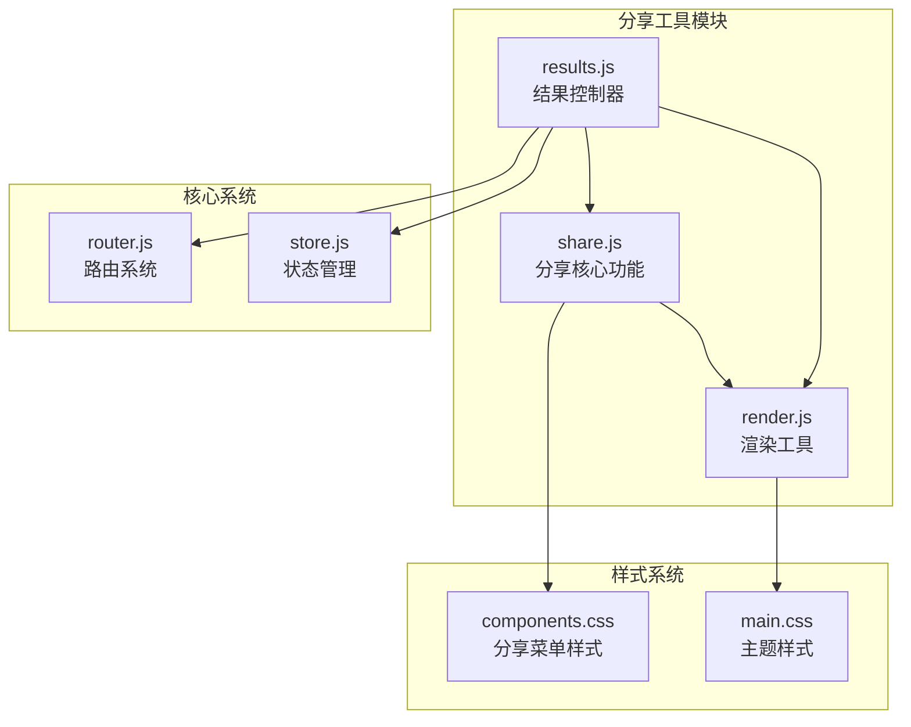
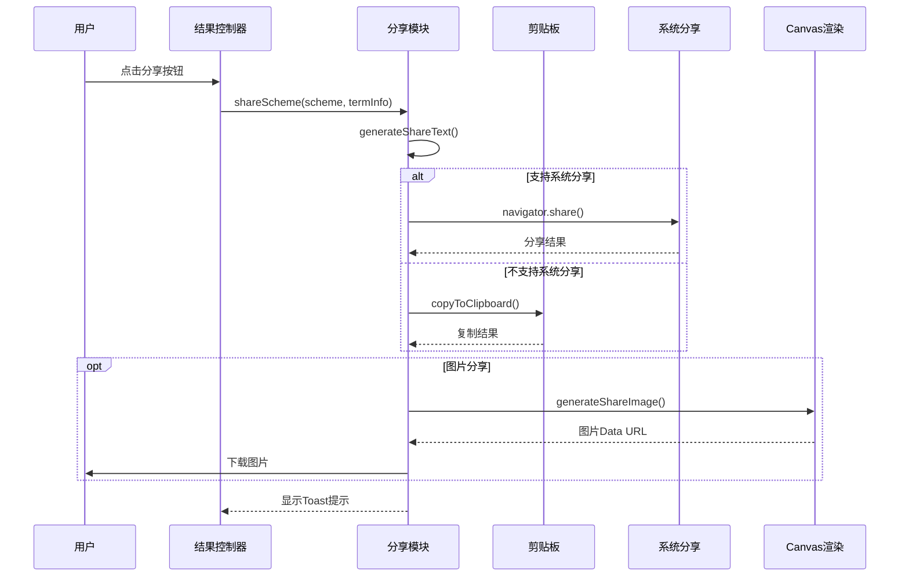
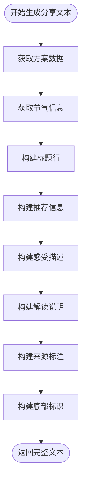
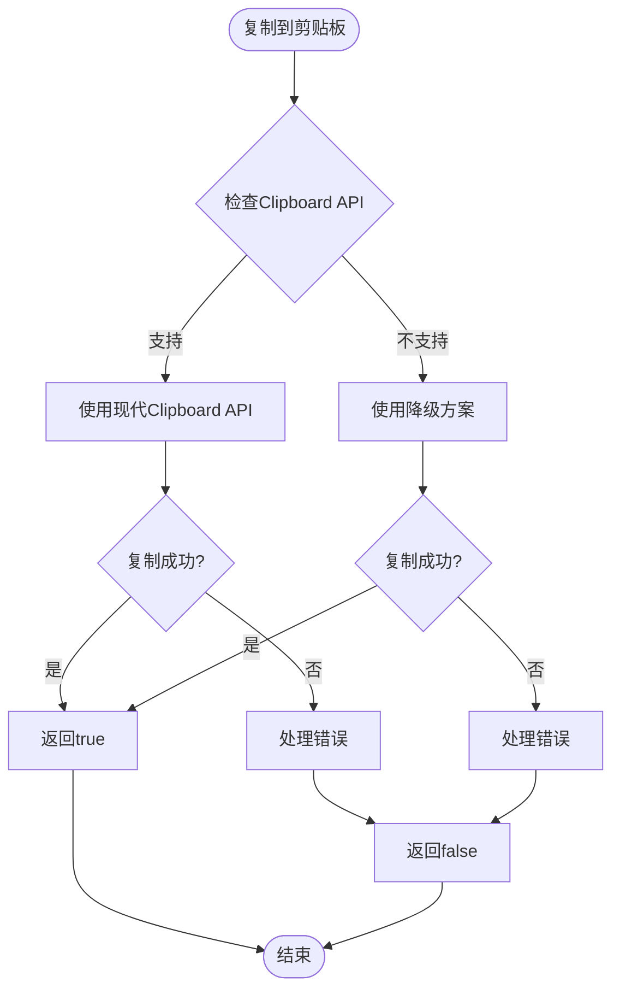
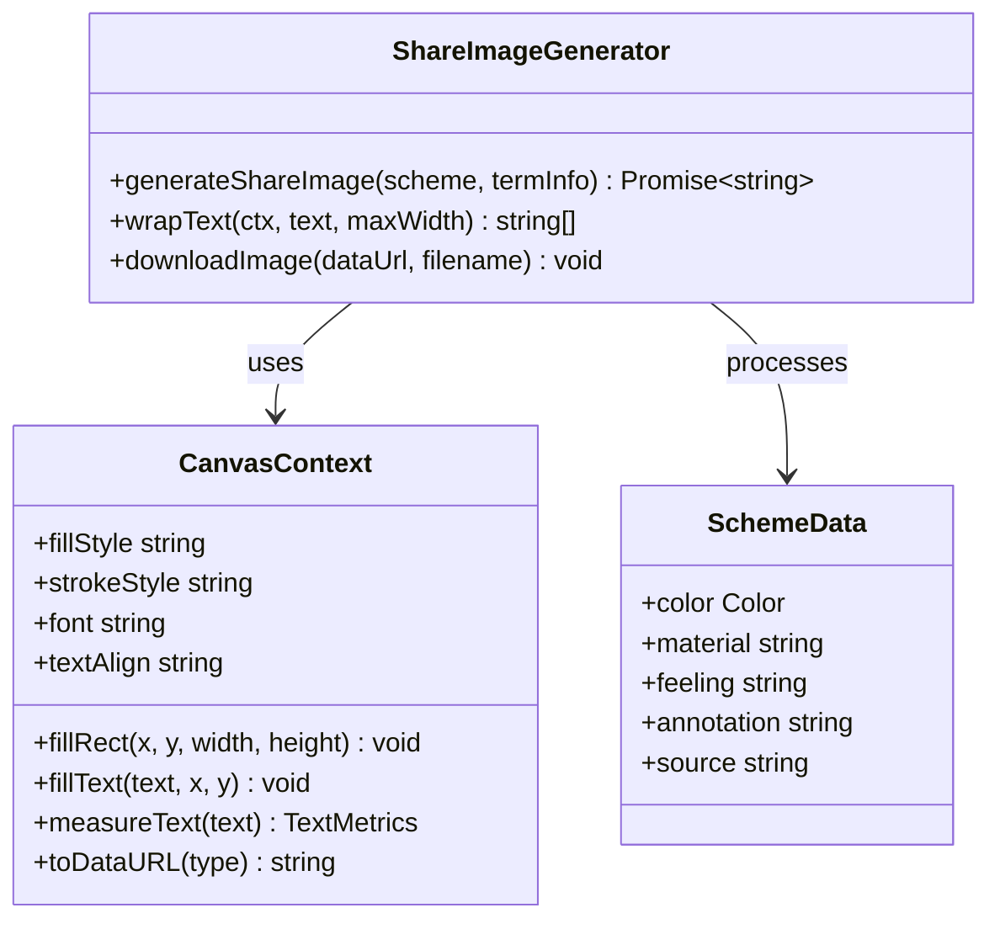
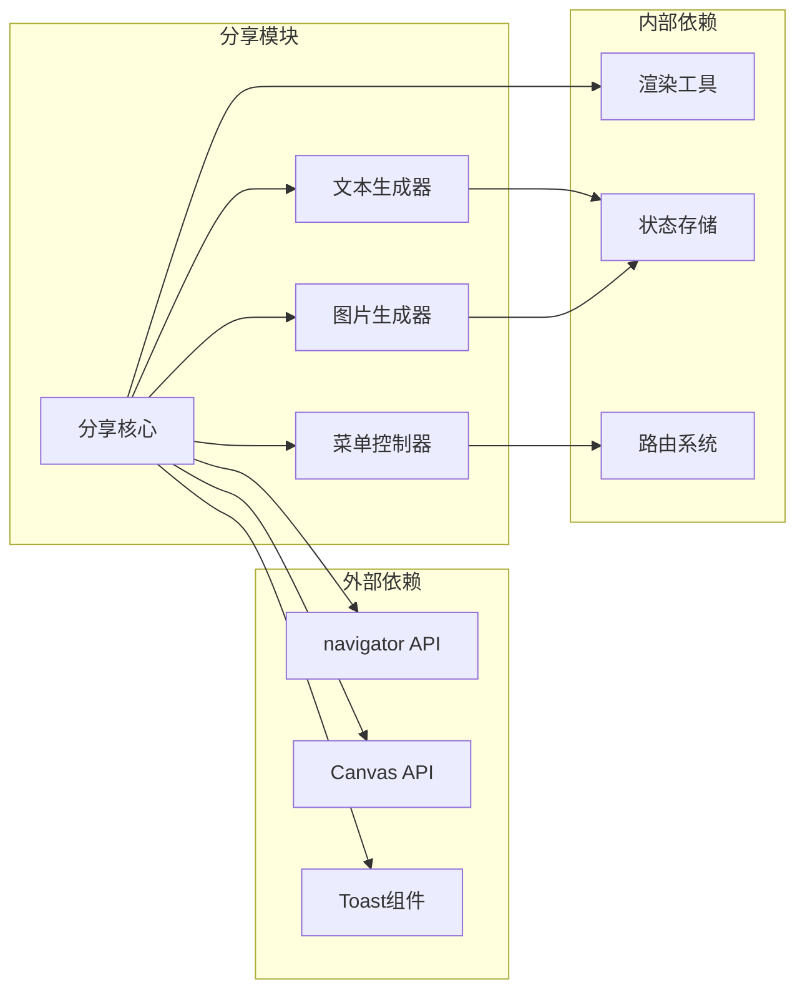

# 分享工具模块

<cite>
**本文档引用的文件**
- [share.js](file://js/utils/share.js)
- [render.js](file://js/utils/render.js)
- [results.js](file://js/controllers/results.js)
- [router.js](file://js/core/router.js)
- [store.js](file://js/core/store.js)
- [components.css](file://css/components.css)
- [main.css](file://css/main.css)
- [index.html](file://index.html)
</cite>

## 目录
1. [简介](#简介)
2. [项目结构](#项目结构)
3. [核心组件](#核心组件)
4. [架构概览](#架构概览)
5. [详细组件分析](#详细组件分析)
6. [依赖关系分析](#依赖关系分析)
7. [性能考虑](#性能考虑)
8. [故障排除指南](#故障排除指南)
9. [结论](#结论)

## 简介

分享工具模块是五行情感穿搭建议小程序的核心功能模块之一，负责为用户提供多种分享方式，包括文本复制、图片生成和系统分享。该模块实现了完整的分享生态系统，支持移动端和桌面端的不同分享策略，并提供了丰富的用户体验。

## 项目结构

分享工具模块位于JavaScript工具类目录中，采用模块化设计，与其他核心模块紧密协作：

**图表来源**
- [share.js](file://js/utils/share.js#L1-L333)
- [render.js](file://js/utils/render.js#L1-L487)
- [results.js](file://js/controllers/results.js#L1-L614)

**章节来源**
- [share.js](file://js/utils/share.js#L1-L333)
- [render.js](file://js/utils/render.js#L1-L487)
- [results.js](file://js/controllers/results.js#L1-L614)

## 核心组件

分享工具模块包含以下核心组件：

### 分享文本生成器
负责构建符合社交媒体规范的分享内容，包含节气信息、穿搭方案详情和推荐理由。

### 剪贴板操作器
提供跨浏览器兼容的文本复制功能，支持现代Web API和降级方案。

### 分享图片生成器
使用Canvas API生成高质量的分享图片，支持自定义布局和样式。

### 分享菜单控制器
提供用户友好的分享选项界面，支持多种分享方式的选择。

**章节来源**
- [share.js](file://js/utils/share.js#L14-L91)
- [share.js](file://js/utils/share.js#L99-L191)
- [share.js](file://js/utils/share.js#L240-L332)

## 架构概览

分享工具模块采用分层架构设计，各组件职责明确，耦合度低：

**图表来源**
- [results.js](file://js/controllers/results.js#L568-L594)
- [share.js](file://js/utils/share.js#L66-L91)
- [share.js](file://js/utils/share.js#L99-L191)

## 详细组件分析

### 分享文本生成器

分享文本生成器负责构建完整的分享内容，包含以下要素：

#### 核心字段
- **节气信息**：包含节气名称和五行属性
- **推荐方案**：色彩搭配、材质选择和穿着感受
- **解读说明**：详细的五行理论解释
- **来源标注**：推荐方案的典籍出处

#### 文本格式化
采用统一的格式模板，确保在不同平台的一致性表现。

**图表来源**
- [share.js](file://js/utils/share.js#L14-L29)

**章节来源**
- [share.js](file://js/utils/share.js#L14-L29)

### 剪贴板操作器

剪贴板操作器提供双层兼容机制：

#### 现代API路径
- 使用`navigator.clipboard.writeText()`进行直接复制
- 支持异步操作和错误处理

#### 降级方案
- 创建临时textarea元素
- 使用`document.execCommand('copy')`进行复制
- 自动清理DOM元素

**图表来源**
- [share.js](file://js/utils/share.js#L36-L59)

**章节来源**
- [share.js](file://js/utils/share.js#L36-L59)

### 分享图片生成器

分享图片生成器使用Canvas API创建高质量的分享图片：

#### 图片规格
- **尺寸**：375x600像素（高清2倍缩放）
- **字体**：支持中文字体"LXGW WenKai"
- **色彩**：基于方案色彩和品牌主题色

#### 布局设计
- **顶部装饰条**：使用方案主色调
- **标题区域**：品牌标识和节气信息
- **方案展示区**：色彩块、材质和感受
- **解读区域**：自动换行的详细说明
- **底部标识**：品牌归属信息

**图表来源**
- [share.js](file://js/utils/share.js#L99-L191)
- [share.js](file://js/utils/share.js#L200-L219)

**章节来源**
- [share.js](file://js/utils/share.js#L99-L191)
- [share.js](file://js/utils/share.js#L200-L219)

### 分享菜单控制器

分享菜单控制器提供用户友好的交互界面：

#### 菜单选项
- **复制文字**：快速复制分享文本
- **生成图片**：创建专属分享图片
- **系统分享**：使用设备原生分享功能

#### 动画效果
- 滑入式动画
- 模态背景遮罩
- 平滑的过渡效果

**章节来源**
- [share.js](file://js/utils/share.js#L240-L332)

## 依赖关系分析

分享工具模块的依赖关系清晰，遵循单一职责原则：

**图表来源**
- [share.js](file://js/utils/share.js#L6-L7)
- [render.js](file://js/utils/render.js#L5-L8)

**章节来源**
- [share.js](file://js/utils/share.js#L6-L7)
- [render.js](file://js/utils/render.js#L5-L8)

## 性能考虑

分享工具模块在性能方面采用了多项优化措施：

### Canvas渲染优化
- 使用2倍缩放确保高清显示
- 合理的字体缓存和测量
- 批量绘制操作减少重排

### 内存管理
- 及时清理临时DOM元素
- 合理的Promise链式调用
- 避免内存泄漏

### 用户体验优化
- 异步操作避免阻塞UI
- 进度提示和状态反馈
- 错误处理和降级方案

## 故障排除指南

### 常见问题及解决方案

#### 分享功能不可用
**症状**：系统分享按钮灰色不可点击
**原因**：设备不支持Web Share API
**解决方案**：自动降级到复制功能

#### 图片生成失败
**症状**：生成图片时报错
**原因**：Canvas渲染异常或内存不足
**解决方案**：检查字体加载和内存使用

#### 剪贴板复制失败
**症状**：复制操作无响应
**原因**：HTTPS环境限制或浏览器兼容性
**解决方案**：使用降级方案或手动复制

**章节来源**
- [share.js](file://js/utils/share.js#L78-L82)
- [share.js](file://js/utils/share.js#L305-L313)

## 结论

分享工具模块通过精心设计的架构和实现，为用户提供了丰富而便捷的分享体验。模块具有良好的扩展性和维护性，能够适应不同的业务需求和技术演进。其模块化的设计理念使得功能增强和bug修复变得更加容易，为项目的长期发展奠定了坚实基础。