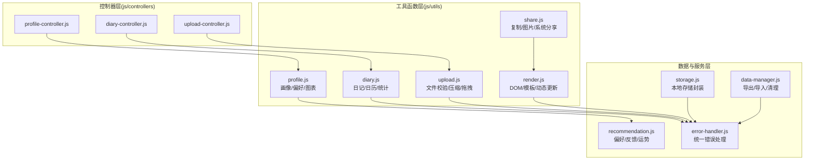
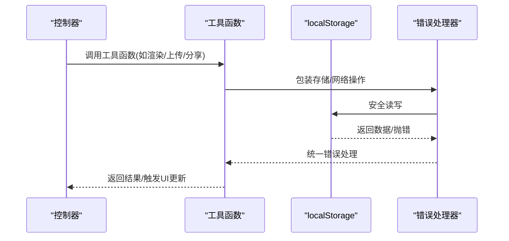
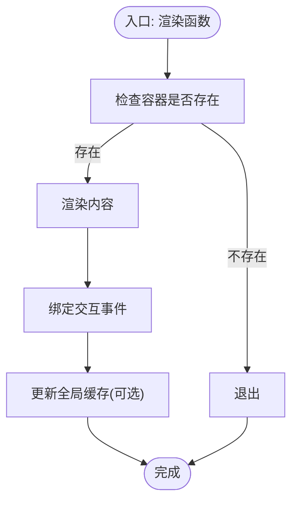
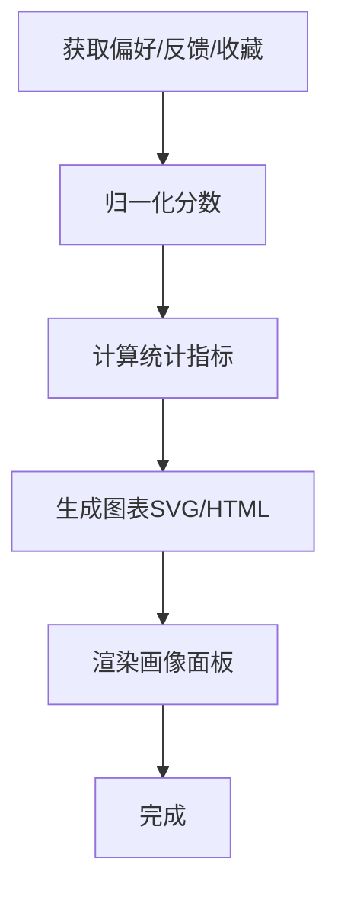
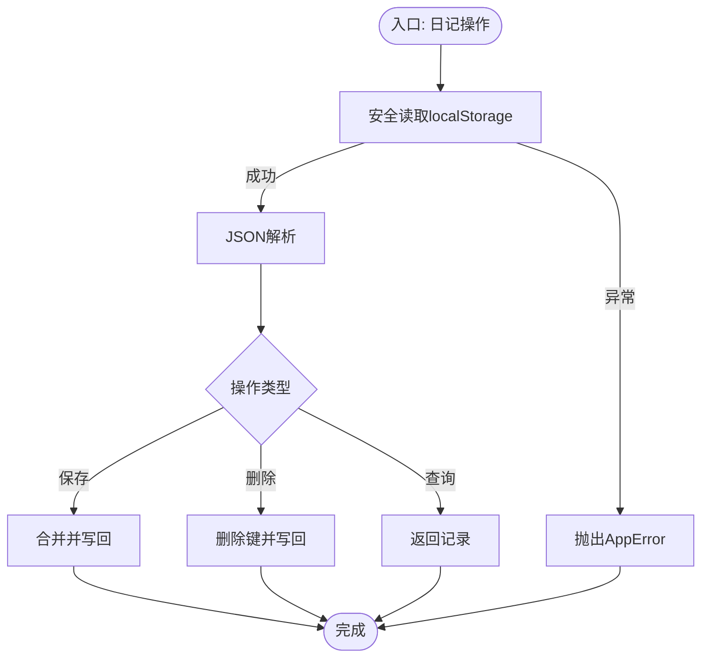
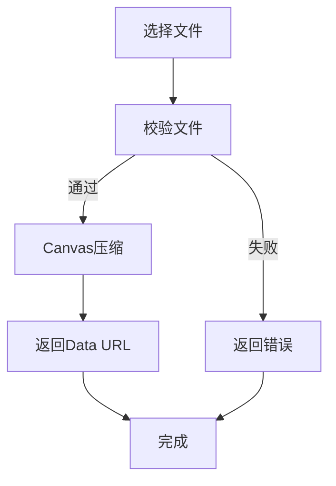
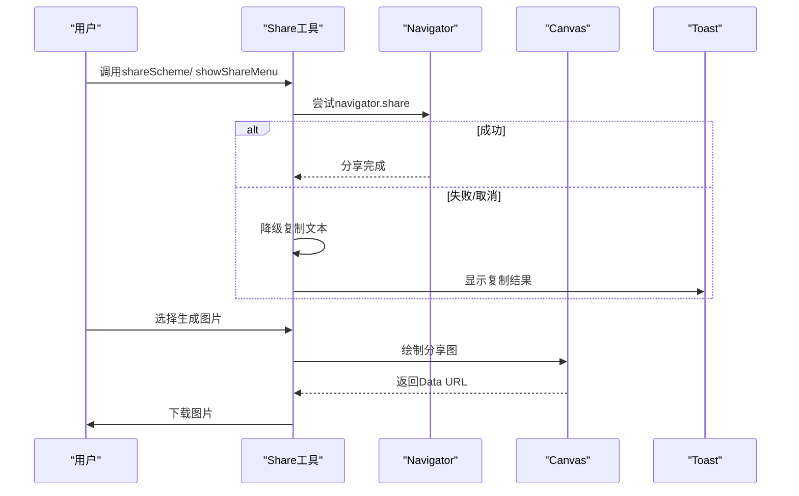
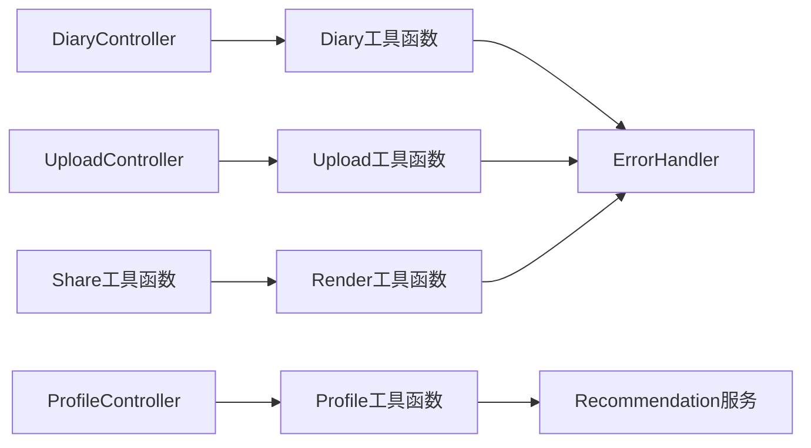

# 工具函数库

<cite>
**本文档引用的文件**
- [render.js](file://js/utils/render.js)
- [profile.js](file://js/utils/profile.js)
- [diary.js](file://js/utils/diary.js)
- [upload.js](file://js/utils/upload.js)
- [share.js](file://js/utils/share.js)
- [storage.js](file://js/data/storage.js)
- [recommendation.js](file://js/services/recommendation.js)
- [error-handler.js](file://js/core/error-handler.js)
- [data-manager.js](file://js/data/data-manager.js)
- [diary-controller.js](file://js/controllers/diary.js)
- [upload-controller.js](file://js/controllers/upload.js)
- [profile-controller.js](file://js/controllers/profile.js)
</cite>

## 目录
1. [简介](#简介)
2. [项目结构](#项目结构)
3. [核心组件](#核心组件)
4. [架构总览](#架构总览)
5. [详细组件分析](#详细组件分析)
6. [依赖关系分析](#依赖关系分析)
7. [性能考量](#性能考量)
8. [故障排查指南](#故障排查指南)
9. [结论](#结论)
10. [附录](#附录)

## 简介
本文件系统性梳理“五行穿搭建议”项目中的工具函数库，覆盖以下模块：
- Render 渲染工具：DOM 操作、模板渲染与动态内容更新
- Profile 个人资料工具：数据验证、格式化与用户偏好管理
- Diary 穿搭日记工具：日记条目管理、数据持久化与时间轴展示
- Upload 上传工具：文件处理、进度监控与错误处理机制
- Share 分享工具：社交分享、链接生成与平台适配

文档同时提供 API 接口说明、参数配置、返回值处理、使用示例与扩展开发方法，并解释各工具函数间的协作关系与依赖模式。

## 项目结构
工具函数库位于 js/utils 目录，围绕“渲染、数据、服务、错误处理、数据管理”五大领域构建，控制器层通过依赖注入的方式调用工具函数，形成清晰的分层架构。

**图表来源**
- [render.js](file://js/utils/render.js#L1-L487)
- [profile.js](file://js/utils/profile.js#L1-L420)
- [diary.js](file://js/utils/diary.js#L1-L242)
- [upload.js](file://js/utils/upload.js#L1-L145)
- [share.js](file://js/utils/share.js#L1-L333)
- [storage.js](file://js/data/storage.js#L1-L145)
- [recommendation.js](file://js/services/recommendation.js#L1-L466)
- [error-handler.js](file://js/core/error-handler.js#L1-L190)
- [data-manager.js](file://js/data/data-manager.js#L1-L376)
- [diary-controller.js](file://js/controllers/diary.js#L1-L440)
- [upload-controller.js](file://js/controllers/upload.js#L1-L118)
- [profile-controller.js](file://js/controllers/profile.js#L1-L91)

**章节来源**
- [render.js](file://js/utils/render.js#L1-L487)
- [profile.js](file://js/utils/profile.js#L1-L420)
- [diary.js](file://js/utils/diary.js#L1-L242)
- [upload.js](file://js/utils/upload.js#L1-L145)
- [share.js](file://js/utils/share.js#L1-L333)
- [storage.js](file://js/data/storage.js#L1-L145)
- [recommendation.js](file://js/services/recommendation.js#L1-L466)
- [error-handler.js](file://js/core/error-handler.js#L1-L190)
- [data-manager.js](file://js/data/data-manager.js#L1-L376)
- [diary-controller.js](file://js/controllers/diary.js#L1-L440)
- [upload-controller.js](file://js/controllers/upload.js#L1-L118)
- [profile-controller.js](file://js/controllers/profile.js#L1-L91)

## 核心组件
- Render 渲染工具：负责视图切换、表单初始化、卡片渲染、模态框控制、Toast 提示等
- Profile 个人资料工具：聚合用户偏好、生成画像面板与多种图表（雷达图、柱状图、饼图、折线图）
- Diary 穿搭日记工具：提供日历视图、时间线视图、统计分析、连续天数计算与安全存储
- Upload 上传工具：文件校验、Canvas 压缩、拖拽上传、键盘支持与日期键生成
- Share 分享工具：文本复制、图片生成、系统分享菜单与跨平台适配

**章节来源**
- [render.js](file://js/utils/render.js#L1-L487)
- [profile.js](file://js/utils/profile.js#L1-L420)
- [diary.js](file://js/utils/diary.js#L1-L242)
- [upload.js](file://js/utils/upload.js#L1-L145)
- [share.js](file://js/utils/share.js#L1-L333)

## 架构总览
工具函数库采用“纯函数 + 依赖注入”的设计，控制器层仅负责事件绑定与视图交互，业务逻辑由工具函数承担，保证可测试性与可复用性。

**图表来源**
- [diary-controller.js](file://js/controllers/diary.js#L1-L440)
- [upload-controller.js](file://js/controllers/upload.js#L1-L118)
- [profile-controller.js](file://js/controllers/profile.js#L1-L91)
- [error-handler.js](file://js/core/error-handler.js#L148-L163)

## 详细组件分析

### Render 渲染工具
- 视图切换：隐藏/显示指定 ID 的视图容器
- 表单初始化：年份/日期选择器动态生成
- 结果页渲染：节气横幅、结果标题、方案卡片
- 卡片交互：收藏、分享、查看详情、反馈按钮
- 详情模态框：展示方案细节与解释卡片
- 用户画像视图：组合渲染用户面板与数据管理面板
- 模态框控制：打开/关闭，锁定滚动
- 上传预览：根据数据显隐占位与预览区
- 收藏列表：渲染收藏卡片并缓存当前列表
- Toast 提示：创建并自动消失的提示框

**图表来源**
- [render.js](file://js/utils/render.js#L13-L21)
- [render.js](file://js/utils/render.js#L119-L132)
- [render.js](file://js/utils/render.js#L324-L365)

**章节来源**
- [render.js](file://js/utils/render.js#L13-L21)
- [render.js](file://js/utils/render.js#L26-L55)
- [render.js](file://js/utils/render.js#L60-L114)
- [render.js](file://js/utils/render.js#L119-L201)
- [render.js](file://js/utils/render.js#L324-L365)
- [render.js](file://js/utils/render.js#L367-L381)
- [render.js](file://js/utils/render.js#L386-L403)
- [render.js](file://js/utils/render.js#L408-L425)
- [render.js](file://js/utils/render.js#L429-L452)
- [render.js](file://js/utils/render.js#L457-L486)

### Profile 个人资料工具
- 数据聚合：用户偏好、反馈、收藏、互动统计
- 归一化分数：将原始分数映射到 0-100
- 场景统计：模拟场景使用分布
- 收藏趋势：按月统计收藏数量
- 互动统计：汇总浏览、收藏、选择次数
- 图表渲染：
  - 五行雷达图：多边形顶点计算与网格绘制
  - 颜色偏好柱状图：最大值归一化与条形填充
  - 场景饼图：角度计算与图例生成
  - 收藏趋势折线图：点坐标与连线绘制
- 用户画像面板：组合统计与图表

**图表来源**
- [profile.js](file://js/utils/profile.js#L24-L61)
- [profile.js](file://js/utils/profile.js#L68-L86)
- [profile.js](file://js/utils/profile.js#L93-L103)
- [profile.js](file://js/utils/profile.js#L110-L137)
- [profile.js](file://js/utils/profile.js#L144-L156)
- [profile.js](file://js/utils/profile.js#L163-L223)
- [profile.js](file://js/utils/profile.js#L230-L253)
- [profile.js](file://js/utils/profile.js#L260-L318)
- [profile.js](file://js/utils/profile.js#L325-L370)
- [profile.js](file://js/utils/profile.js#L376-L419)

**章节来源**
- [profile.js](file://js/utils/profile.js#L24-L61)
- [profile.js](file://js/utils/profile.js#L68-L86)
- [profile.js](file://js/utils/profile.js#L93-L103)
- [profile.js](file://js/utils/profile.js#L110-L137)
- [profile.js](file://js/utils/profile.js#L144-L156)
- [profile.js](file://js/utils/profile.js#L163-L223)
- [profile.js](file://js/utils/profile.js#L230-L253)
- [profile.js](file://js/utils/profile.js#L260-L318)
- [profile.js](file://js/utils/profile.js#L325-L370)
- [profile.js](file://js/utils/profile.js#L376-L419)

### Diary 穿搭日记工具
- 安全存储：封装 localStorage 读写，捕获异常
- 记录管理：获取全部、按日期查询、保存、删除、存在性检查
- 日历数据：生成指定月份日历，标注当月/今日/有记录
- 时间线数据：按日期倒序返回最新记录
- 统计分析：颜色、材质、心情、方案计数
- 连续天数：从今日向前统计连续记录天数
- 数据导出：导出记录、统计与连续天数

**图表来源**
- [diary.js](file://js/utils/diary.js#L19-L32)
- [diary.js](file://js/utils/diary.js#L38-L85)
- [diary.js](file://js/utils/diary.js#L93-L128)
- [diary.js](file://js/utils/diary.js#L135-L141)
- [diary.js](file://js/utils/diary.js#L147-L182)
- [diary.js](file://js/utils/diary.js#L210-L229)
- [diary.js](file://js/utils/diary.js#L235-L241)

**章节来源**
- [diary.js](file://js/utils/diary.js#L19-L32)
- [diary.js](file://js/utils/diary.js#L38-L85)
- [diary.js](file://js/utils/diary.js#L93-L128)
- [diary.js](file://js/utils/diary.js#L135-L141)
- [diary.js](file://js/utils/diary.js#L147-L182)
- [diary.js](file://js/utils/diary.js#L210-L229)
- [diary.js](file://js/utils/diary.js#L235-L241)

### Upload 上传工具
- 文件校验：类型、大小限制
- 图片压缩：Canvas 缩放与质量迭代压缩至目标大小
- 上传区域：点击、键盘 Enter/Space、拖拽进入/离开/放下
- 日期键生成：今日日期字符串

**图表来源**
- [upload.js](file://js/utils/upload.js#L12-L26)
- [upload.js](file://js/utils/upload.js#L31-L82)
- [upload.js](file://js/utils/upload.js#L87-L136)
- [upload.js](file://js/utils/upload.js#L141-L144)

**章节来源**
- [upload.js](file://js/utils/upload.js#L12-L26)
- [upload.js](file://js/utils/upload.js#L31-L82)
- [upload.js](file://js/utils/upload.js#L87-L136)
- [upload.js](file://js/utils/upload.js#L141-L144)

### Share 分享工具
- 文本生成：拼接节气、方案、解读、出处
- 复制到剪贴板：优先 Clipboard API，降级到 textarea execCommand
- 系统分享：navigator.share 优先，失败则复制
- 图片生成：Canvas 绘制标题、节气、颜色块、材质、感受、解读、出处
- 下载图片：创建 a 标签触发下载
- 分享菜单：文本/图片/系统三种方式，Toast 提示

**图表来源**
- [share.js](file://js/utils/share.js#L66-L91)
- [share.js](file://js/utils/share.js#L99-L191)
- [share.js](file://js/utils/share.js#L240-L332)

**章节来源**
- [share.js](file://js/utils/share.js#L14-L29)
- [share.js](file://js/utils/share.js#L36-L59)
- [share.js](file://js/utils/share.js#L66-L91)
- [share.js](file://js/utils/share.js#L99-L191)
- [share.js](file://js/utils/share.js#L226-L233)
- [share.js](file://js/utils/share.js#L240-L332)

## 依赖关系分析
- 工具函数依赖关系
  - Render 依赖 Profile、Data Manager、Explanation 服务进行面板渲染
  - Profile 依赖 Recommendation 服务获取偏好与反馈
  - Diary 依赖 ErrorHandler 的安全存储包装
  - Upload 依赖 ErrorHandler 的安全存储包装
  - Share 依赖 Render 的 Toast 提示
- 控制器与工具函数
  - DiaryController 使用 Diary 工具函数渲染日历、时间线与统计
  - UploadController 使用 Upload 工具函数处理文件选择与预览
  - ProfileController 使用 Profile 工具函数渲染画像面板与数据管理

**图表来源**
- [diary-controller.js](file://js/controllers/diary.js#L1-L440)
- [upload-controller.js](file://js/controllers/upload.js#L1-L118)
- [profile-controller.js](file://js/controllers/profile.js#L1-L91)
- [profile.js](file://js/utils/profile.js#L1-L420)
- [diary.js](file://js/utils/diary.js#L1-L242)
- [upload.js](file://js/utils/upload.js#L1-L145)
- [share.js](file://js/utils/share.js#L1-L333)
- [error-handler.js](file://js/core/error-handler.js#L1-L190)

**章节来源**
- [diary-controller.js](file://js/controllers/diary.js#L1-L440)
- [upload-controller.js](file://js/controllers/upload.js#L1-L118)
- [profile-controller.js](file://js/controllers/profile.js#L1-L91)
- [profile.js](file://js/utils/profile.js#L1-L420)
- [diary.js](file://js/utils/diary.js#L1-L242)
- [upload.js](file://js/utils/upload.js#L1-L145)
- [share.js](file://js/utils/share.js#L1-L333)
- [error-handler.js](file://js/core/error-handler.js#L1-L190)

## 性能考量
- 渲染优化
  - 卡片渲染使用批量插入与延迟动画，避免频繁重排
  - 解释面板采用展开/收起，减少初始渲染压力
- 存储优化
  - 使用安全包装函数，避免异常中断 UI 流程
  - 数据导出/导入采用分批写入，避免阻塞主线程
- 图片处理
  - Canvas 压缩采用目标大小阈值与质量迭代，兼顾体积与清晰度
  - 图片生成使用高清缩放，保证移动端展示效果
- 错误处理
  - 统一错误类型与用户提示，避免页面崩溃
  - 全局错误监听，提升稳定性

[本节为通用指导，无需特定文件来源]

## 故障排查指南
- 存储相关
  - 当 localStorage 抛出 QuotaExceededError 时，会转换为存储错误类型并提示用户清理空间
- 网络相关
  - fetch 超时转换为超时错误类型；数据解析失败转换为数据解析错误类型
- 上传相关
  - 文件类型不符或过大时，返回明确错误信息
  - Canvas 压缩失败时，返回错误并提示用户重试
- 分享相关
  - navigator.share 失败或取消时，自动降级到复制文本
  - 图片生成失败时，提示用户重试或手动截图

**章节来源**
- [error-handler.js](file://js/core/error-handler.js#L153-L163)
- [error-handler.js](file://js/core/error-handler.js#L101-L133)
- [upload.js](file://js/utils/upload.js#L12-L26)
- [share.js](file://js/utils/share.js#L70-L91)

## 结论
工具函数库通过清晰的职责划分与统一的错误处理机制，实现了渲染、数据、服务与分享的解耦。控制器层专注于交互与视图更新，业务逻辑集中在工具函数中，便于测试与扩展。建议在后续开发中：
- 为工具函数补充单元测试
- 对高频渲染场景引入虚拟滚动或懒加载
- 增强数据迁移与版本兼容策略
- 优化图片压缩参数与缓存策略

[本节为总结性内容，无需特定文件来源]

## 附录

### API 接口说明与使用示例

- Render 工具
  - showView(viewId): 显示指定视图
  - initYearSelect()/initDaySelect(): 初始化年份/日期选择器
  - renderSolarBanner(termInfo)/renderResultHeader(termInfo): 渲染节气横幅与结果标题
  - renderSchemeCards(schemes): 渲染方案卡片
  - renderDetailModal(scheme, context?): 渲染详情模态框
  - renderProfileView(): 渲染用户画像视图
  - showModal(modalId)/closeModal(modalId): 打开/关闭模态框
  - updateUploadPreview(imageData): 更新上传预览
  - renderFavoritesList(favorites): 渲染收藏列表
  - showToast(message, duration?): 显示 Toast 提示

  使用场景示例
  - 在结果页调用渲染节气横幅与方案卡片
  - 在个人资料页调用渲染画像面板与数据管理面板
  - 在上传页调用更新预览与显示成功提示

  **章节来源**
  - [render.js](file://js/utils/render.js#L13-L21)
  - [render.js](file://js/utils/render.js#L26-L55)
  - [render.js](file://js/utils/render.js#L60-L114)
  - [render.js](file://js/utils/render.js#L119-L132)
  - [render.js](file://js/utils/render.js#L324-L365)
  - [render.js](file://js/utils/render.js#L367-L381)
  - [render.js](file://js/utils/render.js#L386-L403)
  - [render.js](file://js/utils/render.js#L408-L425)
  - [render.js](file://js/utils/render.js#L429-L452)
  - [render.js](file://js/utils/render.js#L457-L486)

- Profile 工具
  - getUserProfile(): 获取用户画像数据
  - normalizeScores(scores): 归一化分数
  - calculateSceneStats(feedback): 计算场景统计
  - calculateFavoriteTrend(favorites): 计算收藏趋势
  - calculateInteractionStats(feedback): 计算互动统计
  - renderWuxingRadarChart(profile): 渲染五行雷达图
  - renderColorBarChart(profile): 渲染颜色偏好柱状图
  - renderScenePieChart(profile): 渲染场景饼图
  - renderTrendLineChart(profile): 渲染收藏趋势折线图
  - renderUserProfilePanel(): 渲染用户画像面板

  使用场景示例
  - 在个人资料页渲染用户画像与图表
  - 在数据管理页渲染数据概览

  **章节来源**
  - [profile.js](file://js/utils/profile.js#L24-L61)
  - [profile.js](file://js/utils/profile.js#L68-L86)
  - [profile.js](file://js/utils/profile.js#L93-L103)
  - [profile.js](file://js/utils/profile.js#L110-L137)
  - [profile.js](file://js/utils/profile.js#L144-L156)
  - [profile.js](file://js/utils/profile.js#L163-L223)
  - [profile.js](file://js/utils/profile.js#L230-L253)
  - [profile.js](file://js/utils/profile.js#L260-L318)
  - [profile.js](file://js/utils/profile.js#L325-L370)
  - [profile.js](file://js/utils/profile.js#L376-L419)

- Diary 工具
  - getDiaryRecords()/getDiaryByDate(date): 获取全部/指定日期记录
  - saveDiaryRecord(date, record)/deleteDiaryRecord(date): 保存/删除记录
  - hasDiaryRecord(date): 检查记录存在性
  - getCalendarData(year, month): 生成日历数据
  - getTimelineData(limit?): 获取时间线数据
  - getDiaryStats(): 获取统计
  - getStreakDays(): 获取连续天数
  - exportDiaryData(): 导出日记数据

  使用场景示例
  - 日历视图渲染与点击编辑
  - 时间线展示与统计更新
  - 连续天数与颜色分布统计

  **章节来源**
  - [diary.js](file://js/utils/diary.js#L38-L85)
  - [diary.js](file://js/utils/diary.js#L93-L128)
  - [diary.js](file://js/utils/diary.js#L135-L141)
  - [diary.js](file://js/utils/diary.js#L147-L182)
  - [diary.js](file://js/utils/diary.js#L210-L229)
  - [diary.js](file://js/utils/diary.js#L235-L241)

- Upload 工具
  - validateFile(file): 校验文件类型与大小
  - compressImage(file): 压缩图片至目标大小
  - initUploadZone(onUpload): 初始化上传区域与事件
  - getTodayString(): 生成今日日期字符串

  使用场景示例
  - 上传页文件选择与预览
  - Canvas 压缩与高清输出

  **章节来源**
  - [upload.js](file://js/utils/upload.js#L12-L26)
  - [upload.js](file://js/utils/upload.js#L31-L82)
  - [upload.js](file://js/utils/upload.js#L87-L136)
  - [upload.js](file://js/utils/upload.js#L141-L144)

- Share 工具
  - generateShareText(scheme, termInfo): 生成分享文本
  - copyToClipboard(text): 复制到剪贴板
  - shareScheme(scheme, termInfo): 综合分享流程
  - generateShareImage(scheme, termInfo): 生成分享图片
  - downloadImage(dataUrl, filename?): 下载图片
  - showShareMenu(scheme, termInfo): 显示分享菜单

  使用场景示例
  - 方案卡片分享按钮
  - 详情页分享菜单

  **章节来源**
  - [share.js](file://js/utils/share.js#L14-L29)
  - [share.js](file://js/utils/share.js#L36-L59)
  - [share.js](file://js/utils/share.js#L66-L91)
  - [share.js](file://js/utils/share.js#L99-L191)
  - [share.js](file://js/utils/share.js#L226-L233)
  - [share.js](file://js/utils/share.js#L240-L332)

### 参数配置与返回值
- Render
  - 参数：DOM 元素 ID、数据对象、上下文
  - 返回：无（副作用更新 DOM）
- Profile
  - 参数：无
  - 返回：用户画像对象（含分数、统计、趋势、时间戳）
- Diary
  - 参数：日期字符串、记录对象、限制数量
  - 返回：记录对象、日历二维数组、统计对象、连续天数
- Upload
  - 参数：File 对象、回调函数
  - 返回：校验结果对象、压缩后的 Data URL
- Share
  - 参数：方案对象、节气信息、文本
  - 返回：布尔（复制结果）、Data URL（图片）

**章节来源**
- [render.js](file://js/utils/render.js#L13-L21)
- [profile.js](file://js/utils/profile.js#L24-L61)
- [diary.js](file://js/utils/diary.js#L38-L85)
- [upload.js](file://js/utils/upload.js#L12-L26)
- [share.js](file://js/utils/share.js#L14-L29)

### 扩展开发方法
- 新增渲染组件
  - 在 render.js 中新增渲染函数，遵循统一的 DOM 更新模式
  - 在控制器中调用渲染函数并绑定事件
- 新增数据工具
  - 在 utils 目录新增工具文件，封装业务逻辑
  - 使用 ErrorHandler.safeStorage 包装存储操作
  - 在控制器中注入并调用
- 新增分享渠道
  - 在 share.js 中扩展分享菜单与平台适配
  - 保持与现有 API 的兼容性

[本节为通用指导，无需特定文件来源]