# 渲染工具模块

<cite>
**本文档引用的文件**
- [js/utils/render.js](file://js/utils/render.js)
- [js/utils/profile.js](file://js/utils/profile.js)
- [js/data/data-manager.js](file://js/data/data-manager.js)
- [js/data/storage.js](file://js/data/storage.js)
- [js/services/explanation.js](file://js/services/explanation.js)
- [data/schemes.json](file://data/schemes.json)
- [data/solar-terms.json](file://data/solar-terms.json)
- [views/modals.html](file://views/modals.html)
- [views/results.html](file://views/results.html)
- [views/profile.html](file://views/profile.html)
- [views/favorites.html](file://views/favorites.html)
- [views/upload.html](file://views/upload.html)
- [css/main.css](file://css/main.css)
</cite>

## 目录
1. [简介](#简介)
2. [项目结构](#项目结构)
3. [核心组件](#核心组件)
4. [架构总览](#架构总览)
5. [详细组件分析](#详细组件分析)
6. [依赖分析](#依赖分析)
7. [性能考虑](#性能考虑)
8. [故障排除指南](#故障排除指南)
9. [结论](#结论)

## 简介
本文件面向“渲染工具模块”，系统性梳理DOM渲染系统的实现细节，覆盖以下关键能力：
- 视图切换与显示控制
- 表单控件初始化（年份/日期选择器）
- 节气信息渲染与五行样式映射
- 方案卡片渲染与交互事件绑定
- 详情模态框渲染与上下文数据处理
- 用户界面组合（个人资料面板与数据管理面板）
- 模态框控制（遮罩层与滚动锁定）
- 图片上传预览与反馈区域联动
- 收藏列表渲染与空状态处理
- Toast消息提示与自动消失机制

## 项目结构
渲染工具模块位于 js/utils/ 目录，配合 views/ 模板、data/ 数据资源以及 css/ 样式定义共同完成页面渲染与交互。

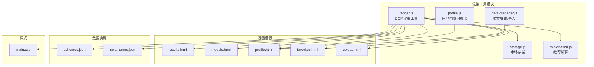

**图表来源**
- [js/utils/render.js](file://js/utils/render.js#L1-L487)
- [js/utils/profile.js](file://js/utils/profile.js#L1-L420)
- [js/data/data-manager.js](file://js/data/data-manager.js#L1-L376)
- [js/data/storage.js](file://js/data/storage.js#L1-L145)
- [js/services/explanation.js](file://js/services/explanation.js#L1-L298)
- [views/results.html](file://views/results.html#L1-L128)
- [views/modals.html](file://views/modals.html#L1-L18)
- [views/profile.html](file://views/profile.html#L1-L21)
- [views/favorites.html](file://views/favorites.html#L1-L18)
- [views/upload.html](file://views/upload.html#L1-L41)
- [data/schemes.json](file://data/schemes.json#L1-L509)
- [data/solar-terms.json](file://data/solar-terms.json#L1-L42)
- [css/main.css](file://css/main.css#L1-L200)

**章节来源**
- [js/utils/render.js](file://js/utils/render.js#L1-L487)
- [views/results.html](file://views/results.html#L1-L128)
- [views/modals.html](file://views/modals.html#L1-L18)
- [views/profile.html](file://views/profile.html#L1-L21)
- [views/favorites.html](file://views/favorites.html#L1-L18)
- [views/upload.html](file://views/upload.html#L1-L41)
- [data/schemes.json](file://data/schemes.json#L1-L509)
- [data/solar-terms.json](file://data/solar-terms.json#L1-L42)
- [css/main.css](file://css/main.css#L1-L200)

## 核心组件
- 视图切换与显示控制：通过统一的 showView 将所有 .view 隐藏，再显示目标视图，确保页面级视图切换的一致性。
- 表单控件初始化：initYearSelect 与 initDaySelect 动态生成年份/日期选项，绑定到对应表单元素。
- 节气信息渲染：renderSolarBanner 与 renderResultHeader 将当前节气名称与五行属性映射为动态样式与文案。
- 方案卡片渲染：renderSchemeCards 与 createSchemeCard 生成卡片，绑定收藏、分享、查看详情等交互事件。
- 详情模态框：renderDetailModal 基于上下文渲染详解内容，结合 explanation.js 的解释卡片。
- 用户界面组合：renderProfileView 协同渲染个人资料面板与数据管理面板。
- 模态框控制：showModal/closeModal 控制遮罩层与滚动锁定。
- 上传预览：updateUploadPreview 切换占位符与预览区域，联动反馈区域显示。
- 收藏列表：renderFavoritesList 渲染收藏卡片，处理空状态。
- Toast消息：showToast 创建并自动消失的提示，支持动画过渡。

**章节来源**
- [js/utils/render.js](file://js/utils/render.js#L13-L21)
- [js/utils/render.js](file://js/utils/render.js#L26-L40)
- [js/utils/render.js](file://js/utils/render.js#L45-L55)
- [js/utils/render.js](file://js/utils/render.js#L60-L76)
- [js/utils/render.js](file://js/utils/render.js#L109-L114)
- [js/utils/render.js](file://js/utils/render.js#L119-L132)
- [js/utils/render.js](file://js/utils/render.js#L137-L201)
- [js/utils/render.js](file://js/utils/render.js#L324-L365)
- [js/utils/render.js](file://js/utils/render.js#L370-L381)
- [js/utils/render.js](file://js/utils/render.js#L386-L403)
- [js/utils/render.js](file://js/utils/render.js#L408-L425)
- [js/utils/render.js](file://js/utils/render.js#L430-L452)
- [js/utils/render.js](file://js/utils/render.js#L457-L486)

## 架构总览
渲染工具模块以函数式API为核心，围绕视图容器与数据源协作，形成清晰的渲染流水线：数据准备 → DOM查询/创建 → 样式映射 → 事件绑定 → 视图呈现。

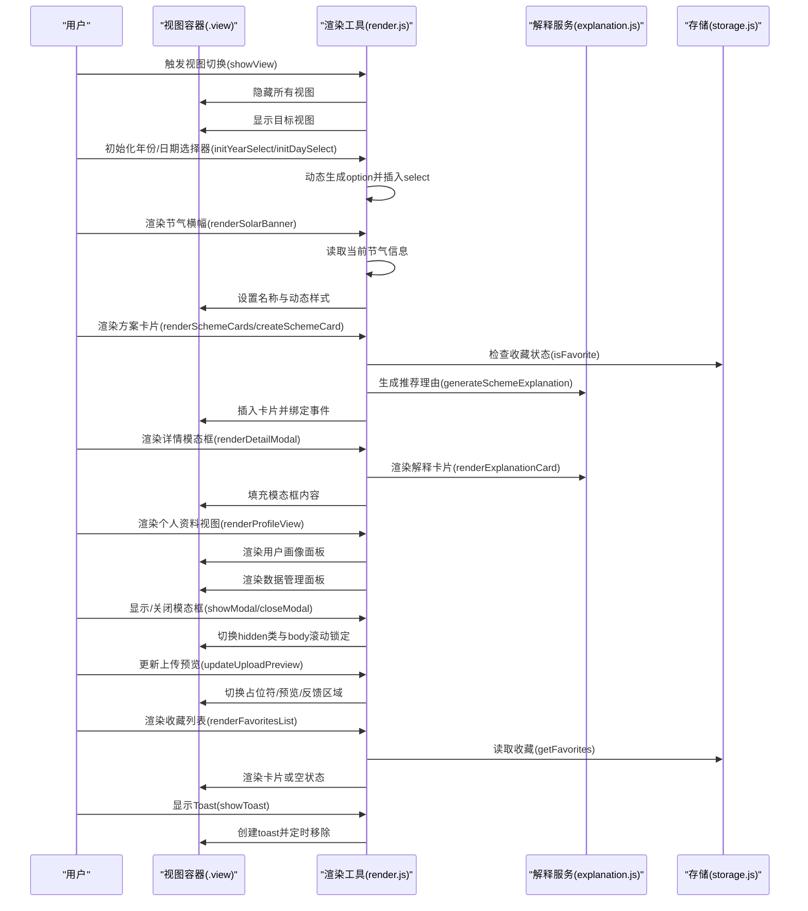

**图表来源**
- [js/utils/render.js](file://js/utils/render.js#L13-L21)
- [js/utils/render.js](file://js/utils/render.js#L26-L40)
- [js/utils/render.js](file://js/utils/render.js#L45-L55)
- [js/utils/render.js](file://js/utils/render.js#L60-L76)
- [js/utils/render.js](file://js/utils/render.js#L119-L132)
- [js/utils/render.js](file://js/utils/render.js#L137-L201)
- [js/utils/render.js](file://js/utils/render.js#L324-L365)
- [js/utils/render.js](file://js/utils/render.js#L370-L381)
- [js/utils/render.js](file://js/utils/render.js#L386-L403)
- [js/utils/render.js](file://js/utils/render.js#L408-L425)
- [js/utils/render.js](file://js/utils/render.js#L430-L452)
- [js/utils/render.js](file://js/utils/render.js#L457-L486)
- [js/services/explanation.js](file://js/services/explanation.js#L218-L241)
- [js/data/storage.js](file://js/data/storage.js#L118-L144)

## 详细组件分析

### 视图切换机制 showView
- 隐藏逻辑：遍历所有 .view 元素并添加隐藏类，确保同一时刻仅有一个视图可见。
- 显示逻辑：根据传入的 viewId 获取目标元素并移除隐藏类。
- 适用场景：首页、结果页、收藏页、个人资料页、上传页之间的切换。

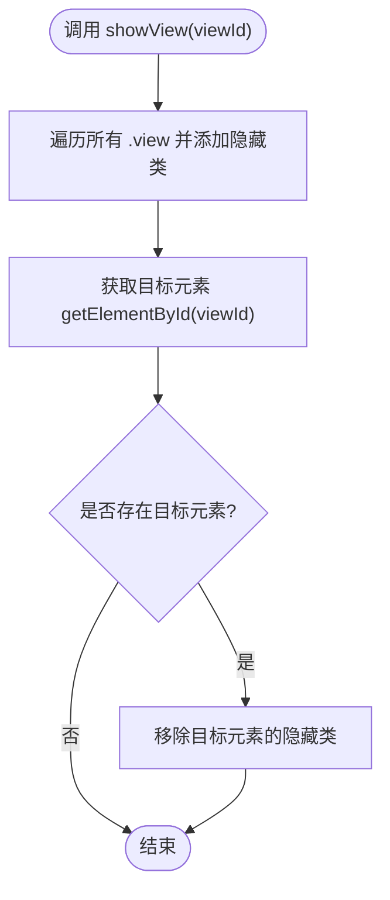

**图表来源**
- [js/utils/render.js](file://js/utils/render.js#L13-L21)

**章节来源**
- [js/utils/render.js](file://js/utils/render.js#L13-L21)

### 表单控件初始化 initYearSelect 与 initDaySelect
- initYearSelect：基于当前年份生成倒序年份选项，限制最小年龄，插入到 #bazi-year。
- initDaySelect：生成1-31日选项，插入到 #bazi-day。
- 数据绑定：通过原生select的value/textContent实现双向绑定的基础能力。

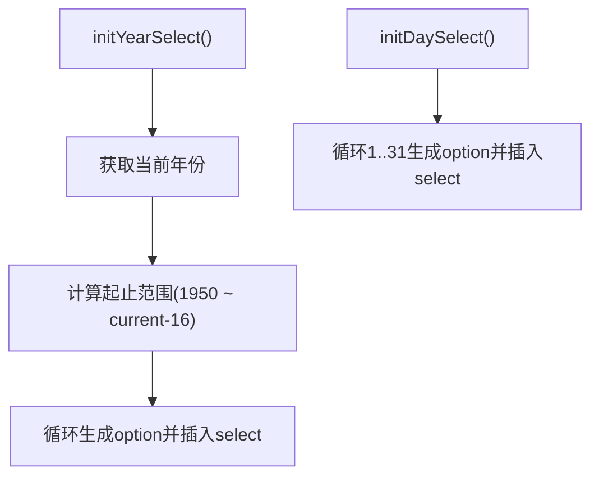

**图表来源**
- [js/utils/render.js](file://js/utils/render.js#L26-L40)
- [js/utils/render.js](file://js/utils/render.js#L45-L55)

**章节来源**
- [js/utils/render.js](file://js/utils/render.js#L26-L40)
- [js/utils/render.js](file://js/utils/render.js#L45-L55)

### 节气信息渲染 renderSolarBanner 与 renderResultHeader
- renderSolarBanner：从 termInfo 读取当前节气名称与五行名称，动态设置元素背景色与文字色（基于五行映射）。
- renderResultHeader：在结果页标题区域展示“节气·五行”组合文本。
- 五行颜色映射：内部提供背景色与文字色映射表，保证视觉一致性。

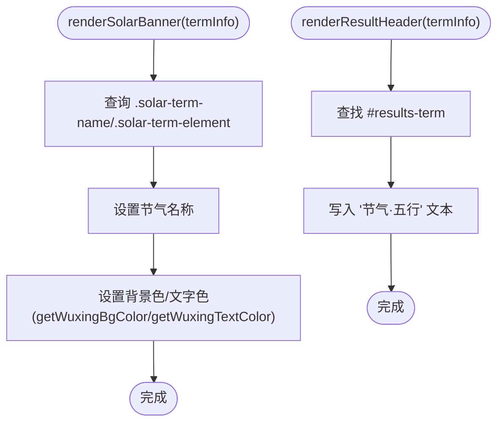

**图表来源**
- [js/utils/render.js](file://js/utils/render.js#L60-L76)
- [js/utils/render.js](file://js/utils/render.js#L81-L104)
- [js/utils/render.js](file://js/utils/render.js#L109-L114)

**章节来源**
- [js/utils/render.js](file://js/utils/render.js#L60-L76)
- [js/utils/render.js](file://js/utils/render.js#L81-L104)
- [js/utils/render.js](file://js/utils/render.js#L109-L114)

### 方案卡片渲染 renderSchemeCards 与 createSchemeCard
- renderSchemeCards：清空容器，遍历方案数组，逐个创建卡片并追加到容器；同时将当前方案集保存到全局供详情使用。
- createSchemeCard：构建卡片DOM，包含颜色条、类型标签、关键词、注解、来源、推荐理由、操作按钮（收藏/分享/查看详情）、反馈按钮（采纳/不喜欢）。
- 收藏状态检测：通过 isFavorite(scheme.id) 判断并设置按钮激活态。
- 推荐理由生成：generateSchemeExplanation 基于评分分解与维度权重生成解释内容。
- 交互事件绑定：bindExplanationToggle 绑定展开/收起事件；卡片内按钮事件由上层控制器绑定。

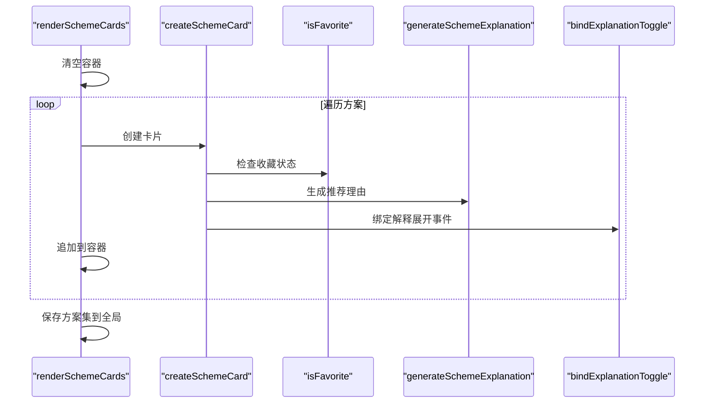

**图表来源**
- [js/utils/render.js](file://js/utils/render.js#L119-L132)
- [js/utils/render.js](file://js/utils/render.js#L137-L201)
- [js/utils/render.js](file://js/utils/render.js#L223-L299)
- [js/utils/render.js](file://js/utils/render.js#L304-L317)
- [js/data/storage.js](file://js/data/storage.js#L141-L144)

**章节来源**
- [js/utils/render.js](file://js/utils/render.js#L119-L132)
- [js/utils/render.js](file://js/utils/render.js#L137-L201)
- [js/utils/render.js](file://js/utils/render.js#L223-L299)
- [js/utils/render.js](file://js/utils/render.js#L304-L317)
- [js/data/storage.js](file://js/data/storage.js#L141-L144)

### 详情模态框渲染 renderDetailModal
- 输入：方案对象与可选的推荐上下文。
- 输出：填充模态框主体，包含颜色条、色彩/材质/感受/五行解读/典籍出处等字段；若提供上下文，则渲染解释卡片。
- 上下文数据：来自推荐引擎，解释卡片由 explanation.js 提供。

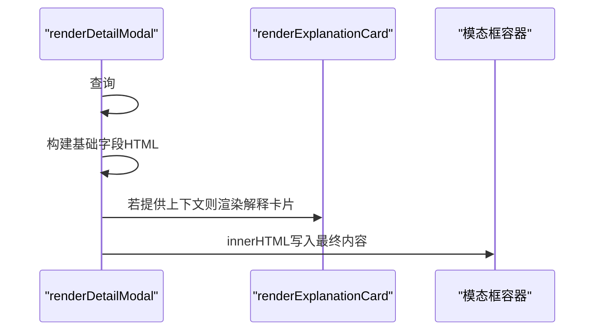

**图表来源**
- [js/utils/render.js](file://js/utils/render.js#L324-L365)
- [js/services/explanation.js](file://js/services/explanation.js#L218-L241)

**章节来源**
- [js/utils/render.js](file://js/utils/render.js#L324-L365)
- [js/services/explanation.js](file://js/services/explanation.js#L218-L241)

### 用户界面组合 renderProfileView
- 个人资料面板：调用 renderUserProfilePanel 生成SVG雷达图、颜色偏好柱状图、场景饼图、收藏趋势折线图等可视化内容。
- 数据管理面板：调用 renderDataManagerPanel 生成数据概览与操作区（导出/导入/清除）。
- 协同渲染：在一个容器内分别挂载两个面板，便于用户在同一视图中查看画像与管理数据。

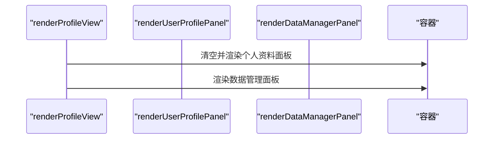

**图表来源**
- [js/utils/render.js](file://js/utils/render.js#L370-L381)
- [js/utils/profile.js](file://js/utils/profile.js#L376-L419)
- [js/data/data-manager.js](file://js/data/data-manager.js#L290-L355)

**章节来源**
- [js/utils/render.js](file://js/utils/render.js#L370-L381)
- [js/utils/profile.js](file://js/utils/profile.js#L376-L419)
- [js/data/data-manager.js](file://js/data/data-manager.js#L290-L355)

### 模态框控制 showModal 与 closeModal
- showModal：显示指定模态框并锁定body滚动，防止背景滚动。
- closeModal：隐藏指定模态框并恢复body滚动。
- 遮罩层：依赖模板中的 .modal-backdrop 实现半透明遮罩。

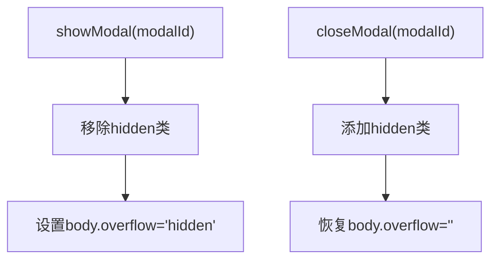

**图表来源**
- [js/utils/render.js](file://js/utils/render.js#L386-L403)
- [views/modals.html](file://views/modals.html#L2-L17)

**章节来源**
- [js/utils/render.js](file://js/utils/render.js#L386-L403)
- [views/modals.html](file://views/modals.html#L2-L17)

### 图片上传预览 updateUploadPreview
- 逻辑：根据传入的图像数据决定显示/隐藏占位符、预览区域与反馈区域；同时设置预览图片的src。
- 适用场景：上传界面的即时反馈与后续保存。

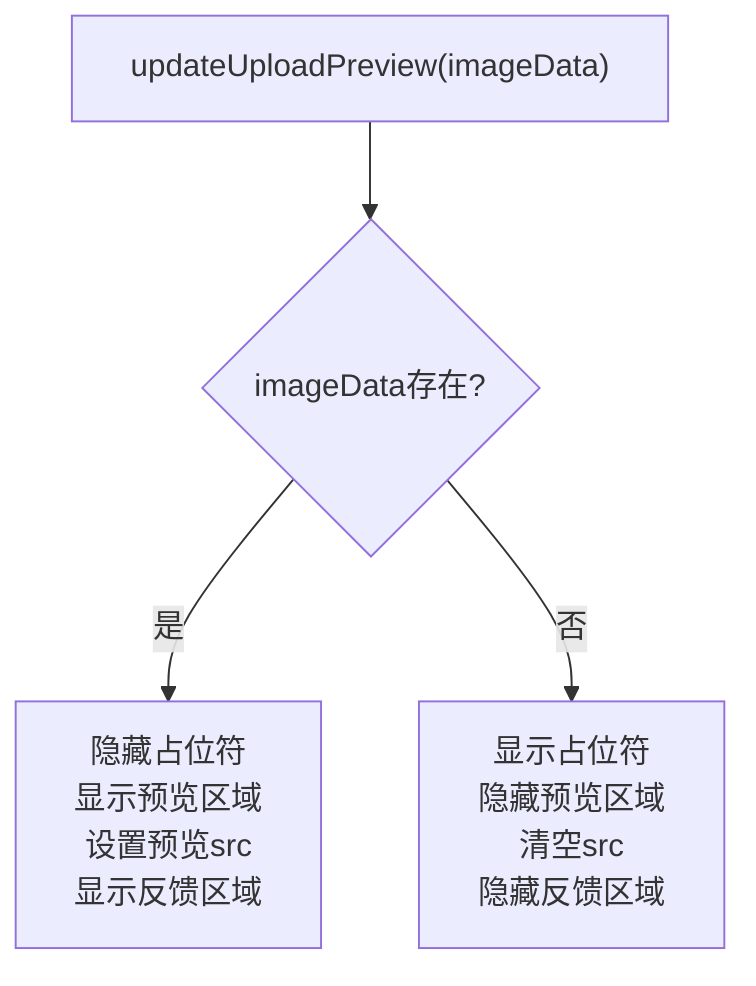

**图表来源**
- [js/utils/render.js](file://js/utils/render.js#L408-L425)
- [views/upload.html](file://views/upload.html#L15-L38)

**章节来源**
- [js/utils/render.js](file://js/utils/render.js#L408-L425)
- [views/upload.html](file://views/upload.html#L15-L38)

### 收藏列表渲染 renderFavoritesList
- 空状态：当收藏列表为空时，渲染“暂无收藏”的空状态提示。
- 动态更新：非空时逐项创建卡片并追加到容器，同时将收藏集保存到全局供详情使用。
- 数据来源：通过 storage.getFavorites 获取收藏列表。

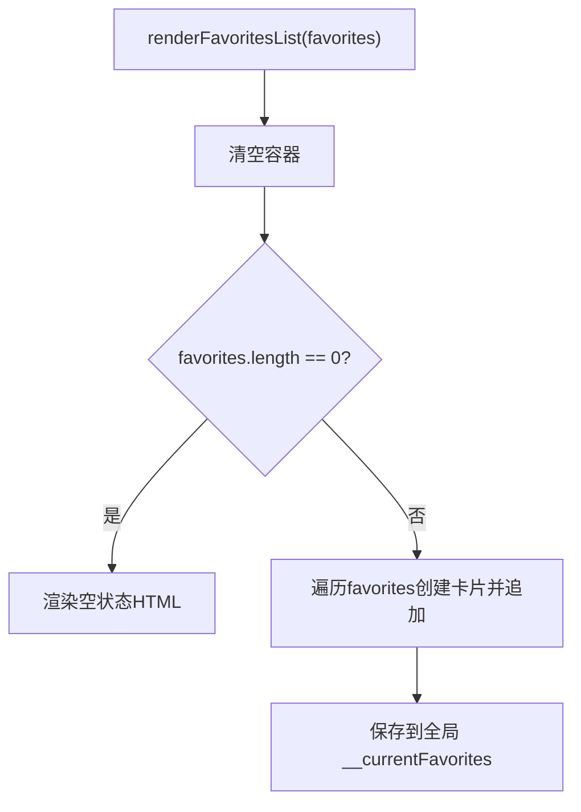

**图表来源**
- [js/utils/render.js](file://js/utils/render.js#L430-L452)
- [js/data/storage.js](file://js/data/storage.js#L118-L120)

**章节来源**
- [js/utils/render.js](file://js/utils/render.js#L430-L452)
- [js/data/storage.js](file://js/data/storage.js#L118-L120)

### Toast消息系统 showToast
- 创建：动态创建div元素，设置定位、背景、圆角、字体与动画样式。
- 显示：插入到body末尾，触发动画。
- 自动消失：延时触发透明度过渡，随后移除节点。

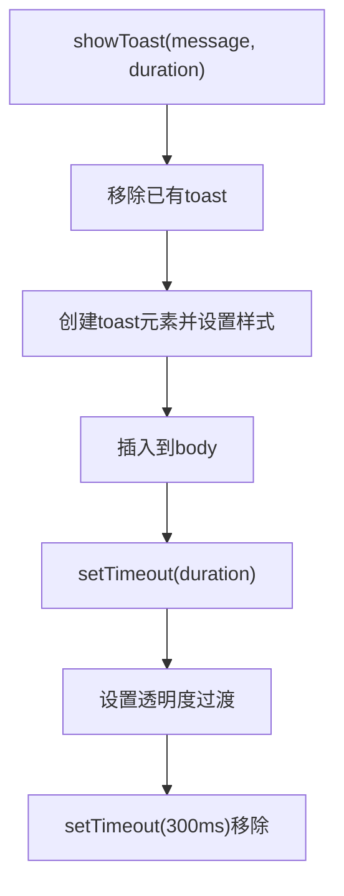

**图表来源**
- [js/utils/render.js](file://js/utils/render.js#L457-L486)

**章节来源**
- [js/utils/render.js](file://js/utils/render.js#L457-L486)

## 依赖分析
- 渲染工具模块依赖：
  - 存储模块：isFavorite、getFavorites 等用于收藏状态与收藏列表。
  - 解释服务：generateSchemeExplanation、renderExplanationCard 用于推荐理由与解释卡片。
  - 视图模板：results.html、modals.html、profile.html、favorites.html、upload.html 提供容器与结构。
  - 数据资源：schemes.json、solar-terms.json 提供方案与节气数据。
  - 样式：main.css 提供设计令牌与通用样式。

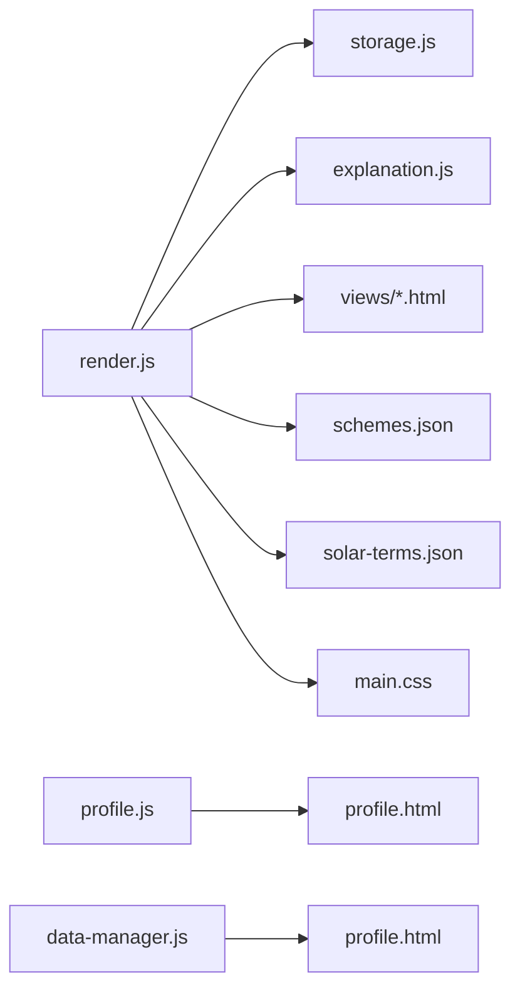

**图表来源**
- [js/utils/render.js](file://js/utils/render.js#L5-L8)
- [js/utils/render.js](file://js/utils/render.js#L119-L132)
- [js/utils/render.js](file://js/utils/render.js#L324-L365)
- [js/utils/render.js](file://js/utils/render.js#L370-L381)
- [js/utils/render.js](file://js/utils/render.js#L430-L452)
- [js/utils/render.js](file://js/utils/render.js#L457-L486)
- [js/data/storage.js](file://js/data/storage.js#L118-L144)
- [js/services/explanation.js](file://js/services/explanation.js#L218-L241)
- [views/results.html](file://views/results.html#L1-L128)
- [views/modals.html](file://views/modals.html#L1-L18)
- [views/profile.html](file://views/profile.html#L1-L21)
- [views/favorites.html](file://views/favorites.html#L1-L18)
- [views/upload.html](file://views/upload.html#L1-L41)
- [data/schemes.json](file://data/schemes.json#L1-L509)
- [data/solar-terms.json](file://data/solar-terms.json#L1-L42)
- [css/main.css](file://css/main.css#L1-L200)

**章节来源**
- [js/utils/render.js](file://js/utils/render.js#L5-L8)
- [js/utils/render.js](file://js/utils/render.js#L119-L132)
- [js/utils/render.js](file://js/utils/render.js#L324-L365)
- [js/utils/render.js](file://js/utils/render.js#L370-L381)
- [js/utils/render.js](file://js/utils/render.js#L430-L452)
- [js/utils/render.js](file://js/utils/render.js#L457-L486)
- [js/data/storage.js](file://js/data/storage.js#L118-L144)
- [js/services/explanation.js](file://js/services/explanation.js#L218-L241)
- [views/results.html](file://views/results.html#L1-L128)
- [views/modals.html](file://views/modals.html#L1-L18)
- [views/profile.html](file://views/profile.html#L1-L21)
- [views/favorites.html](file://views/favorites.html#L1-L18)
- [views/upload.html](file://views/upload.html#L1-L41)
- [data/schemes.json](file://data/schemes.json#L1-L509)
- [data/solar-terms.json](file://data/solar-terms.json#L1-L42)
- [css/main.css](file://css/main.css#L1-L200)

## 性能考虑
- DOM操作优化：批量清空容器后再追加子元素，减少回流与重绘。
- 事件绑定：解释展开事件采用按需绑定，避免重复监听。
- 动画延迟：卡片采用递增动画延迟，营造有序入场效果，但需注意大量数据时的累积延迟。
- 本地存储：收藏状态与收藏列表通过本地存储读取，避免重复计算。
- 样式复用：通过CSS变量与类名控制样式，减少内联样式的开销。

## 故障排除指南
- 视图无法切换：确认目标视图ID正确且模板中存在对应容器；检查 .view 类名与隐藏类是否一致。
- 选择器无效：initYearSelect/initDaySelect 需确保对应ID存在；若不存在则函数直接返回。
- 五行样式异常：renderSolarBanner 依赖 getWuxingBgColor/getWuxingTextColor，确认传入的 wuxing 值在映射表中。
- 收藏状态错误：isFavorite 依赖存储中的收藏列表，检查存储键与数据结构。
- 模态框滚动问题：showModal/closeModal 会修改 body.overflow，若失效需检查CSS与脚本执行顺序。
- Toast重复：showToast 会移除已有toast，若仍出现多个，检查重复调用或样式冲突。

**章节来源**
- [js/utils/render.js](file://js/utils/render.js#L13-L21)
- [js/utils/render.js](file://js/utils/render.js#L26-L40)
- [js/utils/render.js](file://js/utils/render.js#L45-L55)
- [js/utils/render.js](file://js/utils/render.js#L60-L76)
- [js/utils/render.js](file://js/utils/render.js#L81-L104)
- [js/utils/render.js](file://js/utils/render.js#L141-L144)
- [js/utils/render.js](file://js/utils/render.js#L386-L403)
- [js/utils/render.js](file://js/utils/render.js#L457-L486)

## 结论
渲染工具模块以简洁的函数式API实现了从数据到视图的完整链路，具备良好的扩展性与可维护性。通过统一的视图切换、可控的表单初始化、灵活的卡片渲染与模态框控制，为用户提供了流畅的交互体验。建议在大规模数据场景下关注动画延迟与事件绑定策略，在样式层面充分利用CSS变量与类名，进一步提升性能与一致性。