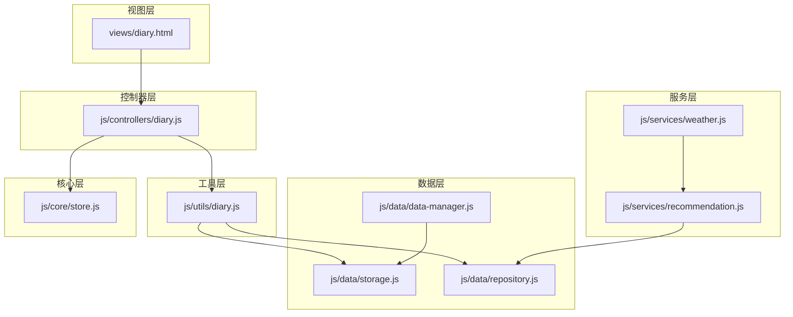
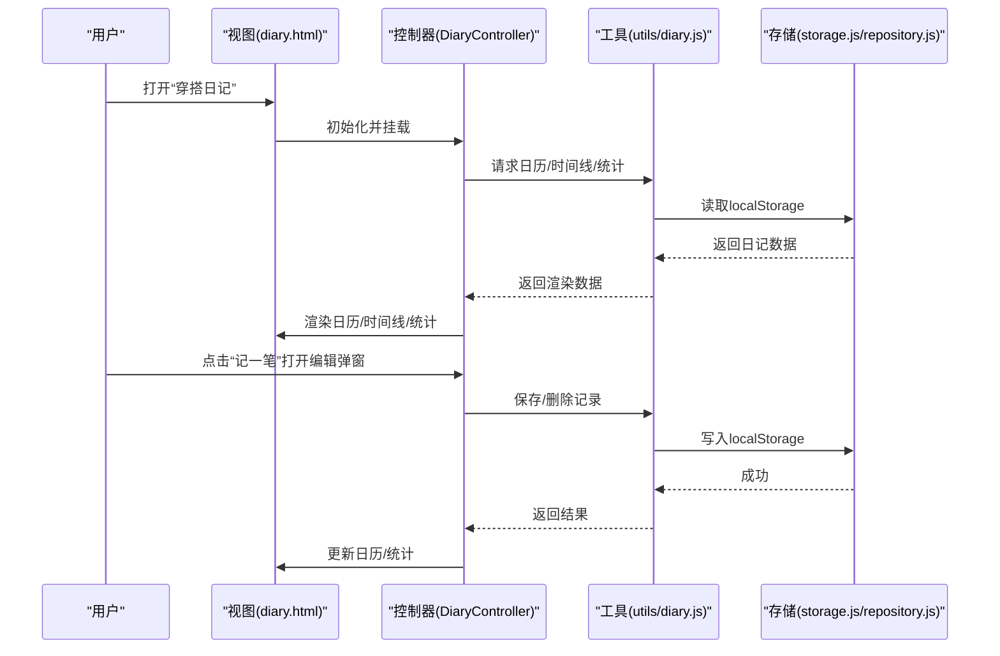
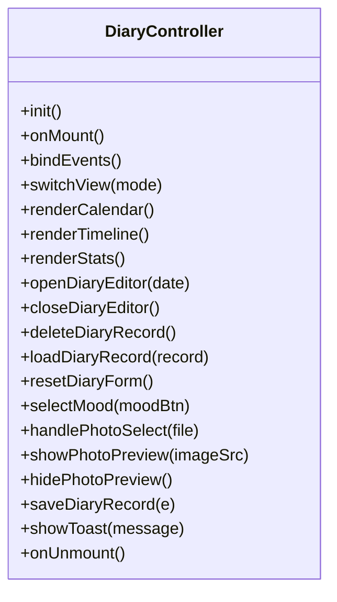
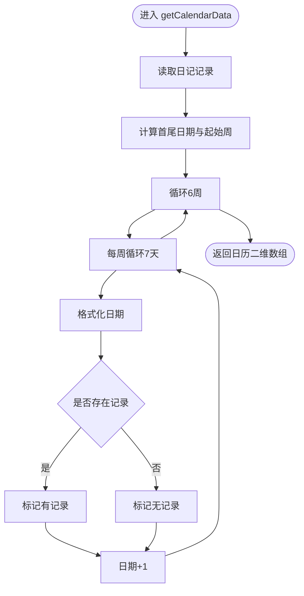
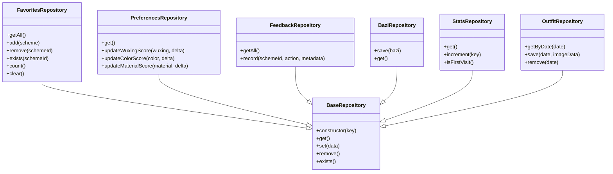
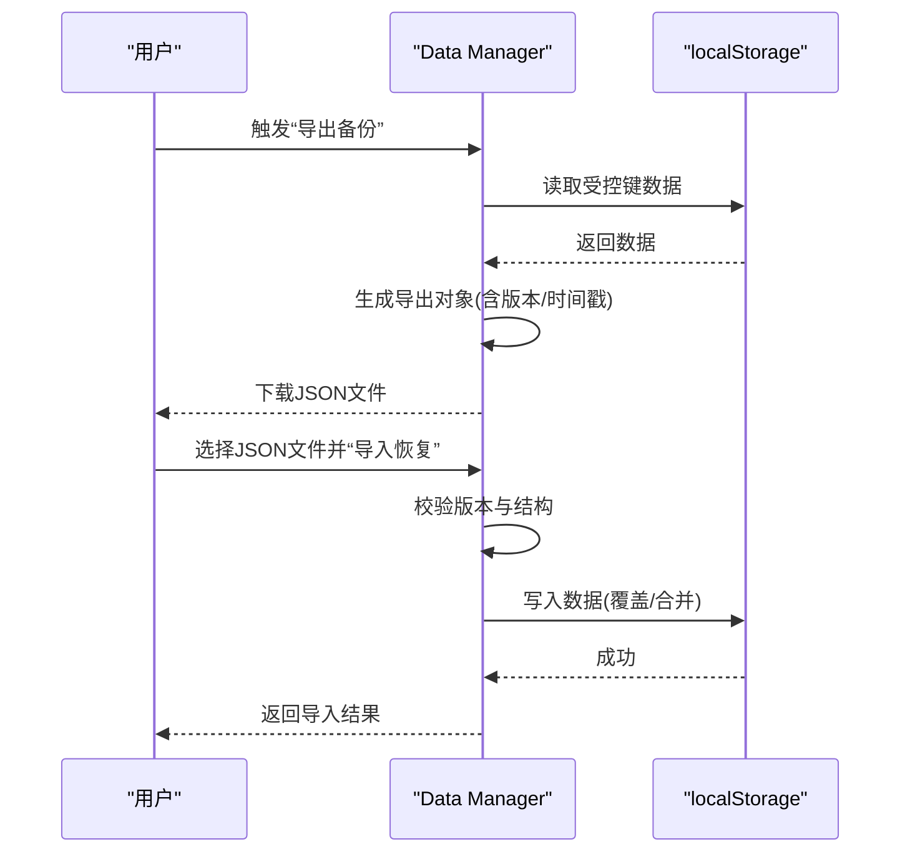
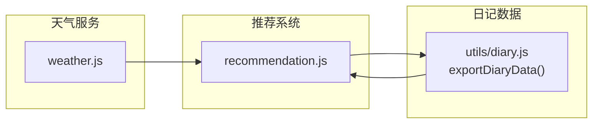
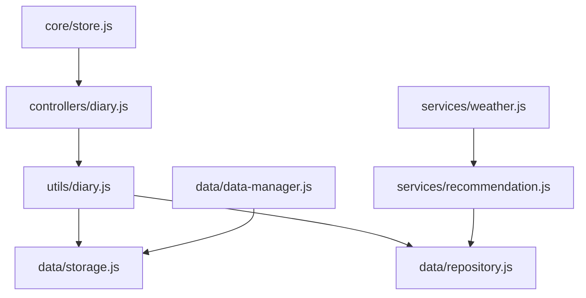
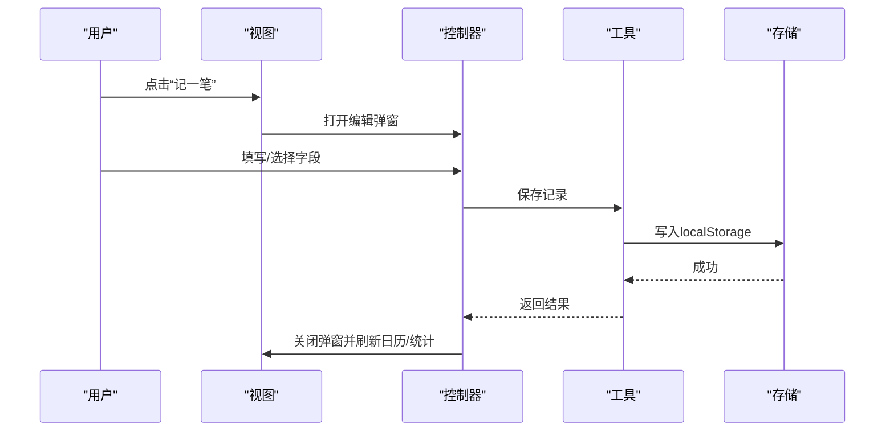
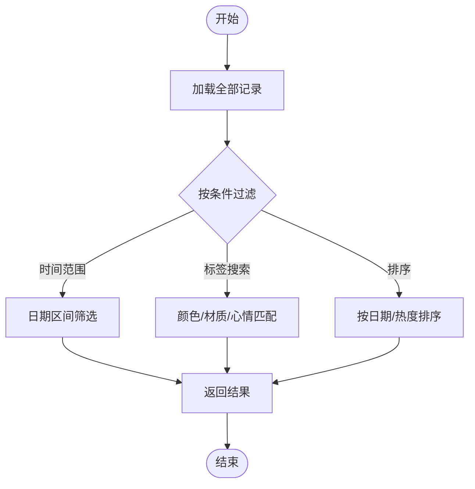

# 穿搭日记工具模块

<cite>
**本文档引用的文件**
- [js/controllers/diary.js](file://js/controllers/diary.js)
- [js/utils/diary.js](file://js/utils/diary.js)
- [views/diary.html](file://views/diary.html)
- [js/data/storage.js](file://js/data/storage.js)
- [js/data/repository.js](file://js/data/repository.js)
- [js/data/data-manager.js](file://js/data/data-manager.js)
- [js/services/recommendation.js](file://js/services/recommendation.js)
- [js/services/weather.js](file://js/services/weather.js)
- [js/core/store.js](file://js/core/store.js)
- [data/schemes.json](file://data/schemes.json)
</cite>

## 目录
1. [简介](#简介)
2. [项目结构](#项目结构)
3. [核心组件](#核心组件)
4. [架构总览](#架构总览)
5. [详细组件分析](#详细组件分析)
6. [依赖关系分析](#依赖关系分析)
7. [性能考量](#性能考量)
8. [故障排查指南](#故障排查指南)
9. [结论](#结论)
10. [附录](#附录)

## 简介
本模块围绕“穿搭日记”功能，提供用户每日穿搭记录、日历与时间线视图、统计分析与导出备份能力。系统通过本地存储持久化日记数据，并与推荐系统、天气服务、全局状态管理协同，形成从记录到分析再到个性化推荐的闭环。

## 项目结构
- 控制器层：负责视图渲染、事件绑定与用户交互逻辑
- 工具层：封装日记数据的增删改查、统计与导出
- 视图层：HTML 模板定义 UI 结构与交互元素
- 数据层：提供通用存储与仓库抽象，支持偏好、反馈、收藏等多类数据
- 服务层：与推荐系统、天气服务协作，提供个性化与环境适配
- 核心层：全局状态管理，统一调度各模块

图表来源
- [views/diary.html](file://views/diary.html#L1-L159)
- [js/controllers/diary.js](file://js/controllers/diary.js#L1-L440)
- [js/utils/diary.js](file://js/utils/diary.js#L1-L242)
- [js/data/storage.js](file://js/data/storage.js#L1-L145)
- [js/data/repository.js](file://js/data/repository.js#L1-L394)
- [js/data/data-manager.js](file://js/data/data-manager.js#L1-L376)
- [js/services/recommendation.js](file://js/services/recommendation.js#L1-L466)
- [js/services/weather.js](file://js/services/weather.js#L242-L289)
- [js/core/store.js](file://js/core/store.js#L1-L212)

章节来源
- [views/diary.html](file://views/diary.html#L1-L159)
- [js/controllers/diary.js](file://js/controllers/diary.js#L1-L440)
- [js/utils/diary.js](file://js/utils/diary.js#L1-L242)
- [js/data/storage.js](file://js/data/storage.js#L1-L145)
- [js/data/repository.js](file://js/data/repository.js#L1-L394)
- [js/data/data-manager.js](file://js/data/data-manager.js#L1-L376)
- [js/services/recommendation.js](file://js/services/recommendation.js#L1-L466)
- [js/services/weather.js](file://js/services/weather.js#L242-L289)
- [js/core/store.js](file://js/core/store.js#L1-L212)

## 核心组件
- 日记控制器：负责日历/时间线渲染、编辑弹窗、事件绑定、统计展示与视图切换
- 日记工具模块：提供日记记录的增删改查、日历数据生成、时间线数据、统计与导出
- 本地存储与仓库：提供安全的 localStorage 封装、键空间隔离、收藏/偏好/反馈等仓库
- 数据管理：提供统一的数据导出/导入/清理能力，支持版本控制与兼容性校验
- 推荐与天气服务：提供运势因子、场景偏好、材质/颜色匹配与天气适配
- 全局状态：集中管理应用状态，便于跨模块通信

章节来源
- [js/controllers/diary.js](file://js/controllers/diary.js#L1-L440)
- [js/utils/diary.js](file://js/utils/diary.js#L1-L242)
- [js/data/storage.js](file://js/data/storage.js#L1-L145)
- [js/data/repository.js](file://js/data/repository.js#L1-L394)
- [js/data/data-manager.js](file://js/data/data-manager.js#L1-L376)
- [js/services/recommendation.js](file://js/services/recommendation.js#L1-L466)
- [js/services/weather.js](file://js/services/weather.js#L242-L289)
- [js/core/store.js](file://js/core/store.js#L1-L212)

## 架构总览
日记模块采用“视图-控制器-工具-存储”的分层架构：
- 视图层：HTML 模板定义 UI 结构与交互元素
- 控制器层：处理用户事件、渲染视图、调用工具层 API
- 工具层：封装业务逻辑（日历、时间线、统计、导出）
- 存储层：提供安全的本地存储与仓库抽象
- 服务层：与推荐系统、天气服务协作，提供个性化与环境适配
- 核心层：全局状态管理，统一调度

图表来源
- [views/diary.html](file://views/diary.html#L1-L159)
- [js/controllers/diary.js](file://js/controllers/diary.js#L1-L440)
- [js/utils/diary.js](file://js/utils/diary.js#L1-L242)
- [js/data/storage.js](file://js/data/storage.js#L1-L145)
- [js/data/repository.js](file://js/data/repository.js#L1-L394)

## 详细组件分析

### 日记控制器（DiaryController）
职责与行为
- 初始化当前日期与视图模式（日历/时间线）
- 动态绑定事件：返回、添加记录、视图切换、月份导航、日历点击、弹窗关闭、照片上传、表单提交、删除记录
- 渲染日历：按年月生成日历网格，标注当天、当月与记录存在
- 渲染时间线：按日期倒序展示最近记录
- 渲染统计：连续天数、总记录数、颜色分布
- 编辑弹窗：加载/重置表单、选择照片、保存/删除记录
- 交互反馈：吐司提示、确认对话框

图表来源
- [js/controllers/diary.js](file://js/controllers/diary.js#L19-L440)

章节来源
- [js/controllers/diary.js](file://js/controllers/diary.js#L1-L440)
- [views/diary.html](file://views/diary.html#L1-L159)

### 日记工具模块（utils/diary.js）
数据模型与约束
- 日记记录对象包含：颜色、材质、备注、心情、图片、日期、更新时间
- 心情枚举：开心、自信、平静、疲惫、兴奋
- 键空间：wuxing_diary

关键功能
- 获取/保存/删除/检查记录
- 生成日历数据：按周网格组织，标注是否当月/当天/有记录
- 生成时间线数据：按日期倒序，限制数量
- 统计分析：颜色、材质、心情、方案使用频次
- 连续天数计算：从最新日期向前推算连续记录
- 导出数据：包含记录、统计与连续天数

图表来源
- [js/utils/diary.js](file://js/utils/diary.js#L87-L128)

章节来源
- [js/utils/diary.js](file://js/utils/diary.js#L1-L242)

### 本地存储与仓库（storage.js / repository.js）
- storage.js：提供带前缀的键空间隔离，封装安全的 localStorage 读写与批量操作
- repository.js：抽象 BaseRepository，提供收藏、偏好、反馈、八字、统计、穿搭照片等专用仓库，统一 get/set/remove/exist

图表来源
- [js/data/repository.js](file://js/data/repository.js#L46-L394)
- [js/data/storage.js](file://js/data/storage.js#L1-L145)

章节来源
- [js/data/storage.js](file://js/data/storage.js#L1-L145)
- [js/data/repository.js](file://js/data/repository.js#L1-L394)

### 数据管理（data-manager.js）
- 导出：收集指定键集合，附加版本与导出时间戳，生成 JSON 文件
- 导入：校验版本与结构，支持覆盖/合并两种模式，可预览导入内容
- 清理：移除所有受控键
- 概览：统计键数量、总大小与各键简要信息

图表来源
- [js/data/data-manager.js](file://js/data/data-manager.js#L44-L184)

章节来源
- [js/data/data-manager.js](file://js/data/data-manager.js#L1-L376)

### 推荐系统与天气服务协作
- 推荐系统：提供场景偏好、运势因子、个性化评分、方案选择
- 天气服务：根据温度/材质/颜色给出天气提示与适配建议
- 协作方式：日记记录可作为历史数据参与偏好学习；推荐系统结合天气与场景进行个性化调整

图表来源
- [js/services/recommendation.js](file://js/services/recommendation.js#L1-L466)
- [js/services/weather.js](file://js/services/weather.js#L242-L289)
- [js/utils/diary.js](file://js/utils/diary.js#L231-L241)

章节来源
- [js/services/recommendation.js](file://js/services/recommendation.js#L1-L466)
- [js/services/weather.js](file://js/services/weather.js#L242-L289)
- [js/utils/diary.js](file://js/utils/diary.js#L231-L241)

## 依赖关系分析
- 控制器依赖工具模块进行数据读写与统计
- 工具模块依赖存储与仓库进行持久化
- 数据管理独立于日记模块，提供统一的数据导出/导入
- 推荐与天气服务与日记模块通过数据共享与偏好学习间接耦合
- 全局状态管理为跨模块通信提供中枢

图表来源
- [js/controllers/diary.js](file://js/controllers/diary.js#L1-L440)
- [js/utils/diary.js](file://js/utils/diary.js#L1-L242)
- [js/data/storage.js](file://js/data/storage.js#L1-L145)
- [js/data/repository.js](file://js/data/repository.js#L1-L394)
- [js/data/data-manager.js](file://js/data/data-manager.js#L1-L376)
- [js/services/recommendation.js](file://js/services/recommendation.js#L1-L466)
- [js/services/weather.js](file://js/services/weather.js#L242-L289)
- [js/core/store.js](file://js/core/store.js#L1-L212)

章节来源
- [js/controllers/diary.js](file://js/controllers/diary.js#L1-L440)
- [js/utils/diary.js](file://js/utils/diary.js#L1-L242)
- [js/data/storage.js](file://js/data/storage.js#L1-L145)
- [js/data/repository.js](file://js/data/repository.js#L1-L394)
- [js/data/data-manager.js](file://js/data/data-manager.js#L1-L376)
- [js/services/recommendation.js](file://js/services/recommendation.js#L1-L466)
- [js/services/weather.js](file://js/services/weather.js#L242-L289)
- [js/core/store.js](file://js/core/store.js#L1-L212)

## 性能考量
- 渲染优化
  - 日历与时间线渲染按需生成，避免一次性渲染大量节点
  - 统计计算在需要时触发，减少不必要的重排
- 存储优化
  - 使用安全包装的 localStorage 操作，避免异常导致崩溃
  - 仓库层提供键空间隔离，降低冲突风险
- 导出/导入
  - 导出采用 JSON 序列化，体积可控；导入支持预览与合并，降低误操作风险
- 推荐与天气
  - 运势因子与评分计算基于上下文，避免频繁重算

[本节为通用指导，无需特定文件引用]

## 故障排查指南
- 无法保存/删除日记
  - 检查浏览器 localStorage 权限与容量
  - 确认工具模块的存储封装是否正常执行
- 日历/时间线空白
  - 确认控制器已正确绑定事件并调用渲染函数
  - 检查工具模块是否成功读取/写入数据
- 导出/导入失败
  - 校验文件格式与版本号
  - 查看导入预览与错误信息
- 统计异常
  - 检查记录字段完整性（颜色/材质/心情）
  - 确认统计函数的键名与数据结构一致

章节来源
- [js/utils/diary.js](file://js/utils/diary.js#L1-L242)
- [js/data/data-manager.js](file://js/data/data-manager.js#L102-L184)
- [js/controllers/diary.js](file://js/controllers/diary.js#L1-L440)

## 结论
穿搭日记模块通过清晰的分层设计与完善的本地存储机制，实现了从记录、统计到导出备份的完整闭环。配合推荐系统与天气服务，能够基于用户历史与环境因素提供个性化建议。未来可在以下方面持续演进：扩展字段与标签体系、增强查询与筛选能力、引入版本迁移与增量备份、完善扩展接口与第三方集成。

[本节为总结性内容，无需特定文件引用]

## 附录

### 日记条目数据结构与约束
- 字段定义
  - 日期：YYYY-MM-DD（字符串）
  - 更新时间：ISO 时间戳
  - 颜色：字符串（如“墨绿色”）
  - 材质：字符串（如“棉麻”）
  - 备注：字符串
  - 心情：枚举（happy/confident/calm/tired/excited）
  - 图片：数据 URL（可选）
  - 方案ID：字符串（可选，用于统计）
- 约束
  - 日期唯一性
  - 心情枚举值限定
  - 图片为合法数据 URL（若存在）

章节来源
- [js/utils/diary.js](file://js/utils/diary.js#L57-L85)
- [js/utils/diary.js](file://js/utils/diary.js#L10-L17)

### 创建与编辑流程（序列图）

图表来源
- [views/diary.html](file://views/diary.html#L74-L157)
- [js/controllers/diary.js](file://js/controllers/diary.js#L287-L425)
- [js/utils/diary.js](file://js/utils/diary.js#L57-L75)
- [js/data/storage.js](file://js/data/storage.js#L9-L21)

### 查询与筛选机制（流程图）

图表来源
- [js/utils/diary.js](file://js/utils/diary.js#L135-L141)
- [js/utils/diary.js](file://js/utils/diary.js#L147-L182)

### 统计分析（颜色偏好、连续天数）
- 颜色偏好：统计出现频次并排序，取前 N 展示
- 连续天数：从最新日期向前推算连续记录天数

章节来源
- [js/utils/diary.js](file://js/utils/diary.js#L147-L182)
- [js/utils/diary.js](file://js/utils/diary.js#L210-L229)

### 导出与备份（数据管理）
- 导出：生成包含版本、导出时间与用户数据的 JSON 文件
- 导入：校验版本与结构，支持覆盖/合并与预览
- 清理：移除受控键，释放空间

章节来源
- [js/data/data-manager.js](file://js/data/data-manager.js#L44-L184)

### 扩展开发指南
- 自定义字段
  - 在日记记录对象中新增字段，并在工具模块中处理读写与统计
  - 在视图模板中添加对应输入控件
- 插件接口
  - 通过仓库层扩展新的数据键空间，保持命名规范与版本控制
- 第三方集成
  - 与推荐系统协作：将日记数据作为偏好学习的历史依据
  - 与天气服务协作：根据天气条件调整推荐权重

章节来源
- [js/utils/diary.js](file://js/utils/diary.js#L231-L241)
- [js/services/recommendation.js](file://js/services/recommendation.js#L145-L218)
- [js/services/weather.js](file://js/services/weather.js#L268-L289)