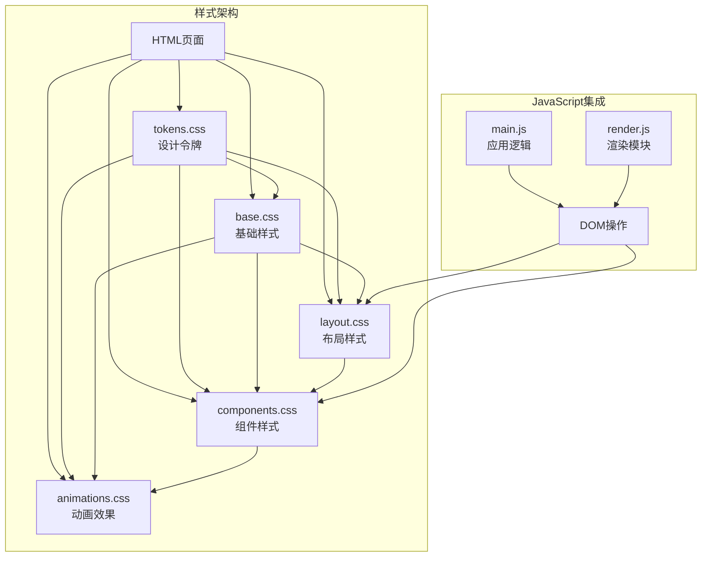
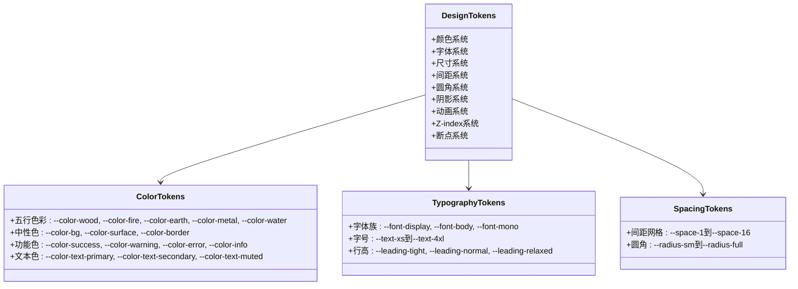
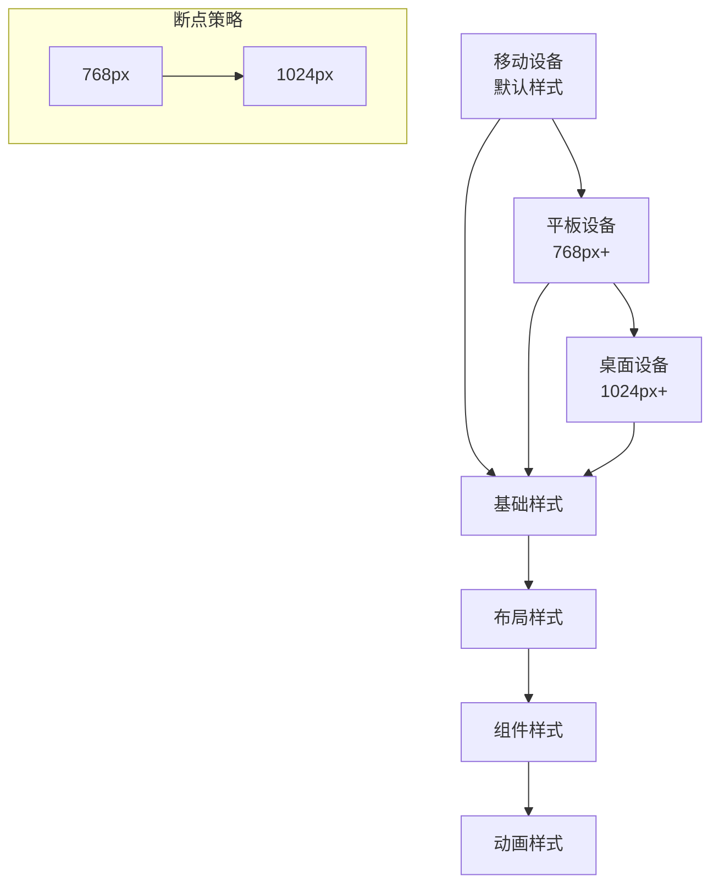
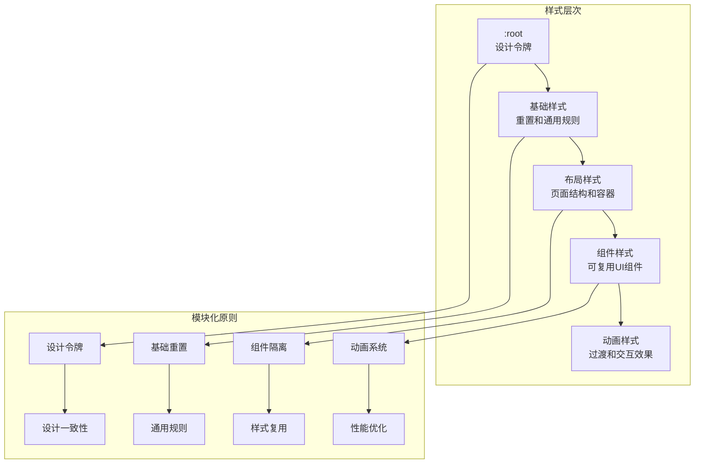
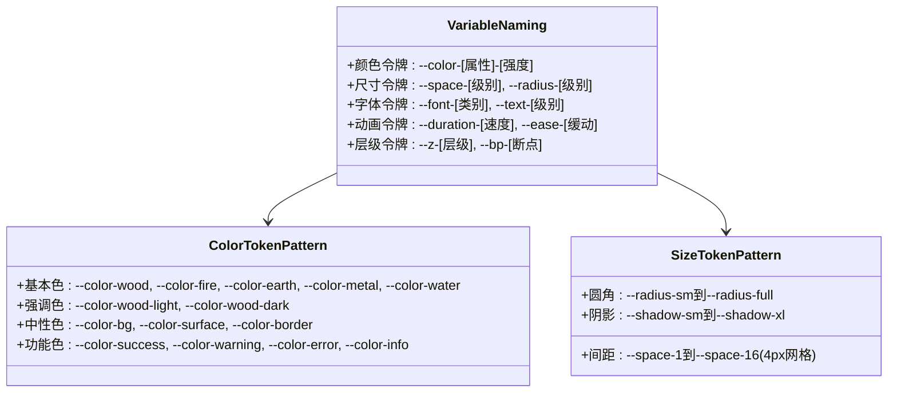
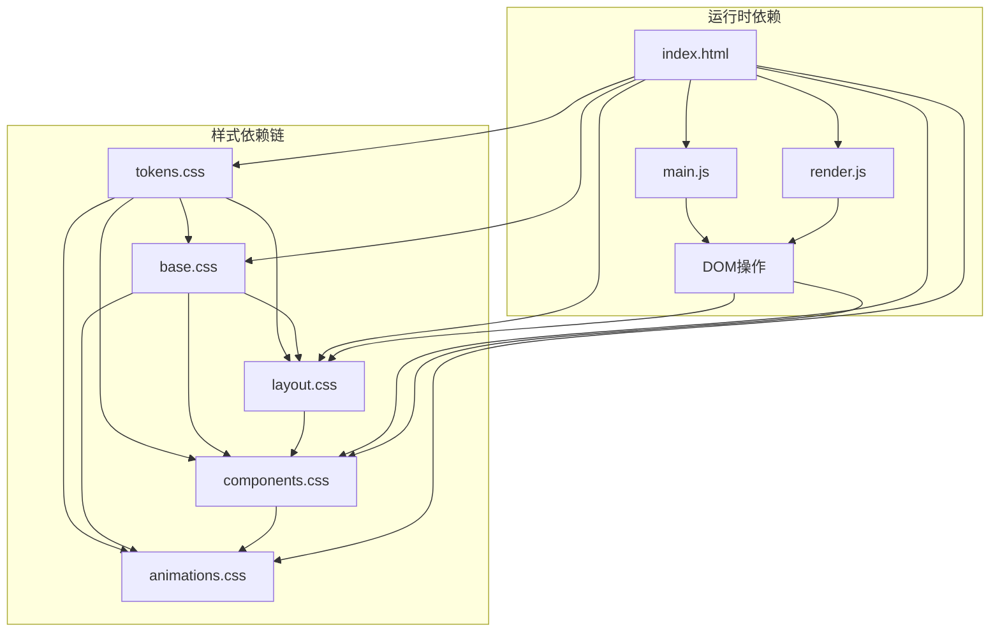
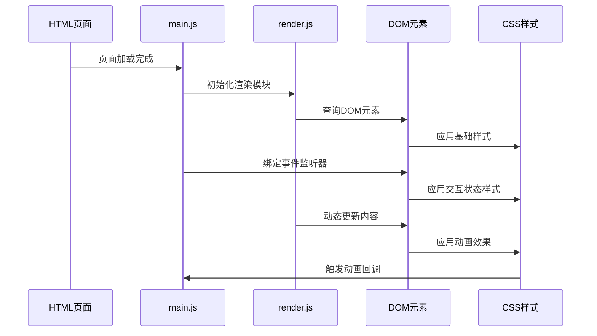

# CSS样式规范

<cite>
**本文档引用的文件**
- [index.html](file://index.html)
- [tokens.css](file://css/tokens.css)
- [base.css](file://css/base.css)
- [layout.css](file://css/layout.css)
- [components.css](file://css/components.css)
- [animations.css](file://css/animations.css)
- [main.js](file://js/main.js)
- [render.js](file://js/render.js)
</cite>

## 目录
1. [引言](#引言)
2. [项目结构](#项目结构)
3. [核心组件](#核心组件)
4. [架构概览](#架构概览)
5. [详细组件分析](#详细组件分析)
6. [依赖关系分析](#依赖关系分析)
7. [性能考虑](#性能考虑)
8. [故障排除指南](#故障排除指南)
9. [结论](#结论)

## 引言

本CSS样式规范文档基于"五行穿搭建议"项目的现有代码实现，制定了全面的样式编码标准。该规范涵盖了类名命名约定、选择器使用规范、CSS变量命名标准、媒体查询组织规范、样式模块化原则、动画和过渡效果规范以及可访问性要求。

该项目采用模块化的CSS架构，通过设计令牌系统实现主题化和一致性，同时提供了完整的响应式设计和无障碍功能支持。

## 项目结构

项目采用模块化的CSS文件组织方式，每个CSS文件负责特定的功能领域：



**图表来源**
- [index.html](file://index.html#L13-L18)
- [tokens.css](file://css/tokens.css#L1-L109)
- [base.css](file://css/base.css#L1-L168)

**章节来源**
- [index.html](file://index.html#L13-L18)
- [tokens.css](file://css/tokens.css#L1-L109)

## 核心组件

### 设计令牌系统

项目采用集中式的CSS变量管理，建立了完整的令牌体系：



**图表来源**
- [tokens.css](file://css/tokens.css#L5-L108)

### 响应式设计架构

项目实现了多层次的响应式设计：



**图表来源**
- [layout.css](file://css/layout.css#L225-L251)

**章节来源**
- [tokens.css](file://css/tokens.css#L5-L108)
- [layout.css](file://css/layout.css#L225-L251)

## 架构概览

### 样式层次结构

项目采用了清晰的样式层次结构，确保样式的可维护性和一致性：



**图表来源**
- [index.html](file://index.html#L13-L18)
- [tokens.css](file://css/tokens.css#L5-L108)
- [base.css](file://css/base.css#L5-L27)

## 详细组件分析

### 类名命名约定

项目采用简洁明了的类名命名策略，遵循以下原则：

#### 组件类名模式
- `.btn` - 按钮基础样式
- `.scheme-card` - 方案卡片组件
- `.upload-zone` - 上传区域组件
- `.modal` - 模态框组件

#### 状态类名模式
- `.active` - 激活状态
- `.hidden` - 隐藏状态
- `.dragover` - 拖拽悬停状态
- `.disabled` - 禁用状态

#### 变体类名模式
- `.btn-primary` - 主要按钮变体
- `.btn-secondary` - 次要按钮变体
- `.btn-large` - 大尺寸变体
- `.btn-icon` - 图标按钮变体

### 选择器使用规范

#### 推荐的选择器使用方式

1. **类选择器优先级**
   ```css
   /* ✅ 推荐 */
   .btn { /* 基础按钮样式 */ }
   .btn-primary { /* 主要按钮变体 */ }
   .btn:hover { /* 悬停状态 */ }
   
   /* ❌ 不推荐 */
   button.primary { /* 元素+类选择器组合 */ }
   div.btn { /* 元素+类选择器组合 */ }
   ```

2. **后代选择器限制**
   ```css
   /* ✅ 推荐 - 限定深度 */
   .scheme-card .scheme-keywords { /* 一层深度限制 */ }
   
   /* ❌ 不推荐 - 深层嵌套 */
   .scheme-cards .scheme-card .scheme-keywords .scheme-keyword { /* 过深嵌套 */ }
   ```

3. **ID选择器使用规范**
   ```css
   /* ✅ 推荐 - 仅用于特殊场景 */
   #upload-zone { /* 特殊交互区域 */ }
   #modal-detail { /* 模态框容器 */ }
   
   /* ❌ 不推荐 - 过度使用 */
   #view-entry .entry-body .bazi-section .bazi-form { /* 过度限定 */ }
   ```

#### 伪类和伪元素正确用法

```css
/* ✅ 正确使用伪类 */
a:hover { color: var(--color-water-dark); }
input:focus { outline: 2px solid var(--color-wood); }

/* ✅ 正确使用伪元素 */
.sr-only::before { content: ""; }
.upload-placeholder::after { content: ""; }

/* ✅ 可访问性伪类 */
:target { scroll-margin-top: 2rem; }
:focus-visible { outline: 2px solid var(--color-wood); }
```

### CSS变量命名标准

#### 设计令牌命名约定



**图表来源**
- [tokens.css](file://css/tokens.css#L5-L108)

#### 变量作用域管理

```css
/* ✅ 根作用域 - 全局设计令牌 */
:root {
  --color-wood: #4A7C59;
  --color-wood-light: #8FBE8E;
  --color-wood-dark: #2D5A3D;
}

/* ✅ 局部作用域 - 组件内部变量 */
.scheme-card {
  --card-shadow: var(--shadow-md);
  --card-radius: var(--radius-lg);
}

.scheme-card {
  box-shadow: var(--card-shadow);
  border-radius: var(--card-radius);
}
```

#### 主题变量组织方式

```css
/* ✅ 分组组织 - 逻辑分组而非物理分组 */
:root {
  /* 颜色系统 */
  --color-wood: #4A7C59;
  --color-fire: #C0392B;
  --color-earth: #C9A84C;
  --color-metal: #F0F0E8;
  --color-water: #1B3A6B;
  
  /* 中性色 */
  --color-bg: #FAFAF8;
  --color-surface: #FFFFFF;
  --color-border: #E5E5E0;
  
  /* 字体系统 */
  --font-display: 'LXGW WenKai', 'Noto Serif SC', serif;
  --font-body: 'Noto Sans SC', -apple-system, BlinkMacSystemFont, sans-serif;
  
  /* 尺寸系统 */
  --space-1: 0.25rem;
  --space-2: 0.5rem;
  --space-3: 0.75rem;
  --space-4: 1rem;
}
```

### 媒体查询组织规范

#### 断点定义标准

```css
/* ✅ 标准断点定义 */
@media (min-width: 768px) { /* 平板设备 */ }
@media (min-width: 1024px) { /* 桌面设备 */ }
@media (min-width: 1200px) { /* 大屏设备 */ }

/* ✅ 移动端优先策略 */
.view {
  padding: var(--space-6);
  max-width: 100%;
}

@media (min-width: 768px) {
  .view {
    max-width: 600px;
    margin: 0 auto;
  }
}

@media (min-width: 1024px) {
  .view {
    max-width: 800px;
  }
}
```

#### 响应式设计模式

```css
/* ✅ 流式布局模式 */
.scheme-cards {
  display: flex;
  flex-direction: column;
  gap: var(--space-4);
}

@media (min-width: 1024px) {
  .scheme-cards {
    display: grid;
    grid-template-columns: repeat(3, 1fr);
  }
}

/* ✅ 弹性布局模式 */
.bazi-row {
  display: grid;
  grid-template-columns: 1fr 1fr;
  gap: var(--space-4);
}

/* ✅ 条件显示模式 */
.feedback-section {
  width: 100%;
  max-width: 400px;
  margin-top: var(--space-6);
  opacity: 0;
  transform: translateY(20px);
  transition: all var(--duration-normal) var(--ease-out);
}

.feedback-section.visible {
  opacity: 1;
  transform: translateY(0);
}
```

#### 移动端适配策略

```css
/* ✅ 触摸友好设计 */
.btn {
  min-height: 44px;
  min-width: 44px;
  padding: var(--space-3) var(--space-5);
  font-size: var(--text-base);
}

/* ✅ 视口配置 */
<meta name="viewport" content="width=device-width, initial-scale=1.0">

/* ✅ 触摸手势支持 */
.upload-zone {
  min-height: 200px;
  min-width: 200px;
  cursor: pointer;
  touch-action: manipulation;
}

/* ✅ 减少运动偏好处理 */
@media (prefers-reduced-motion: reduce) {
  *, *::before, *::after {
    animation-duration: 0.01ms !important;
    animation-iteration-count: 1 !important;
    transition-duration: 0.01ms !important;
  }
}
```

### 样式模块化原则

#### 组件样式隔离

```css
/* ✅ 组件边界定义 */
.scheme-card {
  background-color: var(--color-surface);
  border-radius: var(--radius-lg);
  padding: var(--space-5);
  box-shadow: var(--shadow-md);
  transition: transform var(--duration-normal) var(--ease-spring);
}

/* ✅ 内部结构封装 */
.scheme-card .scheme-keywords {
  display: flex;
  flex-wrap: wrap;
  gap: var(--space-2);
  margin-bottom: var(--space-3);
}

.scheme-card .scheme-keyword {
  padding: var(--space-1) var(--space-2);
  font-size: var(--text-sm);
  background-color: var(--color-border-light);
  border-radius: var(--radius-sm);
}
```

#### 样式继承规则

```css
/* ✅ 继承链设计 */
body {
  font-family: var(--font-body);
  font-size: var(--text-base);
  line-height: var(--leading-normal);
  color: var(--color-text-primary);
  background-color: var(--color-bg);
}

.view {
  font-family: inherit;
  font-size: inherit;
  line-height: inherit;
  color: inherit;
}

.scheme-card {
  font-family: inherit;
  font-size: inherit;
  line-height: inherit;
  color: inherit;
}
```

#### 样式复用机制

```css
/* ✅ 基础样式复用 */
.btn {
  display: inline-flex;
  align-items: center;
  justify-content: center;
  gap: var(--space-2);
  padding: var(--space-3) var(--space-5);
  font-size: var(--text-base);
  font-weight: 500;
  border-radius: var(--radius-md);
  transition: all var(--duration-fast) var(--ease-out);
  white-space: nowrap;
}

/* ✅ 变体样式复用 */
.btn-primary {
  background-color: var(--color-wood);
  color: var(--color-text-inverse);
}

.btn-secondary {
  background-color: var(--color-surface);
  color: var(--color-text-primary);
  border: 1px solid var(--color-border);
}

.btn-large {
  padding: var(--space-4) var(--space-8);
  font-size: var(--text-lg);
  border-radius: var(--radius-lg);
}
```

### 动画和过渡效果规范

#### 性能优化建议

```css
/* ✅ GPU加速优化 */
.scheme-card {
  transform: translateZ(0); /* 启用硬件加速 */
  will-change: transform; /* 提示浏览器优化 */
}

/* ✅ 动画性能监控 */
* {
  transform: translateZ(0);
  backface-visibility: hidden;
  perspective: 1000px;
}

/* ✅ 减少重绘重排 */
.btn {
  will-change: transform, opacity;
  transform: translateZ(0);
}
```

#### 硬件加速使用

```css
/* ✅ 硬件加速最佳实践 */
.btn {
  transform: translateZ(0);
  -webkit-transform: translateZ(0);
  -moz-transform: translateZ(0);
  -ms-transform: translateZ(0);
}

/* ✅ 动画硬件加速 */
.modal-content {
  animation: fadeInScale var(--duration-normal) var(--ease-spring);
  transform: translateZ(0);
}

/* ✅ 过渡硬件加速 */
.upload-zone {
  transition: all var(--duration-fast) var(--ease-out);
  transform: translateZ(0);
}
```

#### 用户体验考虑

```css
/* ✅ 动画节奏控制 */
.btn {
  transition: all var(--duration-fast) var(--ease-out);
}

.scheme-card {
  transition: transform var(--duration-normal) var(--ease-spring),
              box-shadow var(--duration-normal) var(--ease-out);
}

/* ✅ 可预测的动画行为 */
.scheme-card:nth-child(1) { animation-delay: 0ms; }
.scheme-card:nth-child(2) { animation-delay: 100ms; }
.scheme-card:nth-child(3) { animation-delay: 200ms; }

/* ✅ 减少运动偏好支持 */
@media (prefers-reduced-motion: reduce) {
  .scheme-card {
    transition: none;
    animation: none;
  }
  
  .btn::after {
    display: none;
  }
}
```

### 可访问性要求

#### 颜色对比度标准

```css
/* ✅ WCAG 2.1 AA标准对比度 */
:root {
  /* 文本与背景对比度至少4.5:1 */
  --color-text-primary: #1A1A1A; /* 与#FFFFFF: 19.1:1 */
  --color-text-secondary: #666666; /* 与#FFFFFF: 11.7:1 */
  --color-text-muted: #999999; /* 与#FFFFFF: 8.5:1 */
  
  /* 重要信息与背景对比度至少4.5:1 */
  --color-success: #4A7C59; /* 与#FFFFFF: 4.8:1 */
  --color-error: #C0392B; /* 与#FFFFFF: 4.7:1 */
  --color-warning: #C9A84C; /* 与#FFFFFF: 4.6:1 */
}

/* ✅ 高对比度模式支持 */
@media (prefers-contrast: high) {
  :root {
    --color-border: #000000;
    --color-text-primary: #000000;
  }
}
```

#### 键盘导航支持

```css
/* ✅ 键盘焦点可见性 */
:focus-visible {
  outline: 2px solid var(--color-wood);
  outline-offset: 2px;
}

/* ✅ 跳转链接可访问性 */
.sr-only {
  position: absolute;
  width: 1px;
  height: 1px;
  padding: 0;
  margin: -1px;
  overflow: hidden;
  clip: rect(0, 0, 0, 0);
  white-space: nowrap;
  border: 0;
}

/* ✅ 导航焦点管理 */
.btn {
  outline: none;
}

.btn:focus-visible {
  outline: 2px solid var(--color-wood);
  outline-offset: 2px;
}
```

#### 屏幕阅读器兼容性

```css
/* ✅ 屏幕阅读器友好的隐藏 */
.sr-only {
  position: absolute;
  width: 1px;
  height: 1px;
  padding: 0;
  margin: -1px;
  overflow: hidden;
  clip: rect(0, 0, 0, 0);
  white-space: nowrap;
  border: 0;
}

/* ✅ 语义化HTML结构 */
.view[aria-label="欢迎页"] { /* 使用ARIA标签 */ }
.view[aria-label="信息输入"] { /* 使用ARIA标签 */ }

/* ✅ 视觉隐藏但可读 */
.text-hidden {
  position: absolute;
  width: 1px;
  height: 1px;
  padding: 0;
  margin: -1px;
  overflow: hidden;
  clip: rect(0, 0, 0, 0);
  white-space: nowrap;
}
```

## 依赖关系分析

### 样式文件依赖关系



**图表来源**
- [index.html](file://index.html#L13-L18)
- [main.js](file://js/main.js#L1-L317)
- [render.js](file://js/render.js#L1-L272)

### JavaScript与CSS的交互



**图表来源**
- [main.js](file://js/main.js#L72-L153)
- [render.js](file://js/render.js#L8-L16)

**章节来源**
- [index.html](file://index.html#L13-L18)
- [main.js](file://js/main.js#L1-L317)
- [render.js](file://js/render.js#L1-L272)

## 性能考虑

### CSS性能优化策略

1. **选择器性能优化**
   - 优先使用类选择器而非后代选择器
   - 避免使用通配符选择器
   - 减少深层嵌套选择器

2. **动画性能优化**
   - 使用transform和opacity进行动画
   - 启用硬件加速
   - 避免频繁的重排重绘

3. **资源加载优化**
   - 合理组织CSS文件加载顺序
   - 使用CSS变量减少重复定义
   - 避免内联大量CSS样式

### 响应式性能考虑

```css
/* ✅ 响应式性能优化 */
@media (max-width: 767px) {
  .scheme-cards {
    /* 移动端简化布局 */
    display: block;
    gap: var(--space-4);
  }
  
  .scheme-card {
    /* 移动端简化动画 */
    transition: none;
    animation: none;
  }
}

/* ✅ 减少媒体查询数量 */
@media (min-width: 768px) {
  .view {
    max-width: 600px;
    margin: 0 auto;
  }
}
```

## 故障排除指南

### 常见样式问题及解决方案

#### 样式冲突问题

```css
/* ✅ 解决样式冲突的方法 */
/* 使用更具体的选择器 */
.scheme-card .scheme-keywords .scheme-keyword.active {
  background-color: var(--color-wood);
  color: var(--color-text-inverse);
}

/* 使用BEM命名法避免冲突 */
.scheme-card__keyword--active {
  background-color: var(--color-wood);
  color: var(--color-text-inverse);
}
```

#### 响应式问题

```css
/* ✅ 响应式调试技巧 */
@media (max-width: 767px) {
  .scheme-card {
    /* 移动端测试样式 */
    border: 2px solid red !important;
  }
}

/* ✅ 断点调试工具 */
.debug-breakpoint {
  position: fixed;
  top: 0;
  right: 0;
  padding: 10px;
  background: rgba(0,0,0,0.8);
  color: white;
  z-index: 9999;
}
```

#### 可访问性问题

```css
/* ✅ 可访问性测试方法 */
/* 检查对比度 */
.accessibility-test {
  background-color: var(--color-bg);
  color: var(--color-text-primary);
  padding: 20px;
}

/* 检查焦点可见性 */
.focus-test:focus {
  outline: 3px solid var(--color-wood);
  outline-offset: 2px;
}

/* 检查动画偏好 */
@media (prefers-reduced-motion: reduce) {
  .animation-test {
    animation: none !important;
    transition: none !important;
  }
}
```

**章节来源**
- [base.css](file://css/base.css#L109-L167)
- [components.css](file://css/components.css#L1-L338)
- [animations.css](file://css/animations.css#L198-L207)

## 结论

本CSS样式规范文档基于"五行穿搭建议"项目的实际实现，建立了完整的样式编码标准。通过采用模块化的CSS架构、集中的设计令牌系统、严格的命名约定和完善的可访问性支持，为项目的长期维护和发展奠定了坚实的基础。

主要成果包括：

1. **统一的设计语言** - 通过设计令牌系统确保视觉一致性和主题化能力
2. **清晰的架构层次** - 模块化的CSS文件组织便于维护和扩展
3. **严格的命名规范** - BEM方法论的应用避免了样式冲突
4. **完善的响应式支持** - 多层次的响应式设计适应不同设备
5. **全面的可访问性** - 符合WCAG标准的无障碍设计

这些规范不仅适用于当前项目，也为类似的设计系统开发提供了参考模板。通过遵循这些标准，可以确保CSS代码的质量、可维护性和用户体验的一致性。