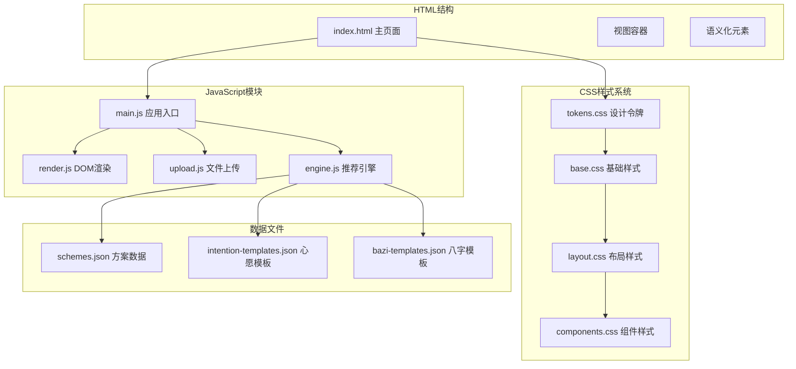
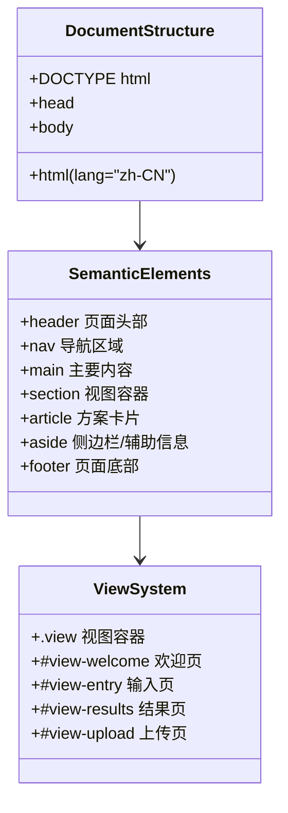
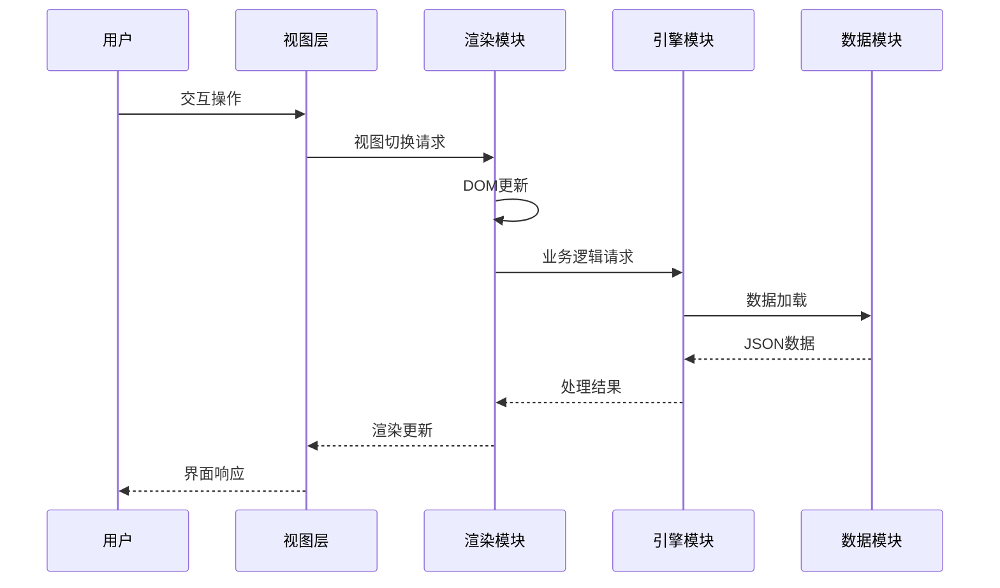
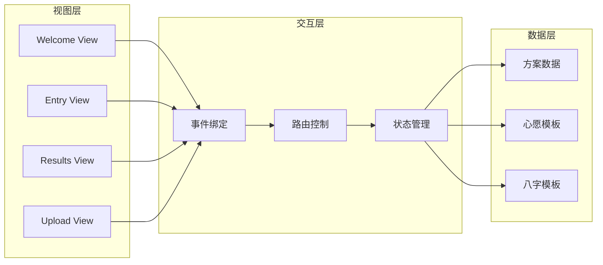
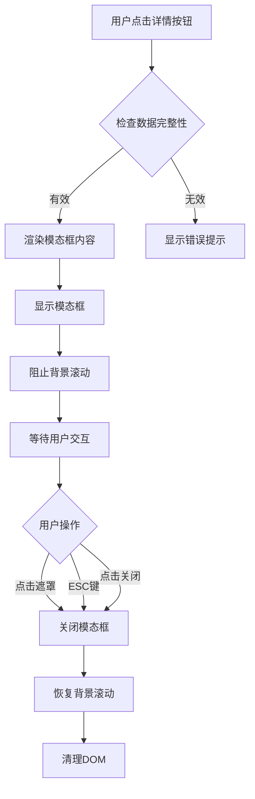
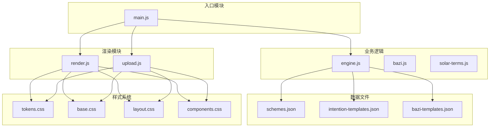
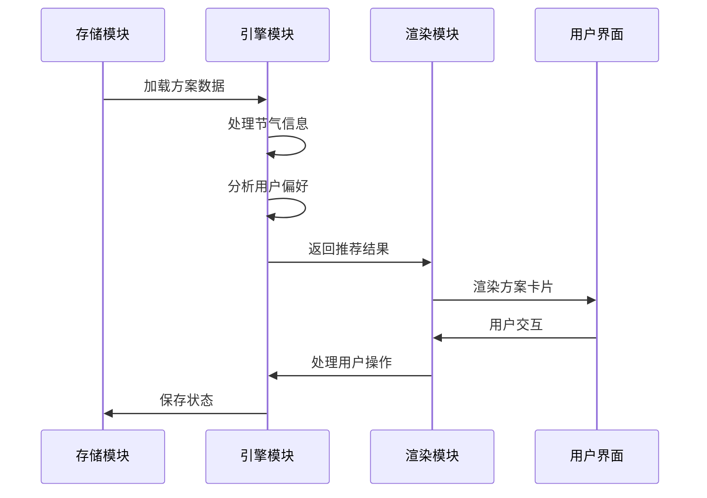

# HTML结构规范

<cite>
**本文档引用的文件**
- [index.html](file://index.html)
- [main.js](file://js/main.js)
- [render.js](file://js/render.js)
- [upload.js](file://js/upload.js)
- [engine.js](file://js/engine.js)
- [base.css](file://css/base.css)
- [layout.css](file://css/layout.css)
- [components.css](file://css/components.css)
- [tokens.css](file://css/tokens.css)
- [schemes.json](file://data/schemes.json)
- [intention-templates.json](file://data/intention-templates.json)
- [bazi-templates.json](file://data/bazi-templates.json)
</cite>

## 目录
1. [引言](#引言)
2. [项目结构](#项目结构)
3. [核心组件](#核心组件)
4. [架构概览](#架构概览)
5. [详细组件分析](#详细组件分析)
6. [依赖关系分析](#依赖关系分析)
7. [性能考虑](#性能考虑)
8. [故障排除指南](#故障排除指南)
9. [结论](#结论)

## 引言

本规范旨在为HTML结构编码建立完整、一致的标准，确保代码的可维护性、可访问性和跨浏览器兼容性。该规范基于实际项目代码分析，结合现代Web开发最佳实践，为开发者提供清晰的指导原则和实现参考。

## 项目结构

该项目采用模块化的前端架构，主要包含以下核心部分：

**图表来源**
- [index.html](file://index.html#L1-L236)
- [main.js](file://js/main.js#L1-L317)
- [engine.js](file://js/engine.js#L1-L335)

**章节来源**
- [index.html](file://index.html#L1-L236)
- [main.js](file://js/main.js#L1-L317)

## 核心组件

### 文档结构标准

项目严格遵循现代HTML5标准，包含完整的文档结构：

- **DOCTYPE声明**: 使用标准HTML5声明
- **语言设置**: `lang="zh-CN"`确保正确的国际化支持
- **字符编码**: UTF-8编码声明
- **视口配置**: 移动端优化的viewport设置
- **元数据**: SEO友好的标题和描述标签

### 语义化标签使用

项目广泛使用HTML5语义化元素，每个元素都有明确的职责分工：

**图表来源**
- [index.html](file://index.html#L20-L216)

**章节来源**
- [index.html](file://index.html#L20-L216)

## 架构概览

项目采用MVVM架构模式，通过模块化设计实现关注点分离：

**图表来源**
- [main.js](file://js/main.js#L72-L153)
- [render.js](file://js/render.js#L8-L16)
- [engine.js](file://js/engine.js#L268-L310)

### 组件关系图

**图表来源**
- [index.html](file://index.html#L24-L196)
- [main.js](file://js/main.js#L52-L153)

**章节来源**
- [main.js](file://js/main.js#L1-L317)
- [render.js](file://js/render.js#L1-L272)

## 详细组件分析

### 视图系统架构

项目采用多视图切换机制，每个视图都是独立的语义化容器：

#### 欢迎视图 (Welcome View)
- **容器**: `<section id="view-welcome" class="view">`
- **语义**: 使用`<section>`而非`
`体现内容重要性
- **可访问性**: 包含`aria-label`提供屏幕阅读器支持

#### 输入视图 (Entry View)
- **头部**: `<header class="entry-header">`包含返回按钮和标题
- **主体**: `
`组织表单元素
- **心愿选择**: 使用`role="radiogroup"`和`aria-label`实现ARIA支持

#### 结果视图 (Results View)
- **头部**: `<header class="results-header">`包含导航和标题
- **主体**: `
`包含方案卡片和操作按钮

#### 上传视图 (Upload View)
- **上传区域**: `
`支持点击和拖拽
- **预览功能**: 完整的图片预览和移除机制
- **反馈系统**: 支持用户反馈记录

**章节来源**
- [index.html](file://index.html#L24-L196)

### 表单元素规范

项目中的表单元素遵循严格的语义化和可访问性标准：

#### 标签关联
- 所有`<input>`元素都通过`<label>`进行关联
- 使用`for`属性与对应`id`建立关联
- 提供清晰的视觉和语义化标签

#### 输入类型选择
- 年份选择: `<select id="bazi-year">`
- 月份选择: `<select id="bazi-month">`
- 日期选择: `<select id="bazi-day">`
- 时辰选择: `<select id="bazi-hour">`

#### 验证属性使用
- 使用`hidden`属性隐藏原生文件输入
- JavaScript层面进行文件格式和大小验证
- 实时反馈用户操作结果

**章节来源**
- [index.html](file://index.html#L65-L118)
- [upload.js](file://js/upload.js#L12-L26)

### 可访问性实现

项目实现了全面的可访问性支持：

#### ARIA属性使用
- **角色定义**: `role="radiogroup"`用于心愿选择
- **标签支持**: `aria-label`为图标按钮提供替代文本
- **对话框**: `role="dialog"`和`aria-modal="true"`用于模态框
- **标题关联**: `aria-labelledby`关联模态框标题

#### 键盘导航支持
- **焦点管理**: 使用`:focus-visible`伪类提供可见焦点指示
- **键盘事件**: 支持Enter和Space键触发上传区域
- **ESC关闭**: 模态框支持ESC键快速关闭

#### 屏幕阅读器支持
- **语义化结构**: 正确使用HTML5语义化元素
- **替代文本**: 所有图标都包含`aria-label`
- **状态指示**: 通过CSS类名提供视觉状态反馈

**章节来源**
- [index.html](file://index.html#L24-L214)
- [base.css](file://css/base.css#L109-L125)
- [upload.js](file://js/upload.js#L98-L104)

### 数据属性和自定义属性

项目合理使用HTML5数据属性和自定义属性：

#### 数据属性使用
- **心愿标识**: `data-wish="career"`
- **索引标识**: `data-index="${index}"`
- **状态管理**: 通过`dataset`属性传递数据

#### 自定义属性命名
- **统一前缀**: `data-*`属性保持一致性
- **语义化命名**: 属性名直接反映数据含义
- **JavaScript交互**: 通过`dataset`属性进行DOM操作

**章节来源**
- [index.html](file://index.html#L53-L130)
- [render.js](file://js/render.js#L126-L135)

### 模态框系统

项目实现了完整的模态框交互系统：

**图表来源**
- [render.js](file://js/render.js#L159-L193)
- [render.js](file://js/render.js#L198-L215)

**章节来源**
- [render.js](file://js/render.js#L159-L215)

## 依赖关系分析

### 模块依赖图

**图表来源**
- [main.js](file://js/main.js#L5-L15)
- [engine.js](file://js/engine.js#L39-L79)

### 数据流分析

**图表来源**
- [engine.js](file://js/engine.js#L268-L310)
- [render.js](file://js/render.js#L114-L127)

**章节来源**
- [main.js](file://js/main.js#L5-L15)
- [engine.js](file://js/engine.js#L268-L335)

## 性能考虑

### 渐进增强策略

项目采用渐进增强的设计理念：

#### 基础功能
- **无JavaScript**: 页面仍可正常显示基础内容
- **降级处理**: JavaScript异常不影响核心功能
- **回退机制**: 关键功能具备备用实现

#### 高级特性
- **模块化加载**: 使用ES6模块按需加载
- **异步处理**: 大量数据采用异步加载
- **缓存策略**: 本地存储减少网络请求

#### 性能优化
- **懒加载**: 图片和数据采用延迟加载
- **虚拟滚动**: 大列表采用虚拟化技术
- **内存管理**: 及时清理DOM和事件监听器

### 跨浏览器兼容性

项目通过多种方式确保跨浏览器兼容性：

#### Polyfill策略
- **现代API**: 使用现代JavaScript特性但提供降级方案
- **CSS变量**: 通过CSS自定义属性实现主题系统
- **Flexbox**: 广泛使用flex布局，配合必要的前缀

#### 渐进增强
- **功能检测**: 通过能力检测决定特性启用
- **特性降级**: 复杂功能提供简化版本
- **回退方案**: 关键功能具备传统实现

**章节来源**
- [base.css](file://css/base.css#L12-L17)
- [layout.css](file://css/layout.css#L226-L251)

## 故障排除指南

### 常见问题诊断

#### 视图切换问题
- **症状**: 视图无法正常切换
- **原因**: 事件绑定失败或DOM元素不存在
- **解决方案**: 检查元素ID和事件绑定时机

#### 数据加载失败
- **症状**: 方案数据无法显示
- **原因**: JSON文件路径错误或网络问题
- **解决方案**: 验证文件路径和服务器配置

#### 可访问性问题
- **症状**: 屏幕阅读器无法正确读取内容
- **原因**: ARIA属性缺失或错误
- **解决方案**: 检查ARIA属性的完整性和正确性

#### 性能问题
- **症状**: 页面加载缓慢或卡顿
- **原因**: 大量DOM操作或内存泄漏
- **解决方案**: 优化渲染逻辑和内存管理

### 调试工具使用

#### 浏览器开发者工具
- **Elements面板**: 检查HTML结构和CSS样式
- **Console面板**: 查看JavaScript错误和警告
- **Network面板**: 监控资源加载和API调用
- **Performance面板**: 分析页面性能瓶颈

#### 可访问性测试
- **屏幕阅读器**: 使用NVDA或VoiceOver测试
- **键盘导航**: 验证完全的键盘操作支持
- **颜色对比度**: 检查颜色对比度是否符合WCAG标准

**章节来源**
- [main.js](file://js/main.js#L26-L67)
- [render.js](file://js/render.js#L242-L271)

## 结论

本HTML结构编码规范基于实际项目经验总结，涵盖了现代Web开发的核心要素。通过语义化标签的正确使用、严格的可访问性标准、完善的表单处理机制以及全面的跨浏览器兼容性考虑，为构建高质量的Web应用提供了完整的指导框架。

规范强调了以下关键原则：
- **语义化优先**: 使用合适的HTML5元素表达内容结构
- **可访问性第一**: 确保所有用户都能有效使用应用
- **渐进增强**: 在保证基础功能的同时提供高级特性
- **性能优化**: 通过合理的架构设计提升用户体验
- **跨平台兼容**: 确保在各种设备和浏览器上的稳定表现

这些原则不仅适用于当前项目，也为类似Web应用的开发提供了可复用的最佳实践指南。