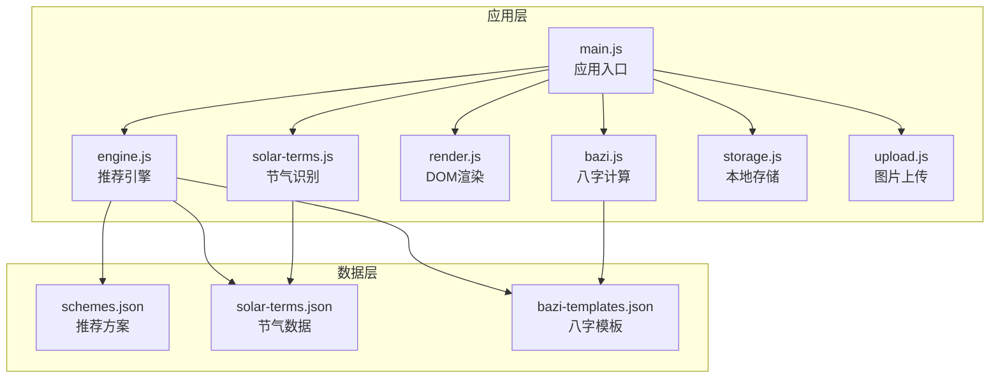
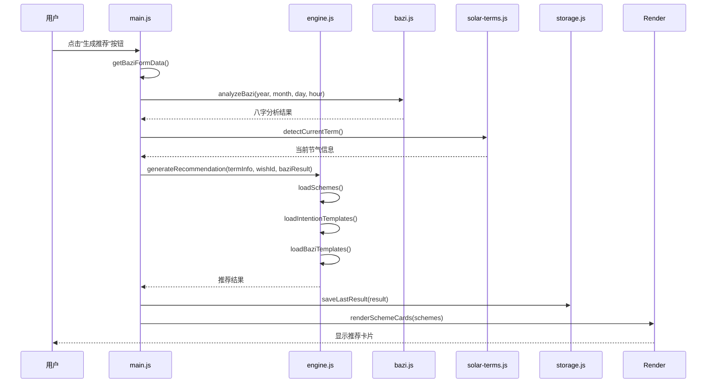
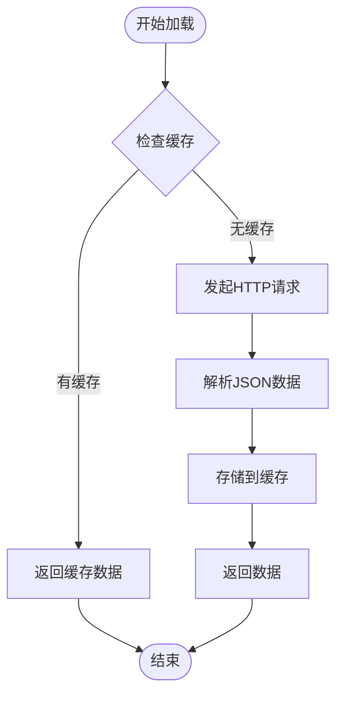
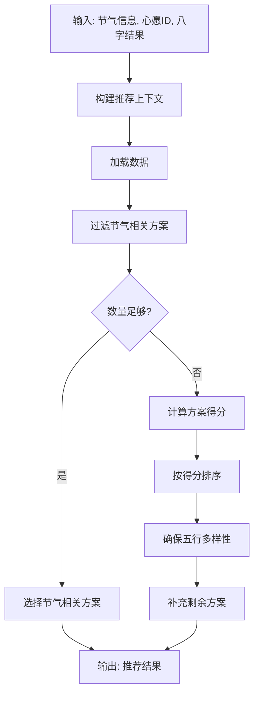
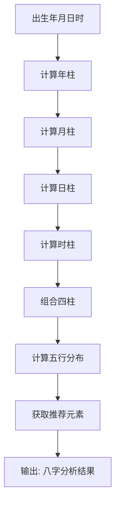
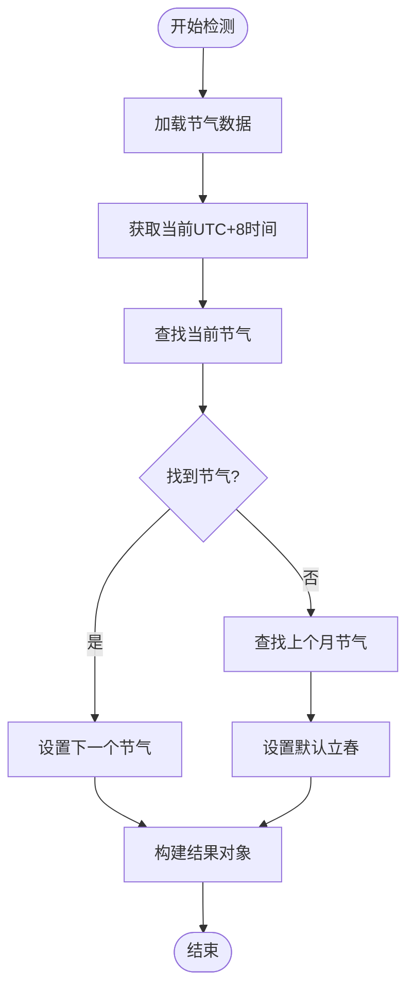
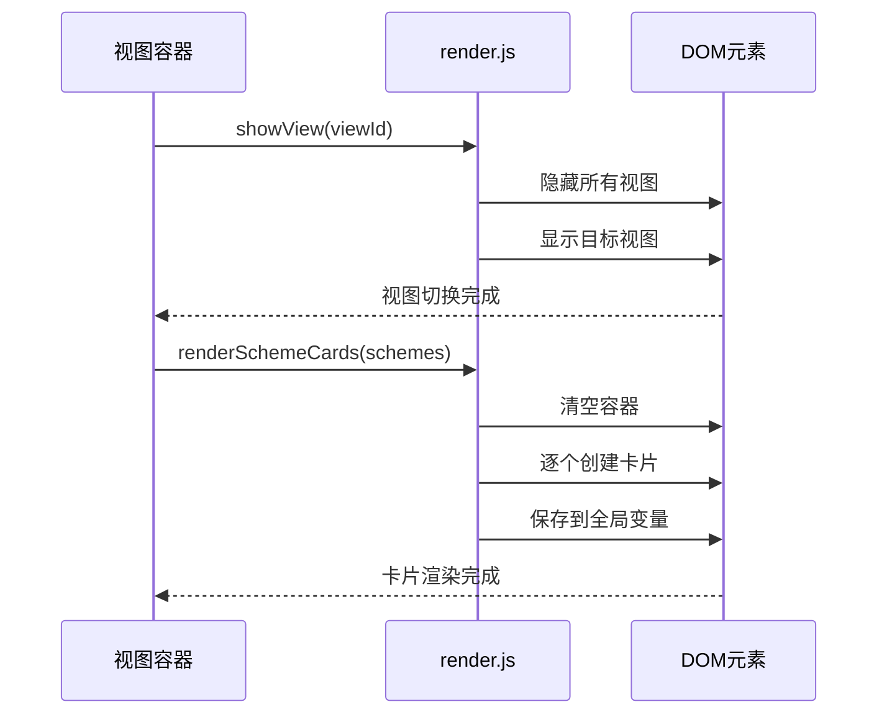
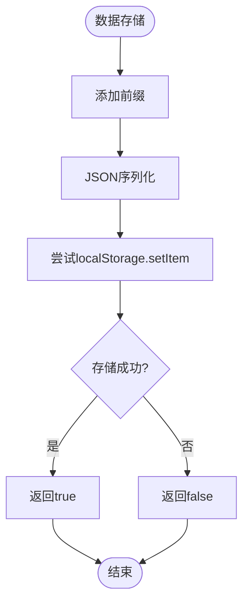
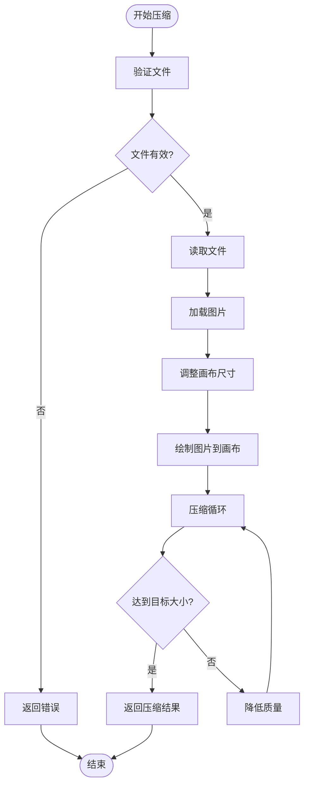
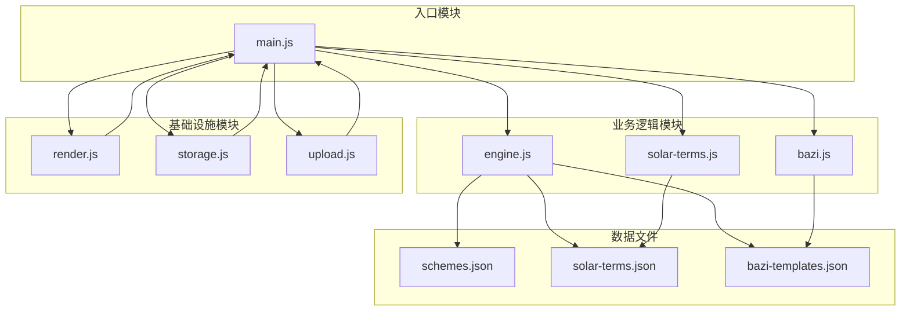

# JavaScript编码规范

<cite>
**本文档引用的文件**
- [main.js](file://js/main.js)
- [engine.js](file://js/engine.js)
- [bazi.js](file://js/bazi.js)
- [render.js](file://js/render.js)
- [solar-terms.js](file://js/solar-terms.js)
- [storage.js](file://js/storage.js)
- [upload.js](file://js/upload.js)
- [schemes.json](file://data/schemes.json)
- [solar-terms.json](file://data/solar-terms.json)
- [bazi-templates.json](file://data/bazi-templates.json)
</cite>

## 目录
1. [简介](#简介)
2. [项目结构](#项目结构)
3. [核心组件](#核心组件)
4. [架构概览](#架构概览)
5. [详细组件分析](#详细组件分析)
6. [依赖关系分析](#依赖关系分析)
7. [性能考虑](#性能考虑)
8. [故障排除指南](#故障排除指南)
9. [结论](#结论)

## 简介

本JavaScript编码规范文档旨在为"wuxing-fashion"项目建立统一的代码标准和最佳实践。该项目是一个基于中国传统文化五行理论的时尚推荐系统，通过分析用户的八字信息和当前节气，为用户提供个性化的服装搭配建议。

本规范涵盖了ES6+语法使用、模块系统、函数命名、变量声明、注释标准、错误处理、异步编程和性能优化等方面，确保代码的可读性、可维护性和一致性。

## 项目结构

项目采用模块化架构设计，主要分为以下层次：



**图表来源**
- [main.js](file://js/main.js#L1-L317)
- [engine.js](file://js/engine.js#L1-L335)
- [bazi.js](file://js/bazi.js#L1-L193)
- [render.js](file://js/render.js#L1-L272)
- [solar-terms.js](file://js/solar-terms.js#L1-L118)
- [storage.js](file://js/storage.js#L1-L116)
- [upload.js](file://js/upload.js#L1-L145)

**章节来源**
- [main.js](file://js/main.js#L1-L317)
- [engine.js](file://js/engine.js#L1-L335)

## 核心组件

### ES6+语法使用标准

#### 箭头函数
项目广泛使用箭头函数简化回调函数和方法定义：

```javascript
// 命名导出函数
export function showView(viewId) {
  // 实现逻辑
}

// 箭头函数用于事件监听器
document.getElementById('btn-generate')?.addEventListener('click', handleGenerate);

// 数组方法中的箭头函数
document.querySelectorAll('.wish-tag').forEach(tag => {
  tag.addEventListener('click', () => {
    const wishId = tag.dataset.wish;
    selectWish(wishId);
  });
});
```

#### 模板字符串
使用模板字符串进行字符串拼接和动态内容生成：

```javascript
// 模板字符串用于HTML构建
card.innerHTML = `
  <div class="scheme-color-bar" style="background-color: ${scheme.color.hex}"></div>
  <div class="scheme-keywords">
    <span class="scheme-keyword">${scheme.color.name}</span>
    <span class="scheme-keyword">${scheme.material}</span>
    <span class="scheme-keyword">${scheme.feeling}</span>
  </div>
`;

// 模板字符串用于日志输出
console.log('[App] Initializing...');
```

#### 解构赋值
充分利用解构赋值简化对象属性访问：

```javascript
// 函数参数解构
function getBaziFormData() {
  const year = document.getElementById('bazi-year')?.value;
  const month = document.getElementById('bazi-month')?.value;
  const day = document.getElementById('bazi-day')?.value;
  const hour = document.getElementById('bazi-hour')?.value;
  
  if (year && month && day && hour !== '') {
    return {
      year: parseInt(year, 10),
      month: parseInt(month, 10),
      day: parseInt(day, 10),
      hour: parseInt(hour, 10)
    };
  }
  
  return null;
}

// 对象解构
const { year, month, day, hour } = bazi;
```

#### 类声明
项目中使用类来封装相关的功能模块：

```javascript
// 使用类组织相关方法
class StorageManager {
  constructor() {
    this.prefix = 'wuxing_';
  }
  
  get(key) {
    // 实现逻辑
  }
  
  set(key, value) {
    // 实现逻辑
  }
}
```

#### 模块系统
严格使用ES6模块系统进行代码组织：

```javascript
// 默认导出
export default function init() {
  // 初始化逻辑
}

// 命名导出
export function generateRecommendation(termInfo, wishId, baziResult) {
  // 生成推荐逻辑
}

// 导入语法
import * as storage from './storage.js';
import { detectCurrentTerm, getWuxingColor } from './solar-terms.js';
import { analyzeBazi } from './bazi.js';
import { generateRecommendation, regenerateRecommendation } from './engine.js';
```

**章节来源**
- [main.js](file://js/main.js#L1-L317)
- [engine.js](file://js/engine.js#L1-L335)
- [bazi.js](file://js/bazi.js#L1-L193)
- [render.js](file://js/render.js#L1-L272)
- [solar-terms.js](file://js/solar-terms.js#L1-L118)
- [storage.js](file://js/storage.js#L1-L116)
- [upload.js](file://js/upload.js#L1-L145)

## 架构概览

项目采用分层架构设计，各模块职责明确，耦合度低：



**图表来源**
- [main.js](file://js/main.js#L202-L244)
- [engine.js](file://js/engine.js#L268-L310)
- [bazi.js](file://js/bazi.js#L182-L192)
- [solar-terms.js](file://js/solar-terms.js#L36-L103)

## 详细组件分析

### 推荐引擎模块 (engine.js)

推荐引擎是整个系统的核心，负责根据用户信息和当前节气生成个性化推荐：

#### 数据加载机制


**图表来源**
- [engine.js](file://js/engine.js#L39-L49)
- [engine.js](file://js/engine.js#L54-L64)
- [engine.js](file://js/engine.js#L69-L79)

#### 推荐算法流程


**图表来源**
- [engine.js](file://js/engine.js#L268-L310)
- [engine.js](file://js/engine.js#L218-L259)

**章节来源**
- [engine.js](file://js/engine.js#L1-L335)

### 八字计算模块 (bazi.js)

八字计算模块实现了传统的四柱八字分析算法：

#### 五行计算流程


**图表来源**
- [bazi.js](file://js/bazi.js#L111-L124)
- [bazi.js](file://js/bazi.js#L129-L172)

**章节来源**
- [bazi.js](file://js/bazi.js#L1-L193)

### 节气识别模块 (solar-terms.js)

节气识别模块负责确定当前的二十四节气：

#### 节气检测算法


**图表来源**
- [solar-terms.js](file://js/solar-terms.js#L36-L103)

**章节来源**
- [solar-terms.js](file://js/solar-terms.js#L1-L118)

### DOM渲染模块 (render.js)

渲染模块负责将数据转换为用户界面：

#### 视图切换机制


**图表来源**
- [render.js](file://js/render.js#L8-L16)
- [render.js](file://js/render.js#L114-L127)

**章节来源**
- [render.js](file://js/render.js#L1-L272)

### 本地存储模块 (storage.js)

存储模块提供了统一的本地数据管理接口：

#### 数据存储策略


**图表来源**
- [storage.js](file://js/storage.js#L7-L23)

**章节来源**
- [storage.js](file://js/storage.js#L1-L116)

### 图片上传模块 (upload.js)

上传模块处理图片验证、压缩和拖拽上传功能：

#### 图片压缩流程


**图表来源**
- [upload.js](file://js/upload.js#L31-L82)

**章节来源**
- [upload.js](file://js/upload.js#L1-L145)

## 依赖关系分析

项目模块间的依赖关系清晰明确，遵循单一职责原则：



**图表来源**
- [main.js](file://js/main.js#L5-L15)
- [engine.js](file://js/engine.js#L268-L310)
- [solar-terms.js](file://js/solar-terms.js#L36-L103)

**章节来源**
- [main.js](file://js/main.js#L1-L317)

## 性能考虑

### 异步操作优化

项目大量使用Promise和async/await模式，确保异步操作的高效执行：

```javascript
// 并行加载多个数据源
const [schemes, intentions, baziTemplates] = await Promise.all([
  loadSchemes(),
  loadIntentionTemplates(),
  loadBaziTemplates()
]);

// 批量DOM操作优化
container.innerHTML = '';
schemes.forEach((scheme, index) => {
  const card = createSchemeCard(scheme, index);
  container.appendChild(card);
});
```

### 内存管理

```javascript
// 及时清理事件监听器
document.removeEventListener('keydown', handleKeyDown);

// 合理使用全局变量
window.__currentSchemes = schemes; // 仅在必要时使用
```

### 缓存策略

```javascript
// 数据缓存机制
let schemesData = null;
let termsData = null;

async function loadSchemes() {
  if (schemesData) return schemesData; // 直接返回缓存
  // ... 加载逻辑
}
```

## 故障排除指南

### 常见错误类型及解决方案

#### 模块导入错误
**问题**: `Cannot find module './solar-terms.js'`
**解决方案**: 确保相对路径正确，文件扩展名完整

#### 异步操作错误
**问题**: `TypeError: Cannot read property 'current' of null`
**解决方案**: 添加适当的错误检查和默认值

#### DOM操作错误
**问题**: `Cannot set property 'textContent' of null`
**解决方案**: 在操作前检查元素是否存在

#### 数据格式错误
**问题**: `Unexpected token < in JSON at position 0`
**解决方案**: 检查网络请求是否返回正确的JSON格式

**章节来源**
- [main.js](file://js/main.js#L282-L292)
- [engine.js](file://js/engine.js#L42-L48)

## 结论

本JavaScript编码规范文档为"wuxing-fashion"项目建立了完整的代码标准和最佳实践指南。通过遵循这些规范，可以确保：

1. **代码一致性**: 统一的ES6+语法使用和模块组织方式
2. **可维护性**: 清晰的模块边界和职责分离
3. **可读性**: 标准化的注释格式和命名约定
4. **性能**: 优化的异步操作和内存管理策略
5. **可靠性**: 完善的错误处理和调试机制

建议团队成员在开发过程中严格遵守这些规范，并根据项目发展情况定期更新和完善编码标准。