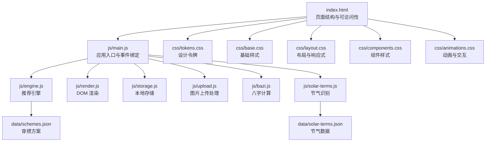
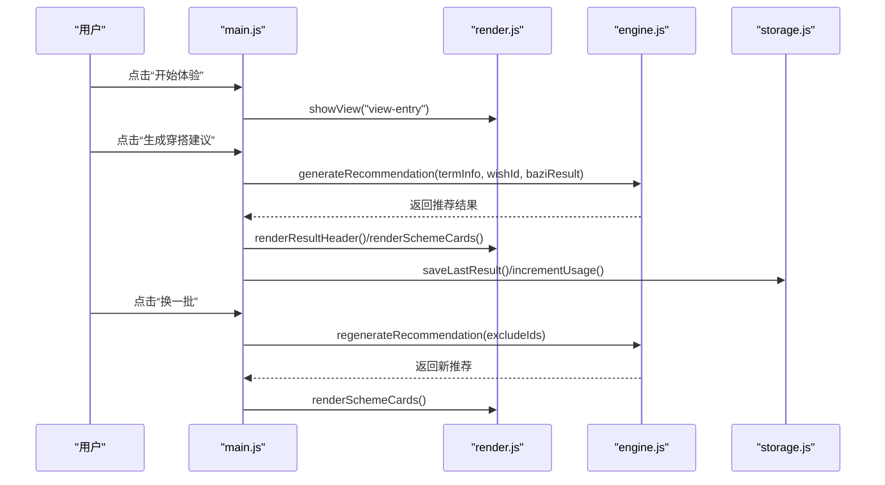
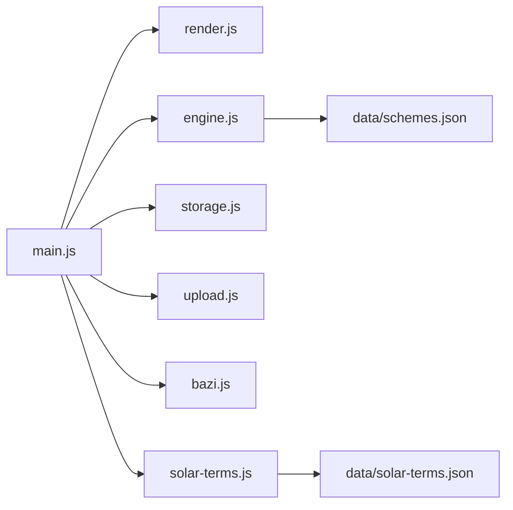

# 代码规范

<cite>
**本文引用的文件**
- [index.html](file://index.html)
- [main.js](file://js/main.js)
- [engine.js](file://js/engine.js)
- [render.js](file://js/render.js)
- [storage.js](file://js/storage.js)
- [upload.js](file://js/upload.js)
- [bazi.js](file://js/bazi.js)
- [solar-terms.js](file://js/solar-terms.js)
- [base.css](file://css/base.css)
- [tokens.css](file://css/tokens.css)
- [layout.css](file://css/layout.css)
- [components.css](file://css/components.css)
- [animations.css](file://css/animations.css)
- [schemes.json](file://data/schemes.json)
- [solar-terms.json](file://data/solar-terms.json)
</cite>

## 目录
1. [引言](#引言)
2. [项目结构](#项目结构)
3. [核心组件](#核心组件)
4. [架构总览](#架构总览)
5. [详细组件分析](#详细组件分析)
6. [依赖分析](#依赖分析)
7. [性能考虑](#性能考虑)
8. [故障排查指南](#故障排查指南)
9. [结论](#结论)
10. [附录](#附录)

## 引言
本规范面向“五行穿搭建议”项目，旨在统一前端代码风格与实现约定，涵盖 JavaScript 编码规范、CSS 样式规范、HTML 结构规范、代码格式化与 ESLint 规则、Prettier 配置以及 Git 提交信息规范。文档同时提供代码审查检查清单与最佳实践示例，确保团队协作的一致性与可维护性。

## 项目结构
项目采用“功能模块 + 分层样式”的组织方式：
- HTML：单一入口页面，定义视图容器与可访问性属性。
- JS：按功能拆分为入口、引擎、渲染、存储、上传、八字、节气等模块，均使用 ES6+ 模块化与命名导出。
- CSS：按设计令牌、基础、布局、组件、动画分层组织，配合媒体查询实现响应式。
- 数据：JSON 文件提供节气、方案、模板等静态数据。

**图表来源**
- [index.html](file://index.html#L1-L236)
- [main.js](file://js/main.js#L1-L317)
- [engine.js](file://js/engine.js#L1-L335)
- [render.js](file://js/render.js#L1-L272)
- [storage.js](file://js/storage.js#L1-L116)
- [upload.js](file://js/upload.js#L1-L145)
- [bazi.js](file://js/bazi.js#L1-L193)
- [solar-terms.js](file://js/solar-terms.js#L1-L118)
- [base.css](file://css/base.css#L1-L168)
- [tokens.css](file://css/tokens.css#L1-L109)
- [layout.css](file://css/layout.css#L1-L252)
- [components.css](file://css/components.css#L1-L338)
- [animations.css](file://css/animations.css#L1-L207)
- [schemes.json](file://data/schemes.json#L1-L200)
- [solar-terms.json](file://data/solar-terms.json#L1-L42)

**章节来源**
- [index.html](file://index.html#L1-L236)
- [main.js](file://js/main.js#L1-L317)
- [base.css](file://css/base.css#L1-L168)
- [tokens.css](file://css/tokens.css#L1-L109)
- [layout.css](file://css/layout.css#L1-L252)
- [components.css](file://css/components.css#L1-L338)
- [animations.css](file://css/animations.css#L1-L207)
- [schemes.json](file://data/schemes.json#L1-L200)
- [solar-terms.json](file://data/solar-terms.json#L1-L42)

## 核心组件
- 应用入口模块负责初始化、事件绑定、视图切换与业务流程编排。
- 推荐引擎模块负责加载数据、构建上下文、评分与筛选方案。
- 渲染模块负责视图切换、卡片渲染、模态框与 Toast 提示。
- 存储模块负责本地持久化与统计计数。
- 上传模块负责文件校验、压缩、拖拽与键盘支持。
- 八字模块负责简化版八字计算与五行分析。
- 节气模块负责 UTC+8 时间转换、节气识别与五行颜色映射。

**章节来源**
- [main.js](file://js/main.js#L1-L317)
- [engine.js](file://js/engine.js#L1-L335)
- [render.js](file://js/render.js#L1-L272)
- [storage.js](file://js/storage.js#L1-L116)
- [upload.js](file://js/upload.js#L1-L145)
- [bazi.js](file://js/bazi.js#L1-L193)
- [solar-terms.js](file://js/solar-terms.js#L1-L118)

## 架构总览
应用采用“模块化 + 分层样式”的架构：
- 前端模块通过 ES6 模块导入导出进行解耦。
- 样式通过设计令牌集中管理，布局与组件分离，动画独立组织。
- 数据通过 JSON 文件提供，引擎异步加载并并行处理。

**图表来源**
- [main.js](file://js/main.js#L72-L244)
- [render.js](file://js/render.js#L8-L127)
- [engine.js](file://js/engine.js#L268-L310)
- [storage.js](file://js/storage.js#L60-L99)

## 详细组件分析

### JavaScript 编码规范
- ES6+ 语法与模块化
  - 使用 import/export 导入导出，避免全局污染。
  - 使用 Promise/async-await 处理异步，避免回调地狱。
  - 使用解构赋值、模板字符串、箭头函数提升可读性。
- 函数命名与变量声明
  - 函数命名采用动词短语，如 handleGenerate、showView、calcBazi。
  - 变量使用小驼峰，常量使用全大写蛇形，私有成员以下划线前缀。
  - 使用 const/let 替代 var，减少作用域问题。
- 注释标准
  - 模块顶部添加多行注释说明职责。
  - 导出函数添加简要注释，复杂逻辑添加行内注释。
  - TODO/FIXME 使用统一标记并在后续跟进。
- 错误处理
  - fetch 请求捕获异常并记录日志。
  - 输入校验失败时返回明确错误信息并提示用户。
- 事件绑定与解绑
  - 统一在 init 中绑定事件，避免重复绑定。
  - 页面切换时注意清理定时器与事件监听。

**章节来源**
- [main.js](file://js/main.js#L1-L317)
- [engine.js](file://js/engine.js#L1-L335)
- [render.js](file://js/render.js#L1-L272)
- [storage.js](file://js/storage.js#L1-L116)
- [upload.js](file://js/upload.js#L1-L145)
- [bazi.js](file://js/bazi.js#L1-L193)
- [solar-terms.js](file://js/solar-terms.js#L1-L118)

### CSS 样式规范
- 类名命名约定
  - 采用功能型命名，如 .btn、.scheme-card、.modal-content。
  - 组件类与修饰类分离，避免深层嵌套。
- 选择器使用规范
  - 优先使用类选择器，避免 ID 选择器滥用。
  - 通用选择器与后代选择器谨慎使用，避免性能问题。
- CSS 变量命名
  - 设计令牌以 --color-*、--font-*、--text-*、--space-*、--radius-*、--shadow-*、--duration-*、--z-* 统一命名。
  - 在 :root 中集中定义，便于主题与可访问性控制。
- 媒体查询组织方式
  - 在 layout.css 中按移动优先策略组织断点。
  - 使用相对单位与弹性布局，保证在不同屏幕下良好表现。

**章节来源**
- [tokens.css](file://css/tokens.css#L1-L109)
- [base.css](file://css/base.css#L1-L168)
- [layout.css](file://css/layout.css#L1-L252)
- [components.css](file://css/components.css#L1-L338)
- [animations.css](file://css/animations.css#L1-L207)

### HTML 结构规范
- 语义化标签使用
  - 使用 section、header、main、footer 等语义化元素划分页面结构。
  - 使用 button 替代 a 标签进行交互，避免不必要的链接语义。
- 属性命名约定
  - 自定义属性使用 data-* 前缀，如 data-wish、data-index。
  - 可访问性属性 aria-* 与 role 完整覆盖交互元素。
- 可访问性要求
  - 所有交互元素具备 :focus-visible 样式。
  - 图片与图标提供替代文本或标题。
  - 对话框使用 role="dialog"、aria-modal="true" 与 aria-labelledby。

**章节来源**
- [index.html](file://index.html#L1-L236)
- [base.css](file://css/base.css#L109-L125)

### 代码格式化与 ESLint 规则
- Prettier 配置
  - 使用默认规则，统一缩进、引号、分号与行尾。
  - 与 ESLint 配合，确保格式与风格一致。
- ESLint 规则建议
  - 启用 eslintrc-browser 与 import 插件。
  - 规则包括：no-var、prefer-const、no-unused-vars、no-console（开发环境允许）、import/order（模块导入顺序）。
  - 禁止使用 eval、with 等危险 API。
- Git 提交信息规范
  - 类型：feat、fix、docs、style、refactor、perf、test、build、ci、chore、revert。
  - 格式：type(scope): subject，subject 首字母小写，不超过 50 字。
  - 示例：feat(js): 添加上传模块的拖拽支持。

[本节为通用规范建议，无需列出具体文件来源]

### 代码审查检查清单
- JavaScript
  - 是否使用 ES6+ 语法与模块化？
  - 是否存在全局变量与未声明变量？
  - 是否处理了异步错误与边界条件？
  - 是否使用了可访问性友好的事件与属性？
- CSS
  - 是否使用设计令牌而非硬编码值？
  - 是否遵循 BEM 或功能型命名？
  - 是否在移动端与高对比度模式下可用？
- HTML
  - 是否使用语义化标签与正确的 aria 属性？
  - 是否包含必要的可访问性属性与替代文本？
- 性能
  - 是否避免了不必要的重绘与回流？
  - 是否使用了懒加载与合理的缓存策略？

[本节为通用规范建议，无需列出具体文件来源]

## 依赖分析
模块间依赖关系清晰，遵循“自顶向下”的调用链与“横向解耦”的设计原则。

**图表来源**
- [main.js](file://js/main.js#L5-L15)
- [engine.js](file://js/engine.js#L39-L79)
- [solar-terms.js](file://js/solar-terms.js#L18-L29)
- [schemes.json](file://data/schemes.json#L1-L200)
- [solar-terms.json](file://data/solar-terms.json#L1-L42)

**章节来源**
- [main.js](file://js/main.js#L5-L15)
- [engine.js](file://js/engine.js#L39-L79)
- [solar-terms.js](file://js/solar-terms.js#L18-L29)

## 性能考虑
- 资源加载
  - 使用 type="module" 的脚本按需加载，避免阻塞渲染。
  - 图片上传前进行压缩，降低带宽与存储压力。
- DOM 操作
  - 批量更新 DOM，减少重排与重绘。
  - 使用 requestAnimationFrame 控制动画帧。
- 缓存策略
  - 本地存储使用前缀隔离，避免冲突。
  - 推荐结果与用户偏好缓存于 localStorage，减少重复计算。

[本节提供通用指导，无需列出具体文件来源]

## 故障排查指南
- 常见问题
  - 生成失败：检查网络请求与 JSON 数据加载是否成功。
  - 视图不切换：确认 showView 的参数与 DOM ID 一致。
  - 上传失败：检查文件类型、大小限制与压缩逻辑。
  - 可访问性异常：核对 aria-* 属性与键盘事件绑定。
- 日志与调试
  - 在开发阶段保留 console 输出，生产环境移除或降级。
  - 使用浏览器开发者工具检查样式与事件绑定。

**章节来源**
- [main.js](file://js/main.js#L202-L244)
- [render.js](file://js/render.js#L242-L271)
- [upload.js](file://js/upload.js#L12-L26)

## 结论
通过统一的 JavaScript 编码规范、CSS 设计令牌与 HTML 可访问性约定，结合 Prettier 与 ESLint 的自动化工具链，以及明确的 Git 提交规范与代码审查清单，团队可以高效协作并保持代码质量与一致性。建议在持续集成中加入格式化与静态检查步骤，确保规范落地执行。

[本节为总结性内容，无需列出具体文件来源]

## 附录
- 最佳实践示例
  - 模块导出：使用命名导出与默认导出区分清晰职责。
  - 渲染优化：卡片列表使用 stagger 动画，避免一次性渲染大量节点。
  - 存储封装：统一键名前缀与序列化方式，提供批量操作方法。
  - 可访问性：为每个交互元素提供 aria-label 或 aria-labelledby，支持键盘操作。

[本节为通用指导，无需列出具体文件来源]