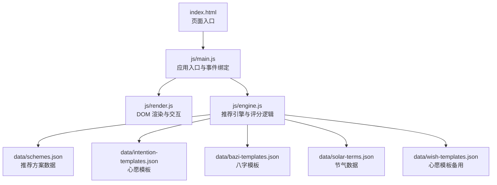
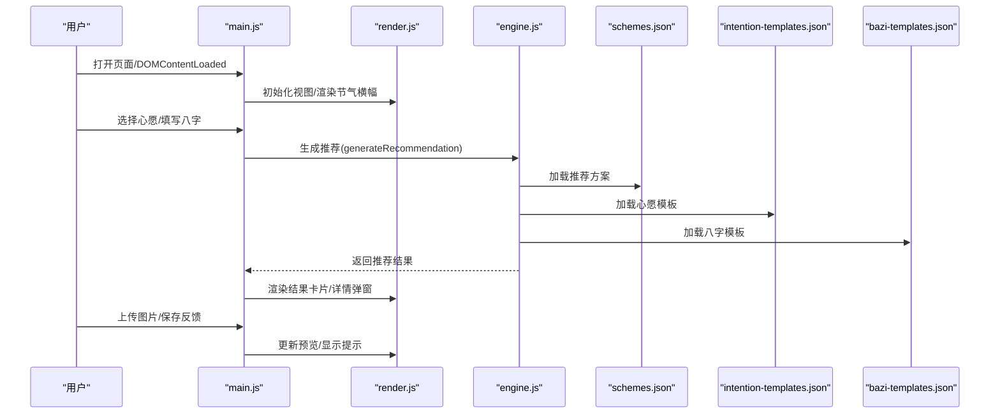
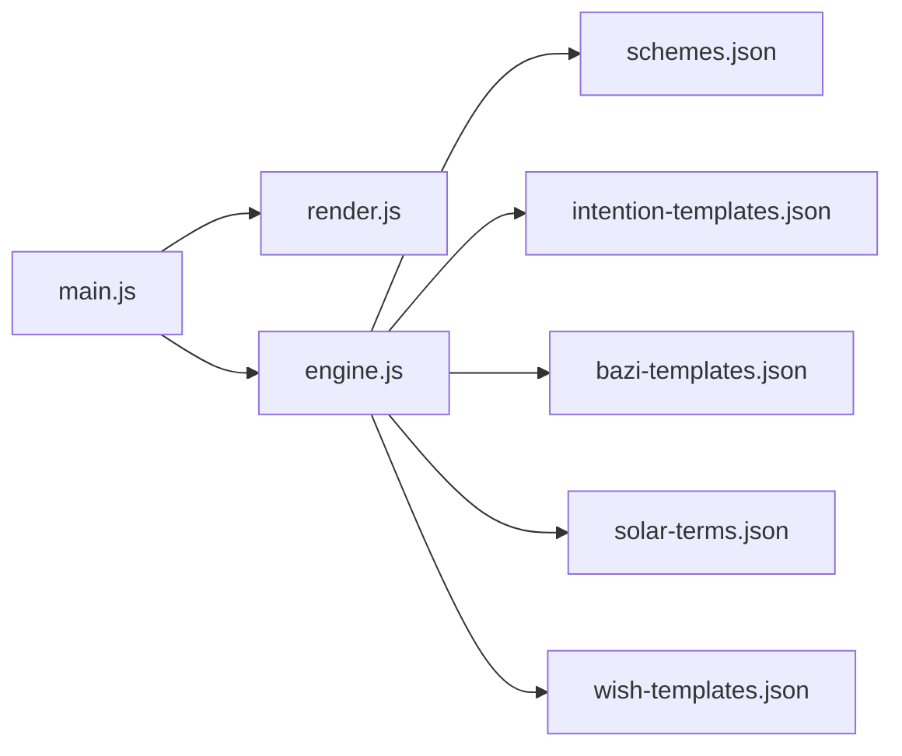

# 开发工具配置

<cite>
**本文引用的文件**
- [index.html](file://index.html)
- [main.js](file://js/main.js)
- [engine.js](file://js/engine.js)
- [render.js](file://js/render.js)
- [schemes.json](file://data/schemes.json)
- [intention-templates.json](file://data/intention-templates.json)
- [bazi-templates.json](file://data/bazi-templates.json)
- [solar-terms.json](file://data/solar-terms.json)
- [wish-templates.json](file://data/wish-templates.json)
</cite>

## 目录
1. [简介](#简介)
2. [项目结构](#项目结构)
3. [核心组件](#核心组件)
4. [架构总览](#架构总览)
5. [详细组件分析](#详细组件分析)
6. [依赖分析](#依赖分析)
7. [性能考虑](#性能考虑)
8. [故障排查指南](#故障排查指南)
9. [结论](#结论)
10. [附录](#附录)

## 简介
本文件面向前端与全栈开发者，系统性梳理本项目的开发工具配置与最佳实践，覆盖以下主题：
- Prettier 代码格式化：配置文件设置、编辑器集成与命令行使用
- ESLint 代码质量检查：规则配置、插件安装与自定义规则定义
- Git 提交信息规范：Conventional Commits 格式、提交模板与分支命名约定
- 代码审查工具：Pull Request 模板、审查清单与自动化检查配置
- 调试工具配置：浏览器开发者工具、远程调试与性能分析
- 版本控制最佳实践：分支策略、合并流程与发布管理
- 持续集成：自动化测试、覆盖率检查与部署流水线

说明：本仓库为纯前端静态站点，未发现现有 ESLint、Prettier 或 CI 配置文件；本文提供通用且可落地的配置建议与实施步骤，便于快速落地。

## 项目结构
项目采用“页面 + 模块化脚本 + 数据资源”的组织方式：
- 页面入口：index.html
- 功能模块：js 目录下按职责拆分（入口 main.js、渲染 render.js、业务引擎 engine.js）
- 数据资源：data 目录下以 JSON 存放推荐方案、模板与节气等数据

图表来源
- [index.html](file://index.html#L1-L236)
- [main.js](file://js/main.js#L1-L317)
- [engine.js](file://js/engine.js#L1-L335)
- [render.js](file://js/render.js#L1-L272)
- [schemes.json](file://data/schemes.json)
- [intention-templates.json](file://data/intention-templates.json)
- [bazi-templates.json](file://data/bazi-templates.json)
- [solar-terms.json](file://data/solar-terms.json)
- [wish-templates.json](file://data/wish-templates.json)

章节来源
- [index.html](file://index.html#L1-L236)
- [main.js](file://js/main.js#L1-L317)
- [engine.js](file://js/engine.js#L1-L335)
- [render.js](file://js/render.js#L1-L272)

## 核心组件
- 应用入口与生命周期：负责初始化、恢复用户状态、绑定事件、处理上传与反馈等
- 渲染模块：统一管理视图切换、卡片渲染、模态框与 Toast 提示
- 推荐引擎：加载数据、构建上下文、评分与筛选推荐方案
- 数据层：JSON 资源作为推荐与模板的数据源

章节来源
- [main.js](file://js/main.js#L26-L67)
- [render.js](file://js/render.js#L8-L17)
- [engine.js](file://js/engine.js#L39-L79)

## 架构总览
从用户交互到数据驱动的完整流程如下：

图表来源
- [main.js](file://js/main.js#L202-L244)
- [engine.js](file://js/engine.js#L268-L310)
- [render.js](file://js/render.js#L114-L127)
- [schemes.json](file://data/schemes.json)
- [intention-templates.json](file://data/intention-templates.json)
- [bazi-templates.json](file://data/bazi-templates.json)

## 详细组件分析

### Prettier 代码格式化配置
目标：统一代码风格，减少团队分歧，提升可读性与协作效率。

- 配置文件设置
  - 在项目根目录创建配置文件，启用自动格式化与严格模式，确保一致的缩进、引号与换行策略
  - 建议忽略 node_modules、dist、打包产物与第三方依赖目录
  - 与编辑器联动，保存即格式化

- 编辑器集成
  - VS Code：安装官方 Prettier 扩展，设置默认格式化程序为 Prettier
  - WebStorm/IDEA：启用 Prettier 插件，配置保存时自动格式化
  - Sublime Text/Atom：安装对应插件并在保存时触发格式化

- 命令行使用
  - 格式化全部文件：执行格式化命令，对所有受控文件进行批量修复
  - 预检模式：仅报告问题而不修改文件，便于 CI 中使用

- 与现有代码的适配
  - 当前项目为纯前端静态站点，未发现现有 Prettier 配置；建议新增配置后立即运行格式化，确保与现有代码风格一致

章节来源
- [main.js](file://js/main.js#L1-L317)
- [engine.js](file://js/engine.js#L1-L335)
- [render.js](file://js/render.js#L1-L272)

### ESLint 代码质量检查
目标：在开发阶段发现潜在问题，统一代码规范，降低缺陷率。

- 规则配置
  - 基础规则：禁用 console、debugger；要求必要的注释与类型标注
  - ECMAScript 与模块：启用 ES6+ 语法与模块导入导出校验
  - 浏览器环境：启用浏览器全局变量与事件监听等校验
  - HTML/JS 协同：对内联脚本与事件属性进行约束

- 插件安装
  - 安装基础插件与浏览器环境插件，确保对现代前端生态的全面覆盖
  - 可选：安装与 Prettier 的集成插件，避免格式化冲突

- 自定义规则定义
  - 对于项目特定的命名约定（如常量命名、函数命名），可在规则中显式声明
  - 对重复代码与复杂度阈值进行限制，保障可维护性

- 与现有代码的适配
  - 当前项目未包含 ESLint 配置；建议先以宽松规则运行，逐步收敛历史问题，再收紧规则

章节来源
- [main.js](file://js/main.js#L1-L317)
- [engine.js](file://js/engine.js#L1-L335)
- [render.js](file://js/render.js#L1-L272)

### Git 提交信息规范
目标：标准化提交信息，便于追溯、自动化生成变更日志与版本发布。

- Conventional Commits 格式
  - 类型：feat、fix、docs、style、refactor、perf、test、build、ci、chore、revert
  - 结构：type(scope): subject
  - 示例：feat(engine): 支持按节气权重调整推荐算法

- 提交消息模板
  - 使用模板引导描述问题、动机与影响范围，避免模糊表述
  - 在 CI 中校验提交信息是否符合规范

- 分支命名约定
  - 功能分支：feature/xxx
  - 修复分支：fix/xxx
  - 发布分支：release/vX.Y.Z
  - 热修复：hotfix/xxx

- 与现有代码的适配
  - 本仓库未发现提交模板或钩子；建议引入工具（如 commitlint、husky）实现规范化与自动化校验

章节来源
- [engine.js](file://js/engine.js#L178-L199)

### 代码审查工具
目标：通过 PR 模板与清单，提升代码质量与知识传递。

- GitHub Pull Request 模板
  - 模板字段：变更摘要、问题背景、改动说明、测试验证、风险评估、影响范围
  - 强制填写项：变更类型、是否破坏兼容、是否需要发布说明

- 代码审查清单
  - 代码层面：可读性、复杂度、边界条件、错误处理
  - 质量层面：单元测试覆盖、性能影响、安全风险
  - 文档层面：注释更新、README 补充、变更日志

- 自动化检查配置
  - ESLint 与 Prettier 在 PR 中自动执行
  - 可选：添加依赖扫描、安全检查与可访问性检测

章节来源
- [main.js](file://js/main.js#L202-L244)
- [engine.js](file://js/engine.js#L268-L310)
- [render.js](file://js/render.js#L114-L127)

### 调试工具配置
目标：提升调试效率，定位性能瓶颈与交互问题。

- 浏览器开发者工具
  - Elements：检查 DOM 结构与样式，验证渲染正确性
  - Console：查看日志与错误，定位异步流程问题
  - Network：监控数据请求与资源加载，优化首屏与缓存
  - Performance/Profiler：分析长任务与重排重绘，识别性能热点

- 远程调试设置
  - 移动端：通过 USB 或 Wi-Fi 连接真机，使用浏览器远程调试
  - 服务端：通过代理或内网穿透暴露本地服务，便于联调

- 性能分析工具
  - Lighthouse：自动化审计页面性能、可访问性与最佳实践
  - WebPageTest：跨地区与多网络条件下的性能对比
  - 自定义指标：首屏时间、交互延迟、内存占用

章节来源
- [index.html](file://index.html#L1-L236)
- [render.js](file://js/render.js#L242-L272)

### 版本控制最佳实践
目标：稳定演进与可回溯的版本管理。

- 分支策略
  - 主干保护：master/main 仅允许受控合并
  - 功能隔离：feature/* 从主干切出，完成后合并回主干
  - 发布准备：release/* 用于预发布与回归测试
  - 热修复：hotfix/* 从发布标签切出，修复后同时合并回主干与发布分支

- 合并流程
  - 强制 PR：所有变更必须通过 PR 并至少一次审查
  - 线性历史：优先 rebase 保持线性，必要时允许 fast-forward
  - 标签与注释：为每个版本打标签并附带变更摘要

- 发布管理
  - 语义化版本：依据功能与破坏性变更决定主/次/补丁版本
  - 自动化发布：结合 CI 实现版本号生成、标签推送与制品发布

章节来源
- [engine.js](file://js/engine.js#L268-L310)

### 持续集成配置
目标：自动化测试、覆盖率与部署流水线，保障交付质量。

- 自动化测试
  - 单元测试：针对核心函数（如评分、距离计算）编写测试用例
  - 端到端测试：验证关键用户路径（输入、生成、渲染、上传）

- 代码覆盖率检查
  - 配置最小覆盖率阈值，阻断低于阈值的合并
  - 报告生成与可视化，持续追踪覆盖率趋势

- 部署流水线
  - 构建：压缩资源、注入版本信息、生成指纹
  - 部署：推送到静态托管平台或内部 CDN
  - 回滚：支持一键回滚至上一稳定版本

- 与现有代码的适配
  - 本仓库未包含 CI 配置；建议在 CI 中集成 ESLint、Prettier、测试与覆盖率检查

章节来源
- [engine.js](file://js/engine.js#L84-L99)
- [engine.js](file://js/engine.js#L218-L259)

## 依赖分析
- 模块耦合
  - main.js 作为入口，协调 render.js 与 engine.js，承担事件与状态管理
  - engine.js 依赖 data 目录下的 JSON 资源，形成数据驱动的推荐流程
- 外部依赖
  - HTML 中通过 CDN 引入字体资源，注意网络稳定性与离线可用性
- 潜在风险
  - 数据加载失败时的容错与提示
  - 上传与反馈的本地持久化策略

图表来源
- [main.js](file://js/main.js#L5-L15)
- [engine.js](file://js/engine.js#L39-L79)
- [schemes.json](file://data/schemes.json)
- [intention-templates.json](file://data/intention-templates.json)
- [bazi-templates.json](file://data/bazi-templates.json)
- [solar-terms.json](file://data/solar-terms.json)
- [wish-templates.json](file://data/wish-templates.json)

章节来源
- [main.js](file://js/main.js#L1-L317)
- [engine.js](file://js/engine.js#L1-L335)
- [render.js](file://js/render.js#L1-L272)

## 性能考虑
- 资源加载
  - 将数据资源按需加载，避免阻塞首屏
  - 合理使用缓存头与资源指纹，提升二次访问速度
- 渲染性能
  - 控制一次性渲染的节点数量，必要时采用虚拟滚动
  - 减少重排重绘，批量更新 DOM
- 算法优化
  - 评分与筛选逻辑尽量避免重复计算，缓存中间结果
  - 对大数据集进行分页或采样

## 故障排查指南
- 页面空白或脚本报错
  - 检查入口脚本是否正确加载与模块导入
  - 使用浏览器控制台查看具体错误堆栈
- 数据无法加载
  - 确认 JSON 文件路径与服务器响应状态
  - 检查跨域与缓存策略
- 上传失败
  - 校验文件类型与大小限制
  - 检查本地存储容量与权限

章节来源
- [main.js](file://js/main.js#L274-L292)
- [render.js](file://js/render.js#L220-L237)

## 结论
本项目为纯前端静态站点，具备清晰的模块划分与数据驱动的推荐流程。建议尽快引入 Prettier 与 ESLint，配合 Conventional Commits 与 PR 模板，完善代码审查与自动化检查；在此基础上规划 CI/CD 流水线，实现高质量、可追溯的持续交付。

## 附录
- 工具清单与建议
  - Prettier：配置文件、编辑器扩展、命令行
  - ESLint：规则集、插件、与 Prettier 集成
  - Git：commitlint、husky、lint-staged
  - CI：测试、覆盖率、部署脚本
  - 调试：浏览器 DevTools、Lighthouse、WebPageTest