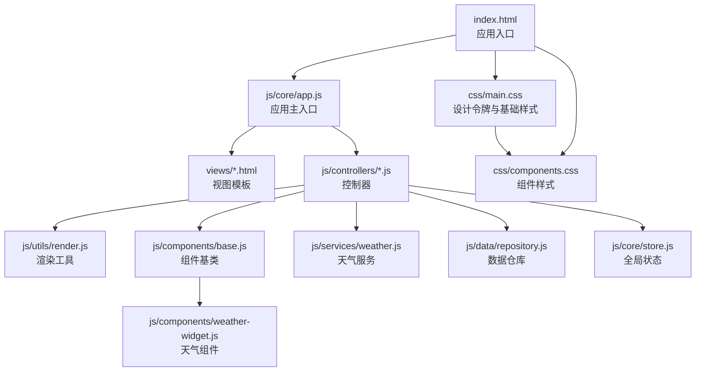
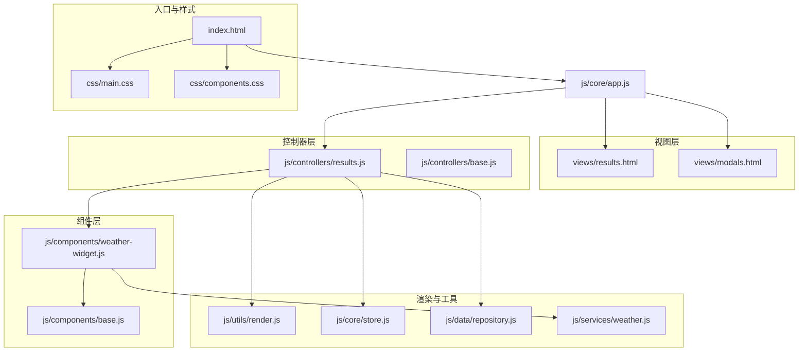
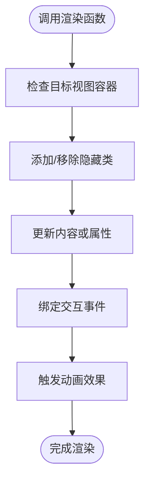
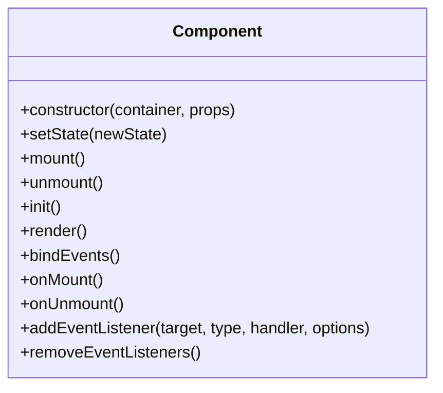
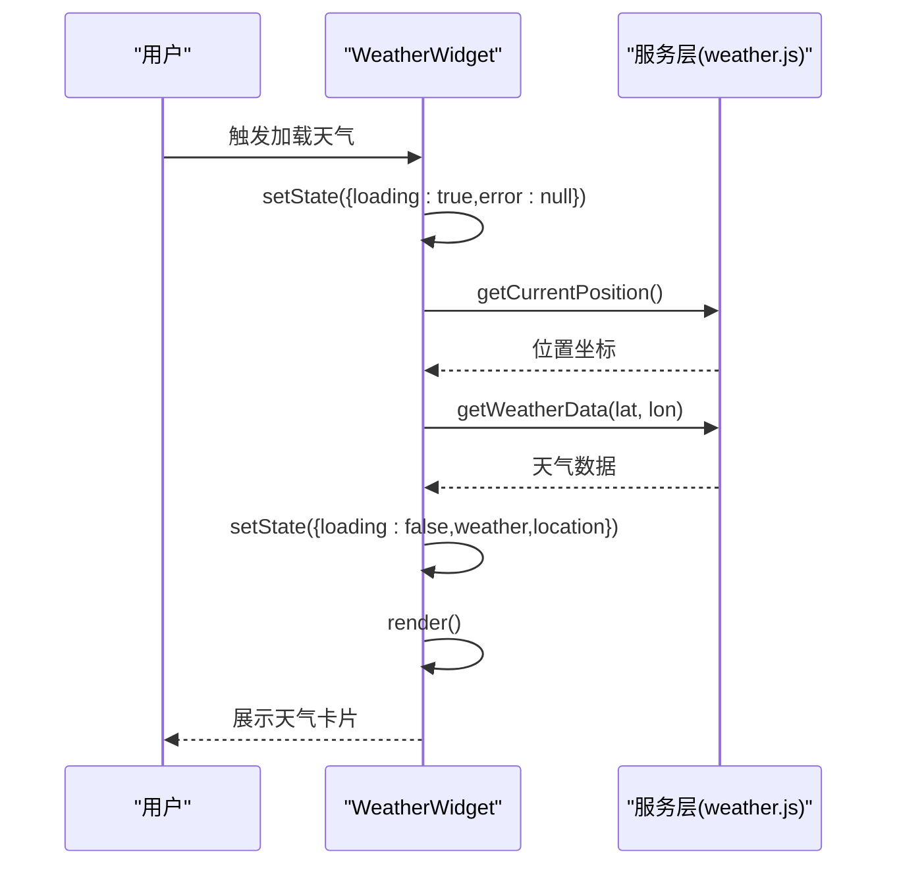
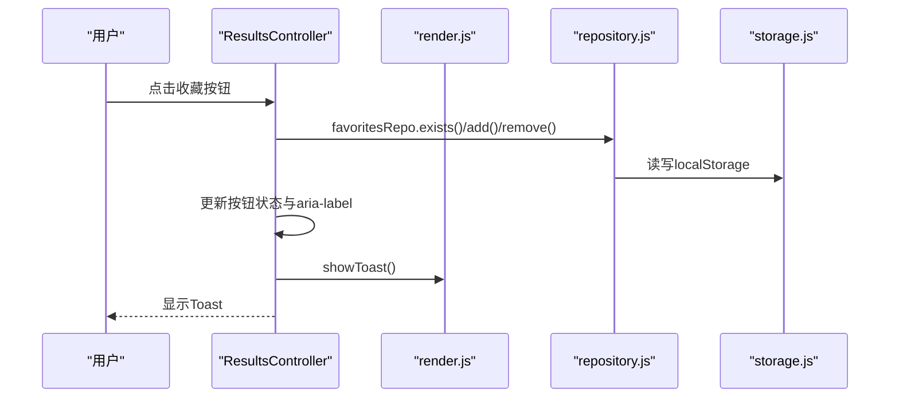
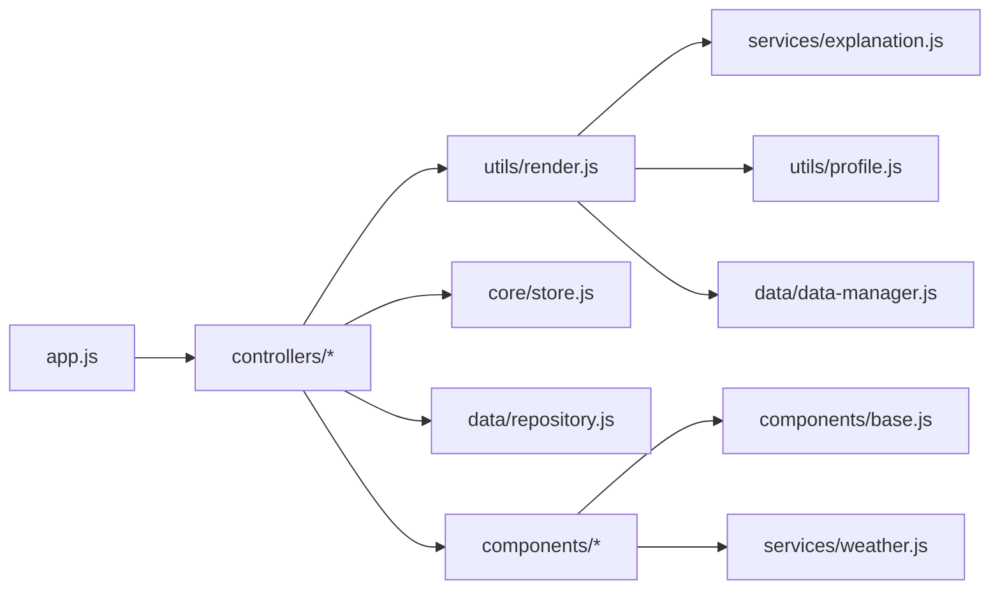

# UI渲染与组件实现

<cite>
**本文档引用的文件**
- [index.html](file://index.html)
- [app.js](file://js/core/app.js)
- [base.js](file://js/components/base.js)
- [weather-widget.js](file://js/components/weather-widget.js)
- [render.js](file://js/utils/render.js)
- [results.html](file://views/results.html)
- [modals.html](file://views/modals.html)
- [results.js](file://js/controllers/results.js)
- [base.js](file://js/controllers/base.js)
- [store.js](file://js/core/store.js)
- [repository.js](file://js/data/repository.js)
- [weather.js](file://js/services/weather.js)
- [main.css](file://css/main.css)
- [components.css](file://css/components.css)
</cite>

## 目录
1. [简介](#简介)
2. [项目结构](#项目结构)
3. [核心组件](#核心组件)
4. [架构总览](#架构总览)
5. [详细组件分析](#详细组件分析)
6. [依赖关系分析](#依赖关系分析)
7. [性能考虑](#性能考虑)
8. [故障排除指南](#故障排除指南)
9. [结论](#结论)

## 简介
本指南聚焦于该五行情感穿搭应用的UI渲染与组件实现，涵盖以下要点：
- 动态页面渲染与视图切换机制
- 模板渲染工具函数的使用与HTML模板的动态生成
- 组件系统设计：BaseComponent基类与具体组件的实现模式
- 事件处理与用户交互：点击、表单提交、模态框等
- 从数据绑定到视图更新的完整流程示例
- 样式设计规范、响应式布局与用户体验优化建议

## 项目结构
该项目采用模块化架构，前端通过单页应用（SPA）方式组织，核心目录与职责如下：
- views：静态HTML视图模板，按需动态加载
- js/core：应用核心（路由、状态、错误处理）
- js/controllers：每个视图对应的控制器，负责业务逻辑与事件绑定
- js/components：可复用UI组件（基于基类）
- js/utils：工具模块（如渲染、分享、上传等）
- js/services：服务层（天气、解释、引擎等）
- js/data：数据仓库与存储抽象
- css：设计令牌、基础样式与组件样式

**图表来源**
- [index.html](file://index.html#L1-L93)
- [app.js](file://js/core/app.js#L1-L206)
- [results.js](file://js/controllers/results.js#L1-L614)
- [render.js](file://js/utils/render.js#L1-L487)
- [base.js](file://js/components/base.js#L1-L107)
- [weather-widget.js](file://js/components/weather-widget.js#L1-L215)
- [weather.js](file://js/services/weather.js#L1-L340)
- [repository.js](file://js/data/repository.js#L1-L394)
- [store.js](file://js/core/store.js#L1-L212)
- [main.css](file://css/main.css#L1-L964)
- [components.css](file://css/components.css#L1-L2102)

**章节来源**
- [index.html](file://index.html#L1-L93)
- [app.js](file://js/core/app.js#L1-L206)

## 核心组件
本节概述UI渲染与组件实现的关键构件及其职责。

- 应用主入口与视图系统
  - 应用通过单例应用类初始化，动态加载视图模板，注册控制器，并在路由变化时切换视图显示。
  - 视图容器统一在应用容器内动态插入，隐藏与显示通过CSS类控制。

- 渲染工具模块
  - 提供视图切换、表单控件初始化、节气横幅渲染、方案卡片渲染、详情模态框渲染、收藏列表渲染、Toast提示等能力。
  - 通过DOM操作与模板字符串生成HTML片段，支持动画与交互。

- 组件基类与可复用组件
  - 组件基类提供生命周期（init/mount/render/bindEvents/onMount/onUnmount）、状态管理（setState）、事件监听管理（addEventListener/removeEventListeners）。
  - 天气小组件演示了组件化思路：状态驱动渲染、事件委托、异步数据加载与错误处理。

- 控制器与事件绑定
  - 控制器负责视图挂载、事件绑定、状态订阅、导航与业务逻辑处理。
  - 事件采用委托与直接绑定结合的方式，确保性能与可维护性。

**章节来源**
- [app.js](file://js/core/app.js#L36-L193)
- [render.js](file://js/utils/render.js#L13-L487)
- [base.js](file://js/components/base.js#L9-L107)
- [weather-widget.js](file://js/components/weather-widget.js#L12-L194)
- [base.js](file://js/controllers/base.js#L11-L131)

## 架构总览
应用采用“视图模板 + 控制器 + 组件 + 渲染工具”的分层架构，配合全局状态与数据仓库，形成清晰的职责边界。

**图表来源**
- [results.html](file://views/results.html#L1-L128)
- [modals.html](file://views/modals.html#L1-L18)
- [results.js](file://js/controllers/results.js#L1-L614)
- [base.js](file://js/controllers/base.js#L1-L131)
- [weather-widget.js](file://js/components/weather-widget.js#L1-L215)
- [base.js](file://js/components/base.js#L1-L107)
- [render.js](file://js/utils/render.js#L1-L487)
- [store.js](file://js/core/store.js#L1-L212)
- [repository.js](file://js/data/repository.js#L1-L394)
- [weather.js](file://js/services/weather.js#L1-L340)
- [index.html](file://index.html#L1-L93)
- [main.css](file://css/main.css#L1-L964)
- [components.css](file://css/components.css#L1-L2102)

## 详细组件分析

### 渲染工具模块（render.js）
渲染工具模块提供统一的DOM操作与模板生成能力，支撑视图切换、表单初始化、卡片渲染与模态框管理。

- 视图切换
  - 通过遍历所有视图容器并添加/移除隐藏类，实现视图的显示与隐藏。
- 表单控件初始化
  - 年份选择器与日期选择器通过循环生成选项，简化模板维护。
- 节气横幅与结果页标题
  - 根据节气信息动态更新横幅名称与元素标识，同时设置背景与文字颜色。
- 方案卡片渲染
  - 生成卡片结构，包含类型标签、关键词、注解、来源、推荐理由、动作区与反馈区。
  - 绑定推荐理由展开/收起事件，支持动画与可访问性属性。
- 详情模态框
  - 根据方案与上下文渲染详细信息，支持外部解释卡片集成。
- 收藏列表渲染
  - 收藏为空时显示空状态，非空时渲染卡片并缓存至全局变量供详情使用。
- Toast提示
  - 动态创建Toast节点，支持动画与定时移除，避免重复实例。
- 模态框管理
  - 显示/关闭模态框时控制body滚动，保证交互体验。

**图表来源**
- [render.js](file://js/utils/render.js#L13-L21)
- [render.js](file://js/utils/render.js#L26-L40)
- [render.js](file://js/utils/render.js#L60-L76)
- [render.js](file://js/utils/render.js#L119-L132)
- [render.js](file://js/utils/render.js#L324-L365)
- [render.js](file://js/utils/render.js#L429-L452)
- [render.js](file://js/utils/render.js#L457-L487)

**章节来源**
- [render.js](file://js/utils/render.js#L1-L487)

### 组件基类（Component）
组件基类定义了组件的标准生命周期与事件管理机制，确保组件的一致性与可复用性。

- 生命周期
  - init：初始化状态与属性
  - mount：初始化、渲染、绑定事件、挂载完成回调
  - unmount：卸载前回调、移除事件监听、清空容器
- 状态管理
  - setState：合并新状态并在已挂载状态下触发重新渲染
- 事件管理
  - addEventListener：统一注册事件并自动管理移除
  - removeEventListeners：批量移除事件监听
- 渲染约定
  - render：子类必须实现，负责生成HTML结构

**图表来源**
- [base.js](file://js/components/base.js#L9-L107)

**章节来源**
- [base.js](file://js/components/base.js#L1-L107)

### 天气小组件（WeatherWidget）
天气小组件展示了组件化的完整实践：状态驱动渲染、事件委托、异步数据加载与错误处理。

- 状态结构
  - 包含加载状态、错误信息、天气数据与位置信息
- 渲染策略
  - 加载中：显示加载指示
  - 错误：显示错误信息与手动输入区域
  - 正常：渲染天气图标、温度、湿度、位置、建议与未来预报
- 事件绑定
  - 点击重试定位
  - 下拉选择城市坐标
- 异步数据流
  - 获取位置 → 获取天气 → 更新状态 → 触发重新渲染
- 辅助组件
  - WeatherImpact：在结果页展示天气对推荐的加成提示

**图表来源**
- [weather-widget.js](file://js/components/weather-widget.js#L141-L162)
- [weather.js](file://js/services/weather.js#L91-L138)
- [weather-widget.js](file://js/components/weather-widget.js#L22-L117)

**章节来源**
- [weather-widget.js](file://js/components/weather-widget.js#L1-L215)
- [weather.js](file://js/services/weather.js#L1-L340)

### 结果页控制器（ResultsController）
结果页控制器负责渲染推荐结果、绑定交互事件、处理收藏与分享、记录用户反馈以及展示天气影响提示。

- 页面渲染
  - 渲染副标题、节气标题、方案卡片、今日运势卡片、天气影响提示与八字提示
- 事件绑定
  - 返回、收藏、画像、日记、换一批、上传等导航按钮
  - 方案卡片内的收藏、分享、查看详情、反馈按钮
  - 模态框关闭与背景点击关闭
  - 反馈弹窗选项与原因收集
- 反馈与偏好更新
  - 记录采纳/不喜欢反馈
  - 更新用户偏好（五行、颜色、材质权重）
  - 限制反馈数量，避免无限增长
- 收藏管理
  - 使用数据仓库进行增删查与Toast提示
- 分享与详情
  - Web Share API优先，回退到剪贴板复制
  - 渲染详情模态框并显示

**图表来源**
- [results.js](file://js/controllers/results.js#L527-L566)
- [repository.js](file://js/data/repository.js#L86-L146)
- [render.js](file://js/utils/render.js#L457-L487)

**章节来源**
- [results.js](file://js/controllers/results.js#L1-L614)
- [repository.js](file://js/data/repository.js#L1-L394)
- [render.js](file://js/utils/render.js#L429-L452)

### 视图与模板（results.html）
结果页视图模板定义了页面结构与交互元素，控制器通过渲染工具与组件填充内容。

- 结构要点
  - 页眉导航与品牌标识
  - 页面标题与副标题
  - 今日运势卡片区域
  - 天气影响提示容器
  - 方案卡片容器
  - 操作按钮（换一批、上传）
  - 反馈模态框
- 交互元素
  - 返回按钮、收藏按钮、日记按钮、画像按钮
  - 方案卡片内的收藏、分享、查看详情、反馈按钮
  - 模态框关闭按钮与背景遮罩

**章节来源**
- [results.html](file://views/results.html#L1-L128)

## 依赖关系分析
组件间的依赖关系体现了清晰的分层与职责分离。

**图表来源**
- [app.js](file://js/core/app.js#L14-L21)
- [results.js](file://js/controllers/results.js#L5-L11)
- [render.js](file://js/utils/render.js#L5-L8)
- [store.js](file://js/core/store.js#L1-L212)
- [repository.js](file://js/data/repository.js#L1-L394)
- [base.js](file://js/components/base.js#L1-L107)
- [weather-widget.js](file://js/components/weather-widget.js#L6-L7)

**章节来源**
- [app.js](file://js/core/app.js#L1-L206)
- [results.js](file://js/controllers/results.js#L1-L614)
- [render.js](file://js/utils/render.js#L1-L487)

## 性能考虑
- 视图懒加载与预加载
  - 应用在启动时预加载首屏视图，其余视图按需加载，减少初始包体积。
- 组件渲染优化
  - 组件内部通过状态变更触发最小化重渲染，避免不必要的DOM更新。
- 事件委托
  - 控制器在容器上使用事件委托，减少事件监听器数量，提升性能。
- 动画与过渡
  - CSS动画与关键帧用于平滑过渡，减少JavaScript动画开销；尊重“减少动态”偏好设置。
- 缓存与复用
  - 渲染结果与收藏列表缓存在全局变量中，避免重复渲染。
- 网络请求优化
  - 天气服务使用超时控制与错误处理，防止长时间阻塞UI。

[本节为通用指导，无需特定文件引用]

## 故障排除指南
- 视图无法显示或切换
  - 检查视图容器ID与隐藏类是否正确，确认应用已注册控制器并执行视图切换。
- 渲染异常或空白
  - 确认渲染工具函数调用顺序与DOM元素存在性，检查状态是否正确更新。
- 组件未响应事件
  - 确保组件已挂载且事件绑定在挂载完成后执行，避免重复绑定。
- 收藏/反馈功能失效
  - 检查数据仓库的存储键名与安全存储封装，确认localStorage可用。
- 天气数据获取失败
  - 检查地理位置权限与网络请求超时设置，查看错误处理回调。

**章节来源**
- [app.js](file://js/core/app.js#L145-L184)
- [results.js](file://js/controllers/results.js#L360-L392)
- [repository.js](file://js/data/repository.js#L24-L41)
- [weather.js](file://js/services/weather.js#L91-L111)

## 结论
该应用通过清晰的视图模板、控制器与组件分层，结合渲染工具与全局状态管理，实现了可维护、可扩展的UI渲染体系。组件基类提供了统一的生命周期与事件管理，渲染工具模块承担了模板生成与交互逻辑，控制器负责业务编排与事件处理。配合完善的样式规范与响应式设计，为用户提供了流畅的交互体验。建议在后续迭代中进一步完善换一批推荐逻辑、增强无障碍支持与性能监控，持续优化用户体验。