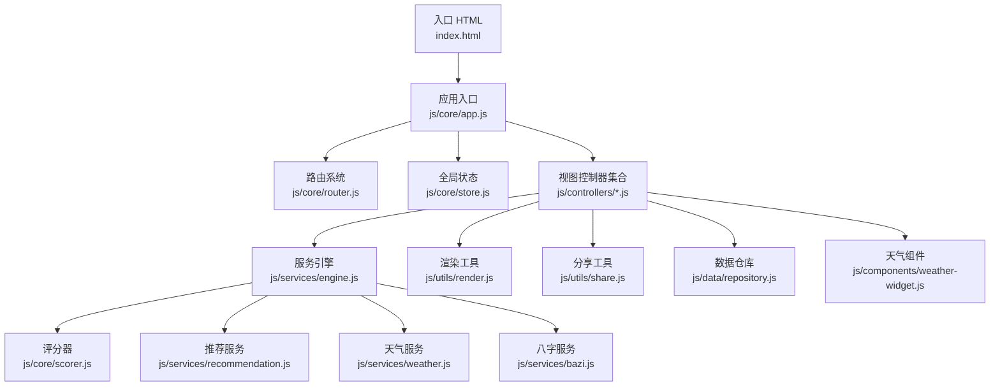
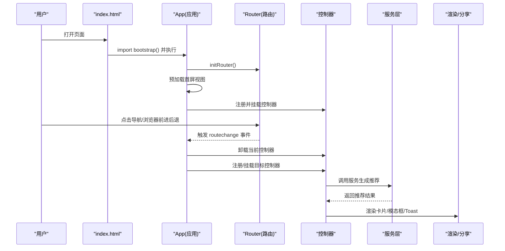
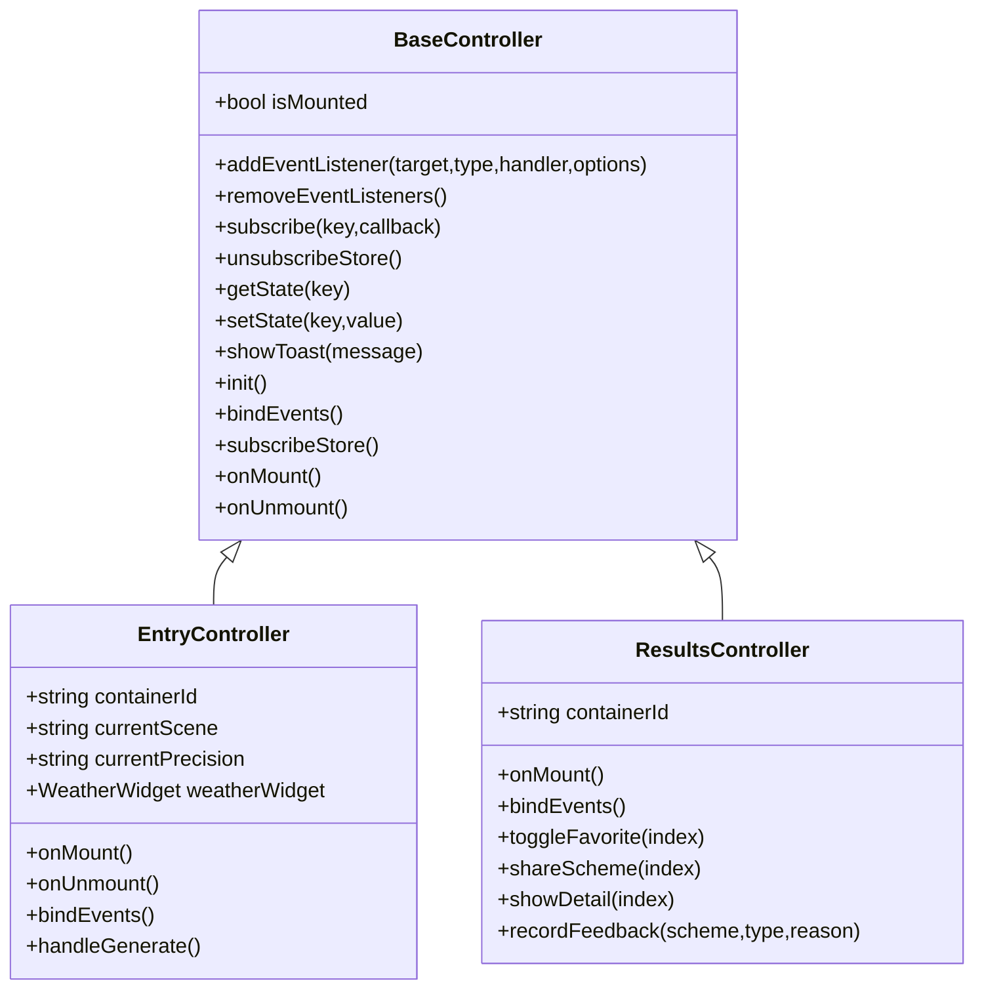
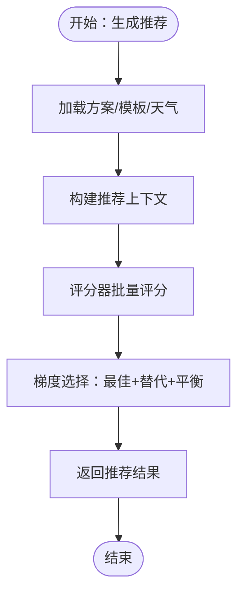
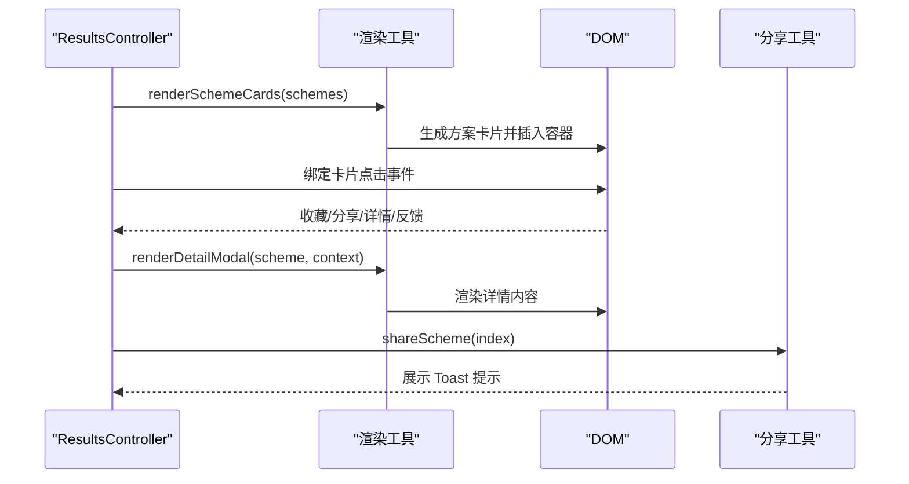
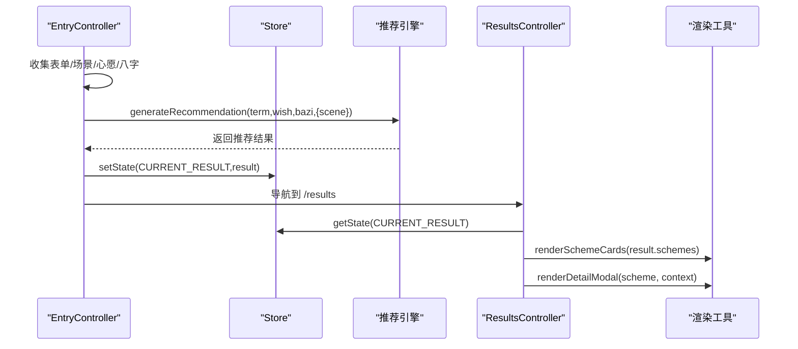
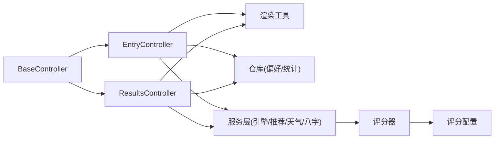

# 代码实现与集成

<cite>
**本文引用的文件**
- [index.html](file://index.html)
- [js/core/app.js](file://js/core/app.js)
- [js/core/router.js](file://js/core/router.js)
- [js/core/store.js](file://js/core/store.js)
- [js/core/scorer.js](file://js/core/scorer.js)
- [js/core/scoring-config.js](file://js/core/scoring-config.js)
- [js/controllers/base.js](file://js/controllers/base.js)
- [js/controllers/entry.js](file://js/controllers/entry.js)
- [js/controllers/results.js](file://js/controllers/results.js)
- [js/services/engine.js](file://js/services/engine.js)
- [js/services/recommendation.js](file://js/services/recommendation.js)
- [js/services/bazi.js](file://js/services/bazi.js)
- [js/services/weather.js](file://js/services/weather.js)
- [js/utils/render.js](file://js/utils/render.js)
- [js/utils/share.js](file://js/utils/share.js)
- [js/data/repository.js](file://js/data/repository.js)
- [js/components/weather-widget.js](file://js/components/weather-widget.js)
</cite>

## 目录
1. [简介](#简介)
2. [项目结构](#项目结构)
3. [核心组件](#核心组件)
4. [架构总览](#架构总览)
5. [详细组件分析](#详细组件分析)
6. [依赖分析](#依赖分析)
7. [性能考虑](#性能考虑)
8. [故障排查指南](#故障排查指南)
9. [结论](#结论)
10. [附录](#附录)

## 简介
本指南面向功能开发者，系统讲解从控制器到服务层的完整实现流程，涵盖：
- 控制器开发：继承 BaseController、生命周期方法、事件绑定与状态管理
- 服务层集成：服务调用、数据处理与错误处理
- UI 组件编写：模板渲染、样式设计与交互实现
- 完整示例：从输入页到结果页的端到端流程
- 规范与最佳实践：命名、模块职责、错误处理与性能优化

## 项目结构
项目采用“视图-控制器-服务-数据仓库”的分层架构，配合全局状态与路由系统，实现模块化与可扩展性。

图表来源
- [index.html](file://index.html#L58-L61)
- [js/core/app.js](file://js/core/app.js#L13-L31)
- [js/core/router.js](file://js/core/router.js#L9-L17)
- [js/core/store.js](file://js/core/store.js#L33-L51)
- [js/controllers/entry.js](file://js/controllers/entry.js#L14-L21)
- [js/controllers/results.js](file://js/controllers/results.js#L13-L17)
- [js/services/engine.js](file://js/services/engine.js#L6-L14)
- [js/core/scorer.js](file://js/core/scorer.js#L6-L12)
- [js/services/recommendation.js](file://js/services/recommendation.js#L6-L9)
- [js/services/weather.js](file://js/services/weather.js)
- [js/services/bazi.js](file://js/services/bazi.js)
- [js/utils/render.js](file://js/utils/render.js#L5-L8)
- [js/utils/share.js](file://js/utils/share.js#L6)
- [js/data/repository.js](file://js/data/repository.js#L6-L21)
- [js/components/weather-widget.js](file://js/components/weather-widget.js)

章节来源
- [index.html](file://index.html#L1-L79)
- [js/core/app.js](file://js/core/app.js#L13-L31)

## 核心组件
- 应用入口与路由协调：负责视图动态加载、控制器注册与路由变化处理
- 控制器基类：统一生命周期、事件管理与状态订阅
- 全局状态：集中管理应用状态，支持订阅与通知
- 服务引擎：封装推荐算法、评分与上下文构建
- 渲染与分享：负责 UI 渲染、模态框、Toast 与分享能力
- 数据仓库：抽象本地存储，提供收藏、偏好、统计等能力

章节来源
- [js/core/app.js](file://js/core/app.js#L36-L73)
- [js/core/router.js](file://js/core/router.js#L25-L79)
- [js/core/store.js](file://js/core/store.js#L30-L63)
- [js/controllers/base.js](file://js/controllers/base.js#L11-L42)
- [js/services/engine.js](file://js/services/engine.js#L323-L393)
- [js/utils/render.js](file://js/utils/render.js#L13-L21)
- [js/utils/share.js](file://js/utils/share.js#L66-L91)
- [js/data/repository.js](file://js/data/repository.js#L46-L81)

## 架构总览
应用通过入口 HTML 引入模块化脚本，启动应用后：
- 初始化全局错误处理与路由
- 预加载首屏视图并注册对应控制器
- 监听路由变化，动态切换视图并挂载/卸载控制器
- 控制器通过状态与服务层协作，驱动 UI 渲染与交互

图表来源
- [index.html](file://index.html#L58-L61)
- [js/core/app.js](file://js/core/app.js#L47-L73)
- [js/core/router.js](file://js/core/router.js#L27-L79)
- [js/controllers/results.js](file://js/controllers/results.js#L20-L46)
- [js/services/engine.js](file://js/services/engine.js#L323-L393)
- [js/utils/render.js](file://js/utils/render.js#L119-L132)

## 详细组件分析

### 控制器开发流程（BaseController 与具体控制器）
- 继承 BaseController：获得统一的生命周期、事件管理与状态订阅能力
- 生命周期方法
  - init：子类初始化资源（如表单、组件）
  - onMount：视图挂载完成后进行渲染与事件绑定
  - onUnmount：卸载前清理事件与组件
- 事件绑定：通过 addEventListener 统一管理，避免内存泄漏
- 状态管理：通过 getState/ setState 与 store 交互；subscribe 订阅状态变化

图表来源
- [js/controllers/base.js](file://js/controllers/base.js#L11-L131)
- [js/controllers/entry.js](file://js/controllers/entry.js#L14-L52)
- [js/controllers/results.js](file://js/controllers/results.js#L13-L46)

章节来源
- [js/controllers/base.js](file://js/controllers/base.js#L11-L131)
- [js/controllers/entry.js](file://js/controllers/entry.js#L23-L52)
- [js/controllers/results.js](file://js/controllers/results.js#L20-L46)

### 服务层集成（引擎与评分器）
- 推荐引擎：加载方案与模板数据，构建上下文，使用评分器批量评分，返回梯度推荐
- 评分器：封装评分维度与权重，支持缓存与解释输出
- 个性化与运势：结合用户偏好、今日运势与场景偏好，提升推荐多样性与新鲜感

图表来源
- [js/services/engine.js](file://js/services/engine.js#L323-L393)
- [js/core/scorer.js](file://js/core/scorer.js#L266-L276)
- [js/core/scoring-config.js](file://js/core/scoring-config.js)

章节来源
- [js/services/engine.js](file://js/services/engine.js#L323-L393)
- [js/core/scorer.js](file://js/core/scorer.js#L14-L75)
- [js/services/recommendation.js](file://js/services/recommendation.js#L323-L379)

### UI 组件编写规范
- 模板渲染：通过渲染工具将数据结构转换为 DOM，支持卡片、详情模态框、Toast
- 样式设计：遵循组件样式分离，使用 CSS 变量与主题色（如五行为基础）
- 交互实现：事件委托、模态框开关、分享菜单、收藏/反馈按钮状态切换

图表来源
- [js/controllers/results.js](file://js/controllers/results.js#L360-L392)
- [js/utils/render.js](file://js/utils/render.js#L119-L132)
- [js/utils/render.js](file://js/utils/render.js#L324-L365)
- [js/utils/share.js](file://js/utils/share.js#L66-L91)

章节来源
- [js/utils/render.js](file://js/utils/render.js#L119-L132)
- [js/utils/render.js](file://js/utils/render.js#L324-L365)
- [js/utils/share.js](file://js/utils/share.js#L66-L91)

### 从控制器到服务层的完整实现示例（输入页到结果页）
- 输入页控制器：收集场景、心愿与八字信息，调用引擎生成推荐，写入状态并导航
- 结果页控制器：读取状态、渲染卡片与详情、处理收藏/分享/反馈

图表来源
- [js/controllers/entry.js](file://js/controllers/entry.js#L131-L189)
- [js/core/store.js](file://js/core/store.js#L79-L81)
- [js/services/engine.js](file://js/services/engine.js#L323-L393)
- [js/controllers/results.js](file://js/controllers/results.js#L31-L45)
- [js/utils/render.js](file://js/utils/render.js#L119-L132)

章节来源
- [js/controllers/entry.js](file://js/controllers/entry.js#L131-L189)
- [js/controllers/results.js](file://js/controllers/results.js#L31-L45)

## 依赖分析
- 控制器依赖：BaseController、路由、渲染工具、数据仓库、服务层
- 服务层依赖：评分器、推荐配置、天气/八字/推荐服务
- 数据层依赖：仓库抽象与安全存储封装

图表来源
- [js/controllers/base.js](file://js/controllers/base.js#L6)
- [js/controllers/entry.js](file://js/controllers/entry.js#L5-L12)
- [js/controllers/results.js](file://js/controllers/results.js#L5-L12)
- [js/services/engine.js](file://js/services/engine.js#L6-L14)
- [js/core/scorer.js](file://js/core/scorer.js#L6-L12)
- [js/core/scoring-config.js](file://js/core/scoring-config.js)
- [js/data/repository.js](file://js/data/repository.js#L6-L21)

章节来源
- [js/controllers/entry.js](file://js/controllers/entry.js#L5-L12)
- [js/controllers/results.js](file://js/controllers/results.js#L5-L12)
- [js/services/engine.js](file://js/services/engine.js#L6-L14)
- [js/core/scorer.js](file://js/core/scorer.js#L6-L12)

## 性能考虑
- 懒加载与预加载：应用预加载首屏视图，其余视图按需加载，减少首屏阻塞
- 事件与订阅管理：统一添加/移除事件与订阅，避免重复绑定与内存泄漏
- 评分缓存：评分器对单方案结果进行缓存，减少重复计算
- 渲染优化：卡片动画延迟与一次性插入，避免频繁 DOM 重排
- 错误降级：网络与存储异常通过安全包装器处理，保证稳定性

## 故障排查指南
- 控制器未挂载：确认视图容器存在且 onMount 中正确获取容器
- 事件无效：检查事件绑定时机（应在 onMount 后绑定）、避免重复绑定
- 状态不更新：确认通过 setState 写入 store，并在控制器中 subscribe 对应 key
- 推荐为空：检查服务层数据加载与上下文构建，关注天气/模板加载异常
- 分享失败：优先使用系统分享，降级到复制文本；捕获异常并提示用户

章节来源
- [js/controllers/base.js](file://js/controllers/base.js#L72-L85)
- [js/controllers/results.js](file://js/controllers/results.js#L360-L392)
- [js/services/engine.js](file://js/services/engine.js#L323-L393)
- [js/utils/share.js](file://js/utils/share.js#L66-L91)

## 结论
本项目通过清晰的分层与模块化设计，实现了从输入到推荐再到交互的完整链路。遵循本文的开发流程与规范，可快速扩展新功能、维护代码质量并保障用户体验。

## 附录
- 代码规范与最佳实践
  - 命名：控制器以名词短语命名（如 EntryController），服务以动词短语（如 generateRecommendation）
  - 模块职责：控制器只负责视图与交互，业务逻辑下沉到服务层
  - 错误处理：使用安全包装器与全局错误处理器，避免崩溃
  - 性能：合理使用缓存、事件与订阅管理、懒加载与预加载
- 常见问题
  - 视图未显示：检查动态加载与容器类名
  - 收藏/反馈不生效：确认仓库键名与本地存储可用
  - 分享失败：检测浏览器兼容性与权限