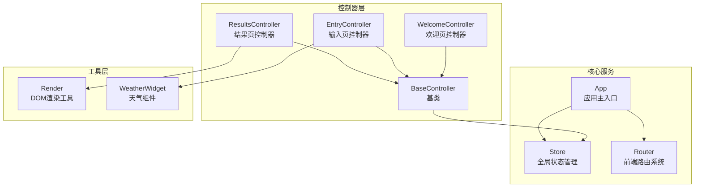
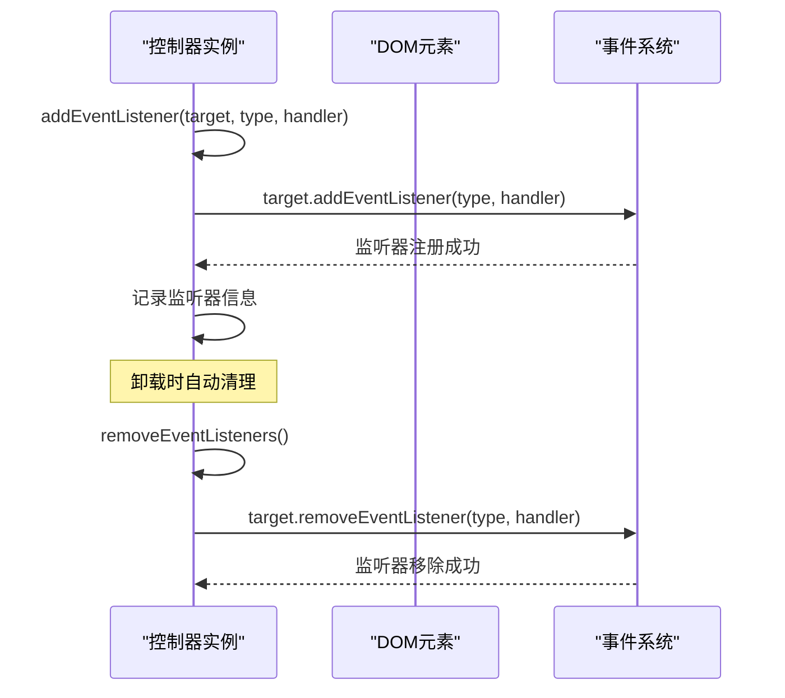
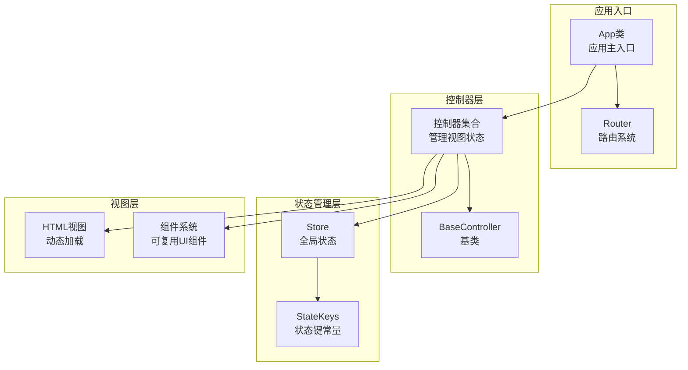
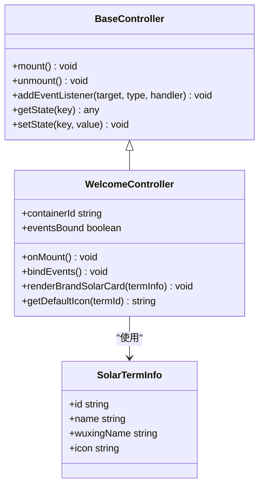
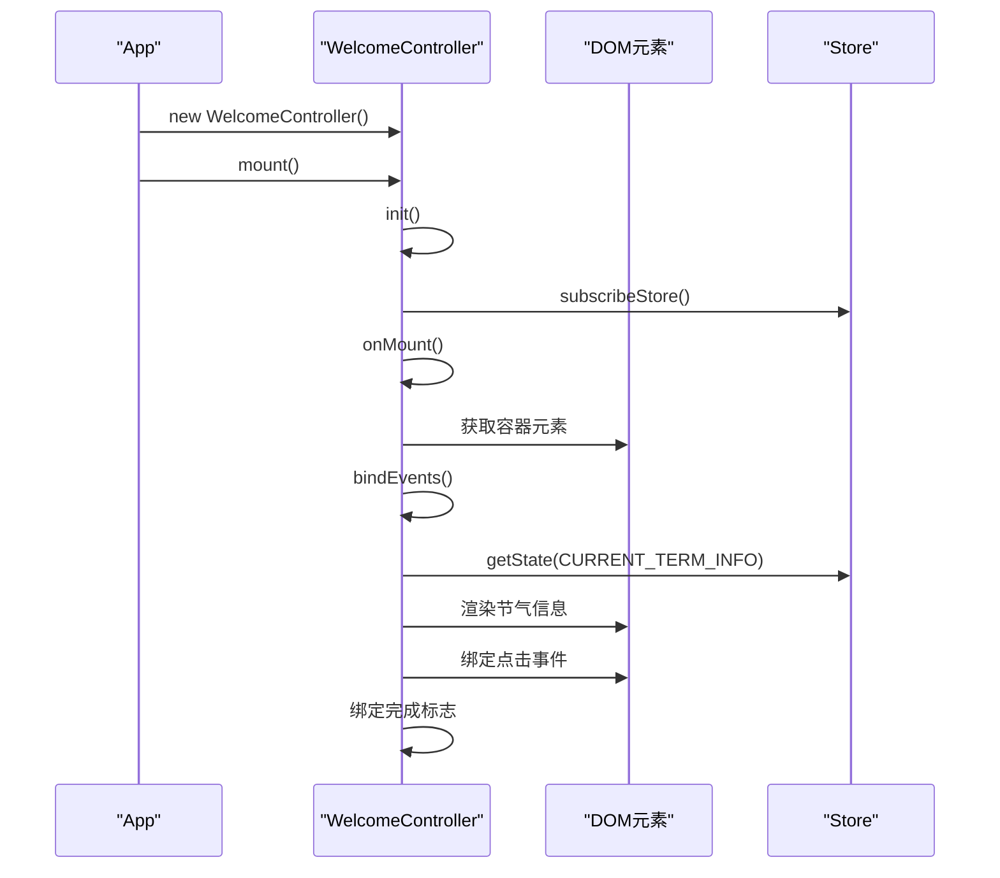
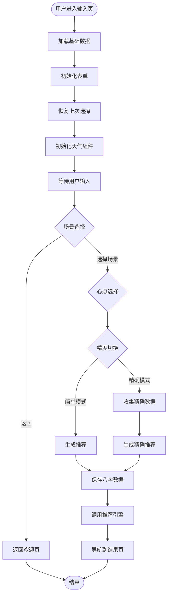
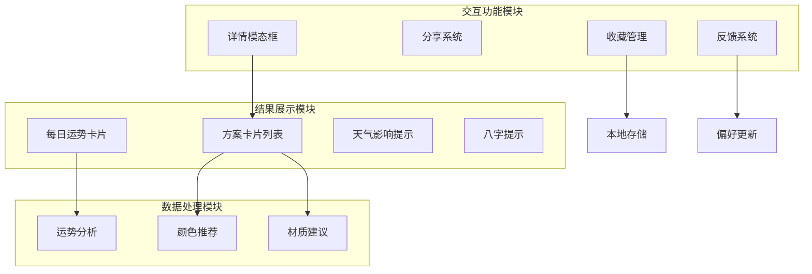
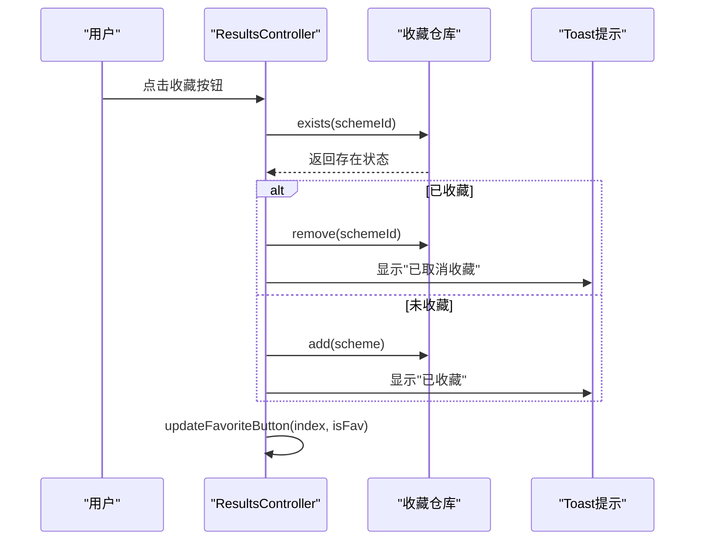
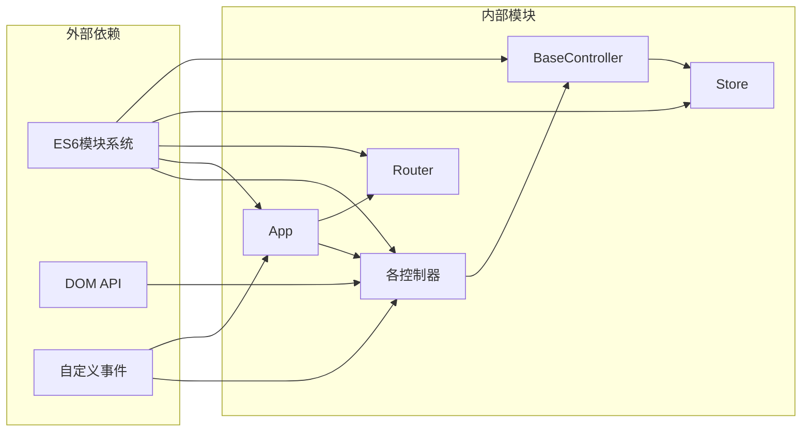

# 控制器开发实现

<cite>
**本文档引用的文件**
- [js/controllers/base.js](file://js/controllers/base.js)
- [js/core/store.js](file://js/core/store.js)
- [js/core/app.js](file://js/core/app.js)
- [js/core/router.js](file://js/core/router.js)
- [js/controllers/welcome.js](file://js/controllers/welcome.js)
- [js/controllers/entry.js](file://js/controllers/entry.js)
- [js/controllers/results.js](file://js/controllers/results.js)
- [js/utils/render.js](file://js/utils/render.js)
- [js/components/weather-widget.js](file://js/components/weather-widget.js)
</cite>

## 目录
1. [简介](#简介)
2. [项目结构](#项目结构)
3. [核心组件](#核心组件)
4. [架构概览](#架构概览)
5. [详细组件分析](#详细组件分析)
6. [依赖关系分析](#依赖关系分析)
7. [性能考虑](#性能考虑)
8. [故障排除指南](#故障排除指南)
9. [结论](#结论)
10. [附录](#附录)

## 简介

本文档提供了基于 BaseController 基类开发新功能控制器的完整指南。该系统采用模块化架构，每个视图对应一个控制器，通过统一的生命周期管理和事件绑定机制实现清晰的状态控制和资源管理。

系统的核心特性包括：
- 完整的控制器生命周期管理
- 自动化的事件监听器清理机制
- 集中的状态管理模式
- 组件化的视图渲染系统
- 响应式的用户交互体验

## 项目结构

项目采用按功能模块组织的结构，控制器层位于 `js/controllers/` 目录下，每个控制器负责管理对应的视图和业务逻辑。



**图表来源**
- [js/controllers/base.js](file://js/controllers/base.js#L11-L131)
- [js/core/store.js](file://js/core/store.js#L30-L190)
- [js/core/app.js](file://js/core/app.js#L36-L196)

**章节来源**
- [js/controllers/base.js](file://js/controllers/base.js#L1-L131)
- [js/core/store.js](file://js/core/store.js#L1-L212)
- [js/core/app.js](file://js/core/app.js#L1-L206)

## 核心组件

### BaseController 基类

BaseController 是所有控制器的基类，提供了统一的生命周期管理和资源管理机制。

#### 生命周期管理

控制器的生命周期包含以下关键阶段：

1. **初始化阶段** (`init`)
   - 执行控制器的初始化逻辑
   - 设置默认状态和配置

2. **挂载阶段** (`mount`)
   - 调用 `init()` 方法
   - 订阅状态变化
   - 标记为已挂载
   - 调用 `onMount()` 回调
   - 绑定事件监听器

3. **运行阶段** (`onMount`)
   - 执行具体的视图初始化逻辑
   - 设置容器元素和 DOM 结构

4. **卸载阶段** (`unmount`)
   - 调用 `onUnmount()` 回调
   - 取消状态订阅
   - 移除事件监听器
   - 标记为未挂载

#### 事件绑定机制

BaseController 提供了完善的事件绑定和清理机制：



**图表来源**
- [js/controllers/base.js](file://js/controllers/base.js#L72-L85)

#### 状态管理集成

BaseController 集成了全局状态管理系统，提供以下方法：

- `subscribeStore()`: 订阅状态变化
- `getState(key)`: 获取状态值
- `setState(key, value)`: 设置状态值
- `subscribe(key, callback)`: 订阅特定状态键
- `unsubscribeStore()`: 取消所有状态订阅

**章节来源**
- [js/controllers/base.js](file://js/controllers/base.js#L11-L131)

## 架构概览

系统采用 MVC（Model-View-Controller）架构模式，通过统一的应用入口协调各个组件的工作。



**图表来源**
- [js/core/app.js](file://js/core/app.js#L36-L196)
- [js/core/router.js](file://js/core/router.js#L10-L171)
- [js/core/store.js](file://js/core/store.js#L193-L212)

**章节来源**
- [js/core/app.js](file://js/core/app.js#L36-L196)
- [js/core/router.js](file://js/core/router.js#L1-L171)

## 详细组件分析

### 欢迎页控制器 (WelcomeController)

WelcomeController 展示了控制器的基本实现模式，负责欢迎页面的初始化和交互。

#### 核心功能实现



**图表来源**
- [js/controllers/base.js](file://js/controllers/base.js#L11-L131)
- [js/controllers/welcome.js](file://js/controllers/welcome.js#L13-L151)

#### 生命周期流程



**图表来源**
- [js/controllers/welcome.js](file://js/controllers/welcome.js#L19-L35)
- [js/controllers/base.js](file://js/controllers/base.js#L21-L30)

**章节来源**
- [js/controllers/welcome.js](file://js/controllers/welcome.js#L13-L151)

### 输入页控制器 (EntryController)

EntryController 实现了复杂的业务逻辑，包括表单处理、天气组件集成和推荐算法调用。

#### 业务流程分析



**图表来源**
- [js/controllers/entry.js](file://js/controllers/entry.js#L131-L189)

#### 状态管理集成

EntryController 展示了状态管理的最佳实践：

1. **状态读取**: 使用 `getState()` 获取当前心愿ID和节气信息
2. **状态写入**: 使用 `setState()` 更新八字结果和推荐结果
3. **事件驱动**: 通过状态变化触发 UI 更新

**章节来源**
- [js/controllers/entry.js](file://js/controllers/entry.js#L14-L241)

### 结果页控制器 (ResultsController)

ResultsController 是最复杂的控制器，实现了完整的推荐结果展示、收藏管理和用户反馈系统。

#### 功能模块分析



**图表来源**
- [js/controllers/results.js](file://js/controllers/results.js#L57-L253)

#### 收藏管理实现



**图表来源**
- [js/controllers/results.js](file://js/controllers/results.js#L527-L566)

**章节来源**
- [js/controllers/results.js](file://js/controllers/results.js#L13-L614)

## 依赖关系分析

系统采用松耦合的设计，通过依赖注入和事件驱动实现模块间的解耦。



**图表来源**
- [js/controllers/base.js](file://js/controllers/base.js#L6-L7)
- [js/core/store.js](file://js/core/store.js#L190-L190)
- [js/core/app.js](file://js/core/app.js#L14-L21)

**章节来源**
- [js/controllers/base.js](file://js/controllers/base.js#L6-L7)
- [js/core/store.js](file://js/core/store.js#L190-L190)
- [js/core/app.js](file://js/core/app.js#L14-L21)

## 性能考虑

### 内存管理

系统通过以下机制确保内存的有效管理：

1. **事件监听器自动清理**: `removeEventListeners()` 方法确保每次卸载时清理所有监听器
2. **状态订阅管理**: `unsubscribeStore()` 方法防止内存泄漏
3. **DOM 元素清理**: 控制器卸载时清空容器内容

### 渲染优化

1. **按需加载**: 视图采用动态加载机制，只在需要时加载相关 HTML
2. **状态变化通知**: 使用 Proxy 对象监听状态变化，仅在值真正改变时触发更新
3. **组件化设计**: 将复杂 UI 拆分为可复用的组件，提高代码复用率

### 异步处理

1. **错误处理**: 所有异步操作都包含适当的错误处理机制
2. **超时控制**: 关键操作设置合理的超时时间
3. **重试机制**: 网络请求失败时提供重试机会

## 故障排除指南

### 常见问题及解决方案

#### 1. 控制器无法挂载

**症状**: 控制器创建后无法正常工作

**可能原因**:
- 容器元素不存在
- 事件绑定顺序错误
- 状态订阅失败

**解决方法**:
```javascript
// 确保容器元素存在
onMount() {
    this.container = document.getElementById(this.containerId);
    if (!this.container) {
        console.error(`[Controller] Container ${this.containerId} not found`);
        return;
    }
}
```

#### 2. 事件监听器泄漏

**症状**: 页面切换后事件仍然触发

**解决方法**:
```javascript
// 使用 addEventListener 自动管理监听器
this.addEventListener(element, 'click', handler);

// 在 onUnmount 中确保清理
onUnmount() {
    this.eventsBound = false;
}
```

#### 3. 状态更新不生效

**症状**: 修改状态后 UI 未更新

**解决方法**:
```javascript
// 使用 setState 而非直接修改
this.setState('key', value);

// 确保在 onMount 后调用
onMount() {
    this.setState('key', newValue);
}
```

#### 4. 内存泄漏

**症状**: 页面切换后内存持续增长

**解决方法**:
```javascript
// 确保在卸载时清理所有资源
unmount() {
    this.onUnmount();
    this.unsubscribeStore();
    this.removeEventListeners();
    this.isMounted = false;
}
```

**章节来源**
- [js/controllers/base.js](file://js/controllers/base.js#L35-L42)
- [js/controllers/welcome.js](file://js/controllers/welcome.js#L19-L35)

## 结论

该控制器开发框架提供了完整的生命周期管理、事件绑定和状态管理机制，适用于构建复杂的单页应用。通过遵循本文档的开发规范和最佳实践，开发者可以快速创建高质量的控制器，实现清晰的代码结构和良好的用户体验。

关键优势包括：
- 统一的生命周期管理
- 自动化的资源清理机制
- 灵活的状态管理模式
- 清晰的事件处理机制
- 良好的可扩展性

## 附录

### 开发规范

#### 1. 继承 BaseController

```javascript
export class MyController extends BaseController {
    constructor() {
        super();
        this.containerId = 'view-my-page';
    }
    
    onMount() {
        // 实现视图初始化
    }
    
    bindEvents() {
        // 绑定事件监听器
    }
}
```

#### 2. 事件绑定规范

```javascript
bindEvents() {
    // 避免重复绑定
    if (this.eventsBound) return;
    this.eventsBound = true;
    
    // 使用 addEventListener 自动管理
    this.addEventListener(button, 'click', this.handleClick);
}
```

#### 3. 状态管理规范

```javascript
// 读取状态
const state = this.getState('key');

// 更新状态
this.setState('key', value);

// 订阅状态变化
this.subscribe('key', (newValue, oldValue) => {
    // 处理状态变化
});
```

#### 4. 卸载清理规范

```javascript
onUnmount() {
    // 清理标志位
    this.eventsBound = false;
    
    // 清理子组件（如有）
    if (this.childComponent) {
        this.childComponent.unmount();
    }
}
```

### 最佳实践

1. **始终检查容器元素**: 在 `onMount()` 中验证容器元素是否存在
2. **避免重复绑定**: 使用 `eventsBound` 标志防止事件重复绑定
3. **及时清理资源**: 在 `onUnmount()` 中清理所有资源
4. **使用状态管理**: 通过 Store 管理跨组件共享状态
5. **错误处理**: 为所有异步操作添加适当的错误处理
6. **性能优化**: 避免不必要的 DOM 操作和状态更新