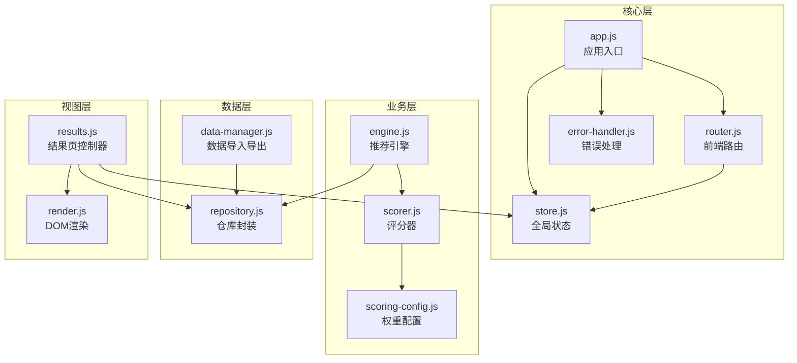
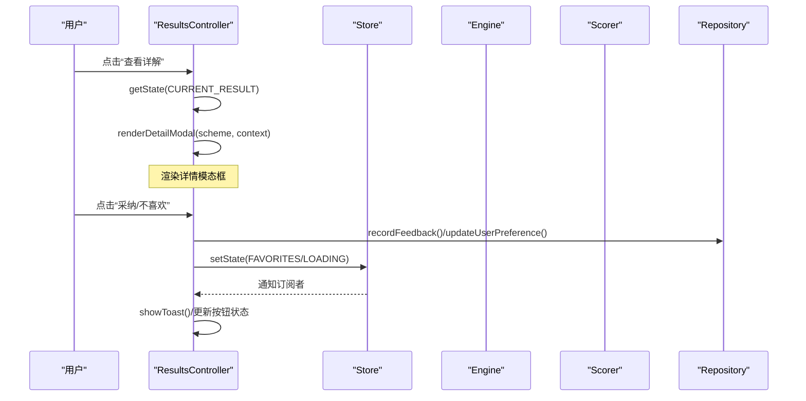
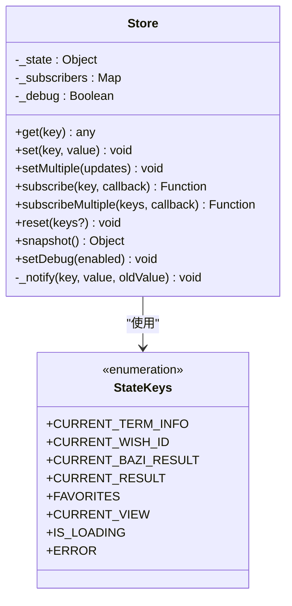
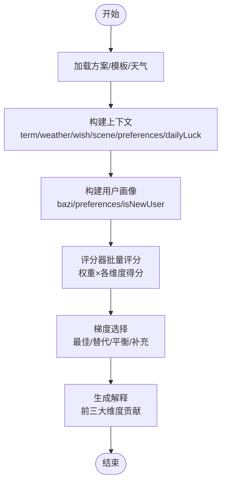
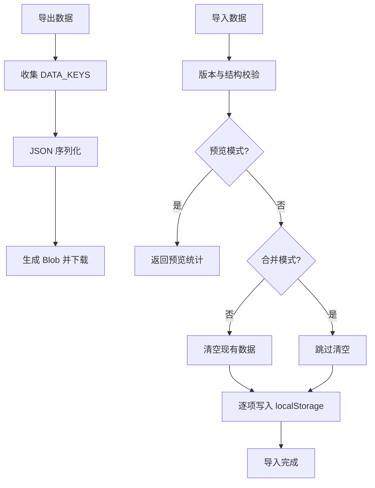
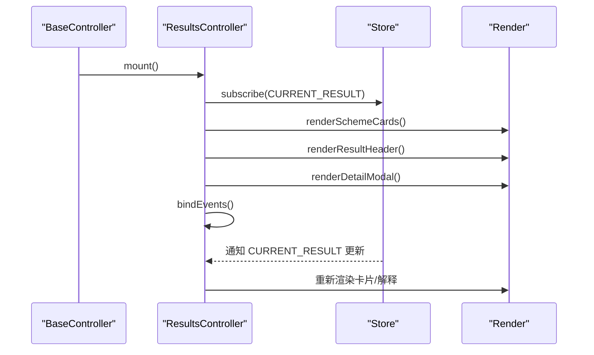
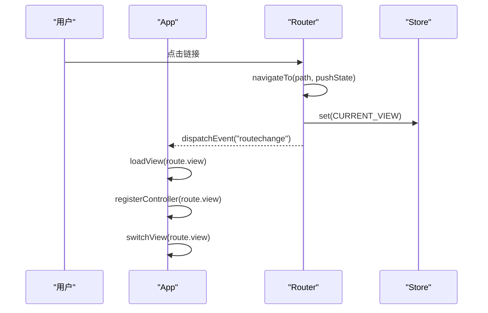
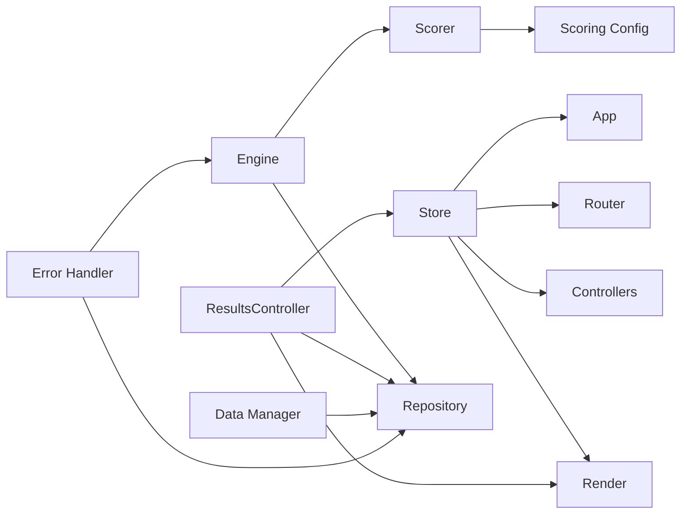
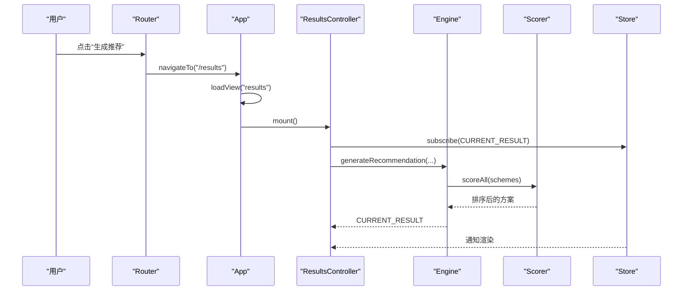

# 数据流与状态管理

<cite>
**本文引用的文件**
- [store.js](file://js/core/store.js)
- [scorer.js](file://js/core/scorer.js)
- [scoring-config.js](file://js/core/scoring-config.js)
- [app.js](file://js/core/app.js)
- [router.js](file://js/core/router.js)
- [engine.js](file://js/services/engine.js)
- [repository.js](file://js/data/repository.js)
- [data-manager.js](file://js/data/data-manager.js)
- [results.js](file://js/controllers/results.js)
- [base.js](file://js/controllers/base.js)
- [render.js](file://js/utils/render.js)
- [error-handler.js](file://js/core/error-handler.js)
- [index.html](file://index.html)
</cite>

## 目录
1. [简介](#简介)
2. [项目结构](#项目结构)
3. [核心组件](#核心组件)
4. [架构总览](#架构总览)
5. [详细组件分析](#详细组件分析)
6. [依赖关系分析](#依赖关系分析)
7. [性能考量](#性能考量)
8. [故障排查指南](#故障排查指南)
9. [结论](#结论)
10. [附录](#附录)

## 简介
本指南聚焦于应用中的数据流与状态管理实现，系统阐述以下主题：
- Store 模式：状态订阅、状态更新与事件分发机制
- 数据管理流程：数据验证、格式转换与持久化存储
- 评分算法：权重计算、分数聚合与结果排序
- 完整数据流示例：从用户输入到最终结果的处理链路
- 数据安全、性能优化与内存管理最佳实践

## 项目结构
应用采用模块化组织，核心围绕“状态中心 + 控制器 + 服务引擎 + 数据仓库”的分层设计：
- 核心层：状态中心（Store）、路由、错误处理
- 业务层：推荐引擎（评分器 + 权重配置）、控制器（视图协调）
- 数据层：仓库（localStorage 封装）、数据导出/导入
- 工具层：渲染、分享、上传等辅助模块

图表来源
- [app.js](file://js/core/app.js#L36-L196)
- [router.js](file://js/core/router.js#L10-L171)
- [store.js](file://js/core/store.js#L30-L187)
- [engine.js](file://js/services/engine.js#L1-L441)
- [scorer.js](file://js/core/scorer.js#L14-L317)
- [scoring-config.js](file://js/core/scoring-config.js#L6-L128)
- [repository.js](file://js/data/repository.js#L46-L394)
- [data-manager.js](file://js/data/data-manager.js#L48-L184)
- [results.js](file://js/controllers/results.js#L13-L614)
- [render.js](file://js/utils/render.js#L119-L132)

章节来源
- [app.js](file://js/core/app.js#L36-L196)
- [router.js](file://js/core/router.js#L10-L171)
- [store.js](file://js/core/store.js#L30-L187)
- [engine.js](file://js/services/engine.js#L339-L409)
- [results.js](file://js/controllers/results.js#L20-L614)

## 核心组件
- 全局状态中心（Store）：提供响应式状态、订阅/通知、批量更新、重置与调试快照能力
- 推荐引擎（Engine）：加载数据、构建上下文、调用评分器、梯度选择方案
- 评分器（Scorer）：按维度打分、权重乘积、缓存、排序与解释
- 权重配置（Scoring Config）：基础权重、动态权重、五行关系评分
- 仓库（Repository）：抽象本地存储，提供收藏、偏好、反馈、统计等 CRUD
- 数据管理（Data Manager）：备份/恢复、校验、概览与导出
- 控制器（Base/Results）：挂载/卸载生命周期、事件绑定、Store 订阅、UI 更新
- 渲染（Render）：卡片、模态框、Toast、解释卡片等
- 错误处理（Error Handler）：统一包装、错误类型、用户提示与日志

章节来源
- [store.js](file://js/core/store.js#L30-L187)
- [scorer.js](file://js/core/scorer.js#L14-L317)
- [scoring-config.js](file://js/core/scoring-config.js#L6-L128)
- [engine.js](file://js/services/engine.js#L339-L409)
- [repository.js](file://js/data/repository.js#L46-L394)
- [data-manager.js](file://js/data/data-manager.js#L48-L184)
- [base.js](file://js/controllers/base.js#L11-L131)
- [results.js](file://js/controllers/results.js#L13-L614)
- [render.js](file://js/utils/render.js#L119-L132)
- [error-handler.js](file://js/core/error-handler.js#L45-L190)

## 架构总览
应用采用“单向数据流”：
- 用户交互触发控制器事件
- 控制器通过 Store 更新状态或调用服务引擎
- 引擎加载数据、构建上下文、评分与选择方案
- Store 通知订阅者（控制器/渲染），驱动 UI 更新
- 数据持久化通过仓库与数据管理模块完成

图表来源
- [results.js](file://js/controllers/results.js#L394-L525)
- [store.js](file://js/core/store.js#L99-L141)
- [repository.js](file://js/data/repository.js#L206-L258)
- [render.js](file://js/utils/render.js#L324-L365)

## 详细组件分析

### Store 模式与状态管理
- 响应式状态：通过 Proxy 拦截 set，在值变更时触发 onChange
- 订阅机制：Map 存储键到订阅集合，_notify 逐个回调，静默处理订阅者错误
- 批量更新：setMultiple 原子化更新多个键
- 重置策略：支持按需重置特定键或全部键
- 调试快照：snapshot 输出当前状态副本
- 常量键名：StateKeys、ViewNames 避免硬编码

图表来源
- [store.js](file://js/core/store.js#L30-L187)

章节来源
- [store.js](file://js/core/store.js#L11-L25)
- [store.js](file://js/core/store.js#L99-L141)
- [store.js](file://js/core/store.js#L147-L170)
- [store.js](file://js/core/store.js#L193-L212)

### 推荐引擎与评分算法
- 数据加载：并行加载方案、心愿模板、八字模板
- 上下文构建：节气、天气、心愿、场景偏好、今日运势、温度等级
- 用户画像：八字、偏好、是否新用户
- 评分器：按维度打分（节气、八字、场景、天气、心愿、历史、运势），权重乘积，缓存，总分四舍五入
- 梯度选择：最佳匹配 + 保守替代 + 平衡方案，必要时补充高分方案
- 结果解释：输出前三大贡献维度及占比

图表来源
- [engine.js](file://js/services/engine.js#L342-L409)
- [scorer.js](file://js/core/scorer.js#L29-L75)
- [scoring-config.js](file://js/core/scoring-config.js#L74-L92)

章节来源
- [engine.js](file://js/services/engine.js#L339-L409)
- [scorer.js](file://js/core/scorer.js#L29-L75)
- [scoring-config.js](file://js/core/scoring-config.js#L74-L92)

### 数据管理流程（验证、转换、持久化）
- 导出：遍历 DATA_KEYS，序列化，统计项数与收藏数
- 下载：Blob + URL.createObjectURL，自动命名带时间戳
- 验证：版本号、数据结构、非空校验
- 导入：支持预览、合并/覆盖、逐项写入，异常静默记录
- 清理：按 DATA_KEYS 清空
- 仓库：统一安全封装（safeStorage），提供收藏、偏好、反馈、统计、上传照片等
- 数据概览：统计键数、总大小、每项简述

图表来源
- [data-manager.js](file://js/data/data-manager.js#L48-L99)
- [data-manager.js](file://js/data/data-manager.js#L106-L135)
- [data-manager.js](file://js/data/data-manager.js#L143-L184)
- [repository.js](file://js/data/repository.js#L24-L41)

章节来源
- [data-manager.js](file://js/data/data-manager.js#L48-L99)
- [data-manager.js](file://js/data/data-manager.js#L106-L135)
- [data-manager.js](file://js/data/data-manager.js#L143-L184)
- [repository.js](file://js/data/repository.js#L24-L41)

### 控制器与视图渲染
- BaseController：挂载/卸载、事件绑定、Store 订阅、状态读写、Toast
- ResultsController：渲染结果页、运势卡片、天气影响、收藏/分享/反馈、详情模态框
- Render：方案卡片、解释卡片、模态框、Toast、收藏列表

图表来源
- [base.js](file://js/controllers/base.js#L21-L42)
- [results.js](file://js/controllers/results.js#L20-L614)
- [render.js](file://js/utils/render.js#L119-L132)

章节来源
- [base.js](file://js/controllers/base.js#L11-L131)
- [results.js](file://js/controllers/results.js#L20-L614)
- [render.js](file://js/utils/render.js#L119-L132)

### 路由与视图切换
- 路由配置：Hash 路由适配 GitHub Pages，支持 popstate/hashchange
- 导航：navigateTo 更新历史、标题、触发 routechange 事件
- App：监听 routechange，动态加载视图、注册/卸载控制器、切换显示

图表来源
- [router.js](file://js/core/router.js#L81-L108)
- [app.js](file://js/core/app.js#L145-L168)
- [store.js](file://js/core/store.js#L79-L81)

章节来源
- [router.js](file://js/core/router.js#L42-L74)
- [router.js](file://js/core/router.js#L81-L108)
- [app.js](file://js/core/app.js#L145-L168)

## 依赖关系分析
- Store 作为全局枢纽被 App、Router、Controllers、Render 广泛依赖
- Engine 依赖 Scorer 与 Scoring Config，并通过 Repository 读取用户偏好
- ResultsController 依赖 Store、Repository、Render、Weather 组件
- Data Manager 依赖 Repository 的安全存储封装
- 错误处理贯穿 fetch、JSON 解析、存储操作与全局未捕获异常

图表来源
- [store.js](file://js/core/store.js#L30-L187)
- [app.js](file://js/core/app.js#L14-L21)
- [router.js](file://js/core/router.js#L7-L18)
- [engine.js](file://js/services/engine.js#L6-L12)
- [scorer.js](file://js/core/scorer.js#L6-L12)
- [scoring-config.js](file://js/core/scoring-config.js#L6-L12)
- [results.js](file://js/controllers/results.js#L5-L11)
- [data-manager.js](file://js/data/data-manager.js#L6-L42)
- [error-handler.js](file://js/core/error-handler.js#L5-L6)

章节来源
- [store.js](file://js/core/store.js#L30-L187)
- [engine.js](file://js/services/engine.js#L6-L12)
- [results.js](file://js/controllers/results.js#L5-L11)
- [data-manager.js](file://js/data/data-manager.js#L6-L42)
- [error-handler.js](file://js/core/error-handler.js#L5-L6)

## 性能考量
- 评分缓存：Scorer 内部 Map 缓存评分结果，避免重复计算
- 批量更新：setMultiple 原子化更新，减少多次通知
- 懒加载与预加载：App 预加载首屏视图，动态加载其余视图
- 并行加载：Engine 并行加载方案、模板、天气数据
- DOM 动画延迟：卡片渲染时按索引设置动画延迟，提升感知性能
- 本地存储安全封装：safeStorage 捕获异常，避免主线程崩溃

章节来源
- [scorer.js](file://js/core/scorer.js#L20-L22)
- [store.js](file://js/core/store.js#L87-L91)
- [app.js](file://js/core/app.js#L54-L60)
- [engine.js](file://js/services/engine.js#L343-L347)
- [render.js](file://js/utils/render.js#L138-L140)
- [error-handler.js](file://js/core/error-handler.js#L153-L163)

## 故障排查指南
- 网络/超时：safeFetch 超时中断，withErrorHandler 统一提示
- 数据解析：safeJsonParse 捕获 JSON 错误
- 存储异常：safeStorage 捕获 QuotaExceededError 等，提示清理空间
- 全局错误：initGlobalErrorHandler 捕获未处理 Promise 与全局错误
- 控制器事件：BaseController 提供 removeEventListeners，避免内存泄漏
- Store 订阅：BaseController 统一取消订阅，防止重复订阅

章节来源
- [error-handler.js](file://js/core/error-handler.js#L101-L146)
- [error-handler.js](file://js/core/error-handler.js#L153-L163)
- [error-handler.js](file://js/core/error-handler.js#L168-L189)
- [base.js](file://js/controllers/base.js#L80-L85)
- [base.js](file://js/controllers/base.js#L100-L103)

## 结论
本应用以 Store 为核心的状态中心，结合控制器与渲染模块，形成清晰的单向数据流；推荐引擎通过评分器与权重配置实现可解释的梯度推荐；数据管理模块提供安全可靠的备份/恢复能力。整体架构具备良好的扩展性与可维护性。

## 附录

### 完整数据流示例：从用户输入到最终结果
- 用户在入口页输入心愿与场景，路由导航到结果页
- App 动态加载视图并注册控制器，控制器订阅 Store 中的 CURRENT_RESULT
- Engine 并行加载方案与模板，构建上下文，调用 Scorer 批量评分并梯度选择
- 结果写入 Store 的 CURRENT_RESULT，触发控制器渲染卡片与解释
- 用户可收藏、分享、反馈，反馈同时更新仓库与偏好，影响后续推荐

图表来源
- [router.js](file://js/core/router.js#L81-L108)
- [app.js](file://js/core/app.js#L54-L60)
- [results.js](file://js/controllers/results.js#L20-L46)
- [engine.js](file://js/services/engine.js#L339-L409)
- [scorer.js](file://js/core/scorer.js#L266-L276)
- [store.js](file://js/core/store.js#L99-L141)

### 数据安全与隐私
- 所有数据仅存储在本地（localStorage），无服务器端存储
- 数据导出为 JSON 文件，可迁移至新设备
- 安全存储封装：统一捕获存储异常，避免泄露敏感信息

章节来源
- [index.html](file://index.html#L54-L66)
- [data-manager.js](file://js/data/data-manager.js#L48-L99)
- [repository.js](file://js/data/repository.js#L24-L41)