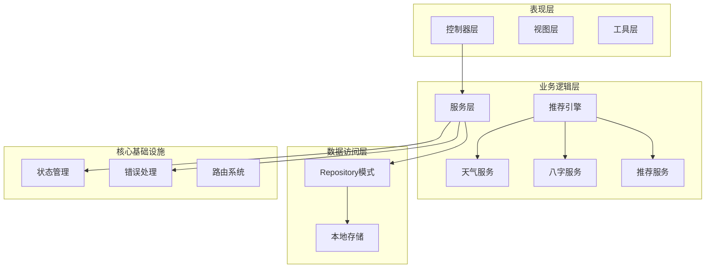
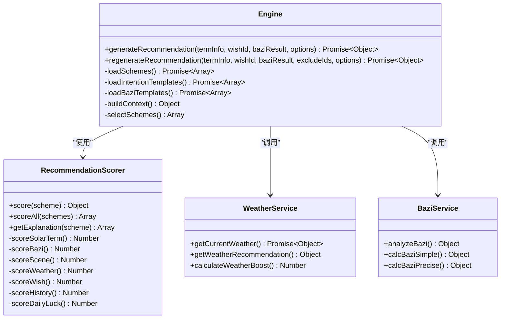
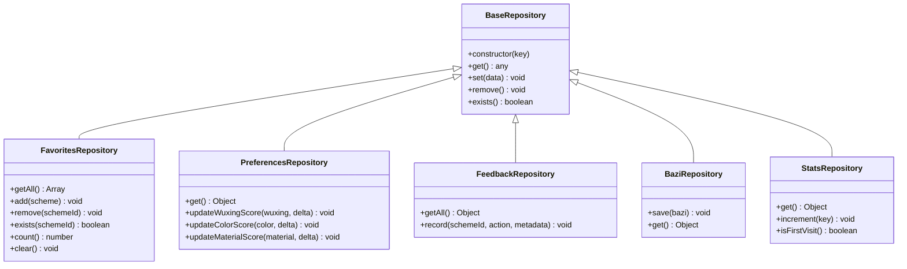
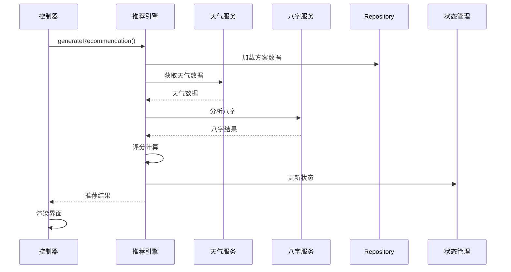
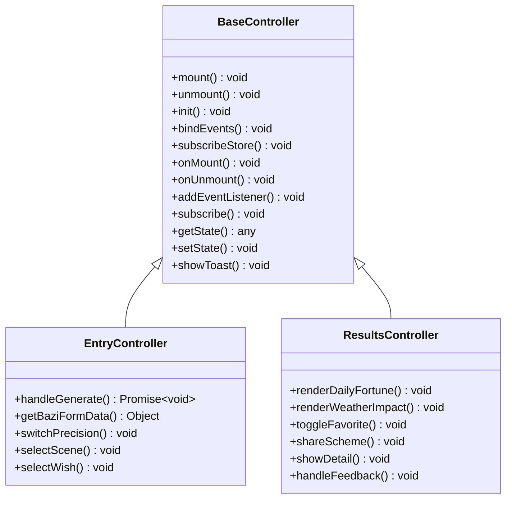
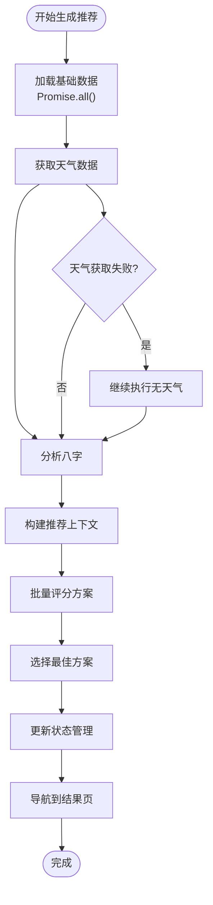
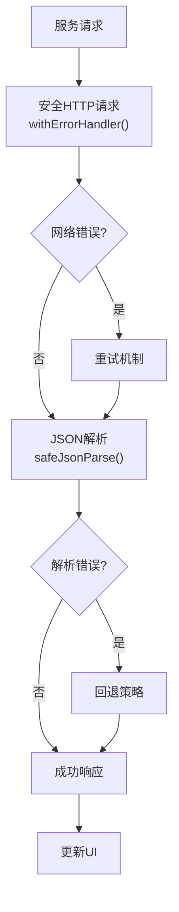
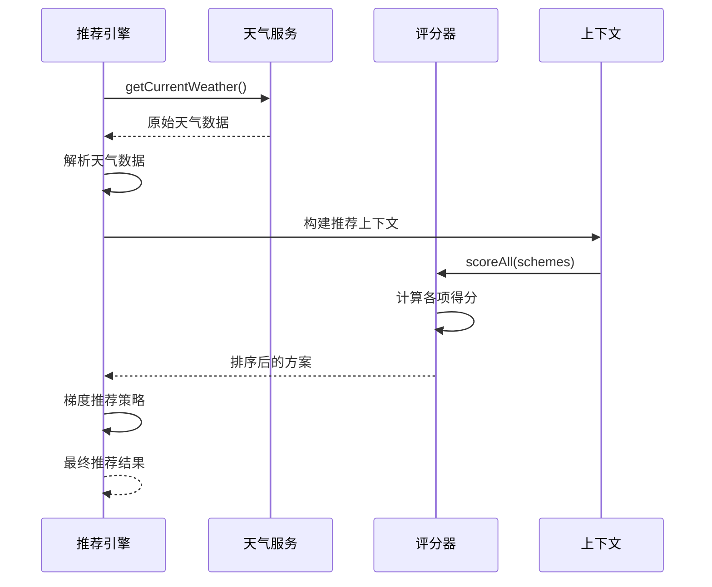
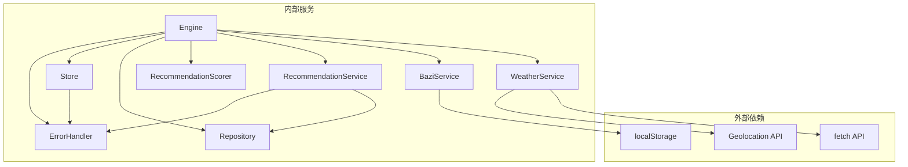

# 服务层集成实现

<cite>
**本文档引用的文件**
- [engine.js](file://js/services/engine.js)
- [recommendation.js](file://js/services/recommendation.js)
- [repository.js](file://js/data/repository.js)
- [base.js](file://js/controllers/base.js)
- [app.js](file://js/core/app.js)
- [store.js](file://js/core/store.js)
- [scorer.js](file://js/core/scorer.js)
- [scoring-config.js](file://js/core/scoring-config.js)
- [weather.js](file://js/services/weather.js)
- [bazi.js](file://js/services/bazi.js)
- [results.js](file://js/controllers/results.js)
- [entry.js](file://js/controllers/entry.js)
- [render.js](file://js/utils/render.js)
</cite>

## 目录
1. [简介](#简介)
2. [项目结构](#项目结构)
3. [核心组件](#核心组件)
4. [架构概览](#架构概览)
5. [详细组件分析](#详细组件分析)
6. [依赖关系分析](#依赖关系分析)
7. [性能考虑](#性能考虑)
8. [故障排除指南](#故障排除指南)
9. [结论](#结论)

## 简介

本指南详细说明了如何在控制器中正确集成和调用各种服务模块，涵盖服务调用模式、异步处理、错误处理和数据转换。文档特别介绍了Repository模式的使用，包括数据访问、缓存策略和持久化机制，并阐述了服务间协作关系，特别是Engine推荐引擎如何协调各个服务模块。最后提供了完整的集成示例，展示从服务调用到数据处理的完整流程，以及性能优化建议、错误处理策略和调试技巧。

## 项目结构

该项目采用模块化架构，主要分为以下层次：



**图表来源**
- [app.js](file://js/core/app.js#L1-L206)
- [engine.js](file://js/services/engine.js#L1-L441)

**章节来源**
- [app.js](file://js/core/app.js#L1-L206)
- [base.js](file://js/controllers/base.js#L1-L131)

## 核心组件

### 推荐引擎 (Engine)

推荐引擎是整个系统的核心协调器，负责整合多个服务模块并生成最终的推荐结果：



**图表来源**
- [engine.js](file://js/services/engine.js#L339-L409)
- [scorer.js](file://js/core/scorer.js#L14-L317)
- [weather.js](file://js/services/weather.js#L135-L138)
- [bazi.js](file://js/services/bazi.js#L241-L267)

### Repository模式

Repository模式提供了统一的数据访问接口，支持多种存储后端：



**图表来源**
- [repository.js](file://js/data/repository.js#L46-L385)

**章节来源**
- [repository.js](file://js/data/repository.js#L1-L394)

## 架构概览

系统采用分层架构，各层职责明确：



**图表来源**
- [engine.js](file://js/services/engine.js#L339-L409)
- [entry.js](file://js/controllers/entry.js#L167-L189)

## 详细组件分析

### 控制器集成模式

控制器通过继承BaseController基类来实现统一的生命周期管理：



**图表来源**
- [base.js](file://js/controllers/base.js#L11-L131)
- [entry.js](file://js/controllers/entry.js#L14-L241)
- [results.js](file://js/controllers/results.js#L13-L614)

### 异步处理模式

系统广泛使用Promise进行异步处理，确保用户体验流畅：



**图表来源**
- [engine.js](file://js/services/engine.js#L343-L379)
- [entry.js](file://js/controllers/entry.js#L167-L189)

### 错误处理策略

系统实现了多层次的错误处理机制：



**图表来源**
- [engine.js](file://js/services/engine.js#L6-L10)
- [app.js](file://js/core/app.js#L122-L131)

### 数据转换流程

系统在服务层之间进行复杂的数据转换：



**图表来源**
- [engine.js](file://js/services/engine.js#L203-L228)
- [scorer.js](file://js/core/scorer.js#L266-L276)

**章节来源**
- [base.js](file://js/controllers/base.js#L1-L131)
- [entry.js](file://js/controllers/entry.js#L1-L241)
- [results.js](file://js/controllers/results.js#L1-L614)

## 依赖关系分析

系统的服务依赖关系如下：



**图表来源**
- [engine.js](file://js/services/engine.js#L6-L10)
- [weather.js](file://js/services/weather.js#L91-L111)
- [recommendation.js](file://js/services/recommendation.js#L6-L29)

**章节来源**
- [engine.js](file://js/services/engine.js#L1-L441)
- [weather.js](file://js/services/weather.js#L1-L340)
- [recommendation.js](file://js/services/recommendation.js#L1-L466)

## 性能考虑

### 缓存策略

系统实现了多层缓存机制：

1. **内存缓存**：Engine模块缓存已加载的数据
2. **本地存储**：Repository模式持久化用户偏好和反馈
3. **浏览器缓存**：静态资源通过HTTP缓存机制

### 异步优化

- 使用Promise.all()并行加载多个数据源
- 实现超时控制和重试机制
- 采用渐进式渲染减少首屏时间

### 内存管理

- 控制器生命周期管理，及时清理事件监听
- 使用WeakMap避免内存泄漏
- 及时释放大对象引用

## 故障排除指南

### 常见问题诊断

1. **推荐结果为空**
   - 检查数据加载是否成功
   - 验证用户输入参数
   - 确认网络连接状态

2. **天气数据获取失败**
   - 检查地理位置权限
   - 验证API可用性
   - 查看错误日志

3. **收藏功能异常**
   - 检查localStorage可用性
   - 验证数据格式
   - 确认Repository实例化

### 调试技巧

1. **启用调试模式**
   ```javascript
   store.setDebug(true);
   ```

2. **查看状态快照**
   ```javascript
   console.log(store.snapshot());
   ```

3. **监控服务调用**
   - 使用浏览器开发者工具Network面板
   - 检查API响应时间和错误
   - 监控内存使用情况

**章节来源**
- [store.js](file://js/core/store.js#L184-L187)
- [app.js](file://js/core/app.js#L122-L131)

## 结论

本服务层集成实现展示了现代Web应用的最佳实践：

1. **模块化设计**：清晰的职责分离和接口定义
2. **异步处理**：完善的Promise链和错误处理机制
3. **数据持久化**：Repository模式提供统一的数据访问抽象
4. **性能优化**：多层缓存和异步加载策略
5. **可维护性**：清晰的代码结构和详细的文档

通过遵循这些模式和最佳实践，开发者可以构建可扩展、高性能且易于维护的服务层集成解决方案。建议在实际项目中：
- 继续完善错误处理和监控
- 增加更多的单元测试
- 优化移动端性能
- 扩展更多场景支持