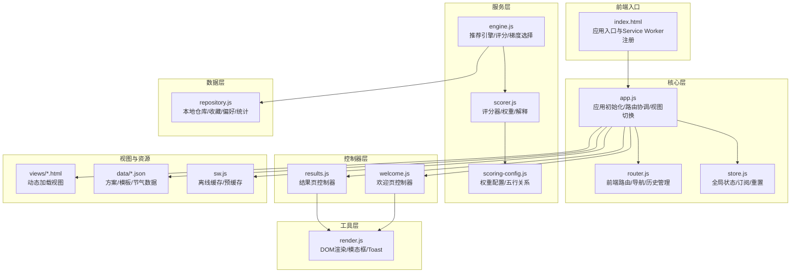
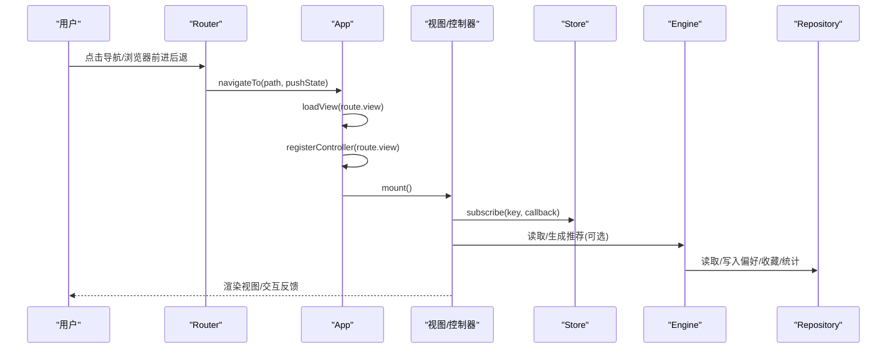
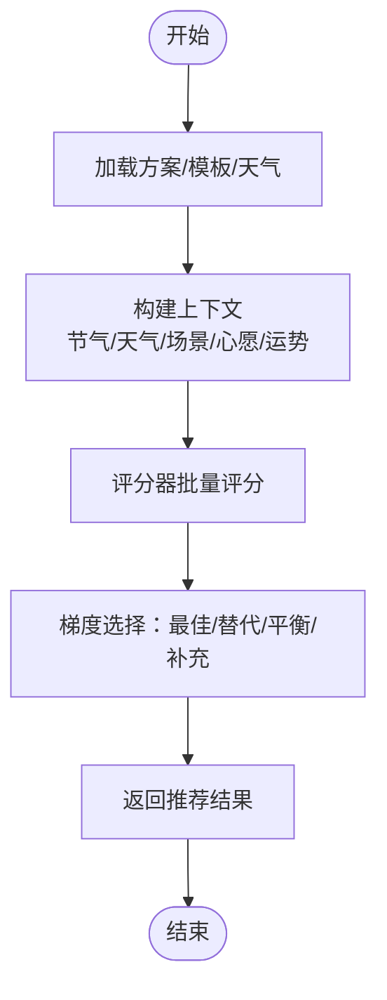
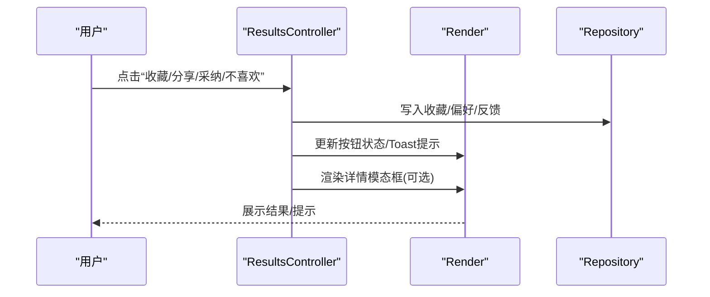
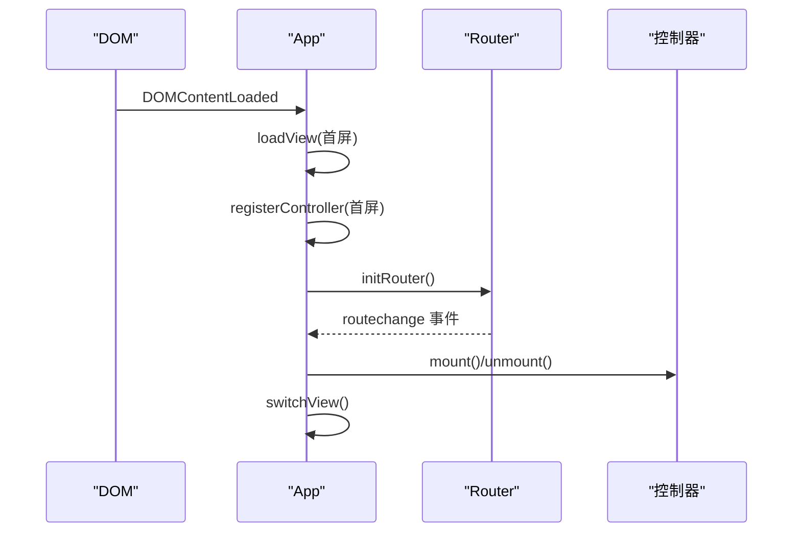
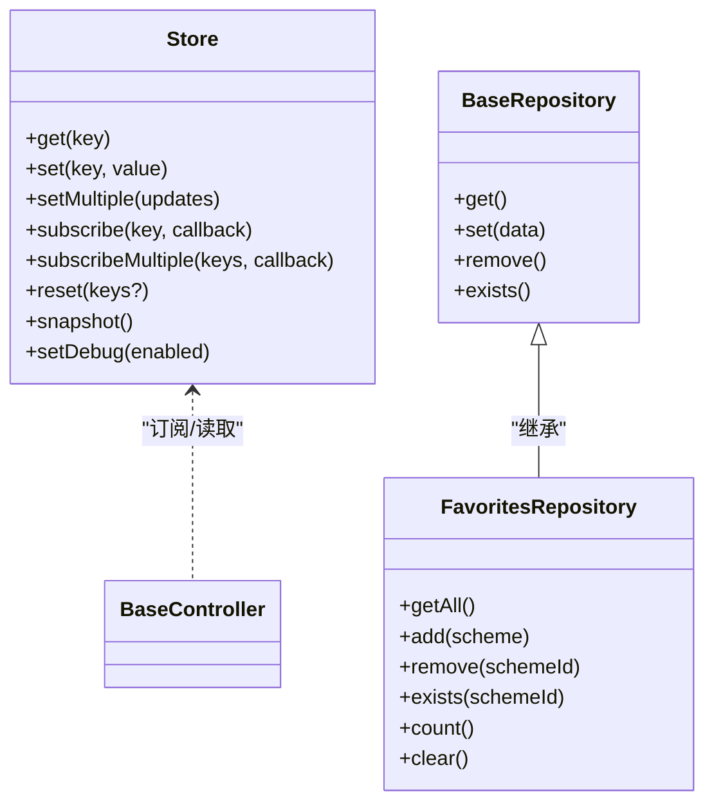
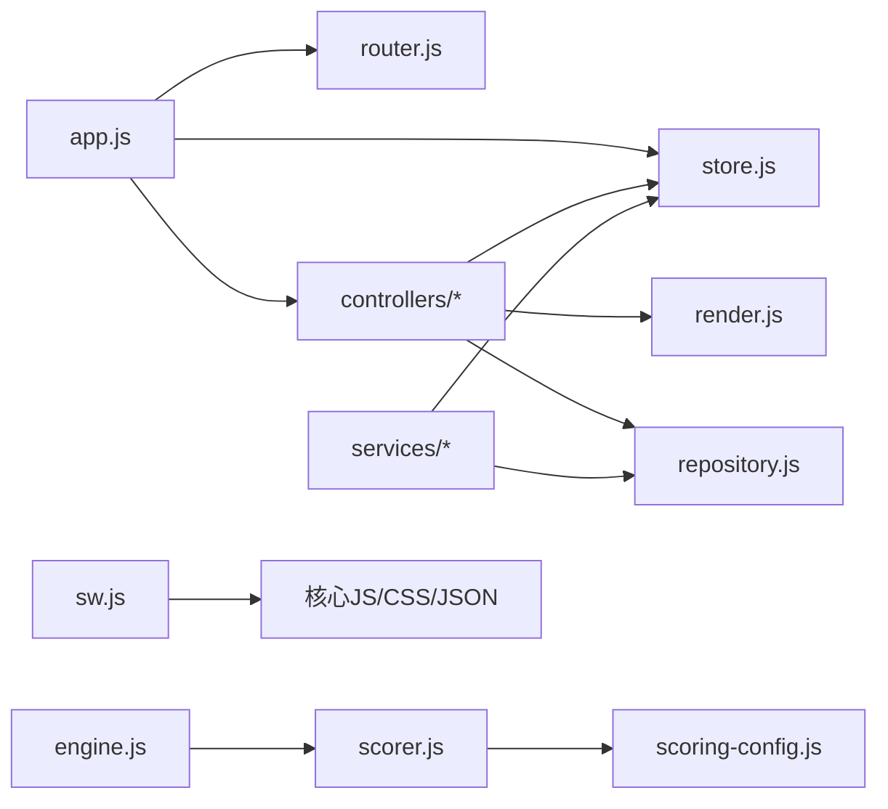

# 功能开发流程

<cite>
**本文引用的文件**
- [index.html](file://index.html)
- [app.js](file://js/core/app.js)
- [router.js](file://js/core/router.js)
- [store.js](file://js/core/store.js)
- [scorer.js](file://js/core/scorer.js)
- [scoring-config.js](file://js/core/scoring-config.js)
- [engine.js](file://js/services/engine.js)
- [repository.js](file://js/data/repository.js)
- [render.js](file://js/utils/render.js)
- [welcome.js](file://js/controllers/welcome.js)
- [results.js](file://js/controllers/results.js)
- [schemes.json](file://data/schemes.json)
- [sw.js](file://sw.js)
- [results.html](file://views/results.html)
</cite>

## 目录
1. [引言](#引言)
2. [项目结构](#项目结构)
3. [核心组件](#核心组件)
4. [架构总览](#架构总览)
5. [详细组件分析](#详细组件分析)
6. [依赖分析](#依赖分析)
7. [性能考虑](#性能考虑)
8. [故障排查指南](#故障排查指南)
9. [结论](#结论)
10. [附录](#附录)

## 引言
本指南面向开发者，提供从需求分析到功能上线的完整开发流程。围绕“基于节气与五行的穿搭推荐”这一核心业务，文档覆盖需求拆解、技术评估与可行性分析、架构设计、代码实现、测试验证、代码规范与最佳实践，以及常见问题解决方案。读者可据此快速扩展现有功能或添加新功能。

## 项目结构
项目采用前端模块化架构，按职责划分为核心层、服务层、数据层、工具层与控制器层，配合视图与静态资源，形成清晰的 MVC 风格组织。

图表来源
- [index.html](file://index.html#L1-L79)
- [app.js](file://js/core/app.js#L1-L206)
- [router.js](file://js/core/router.js#L1-L142)
- [store.js](file://js/core/store.js#L1-L212)
- [engine.js](file://js/services/engine.js#L1-L425)
- [scorer.js](file://js/core/scorer.js#L1-L317)
- [scoring-config.js](file://js/core/scoring-config.js#L1-L128)
- [repository.js](file://js/data/repository.js#L1-L394)
- [render.js](file://js/utils/render.js#L1-L487)
- [welcome.js](file://js/controllers/welcome.js#L1-L151)
- [results.js](file://js/controllers/results.js#L1-L614)
- [sw.js](file://sw.js#L1-L165)
- [results.html](file://views/results.html#L1-L128)

章节来源
- [index.html](file://index.html#L1-L79)
- [app.js](file://js/core/app.js#L1-L206)
- [router.js](file://js/core/router.js#L1-L142)
- [store.js](file://js/core/store.js#L1-L212)
- [engine.js](file://js/services/engine.js#L1-L425)
- [scorer.js](file://js/core/scorer.js#L1-L317)
- [scoring-config.js](file://js/core/scoring-config.js#L1-L128)
- [repository.js](file://js/data/repository.js#L1-L394)
- [render.js](file://js/utils/render.js#L1-L487)
- [welcome.js](file://js/controllers/welcome.js#L1-L151)
- [results.js](file://js/controllers/results.js#L1-L614)
- [sw.js](file://sw.js#L1-L165)
- [results.html](file://views/results.html#L1-L128)

## 核心组件
- 应用入口与生命周期
  - 入口文件负责注册 Service Worker、导入应用主模块并启动。
- 应用核心（App）
  - 负责视图动态加载、控制器注册与挂载、路由事件处理、全局状态注入与统计初始化。
- 路由系统（Router）
  - 提供 pushState/popstate 支持、链接拦截、路由校验与事件派发。
- 全局状态（Store）
  - 响应式状态、订阅/取消订阅、批量更新、重置与调试快照。
- 推荐引擎（Engine）
  - 数据加载、上下文构建、评分器集成、梯度推荐策略与结果组装。
- 评分器（Scorer）
  - 节气、八字、场景、天气、心愿、历史偏好、今日运势等多维评分与解释。
- 权重配置（Scoring Config）
  - 权重分配、五行相生相克、天气与温度元素映射、等级阈值。
- 数据仓库（Repository）
  - 收藏、偏好、反馈、八字、统计、上传照片等本地持久化抽象。
- 渲染工具（Render）
  - 视图切换、卡片渲染、模态框、Toast、解释卡片与上传预览。
- 控制器（Controllers）
  - 欢迎页与结果页控制器，负责事件绑定、状态订阅、交互处理与导航。

章节来源
- [app.js](file://js/core/app.js#L1-L206)
- [router.js](file://js/core/router.js#L1-L142)
- [store.js](file://js/core/store.js#L1-L212)
- [engine.js](file://js/services/engine.js#L1-L425)
- [scorer.js](file://js/core/scorer.js#L1-L317)
- [scoring-config.js](file://js/core/scoring-config.js#L1-L128)
- [repository.js](file://js/data/repository.js#L1-L394)
- [render.js](file://js/utils/render.js#L1-L487)
- [welcome.js](file://js/controllers/welcome.js#L1-L151)
- [results.js](file://js/controllers/results.js#L1-L614)

## 架构总览
应用采用前端单页架构，核心流程如下：
- 启动阶段：入口加载应用模块，初始化错误处理、路由、基础数据与统计。
- 路由驱动：路由变化触发视图加载与控制器挂载，同时更新 Store 的当前视图。
- 数据驱动：控制器订阅 Store，渲染视图并处理用户交互；服务层通过仓库与引擎提供数据与算法能力。
- 离线与缓存：Service Worker 预缓存核心资源，提供 Stale-While-Revalidate 策略。

图表来源
- [router.js](file://js/core/router.js#L57-L79)
- [app.js](file://js/core/app.js#L145-L184)
- [results.js](file://js/controllers/results.js#L20-L46)
- [engine.js](file://js/services/engine.js#L323-L393)
- [repository.js](file://js/data/repository.js#L380-L385)

## 详细组件分析

### 组件A：推荐引擎（Engine）与评分器（Scorer）
- 设计要点
  - 引擎负责数据加载、上下文构建与梯度推荐策略；评分器封装评分逻辑，便于单元测试与复用。
  - 权重配置模块提供动态权重与五行关系映射，支持冷启动与无八字场景。
- 数据流
  - 引擎加载方案、心愿模板、八字模板；构建上下文（节气、天气、场景、心愿、运势）；评分器批量评分并排序；选择最佳/替代/平衡/补充方案。
- 复杂度与性能
  - 评分复杂度与方案数量线性相关；通过缓存与异步加载优化首屏体验。
- 错误处理
  - 引擎对外部天气数据进行容错处理，保证推荐链路可用。

图表来源
- [engine.js](file://js/services/engine.js#L323-L393)
- [scorer.js](file://js/core/scorer.js#L266-L276)
- [scoring-config.js](file://js/core/scoring-config.js#L74-L92)

章节来源
- [engine.js](file://js/services/engine.js#L1-L425)
- [scorer.js](file://js/core/scorer.js#L1-L317)
- [scoring-config.js](file://js/core/scoring-config.js#L1-L128)
- [schemes.json](file://data/schemes.json#L1-L200)

### 组件B：控制器（ResultsController）与视图（results.html）
- 设计要点
  - 控制器负责渲染结果页、绑定事件、处理收藏/分享/反馈、打开详情模态框、记录用户偏好与反馈。
  - 视图提供卡片区域、运势卡片、天气影响区、反馈弹窗等结构。
- 交互流程
  - 用户点击“查看详解”打开详情模态框；点击“收藏/分享/采纳/不喜欢”执行相应动作并更新状态与本地存储。
- 可扩展性
  - 可新增“换一批”逻辑，调用引擎重新生成推荐；可接入更多场景与心愿模板。

图表来源
- [results.js](file://js/controllers/results.js#L366-L490)
- [render.js](file://js/utils/render.js#L324-L365)
- [repository.js](file://js/data/repository.js#L86-L146)

章节来源
- [results.js](file://js/controllers/results.js#L1-L614)
- [results.html](file://views/results.html#L1-L128)
- [render.js](file://js/utils/render.js#L1-L487)
- [repository.js](file://js/data/repository.js#L1-L394)

### 组件C：应用初始化与路由（App + Router）
- 设计要点
  - App 负责视图预加载、控制器注册、路由事件处理与视图切换；Router 提供 pushState/popstate、链接拦截与路由校验。
- 生命周期
  - DOMContentLoaded -> App.init -> 预加载首屏视图 -> 注册控制器 -> 初始化路由 -> 触发首屏渲染。
- 可靠性
  - 路由变化触发控制器卸载/挂载，避免内存泄漏；错误处理模块包裹关键异步操作。

图表来源
- [app.js](file://js/core/app.js#L201-L205)
- [app.js](file://js/core/app.js#L47-L73)
- [app.js](file://js/core/app.js#L145-L184)
- [router.js](file://js/core/router.js#L25-L50)

章节来源
- [app.js](file://js/core/app.js#L1-L206)
- [router.js](file://js/core/router.js#L1-L142)

### 组件D：全局状态（Store）与数据仓库（Repository）
- 设计要点
  - Store 提供响应式状态与订阅机制；Repository 抽象本地存储，统一键名与 CRUD 操作。
- 使用模式
  - 控制器通过 subscribe 订阅状态变化；服务层通过仓库读写偏好、收藏、统计等数据。
- 可维护性
  - 状态键名常量化，避免魔法字符串；仓库方法幂等，支持存在性检查与批量操作。

图表来源
- [store.js](file://js/core/store.js#L30-L187)
- [repository.js](file://js/data/repository.js#L46-L146)

章节来源
- [store.js](file://js/core/store.js#L1-L212)
- [repository.js](file://js/data/repository.js#L1-L394)

## 依赖分析
- 模块耦合
  - App 与 Router/Store/Controller 高内聚；服务层与数据层通过仓库解耦；渲染工具与控制器弱耦合。
- 外部依赖
  - Service Worker 预缓存核心脚本与数据文件；字体资源来自 CDN。
- 循环依赖
  - 未发现循环依赖迹象；各层职责清晰，导入方向单向。

图表来源
- [app.js](file://js/core/app.js#L6-L21)
- [router.js](file://js/core/router.js#L6-L7)
- [store.js](file://js/core/store.js#L6-L7)
- [engine.js](file://js/services/engine.js#L6-L12)
- [scorer.js](file://js/core/scorer.js#L6-L12)
- [scoring-config.js](file://js/core/scoring-config.js#L6-L12)
- [repository.js](file://js/data/repository.js#L6-L7)
- [render.js](file://js/utils/render.js#L5-L8)
- [sw.js](file://sw.js#L8-L47)

章节来源
- [app.js](file://js/core/app.js#L1-L206)
- [router.js](file://js/core/router.js#L1-L142)
- [store.js](file://js/core/store.js#L1-L212)
- [engine.js](file://js/services/engine.js#L1-L425)
- [scorer.js](file://js/core/scorer.js#L1-L317)
- [scoring-config.js](file://js/core/scoring-config.js#L1-L128)
- [repository.js](file://js/data/repository.js#L1-L394)
- [render.js](file://js/utils/render.js#L1-L487)
- [sw.js](file://sw.js#L1-L165)

## 性能考虑
- 首屏优化
  - App 预加载首屏视图与控制器，减少首次切换延迟。
  - Service Worker 预缓存核心资源，提升离线与弱网体验。
- 渲染性能
  - 渲染工具按索引添加动画延迟，避免大量 DOM 同步插入造成卡顿。
  - 评分器使用缓存，避免重复计算。
- 数据加载
  - 引擎并行加载方案、模板与天气数据，缩短等待时间。
- 存储与缓存
  - 仓库统一键名与序列化，减少异常开销；Service Worker 采用 Stale-While-Revalidate，兼顾新鲜度与性能。

[本节为通用性能讨论，无需列出具体文件来源]

## 故障排查指南
- 路由不生效或页面空白
  - 检查路由配置与导航调用；确认 App 已初始化并注册控制器；核对视图文件路径。
- 推荐结果为空或异常
  - 检查数据加载（方案/模板/天气）是否成功；确认 Store 中当前结果状态；查看评分器权重与上下文构建。
- 收藏/偏好未生效
  - 检查仓库方法调用与键名一致性；确认本地存储可用；查看控制器中按钮状态更新逻辑。
- 离线无法访问
  - 检查 Service Worker 注册与缓存版本；确认预缓存资源列表包含所需文件。
- Toast/模态框不显示
  - 检查渲染工具调用与 DOM 容器存在性；确认事件绑定未被重复覆盖。

章节来源
- [router.js](file://js/core/router.js#L25-L50)
- [app.js](file://js/core/app.js#L47-L73)
- [engine.js](file://js/services/engine.js#L323-L393)
- [repository.js](file://js/data/repository.js#L24-L41)
- [render.js](file://js/utils/render.js#L457-L487)
- [sw.js](file://sw.js#L52-L69)

## 结论
本项目以清晰的模块划分与稳定的 MVC 架构实现了“基于节气与五行”的穿搭推荐功能。遵循本文提供的开发流程与最佳实践，开发者可高效完成需求分析、架构设计、代码实现与测试验证，并在此基础上持续扩展新功能与优化用户体验。

[本节为总结性内容，无需列出具体文件来源]

## 附录

### A. 需求分析方法与工作清单
- 功能分解
  - 明确用户旅程：欢迎页 → 选择心愿/画像 → 结果页 → 收藏/分享/反馈 → 穿搭日记/上传。
  - 拆分视图与控制器职责，确保单一职责与可测试性。
- 技术评估
  - 前端单页架构、Service Worker 离线缓存、本地存储、异步数据加载。
- 可行性分析
  - 评分器与引擎已具备可扩展性；仓库层支持新增数据模型；视图层支持新增交互。

[本节为概念性内容，无需列出具体文件来源]

### B. 架构设计步骤
- 组件设计
  - 新增控制器：继承 BaseController，实现 mount/bindEvents/subscribeStore/onMount/onUnmount。
  - 新增服务：封装业务逻辑，通过仓库与引擎协作。
- 接口定义
  - 控制器与服务之间通过 Store 与事件通信；服务内部通过仓库读写数据。
- 数据流规划
  - 输入：路由参数、用户输入、外部数据（天气/模板）。
  - 处理：引擎评分与选择；仓库持久化；渲染工具输出。
  - 输出：视图更新、模态框、Toast 提示。

[本节为概念性内容，无需列出具体文件来源]

### C. 代码实现流程
- 控制器开发
  - 在 App 视图配置中注册新视图与控制器；在 Router 中添加路由映射；在视图中预留容器与交互元素。
- 服务层集成
  - 在引擎中新增数据加载与上下文构建；在评分器中新增评分维度或权重调整。
- UI 组件编写
  - 使用渲染工具生成卡片/模态框/Toast；确保事件委托与状态订阅正确绑定。

[本节为概念性内容，无需列出具体文件来源]

### D. 开发示例（扩展现有功能）
- 示例1：新增“换一批”功能
  - 在结果页视图添加按钮；在控制器中绑定点击事件，调用引擎重新生成推荐并更新视图。
  - 参考路径：[results.html](file://views/results.html#L75-L81)、[results.js](file://js/controllers/results.js#L361-L364)、[engine.js](file://js/services/engine.js#L398-L421)
- 示例2：新增场景偏好
  - 在权重配置中扩展场景权重；在评分器中新增场景评分逻辑；在控制器中读取场景并传递给上下文。
  - 参考路径：[scoring-config.js](file://js/core/scoring-config.js#L7-L19)、[scorer.js](file://js/core/scorer.js#L121-L147)、[engine.js](file://js/services/engine.js#L187-L212)

[本节为示例性内容，无需列出具体文件来源]

### E. 测试验证方法
- 单元测试
  - 对评分器的评分函数与权重配置进行断言；对控制器的事件处理与状态更新进行模拟。
- 集成测试
  - 模拟路由切换与控制器生命周期；验证 Store 订阅与渲染工具的组合效果。
- 用户验收测试
  - 覆盖关键用户旅程：从进入应用到收藏/分享/反馈的全流程；检查离线场景下的可用性。

[本节为通用测试指导，无需列出具体文件来源]

### F. 代码规范与最佳实践
- 文件命名与目录
  - 按职责分层命名，避免跨层引用；控制器与视图一一对应。
- 状态管理
  - 使用 StoreKeys 常量；避免直接修改 DOM，通过状态驱动渲染。
- 错误处理
  - 包裹异步操作与存储访问；提供降级策略与用户提示。
- 性能优化
  - 使用缓存与懒加载；避免一次性渲染大量节点；合理使用事件委托。

[本节为通用规范，无需列出具体文件来源]