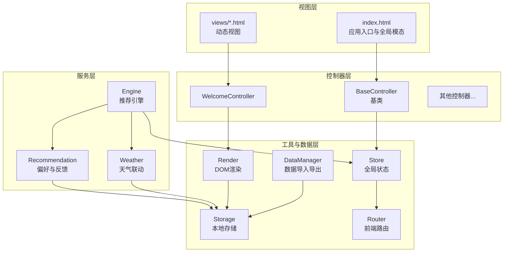
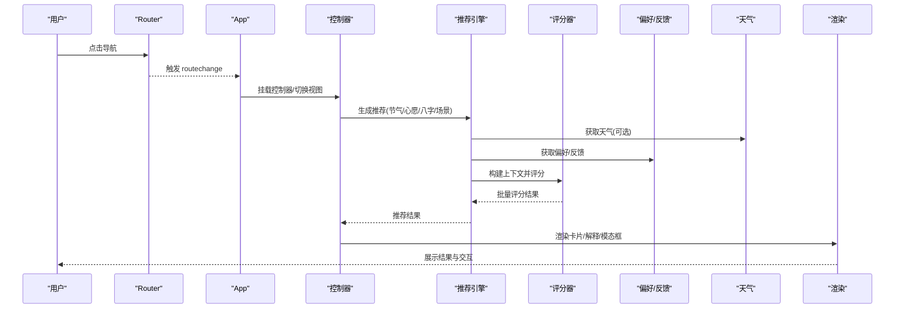
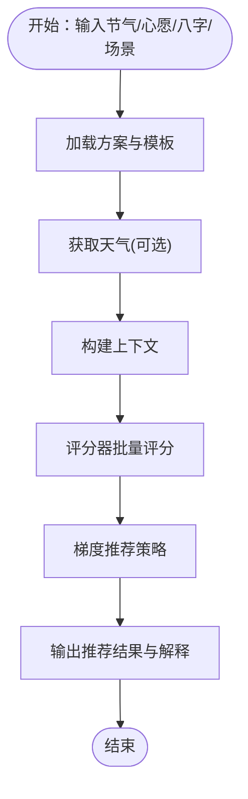
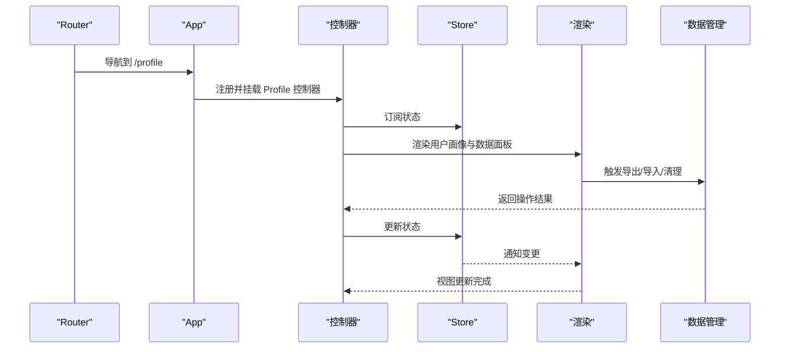
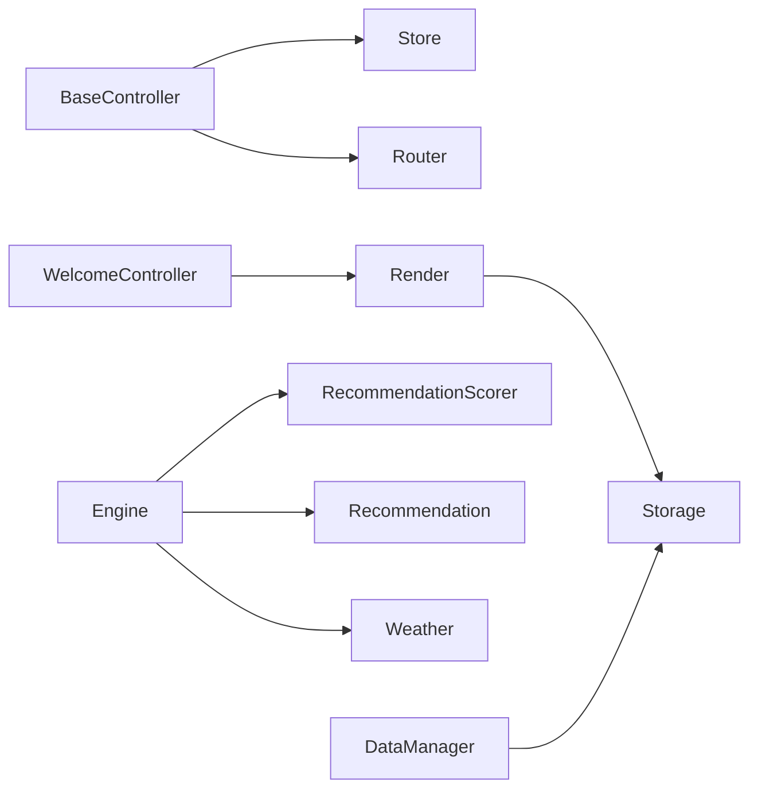

# 测试与验证

<cite>
**本文引用的文件**
- [index.html](file://index.html)
- [app.js](file://js/core/app.js)
- [router.js](file://js/core/router.js)
- [store.js](file://js/core/store.js)
- [scorer.js](file://js/core/scorer.js)
- [engine.js](file://js/services/engine.js)
- [recommendation.js](file://js/services/recommendation.js)
- [weather.js](file://js/services/weather.js)
- [render.js](file://js/utils/render.js)
- [storage.js](file://js/data/storage.js)
- [data-manager.js](file://js/data/data-manager.js)
- [welcome.js](file://js/controllers/welcome.js)
- [base.js](file://js/controllers/base.js)
</cite>

## 目录
1. [简介](#简介)
2. [项目结构](#项目结构)
3. [核心组件](#核心组件)
4. [架构总览](#架构总览)
5. [详细组件分析](#详细组件分析)
6. [依赖分析](#依赖分析)
7. [性能考虑](#性能考虑)
8. [故障排查指南](#故障排查指南)
9. [结论](#结论)
10. [附录](#附录)

## 简介
本测试与验证文档面向功能开发完成后，提供系统化的测试策略与验证方法，覆盖单元测试、集成测试与用户验收测试。文档同时给出测试用例模板、测试数据准备方法、调试技巧、性能优化建议与质量保证措施，帮助团队在前端 MVC 架构下高效落地测试。

## 项目结构
项目采用模块化组织，核心分为四层：
- 视图层：HTML 页面与动态视图容器，由应用主模块统一加载与切换
- 控制器层：各视图对应的控制器，负责生命周期、事件绑定与状态订阅
- 服务层：业务逻辑与数据处理，如推荐引擎、天气联动、用户偏好与反馈
- 工具与数据层：渲染工具、本地存储、数据导入导出与全局状态管理

图表来源
- [index.html](file://index.html#L1-L79)
- [app.js](file://js/core/app.js#L1-L206)
- [router.js](file://js/core/router.js#L1-L142)
- [store.js](file://js/core/store.js#L1-L212)
- [scorer.js](file://js/core/scorer.js#L1-L317)
- [engine.js](file://js/services/engine.js#L1-L441)
- [recommendation.js](file://js/services/recommendation.js#L1-L466)
- [weather.js](file://js/services/weather.js#L1-L340)
- [render.js](file://js/utils/render.js#L1-L487)
- [storage.js](file://js/data/storage.js#L1-L145)
- [data-manager.js](file://js/data/data-manager.js#L1-L376)
- [welcome.js](file://js/controllers/welcome.js#L1-L151)
- [base.js](file://js/controllers/base.js#L1-L131)

章节来源
- [index.html](file://index.html#L1-L79)
- [app.js](file://js/core/app.js#L1-L206)
- [router.js](file://js/core/router.js#L1-L142)
- [store.js](file://js/core/store.js#L1-L212)

## 核心组件
- 应用主模块：负责视图动态加载、控制器注册与挂载、路由事件处理、基础数据加载与统计初始化
- 路由系统：拦截链接点击、处理浏览器前进后退、更新页面标题与 Store
- 全局状态：集中管理节气、心愿、结果、收藏、UI 状态等，并提供订阅通知
- 推荐引擎：加载方案与模板、构建上下文、评分器批量评分、梯度推荐策略
- 用户偏好与反馈：记录用户行为、更新偏好、计算个性化得分、今日运势加成
- 天气联动：获取位置与天气、解析天气类型与温度、生成推荐与五行能量场
- 渲染工具：视图切换、方案卡片、解释说明、模态框、Toast、收藏列表等
- 本地存储与数据管理：封装 localStorage、导出/导入/清理、数据概览与面板渲染

章节来源
- [app.js](file://js/core/app.js#L1-L206)
- [router.js](file://js/core/router.js#L1-L142)
- [store.js](file://js/core/store.js#L1-L212)
- [engine.js](file://js/services/engine.js#L1-L441)
- [recommendation.js](file://js/services/recommendation.js#L1-L466)
- [weather.js](file://js/services/weather.js#L1-L340)
- [render.js](file://js/utils/render.js#L1-L487)
- [storage.js](file://js/data/storage.js#L1-L145)
- [data-manager.js](file://js/data/data-manager.js#L1-L376)

## 架构总览
应用采用“视图控制器 + 服务层 + 工具与数据层”的分层架构，通过全局状态与路由进行解耦协作。推荐引擎以评分器为核心，结合用户偏好、天气、场景、心愿与今日运势进行多维评分与梯度推荐；渲染工具负责将结果可视化并提供交互反馈。

图表来源
- [router.js](file://js/core/router.js#L1-L142)
- [app.js](file://js/core/app.js#L1-L206)
- [engine.js](file://js/services/engine.js#L1-L441)
- [scorer.js](file://js/core/scorer.js#L1-L317)
- [recommendation.js](file://js/services/recommendation.js#L1-L466)
- [weather.js](file://js/services/weather.js#L1-L340)
- [render.js](file://js/utils/render.js#L1-L487)

## 详细组件分析

### 控制器测试策略
目标：验证控制器生命周期、事件绑定、状态订阅与卸载行为；确保视图切换与交互正确。

- 单元测试要点
  - 基类行为：挂载/卸载、事件监听添加/移除、Store 订阅/取消订阅、状态读写
  - 具体控制器：WelcomeController 的 DOM 更新、事件绑定与导航跳转
- 测试用例模板
  - 准备：创建控制器实例、模拟 DOM 容器、注入假 Store 与 Router
  - 行为：调用 mount、触发事件、断言 DOM 更新与回调调用
  - 清理：调用 unmount，断言事件与订阅被移除
- 关键断言
  - DOM 查询与更新存在性
  - 事件监听数量与去重
  - Store 订阅回调执行次数与参数
  - 路由导航调用

章节来源
- [base.js](file://js/controllers/base.js#L1-L131)
- [welcome.js](file://js/controllers/welcome.js#L1-L151)

### 服务层测试策略
目标：验证推荐引擎、评分器、偏好反馈与天气联动的正确性与稳定性。

- 推荐引擎
  - 输入：节气信息、心愿ID、八字结果、场景ID、天气数据（可选）
  - 输出：推荐方案列表、解释明细、上下文信息
  - 断言：方案数量、类型标记、评分分布、解释维度占比
- 评分器
  - 输入：用户画像、上下文
  - 断言：各项维度得分范围、总分一致性、缓存命中、解释维度
- 偏好与反馈
  - 输入：用户行为动作与元数据
  - 断言：偏好分数累积、反馈统计、历史交互时间戳
- 天气联动
  - 输入：经纬度或位置授权
  - 断言：天气类型映射、温度等级、推荐材质/颜色、提示文案

图表来源
- [engine.js](file://js/services/engine.js#L1-L441)
- [scorer.js](file://js/core/scorer.js#L1-L317)
- [recommendation.js](file://js/services/recommendation.js#L1-L466)
- [weather.js](file://js/services/weather.js#L1-L340)

章节来源
- [engine.js](file://js/services/engine.js#L1-L441)
- [scorer.js](file://js/core/scorer.js#L1-L317)
- [recommendation.js](file://js/services/recommendation.js#L1-L466)
- [weather.js](file://js/services/weather.js#L1-L340)

### 工具函数测试策略
目标：验证渲染工具、本地存储与数据管理的正确性与健壮性。

- 渲染工具
  - 断言：视图切换、方案卡片生成、解释展开/收起、模态框开关、Toast 显示
- 本地存储
  - 断言：键前缀、序列化/反序列化、批量清理、收藏查询与去重
- 数据管理
  - 断言：导出结构完整性、版本校验、导入预览与实际导入、数据概览统计

章节来源
- [render.js](file://js/utils/render.js#L1-L487)
- [storage.js](file://js/data/storage.js#L1-L145)
- [data-manager.js](file://js/data/data-manager.js#L1-L376)

### 集成测试方案
目标：验证组件间交互、数据流与用户流程的端到端正确性。

- 组件间交互测试
  - 路由 → 控制器 → 渲染：导航后视图切换、控制器挂载、DOM 更新
  - 引擎 → 渲染：推荐结果渲染卡片、解释与模态框
  - Store → 控制器：状态变更触发 UI 更新
- 数据流测试
  - 用户偏好与反馈 → 评分器 → 推荐结果
  - 天气 → 评分器 → 推荐结果
  - 本地存储 → 控制器 → 渲染
- 用户流程测试
  - 欢迎页 → 选择心愿 → 推荐结果 → 收藏/分享/反馈
  - 我的画像 → 数据管理 → 导出/导入/清理
  - 穿戴日记 → 图片上传 → 反馈展示

图表来源
- [router.js](file://js/core/router.js#L1-L142)
- [app.js](file://js/core/app.js#L1-L206)
- [store.js](file://js/core/store.js#L1-L212)
- [render.js](file://js/utils/render.js#L1-L487)
- [data-manager.js](file://js/data/data-manager.js#L1-L376)

章节来源
- [router.js](file://js/core/router.js#L1-L142)
- [app.js](file://js/core/app.js#L1-L206)
- [store.js](file://js/core/store.js#L1-L212)
- [render.js](file://js/utils/render.js#L1-L487)
- [data-manager.js](file://js/data/data-manager.js#L1-L376)

### 用户验收测试流程
- 功能验证
  - 路由导航与标题更新、视图切换动画、控制器生命周期
  - 推荐结果的多样性与解释维度、收藏/分享/反馈闭环
  - 数据导入导出的版本兼容性与预览功能
- 性能测试
  - 首屏加载时间、视图切换延迟、渲染批处理与缓存命中
  - 天气 API 超时与降级策略、错误提示与重试
- 兼容性测试
  - 不同浏览器的地理位置授权、Service Worker 注册
  - 移动端与桌面端的交互与布局表现

## 依赖分析
- 控制器依赖全局状态与路由，通过基类统一生命周期管理
- 推荐引擎依赖评分器、偏好反馈与天气服务，形成清晰的职责边界
- 渲染工具依赖存储与解释模块，负责 UI 与交互
- 数据管理依赖安全存储封装，保障异常场景下的健壮性

图表来源
- [base.js](file://js/controllers/base.js#L1-L131)
- [store.js](file://js/core/store.js#L1-L212)
- [router.js](file://js/core/router.js#L1-L142)
- [engine.js](file://js/services/engine.js#L1-L441)
- [scorer.js](file://js/core/scorer.js#L1-L317)
- [recommendation.js](file://js/services/recommendation.js#L1-L466)
- [weather.js](file://js/services/weather.js#L1-L340)
- [render.js](file://js/utils/render.js#L1-L487)
- [data-manager.js](file://js/data/data-manager.js#L1-L376)
- [storage.js](file://js/data/storage.js#L1-L145)

章节来源
- [base.js](file://js/controllers/base.js#L1-L131)
- [engine.js](file://js/services/engine.js#L1-L441)
- [scorer.js](file://js/core/scorer.js#L1-L317)
- [recommendation.js](file://js/services/recommendation.js#L1-L466)
- [weather.js](file://js/services/weather.js#L1-L340)
- [render.js](file://js/utils/render.js#L1-L487)
- [data-manager.js](file://js/data/data-manager.js#L1-L376)
- [storage.js](file://js/data/storage.js#L1-L145)

## 性能考虑
- 渲染优化
  - 批量 DOM 更新、动画延迟与节流
  - 模态框与解释展开的按需渲染
- 状态与缓存
  - Store 的响应式代理与最小通知
  - 评分器缓存与上下文复用
- 网络与降级
  - 天气 API 超时与降级（仅节气/场景/心愿推荐）
  - 错误处理与用户提示
- 存储与体积
  - 数据导出压缩与分块处理
  - 本地存储键前缀与清理策略

## 故障排查指南
- 路由与视图
  - 现象：导航无效或视图不切换
  - 排查：确认路由配置、事件委托、popstate 处理、Store 当前视图
- 控制器生命周期
  - 现象：事件重复绑定或未移除
  - 排查：检查基类事件与订阅管理、onMount/onUnmount 调用顺序
- 推荐结果异常
  - 现象：评分异常或解释缺失
  - 排查：核对上下文构建、评分器权重、偏好与反馈数据
- 天气数据问题
  - 现象：无法获取天气或推荐异常
  - 排查：地理位置授权、API 返回结构、超时与降级逻辑
- 数据导入导出
  - 现象：版本不兼容或导入失败
  - 排查：版本号校验、JSON 解析、逐项写入与回滚

章节来源
- [router.js](file://js/core/router.js#L1-L142)
- [base.js](file://js/controllers/base.js#L1-L131)
- [engine.js](file://js/services/engine.js#L1-L441)
- [recommendation.js](file://js/services/recommendation.js#L1-L466)
- [weather.js](file://js/services/weather.js#L1-L340)
- [data-manager.js](file://js/data/data-manager.js#L1-L376)

## 结论
通过分层测试策略与端到端验证，可在功能迭代中持续保证推荐准确性、交互稳定性与数据安全性。建议将单元测试作为回归主力，配合集成测试覆盖关键流程，最终以用户验收测试确保产品体验与质量。

## 附录

### 测试用例模板
- 控制器测试模板
  - 准备：创建控制器实例、注入假 DOM、假 Store、假 Router
  - 步骤：调用 mount、触发事件、断言 DOM 与回调
  - 清理：调用 unmount、断言事件与订阅移除
- 服务层测试模板
  - 准备：构造上下文、注入假天气/偏好/反馈
  - 步骤：调用评分器或引擎、断言得分与解释
  - 清理：清理缓存与临时数据
- 工具函数测试模板
  - 准备：构造输入数据、注入假 DOM 或假存储
  - 步骤：调用函数、断言输出与副作用
  - 清理：恢复假实现或清理临时状态

### 测试数据准备方法
- 推荐引擎
  - 节气信息：包含当前节气 ID、名称与五行
  - 心愿映射：心愿 ID 到模板名称的映射
  - 八字结果：包含喜用神与最强五行
  - 场景偏好：场景到五行与材质偏好的映射
- 评分器
  - 用户画像：包含偏好分数与历史交互
  - 上下文：包含节气、天气、心愿、场景等
- 天气联动
  - 位置授权：模拟成功/失败
  - 天气 API：构造不同天气码与温度
- 数据管理
  - 导出数据：包含版本号与用户数据
  - 导入数据：构造兼容/不兼容版本与空数据