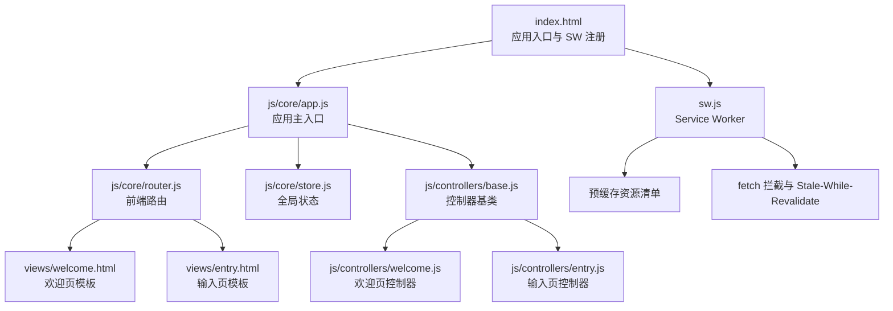
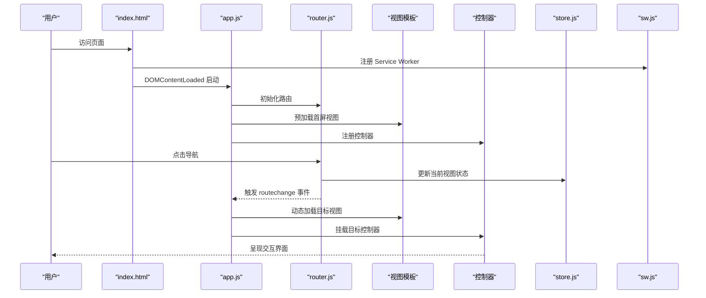
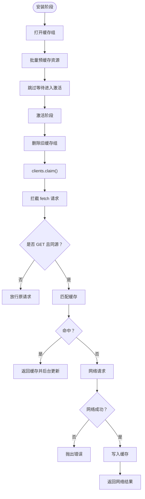
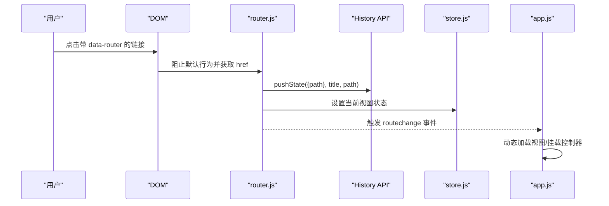
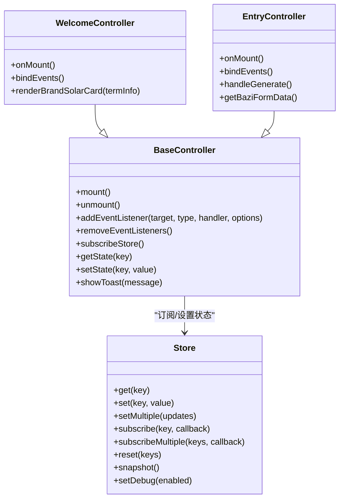
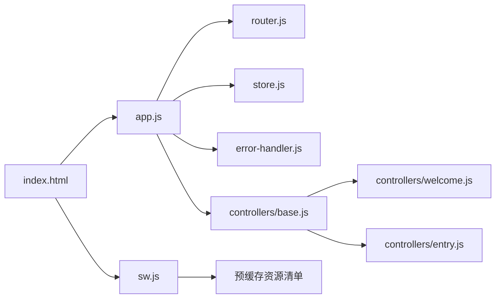

# 部署与集成

<cite>
**本文引用的文件**
- [index.html](file://index.html)
- [sw.js](file://sw.js)
- [js/core/router.js](file://js/core/router.js)
- [js/core/app.js](file://js/core/app.js)
- [js/core/store.js](file://js/core/store.js)
- [js/core/error-handler.js](file://js/core/error-handler.js)
- [js/controllers/base.js](file://js/controllers/base.js)
- [js/controllers/welcome.js](file://js/controllers/welcome.js)
- [js/controllers/entry.js](file://js/controllers/entry.js)
- [views/welcome.html](file://views/welcome.html)
- [views/entry.html](file://views/entry.html)
- [data/schemes.json](file://data/schemes.json)
</cite>

## 目录
1. [简介](#简介)
2. [项目结构](#项目结构)
3. [核心组件](#核心组件)
4. [架构总览](#架构总览)
5. [详细组件分析](#详细组件分析)
6. [依赖关系分析](#依赖关系分析)
7. [性能考量](#性能考量)
8. [故障排查指南](#故障排查指南)
9. [结论](#结论)
10. [附录](#附录)

## 简介
本指南面向功能开发完成后的部署与系统集成，重点涵盖：
- PWA 功能集成：Service Worker 配置、缓存策略与离线能力验证
- 路由系统集成：新增页面路由配置、导航菜单更新与 URL 管理
- 模块间集成：数据共享、事件通信与状态同步
- 部署检查清单与上线流程
- 版本管理、回滚策略与监控方案

## 项目结构
该前端应用采用模块化架构，核心由入口页面、路由系统、状态管理、控制器层与视图模板组成，并通过 Service Worker 提供 PWA 能力。

图表来源
- [index.html](file://index.html#L63-L76)
- [js/core/app.js](file://js/core/app.js#L1-L206)
- [js/core/router.js](file://js/core/router.js#L1-L142)
- [js/core/store.js](file://js/core/store.js#L1-L212)
- [js/controllers/base.js](file://js/controllers/base.js#L1-L131)
- [js/controllers/welcome.js](file://js/controllers/welcome.js#L1-L151)
- [js/controllers/entry.js](file://js/controllers/entry.js#L1-L241)
- [views/welcome.html](file://views/welcome.html#L1-L34)
- [views/entry.html](file://views/entry.html#L1-L234)
- [sw.js](file://sw.js#L1-L165)

章节来源
- [index.html](file://index.html#L1-L79)
- [js/core/app.js](file://js/core/app.js#L1-L206)

## 核心组件
- 应用入口与启动：通过入口页面注册 Service Worker 并在 DOMContentLoaded 时启动应用。
- 路由系统：基于浏览器 History API 的 SPA 路由，支持 popstate、链接拦截与路由事件。
- 状态管理：集中式 Store，提供响应式状态、订阅机制与调试快照。
- 控制器层：每个视图对应一个控制器，负责生命周期、事件绑定与状态订阅。
- Service Worker：预缓存核心资源，fetch 拦截采用缓存优先与后台更新策略，支持 skipWaiting。

章节来源
- [index.html](file://index.html#L58-L76)
- [js/core/router.js](file://js/core/router.js#L1-L142)
- [js/core/store.js](file://js/core/store.js#L1-L212)
- [js/controllers/base.js](file://js/controllers/base.js#L1-L131)
- [sw.js](file://sw.js#L1-L165)

## 架构总览
应用采用“入口页面 + 模块化 JS + 视图模板 + SW”的结构，通过路由驱动视图切换，控制器负责交互逻辑，Store 统一管理状态，SW 提供离线与性能优化。

图表来源
- [index.html](file://index.html#L58-L76)
- [js/core/app.js](file://js/core/app.js#L47-L73)
- [js/core/router.js](file://js/core/router.js#L25-L50)
- [js/core/store.js](file://js/core/store.js#L79-L81)

## 详细组件分析

### Service Worker 集成与 PWA 配置
- 预缓存清单：包含 HTML、CSS、JS、数据文件等核心资源，确保首次加载与离线可用。
- 缓存策略：安装阶段预缓存；激活阶段清理旧缓存；fetch 阶段采用缓存优先，命中后后台更新，未命中走网络并缓存。
- 消息协议：支持外部消息触发 skipWaiting，便于灰度发布后快速生效。

图表来源
- [sw.js](file://sw.js#L52-L155)

章节来源
- [sw.js](file://sw.js#L1-L165)

### 路由系统集成
- 路由配置：定义路径到视图与标题的映射，支持初始路径校验与未知路径重定向。
- 导航控制：拦截带 data-router 的链接，使用 pushState 更新历史与 URL，派发 routechange 事件。
- 路由工具：提供当前路由查询、有效性检查、返回上一页与链接生成辅助。

图表来源
- [js/core/router.js](file://js/core/router.js#L42-L79)
- [js/core/store.js](file://js/core/store.js#L79-L81)
- [js/core/app.js](file://js/core/app.js#L145-L168)

章节来源
- [js/core/router.js](file://js/core/router.js#L1-L142)
- [js/core/app.js](file://js/core/app.js#L145-L168)

### 状态管理与控制器集成
- Store：集中管理节气、用户输入、推荐结果、收藏、UI 状态等，提供响应式 set/get、多键订阅与快照。
- 控制器基类：统一生命周期（mount/unmount）、事件绑定与清理、Store 订阅与取消。
- 控制器示例：欢迎页渲染节气信息，输入页处理场景/心愿/八字输入并生成推荐结果。

图表来源
- [js/core/store.js](file://js/core/store.js#L30-L187)
- [js/controllers/base.js](file://js/controllers/base.js#L11-L131)
- [js/controllers/welcome.js](file://js/controllers/welcome.js#L13-L151)
- [js/controllers/entry.js](file://js/controllers/entry.js#L14-L241)

章节来源
- [js/core/store.js](file://js/core/store.js#L1-L212)
- [js/controllers/base.js](file://js/controllers/base.js#L1-L131)
- [js/controllers/welcome.js](file://js/controllers/welcome.js#L1-L151)
- [js/controllers/entry.js](file://js/controllers/entry.js#L1-L241)

### 视图与数据集成
- 视图模板：欢迎页与输入页分别位于 views 目录，通过 app.js 在路由切换时动态加载。
- 数据文件：scheme 数据用于推荐生成，配合服务层与控制器使用。
- 事件与交互：控制器在 onMount 后绑定事件，处理用户输入并更新 Store，驱动 UI 更新。

章节来源
- [views/welcome.html](file://views/welcome.html#L1-L34)
- [views/entry.html](file://views/entry.html#L1-L234)
- [data/schemes.json](file://data/schemes.json#L1-L509)

## 依赖关系分析
- 入口依赖：index.html 依赖 app.js 与 sw.js；app.js 依赖 router、store、error-handler 以及各控制器。
- 路由依赖：router 依赖 store；app.js 依赖 router 与 store。
- 控制器依赖：控制器依赖 store、router、utils 与 services。
- SW 依赖：sw.js 预缓存清单包含所有核心 JS/CSS/HTML/JSON 文件。

图表来源
- [index.html](file://index.html#L58-L76)
- [js/core/app.js](file://js/core/app.js#L6-L21)
- [js/core/router.js](file://js/core/router.js#L6)
- [js/core/store.js](file://js/core/store.js#L6)
- [js/core/error-handler.js](file://js/core/error-handler.js#L5)
- [js/controllers/base.js](file://js/controllers/base.js#L6)
- [js/controllers/welcome.js](file://js/controllers/welcome.js#L5)
- [js/controllers/entry.js](file://js/controllers/entry.js#L5)
- [sw.js](file://sw.js#L8-L47)

章节来源
- [index.html](file://index.html#L1-L79)
- [js/core/app.js](file://js/core/app.js#L1-L206)
- [sw.js](file://sw.js#L1-L165)

## 性能考量
- 预缓存与离线：SW 预缓存核心资源，显著降低首屏加载与离线可用性。
- Stale-While-Revalidate：命中缓存立即返回，后台异步更新，兼顾速度与新鲜度。
- 懒加载视图：app.js 在路由切换时按需加载视图与控制器，减少初始包体积。
- 网络超时与错误：withErrorHandler 与 safeFetch 提供统一超时与错误处理，避免阻塞与崩溃。

章节来源
- [sw.js](file://sw.js#L112-L154)
- [js/core/app.js](file://js/core/app.js#L79-L104)
- [js/core/error-handler.js](file://js/core/error-handler.js#L101-L133)

## 故障排查指南
- Service Worker 注册失败：检查 sw.js 路径与同源策略，确认浏览器控制台错误。
- 预缓存失败：核对 PRECACHE_ASSETS 列表中的资源是否存在，关注激活阶段删除旧缓存的日志。
- 路由无效：确认 ROUTES 中是否存在目标路径，检查 data-router 链接与 popstate 事件。
- 状态不更新：检查 store.set 调用与订阅回调是否正确，使用 snapshot 辅助调试。
- 网络请求异常：使用 withErrorHandler 包裹异步调用，查看 safeFetch 的超时与错误类型。

章节来源
- [index.html](file://index.html#L63-L76)
- [sw.js](file://sw.js#L52-L94)
- [js/core/router.js](file://js/core/router.js#L25-L50)
- [js/core/store.js](file://js/core/store.js#L176-L187)
- [js/core/error-handler.js](file://js/core/error-handler.js#L45-L79)

## 结论
该应用已具备完善的前端模块化架构与 PWA 能力，通过路由驱动视图切换、控制器管理交互、Store 统一状态，结合 SW 的预缓存与 fetch 拦截，实现了良好的离线体验与性能表现。后续可在现有基础上扩展新页面路由、完善导航菜单与 URL 管理，并建立标准化的部署与监控流程。

## 附录

### 新增页面路由配置步骤
- 在路由配置中添加新路径与视图映射。
- 在 app.js 的 VIEW_CONFIG 中注册对应视图与控制器。
- 在入口页面或导航模板中添加 data-router 链接。
- 如需离线可用，将新页面所需静态资源加入 sw.js 预缓存清单。

章节来源
- [js/core/router.js](file://js/core/router.js#L9-L17)
- [js/core/app.js](file://js/core/app.js#L23-L31)
- [index.html](file://index.html#L18-L20)
- [sw.js](file://sw.js#L8-L47)

### 导航菜单更新与 URL 管理
- 使用 router.createRouteLink 生成带 data-router 的链接，自动注入样式与图标。
- 通过 navigateTo 更新历史与标题，保持 URL 与应用状态一致。
- 对于外部链接，避免使用 data-router，以免干扰内部路由。

章节来源
- [js/core/router.js](file://js/core/router.js#L137-L141)
- [js/core/router.js](file://js/core/router.js#L57-L79)

### 与其他模块的集成方法
- 数据共享：通过 store.setMultiple 批量更新状态，控制器间通过订阅实现解耦。
- 事件通信：路由变化触发 routechange 事件，控制器监听并执行相应逻辑。
- 状态同步：控制器在 onMount 订阅所需状态键，onUnmount 取消订阅，避免内存泄漏。

章节来源
- [js/core/store.js](file://js/core/store.js#L87-L124)
- [js/controllers/base.js](file://js/controllers/base.js#L92-L103)
- [js/core/app.js](file://js/core/app.js#L145-L168)

### 部署检查清单
- 代码构建与压缩：确保静态资源路径正确，CDN 与本地资源均能访问。
- Service Worker：确认 sw.js 路径、scope 与注册时机，测试离线缓存命中。
- 预缓存清单：核对 PRECACHE_ASSETS 是否包含新增页面与依赖资源。
- 路由与导航：验证所有 data-router 链接与 popstate 行为。
- 错误处理：检查 withErrorHandler 与 safeFetch 的使用，确保异常提示与日志输出。
- 性能指标：测量首屏加载时间、SW 缓存命中率与交互延迟。

章节来源
- [sw.js](file://sw.js#L8-L47)
- [js/core/error-handler.js](file://js/core/error-handler.js#L45-L79)

### 上线流程
- 灰度发布：先在小范围用户开放，观察错误率与性能指标。
- 主版本升级：更新 sw.js 中的缓存组名，触发新缓存与激活清理。
- 回滚策略：若问题严重，回退到上一版本的 sw.js 与静态资源。
- 监控方案：记录路由切换次数、控制器挂载/卸载、Store 状态变更与网络请求错误。

章节来源
- [sw.js](file://sw.js#L5-L6)
- [js/core/app.js](file://js/core/app.js#L145-L168)
- [js/core/store.js](file://js/core/store.js#L130-L141)
- [js/core/error-handler.js](file://js/core/error-handler.js#L168-L189)