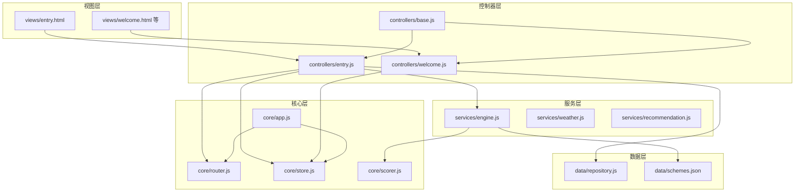
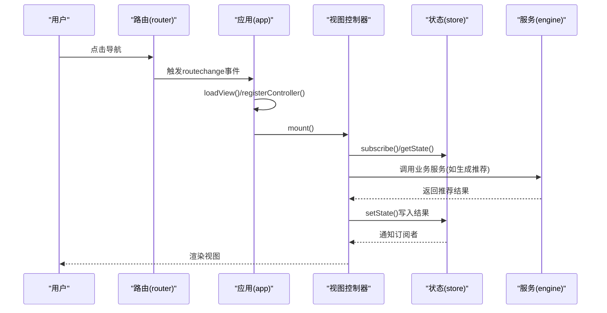
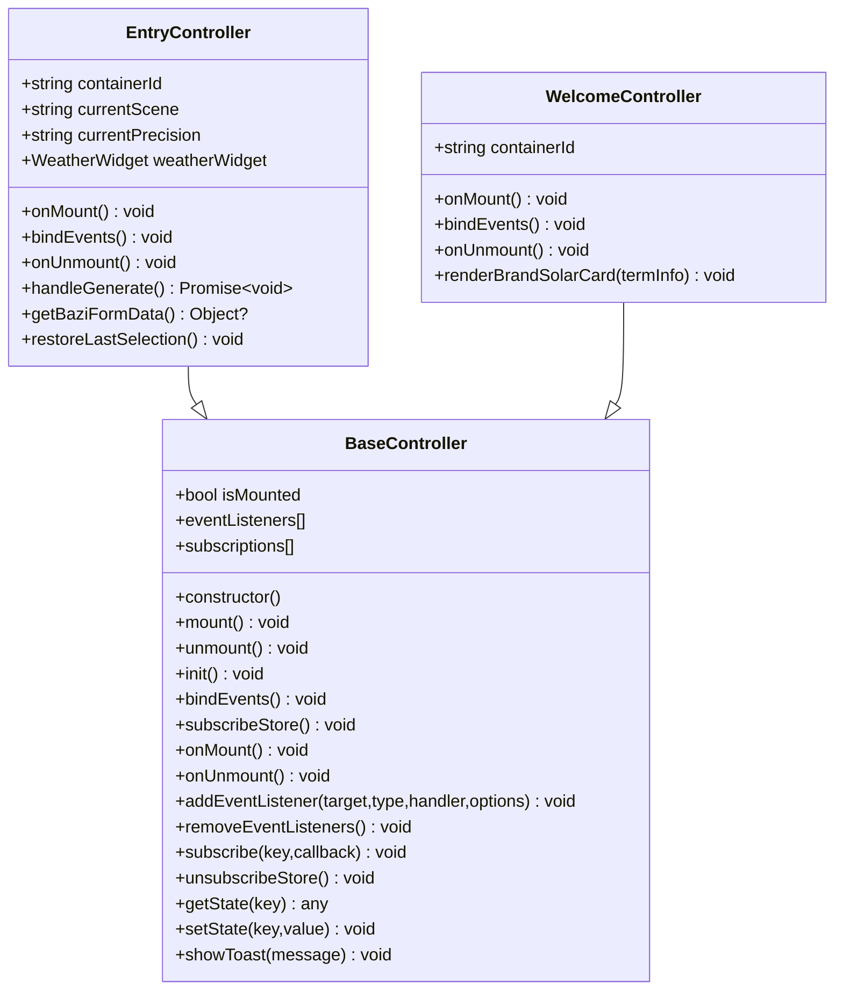
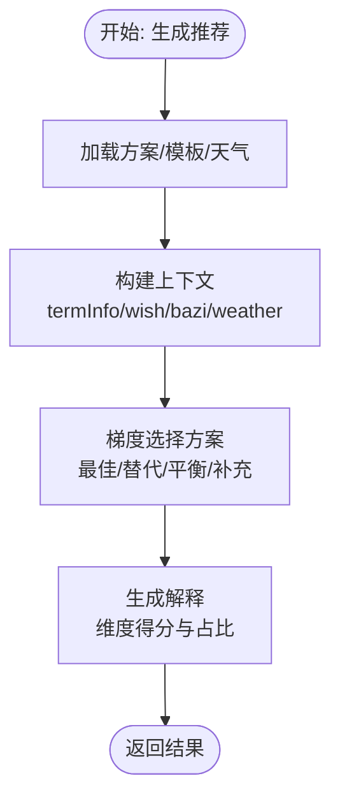
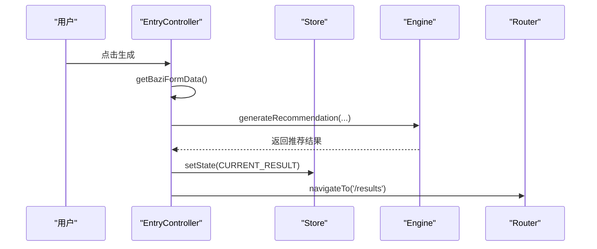
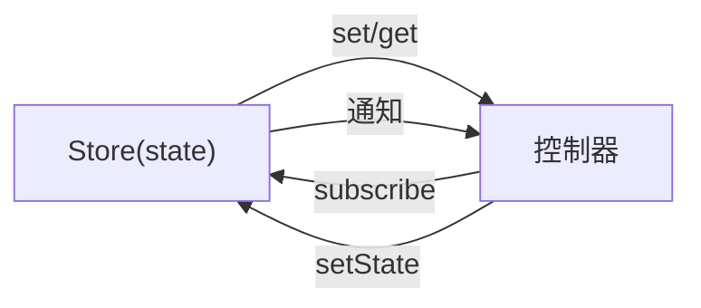
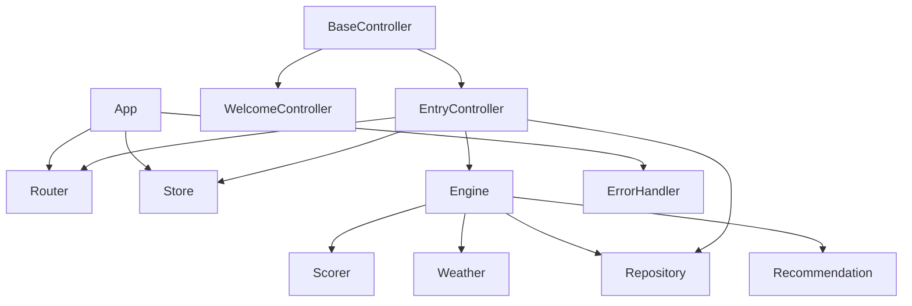

# 需求分析与设计

<cite>
**本文档引用的文件**
- [js/controllers/base.js](file://js/controllers/base.js)
- [js/core/app.js](file://js/core/app.js)
- [js/core/router.js](file://js/core/router.js)
- [js/core/store.js](file://js/core/store.js)
- [js/core/scorer.js](file://js/core/scorer.js)
- [js/controllers/entry.js](file://js/controllers/entry.js)
- [js/controllers/welcome.js](file://js/controllers/welcome.js)
- [js/data/repository.js](file://js/data/repository.js)
- [js/services/engine.js](file://js/services/engine.js)
- [js/utils/render.js](file://js/utils/render.js)
- [data/schemes.json](file://data/schemes.json)
- [views/entry.html](file://views/entry.html)
- [index.html](file://index.html)
</cite>

## 目录
1. [引言](#引言)
2. [项目结构](#项目结构)
3. [核心组件](#核心组件)
4. [架构概览](#架构概览)
5. [详细组件分析](#详细组件分析)
6. [依赖分析](#依赖分析)
7. [性能考虑](#性能考虑)
8. [故障排查指南](#故障排查指南)
9. [结论](#结论)
10. [附录](#附录)

## 引言
本文件面向功能开发前的需求分析与设计阶段，结合现有代码库的架构与实现，系统阐述需求收集、功能分解、技术评估与设计落地的方法论，并以BaseController模式为范例，给出可复用的设计模板与评审标准，帮助团队在保持一致性的同时高效交付高质量功能。

## 项目结构
该项目采用前端模块化架构，围绕“视图-控制器-服务-数据”分层组织：
- 视图层：HTML片段按视图拆分，动态加载到应用容器
- 控制器层：每个视图对应一个控制器，负责生命周期、事件绑定与状态交互
- 核心层：应用入口、路由、状态管理、评分器
- 服务层：推荐引擎、天气、解释说明、节气等业务服务
- 数据层：仓储抽象与本地存储封装
- 工具层：DOM渲染、分享、上传等辅助能力

图表来源
- [js/core/app.js](file://js/core/app.js#L23-L31)
- [js/core/router.js](file://js/core/router.js#L9-L17)
- [js/core/store.js](file://js/core/store.js#L33-L51)
- [js/controllers/base.js](file://js/controllers/base.js#L11-L16)
- [js/controllers/entry.js](file://js/controllers/entry.js#L14-L21)
- [js/controllers/welcome.js](file://js/controllers/welcome.js#L13-L17)
- [js/services/engine.js](file://js/services/engine.js#L60-L85)
- [js/data/repository.js](file://js/data/repository.js#L8-L21)

章节来源
- [index.html](file://index.html#L18-L20)
- [js/core/app.js](file://js/core/app.js#L23-L31)

## 核心组件
- 应用入口与路由协调：负责视图动态加载、路由监听与控制器生命周期调度
- 控制器基类：统一挂载/卸载、事件绑定、状态订阅与工具方法
- 全局状态管理：集中式响应式状态，支持订阅与批量更新
- 推荐评分器：封装评分维度与权重，支持缓存与解释输出
- 数据仓储：抽象本地存储，提供收藏、偏好、统计等仓库
- 推荐引擎：加载方案与模板、构建上下文、梯度选择方案

章节来源
- [js/core/app.js](file://js/core/app.js#L36-L73)
- [js/controllers/base.js](file://js/controllers/base.js#L11-L131)
- [js/core/store.js](file://js/core/store.js#L30-L187)
- [js/core/scorer.js](file://js/core/scorer.js#L14-L317)
- [js/data/repository.js](file://js/data/repository.js#L46-L394)
- [js/services/engine.js](file://js/services/engine.js#L323-L393)

## 架构概览
整体采用“视图-控制器-服务-数据”的分层架构，配合事件驱动与状态驱动的控制流：
- 视图通过控制器挂载，控制器通过路由与状态管理协调业务
- 服务层负责复杂算法与外部数据整合，数据层负责持久化与缓存
- 控制器通过状态订阅感知状态变化，通过事件绑定响应用户交互

图表来源
- [js/core/router.js](file://js/core/router.js#L57-L79)
- [js/core/app.js](file://js/core/app.js#L145-L168)
- [js/controllers/base.js](file://js/controllers/base.js#L21-L67)
- [js/services/engine.js](file://js/services/engine.js#L323-L393)

## 详细组件分析

### BaseController 模式与新功能设计范式
BaseController 提供了统一的生命周期与基础设施，新功能应遵循以下设计原则：
- 继承 BaseController，覆盖 init/onMount/onUnmount/bindEvents/subscribeStore 等钩子
- 在 onMount 中获取容器并绑定事件；在 onUnmount 中清理事件与订阅
- 通过 setState/getState 与 store 交互，避免直接操作 DOM
- 通过 subscribe 订阅状态变化，确保视图自动更新

图表来源
- [js/controllers/base.js](file://js/controllers/base.js#L11-L131)
- [js/controllers/entry.js](file://js/controllers/entry.js#L14-L52)
- [js/controllers/welcome.js](file://js/controllers/welcome.js#L13-L35)

章节来源
- [js/controllers/base.js](file://js/controllers/base.js#L11-L131)
- [js/controllers/entry.js](file://js/controllers/entry.js#L14-L241)
- [js/controllers/welcome.js](file://js/controllers/welcome.js#L13-L151)

### 推荐引擎与评分器
推荐引擎负责加载方案与模板、构建上下文、选择方案并返回解释；评分器封装评分维度与权重，支持缓存与解释输出。

图表来源
- [js/services/engine.js](file://js/services/engine.js#L323-L393)
- [js/core/scorer.js](file://js/core/scorer.js#L266-L276)

章节来源
- [js/services/engine.js](file://js/services/engine.js#L323-L421)
- [js/core/scorer.js](file://js/core/scorer.js#L14-L317)

### 视图与控制器交互流程（以输入页为例）
输入页通过控制器绑定场景、心愿、八字输入，调用引擎生成推荐并跳转结果页。

图表来源
- [js/controllers/entry.js](file://js/controllers/entry.js#L131-L189)
- [js/services/engine.js](file://js/services/engine.js#L323-L393)
- [js/core/router.js](file://js/core/router.js#L57-L79)

章节来源
- [js/controllers/entry.js](file://js/controllers/entry.js#L131-L189)
- [views/entry.html](file://views/entry.html#L1-L234)

### 状态管理与数据流
应用通过集中式状态管理实现跨组件通信，控制器通过订阅状态变化驱动视图更新。

图表来源
- [js/core/store.js](file://js/core/store.js#L30-L187)
- [js/controllers/base.js](file://js/controllers/base.js#L92-L120)

章节来源
- [js/core/store.js](file://js/core/store.js#L30-L187)
- [js/controllers/base.js](file://js/controllers/base.js#L92-L120)

## 依赖分析
- 控制器依赖：BaseController、路由、状态、服务与工具
- 应用依赖：路由、状态、错误处理、数据仓库与渲染工具
- 引擎依赖：评分器、天气服务、推荐服务、数据仓库
- 数据层依赖：安全存储封装与仓储实例

图表来源
- [js/controllers/base.js](file://js/controllers/base.js#L6-L16)
- [js/controllers/entry.js](file://js/controllers/entry.js#L5-L12)
- [js/controllers/welcome.js](file://js/controllers/welcome.js#L5-L8)
- [js/core/app.js](file://js/core/app.js#L6-L11)
- [js/services/engine.js](file://js/services/engine.js#L6-L11)

章节来源
- [js/core/app.js](file://js/core/app.js#L6-L21)
- [js/services/engine.js](file://js/services/engine.js#L6-L11)

## 性能考虑
- 模块化与懒加载：视图按需加载，减少首屏压力
- 状态订阅粒度：按需订阅关键状态，避免过度渲染
- 评分器缓存：对评分结果进行缓存，降低重复计算
- 数据预加载：应用启动时预加载首屏视图与基础数据
- 渲染优化：批量更新DOM，避免频繁重排

## 故障排查指南
- 路由异常：检查路由配置与事件派发，确认当前路由与视图切换逻辑
- 状态未更新：确认状态键名常量与订阅回调，检查状态变更通知
- 控制器生命周期：确保在 onMount 后再绑定事件，在 onUnmount 清理事件与订阅
- 错误处理：利用全局错误处理器包装异步调用，捕获网络与JSON解析异常

章节来源
- [js/core/router.js](file://js/core/router.js#L57-L79)
- [js/core/store.js](file://js/core/store.js#L99-L141)
- [js/controllers/base.js](file://js/controllers/base.js#L35-L42)
- [js/core/app.js](file://js/core/app.js#L122-L131)

## 结论
通过 BaseController 模式与清晰的分层架构，项目实现了高内聚低耦合的功能扩展能力。需求分析与设计阶段应坚持“用户需求-功能分解-技术评估-设计落地-评审验证”的闭环流程，确保新功能在一致性的基础上快速交付并持续演进。

## 附录

### 需求分析流程与模板
- 用户需求收集
  - 通过用户画像、使用场景与痛点识别目标功能
  - 输出需求清单与用户故事
- 功能点梳理
  - 拆分核心功能与边界条件
  - 识别依赖关系与前置条件
- 优先级排序
  - 采用 MoSCoW 或 RICE 方法评估影响面与成本
- 设计阶段
  - 组件设计：确定控制器、服务与数据层职责
  - 接口定义：明确输入输出与错误码
  - 数据流规划：绘制状态流转与事件序列
  - 状态管理：定义状态键与订阅策略
- 示例：基于 BaseController 的新功能设计
  - 继承 BaseController，覆盖生命周期钩子
  - 在 onMount 中绑定事件与初始化 UI
  - 在 onUnmount 中清理资源
  - 通过 setState 写入状态，通过 subscribe 订阅更新
  - 通过服务层调用业务逻辑，避免直接操作 DOM
- 评审标准
  - 可测试性：是否具备单元测试与集成测试入口
  - 可维护性：是否遵循单一职责与命名规范
  - 可扩展性：是否预留扩展点与配置空间
  - 可靠性：是否包含错误处理与降级策略

### 技术评估方法
- 现有架构评估
  - 控制器基类是否满足新功能生命周期需求
  - 状态管理是否支持新增状态键
  - 服务层是否可复用或需要扩展
- 技术可行性分析
  - 数据源可用性与格式兼容性
  - 性能瓶颈与优化空间
- 性能考量
  - 首屏加载、渲染与交互延迟
  - 状态订阅与事件绑定的开销
  - 缓存策略与数据预取

### 设计示例：基于 BaseController 的新功能
- 新建控制器类，继承 BaseController
- 在 onMount 中：
  - 获取容器元素并绑定事件
  - 初始化依赖组件（如天气小部件）
  - 恢复上次选择或默认值
- 在 bindEvents 中：
  - 绑定用户交互事件（点击、切换等）
  - 通过 addEventListener 统一管理
- 在 handle* 方法中：
  - 调用服务层生成结果
  - 通过 setState 写入状态
  - 通过 navigateTo 跳转到目标视图
- 在 onUnmount 中：
  - 调用 removeEventListeners 与 unsubscribeStore
  - 清理子组件与定时器

章节来源
- [js/controllers/base.js](file://js/controllers/base.js#L21-L42)
- [js/controllers/entry.js](file://js/controllers/entry.js#L23-L52)
- [js/controllers/welcome.js](file://js/controllers/welcome.js#L19-L35)