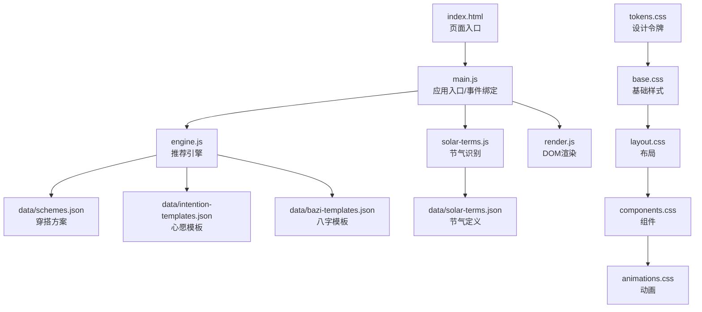
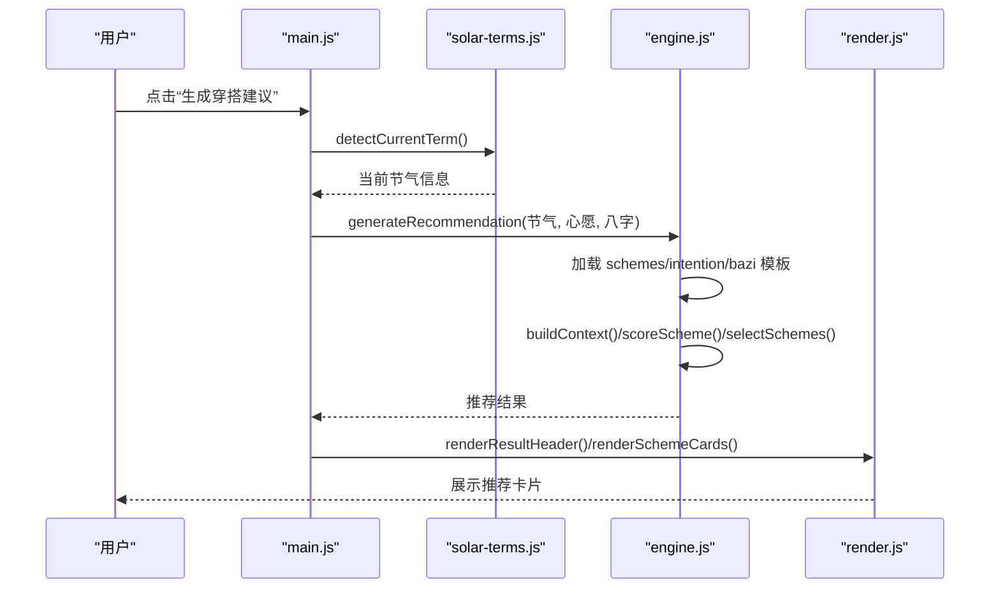
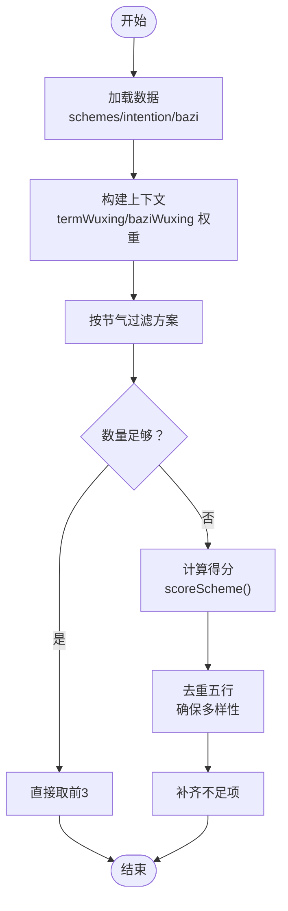
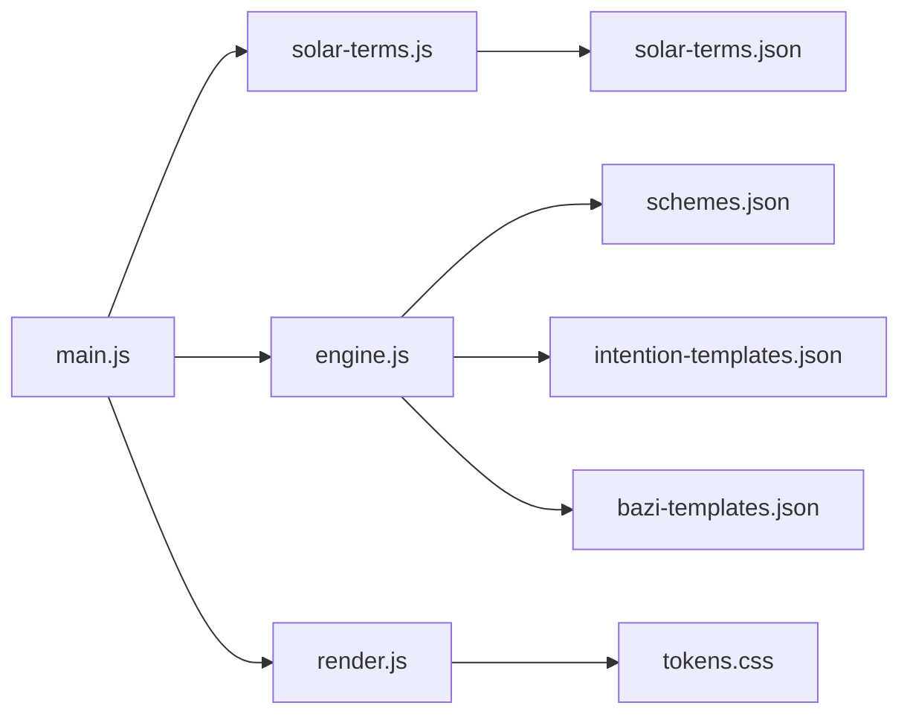

# 功能扩展

<cite>
**本文引用的文件**
- [index.html](file://index.html)
- [engine.js](file://js/engine.js)
- [main.js](file://js/main.js)
- [render.js](file://js/render.js)
- [solar-terms.js](file://js/solar-terms.js)
- [tokens.css](file://css/tokens.css)
- [base.css](file://css/base.css)
- [layout.css](file://css/layout.css)
- [components.css](file://css/components.css)
- [animations.css](file://css/animations.css)
- [schemes.json](file://data/schemes.json)
- [intention-templates.json](file://data/intention-templates.json)
- [solar-terms.json](file://data/solar-terms.json)
- [wish-templates.json](file://data/wish-templates.json)
- [bazi-templates.json](file://data/bazi-templates.json)
</cite>

## 目录
1. [简介](#简介)
2. [项目结构](#项目结构)
3. [核心组件](#核心组件)
4. [架构总览](#架构总览)
5. [详细组件分析](#详细组件分析)
6. [依赖分析](#依赖分析)
7. [性能考虑](#性能考虑)
8. [故障排查指南](#故障排查指南)
9. [结论](#结论)
10. [附录](#附录)

## 简介
本指南面向希望扩展“五行穿搭建议”项目的开发者，提供从数据层到前端展示层的完整扩展方法，包括：
- 新增穿搭方案：schema.json 数据结构、五行属性、材质与感受、注解与来源
- 扩展心愿模板：intention-templates.json 格式、匹配规则与使用场景
- 更新节气数据：solar-terms.json 结构、时间范围与属性映射
- 定制样式主题：CSS 变量系统、颜色方案与响应式适配
- 新增功能模块：开发流程、API 扩展与数据模型更新
- 最佳实践与向后兼容性保障

## 项目结构
项目采用“数据驱动 + 模块化前端”的组织方式：
- 数据层：JSON 文件（schemes、intention-templates、solar-terms、wish、bazi）
- 引擎层：推荐算法与上下文构建（engine.js）
- 视图层：DOM 渲染与交互（render.js、main.js）
- 节气识别：solar-terms.js
- 样式层：tokens.css + base.css + layout.css + components.css + animations.css
- 入口页面：index.html

图表来源
- [index.html](file://index.html#L1-L236)
- [main.js](file://js/main.js#L1-L317)
- [engine.js](file://js/engine.js#L1-L335)
- [solar-terms.js](file://js/solar-terms.js#L1-L118)
- [render.js](file://js/render.js#L1-L272)
- [tokens.css](file://css/tokens.css#L1-L109)
- [base.css](file://css/base.css#L1-L168)
- [layout.css](file://css/layout.css#L1-L252)
- [components.css](file://css/components.css#L1-L338)
- [animations.css](file://css/animations.css#L1-L207)
- [schemes.json](file://data/schemes.json#L1-L509)
- [intention-templates.json](file://data/intention-templates.json#L1-L253)
- [solar-terms.json](file://data/solar-terms.json#L1-L42)
- [bazi-templates.json](file://data/bazi-templates.json#L1-L103)

章节来源
- [index.html](file://index.html#L1-L236)
- [main.js](file://js/main.js#L1-L317)
- [engine.js](file://js/engine.js#L1-L335)
- [solar-terms.js](file://js/solar-terms.js#L1-L118)
- [render.js](file://js/render.js#L1-L272)
- [tokens.css](file://css/tokens.css#L1-L109)
- [base.css](file://css/base.css#L1-L168)
- [layout.css](file://css/layout.css#L1-L252)
- [components.css](file://css/components.css#L1-L338)
- [animations.css](file://css/animations.css#L1-L207)
- [schemes.json](file://data/schemes.json#L1-L509)
- [intention-templates.json](file://data/intention-templates.json#L1-L253)
- [solar-terms.json](file://data/solar-terms.json#L1-L42)
- [bazi-templates.json](file://data/bazi-templates.json#L1-L103)

## 核心组件
- 推荐引擎（engine.js）
  - 负责加载数据、构建上下文、评分与筛选方案
  - 关键函数：loadSchemes、buildContext、scoreScheme、selectSchemes、generateRecommendation
- 节气识别（solar-terms.js）
  - 负责解析 solar-terms.json 并检测当前节气
  - 关键函数：detectCurrentTerm、getWuxingColor
- 视图渲染（render.js）
  - 负责 DOM 渲染、模态框、Toast 提示、上传预览等
  - 关键函数：showView、renderSchemeCards、renderDetailModal、showToast
- 应用入口（main.js）
  - 负责事件绑定、生成/换一批、上传处理、存储读写
  - 关键函数：bindEvents、handleGenerate、handleRegenerate、handleFileUpload
- 样式系统（tokens.css + base.css + layout.css + components.css + animations.css）
  - 使用 CSS 变量统一管理色彩、字体、间距、圆角、阴影、动画与断点
  - 响应式布局在 layout.css 中定义

章节来源
- [engine.js](file://js/engine.js#L1-L335)
- [solar-terms.js](file://js/solar-terms.js#L1-L118)
- [render.js](file://js/render.js#L1-L272)
- [main.js](file://js/main.js#L1-L317)
- [tokens.css](file://css/tokens.css#L1-L109)
- [base.css](file://css/base.css#L1-L168)
- [layout.css](file://css/layout.css#L1-L252)
- [components.css](file://css/components.css#L1-L338)
- [animations.css](file://css/animations.css#L1-L207)

## 架构总览
推荐流程概览：

图表来源
- [main.js](file://js/main.js#L200-L244)
- [solar-terms.js](file://js/solar-terms.js#L36-L103)
- [engine.js](file://js/engine.js#L268-L310)
- [render.js](file://js/render.js#L104-L127)

## 详细组件分析

### 数据层扩展指南

#### 1) 新增穿搭方案（schema.json）
- 数据结构要点
  - 外层包含数组 schemes
  - 每个方案对象字段：
    - id：唯一标识（建议使用“节气_序号”，如 lichun_01）
    - termId：所属节气ID（需与 solar-terms.json 中 terms[].id 对应）
    - rank：推荐优先级（数值越小越靠前）
    - color：色彩对象
      - name：中文名称
      - hex：十六进制色值
      - wuxing：五行属性（wood/fire/earth/metal/water）
    - material：材质名称
    - feeling：穿着感受关键词
    - annotation：五行解读与文化注解
    - source：典籍出处
- 五行属性设置
  - color.wuxing 必须与 solar-terms.json 中对应节气的 wuxing 一致或相生关系
  - 相生关系：木→火→土→金→水→木
- 材质信息配置
  - 建议与节气气候、脏腑调养理念契合（如夏季偏凉、秋季润燥）
- 推荐权重调整
  - 通过 engine.js 的 scoreScheme 与 selectSchemes 内部逻辑影响最终排序
  - rank 与 color.wuxing 匹配度共同决定最终得分

章节来源
- [schemes.json](file://data/schemes.json#L1-L509)
- [engine.js](file://js/engine.js#L178-L259)
- [solar-terms.js](file://js/solar-terms.js#L108-L117)

#### 2) 扩展心愿模板（intention-templates.json）
- 格式规范
  - 数组元素对象字段：
    - id：模板唯一标识（建议“意图_节气”，如 job_qingming）
    - intention：心愿类型（career/guiren/travel/focus/health）
    - solarTerm：节气名称（需与 solar-terms.json 中 terms[].name 对应）
    - color/material/feeling：与方案一致的风格化字段
    - annotation：解释该心愿在特定节气的搭配思路
    - source：典籍出处
- 匹配规则
  - engine.js 中 findBestIntentionTemplate 会：
    - 先按 intention 过滤
    - 再按节气距离（TERM_ORDER）排序，取最近者
- 使用场景适配
  - career：强调清爽利落；guiren：强调温润典雅；travel：强调舒适透气；focus：强调沉稳内敛；health：强调自然舒适

章节来源
- [intention-templates.json](file://data/intention-templates.json#L1-L253)
- [engine.js](file://js/engine.js#L104-L119)
- [engine.js](file://js/engine.js#L84-L99)

#### 3) 更新节气数据（solar-terms.json）
- 结构要求
  - terms：节气列表，每项包含
    - id：节气ID（如 lichun）
    - name：中文名称（如 立春）
    - wuxing：五行属性（与 schemes.json 中 color.wuxing 对应）
    - month：农历月（公历月）
    - dayRange：起止日期范围（数组）
  - seasons：按季节分组，包含 wuxing 与 terms 列表
  - wuxingNames：五行名称映射
- 时间范围设置
  - month 与 dayRange 需与实际节气日期一致，避免跨月边界错误
- 属性映射规则
  - schemes.json 的 termId 必须与 terms[].id 一致
  - engine.js 的 TERM_NAME_MAP 与 TERM_ORDER 依赖 terms 的顺序与名称

章节来源
- [solar-terms.json](file://data/solar-terms.json#L1-L42)
- [engine.js](file://js/engine.js#L19-L34)
- [engine.js](file://js/engine.js#L84-L99)

#### 4) 定制样式主题（CSS 变量系统）
- 使用 CSS 变量
  - tokens.css 定义了 --color-*、--text-*、--space-*、--radius-*、--shadow-*、--duration-*、--z-* 等
  - base.css、layout.css、components.css、animations.css 通过 var(...) 使用这些令牌
- 颜色方案调整
  - 五行颜色：tokens.css 中 --color-wood/fire/earth/metal/water 及其 light/dark 版本
  - 文案色：--color-text-primary/secondary/muted/inverse
  - 功能色：success/warning/error/info
- 响应式设计适配
  - 断点预留（注释中的 --bp-*），可在 layout.css 中启用
  - 媒体查询已在 layout.css 中实现移动端到桌面端的网格布局切换

章节来源
- [tokens.css](file://css/tokens.css#L1-L109)
- [base.css](file://css/base.css#L1-L168)
- [layout.css](file://css/layout.css#L225-L251)
- [components.css](file://css/components.css#L1-L338)
- [animations.css](file://css/animations.css#L1-L207)

#### 5) 新增功能模块开发流程
- 数据层
  - 在 data/ 下新增 JSON 或扩展现有 JSON 字段
  - 确保字段名与引擎/渲染模块引用保持一致
- 引擎层
  - 在 engine.js 中新增数据加载与评分逻辑
  - 如需新权重，修改 buildContext 与 scoreScheme
- 视图层
  - 在 render.js 中新增渲染函数或扩展现有渲染逻辑
  - 在 main.js 中绑定事件与调用渲染函数
- 样式层
  - 在 tokens.css 中新增设计令牌，在 components.css/layout.css 中使用
- API 扩展
  - 若需要服务端接口，遵循 fetch/async 模式，保持与现有模块一致的错误处理与日志输出

章节来源
- [engine.js](file://js/engine.js#L39-L79)
- [engine.js](file://js/engine.js#L157-L173)
- [engine.js](file://js/engine.js#L178-L199)
- [render.js](file://js/render.js#L1-L272)
- [main.js](file://js/main.js#L1-L317)
- [tokens.css](file://css/tokens.css#L1-L109)
- [layout.css](file://css/layout.css#L1-L252)

#### 6) 数据模型更新方法
- 方案模型（schemes.json）
  - 新增字段：在 engine.js 的 scoreScheme/selectSchemes 中同步处理
  - 影响：可能改变推荐权重与多样性策略
- 心愿模板（intention-templates.json）
  - 新增字段：在 engine.js 的 findBestIntentionTemplate 中同步过滤/排序
- 节气模型（solar-terms.json）
  - 新增节气：在 engine.js 的 TERM_ORDER、TERM_NAME_MAP、detectCurrentTerm 中同步维护
- 八字模板（bazi-templates.json）
  - 新增字段：在 engine.js 的 findBestBaziTemplate 中同步匹配逻辑

章节来源
- [schemes.json](file://data/schemes.json#L1-L509)
- [intention-templates.json](file://data/intention-templates.json#L1-L253)
- [solar-terms.json](file://data/solar-terms.json#L1-L42)
- [bazi-templates.json](file://data/bazi-templates.json#L1-L103)
- [engine.js](file://js/engine.js#L84-L99)
- [engine.js](file://js/engine.js#L104-L119)
- [engine.js](file://js/engine.js#L124-L152)

### 推荐算法流程图

图表来源
- [engine.js](file://js/engine.js#L268-L310)
- [engine.js](file://js/engine.js#L218-L259)
- [engine.js](file://js/engine.js#L178-L199)

## 依赖分析
- 模块耦合
  - main.js 依赖 solar-terms.js（节气）、engine.js（推荐）、render.js（渲染）
  - engine.js 依赖 data/*.json 与 solar-terms.js（节气顺序）
  - render.js 依赖 tokens.css（颜色与动画）
- 外部依赖
  - 仅使用浏览器原生 API（fetch、DOM、Storage），无第三方库
- 潜在循环依赖
  - 未发现循环导入；各模块职责清晰

图表来源
- [main.js](file://js/main.js#L1-L317)
- [engine.js](file://js/engine.js#L1-L335)
- [solar-terms.js](file://js/solar-terms.js#L1-L118)
- [render.js](file://js/render.js#L1-L272)
- [schemes.json](file://data/schemes.json#L1-L509)
- [intention-templates.json](file://data/intention-templates.json#L1-L253)
- [bazi-templates.json](file://data/bazi-templates.json#L1-L103)
- [solar-terms.json](file://data/solar-terms.json#L1-L42)
- [tokens.css](file://css/tokens.css#L1-L109)

章节来源
- [main.js](file://js/main.js#L1-L317)
- [engine.js](file://js/engine.js#L1-L335)
- [solar-terms.js](file://js/solar-terms.js#L1-L118)
- [render.js](file://js/render.js#L1-L272)
- [schemes.json](file://data/schemes.json#L1-L509)
- [intention-templates.json](file://data/intention-templates.json#L1-L253)
- [bazi-templates.json](file://data/bazi-templates.json#L1-L103)
- [solar-terms.json](file://data/solar-terms.json#L1-L42)
- [tokens.css](file://css/tokens.css#L1-L109)

## 性能考虑
- 数据加载
  - 使用 Promise.all 并行加载多份模板，减少等待时间
- 排序与筛选
  - selectSchemes 采用一次遍历与排序，复杂度 O(n log n)，n 为候选方案数
- DOM 渲染
  - 卡片使用 CSS 动画与 GPU 加速属性，提升滚动与过渡体验
- 图片上传
  - 压缩与本地存储，避免重复网络请求

章节来源
- [engine.js](file://js/engine.js#L270-L274)
- [engine.js](file://js/engine.js#L218-L259)
- [render.js](file://js/render.js#L101-L127)
- [main.js](file://js/main.js#L282-L292)

## 故障排查指南
- 推荐为空
  - 检查 schemes.json 是否正确加载（控制台错误日志）
  - 确认当前节气 termId 与 schemes.json 中的 termId 一致
- 心愿模板不生效
  - 检查 intention-templates.json 的 intention 与 solarTerm 是否与映射一致
  - 确认 engine.js 的 TERM_NAME_MAP 与 TERM_ORDER 未被误改
- 节气识别异常
  - 检查 solar-terms.json 的 month 与 dayRange 是否覆盖当前日期
  - 确认 detectCurrentTerm 的 UTC+8 时间转换逻辑
- 样式不生效
  - 检查 tokens.css 是否正确引入
  - 确认 CSS 变量拼写与命名空间一致

章节来源
- [engine.js](file://js/engine.js#L42-L48)
- [engine.js](file://js/engine.js#L104-L119)
- [solar-terms.js](file://js/solar-terms.js#L36-L103)
- [index.html](file://index.html#L13-L18)

## 结论
通过本指南，您可以安全地扩展“五行穿搭建议”项目的数据与功能边界，同时保持良好的可维护性与用户体验。建议在每次扩展后进行回归测试，确保节气识别、推荐算法与渲染逻辑的一致性。

## 附录

### A. 新增穿搭方案步骤清单
- 在 schemes.json 中追加一条方案记录，确保字段完整
- 在 solar-terms.json 中确认对应节气存在且 wuxing 正确
- 如需调整权重，修改 engine.js 的 scoreScheme/selectSchemes
- 在 render.js 中确认渲染逻辑可显示新增字段
- 在 tokens.css 中如有需要可新增或调整颜色令牌

章节来源
- [schemes.json](file://data/schemes.json#L1-L509)
- [solar-terms.json](file://data/solar-terms.json#L1-L42)
- [engine.js](file://js/engine.js#L178-L259)
- [render.js](file://js/render.js#L114-L154)
- [tokens.css](file://css/tokens.css#L1-L109)

### B. 新增心愿模板步骤清单
- 在 intention-templates.json 中追加一条模板记录
- 在 engine.js 中确认 findBestIntentionTemplate 能正确过滤与排序
- 在 main.js 中确认心愿 ID 与映射 INTENTION_MAP 一致
- 在 render.js 中确认详情展示逻辑可用

章节来源
- [intention-templates.json](file://data/intention-templates.json#L1-L253)
- [engine.js](file://js/engine.js#L104-L119)
- [engine.js](file://js/engine.js#L10-L16)
- [render.js](file://js/render.js#L159-L193)

### C. 更新节气数据步骤清单
- 在 solar-terms.json 中新增/修改节气条目
- 在 engine.js 中同步 TERM_ORDER、TERM_NAME_MAP
- 在 solar-terms.js 中确认 detectCurrentTerm 的日期判断逻辑
- 在 schemes.json 中校验 termId 一致性

章节来源
- [solar-terms.json](file://data/solar-terms.json#L1-L42)
- [engine.js](file://js/engine.js#L19-L34)
- [engine.js](file://js/engine.js#L84-L99)
- [solar-terms.js](file://js/solar-terms.js#L36-L103)

### D. 样式主题定制步骤清单
- 在 tokens.css 中新增或调整设计令牌
- 在 base.css/layout.css/components.css/animations.css 中使用 var(...)
- 在 index.html 中确认样式文件加载顺序
- 在 render.js 中确认颜色函数（如 getWuxingColor）与 tokens.css 一致

章节来源
- [tokens.css](file://css/tokens.css#L1-L109)
- [base.css](file://css/base.css#L1-L168)
- [layout.css](file://css/layout.css#L1-L252)
- [components.css](file://css/components.css#L1-L338)
- [animations.css](file://css/animations.css#L1-L207)
- [index.html](file://index.html#L13-L18)
- [render.js](file://js/render.js#L76-L99)