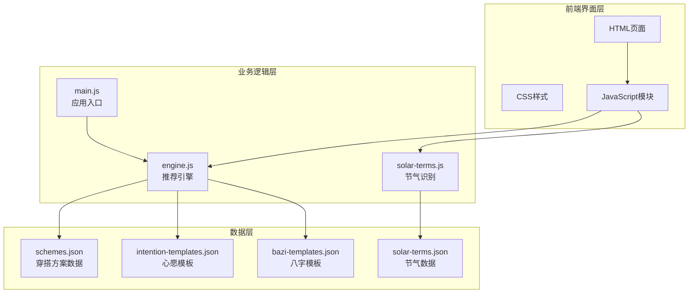
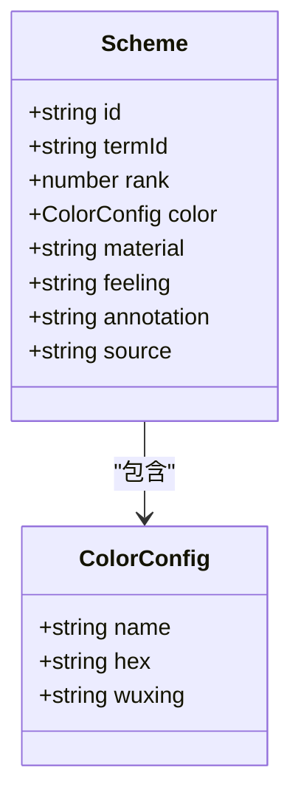
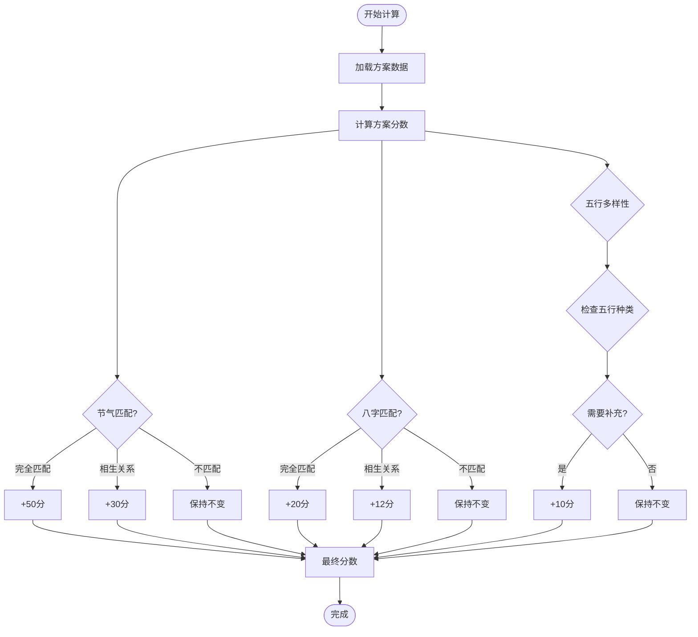
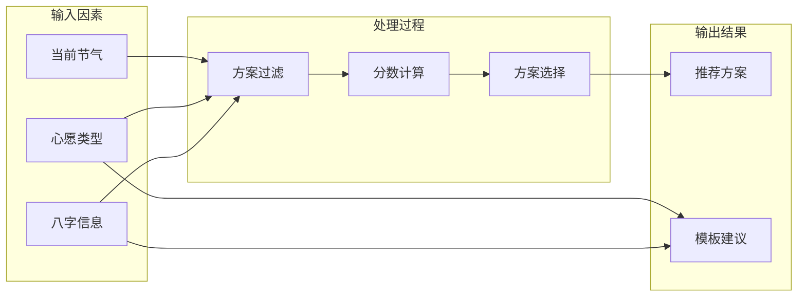
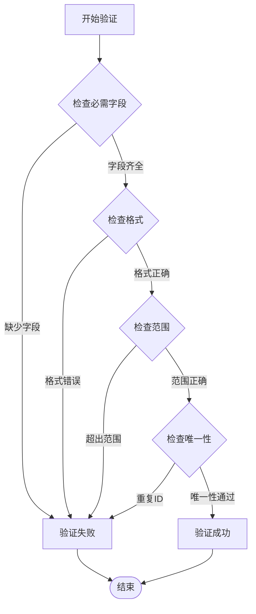
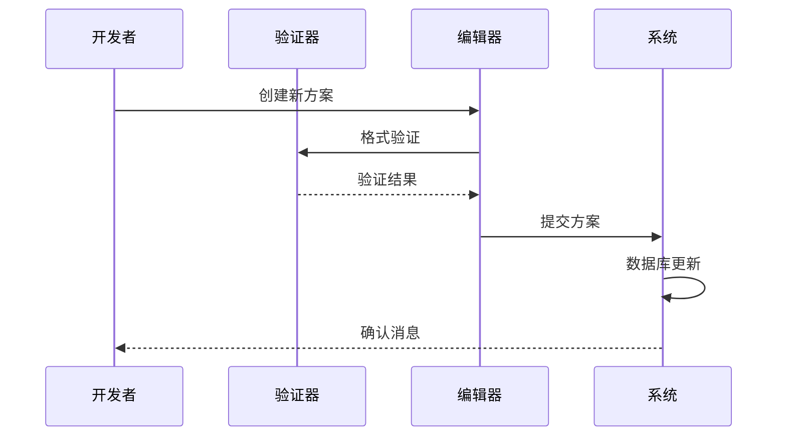
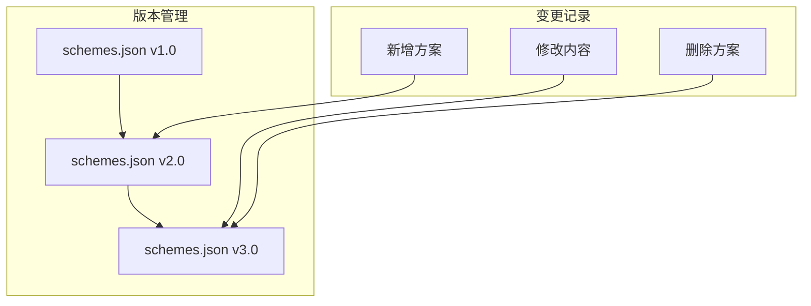

# 数据方案扩展

<cite>
**本文档引用的文件**
- [schemes.json](file://data/schemes.json)
- [solar-terms.json](file://data/solar-terms.json)
- [engine.js](file://js/engine.js)
- [solar-terms.js](file://js/solar-terms.js)
- [intention-templates.json](file://data/intention-templates.json)
- [bazi-templates.json](file://data/bazi-templates.json)
- [main.js](file://js/main.js)
- [index.html](file://index.html)
</cite>

## 目录
1. [简介](#简介)
2. [项目结构概览](#项目结构概览)
3. [核心数据结构](#核心数据结构)
4. [方案ID命名规范](#方案id命名规范)
5. [节气关联规则](#节气关联规则)
6. [rank排序规则](#rank排序规则)
7. [颜色配置格式](#颜色配置格式)
8. [材质信息设置](#材质信息设置)
9. [触感描述编写指南](#触感描述编写指南)
10. [注释来源标注](#注释来源标注)
11. [JSON结构示例](#json结构示例)
12. [二十四节气数据更新](#二十四节气数据更新)
13. [方案权重计算原理](#方案权重计算原理)
14. [推荐算法影响因素](#推荐算法影响因素)
15. [数据验证规则](#数据验证规则)
16. [扩展最佳实践](#扩展最佳实践)
17. [故障排除指南](#故障排除指南)
18. [总结](#总结)

## 简介

本指南面向需要为"五行穿搭建议"项目添加新数据方案的开发者和维护者。该项目基于中国传统的二十四节气理论，结合五行学说，为用户提供个性化的服装搭配建议。本文档详细说明了如何在schemes.json中添加新的穿搭方案，包括命名规范、关联规则、排序原则、格式要求等，并提供了完整的JSON结构示例和验证方法。

## 项目结构概览

项目采用模块化架构设计，主要包含以下核心组件：



**图表来源**
- [index.html](file://index.html#L1-L236)
- [engine.js](file://js/engine.js#L1-L335)
- [solar-terms.js](file://js/solar-terms.js#L1-L118)

## 核心数据结构

### 方案对象结构

每个穿搭方案都是一个JSON对象，包含以下必需字段：

| 字段名 | 类型 | 必需 | 描述 |
|--------|------|------|------|
| id | string | 是 | 方案唯一标识符，遵循命名规范 |
| termId | string | 是 | 关联的节气ID，必须存在于solar-terms.json中 |
| rank | number | 是 | 排序权重，数值越小排名越靠前 |
| color | object | 是 | 颜色配置对象 |
| material | string | 是 | 材质描述 |
| feeling | string | 是 | 触感描述 |
| annotation | string | 是 | 方案注释说明 |
| source | string | 是 | 引用来源标注 |

### 颜色配置结构



**图表来源**
- [schemes.json](file://data/schemes.json#L1-L509)

**章节来源**
- [schemes.json](file://data/schemes.json#L1-L509)

## 方案ID命名规范

### 命名规则

方案ID采用"节气缩写_序号"的格式：

```
{termId}_{序号}
```

其中：
- `termId`：节气的英文缩写（如lichun、yushui、jingzhe等）
- `序号`：在同一节气下的方案编号，从01开始递增

### 命名示例

- `lichun_01`：立春第一个方案
- `yushui_02`：雨水第二个方案  
- `guyu_03`：谷雨第三个方案

### 命名验证

系统会自动验证ID的唯一性和格式正确性。重复的ID会导致数据加载失败。

**章节来源**
- [schemes.json](file://data/schemes.json#L1-L509)

## 节气关联规则

### termId映射

每个方案必须关联到一个有效的节气ID。可用的节气ID包括：

- 春季：lichun、yushui、jingzhe、chunfen、qingming、guyu
- 夏季：lixia、xiaoman、mangzhung、xiazhi、xiaoshu、dashu  
- 秋季：liqiu、chushu、bailu、qiufen、hanlu、shuangjiang
- 冬季：lidong、xiaoxue、daxue、dongzhi、xiaohan、dahan

### 节气时间范围

节气的时间范围定义在solar-terms.json中，格式为：

```json
{
  "id": "lichun",
  "name": "立春", 
  "wuxing": "wood",
  "month": 2,
  "dayRange": [3, 5]
}
```

### 关联验证

系统会验证方案的termId是否存在于节气列表中，不存在的ID会导致方案无法被正确筛选。

**章节来源**
- [solar-terms.json](file://data/solar-terms.json#L1-L42)
- [schemes.json](file://data/schemes.json#L1-L509)

## rank排序规则

### 排序机制

rank字段决定了方案在同一节气内的显示顺序：

1. **数值越小优先级越高**
2. **相同rank值按插入顺序排列**
3. **不同节气间独立排序**

### 排序示例

以立春为例，三个方案的rank值分别为1、2、3：

- rank=1：最高优先级，最先显示
- rank=2：次优先级  
- rank=3：最低优先级

### 排序验证

系统会自动处理rank排序，但需要确保：
- rank值为正整数
- 同一节气内rank值不重复
- rank值在合理范围内（通常1-3）

**章节来源**
- [schemes.json](file://data/schemes.json#L1-L509)

## 颜色配置格式

### 颜色对象结构

```json
"color": {
  "name": "颜色名称",
  "hex": "#十六进制颜色值", 
  "wuxing": "五行属性"
}
```

### 颜色名称规范

- 使用中文描述性名称
- 体现节气特征和颜色联想
- 避免过于抽象的表达

### 十六进制颜色值

- 标准RGB格式（#RRGGBB）
- 小写字母
- 完整的6位十六进制数

### 五行属性映射

可用的五行属性值：
- `wood`：木
- `fire`：火  
- `earth`：土
- `metal`：金
- `water`：水

### 颜色示例

```json
"color": {
  "name": "嫩芽绿",
  "hex": "#8FBE8E", 
  "wuxing": "wood"
}
```

**章节来源**
- [schemes.json](file://data/schemes.json#L1-L509)

## 材质信息设置

### 材质描述规范

材质字段应使用简洁明确的描述：

- **天然材质**：纯棉、桑蚕丝、亚麻、竹纤维等
- **合成材质**：天丝、莫代尔、莱卡等  
- **混纺材质**：丝棉混纺、棉麻混纺等
- **特殊工艺**：防水尼龙、弹力棉等

### 材质选择原则

1. **符合节气特点**：春季选择轻薄材质，冬季选择保暖材质
2. **体现五行属性**：材质特性应与五行属性相符
3. **实用性强**：考虑穿着舒适度和实用性

### 材质示例

- `"material": "天丝棉"`
- `"material": "粗纺羊毛"`  
- `"material": "纯棉针织"`

**章节来源**
- [schemes.json](file://data/schemes.json#L1-L509)

## 触感描述编写指南

### 触感类型分类

触感描述应体现以下维度：

- **温度感受**：温暖感、清凉感、润泽感、干燥感
- **质地感受**：柔软感、粗糙感、光滑感、蓬松感  
- **动态感受**：流动感、蓄势感、舒展感、紧绷感
- **静态感受**：平衡感、稳定感、轻盈感、厚重感

### 描述技巧

1. **具体化**：避免抽象词汇，使用具体描述
2. **节气呼应**：体现当前节气的气候特点
3. **五行对应**：与五行属性相匹配
4. **情感共鸣**：传达积极正面的情感体验

### 触感示例

- `"feeling": "轻盈感"` - 春季薄透材质
- `"feeling": "温润感"` - 夏季亲肤材质  
- `"feeling": "扎根感"` - 秋季厚实质感
- `"feeling": "沉稳感"` - 冬季保暖质感

**章节来源**
- [schemes.json](file://data/schemes.json#L1-L509)

## 注释来源标注

### 注释格式要求

注释应包含：
- **方案解释**：说明为什么选择该颜色、材质、触感
- **节气关联**：解释与当前节气的关系
- **五行原理**：阐述五行相生相克的应用
- **文化依据**：引用经典文献或传统智慧

### 引用来源格式

```json
"annotation": "春始之色，柔韧之质，唤醒身体舒展本能",
"source": "《礼记·月令》"
```

### 文献引用规范

- 使用《》标注经典文献
- 包含作者和篇名
- 确保引用的准确性
- 体现传统文化价值

**章节来源**
- [schemes.json](file://data/schemes.json#L1-L509)

## JSON结构示例

### 完整方案示例

```json
{
  "id": "lichun_04",
  "termId": "lichun", 
  "rank": 4,
  "color": {
    "name": "新绿",
    "hex": "#7CFC00",
    "wuxing": "wood"
  },
  "material": "有机棉",
  "feeling": "生机感",
  "annotation": "木气初生，新绿象征生命活力，有机棉天然环保",
  "source": "《本草纲目》"
}
```

### 批量添加示例

```json
[
  {
    "id": "lichun_05",
    "termId": "lichun",
    "rank": 5,
    "color": {"name": "嫩柳绿", "hex": "#A4C98E", "wuxing": "wood"},
    "material": "莫代尔",
    "feeling": "舒展感",
    "annotation": "木气勃发，柔软贴身，顺应生发之势",
    "source": "《礼记·月令》"
  }
]
```

**章节来源**
- [schemes.json](file://data/schemes.json#L1-L509)

## 二十四节气数据更新

### 节气时间范围设置

节气的月份和日期范围定义在solar-terms.json中：

```json
{
  "id": "lichun",
  "name": "立春", 
  "wuxing": "wood",
  "month": 2,
  "dayRange": [3, 5]
}
```

### 属性映射规则

- **month**：节气发生的公历月份（1-12）
- **dayRange**：节气开始和结束的日期范围
- **wuxing**：节气对应的五行属性

### 方案数量分配原则

1. **节气数量**：每个节气至少保留3个方案
2. **五行平衡**：确保五种五行属性均匀分布
3. **季节特色**：突出季节性的颜色和材质
4. **渐进变化**：体现节气间的过渡变化

### 更新流程

1. 修改solar-terms.json中的节气定义
2. 检查现有方案的termId有效性
3. 调整相关方案的颜色和材质
4. 验证数据完整性

**章节来源**
- [solar-terms.json](file://data/solar-terms.json#L1-L42)

## 方案权重计算原理

### 权重分配机制

推荐系统采用多因子加权评分：



**图表来源**
- [engine.js](file://js/engine.js#L175-L259)

### 评分算法详解

#### 节气匹配权重 (50%)

- **完全匹配**：方案五行属性与当前节气相同
- **相生关系**：方案五行属性能生助当前节气
- **相克关系**：方案五行属性克制当前节气（不加分）

#### 八字匹配权重 (20%)

- **完全匹配**：方案五行属性与个人八字最强元素相同
- **相生关系**：方案五行属性能生助个人八字
- **相克关系**：方案五行属性克制个人八字（不加分）

#### 五行多样性权重 (30%)

- **保证多样性**：确保推荐的方案包含不同的五行属性
- **平衡发展**：避免单一五行属性过度集中

**章节来源**
- [engine.js](file://js/engine.js#L175-L259)

## 推荐算法影响因素

### 主要影响因素



**图表来源**
- [engine.js](file://js/engine.js#L268-L335)

### 节气影响权重

| 节气阶段 | 影响程度 | 说明 |
|----------|----------|------|
| 当前节气 | 50% | 最重要的影响因素 |
| 相邻节气 | 25% | 次要影响因素 |
| 其他节气 | 0% | 不影响当前推荐 |

### 心愿模板影响

系统会根据用户选择的心愿类型匹配相应的心愿模板：

- **求职顺利**：偏向明亮、积极的颜色
- **贵人运**：偏向温暖、包容的色调  
- **远行顺利**：偏向清爽、舒适的材质
- **静心专注**：偏向沉稳、内敛的色彩
- **健康舒畅**：偏向自然、和谐的搭配

### 八字模板影响

根据用户的八字信息匹配最适合的模板：

- **日主强旺**：需要克制或泄耗的方案
- **日主偏弱**：需要生助的方案
- **平衡状态**：保持平衡的方案

**章节来源**
- [engine.js](file://js/engine.js#L268-L335)

## 数据验证规则

### JSON格式验证

#### 基础字段验证



#### 字段验证清单

1. **ID验证**
   - 格式：`{termId}_01`
   - 唯一性：全局唯一
   - 长度：3-20字符

2. **termId验证**
   - 存在于solar-terms.json中
   - 格式：小写字母和下划线
   - 长度：3-20字符

3. **rank验证**
   - 类型：正整数
   - 范围：1-100
   - 唯一性：同一节气内唯一

4. **颜色验证**
   - name：非空字符串
   - hex：有效十六进制颜色码
   - wuxing：有效五行属性

5. **文本验证**
   - material：1-50字符
   - feeling：1-30字符
   - annotation：10-200字符
   - source：1-100字符

### 数据完整性检查

#### 节气完整性

```javascript
// 节气完整性检查函数
function validateSolarTerms() {
  const requiredTerms = ['lichun', 'yushui', 'jingzhe', 'chunfen', 'qingming', 'guyu',
                       'lixia', 'xiaoman', 'mangzhong', 'xiazhi', 'xiaoshu', 'dashu',
                       'liqiu', 'chushu', 'bailu', 'qiufen', 'hanlu', 'shuangjiang',
                       'lidong', 'xiaoxue', 'daxue', 'dongzhi', 'xiaohan', 'dahan'];
  
  const existingTerms = schemesData.schemes.map(s => s.termId);
  const missingTerms = requiredTerms.filter(term => !existingTerms.includes(term));
  
  return missingTerms;
}
```

#### 五行平衡检查

```javascript
// 五行平衡检查函数
function validateWuxingBalance() {
  const wuxingCounts = {};
  schemesData.schemes.forEach(scheme => {
    const wuxing = scheme.color.wuxing;
    wuxingCounts[wuxing] = (wuxingCounts[wuxing] || 0) + 1;
  });
  
  return wuxingCounts;
}
```

### 自动验证工具

#### 在线验证脚本

```javascript
// 方案验证函数
function validateScheme(scheme) {
  const errors = [];
  
  // ID格式验证
  if (!scheme.id || !/^[a-z]+_\d{2}$/.test(scheme.id)) {
    errors.push('ID格式错误');
  }
  
  // termId存在性验证
  if (!validTermIds.includes(scheme.termId)) {
    errors.push('无效的节气ID');
  }
  
  // rank范围验证
  if (scheme.rank <= 0 || scheme.rank > 100) {
    errors.push('rank值超出范围');
  }
  
  // 颜色验证
  if (!scheme.color || !scheme.color.name || !scheme.color.hex || !scheme.color.wuxing) {
    errors.push('颜色配置不完整');
  }
  
  return errors;
}
```

**章节来源**
- [schemes.json](file://data/schemes.json#L1-L509)
- [solar-terms.json](file://data/solar-terms.json#L1-L42)

## 扩展最佳实践

### 新方案添加流程



### 添加新方案的步骤

1. **需求分析**
   - 确定目标节气
   - 分析目标人群特征
   - 研究相关文献资料

2. **方案设计**
   - 选择合适的颜色
   - 确定材质组合
   - 设计触感描述
   - 准备注释说明

3. **数据录入**
   - 生成唯一ID
   - 设置rank值
   - 填写完整信息
   - 添加引用来源

4. **测试验证**
   - 单元测试
   - 集成测试
   - 用户验收测试

### 内容质量标准

#### 文化准确性

- 引用权威典籍
- 体现传统智慧
- 符合中医理论
- 传承文化价值

#### 实用性标准

- 贴合现代生活
- 考虑成本因素
- 注重舒适体验
- 便于日常穿着

#### 美学原则

- 色彩协调统一
- 材质搭配合理
- 触感层次丰富
- 整体和谐美观

### 版本管理策略

#### 数据版本控制



#### 回滚机制

- 备份原始数据
- 记录变更历史
- 支持快速回滚
- 测试验证通过

**章节来源**
- [schemes.json](file://data/schemes.json#L1-L509)

## 故障排除指南

### 常见问题及解决方案

#### 数据加载失败

**症状**：页面无法显示推荐结果

**可能原因**：
- JSON格式错误
- 字段缺失
- 文件路径错误

**解决方法**：
1. 使用在线JSON验证器检查格式
2. 对比现有方案的字段结构
3. 检查文件编码格式

#### 方案不显示

**症状**：新增方案未出现在推荐列表中

**可能原因**：
- ID格式不正确
- termId不存在
- rank值超出范围

**解决方法**：
1. 检查ID命名规范
2. 验证节气ID有效性
3. 确认rank值范围

#### 推荐结果异常

**症状**：推荐的方案不符合预期

**可能原因**：
- 权重设置不当
- 八字信息错误
- 心愿类型不匹配

**解决方法**：
1. 检查权重分配
2. 验证八字数据
3. 确认心愿选择

### 调试工具

#### 浏览器开发者工具

```javascript
// 调试推荐算法
function debugRecommendation() {
  console.log('当前节气:', currentTermInfo);
  console.log('心愿类型:', currentWishId);
  console.log('八字信息:', currentBaziResult);
  console.log('推荐结果:', currentResult);
}

// 监控数据加载
function monitorDataLoading() {
  const startTime = performance.now();
  loadSchemes().then(() => {
    const endTime = performance.now();
    console.log('数据加载耗时:', endTime - startTime, 'ms');
  });
}
```

#### 错误日志分析

```javascript
// 错误处理机制
function handleError(error) {
  console.error('数据方案错误:', {
    timestamp: new Date().toISOString(),
    error: error.message,
    stack: error.stack,
    solution: '请检查JSON格式和字段完整性'
  });
}
```

### 性能优化建议

#### 数据加载优化

```javascript
// 缓存策略
let schemesCache = null;
let cacheTimestamp = 0;

function getCachedSchemes() {
  const now = Date.now();
  if (!schemesCache || (now - cacheTimestamp) > 300000) { // 5分钟缓存
    schemesCache = loadSchemes();
    cacheTimestamp = now;
  }
  return schemesCache;
}
```

#### 内存管理

- 及时清理不再使用的数据
- 避免重复加载相同数据
- 监控内存使用情况

**章节来源**
- [engine.js](file://js/engine.js#L1-L335)
- [main.js](file://js/main.js#L1-L317)

## 总结

本指南详细介绍了为"五行穿搭建议"项目添加新数据方案的完整流程和规范要求。通过遵循本文档的命名规范、关联规则、排序原则和格式要求，可以确保新增的方案能够正确集成到系统中，并为用户提供准确、美观、实用的穿搭建议。

关键要点包括：

1. **严格遵守命名规范**：确保ID格式正确且唯一
2. **准确关联节气**：使用有效的termId并符合时间范围
3. **合理设置rank值**：体现方案的重要性和优先级
4. **规范颜色配置**：包含名称、十六进制值和五行属性
5. **精心设计材质**：体现节气特点和实用价值
6. **细致编写触感**：传达积极正面的穿着体验
7. **准确标注来源**：体现文化底蕴和学术价值

通过建立完善的验证机制和质量控制流程，可以确保数据方案的质量和系统的稳定性。建议在添加新方案时，先进行充分的测试和验证，确保符合所有规范要求。