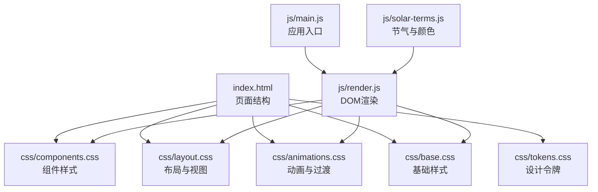
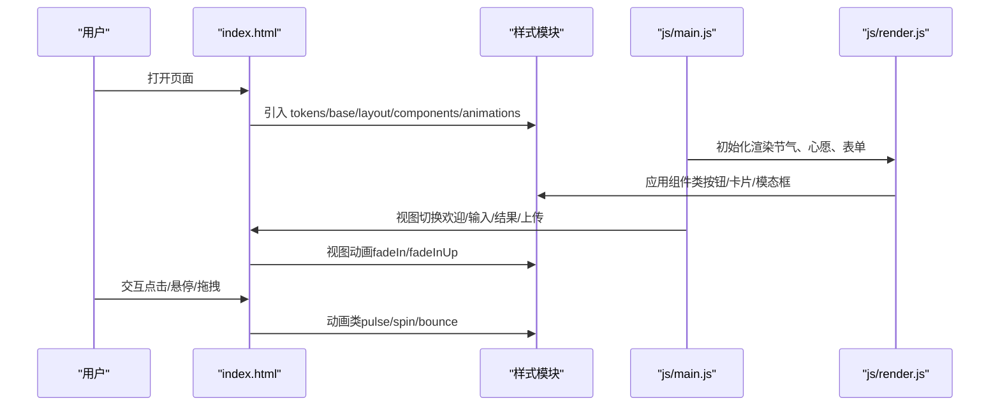
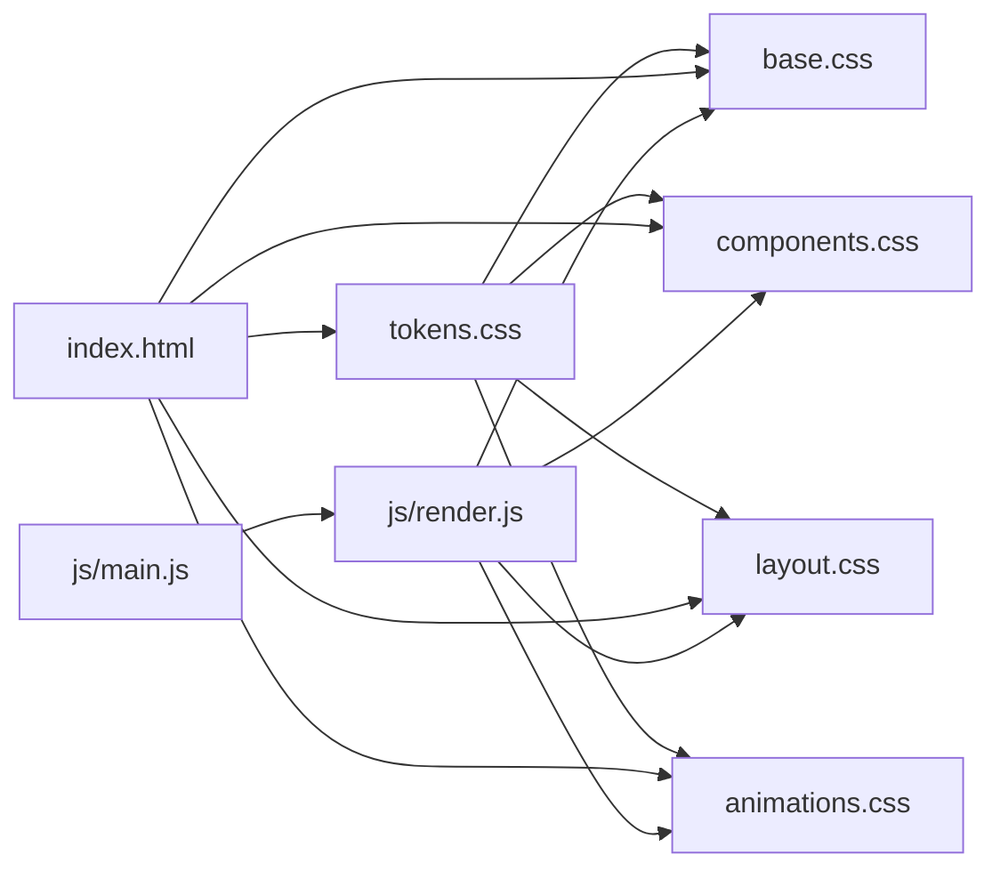

# 样式定制

<cite>
**本文引用的文件**
- [tokens.css](file://css/tokens.css)
- [base.css](file://css/base.css)
- [components.css](file://css/components.css)
- [layout.css](file://css/layout.css)
- [animations.css](file://css/animations.css)
- [index.html](file://index.html)
- [main.js](file://js/main.js)
- [render.js](file://js/render.js)
- [solar-terms.js](file://js/solar-terms.js)
</cite>

## 目录
1. [简介](#简介)
2. [项目结构](#项目结构)
3. [核心组件](#核心组件)
4. [架构总览](#架构总览)
5. [详细组件分析](#详细组件分析)
6. [依赖关系分析](#依赖关系分析)
7. [性能考量](#性能考量)
8. [故障排查指南](#故障排查指南)
9. [结论](#结论)
10. [附录](#附录)

## 简介
本指南面向“五行穿搭建议”项目的样式定制需求，围绕CSS变量系统（tokens.css）展开，系统讲解颜色系统、字体规范、间距体系、断点设置与动画参数；并提供主题定制方法（主色调/辅助色/对比度/无障碍）、组件样式定制（按钮、卡片、导航、表单）、响应式适配（移动端/平板/桌面）、动画与过渡配置、性能优化建议以及样式调试与兼容性处理方法。文档同时结合HTML结构与JS渲染逻辑，帮助你在不破坏现有设计语言的前提下进行安全、可维护的样式扩展。

## 项目结构
该项目采用“分层样式模块化”的组织方式：
- tokens.css：设计令牌（Design Tokens），集中管理颜色、字体、字号、行高、间距、圆角、阴影、动画、Z-index、断点等基础变量。
- base.css：基础样式与通用重置、排版、表单、无障碍、滚动条、选择高亮等。
- components.css：组件级样式（按钮、标签、卡片、上传区、模态框、骨架屏等）。
- layout.css：页面布局与视图系统（视图容器、欢迎页、输入页、结果页、上传页、免责声明与隐私徽章、响应式断点）。
- animations.css：关键帧与动画类，含视图切换、卡片入场、按钮波纹、加载旋转、减少动画偏好等。
- index.html：页面结构，按需引入上述样式文件。
- js/*：运行时渲染逻辑，部分样式通过JS动态注入（如节气元素标签的颜色）。

图表来源
- [index.html](file://index.html#L1-L236)
- [tokens.css](file://css/tokens.css#L1-L109)
- [base.css](file://css/base.css#L1-L168)
- [layout.css](file://css/layout.css#L1-L252)
- [components.css](file://css/components.css#L1-L338)
- [animations.css](file://css/animations.css#L1-L207)
- [main.js](file://js/main.js#L1-L317)
- [render.js](file://js/render.js#L1-L272)
- [solar-terms.js](file://js/solar-terms.js#L1-L118)

章节来源
- [index.html](file://index.html#L1-L236)

## 核心组件
本项目样式系统的核心由以下几部分组成：
- 设计令牌（tokens.css）：统一的颜色、字体、字号、行高、间距、圆角、阴影、动画、Z-index、断点等变量，确保全站一致性与可维护性。
- 基础样式（base.css）：重置、排版、链接、列表、图片、表单控件、无障碍焦点、滚动条、选择高亮、工具类等。
- 组件样式（components.css）：按钮、心愿标签、方案卡片、上传区、模态框、详情区块、骨架屏等。
- 布局样式（layout.css）：视图容器、欢迎页、输入页、结果页、上传页、免责声明与隐私徽章、响应式断点。
- 动画样式（animations.css）：关键帧、视图切换、卡片入场、按钮波纹、加载旋转、减少动画偏好。

章节来源
- [tokens.css](file://css/tokens.css#L1-L109)
- [base.css](file://css/base.css#L1-L168)
- [components.css](file://css/components.css#L1-L338)
- [layout.css](file://css/layout.css#L1-L252)
- [animations.css](file://css/animations.css#L1-L207)

## 架构总览
下图展示了样式系统与页面结构、渲染逻辑之间的交互关系，体现“变量驱动 + 组件组合 + 视图切换 + 动画过渡”的整体架构。

图表来源
- [index.html](file://index.html#L1-L236)
- [tokens.css](file://css/tokens.css#L1-L109)
- [base.css](file://css/base.css#L1-L168)
- [layout.css](file://css/layout.css#L1-L252)
- [components.css](file://css/components.css#L1-L338)
- [animations.css](file://css/animations.css#L1-L207)
- [main.js](file://js/main.js#L1-L317)
- [render.js](file://js/render.js#L1-L272)

## 详细组件分析

### CSS变量系统（tokens.css）
- 颜色系统
  - 五行色彩：木、火、土、金、水五色及其明暗变体，用于主题色与语义强调。
  - 中性色：背景、表面、边框、逆色等，支撑界面层级与对比。
  - 功能色：成功、警告、错误、信息，用于状态反馈。
- 字体系统
  - 展示字体：用于标题、强调文本，营造传统韵味。
  - 正文字体：用于正文与表单，保证易读性。
  - 等宽字体：用于代码或特殊展示。
- 文字规格
  - 从超小到超大多级字号，配合行高体系，形成清晰的视觉层级。
- 间距体系
  - 基于4px网格的间距变量，便于对齐与一致的留白。
- 圆角、阴影、动画参数
  - 圆角、阴影、动画时长与缓动曲线，统一交互质感。
- Z-index层级
  - 基础、下拉、粘性、模态、提示等层级，避免层级冲突。
- 断点（预留）
  - 提供断点变量注释，便于按需启用。

定制建议
- 主题定制：通过修改根变量即可实现整站主题切换（例如替换五色主色、中性色、功能色）。
- 对比度优化：优先使用中性色与功能色的明暗变体，确保文本与背景对比度满足无障碍要求。
- 无障碍支持：保持`:focus-visible`高亮与`:hover`状态的一致性，避免仅依赖颜色表达状态。

章节来源
- [tokens.css](file://css/tokens.css#L1-L109)

### 基础样式（base.css）
- 重置与排版：统一盒模型、字体族、字号、行高、颜色与最小高度。
- 链接与列表：去除默认装饰，统一过渡与悬停行为。
- 图片与媒体：限制最大宽度，自动高度，避免溢出。
- 表单控件：继承字体与尺寸，统一圆角与过渡；聚焦态使用主题色高亮；选择器添加自绘下箭头。
- 无障碍：`:focus-visible`高亮；提供“仅屏幕阅读器可见”的实用类。
- 滚动条与选择高亮：使用中性色与圆角，提升可读性与一致性。
- 工具类：隐藏/不可见、居中、柔和文本等常用工具类。

定制建议
- 表单定制：通过覆盖`base.css`中的表单变量（如背景、边框、圆角、阴影）实现风格统一。
- 无障碍增强：确保所有交互元素具备可见焦点环，避免仅靠颜色区分状态。

章节来源
- [base.css](file://css/base.css#L1-L168)

### 组件样式（components.css）
- 按钮组：基础按钮、主按钮、次按钮、幽灵按钮、大按钮、图标按钮；统一过渡与悬停缩放。
- 心愿标签：普通、悬停、激活态；激活态使用主色填充与逆色文字。
- 方案卡片：表面、圆角、阴影、悬停位移与阴影增强；彩色色条、关键词标签、注解与来源说明、操作区。
- 上传区：虚线边框、悬停/聚焦/拖拽态高亮与背景叠加；占位区与预览区布局；删除按钮定位。
- 模态框：遮罩、内容区、头部/主体/关闭按钮；固定z-index层级。
- 详情区块：标签、正文、引述块；使用展示字体与斜体强调。
- 骨架屏：渐变扫描动画，使用边框色与表面色交替。

定制建议
- 按钮：通过组合类（如`btn-primary` + `btn-large`）实现不同语义与尺寸；如需新语义，可在`base.css`中新增变量并在组件中引用。
- 卡片：通过变量控制阴影与圆角；如需新布局，可在`layout.css`中扩展网格或列数。
- 上传区：通过变量控制占位图标颜色与提示文字大小；拖拽态动画可按需调整。

章节来源
- [components.css](file://css/components.css#L1-L338)

### 布局样式（layout.css）
- 容器与视图：应用容器最小高度与底部空间；视图容器采用flex布局，支持隐藏与显隐。
- 欢迎页：居中布局、标题与副标题、节气横幅（元素标签使用动态颜色）。
- 输入页：标题栏、心愿区、八字表单（两列栅格）、提示文字。
- 结果页：标题区、方案卡片集合（移动端纵向、平板横向、桌面网格）。
- 上传页：居中上传区、反馈区显隐控制。
- 固定元素：免责声明栏与隐私徽章，使用固定定位与z-index层级。
- 响应式：在768px与1024px断点处调整内边距、标题字号与卡片布局。

定制建议
- 视图切换：通过`hidden`类控制显隐；如需自定义动画，可在`animations.css`中扩展。
- 响应式：在断点处调整`grid-template-columns`与`gap`，确保在不同设备上的最佳体验。

章节来源
- [layout.css](file://css/layout.css#L1-L252)

### 动画与过渡（animations.css）
- 关键帧：淡入、淡入上移、淡入缩放、滑入左右、脉冲、旋转、弹跳、骨架屏扫描。
- 视图过渡：进入时的淡入动画。
- 卡片入场： stagger延迟，营造有序的卡片出现。
- 模态框：遮罩淡入、内容缩放进入。
- 按钮：波纹效果（伪元素径向渐变），按下扩散。
- 上传区：拖拽态脉冲动画。
- 加载：旋转指示器。
- 减少动画偏好：尊重用户系统设置，降低动画时长与次数。

定制建议
- 动画参数：通过`tokens.css`中的动画变量统一调整时长与缓动，避免硬编码。
- 减少动画：保留媒体查询分支，确保无障碍友好。

章节来源
- [animations.css](file://css/animations.css#L1-L207)

### 运行时样式注入（render.js）
- 节气元素标签：根据当前节气的五行，动态设置背景色与文字色，确保与主题一致。
- 方案卡片：为每个卡片设置动画延迟，形成有序入场。
- 模态框详情：动态注入卡片色彩与文案，保持与卡片一致的视觉语言。
- Toast消息：动态创建并定位，使用内置动画类。

定制建议
- 动态样式：尽量通过CSS变量与类名组合实现，避免直接写死内联样式；如确需注入，注意清理与复用。

章节来源
- [render.js](file://js/render.js#L1-L272)

## 依赖关系分析
样式模块之间存在明确的依赖与协作关系：
- tokens.css是所有样式的“单一事实源”，其他模块通过变量引用。
- base.css为组件与布局提供基础能力（重置、排版、表单、无障碍）。
- components.css与layout.css分别负责组件与页面布局，二者共同构成页面外观。
- animations.css独立于结构，通过类名与关键帧为交互提供动效。
- index.html按顺序引入样式文件，确保变量先定义后使用。
- js/*在运行时通过类名与内联样式增强交互表现。

图表来源
- [index.html](file://index.html#L1-L236)
- [tokens.css](file://css/tokens.css#L1-L109)
- [base.css](file://css/base.css#L1-L168)
- [layout.css](file://css/layout.css#L1-L252)
- [components.css](file://css/components.css#L1-L338)
- [animations.css](file://css/animations.css#L1-L207)
- [main.js](file://js/main.js#L1-L317)
- [render.js](file://js/render.js#L1-L272)

章节来源
- [index.html](file://index.html#L1-L236)

## 性能考量
- 变量驱动：通过CSS变量减少重复样式，降低文件体积与维护成本。
- 动画优化：使用硬件加速友好的属性（如`transform`与`opacity`），避免频繁触发重排。
- 减少动画：尊重用户偏好，使用媒体查询降低动画时长与次数。
- 响应式：在断点处使用`grid`与`flex`，避免复杂嵌套选择器导致的计算开销。
- 骨架屏：使用线性渐变与关键帧实现轻量级加载反馈，避免复杂图片资源。
- 滚动条与选择高亮：使用纯CSS实现，避免额外脚本开销。

[本节为通用指导，无需特定文件来源]

## 故障排查指南
- 样式未生效
  - 检查样式文件是否正确引入且顺序正确（tokens在前）。
  - 确认变量名拼写与命名空间一致。
- 交互无动画
  - 检查是否正确添加动画类（如`animate-fade-in-up`）。
  - 确认`animations.css`已被引入。
- 按钮无波纹
  - 确认按钮类包含`btn`，且未被覆盖样式。
- 上传区无拖拽高亮
  - 确认拖拽事件绑定与类名切换逻辑正常。
- 模态框无法关闭
  - 检查关闭按钮事件与`hidden`类切换。
- 无障碍问题
  - 确保`:focus-visible`高亮可见，避免仅依赖颜色区分状态。
  - 检查`aria-*`属性与屏幕阅读器标签。

章节来源
- [animations.css](file://css/animations.css#L1-L207)
- [components.css](file://css/components.css#L1-L338)
- [base.css](file://css/base.css#L1-L168)
- [render.js](file://js/render.js#L1-L272)

## 结论
本项目通过“设计令牌 + 组件 + 布局 + 动画”的模块化样式体系，实现了统一、可扩展、可维护的视觉语言。遵循变量驱动与类名组合的原则，可以在不破坏既有设计的前提下进行主题定制、组件扩展与响应式适配，并通过动画与无障碍策略提升用户体验与可访问性。

[本节为总结性内容，无需特定文件来源]

## 附录

### 主题定制方法
- 主色调调整
  - 修改`--color-wood`、`--color-fire`、`--color-earth`、`--color-metal`、`--color-water`及对应明暗变体，即可统一五色主题。
- 辅助色配置
  - 调整`--color-bg`、`--color-surface`、`--color-border`、`--color-text-*`等中性色，以适配深浅主题。
- 对比度优化
  - 使用`--color-text-primary`与`--color-text-secondary`的明暗搭配，确保文本对比度符合无障碍标准。
- 无障碍支持
  - 保持`:focus-visible`高亮与悬停状态一致；为交互元素提供清晰的视觉反馈。

章节来源
- [tokens.css](file://css/tokens.css#L1-L109)
- [base.css](file://css/base.css#L1-L168)

### 组件样式定制清单
- 按钮
  - 基础：`btn`；主色：`btn-primary`；次色：`btn-secondary`；幽灵：`btn-ghost`；大号：`btn-large`；图标：`btn-icon`。
  - 自定义：通过组合类实现；如需新语义，新增变量并在组件中引用。
- 卡片
  - 基础：`scheme-card`；色条：`scheme-color-bar`；关键词：`scheme-keywords` + `scheme-keyword`；注解：`scheme-annotation`；来源：`scheme-source`；操作：`scheme-actions` + `scheme-detail-btn`。
- 导航与视图
  - 标题栏：`entry-header`/`results-header`/`upload-header`；主体区：`entry-body`/`results-body`/`upload-body`；视图容器：`view` + `hidden`。
- 表单元素
  - 输入框：`input`/`select`/`textarea`；聚焦态：`outline`与`box-shadow`；选择器下箭头：自绘SVG。
- 上传区
  - 区域：`upload-zone`；占位：`upload-placeholder`；预览：`upload-preview`；提示：`upload-hint`；删除按钮：`btn-icon`。
- 模态框
  - 容器：`modal` + `hidden`；遮罩：`modal-backdrop`；内容：`modal-content`；头部/主体/关闭：`modal-header`/`modal-body`/`modal-close`。
- 骨架屏
  - 基础：`skeleton`；文本：`skeleton-text`；标题：`skeleton-title`。

章节来源
- [components.css](file://css/components.css#L1-L338)
- [layout.css](file://css/layout.css#L1-L252)
- [base.css](file://css/base.css#L1-L168)

### 响应式设计适配
- 移动端优化
  - 内边距与字号在768px以下保持紧凑；卡片纵向排列，减少横向滚动。
- 平板适配
  - 在768px断点增加内边距与卡片间隙；标题字号适度放大。
- 桌面端布局
  - 在1024px断点启用网格布局，三列展示方案卡片，充分利用空间。

章节来源
- [layout.css](file://css/layout.css#L225-L252)

### 动画效果与过渡配置
- 视图切换：`view`类配合`fadeIn`与`fadeInUp`。
- 卡片入场：`scheme-card`类配合`fadeInUp`与`stagger`延迟。
- 模态框：遮罩`fadeIn`、内容`fadeInScale`。
- 按钮：波纹`radial-gradient`与`scale`扩散。
- 上传区：拖拽态`pulse`。
- 加载：`spin`旋转。
- 减少动画：`prefers-reduced-motion`媒体查询降低动画。

章节来源
- [animations.css](file://css/animations.css#L1-L207)

### 样式调试与浏览器兼容性
- 调试工具
  - 使用浏览器开发者工具检查元素类名与变量值；确认动画类是否正确添加；验证`:focus-visible`高亮。
- 兼容性处理
  - 选择器与属性遵循现代浏览器支持范围；必要时为旧版浏览器提供降级方案（如`appearance: none`的兼容写法）。
  - 无障碍：确保键盘可达与屏幕阅读器友好。

章节来源
- [base.css](file://css/base.css#L1-L168)
- [animations.css](file://css/animations.css#L1-L207)