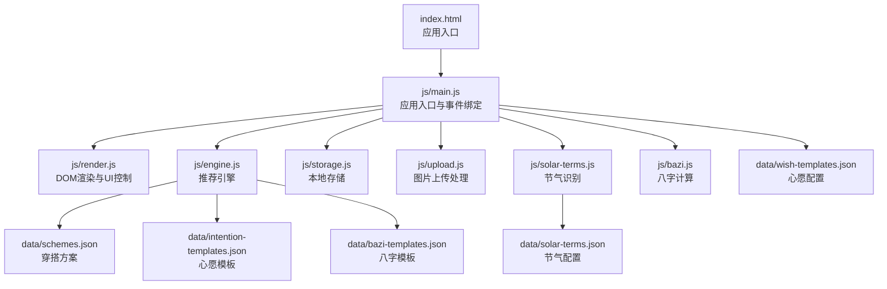
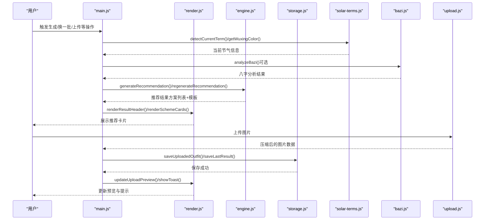
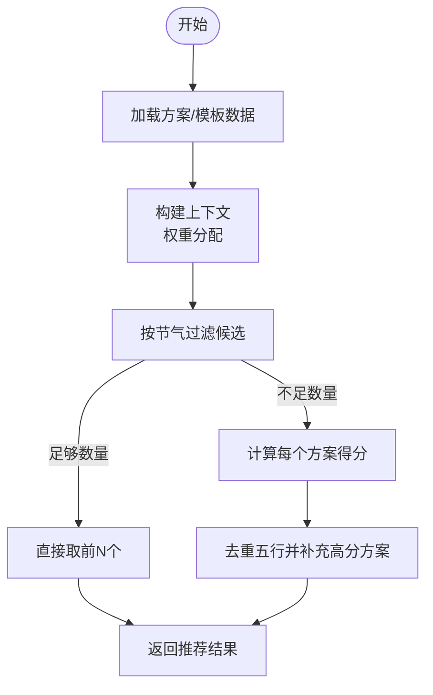
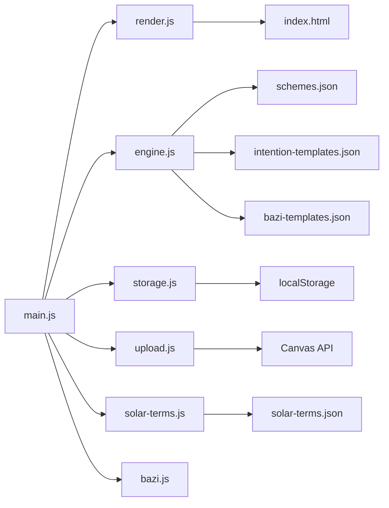

# 模块开发指南

<cite>
**本文档引用的文件**
- [index.html](file://index.html)
- [main.js](file://js/main.js)
- [engine.js](file://js/engine.js)
- [bazi.js](file://js/bazi.js)
- [render.js](file://js/render.js)
- [storage.js](file://js/storage.js)
- [upload.js](file://js/upload.js)
- [solar-terms.js](file://js/solar-terms.js)
- [schemes.json](file://data/schemes.json)
- [intention-templates.json](file://data/intention-templates.json)
- [bazi-templates.json](file://data/bazi-templates.json)
- [solar-terms.json](file://data/solar-terms.json)
- [wish-templates.json](file://data/wish-templates.json)
</cite>

## 目录
1. [简介](#简介)
2. [项目结构](#项目结构)
3. [核心组件](#核心组件)
4. [架构总览](#架构总览)
5. [详细组件分析](#详细组件分析)
6. [依赖关系分析](#依赖关系分析)
7. [性能考虑](#性能考虑)
8. [故障排查指南](#故障排查指南)
9. [结论](#结论)
10. [附录](#附录)

## 简介
本指南面向新增功能模块的开发者，系统阐述在“五行穿搭建议”项目中进行模块化开发的方法论与最佳实践。内容涵盖模块架构设计、接口定义规范、依赖关系管理、模块间通信机制、API扩展设计、数据模型更新、测试方法、部署与版本管理策略以及向后兼容性保障。

## 项目结构
该项目采用前端模块化架构，HTML页面作为入口，JavaScript模块负责业务逻辑、渲染与数据交互，JSON数据文件提供静态配置与模板数据。

图表来源
- [index.html](file://index.html#L1-L236)
- [main.js](file://js/main.js#L1-L317)
- [engine.js](file://js/engine.js#L1-L335)
- [render.js](file://js/render.js#L1-L272)
- [storage.js](file://js/storage.js#L1-L116)
- [upload.js](file://js/upload.js#L1-L145)
- [solar-terms.js](file://js/solar-terms.js#L1-L118)
- [bazi.js](file://js/bazi.js#L1-L193)
- [schemes.json](file://data/schemes.json#L1-L509)
- [intention-templates.json](file://data/intention-templates.json#L1-L253)
- [bazi-templates.json](file://data/bazi-templates.json#L1-L103)
- [solar-terms.json](file://data/solar-terms.json#L1-L42)
- [wish-templates.json](file://data/wish-templates.json#L1-L47)

章节来源
- [index.html](file://index.html#L1-L236)
- [main.js](file://js/main.js#L1-L317)

## 核心组件
- 应用入口模块：负责初始化、事件绑定、视图切换与业务流程编排。
- 推荐引擎模块：加载数据、构建上下文、评分与筛选方案。
- 节气识别模块：解析当前节气与季节信息。
- 八字计算模块：简化版四柱八字计算与五行分析。
- 渲染模块：视图切换、卡片渲染、模态框与提示展示。
- 存储模块：本地持久化与统计数据。
- 上传模块：文件校验、压缩与拖拽上传。
- 数据文件：方案、模板与配置。

章节来源
- [main.js](file://js/main.js#L1-L317)
- [engine.js](file://js/engine.js#L1-L335)
- [solar-terms.js](file://js/solar-terms.js#L1-L118)
- [bazi.js](file://js/bazi.js#L1-L193)
- [render.js](file://js/render.js#L1-L272)
- [storage.js](file://js/storage.js#L1-L116)
- [upload.js](file://js/upload.js#L1-L145)

## 架构总览
模块间采用导入/导出的ES模块方式组织，遵循单一职责原则，通过明确的函数接口进行通信。数据流从用户交互开始，经过入口模块协调，调用引擎与工具模块，最终渲染到UI。

图表来源
- [main.js](file://js/main.js#L1-L317)
- [engine.js](file://js/engine.js#L268-L334)
- [render.js](file://js/render.js#L104-L272)
- [storage.js](file://js/storage.js#L52-L116)
- [upload.js](file://js/upload.js#L12-L145)
- [solar-terms.js](file://js/solar-terms.js#L36-L118)
- [bazi.js](file://js/bazi.js#L182-L193)

## 详细组件分析

### 推荐引擎模块（engine.js）
- 职责：加载方案与模板数据、构建推荐上下文、评分与筛选方案、生成与换一批推荐。
- 关键接口：
  - generateRecommendation(termInfo, wishId, baziResult) → 推荐结果对象
  - regenerateRecommendation(termInfo, wishId, baziResult, excludeIds) → 新推荐结果
  - buildContext(...)、scoreScheme(...)、selectSchemes(...)
- 数据依赖：schemes.json、intention-templates.json、bazi-templates.json
- 设计要点：
  - 上下文权重分配（节气、心愿、八字）可配置
  - 评分考虑相生关系与节气距离
  - 筛选保证多样性与高分优先

图表来源
- [engine.js](file://js/engine.js#L268-L334)
- [schemes.json](file://data/schemes.json#L1-L509)
- [intention-templates.json](file://data/intention-templates.json#L1-L253)
- [bazi-templates.json](file://data/bazi-templates.json#L1-L103)

章节来源
- [engine.js](file://js/engine.js#L1-L335)

### 节气识别模块（solar-terms.js）
- 职责：加载节气配置、检测当前节气、返回节气与季节信息。
- 关键接口：
  - detectCurrentTerm(date?) → {current,next,seasonInfo,wuxingNames}
  - getWuxingColor(wuxing) → 颜色值
- 设计要点：
  - UTC+8时间处理
  - 支持跨月边界查找
  - 提供五行名称映射

章节来源
- [solar-terms.js](file://js/solar-terms.js#L1-L118)
- [solar-terms.json](file://data/solar-terms.json#L1-L42)

### 八字计算模块（bazi.js）
- 职责：简化版四柱八字计算、五行分布统计、推荐元素分析。
- 关键接口：
  - calcBazi(year, month, day, hour) → 四柱信息
  - calcWuxingProfile(baziData) → 五行分布
  - getRecommendElement(profile) → 推荐元素
  - analyzeBazi(year, month, day, hour) → 完整分析结果
- 设计要点：
  - 使用简化算法，便于浏览器端运行
  - 输出可用于引擎权重与模板匹配

章节来源
- [bazi.js](file://js/bazi.js#L1-L193)

### 渲染模块（render.js）
- 职责：视图切换、表单初始化、卡片渲染、模态框与Toast提示。
- 关键接口：
  - showView(viewId)
  - initYearSelect()/initDaySelect()
  - renderSolarBanner()/renderResultHeader()/renderSchemeCards()
  - renderDetailModal(scheme)/showModal()/closeModal()
  - updateUploadPreview(imageData)/showToast(message)

章节来源
- [render.js](file://js/render.js#L1-L272)

### 存储模块（storage.js）
- 职责：统一的本地存储封装，提供业务级方法。
- 关键接口：
  - get/set/remove/clearAll/getKeysByPrefix
  - getLastBazi()/saveLastBazi()
  - getLastResult()/saveLastResult()
  - getFeedback()/saveFeedback()
  - getUploadedOutfit()/saveUploadedOutfit()/removeUploadedOutfit()
  - getUsageStats()/incrementUsage()
  - isFirstVisit()/markVisited()
  - getSelectedWish()/saveSelectedWish()

章节来源
- [storage.js](file://js/storage.js#L1-L116)

### 上传模块（upload.js）
- 职责：文件校验、图片压缩、拖拽上传、键盘支持。
- 关键接口：
  - validateFile(file) → {valid,error?}
  - compressImage(file) → Promise<string>
  - initUploadZone(onUpload)
  - getTodayString() → "YYYY-MM-DD"

章节来源
- [upload.js](file://js/upload.js#L1-L145)

### 应用入口模块（main.js）
- 职责：应用初始化、事件绑定、业务流程编排、与各模块协作。
- 关键流程：
  - 初始化节气、表单、视图
  - 绑定按钮事件与模态框交互
  - 处理生成/换一批/上传/反馈保存
  - 调用存储与渲染模块

章节来源
- [main.js](file://js/main.js#L1-L317)

## 依赖关系分析
- 模块耦合：
  - main.js是协调者，依赖 render、engine、storage、upload、solar-terms、bazi。
  - engine.js依赖 data/* 模板与配置。
  - render.js依赖 DOM 与样式。
  - storage.js依赖 localStorage。
  - upload.js依赖 Canvas 与 File API。
- 外部依赖：
  - HTML/CSS 提供 UI 结构与样式。
  - JSON 数据文件提供静态配置。

图表来源
- [main.js](file://js/main.js#L1-L317)
- [engine.js](file://js/engine.js#L1-L335)
- [render.js](file://js/render.js#L1-L272)
- [storage.js](file://js/storage.js#L1-L116)
- [upload.js](file://js/upload.js#L1-L145)
- [solar-terms.js](file://js/solar-terms.js#L1-L118)
- [bazi.js](file://js/bazi.js#L1-L193)
- [schemes.json](file://data/schemes.json#L1-L509)
- [intention-templates.json](file://data/intention-templates.json#L1-L253)
- [bazi-templates.json](file://data/bazi-templates.json#L1-L103)
- [solar-terms.json](file://data/solar-terms.json#L1-L42)

## 性能考虑
- 数据加载优化：
  - 引擎模块对数据采用懒加载与缓存，避免重复请求。
  - 使用 Promise.all 并行加载多源数据。
- 计算优化：
  - 评分与筛选在内存中完成，复杂度与方案数量线性相关。
  - 节气距离计算使用循环索引，避免分支过多。
- 渲染优化：
  - 卡片动画延迟逐个触发，提升感知流畅度。
  - 模态框显示时锁定滚动，避免布局抖动。
- 上传优化：
  - 压缩算法自适应质量，优先保证目标大小。
  - 拖拽与键盘支持减少交互成本。

[本节为通用指导，无需特定文件来源]

## 故障排查指南
- 常见问题与定位：
  - 推荐为空：检查数据加载是否成功、上下文权重是否合理、筛选条件是否过于严格。
  - 节气识别异常：确认时间转换与跨月边界逻辑、默认 fallback。
  - 八字计算偏差：核对简化算法参数与基准日期。
  - 上传失败：检查文件类型/大小限制、Canvas 导出质量阈值。
  - 本地存储异常：确认 localStorage 可用性与键名前缀。
- 建议排查步骤：
  - 打开浏览器控制台查看错误日志。
  - 分模块断点调试，逐步验证数据流。
  - 对比期望与实际输出，缩小范围。

章节来源
- [engine.js](file://js/engine.js#L39-L79)
- [solar-terms.js](file://js/solar-terms.js#L36-L103)
- [upload.js](file://js/upload.js#L12-L82)
- [storage.js](file://js/storage.js#L7-L27)

## 结论
本指南提供了在现有架构基础上新增模块的完整方法论。通过明确的模块边界、清晰的接口契约、合理的数据与缓存策略，以及完善的测试与部署流程，可以高效、安全地扩展“五行穿搭建议”项目的功能。

[本节为总结，无需特定文件来源]

## 附录

### 新增功能模块开发流程
- 架构设计
  - 明确模块职责与边界，避免与现有模块耦合过深。
  - 设计稳定的导出接口，保持向后兼容。
- 接口定义规范
  - 函数签名：参数类型与默认值明确，返回值结构稳定。
  - 参数验证：在入口处统一校验，失败快速返回并记录错误。
  - 错误处理：区分业务错误与系统错误，提供可读的错误信息。
- 依赖关系管理
  - 优先使用 ES 模块导入/导出，避免全局变量污染。
  - 对外部资源（数据文件、Canvas）做好降级与容错。
- 模块间通信机制
  - 通过入口模块 main.js 协调调用，必要时引入事件总线或发布订阅模式。
  - 避免直接修改全局状态，统一通过存储模块进行持久化。

### API 接口扩展规范
- 函数签名设计
  - 输入参数：使用对象参数传递，便于扩展与向后兼容。
  - 返回值：统一包装为 {success, data?, error?} 结构。
- 参数验证规则
  - 类型检查、范围约束、必填字段校验。
  - 对外部输入（文件、网络）进行严格校验。
- 返回值格式规范
  - 成功：{success: true, data: ...}
  - 失败：{success: false, error: "..."}
- 错误处理机制
  - 区分客户端错误与服务端错误，提供统一的错误码与消息。
  - 记录日志并上报，便于追踪与修复。

### 数据模型更新方法
- 数据结构设计
  - 方案模型：包含 id、termId、color、material、feeling、annotation、source。
  - 模板模型：包含 intention、solarTerm、color、material、feeling、annotation、source。
  - 配置模型：包含 wishes、seasonModifiers 等。
- 验证规则编写
  - JSON Schema 或运行时校验，确保字段完整性与一致性。
- 持久化策略
  - 本地存储：使用 storage.js 的封装方法，统一键名与序列化。
  - 缓存机制：对频繁访问的数据进行内存缓存，避免重复加载。
- 缓存机制
  - 引擎模块已内置数据缓存，新增模块可复用该模式。

章节来源
- [engine.js](file://js/engine.js#L39-L79)
- [storage.js](file://js/storage.js#L52-L116)
- [schemes.json](file://data/schemes.json#L1-L509)
- [intention-templates.json](file://data/intention-templates.json#L1-L253)
- [bazi-templates.json](file://data/bazi-templates.json#L1-L103)
- [wish-templates.json](file://data/wish-templates.json#L1-L47)

### 模块测试方法
- 单元测试
  - 测试核心函数：generateRecommendation、calcBazi、detectCurrentTerm、validateFile。
  - 使用模拟数据与断言验证输出结构与边界条件。
- 集成测试
  - 模拟用户流程：输入→生成→渲染→存储→上传→反馈。
  - 覆盖异常路径：网络失败、存储失败、Canvas 导出失败。
- 性能测试
  - 压测大数据量场景：大量方案与模板的评分与筛选。
  - 上传性能：不同分辨率与格式的压缩耗时。

[本节为通用指导，无需特定文件来源]

### 模块部署流程
- 版本管理策略
  - 使用语义化版本号，变更类型：主版本（破坏性）、次版本（新增功能）、修订版本（修复）。
  - 发布前进行回归测试与性能评估。
- 向后兼容性保证措施
  - 接口参数与返回值保持稳定，新增字段以可选形式存在。
  - 数据模型扩展时保留旧字段，提供迁移脚本。
- 部署与回滚
  - 采用蓝绿部署或灰度发布，最小化风险。
  - 准备回滚预案，确保快速恢复。

[本节为通用指导，无需特定文件来源]

### 开发最佳实践与代码质量保证
- 代码风格
  - 统一命名规范：模块名使用小写与连字符，函数与类首字母大写。
  - 注释与文档：为公共接口提供清晰注释，说明参数、返回值与异常。
- 错误处理
  - 在调用链中逐层捕获与包装错误，向上抛出可读信息。
- 性能监控
  - 记录关键指标：数据加载耗时、渲染耗时、上传耗时。
- 安全与隐私
  - 本地存储敏感信息需加密或最小化存储。
  - 遵循隐私政策，明确数据使用范围。

[本节为通用指导，无需特定文件来源]