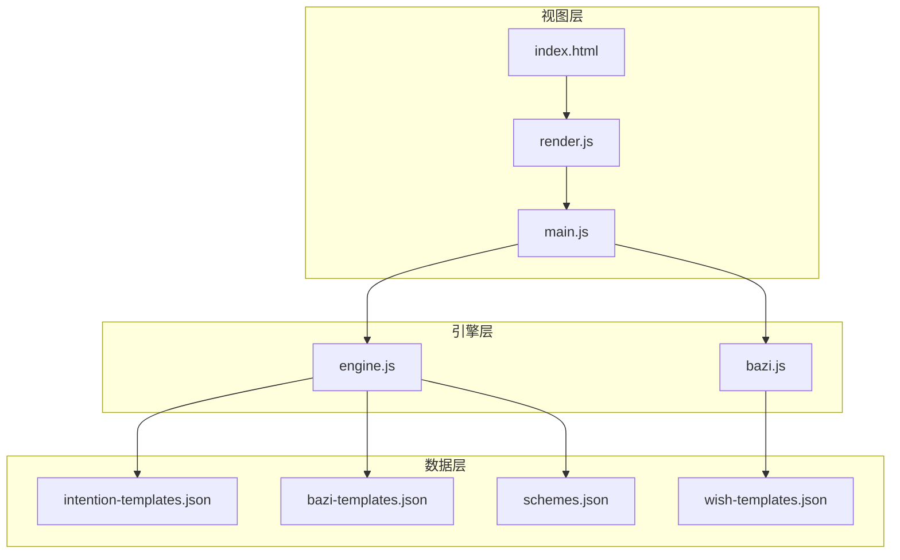
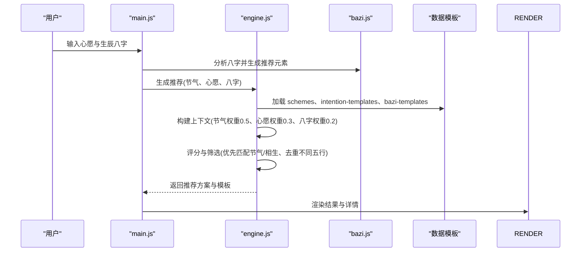
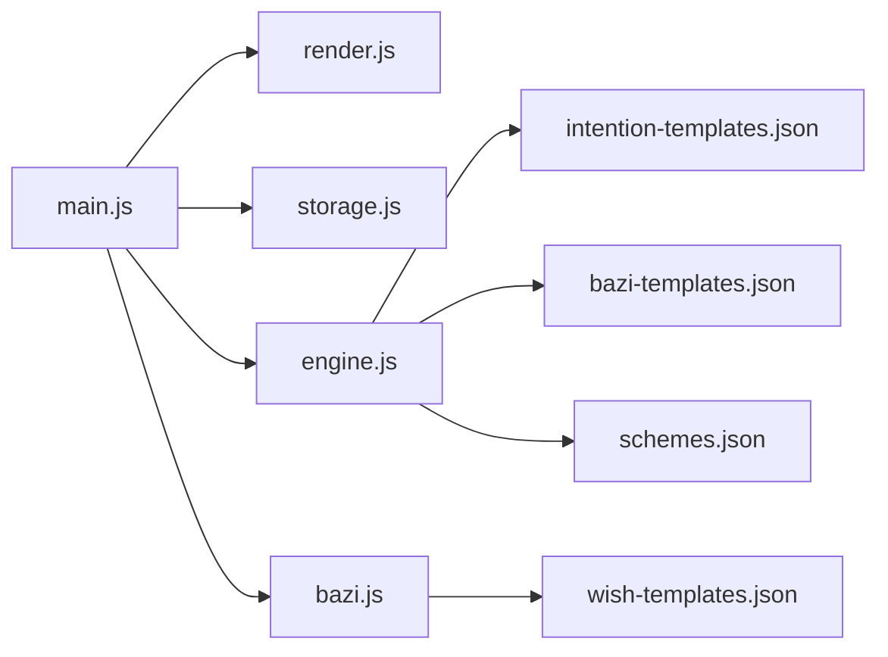

# 模板扩展

<cite>
**本文引用的文件列表**
- [intention-templates.json](file://data/intention-templates.json)
- [bazi-templates.json](file://data/bazi-templates.json)
- [wish-templates.json](file://data/wish-templates.json)
- [schemes.json](file://data/schemes.json)
- [engine.js](file://js/engine.js)
- [bazi.js](file://js/bazi.js)
- [main.js](file://js/main.js)
- [render.js](file://js/render.js)
- [storage.js](file://js/storage.js)
- [index.html](file://index.html)
</cite>

## 目录
1. [简介](#简介)
2. [项目结构](#项目结构)
3. [核心组件](#核心组件)
4. [架构总览](#架构总览)
5. [详细组件分析](#详细组件分析)
6. [依赖关系分析](#依赖关系分析)
7. [性能考量](#性能考量)
8. [故障排查指南](#故障排查指南)
9. [结论](#结论)
10. [附录](#附录)

## 简介
本指南面向希望扩展“五行穿搭建议”项目的开发者，系统讲解如何扩展以下三类模板：
- 心愿模板：intention-templates.json 的格式规范、字段定义、匹配规则、使用场景适配与优先级设置
- 八字模板：bazi-templates.json 的结构说明、分类标准、分析规则、推荐依据与模板更新流程
- 自定义心愿选项：wish-templates.json 的扩展方法与自定义心愿选项添加步骤

同时提供模板测试验证方法、向后兼容性保证与模板版本管理策略，帮助你在不破坏现有功能的前提下安全扩展。

## 项目结构
项目采用前端单页应用结构，数据与逻辑分离：
- 数据层：JSON 模板文件（intention-templates.json、bazi-templates.json、wish-templates.json、schemes.json）
- 引擎层：推荐算法与匹配逻辑（engine.js）
- 计算层：八字分析（bazi.js）
- 视图层：DOM 渲染与交互（render.js、main.js、index.html）
- 存储层：本地持久化（storage.js）

图表来源
- [index.html](file://index.html#L1-L236)
- [render.js](file://js/render.js#L1-L272)
- [main.js](file://js/main.js#L1-L317)
- [engine.js](file://js/engine.js#L1-L335)
- [bazi.js](file://js/bazi.js#L1-L193)
- [intention-templates.json](file://data/intention-templates.json#L1-L253)
- [bazi-templates.json](file://data/bazi-templates.json#L1-L103)
- [wish-templates.json](file://data/wish-templates.json#L1-L47)
- [schemes.json](file://data/schemes.json#L1-L509)

章节来源
- [index.html](file://index.html#L1-L236)
- [engine.js](file://js/engine.js#L1-L335)
- [bazi.js](file://js/bazi.js#L1-L193)
- [main.js](file://js/main.js#L1-L317)
- [render.js](file://js/render.js#L1-L272)
- [storage.js](file://js/storage.js#L1-L116)

## 核心组件
- 引擎模块（engine.js）负责加载模板、构建上下文、评分与筛选方案，并输出最终推荐
- 八字模块（bazi.js）负责生辰八字解析、五行统计与推荐元素
- 视图与交互（main.js、render.js）负责用户输入、渲染结果与模态详情
- 数据模板（intention-templates.json、bazi-templates.json、wish-templates.json、schemes.json）提供推荐依据与匹配规则

章节来源
- [engine.js](file://js/engine.js#L1-L335)
- [bazi.js](file://js/bazi.js#L1-L193)
- [main.js](file://js/main.js#L1-L317)
- [render.js](file://js/render.js#L1-L272)

## 架构总览
推荐流程概览如下：

图表来源
- [main.js](file://js/main.js#L200-L244)
- [engine.js](file://js/engine.js#L268-L310)
- [bazi.js](file://js/bazi.js#L182-L192)
- [render.js](file://js/render.js#L114-L154)

## 详细组件分析

### 心愿模板扩展指南（intention-templates.json）
- 模板格式与字段定义
  - 每个模板对象包含唯一 id、心愿类型 intention、节气 solarTerm、色彩 color、材质 material、感受 feeling、注释 annotation、来源 source
  - intention 字段用于区分“求职”“贵人运”“远行顺利”“静心专注”“健康舒畅”等心愿类别
  - solarTerm 字段对应节气名称，用于与当前节气进行距离匹配
  - color、material、feeling 提供穿搭建议的直观描述
  - annotation 与 source 提供文化与典籍依据

- 匹配规则与优先级
  - 引擎按 intention 筛选模板集合，再按当前节气与模板节气的循环距离排序，取最近者作为最佳匹配
  - 距离计算考虑节气顺序的循环特性，确保跨年的正确性
  - 优先级：当前节气最近的模板优先；若无匹配则返回空

- 使用场景适配
  - 不同心愿类型（如“求职”“贵人运”）可分别维护多条模板，覆盖不同节气
  - 建议为每个 intention 在每个节气至少保留一条模板，保证覆盖率

- 扩展步骤
  1) 在 intention-templates.json 中新增模板对象，填写必要字段
  2) 确认 intention 与 wish-templates.json 中的 wish.id 对应
  3) 确认 solarTerm 与节气映射一致（TERM_NAME_MAP 与 TERM_ORDER）
  4) 为新模板撰写 annotation 与 source，增强可信度
  5) 本地运行并验证匹配逻辑是否按预期返回最近节气模板

- 测试验证方法
  - 在 main.js 中临时切换 wishId 与 termId，观察 findBestIntentionTemplate 的返回值
  - 使用 render.js 的渲染函数验证模板字段在 UI 中显示正常
  - 参考 engine.js 的 getTermDistance 与 findBestIntentionTemplate 的实现进行单元测试

章节来源
- [intention-templates.json](file://data/intention-templates.json#L1-L253)
- [engine.js](file://js/engine.js#L82-L119)
- [engine.js](file://js/engine.js#L104-L119)
- [engine.js](file://js/engine.js#L84-L99)
- [engine.js](file://js/engine.js#L10-L16)
- [engine.js](file://js/engine.js#L18-L34)
- [render.js](file://js/render.js#L114-L154)
- [main.js](file://js/main.js#L200-L244)

### 八字模板扩展指南（bazi-templates.json）
- 结构说明
  - 每个模板对象包含唯一 id、baZiKey（日主与年份组合）、节气 solarTerm、色彩 color、材质 material、感受 feeling、注释 annotation、来源 source
  - baZiKey 用于标识“日主某元素旺”与“某年”的模板组合

- 分类标准
  - 按“日主强弱”与“年份”分类，模板 id 建议包含元素与年份，便于快速检索
  - 每个元素（木/火/土/金/水）每年至少保留一条模板，保证覆盖性

- 分析规则与推荐依据
  - 八字分析流程：计算四柱、统计天干地支五行分布、识别最强与最弱元素、给出推荐元素
  - 引擎优先查找“当年+日主某元素旺”的模板；若不存在，则回退到“日主某元素旺”的任意年份模板
  - 推荐依据：annotation 与 source 提供文化解释与典籍出处

- 扩展步骤
  1) 在 bazi-templates.json 中新增模板对象，填写 baZiKey、solarTerm、color、material、feeling、annotation、source
  2) 确保 baZiKey 的“日主某元素旺”与引擎中的 elementNameMap 映射一致
  3) 为新模板撰写 annotation 与 source，增强可信度
  4) 本地运行并验证 findBestBaziTemplate 的匹配逻辑

- 模板更新流程
  - 新增模板后，先在本地验证匹配逻辑与渲染效果
  - 如需调整引擎匹配策略（如增加权重或引入更多条件），修改 engine.js 中的 findBestBaziTemplate 与 buildContext
  - 发布前进行回归测试，确保不影响现有模板

- 测试验证方法
  - 在 main.js 中构造模拟 baziResult，调用 analyzeBazi 并检查 recommend 字段
  - 在 engine.js 中断点调试 findBestBaziTemplate，确认当年优先与回退逻辑
  - 使用 render.js 渲染详情，核对模板字段显示

章节来源
- [bazi-templates.json](file://data/bazi-templates.json#L1-L103)
- [bazi.js](file://js/bazi.js#L129-L172)
- [bazi.js](file://js/bazi.js#L182-L192)
- [engine.js](file://js/engine.js#L121-L152)
- [engine.js](file://js/engine.js#L154-L173)
- [render.js](file://js/render.js#L159-L193)

### 自定义心愿选项扩展（wish-templates.json）
- 扩展方法
  - 在 wishes 数组中新增心愿对象，包含 id、name、colorBias、materialBias、advice
  - id 与 engine.js 中的 INTENTION_MAP 保持一致，确保引擎能正确映射到 intention-templates.json
  - seasonModifiers 中的 boost 与 avoid 定义了季节对五行的影响，可用于进一步优化匹配

- 添加步骤
  1) 在 wish-templates.json 中新增 wish 对象
  2) 在 main.js 中的 selectWish 逻辑中确保 UI 正确展示与保存
  3) 在 engine.js 中确认 INTENTION_MAP 与 TERM_NAME_MAP 能正确解析 wishId 与节气
  4) 为新心愿准备 intention-templates.json 的模板，确保覆盖主要节气
  5) 本地测试生成与渲染流程

- 测试验证方法
  - 在 main.js 中切换 wishId 并触发 handleGenerate，观察渲染结果
  - 在 render.js 中核对 wish 名称与 advice 是否正确显示

章节来源
- [wish-templates.json](file://data/wish-templates.json#L1-L47)
- [engine.js](file://js/engine.js#L10-L16)
- [engine.js](file://js/engine.js#L18-L26)
- [main.js](file://js/main.js#L158-L164)
- [render.js](file://js/render.js#L114-L154)

### 方案模板（schemes.json）与评分机制
- 结构说明
  - schemes 数组中的每个方案包含 id、termId、rank、color（name/hex/wuxing）、material、feeling、annotation、source
  - termId 与节气 ID 对应，用于按节气过滤方案

- 评分与筛选
  - 上下文权重：节气 0.5、心愿 0.3、八字 0.2
  - 评分规则：与节气/推荐元素相同得满分，相生得 60%，否则 0
  - 筛选策略：优先选择当前节气相关方案；不足时按得分排序；确保不同五行至少出现一次，再补充高分方案

- 扩展建议
  - 每个节气至少提供 3 条方案，覆盖不同五行
  - color.hex 与 color.wuxing 保持一致，避免视觉与逻辑冲突
  - annotation 与 source 体现节气与五行文化背景

章节来源
- [schemes.json](file://data/schemes.json#L1-L509)
- [engine.js](file://js/engine.js#L175-L259)

## 依赖关系分析
- 引擎依赖
  - engine.js 依赖 wish-templates.json 的映射与偏好、intention-templates.json 的心愿模板、bazi-templates.json 的八字模板、schemes.json 的方案库
  - 引擎通过 TERM_NAME_MAP 与 TERM_ORDER 实现节气名称与 ID 的双向映射

- 视图依赖
  - main.js 依赖 render.js 进行视图切换与渲染，依赖 storage.js 进行本地持久化
  - index.html 定义视图结构与交互入口

图表来源
- [main.js](file://js/main.js#L1-L317)
- [render.js](file://js/render.js#L1-L272)
- [storage.js](file://js/storage.js#L1-L116)
- [engine.js](file://js/engine.js#L1-L335)
- [bazi.js](file://js/bazi.js#L1-L193)
- [intention-templates.json](file://data/intention-templates.json#L1-L253)
- [bazi-templates.json](file://data/bazi-templates.json#L1-L103)
- [wish-templates.json](file://data/wish-templates.json#L1-L47)
- [schemes.json](file://data/schemes.json#L1-L509)

## 性能考量
- 模板加载
  - 引擎使用 Promise.all 并行加载 schemes、intention-templates、bazi-templates，减少等待时间
- 匹配复杂度
  - findBestIntentionTemplate 对模板数组进行线性筛选与排序，复杂度 O(n log n)，n 为同一心愿类型的模板数量
  - findBestBaziTemplate 采用常量时间查找，复杂度 O(1)（忽略字符串匹配）
- 评分与筛选
  - selectSchemes 对所有方案进行一次遍历与排序，复杂度 O(m log m)，m 为可用方案数
- 优化建议
  - 控制模板数量，避免单一心愿类型模板过多导致排序开销增大
  - 将常用模板置于前部，减少排序比较次数
  - 对模板进行分桶（按 intention 或 baZiKey），在引擎侧做预筛选

[本节为通用性能讨论，无需列出章节来源]

## 故障排查指南
- 心愿模板不生效
  - 检查 wish.id 与 INTENTION_MAP 是否一致
  - 确认 intention-templates.json 中 intention 字段与 wish.name 对应
  - 验证 TERM_NAME_MAP 与 TERM_ORDER 中的节气名称与 ID

- 八字模板不匹配
  - 检查 baZiKey 的“日主某元素旺”与 elementNameMap 的映射
  - 确认 findBestBaziTemplate 的当年优先与回退逻辑是否符合预期
  - 核对当前年份与模板年份是否一致

- 方案不显示或为空
  - 检查 schemes.json 中 termId 与当前节气 ID 是否一致
  - 确认 selectSchemes 的筛选与评分逻辑是否正确执行
  - 使用 render.js 的渲染函数核对字段显示

- 本地存储问题
  - 使用 storage.js 的 get/set/remove 方法检查键名与数据结构
  - 若需要清理，使用 clearAll 或按前缀删除

章节来源
- [engine.js](file://js/engine.js#L10-L16)
- [engine.js](file://js/engine.js#L18-L34)
- [engine.js](file://js/engine.js#L121-L152)
- [engine.js](file://js/engine.js#L218-L259)
- [storage.js](file://js/storage.js#L51-L115)

## 结论
通过本指南，你可以安全地扩展“五行穿搭建议”项目的模板体系：
- 心愿模板按节气最近性匹配，确保与当前节气高度契合
- 八字模板按日主元素与年份匹配，提供个性化推荐依据
- 自定义心愿选项通过 wish-templates.json 与引擎映射实现无缝集成
- 建议在扩展过程中严格遵循字段规范、测试验证与向后兼容策略，确保系统稳定与用户体验一致

[本节为总结性内容，无需列出章节来源]

## 附录

### 模板字段定义一览
- 心愿模板（intention-templates.json）
  - id：模板唯一标识
  - intention：心愿类型（如“求职”“贵人运”）
  - solarTerm：节气名称
  - color/material/feeling：色彩/材质/感受
  - annotation/source：注释与来源

- 八字模板（bazi-templates.json）
  - id：模板唯一标识
  - baZiKey：日主元素与年份组合
  - solarTerm：节气名称
  - color/material/feeling：色彩/材质/感受
  - annotation/source：注释与来源

- 自定义心愿（wish-templates.json）
  - id/name：心愿标识与名称
  - colorBias/materialBias：色彩与材质偏好
  - advice：建议说明
  - seasonModifiers：季节对五行的增减影响

- 方案模板（schemes.json）
  - id/termId/rank：方案标识、节气与排序
  - color（name/hex/wuxing）：色彩信息
  - material/feeling：材质与感受
  - annotation/source：注释与来源

章节来源
- [intention-templates.json](file://data/intention-templates.json#L1-L253)
- [bazi-templates.json](file://data/bazi-templates.json#L1-L103)
- [wish-templates.json](file://data/wish-templates.json#L1-L47)
- [schemes.json](file://data/schemes.json#L1-L509)

### 模板测试与验证清单
- 心愿模板
  - 为每个 intention 在每个节气至少保留一条模板
  - 编写 annotation 与 source，核对渲染显示
  - 使用 engine.js 的 findBestIntentionTemplate 断点验证匹配逻辑

- 八字模板
  - 为每种日主元素每年保留模板
  - 核对 baZiKey 与 elementNameMap 的映射
  - 使用 engine.js 的 findBestBaziTemplate 断点验证当年优先与回退逻辑

- 自定义心愿
  - 在 wish-templates.json 中新增 wish 对象
  - 在 main.js 中验证 UI 展示与保存
  - 在 engine.js 中确认映射与渲染

- 方案模板
  - 每个节气至少 3 条方案
  - color.hex 与 color.wuxing 一致
  - 使用 engine.js 的 selectSchemes 验证评分与筛选

章节来源
- [engine.js](file://js/engine.js#L82-L119)
- [engine.js](file://js/engine.js#L121-L152)
- [engine.js](file://js/engine.js#L218-L259)
- [render.js](file://js/render.js#L114-L154)
- [main.js](file://js/main.js#L158-L164)

### 向后兼容性与版本管理策略
- 向后兼容性
  - 新增模板字段时，保持旧字段不变，避免破坏既有逻辑
  - 引擎侧对缺失字段进行默认处理，防止报错
  - 保持 wish.id 与 intention-templates.json 的 intention 字段一致性

- 版本管理
  - 为模板文件添加版本号字段（如 version），在引擎侧校验版本
  - 对模板结构变更进行迁移脚本，逐步替换旧模板
  - 发布前进行回归测试，确保所有模板仍能正常工作

[本节为通用策略建议，无需列出章节来源]