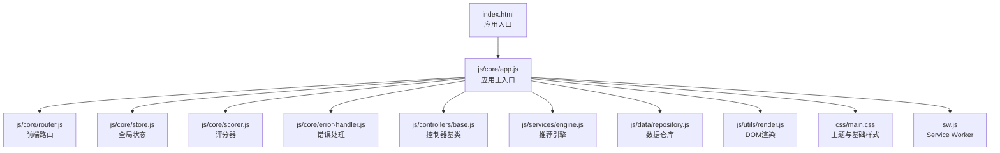
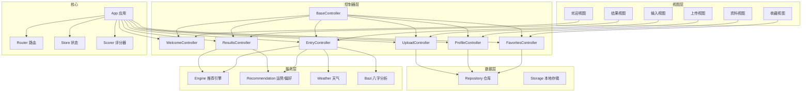
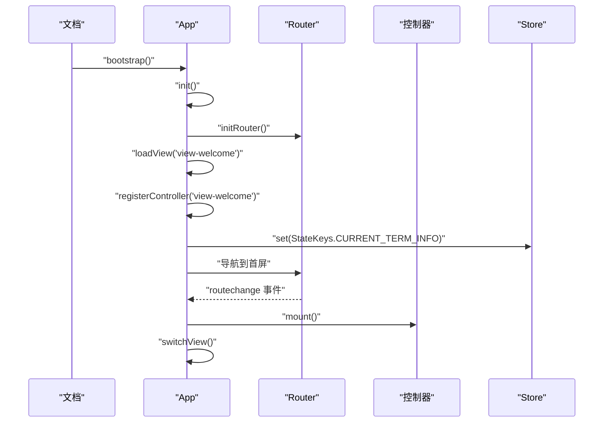
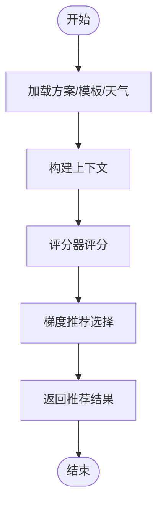
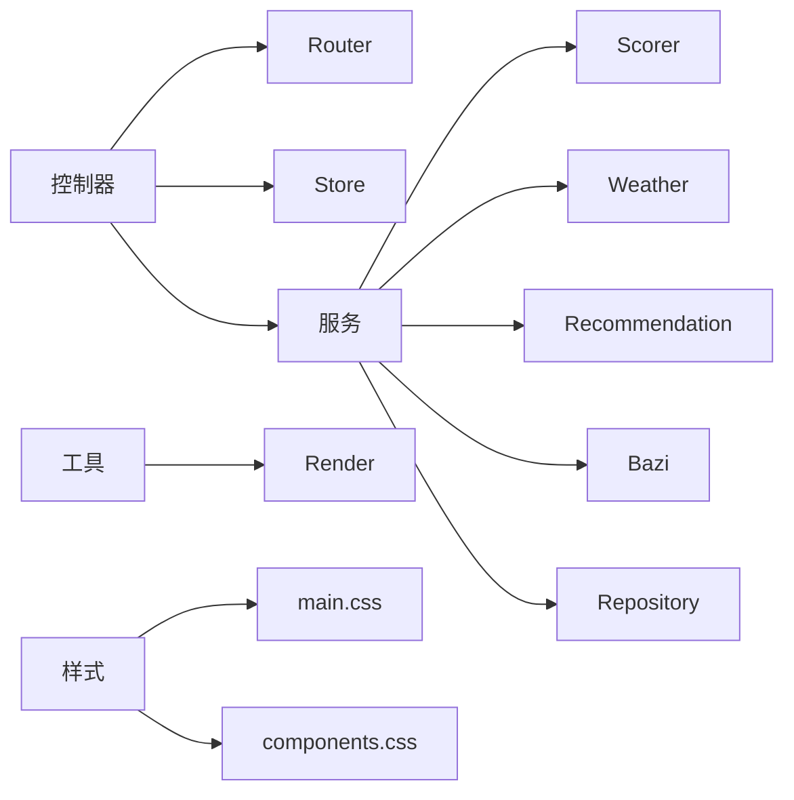

# 开发指南

<cite>
**本文引用的文件**
- [index.html](file://index.html)
- [js/core/app.js](file://js/core/app.js)
- [js/core/router.js](file://js/core/router.js)
- [js/core/store.js](file://js/core/store.js)
- [js/core/scorer.js](file://js/core/scorer.js)
- [js/core/error-handler.js](file://js/core/error-handler.js)
- [js/controllers/base.js](file://js/controllers/base.js)
- [js/controllers/welcome.js](file://js/controllers/welcome.js)
- [js/controllers/entry.js](file://js/controllers/entry.js)
- [js/components/base.js](file://js/components/base.js)
- [js/components/weather-widget.js](file://js/components/weather-widget.js)
- [js/services/engine.js](file://js/services/engine.js)
- [js/services/recommendation.js](file://js/services/recommendation.js)
- [js/services/weather.js](file://js/services/weather.js)
- [js/services/bazi.js](file://js/services/bazi.js)
- [js/data/repository.js](file://js/data/repository.js)
- [js/data/storage.js](file://js/data/storage.js)
- [js/data/data-manager.js](file://js/data/data-manager.js)
- [js/utils/render.js](file://js/utils/render.js)
- [js/utils/profile.js](file://js/utils/profile.js)
- [js/utils/share.js](file://js/utils/share.js)
- [js/utils/upload.js](file://js/utils/upload.js)
- [js/utils/diary.js](file://js/utils/diary.js)
- [css/main.css](file://css/main.css)
- [css/components.css](file://css/components.css)
- [sw.js](file://sw.js)
</cite>

## 目录
1. [简介](#简介)
2. [项目结构](#项目结构)
3. [核心组件](#核心组件)
4. [架构总览](#架构总览)
5. [详细组件分析](#详细组件分析)
6. [依赖分析](#依赖分析)
7. [性能考虑](#性能考虑)
8. [故障排查指南](#故障排查指南)
9. [结论](#结论)
10. [附录](#附录)

## 简介
本指南面向希望扩展与定制“五行穿搭建议”项目的开发者，目标是帮助你快速理解并高效地进行功能迭代与架构扩展。文档围绕 MVC 模式、模块化设计与组件通信机制展开，提供控制器与服务层扩展方法、数据模型扩展策略、样式扩展策略，以及开发流程、最佳实践与常见问题解决方案。

## 项目结构
项目采用前端单页应用（SPA）架构，以模块化组织代码，分为以下层次：
- 视图与入口：index.html 作为应用入口，动态加载各视图。
- 核心层：应用初始化、路由、状态管理、错误处理与评分器。
- 控制器层：每个视图对应一个控制器，负责视图生命周期与事件绑定。
- 服务层：封装推荐引擎、天气、八字分析、运势等业务逻辑。
- 数据层：抽象仓库（Repository）统一管理本地存储与统计数据。
- 工具层：渲染、分享、上传、日记等辅助功能。
- 样式层：主题变量、基础样式与组件样式。

图表来源
- [index.html](file://index.html#L1-L79)
- [js/core/app.js](file://js/core/app.js#L1-L206)
- [js/core/router.js](file://js/core/router.js#L1-L142)
- [js/core/store.js](file://js/core/store.js#L1-L212)
- [js/core/scorer.js](file://js/core/scorer.js#L1-L317)
- [js/core/error-handler.js](file://js/core/error-handler.js)
- [js/controllers/base.js](file://js/controllers/base.js#L1-L131)
- [js/services/engine.js](file://js/services/engine.js#L1-L425)
- [js/data/repository.js](file://js/data/repository.js#L1-L394)
- [js/utils/render.js](file://js/utils/render.js#L1-L487)
- [css/main.css](file://css/main.css#L1-L964)
- [sw.js](file://sw.js)

章节来源
- [index.html](file://index.html#L1-L79)
- [js/core/app.js](file://js/core/app.js#L1-L206)

## 核心组件
- 应用主入口（App）：负责视图动态加载、控制器注册与路由协调，初始化基础数据与统计。
- 路由系统（Router）：拦截链接点击、处理浏览器前进后退、维护当前路由状态并广播路由变化事件。
- 全局状态（Store）：集中管理应用状态，提供订阅/通知机制，支持批量更新与重置。
- 控制器基类（BaseController）：统一控制器生命周期（mount/unmount）、事件与状态订阅管理。
- 评分器（RecommendationScorer）：封装推荐评分逻辑，支持缓存、权重动态调整与解释生成。
- 数据仓库（Repository）：抽象存储实现，提供收藏、偏好、反馈、八字、统计、上传等仓库。
- 渲染工具（Render）：负责视图切换、表单初始化、卡片渲染、模态框、Toast 消息等。
- 主题样式（CSS）：设计令牌、动画、布局与组件样式，支持主题色随节气动态切换。

章节来源
- [js/core/app.js](file://js/core/app.js#L1-L206)
- [js/core/router.js](file://js/core/router.js#L1-L142)
- [js/core/store.js](file://js/core/store.js#L1-L212)
- [js/controllers/base.js](file://js/controllers/base.js#L1-L131)
- [js/core/scorer.js](file://js/core/scorer.js#L1-L317)
- [js/data/repository.js](file://js/data/repository.js#L1-L394)
- [js/utils/render.js](file://js/utils/render.js#L1-L487)
- [css/main.css](file://css/main.css#L1-L964)

## 架构总览
应用采用“视图-控制器-服务-数据-样式”的分层架构，配合前端路由与全局状态，形成清晰的职责边界与松耦合的模块交互。

图表来源
- [js/core/app.js](file://js/core/app.js#L1-L206)
- [js/core/router.js](file://js/core/router.js#L1-L142)
- [js/core/store.js](file://js/core/store.js#L1-L212)
- [js/core/scorer.js](file://js/core/scorer.js#L1-L317)
- [js/controllers/base.js](file://js/controllers/base.js#L1-L131)
- [js/services/engine.js](file://js/services/engine.js#L1-L425)
- [js/services/recommendation.js](file://js/services/recommendation.js#L1-L466)
- [js/services/weather.js](file://js/services/weather.js)
- [js/services/bazi.js](file://js/services/bazi.js)
- [js/data/repository.js](file://js/data/repository.js#L1-L394)

## 详细组件分析

### 应用主入口（App）
- 职责：初始化错误处理、预加载首屏视图、注册控制器、监听路由变化、加载基础数据、初始化统计。
- 关键流程：动态加载视图 → 注册控制器 → 处理路由变化 → 切换视图显示。
- 扩展点：可在初始化阶段注入新视图与控制器映射；在加载基础数据时接入新数据源。

图表来源
- [js/core/app.js](file://js/core/app.js#L1-L206)
- [js/core/router.js](file://js/core/router.js#L1-L142)
- [js/core/store.js](file://js/core/store.js#L1-L212)

章节来源
- [js/core/app.js](file://js/core/app.js#L1-L206)

### 路由系统（Router）
- 职责：拦截链接点击、处理浏览器前进后退、维护当前路由、更新页面标题与 Store。
- 扩展点：新增路由时需在路由表中注册；可通过工具函数生成路由链接。

章节来源
- [js/core/router.js](file://js/core/router.js#L1-L142)

### 全局状态（Store）
- 职责：集中管理应用状态，提供响应式状态、订阅/通知、批量更新与重置。
- 关键键名：当前节气、心愿ID、八字结果、推荐结果、收藏列表、当前视图、加载状态、错误信息。
- 扩展点：新增状态键时同步更新键名常量与初始化默认值。

章节来源
- [js/core/store.js](file://js/core/store.js#L1-L212)

### 控制器基类（BaseController）
- 生命周期：mount → onMount → bindEvents；unmount → onUnmount → 清理订阅与事件。
- 事件与状态：统一管理事件监听与 Store 订阅，提供 setState/getState 辅助方法。
- 扩展点：子类覆盖 init/bindEvents/subscribeStore/onMount/onUnmount。

章节来源
- [js/controllers/base.js](file://js/controllers/base.js#L1-L131)

### 控制器示例：欢迎页（WelcomeController）
- 职责：渲染节气横幅、绑定开始按钮导航。
- 与 Store：读取当前节气信息，渲染相关 UI。
- 扩展点：新增节气提示、宜穿颜色提示等。

章节来源
- [js/controllers/welcome.js](file://js/controllers/welcome.js#L1-L151)

### 控制器示例：输入页（EntryController）
- 职责：初始化表单、场景与心愿选择、精度切换、生成推荐、保存统计。
- 与服务：调用推荐引擎生成结果，保存八字与统计。
- 与组件：集成天气组件（WeatherWidget）。

章节来源
- [js/controllers/entry.js](file://js/controllers/entry.js#L1-L241)

### 评分器（RecommendationScorer）
- 职责：封装评分逻辑，支持节气、八字、场景、天气、心愿、历史、运势等维度评分与解释生成。
- 扩展点：新增评分维度时，在权重配置与评分方法中扩展。

章节来源
- [js/core/scorer.js](file://js/core/scorer.js#L1-L317)

### 服务层：推荐引擎（Engine）
- 职责：加载方案与模板、构建上下文、选择方案、生成推荐结果与解释。
- 关键流程：加载数据 → 构建上下文 → 评分器评分 → 选择方案 → 返回结果。

图表来源
- [js/services/engine.js](file://js/services/engine.js#L1-L425)
- [js/core/scorer.js](file://js/core/scorer.js#L1-L317)

章节来源
- [js/services/engine.js](file://js/services/engine.js#L1-L425)

### 数据仓库（Repository）
- 职责：抽象存储实现，提供收藏、偏好、反馈、八字、统计、上传等仓库。
- 扩展点：新增实体时，新增仓库类与存储键名常量。

章节来源
- [js/data/repository.js](file://js/data/repository.js#L1-L394)

### 渲染工具（Render）
- 职责：视图切换、表单初始化、卡片渲染、模态框、Toast 消息、解释卡片生成。
- 扩展点：新增视图时，提供对应的渲染函数与事件绑定。

章节来源
- [js/utils/render.js](file://js/utils/render.js#L1-L487)

### 组件基类（Component）
- 职责：组件生命周期管理、事件绑定、状态更新与渲染。
- 扩展点：子类覆盖 init/render/bindEvents/onMount/onUnmount。

章节来源
- [js/components/base.js](file://js/components/base.js#L1-L107)

### 组件示例：天气组件（WeatherWidget）
- 职责：集成天气数据与 UI，挂载/卸载生命周期管理。
- 扩展点：新增天气字段或 UI 组件时，扩展组件内部逻辑。

章节来源
- [js/components/weather-widget.js](file://js/components/weather-widget.js)

## 依赖分析
- 控制器依赖：控制器依赖 Router、Store、服务与组件；通过 BaseController 统一生命周期管理。
- 服务依赖：推荐引擎依赖评分器、天气服务、运势服务；数据仓库依赖安全存储工具。
- 样式依赖：主题变量在 CSS 中集中定义，组件样式按模块组织。

图表来源
- [js/controllers/base.js](file://js/controllers/base.js#L1-L131)
- [js/core/router.js](file://js/core/router.js#L1-L142)
- [js/core/store.js](file://js/core/store.js#L1-L212)
- [js/core/scorer.js](file://js/core/scorer.js#L1-L317)
- [js/services/engine.js](file://js/services/engine.js#L1-L425)
- [js/services/recommendation.js](file://js/services/recommendation.js#L1-L466)
- [js/services/weather.js](file://js/services/weather.js)
- [js/services/bazi.js](file://js/services/bazi.js)
- [js/data/repository.js](file://js/data/repository.js#L1-L394)
- [js/utils/render.js](file://js/utils/render.js#L1-L487)
- [css/main.css](file://css/main.css#L1-L964)
- [css/components.css](file://css/components.css)

章节来源
- [js/controllers/base.js](file://js/controllers/base.js#L1-L131)
- [js/core/router.js](file://js/core/router.js#L1-L142)
- [js/core/store.js](file://js/core/store.js#L1-L212)
- [js/core/scorer.js](file://js/core/scorer.js#L1-L317)
- [js/services/engine.js](file://js/services/engine.js#L1-L425)
- [js/services/recommendation.js](file://js/services/recommendation.js#L1-L466)
- [js/services/weather.js](file://js/services/weather.js)
- [js/services/bazi.js](file://js/services/bazi.js)
- [js/data/repository.js](file://js/data/repository.js#L1-L394)
- [js/utils/render.js](file://js/utils/render.js#L1-L487)
- [css/main.css](file://css/main.css#L1-L964)
- [css/components.css](file://css/components.css)

## 性能考虑
- 视图懒加载：App 在初始化时仅预加载首屏视图，其余视图按需加载，减少初始包体积。
- 事件与订阅清理：BaseController 在卸载时统一移除事件监听与 Store 订阅，避免内存泄漏。
- 评分缓存：评分器对相同方案结果进行缓存，降低重复计算成本。
- 异步加载：推荐引擎并行加载多份数据，缩短等待时间。
- 动画与滚动：CSS 动画与滚动条优化提升交互体验，同时尊重“减少动画”偏好。

章节来源
- [js/core/app.js](file://js/core/app.js#L1-L206)
- [js/controllers/base.js](file://js/controllers/base.js#L1-L131)
- [js/core/scorer.js](file://js/core/scorer.js#L1-L317)
- [js/services/engine.js](file://js/services/engine.js#L1-L425)
- [css/main.css](file://css/main.css#L1-L964)

## 故障排查指南
- 错误处理：全局错误处理器提供网络与存储安全包装，推荐引擎与仓库均使用安全调用。
- 路由异常：检查路由表与导航函数，确认路径存在且标题更新正常。
- 视图不显示：确认视图容器存在、App 已动态加载视图并切换显示。
- 状态不更新：检查 Store 订阅回调是否正确注册与注销，避免静默错误。
- 评分异常：核对评分器权重与上下文参数，确保缓存命中与维度评分逻辑一致。

章节来源
- [js/core/error-handler.js](file://js/core/error-handler.js)
- [js/core/router.js](file://js/core/router.js#L1-L142)
- [js/core/store.js](file://js/core/store.js#L1-L212)
- [js/services/engine.js](file://js/services/engine.js#L1-L425)
- [js/data/repository.js](file://js/data/repository.js#L1-L394)

## 结论
本项目以清晰的 MVC 分层与模块化设计为基础，结合前端路由与全局状态，提供了良好的扩展性与可维护性。开发者可按照本文档的扩展方法与最佳实践，快速实现新功能、服务与数据模型的演进，同时保持 UI 与交互的一致性。

## 附录

### 新功能开发流程
- 需求分析：明确视图、控制器、服务与数据需求，评估对现有模块的影响。
- 架构设计：确定模块边界与依赖关系，必要时新增仓库或服务。
- 代码实现：遵循 BaseController 生命周期与组件基类规范，使用 Store 管理状态，使用 Render 工具渲染 UI。
- 测试验证：编写单元测试与端到端测试，验证路由、状态、服务与 UI 的一致性。

### 控制器扩展方法
- 继承 BaseController：在 onMount 中获取容器并绑定事件；在 bindEvents 中注册交互；在 onUnmount 中清理资源。
- 集成 UI 组件：在控制器中实例化组件并管理其生命周期。
- 状态管理：通过 setState/getState 与 Store 交互，订阅所需状态键。

章节来源
- [js/controllers/base.js](file://js/controllers/base.js#L1-L131)
- [js/controllers/welcome.js](file://js/controllers/welcome.js#L1-L151)
- [js/controllers/entry.js](file://js/controllers/entry.js#L1-L241)

### 服务层扩展指南
- 添加新服务：在 services 目录新增模块，导出必要的函数；在控制器中引入并调用。
- 集成第三方 API：使用安全网络请求包装函数，处理错误与超时。
- 处理异步操作：使用 Promise 并行加载与组合数据，避免阻塞主线程。

章节来源
- [js/services/engine.js](file://js/services/engine.js#L1-L425)
- [js/services/recommendation.js](file://js/services/recommendation.js#L1-L466)
- [js/core/error-handler.js](file://js/core/error-handler.js)

### 数据模型扩展方法
- 新增数据类型：在仓库中新增对应类与存储键名常量，提供 CRUD 方法。
- 修改存储结构：更新仓库方法与默认值，保证向后兼容。
- 维护数据一致性：通过 Store 订阅与统一更新接口，避免竞态条件。

章节来源
- [js/data/repository.js](file://js/data/repository.js#L1-L394)
- [js/core/store.js](file://js/core/store.js#L1-L212)

### 样式扩展策略
- 主题定制：通过 CSS 变量统一管理品牌色与设计令牌，支持动态切换。
- 组件样式覆盖：按模块组织样式，避免全局污染；使用作用域类名与 BEM 思想。
- 响应式设计适配：在媒体查询中细化布局与字体大小，确保移动端体验。

章节来源
- [css/main.css](file://css/main.css#L1-L964)
- [css/components.css](file://css/components.css)

### 开发示例与最佳实践
- 开发示例：新增“运势详情”视图 → 新建控制器 → 在 App 中注册视图与控制器 → 在 Router 中添加路由 → 使用 Render 渲染详情卡片 → 通过 Store 管理状态。
- 最佳实践：模块化拆分、单一职责、事件与订阅清理、错误处理与降级、性能优化与可测试性。

### 代码规范
- 文件命名：模块采用小驼峰，视图与控制器以视图名对应。
- 导入顺序：标准库 → 第三方 → 核心模块 → 业务模块。
- 命名约定：类名大驼峰，函数与变量小驼峰，常量全大写。

### 测试策略
- 单元测试：针对评分器、仓库与工具函数编写测试，覆盖边界与异常分支。
- 集成测试：模拟路由与控制器生命周期，验证状态变更与 UI 更新。
- 端到端测试：使用真实数据与服务，验证推荐流程与收藏、上传等功能。

### 部署流程
- Service Worker：注册 SW 以支持离线与缓存策略，注意版本控制与缓存失效。
- 静态资源：确保样式与脚本路径正确，CDN 资源可用性监控。
- 环境变量：生产环境禁用调试模式，开启错误上报与性能监控。

章节来源
- [index.html](file://index.html#L1-L79)
- [sw.js](file://sw.js)