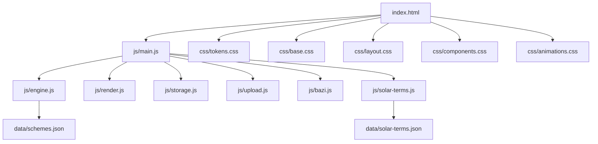
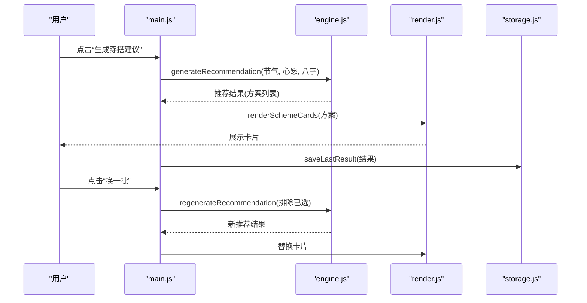
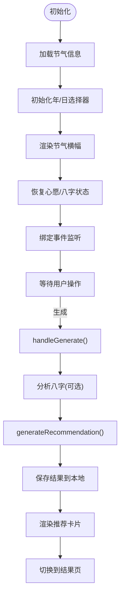
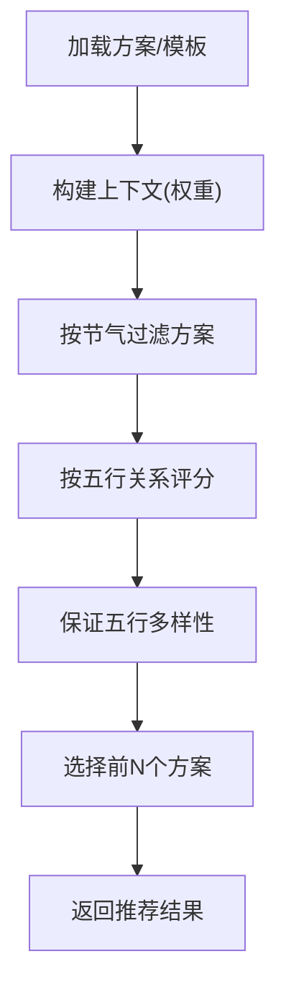
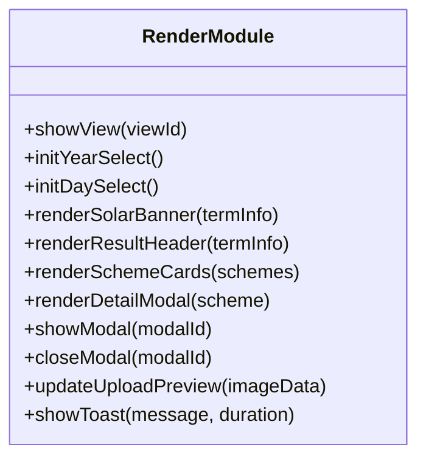
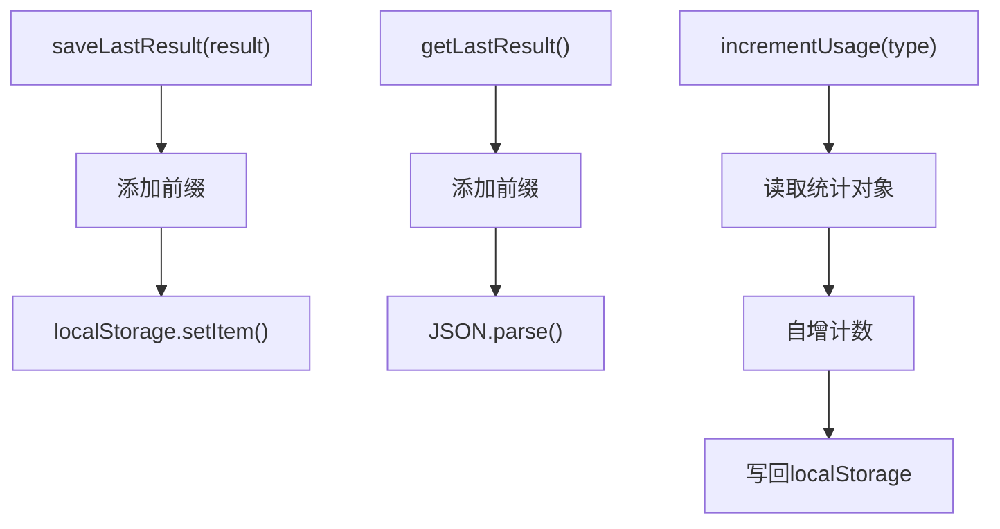
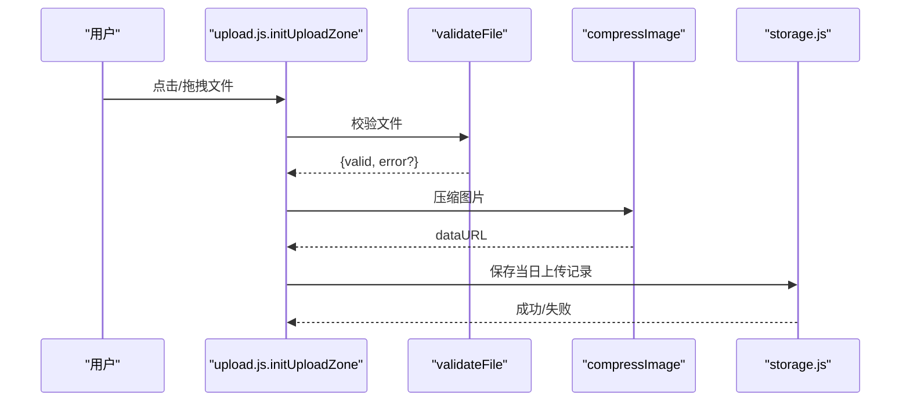
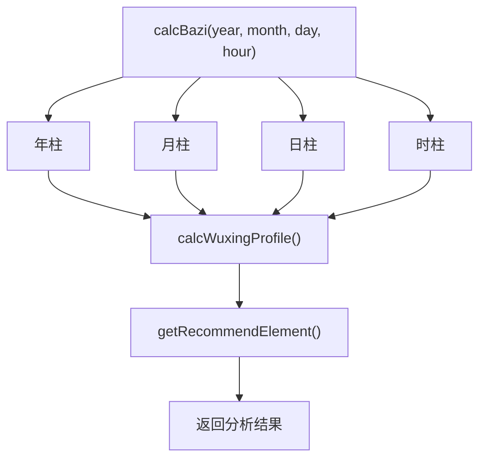
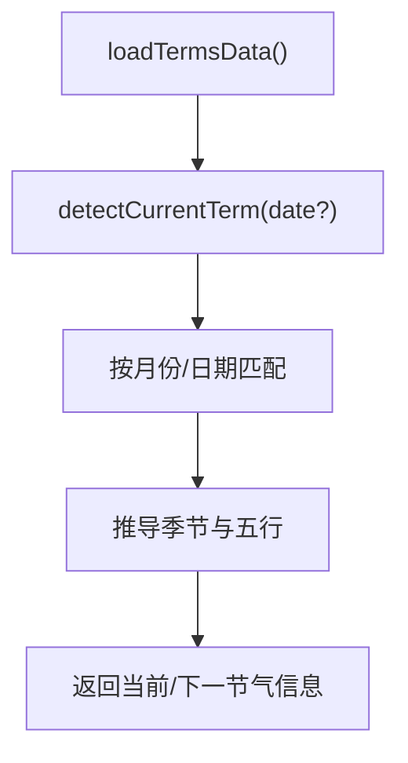
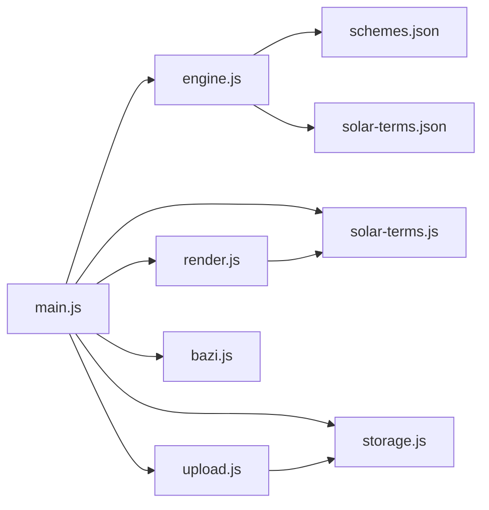

# 开发指南

<cite>
**本文档引用的文件**
- [index.html](file://index.html)
- [main.js](file://js/main.js)
- [engine.js](file://js/engine.js)
- [render.js](file://js/render.js)
- [storage.js](file://js/storage.js)
- [upload.js](file://js/upload.js)
- [bazi.js](file://js/bazi.js)
- [solar-terms.js](file://js/solar-terms.js)
- [schemes.json](file://data/schemes.json)
- [solar-terms.json](file://data/solar-terms.json)
- [tokens.css](file://css/tokens.css)
- [base.css](file://css/base.css)
- [layout.css](file://css/layout.css)
- [components.css](file://css/components.css)
- [animations.css](file://css/animations.css)
</cite>

## 目录
1. [简介](#简介)
2. [项目结构](#项目结构)
3. [核心组件](#核心组件)
4. [架构总览](#架构总览)
5. [详细组件分析](#详细组件分析)
6. [依赖分析](#依赖分析)
7. [性能考虑](#性能考虑)
8. [调试指南](#调试指南)
9. [结论](#结论)
10. [附录](#附录)

## 简介
本指南面向“五行穿搭建议”项目的开发者，提供从环境搭建、代码规范、调试技巧到扩展与维护的全流程文档。项目采用原生 JavaScript 模块化、静态资源组织与纯前端实现，无需构建工具即可运行。

## 项目结构
项目采用“按职责分层”的模块化组织方式：
- 根目录：入口页面 index.html
- js/：业务逻辑模块（引擎、渲染、存储、上传、八字、节气）
- data/：JSON 数据（穿搭方案、节气、心愿模板等）
- css/：设计令牌、基础样式、布局、组件与动画

图表来源
- [index.html](file://index.html#L1-L236)
- [main.js](file://js/main.js#L1-L317)
- [engine.js](file://js/engine.js#L1-L335)
- [render.js](file://js/render.js#L1-L272)
- [storage.js](file://js/storage.js#L1-L116)
- [upload.js](file://js/upload.js#L1-L145)
- [bazi.js](file://js/bazi.js#L1-L193)
- [solar-terms.js](file://js/solar-terms.js#L1-L118)
- [schemes.json](file://data/schemes.json#L1-L509)
- [solar-terms.json](file://data/solar-terms.json#L1-L42)
- [tokens.css](file://css/tokens.css#L1-L109)
- [base.css](file://css/base.css#L1-L168)
- [layout.css](file://css/layout.css#L1-L252)
- [components.css](file://css/components.css#L1-L338)
- [animations.css](file://css/animations.css#L1-L207)

章节来源
- [index.html](file://index.html#L1-L236)
- [main.js](file://js/main.js#L1-L317)

## 核心组件
- 应用入口与控制流：负责初始化、事件绑定、视图切换与业务流程编排
- 推荐引擎：加载数据、构建上下文、评分与筛选方案
- 渲染模块：视图切换、DOM 操作、模态框、Toast 提示
- 存储模块：本地持久化、使用统计、反馈与上传记录
- 上传模块：文件校验、图片压缩、拖拽与键盘支持
- 八字模块：简化四柱计算、五行分布与推荐
- 节气模块：加载节气数据、检测当前节气、生成配色

章节来源
- [main.js](file://js/main.js#L1-L317)
- [engine.js](file://js/engine.js#L1-L335)
- [render.js](file://js/render.js#L1-L272)
- [storage.js](file://js/storage.js#L1-L116)
- [upload.js](file://js/upload.js#L1-L145)
- [bazi.js](file://js/bazi.js#L1-L193)
- [solar-terms.js](file://js/solar-terms.js#L1-L118)

## 架构总览
整体采用“模块化 + 单页应用视图切换”的架构：
- HTML 页面定义视图容器与交互元素
- main.js 作为控制中枢，协调各模块
- engine.js 负责业务决策与数据聚合
- render.js 负责 UI 渲染与交互反馈
- storage.js 负责本地状态与统计数据
- upload.js 负责媒体处理与上传流程
- bazi.js 与 solar-terms.js 提供命理与节气支撑

图表来源
- [main.js](file://js/main.js#L202-L244)
- [engine.js](file://js/engine.js#L268-L310)
- [render.js](file://js/render.js#L114-L127)
- [storage.js](file://js/storage.js#L60-L66)

## 详细组件分析

### 应用入口与控制流（main.js）
- 初始化流程：加载节气、初始化表单、渲染节气横幅、恢复上次选择与输入
- 事件绑定：开始、返回、心愿选择、生成、换一批、上传、详情、模态框关闭
- 业务流程：收集八字输入、调用引擎生成推荐、保存结果、渲染视图
- 上传流程：验证文件、压缩图片、保存预览、增量统计

图表来源
- [main.js](file://js/main.js#L26-L67)
- [main.js](file://js/main.js#L202-L244)
- [engine.js](file://js/engine.js#L268-L310)
- [render.js](file://js/render.js#L114-L127)
- [storage.js](file://js/storage.js#L60-L66)

章节来源
- [main.js](file://js/main.js#L1-L317)

### 推荐引擎（engine.js）
- 数据加载：异步加载穿搭方案、心愿模板、八字模板
- 上下文构建：融合节气、心愿、八字权重
- 评分与筛选：按相生/相克关系打分，保证五行多样性
- 结果输出：包含方案、模板、时间戳等

图表来源
- [engine.js](file://js/engine.js#L268-L310)
- [engine.js](file://js/engine.js#L178-L259)
- [schemes.json](file://data/schemes.json#L1-L509)

章节来源
- [engine.js](file://js/engine.js#L1-L335)
- [schemes.json](file://data/schemes.json#L1-L509)

### 渲染模块（render.js）
- 视图切换：隐藏/显示对应视图容器
- DOM 操作：创建卡片、填充详情、模态框显示/隐藏
- 主题适配：根据五行动态设置背景/文字颜色
- 反馈提示：Toast 消息统一展示

图表来源
- [render.js](file://js/render.js#L1-L272)

章节来源
- [render.js](file://js/render.js#L1-L272)

### 存储模块（storage.js）
- 前缀化键名：避免冲突，便于清理
- 业务方法：保存/读取最后结果、心愿、八字、反馈、上传记录
- 使用统计：访问次数、生成次数、上传次数
- 工具方法：批量查询、清理

图表来源
- [storage.js](file://js/storage.js#L1-L116)

章节来源
- [storage.js](file://js/storage.js#L1-L116)

### 上传模块（upload.js）
- 文件校验：类型、大小
- 图片压缩：Canvas 缩放 + 质量迭代压缩至目标大小
- 上传区域：点击、键盘激活、拖拽进入/离开/放下
- 日期键：按“年-月-日”组织当日上传记录

图表来源
- [upload.js](file://js/upload.js#L87-L136)
- [upload.js](file://js/upload.js#L12-L26)
- [upload.js](file://js/upload.js#L31-L82)
- [storage.js](file://js/storage.js#L79-L89)

章节来源
- [upload.js](file://js/upload.js#L1-L145)
- [storage.js](file://js/storage.js#L1-L116)

### 八字模块（bazi.js）
- 四柱计算：年/月/日/时柱（简化算法）
- 五行分布：天干地支分别统计
- 推荐元素：最弱五行作为补充方向

图表来源
- [bazi.js](file://js/bazi.js#L111-L124)
- [bazi.js](file://js/bazi.js#L129-L172)
- [bazi.js](file://js/bazi.js#L182-L192)

章节来源
- [bazi.js](file://js/bazi.js#L1-L193)

### 节气模块（solar-terms.js）
- UTC+8 时间转换
- 加载节气数据，按月/日范围匹配当前节气
- 提供节气名称、五行与季节信息，以及配色函数

图表来源
- [solar-terms.js](file://js/solar-terms.js#L18-L29)
- [solar-terms.js](file://js/solar-terms.js#L36-L103)
- [solar-terms.js](file://js/solar-terms.js#L108-L117)
- [solar-terms.json](file://data/solar-terms.json#L1-L42)

章节来源
- [solar-terms.js](file://js/solar-terms.js#L1-L118)
- [solar-terms.json](file://data/solar-terms.json#L1-L42)

## 依赖分析
- 模块间依赖
  - main.js 依赖 engine.js、render.js、storage.js、upload.js、solar-terms.js、bazi.js
  - engine.js 依赖 data/schemes.json、data/solar-terms.json
  - render.js 依赖 solar-terms.js 的配色函数
  - upload.js 依赖 storage.js 的日期键
- 数据依赖
  - 穿搭方案来自 schemes.json
  - 节气规则来自 solar-terms.json

图表来源
- [main.js](file://js/main.js#L5-L15)
- [engine.js](file://js/engine.js#L39-L79)
- [render.js](file://js/render.js#L76-L99)
- [upload.js](file://js/upload.js#L87-L136)
- [solar-terms.js](file://js/solar-terms.js#L18-L29)
- [schemes.json](file://data/schemes.json#L1-L509)
- [solar-terms.json](file://data/solar-terms.json#L1-L42)

章节来源
- [main.js](file://js/main.js#L1-L317)
- [engine.js](file://js/engine.js#L1-L335)

## 性能考虑
- 异步加载与并发：引擎同时加载多份数据，减少等待时间
- 评分与筛选：先按节气过滤再打分，降低计算复杂度
- 本地存储：避免重复网络请求，提升二次访问速度
- 图片压缩：按目标大小迭代压缩，兼顾清晰度与体积
- 动画与过渡：使用 CSS 变量与媒体查询，减少重排与重绘

[本节为通用指导，无需列出具体文件来源]

## 调试指南
- 浏览器控制台
  - 查看初始化日志与错误信息
  - 检查 fetch 请求与 JSON 解析
- 断点调试
  - 在 main.js 的事件回调与引擎函数中设置断点
  - 观察上下文构建与评分过程
- 本地存储检查
  - 在开发者工具 Application/Local Storage 中查看键值
- 网络面板
  - 确认 data/*.json 与图片资源加载状态
- 移动端调试
  - 使用浏览器设备模式或真机调试
  - 关注触摸与拖拽事件

章节来源
- [main.js](file://js/main.js#L26-L67)
- [engine.js](file://js/engine.js#L39-L49)
- [storage.js](file://js/storage.js#L1-L116)

## 结论
本项目以清晰的模块划分与简洁的数据结构实现了“五行穿搭建议”的核心功能。遵循本文档的开发规范与扩展流程，可高效地添加新方案、模板与主题，同时保持良好的可维护性与用户体验。

[本节为总结性内容，无需列出具体文件来源]

## 附录

### 开发环境搭建
- 系统要求：现代浏览器（Chrome/Firefox/Safari Edge）
- 运行方式：直接打开 index.html 或使用本地静态服务器
- 本地服务器建议：Python http.server、Live Server 等（任选）

[本节为通用指导，无需列出具体文件来源]

### 代码规范与注释标准
- 文件命名：采用小写与短横线组合（如 engine.js）
- 模块导出：统一使用 export default 或具名导出
- 注释风格：模块顶部简述职责，重要函数提供参数与返回说明
- 命名规范：变量与函数使用动宾结构，常量全大写并以下划线分隔
- 错误处理：对外暴露的函数需捕获异常并返回明确结果

[本节为通用指导，无需列出具体文件来源]

### 添加新的穿搭方案
- 步骤
  - 在 data/schemes.json 中新增方案条目（包含 id、termId、rank、color、material、feeling、annotation、source）
  - 确保 id 唯一且与节气 id 对应
  - 保存后刷新页面即可生效
- 注意事项
  - color.hex 为推荐色值，wuxing 为五行属性
  - annotation 与 source 体现文化依据

章节来源
- [schemes.json](file://data/schemes.json#L1-L509)
- [engine.js](file://js/engine.js#L218-L259)

### 扩展心愿模板
- 当前模板位于 data/solar-terms.json 中，包含节气与季节信息
- 若需新增心愿维度，可在 main.js 中扩展选择逻辑，并在引擎中增加权重与评分项
- 注意保持与现有数据结构一致

章节来源
- [solar-terms.json](file://data/solar-terms.json#L1-L42)
- [main.js](file://js/main.js#L158-L164)

### 更新节气数据
- 修改 data/solar-terms.json 中的 terms、seasons、wuxingNames
- 确保节气顺序与名称正确，避免影响引擎的距离计算
- 如需调整节气边界，需同步修正节气检测逻辑

章节来源
- [solar-terms.js](file://js/solar-terms.js#L36-L103)
- [solar-terms.json](file://data/solar-terms.json#L1-L42)

### 定制样式主题
- 设计令牌：修改 css/tokens.css 中的色彩、字体、间距、圆角与阴影
- 基础样式：调整 css/base.css 的排版与可访问性
- 布局与组件：在 css/layout.css 与 css/components.css 中扩展或覆盖
- 动画：在 css/animations.css 中新增或调整关键帧

章节来源
- [tokens.css](file://css/tokens.css#L1-L109)
- [base.css](file://css/base.css#L1-L168)
- [layout.css](file://css/layout.css#L1-L252)
- [components.css](file://css/components.css#L1-L338)
- [animations.css](file://css/animations.css#L1-L207)

### 本地开发服务器与热重载
- 使用浏览器自带 Live Server 或 Python 3 -m http.server
- 由于项目为静态资源，无需构建工具，修改后刷新即可看到效果
- 如需自动刷新，可在编辑器中安装 Live Reload 插件

[本节为通用指导，无需列出具体文件来源]

### 浏览器兼容性测试
- 建议在主流桌面与移动浏览器中测试
- 关注特性支持：ES 模块、fetch、localStorage、Canvas、CSS 变量
- 使用开发者工具的设备模式与网络面板进行验证

[本节为通用指导，无需列出具体文件来源]

### 代码质量保证
- 单元测试：针对独立函数（如评分、压缩、校验）编写测试用例
- 集成测试：模拟用户流程（生成/换一批/上传/反馈）
- 代码审查：关注可读性、健壮性与性能

[本节为通用指导，无需列出具体文件来源]

### Git 工作流程与协作
- 分支策略：master/main 发布；feature/* 开发；hotfix/* 修复
- 提交规范：简明描述变更，引用相关 issue
- 代码审查：至少一名同事审阅，关注边界条件与错误处理

[本节为通用指导，无需列出具体文件来源]

### 常见问题与故障排除
- 无法加载数据：检查 data/*.json 是否可访问，确认跨域与路径
- 推荐为空：确认节气检测是否正确，检查 schemes.json 是否完整
- 上传失败：检查文件类型与大小限制，查看压缩过程日志
- 本地存储异常：清除浏览器缓存或禁用隐身模式后重试

章节来源
- [upload.js](file://js/upload.js#L12-L26)
- [upload.js](file://js/upload.js#L31-L82)
- [storage.js](file://js/storage.js#L1-L116)