# 开发最佳实践

<cite>
**本文引用的文件**
- [index.html](file://index.html)
- [sw.js](file://sw.js)
- [js/core/app.js](file://js/core/app.js)
- [js/core/router.js](file://js/core/router.js)
- [js/core/store.js](file://js/core/store.js)
- [js/core/error-handler.js](file://js/core/error-handler.js)
- [js/core/scorer.js](file://js/core/scorer.js)
- [js/controllers/base.js](file://js/controllers/base.js)
- [js/controllers/results.js](file://js/controllers/results.js)
- [js/controllers/favorites.js](file://js/controllers/favorites.js)
- [js/data/repository.js](file://js/data/repository.js)
- [js/services/engine.js](file://js/services/engine.js)
- [js/utils/render.js](file://js/utils/render.js)
- [js/utils/upload.js](file://js/utils/upload.js)
</cite>

## 目录
1. [引言](#引言)
2. [项目结构](#项目结构)
3. [核心组件](#核心组件)
4. [架构总览](#架构总览)
5. [详细组件分析](#详细组件分析)
6. [依赖分析](#依赖分析)
7. [性能考虑](#性能考虑)
8. [故障排查指南](#故障排查指南)
9. [结论](#结论)
10. [附录](#附录)

## 引言
本指南面向开发者，系统总结本项目的开发最佳实践，涵盖代码规范、错误处理、性能优化、可维护性设计、调试技巧与工具使用，并结合具体文件路径给出可落地的改进建议与示例定位。

## 项目结构
项目采用模块化的前端架构，按职责划分为核心层、服务层、数据层、工具层与视图控制器层，配合 Service Worker 提供离线缓存与渐进式体验。

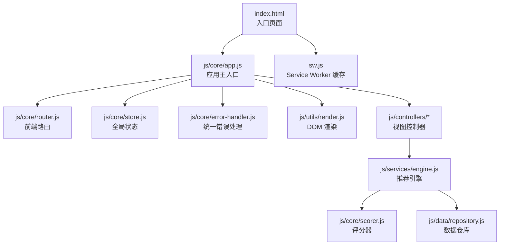

图表来源
- [index.html](file://index.html#L1-L79)
- [js/core/app.js](file://js/core/app.js#L1-L206)
- [js/core/router.js](file://js/core/router.js#L1-L142)
- [js/core/store.js](file://js/core/store.js#L1-L212)
- [js/core/error-handler.js](file://js/core/error-handler.js#L1-L190)
- [js/utils/render.js](file://js/utils/render.js#L1-L487)
- [js/controllers/results.js](file://js/controllers/results.js#L1-L614)
- [js/services/engine.js](file://js/services/engine.js#L1-L425)
- [js/core/scorer.js](file://js/core/scorer.js#L1-L317)
- [js/data/repository.js](file://js/data/repository.js#L1-L394)
- [sw.js](file://sw.js#L1-L165)

章节来源
- [index.html](file://index.html#L1-L79)
- [sw.js](file://sw.js#L1-L165)

## 核心组件
- 应用主入口：负责初始化、路由协调、视图动态加载、全局事件与统计。
- 路由系统：支持浏览器前进后退、URL 反映应用状态、拦截链接点击。
- 全局状态：集中管理应用状态，提供订阅与响应式更新。
- 错误处理：统一包装异步函数、安全的网络与存储操作、全局错误监听。
- 推荐引擎：加载数据、构建上下文、评分器打分、梯度推荐策略。
- 控制器层：每个视图对应一个控制器，生命周期管理与事件绑定。
- 数据仓库：抽象存储实现，支持本地持久化与安全读写。
- 渲染工具：统一的 DOM 渲染、模态框、Toast、详情卡片等。
- Service Worker：预缓存核心资源，离线可用，Stale-While-Revalidate 策略。

章节来源
- [js/core/app.js](file://js/core/app.js#L1-L206)
- [js/core/router.js](file://js/core/router.js#L1-L142)
- [js/core/store.js](file://js/core/store.js#L1-L212)
- [js/core/error-handler.js](file://js/core/error-handler.js#L1-L190)
- [js/services/engine.js](file://js/services/engine.js#L1-L425)
- [js/core/scorer.js](file://js/core/scorer.js#L1-L317)
- [js/controllers/base.js](file://js/controllers/base.js#L1-L131)
- [js/data/repository.js](file://js/data/repository.js#L1-L394)
- [js/utils/render.js](file://js/utils/render.js#L1-L487)
- [sw.js](file://sw.js#L1-L165)

## 架构总览
应用采用“MVC + 状态中心”的架构风格：
- 视图控制器负责视图交互与事件处理；
- 服务层封装业务逻辑（推荐引擎、天气、解释等）；
- 数据层抽象存储（仓库模式）；
- 核心层提供路由、状态、错误处理与应用编排。

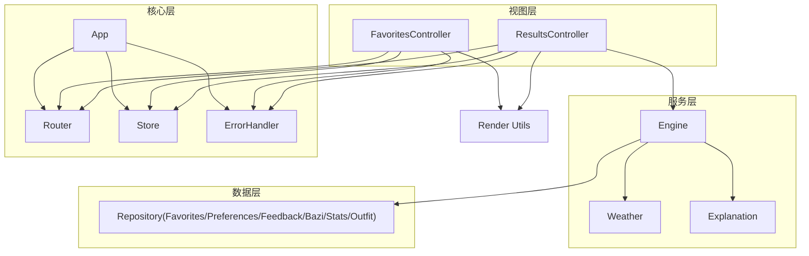

图表来源
- [js/controllers/results.js](file://js/controllers/results.js#L1-L614)
- [js/controllers/favorites.js](file://js/controllers/favorites.js#L1-L89)
- [js/services/engine.js](file://js/services/engine.js#L1-L425)
- [js/data/repository.js](file://js/data/repository.js#L1-L394)
- [js/core/router.js](file://js/core/router.js#L1-L142)
- [js/core/store.js](file://js/core/store.js#L1-L212)
- [js/core/error-handler.js](file://js/core/error-handler.js#L1-L190)
- [js/utils/render.js](file://js/utils/render.js#L1-L487)
- [js/core/app.js](file://js/core/app.js#L1-L206)

## 详细组件分析

### 应用主入口（App）
职责：初始化、路由协调、动态视图加载、控制器注册与切换、基础数据加载、统计初始化、全局事件监听。

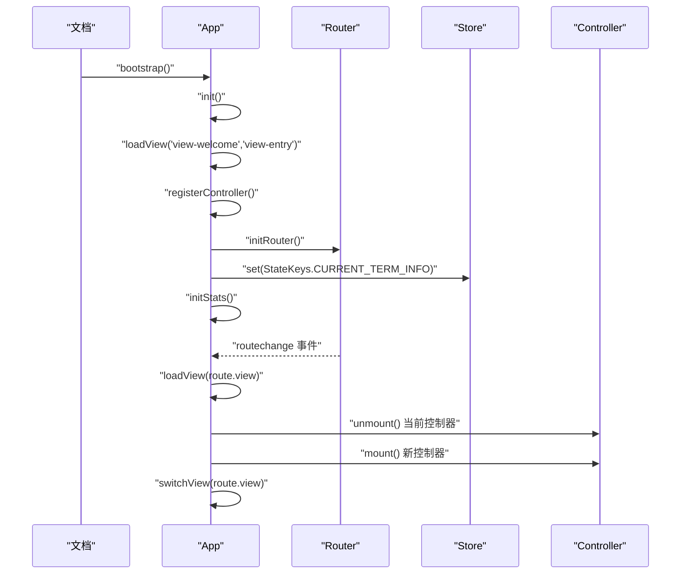

图表来源
- [js/core/app.js](file://js/core/app.js#L47-L193)
- [js/core/router.js](file://js/core/router.js#L25-L79)
- [js/core/store.js](file://js/core/store.js#L33-L51)

章节来源
- [js/core/app.js](file://js/core/app.js#L1-L206)

### 路由系统（Router）
职责：拦截链接点击、处理 popstate、维护当前路由、更新页面标题、派发 routechange 事件、与 Store 同步当前视图。

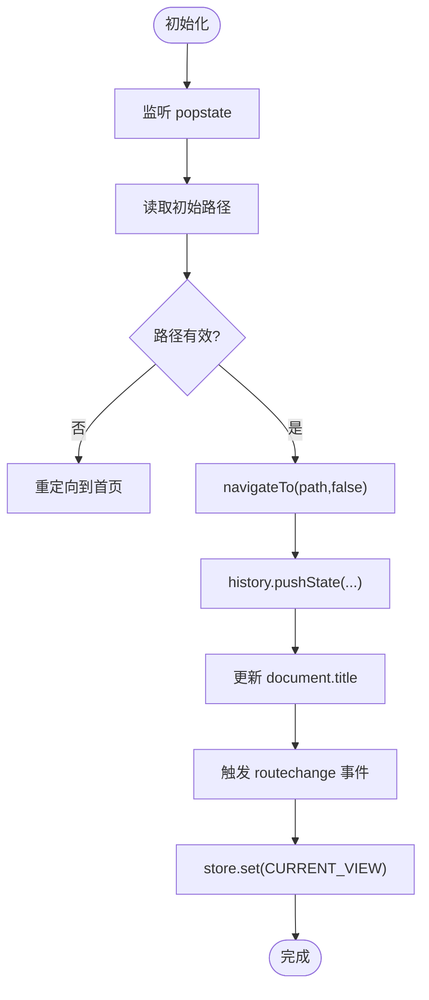

图表来源
- [js/core/router.js](file://js/core/router.js#L25-L103)

章节来源
- [js/core/router.js](file://js/core/router.js#L1-L142)

### 全局状态（Store）
职责：集中状态管理、响应式代理、订阅通知、批量更新、重置与调试快照。

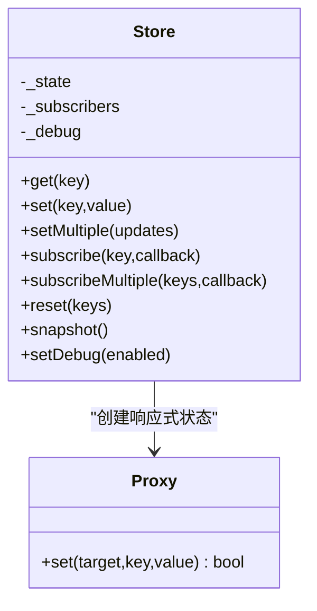

图表来源
- [js/core/store.js](file://js/core/store.js#L30-L187)

章节来源
- [js/core/store.js](file://js/core/store.js#L1-L212)

### 错误处理（ErrorHandler）
职责：统一错误包装、安全网络与存储、全局未处理错误监听、用户友好提示。

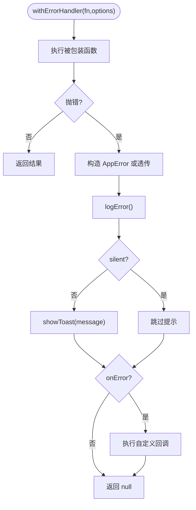

图表来源
- [js/core/error-handler.js](file://js/core/error-handler.js#L45-L79)

章节来源
- [js/core/error-handler.js](file://js/core/error-handler.js#L1-L190)

### 推荐引擎（Engine）与评分器（Scorer）
职责：加载数据、构建上下文、评分器打分、梯度推荐策略、解释生成。

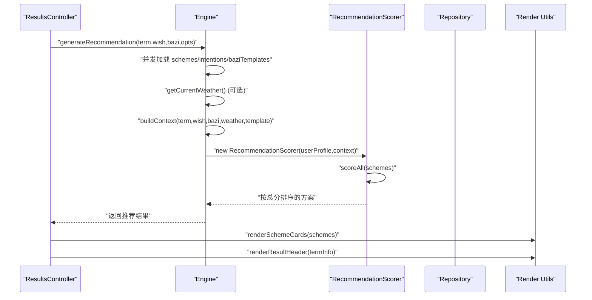

图表来源
- [js/services/engine.js](file://js/services/engine.js#L323-L393)
- [js/core/scorer.js](file://js/core/scorer.js#L266-L276)
- [js/utils/render.js](file://js/utils/render.js#L119-L132)

章节来源
- [js/services/engine.js](file://js/services/engine.js#L1-L425)
- [js/core/scorer.js](file://js/core/scorer.js#L1-L317)

### 控制器基类（BaseController）
职责：生命周期管理（mount/unmount）、事件绑定与解绑、Store 订阅与取消、状态读写、Toast 事件派发。

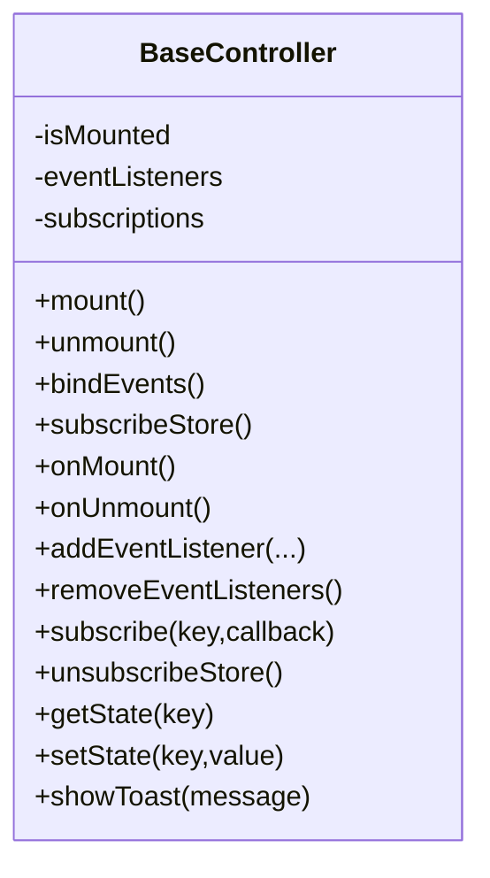

图表来源
- [js/controllers/base.js](file://js/controllers/base.js#L11-L131)

章节来源
- [js/controllers/base.js](file://js/controllers/base.js#L1-L131)

### 数据仓库（Repository）
职责：抽象存储实现，提供收藏、偏好、反馈、八字、统计、穿搭照片等仓库，统一安全读写。

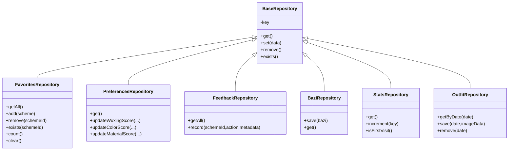

图表来源
- [js/data/repository.js](file://js/data/repository.js#L46-L385)

章节来源
- [js/data/repository.js](file://js/data/repository.js#L1-L394)

### 渲染工具（Render）
职责：统一视图切换、Toast、详情模态框、收藏列表、方案卡片、解释卡片、Banner 渲染、年份/日期选择器初始化。

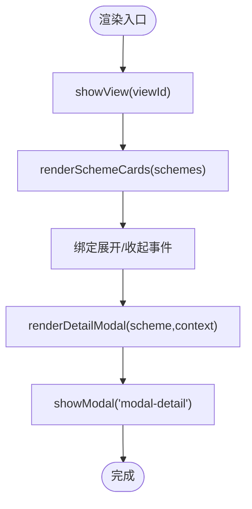

图表来源
- [js/utils/render.js](file://js/utils/render.js#L13-L21)
- [js/utils/render.js](file://js/utils/render.js#L119-L201)
- [js/utils/render.js](file://js/utils/render.js#L324-L365)

章节来源
- [js/utils/render.js](file://js/utils/render.js#L1-L487)

### Service Worker（离线缓存）
职责：安装阶段预缓存核心资源；激活阶段清理旧缓存；fetch 阶段缓存优先，后台更新，Stale-While-Revalidate。

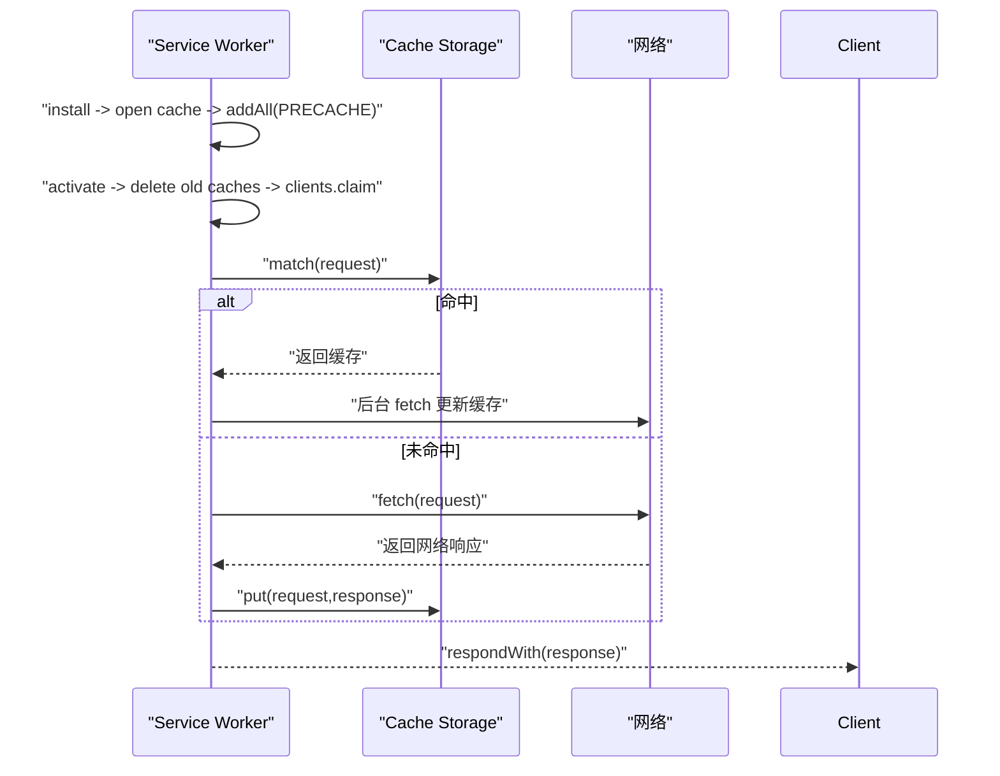

图表来源
- [sw.js](file://sw.js#L52-L155)

章节来源
- [sw.js](file://sw.js#L1-L165)

## 依赖分析
- 模块间耦合：App 依赖 Router、Store、ErrorHandler；控制器依赖 Router、Store、Render；Engine 依赖 Scorer、Repository；Render 依赖部分 Service 与 Repository。
- 外部依赖：Service Worker、CDN 字体、浏览器 API（fetch、localStorage、Service Worker）。
- 潜在风险：控制器对全局变量（window.__currentSchemes）的依赖需谨慎；渲染工具与控制器存在弱耦合。

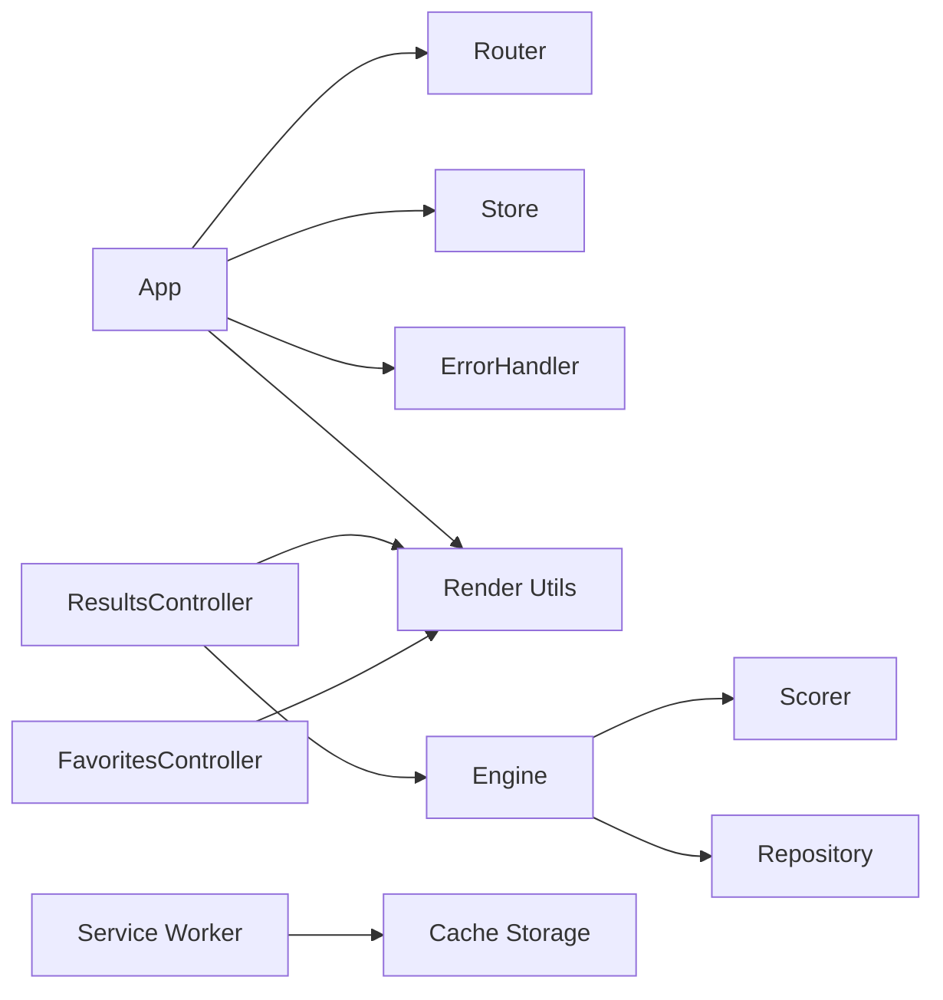

图表来源
- [js/core/app.js](file://js/core/app.js#L6-L21)
- [js/controllers/results.js](file://js/controllers/results.js#L5-L11)
- [js/services/engine.js](file://js/services/engine.js#L6-L9)
- [sw.js](file://sw.js#L52-L155)

章节来源
- [js/core/app.js](file://js/core/app.js#L1-L206)
- [js/controllers/results.js](file://js/controllers/results.js#L1-L614)
- [js/services/engine.js](file://js/services/engine.js#L1-L425)
- [sw.js](file://sw.js#L1-L165)

## 性能考虑
- 离线与缓存：Service Worker 预缓存核心脚本与静态资源，Stale-While-Revalidate 保证离线可用与内容新鲜度。
- 懒加载与首屏：App 在初始化时预加载首屏视图，其余视图按需动态加载，减少初始包体积。
- 渲染优化：渲染工具使用批量插入与一次性清空容器，避免频繁 DOM 操作；卡片动画延迟按序触发，提升感知性能。
- 网络与存储：统一的安全包装（safeFetch、safeJsonParse、safeStorage）减少异常分支，提升稳定性。
- 评分与缓存：Scorer 内部使用 Map 缓存计算结果，避免重复评分；Engine 对数据加载使用并发 Promise，缩短等待时间。
- 图片上传：上传工具限制文件大小与类型，压缩到目标大小，降低带宽与存储压力。

章节来源
- [sw.js](file://sw.js#L52-L155)
- [js/core/app.js](file://js/core/app.js#L54-L60)
- [js/utils/render.js](file://js/utils/render.js#L120-L132)
- [js/core/error-handler.js](file://js/core/error-handler.js#L101-L163)
- [js/core/scorer.js](file://js/core/scorer.js#L20-L22)
- [js/utils/upload.js](file://js/utils/upload.js#L5-L82)

## 故障排查指南
- 全局错误监听：未处理的 Promise 拒绝与全局错误被捕获并提示用户，便于快速定位问题。
- 用户提示：统一使用 Toast 展示错误信息，避免控制台外的用户困惑。
- 网络超时与解析：safeFetch 提供超时控制与 HTTP 状态码校验；safeJsonParse 捕获解析异常。
- 存储异常：safeStorage 捕获配额不足等异常，转换为用户可理解的错误类型。
- 控制器事件泄漏：BaseController 提供事件监听器集合与移除方法，确保卸载时清理干净。
- Service Worker 更新：安装阶段失败会输出错误日志；激活阶段删除旧缓存，避免陈旧资源滞留。

章节来源
- [js/core/error-handler.js](file://js/core/error-handler.js#L168-L189)
- [js/utils/render.js](file://js/utils/render.js#L457-L486)
- [js/core/error-handler.js](file://js/core/error-handler.js#L101-L163)
- [js/controllers/base.js](file://js/controllers/base.js#L72-L85)
- [sw.js](file://sw.js#L62-L68)
- [sw.js](file://sw.js#L84-L87)

## 结论
本项目在架构上实现了清晰的分层与职责分离，配合统一的错误处理、状态管理与渲染工具，具备良好的可维护性与扩展性。建议在后续迭代中进一步规范化命名与注释、加强单元测试覆盖、减少对全局变量的依赖，并持续优化缓存策略与性能指标监控。

## 附录

### 代码规范与最佳实践清单
- 命名约定
  - 类名使用帕斯卡命名（如 App、Store、RecommendationScorer）。
  - 函数与变量使用驼峰命名（如 loadView、withErrorHandler、safeFetch）。
  - 常量使用全大写下划线（如 CACHE_NAME、PRECACHE_ASSETS）。
  - 状态键与视图名使用大写常量导出（如 StateKeys、ViewNames）。
- 代码格式
  - 统一使用分号与空格；函数参数与左花括号在同一行；条件语句与循环语句的花括号另起一行。
  - 导入顺序：标准库/内置 → 第三方 → 项目内模块；同组内按字母排序。
- 注释标准
  - 模块顶部添加简要描述与作者信息。
  - 导出类与复杂函数添加 JSDoc 风格注释，说明参数、返回值与副作用。
  - 关键流程与边界条件添加行内注释，解释设计权衡。
- 错误处理
  - 所有异步操作使用 withErrorHandler 包裹，必要时提供自定义错误消息与静默选项。
  - 网络请求使用 safeFetch，JSON 解析使用 safeJsonParse，存储使用 safeStorage。
  - 全局错误监听统一处理未捕获异常与 Promise 拒绝。
- 性能优化
  - 使用 Service Worker 预缓存与 Stale-While-Revalidate；懒加载非首屏视图。
  - 渲染批量更新 DOM，避免频繁查询与重排；合理使用 CSS 动画与延迟。
  - 评分器缓存中间结果；并发加载数据；图片上传压缩与尺寸控制。
- 可维护性设计
  - 控制器基类统一生命周期与事件管理；渲染工具集中管理 UI 组件。
  - 数据仓库抽象存储实现，支持未来替换为 IndexedDB 或云端同步。
  - 路由与状态解耦，通过事件与 Store 同步，降低耦合度。
- 调试技巧与工具
  - 使用 Store.snapshot() 输出调试快照；开启 setDebug(true) 观察变更。
  - 在控制器中派发自定义事件（如 app:toast）进行跨组件通信。
  - 浏览器开发者工具 Network 面板观察缓存命中与请求耗时；Application 面板查看 Service Worker 状态。
  - 使用浏览器 Performance 面板分析首屏渲染与交互延迟。