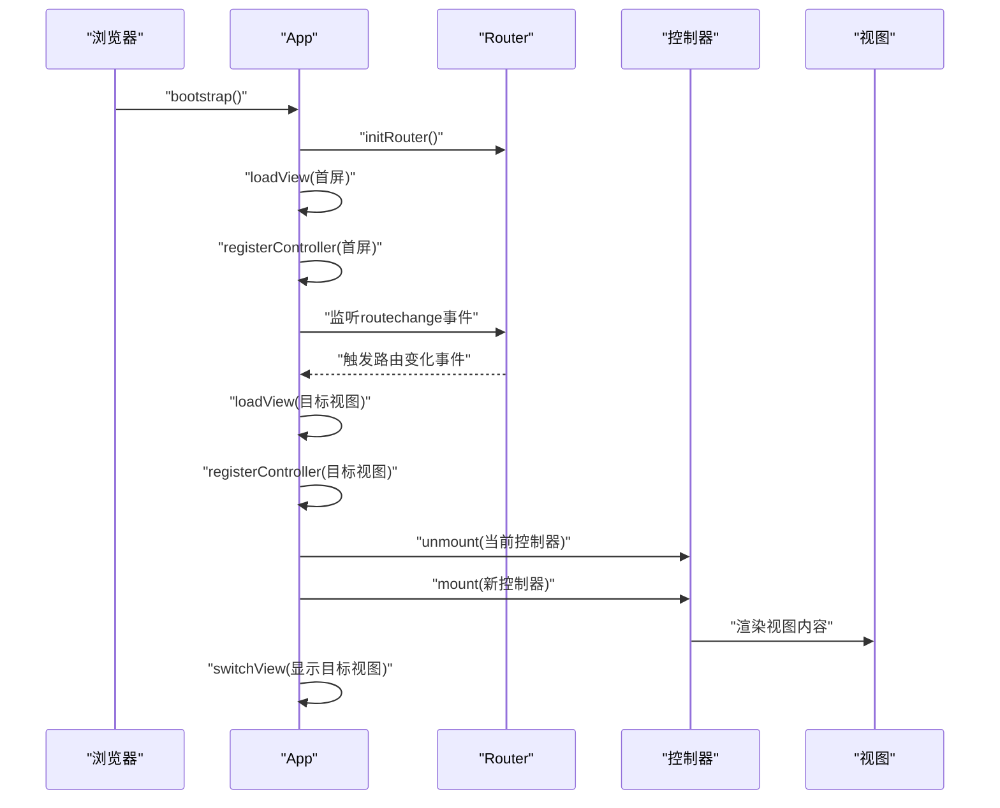
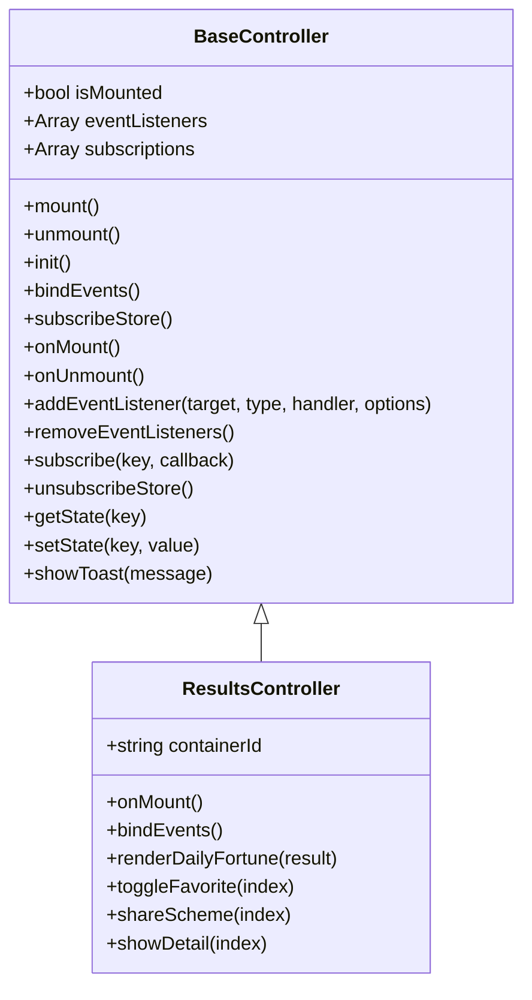
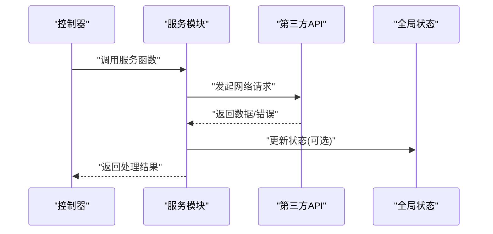
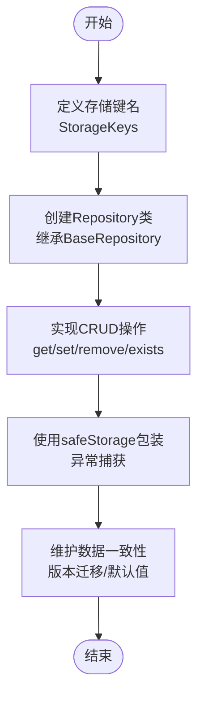
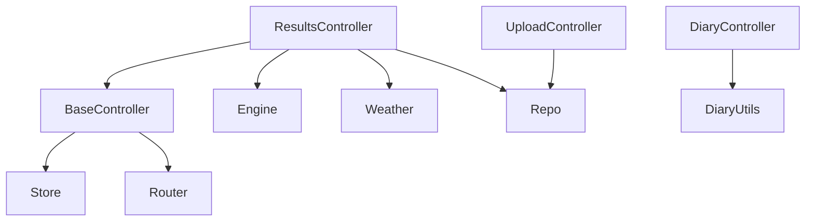

# 扩展方法指南

<cite>
**本文档引用的文件**
- [js/controllers/base.js](file://js/controllers/base.js)
- [js/core/app.js](file://js/core/app.js)
- [js/core/router.js](file://js/core/router.js)
- [js/core/store.js](file://js/core/store.js)
- [js/core/scorer.js](file://js/core/scorer.js)
- [js/core/scoring-config.js](file://js/core/scoring-config.js)
- [js/services/engine.js](file://js/services/engine.js)
- [js/services/recommendation.js](file://js/services/recommendation.js)
- [js/services/weather.js](file://js/services/weather.js)
- [js/data/repository.js](file://js/data/repository.js)
- [js/controllers/results.js](file://js/controllers/results.js)
- [js/controllers/diary.js](file://js/controllers/diary.js)
- [js/controllers/upload.js](file://js/controllers/upload.js)
- [js/utils/diary.js](file://js/utils/diary.js)
- [css/main.css](file://css/main.css)
- [index.html](file://index.html)
</cite>

## 目录
1. [简介](#简介)
2. [项目结构](#项目结构)
3. [核心组件](#核心组件)
4. [架构概览](#架构概览)
5. [详细组件分析](#详细组件分析)
6. [依赖分析](#依赖分析)
7. [性能考虑](#性能考虑)
8. [故障排除指南](#故障排除指南)
9. [结论](#结论)
10. [附录](#附录)

## 简介
本指南面向希望在现有架构基础上进行功能扩展与技术定制的开发者。文档围绕控制器扩展、服务层扩展、数据模型扩展、样式扩展四个方面，提供可操作的步骤、最佳实践与可视化流程图，帮助您快速实现新增功能、集成第三方API以及维护数据一致性。

## 项目结构
该项目采用模块化的前端架构，主要分为以下层次：
- 视图层：HTML 页面通过动态加载方式注入到应用容器中
- 控制器层：每个视图对应一个控制器，负责生命周期管理、事件绑定与UI交互
- 服务层：封装业务逻辑与外部API交互（如天气、推荐引擎）
- 数据层：统一的仓库抽象，屏蔽存储实现细节（localStorage/IndexedDB/云端）
- 核心层：应用入口、路由、状态管理、评分器与评分配置

```mermaid
graph TB
subgraph "视图层"
V1["views/welcome.html"]
V2["views/entry.html"]
V3["views/results.html"]
V4["views/favorites.html"]
V5["views/profile.html"]
V6["views/diary.html"]
V7["views/upload.html"]
end
subgraph "控制器层"
CBase["BaseController<br/>基础控制器"]
CWelcome["WelcomeController"]
CEntry["EntryController"]
CResults["ResultsController"]
CFavorites["FavoritesController"]
CProfile["ProfileController"]
CDiary["DiaryController"]
CUpload["UploadController"]
end
subgraph "核心层"
App["App<br/>应用入口"]
Router["Router<br/>前端路由"]
Store["Store<br/>全局状态"]
Scorer["RecommendationScorer<br/>评分器"]
ScoreCfg["ScoringConfig<br/>评分配置"]
end
subgraph "服务层"
Engine["Engine<br/>推荐引擎"]
Rec["Recommendation<br/>智能推荐"]
Weather["Weather<br/>天气联动"]
end
subgraph "数据层"
Repo["Repository<br/>数据仓库"]
DiaryUtil["Diary Utils<br/>日记工具"]
end
V1 --> CWelcome
V2 --> CEntry
V3 --> CResults
V4 --> CFavorites
V5 --> CProfile
V6 --> CDiary
V7 --> CUpload
CBase --> CWelcome
CBase --> CEntry
CBase --> CResults
CBase --> CFavorites
CBase --> CProfile
CBase --> CDiary
CBase --> CUpload
App --> Router
App --> Store
App --> CWelcome
App --> CEntry
App --> CResults
App --> CFavorites
App --> CProfile
App --> CDiary
App --> CUpload
CResults --> Engine
CResults --> Rec
CResults --> Weather
CDiary --> DiaryUtil
CUpload --> Repo
CResults --> Repo
```

图表来源
- [js/core/app.js](file://js/core/app.js#L14-L31)
- [js/controllers/base.js](file://js/controllers/base.js#L11-L131)
- [js/core/router.js](file://js/core/router.js#L9-L17)
- [js/core/store.js](file://js/core/store.js#L30-L187)
- [js/core/scorer.js](file://js/core/scorer.js#L14-L317)
- [js/core/scoring-config.js](file://js/core/scoring-config.js#L6-L128)
- [js/services/engine.js](file://js/services/engine.js#L1-L425)
- [js/services/recommendation.js](file://js/services/recommendation.js#L1-L466)
- [js/services/weather.js](file://js/services/weather.js#L1-L340)
- [js/data/repository.js](file://js/data/repository.js#L1-L394)
- [js/utils/diary.js](file://js/utils/diary.js#L1-L242)

章节来源
- [js/core/app.js](file://js/core/app.js#L1-L206)
- [js/core/router.js](file://js/core/router.js#L1-L142)
- [js/core/store.js](file://js/core/store.js#L1-L212)
- [js/controllers/base.js](file://js/controllers/base.js#L1-L131)

## 核心组件
本节聚焦于扩展中最常用的四个核心组件及其扩展点：

- 基础控制器（BaseController）
  - 生命周期：mount/unmount，init/bindEvents/subscribeStore/onMount/onUnmount
  - 事件管理：addEventListener/removeEventListeners
  - 状态管理：subscribe/getState/ setState/unsubscribeStore
  - 通知：showToast
  - 扩展要点：在子类中覆盖生命周期钩子，使用状态订阅与事件绑定实现解耦

- 应用入口（App）
  - 动态视图加载：loadView
  - 控制器注册：registerController
  - 路由协调：handleRouteChange
  - 首屏优化：预加载视图
  - 扩展要点：在VIEW_CONFIG中注册新视图与控制器；在handleRouteChange中处理新路由

- 路由系统（Router）
  - 路由配置：ROUTES
  - 导航：navigateTo
  - 历史管理：pushState/popstate
  - 链接拦截：data-router属性
  - 扩展要点：在ROUTES中新增路由；使用createRouteLink生成链接

- 全局状态（Store）
  - 响应式状态：Proxy包装
  - 订阅机制：subscribe/subscribeMultiple
  - 批量更新：setMultiple/reset
  - 调试：snapshot/setDebug
  - 扩展要点：通过StateKeys定义状态键；在控制器中订阅所需状态

章节来源
- [js/controllers/base.js](file://js/controllers/base.js#L11-L131)
- [js/core/app.js](file://js/core/app.js#L36-L196)
- [js/core/router.js](file://js/core/router.js#L25-L142)
- [js/core/store.js](file://js/core/store.js#L30-L187)

## 架构概览
下图展示了应用启动、路由切换与控制器挂载的完整流程：

图表来源
- [js/core/app.js](file://js/core/app.js#L47-L193)
- [js/core/router.js](file://js/core/router.js#L25-L79)

章节来源
- [js/core/app.js](file://js/core/app.js#L47-L193)
- [js/core/router.js](file://js/core/router.js#L25-L79)

## 详细组件分析

### 控制器扩展指南
扩展步骤（以ResultsController为例）：
1. 继承BaseController并实现生命周期钩子
2. 在onMount中获取容器、绑定事件、渲染内容
3. 使用getState/subscribe访问全局状态
4. 通过addEventListeners绑定DOM事件
5. 使用showToast进行用户提示

图表来源
- [js/controllers/base.js](file://js/controllers/base.js#L11-L131)
- [js/controllers/results.js](file://js/controllers/results.js#L13-L614)

章节来源
- [js/controllers/base.js](file://js/controllers/base.js#L11-L131)
- [js/controllers/results.js](file://js/controllers/results.js#L13-L614)

### 服务层扩展指南
服务层扩展包括：
- 新增服务模块：在js/services目录下创建模块，导出函数供控制器调用
- 集成第三方API：使用withErrorHandler/safeFetch进行安全请求
- 处理异步操作：使用Promise/async-await，合理处理错误与超时

图表来源
- [js/services/engine.js](file://js/services/engine.js#L323-L393)
- [js/services/weather.js](file://js/services/weather.js#L119-L138)
- [js/core/store.js](file://js/core/store.js#L79-L81)

章节来源
- [js/services/engine.js](file://js/services/engine.js#L1-L425)
- [js/services/weather.js](file://js/services/weather.js#L1-L340)
- [js/core/store.js](file://js/core/store.js#L1-L212)

### 数据模型扩展指南
数据模型扩展涉及：
- 新增数据类型：在repository中新增Repository类，遵循BaseRepository接口
- 修改存储结构：通过StorageKeys常量统一管理键名，确保向后兼容
- 维护数据一致性：使用safeStorage包装localStorage操作，捕获异常

图表来源
- [js/data/repository.js](file://js/data/repository.js#L8-L81)
- [js/data/repository.js](file://js/data/repository.js#L86-L146)
- [js/data/repository.js](file://js/data/repository.js#L206-L259)

章节来源
- [js/data/repository.js](file://js/data/repository.js#L1-L394)

### 样式扩展策略
样式扩展包括：
- 主题定制：通过CSS变量控制品牌色与功能色，实现动态主题切换
- 组件样式覆盖：使用BEM命名规范，避免样式冲突
- 响应式设计：基于断点变量实现移动端适配

章节来源
- [css/main.css](file://css/main.css#L5-L130)
- [css/main.css](file://css/main.css#L797-L804)

## 依赖分析
控制器与核心模块的依赖关系如下：

图表来源
- [js/controllers/base.js](file://js/controllers/base.js#L6-L11)
- [js/controllers/results.js](file://js/controllers/results.js#L5-L11)
- [js/controllers/diary.js](file://js/controllers/diary.js#L5-L17)
- [js/controllers/upload.js](file://js/controllers/upload.js#L5-L9)

章节来源
- [js/controllers/base.js](file://js/controllers/base.js#L1-L131)
- [js/controllers/results.js](file://js/controllers/results.js#L1-L614)
- [js/controllers/diary.js](file://js/controllers/diary.js#L1-L440)
- [js/controllers/upload.js](file://js/controllers/upload.js#L1-L118)

## 性能考虑
- 预加载与懒加载：首屏只加载必要视图，其他视图按需加载
- 事件委托：在控制器中使用事件委托减少监听器数量
- 状态订阅：仅订阅必要状态键，避免过度渲染
- 缓存策略：评分器内部使用缓存减少重复计算
- 异步优化：使用Promise.all并发加载数据，缩短等待时间

## 故障排除指南
常见问题与解决方案：
- 控制器未挂载：检查视图是否正确加载，确认容器ID存在
- 事件未生效：确认事件绑定在onMount后执行，避免重复绑定
- 状态不更新：检查状态键是否正确，订阅是否返回取消函数
- 第三方API失败：使用withErrorHandler包装请求，设置合理的错误类型与自定义消息

章节来源
- [js/core/app.js](file://js/core/app.js#L79-L104)
- [js/controllers/base.js](file://js/controllers/base.js#L72-L85)
- [js/core/store.js](file://js/core/store.js#L99-L141)
- [js/services/engine.js](file://js/services/engine.js#L122-L127)

## 结论
通过遵循本指南，您可以：
- 基于BaseController快速扩展控制器，保持一致的生命周期与事件管理
- 在服务层安全地集成第三方API，并处理异步与错误
- 在数据层以仓库模式扩展数据模型，保证存储一致性
- 在样式层通过CSS变量与响应式设计实现主题定制与跨设备适配

## 附录
- 配置方法：在VIEW_CONFIG中注册新视图，在ROUTES中新增路由
- 集成步骤：创建控制器类 → 实现生命周期钩子 → 绑定事件 → 订阅状态 → 渲染视图
- 代码示例路径：请参考各文件中的具体实现位置（以“章节来源”标注）