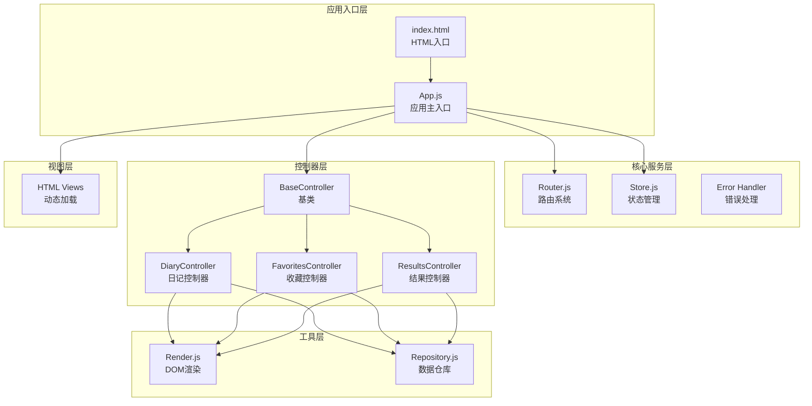
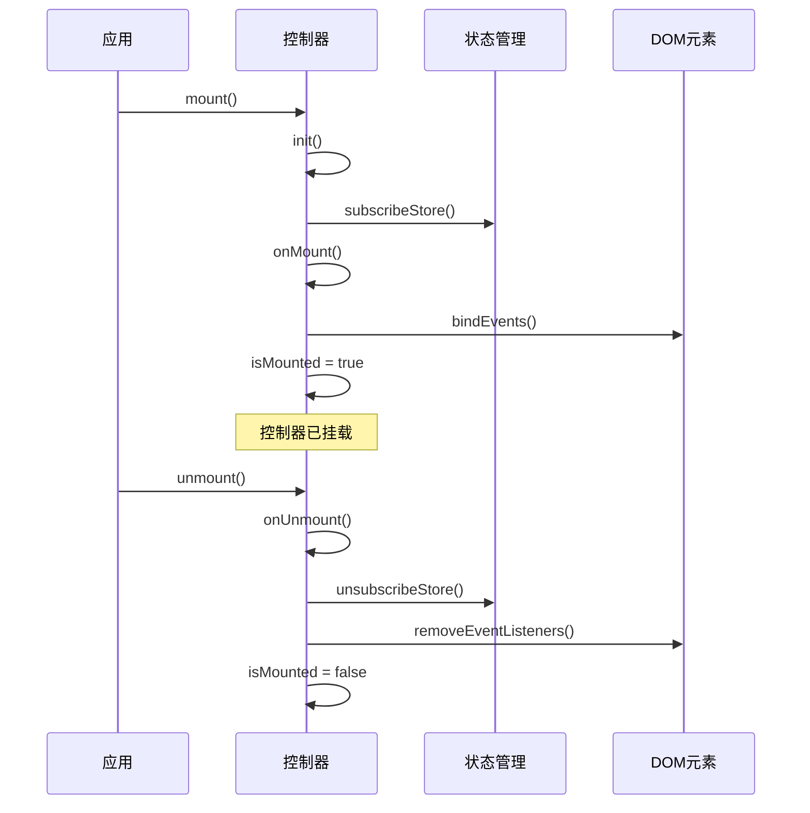
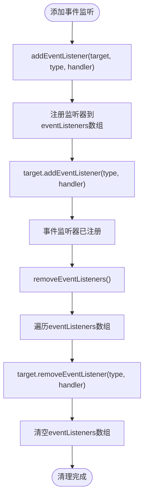
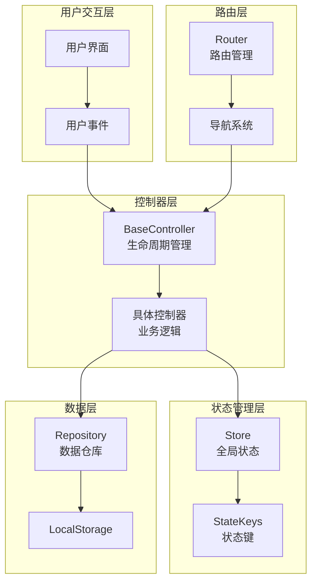
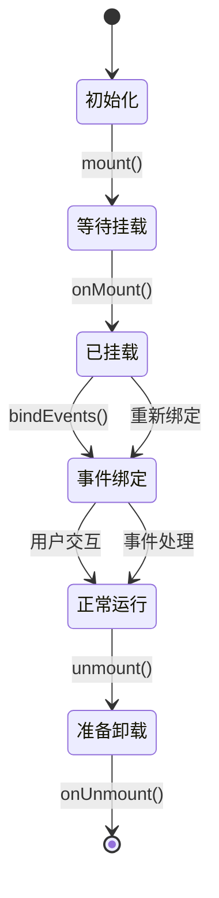
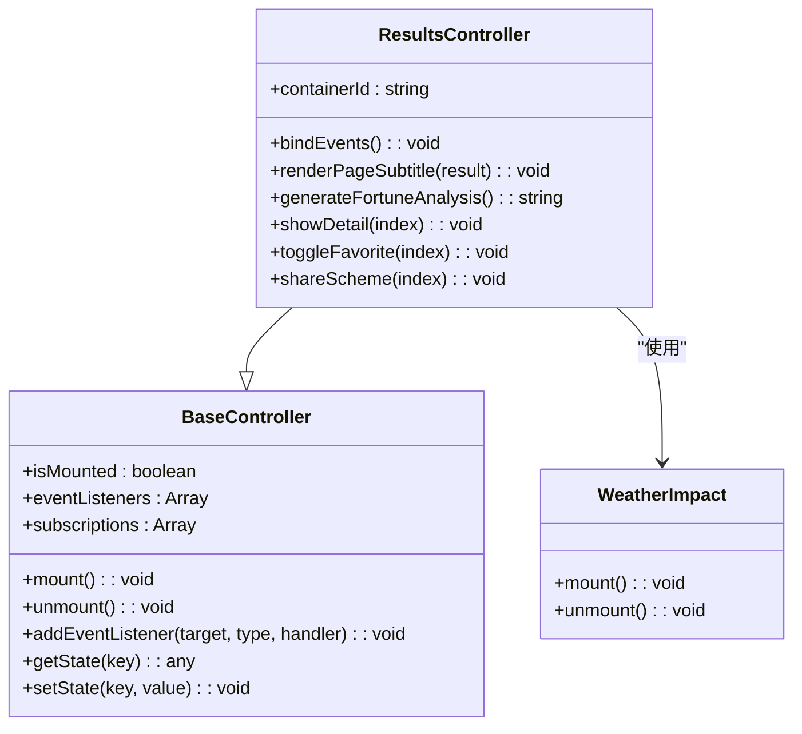
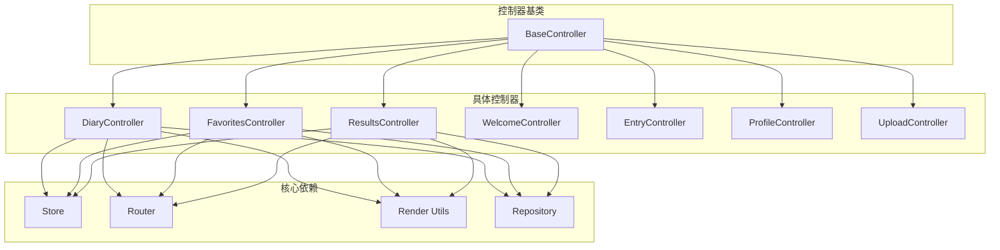
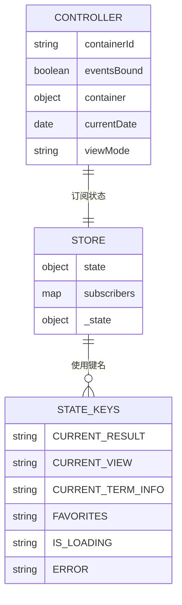

# 控制器扩展方法

<cite>
**本文档引用的文件**
- [js/controllers/base.js](file://js/controllers/base.js)
- [js/core/router.js](file://js/core/router.js)
- [js/core/store.js](file://js/core/store.js)
- [js/core/app.js](file://js/core/app.js)
- [js/controllers/diary.js](file://js/controllers/diary.js)
- [js/controllers/favorites.js](file://js/controllers/favorites.js)
- [js/controllers/results.js](file://js/controllers/results.js)
- [js/utils/render.js](file://js/utils/render.js)
- [js/data/repository.js](file://js/data/repository.js)
- [index.html](file://index.html)
</cite>

## 目录
1. [简介](#简介)
2. [项目结构](#项目结构)
3. [核心组件](#核心组件)
4. [架构概览](#架构概览)
5. [详细组件分析](#详细组件分析)
6. [依赖关系分析](#依赖关系分析)
7. [性能考虑](#性能考虑)
8. [故障排除指南](#故障排除指南)
9. [结论](#结论)
10. [附录](#附录)

## 简介

本文档提供了基于BaseController基类的控制器扩展完整指南。该应用采用MVC架构模式，通过控制器基类统一管理视图生命周期、事件绑定和状态管理。本文档深入讲解如何继承BaseController类，实现完整的控制器功能，并与路由系统和状态管理系统无缝集成。

## 项目结构

该项目采用模块化架构，主要分为以下几个层次：



**图表来源**
- [js/core/app.js](file://js/core/app.js#L1-L206)
- [js/controllers/base.js](file://js/controllers/base.js#L1-L131)

**章节来源**
- [js/core/app.js](file://js/core/app.js#L1-L206)
- [index.html](file://index.html#L1-L79)

## 核心组件

### BaseController基类

BaseController是所有控制器的基类，提供了统一的生命周期管理和资源管理机制：

#### 生命周期管理



**图表来源**
- [js/controllers/base.js](file://js/controllers/base.js#L21-L42)

#### 核心属性和方法

| 属性/方法 | 类型 | 作用 | 默认实现 |
|-----------|------|------|----------|
| isMounted | boolean | 控制器挂载状态标志 | false |
| eventListeners | Array | 事件监听器列表 | [] |
| subscriptions | Array | 状态订阅列表 | [] |
| mount() | Method | 挂载控制器 | 调用init→subscribeStore→onMount→bindEvents |
| unmount() | Method | 卸载控制器 | 调用onUnmount→unsubscribeStore→removeEventListeners |
| init() | Method | 初始化逻辑 | 空实现（子类覆盖） |
| onMount() | Method | 挂载完成回调 | 空实现（子类覆盖） |
| onUnmount() | Method | 卸载前回调 | 空实现（子类覆盖） |
| bindEvents() | Method | 事件绑定 | 空实现（子类覆盖） |

#### 事件绑定机制

BaseController提供了统一的事件管理接口：



**图表来源**
- [js/controllers/base.js](file://js/controllers/base.js#L72-L85)

**章节来源**
- [js/controllers/base.js](file://js/controllers/base.js#L1-L131)

## 架构概览

应用采用MVVM架构模式，通过控制器基类实现视图与业务逻辑的分离：



**图表来源**
- [js/core/app.js](file://js/core/app.js#L36-L196)
- [js/core/router.js](file://js/core/router.js#L1-L142)

**章节来源**
- [js/core/app.js](file://js/core/app.js#L1-L206)
- [js/core/router.js](file://js/core/router.js#L1-L142)

## 详细组件分析

### DiaryController - 日记控制器

DiaryController展示了完整的控制器实现模式：

#### 核心特性

1. **动态容器管理**：在onMount中动态获取视图容器
2. **事件绑定策略**：使用eventsBound标志避免重复绑定
3. **复杂UI交互**：日历视图、时间线视图、模态框管理
4. **数据持久化**：与localStorage集成

#### 生命周期实现



**图表来源**
- [js/controllers/diary.js](file://js/controllers/diary.js#L19-L440)

#### 事件处理模式

DiaryController展示了多种事件处理模式：

| 事件类型 | 处理方式 | 示例 |
|----------|----------|------|
| 点击事件 | 直接绑定到元素 | 返回按钮、添加记录按钮 |
| 委托事件 | 绑定到父容器 | 日历网格点击、列表点击 |
| 表单事件 | 提交处理 | 日记表单提交 |
| 模态框事件 | 背景点击关闭 | 多个模态框关闭 |

**章节来源**
- [js/controllers/diary.js](file://js/controllers/diary.js#L1-L440)

### FavoritesController - 收藏控制器

FavoritesController展示了简洁控制器的实现模式：

#### 关键特点

1. **最小化实现**：只实现必要的生命周期方法
2. **容器标识**：使用containerId属性标识视图容器
3. **简单事件处理**：收藏列表的委托事件处理

**章节来源**
- [js/controllers/favorites.js](file://js/controllers/favorites.js#L1-L89)

### ResultsController - 结果控制器

ResultsController是最复杂的控制器，展示了完整的业务逻辑实现：

#### 核心功能

1. **多状态管理**：集成Store状态和本地状态
2. **复杂UI渲染**：多种卡片类型的渲染
3. **外部组件集成**：WeatherWidget天气影响组件
4. **用户反馈系统**：采纳/不喜欢反馈机制
5. **分享功能**：Web Share API集成

#### 状态管理集成



**图表来源**
- [js/controllers/results.js](file://js/controllers/results.js#L13-L614)
- [js/controllers/base.js](file://js/controllers/base.js#L11-L131)

**章节来源**
- [js/controllers/results.js](file://js/controllers/results.js#L1-L614)

## 依赖关系分析

### 控制器依赖图



**图表来源**
- [js/core/app.js](file://js/core/app.js#L14-L21)
- [js/controllers/base.js](file://js/controllers/base.js#L6-L6)

### 状态管理依赖



**图表来源**
- [js/core/store.js](file://js/core/store.js#L30-L202)
- [js/controllers/base.js](file://js/controllers/base.js#L92-L120)

**章节来源**
- [js/core/app.js](file://js/core/app.js#L1-L206)
- [js/core/store.js](file://js/core/store.js#L1-L212)

## 性能考虑

### 内存管理

1. **事件监听器清理**：确保每次卸载时调用removeEventListeners
2. **状态订阅清理**：使用unsubscribeStore清理所有订阅
3. **DOM引用管理**：及时释放大对象引用

### 渲染优化

1. **按需加载**：视图采用动态加载策略
2. **事件委托**：减少事件监听器数量
3. **动画延迟**：卡片渲染使用渐进式动画

### 最佳实践

1. **避免重复绑定**：使用eventsBound标志防止重复事件绑定
2. **及时清理**：在onUnmount中清理所有资源
3. **错误处理**：使用withErrorHandler包装异步操作

## 故障排除指南

### 常见问题及解决方案

#### 问题1：事件无法触发
**症状**：点击按钮无反应
**原因**：
- 事件监听器未正确绑定
- DOM元素不存在
- 重复绑定导致事件冲突

**解决方案**：
```javascript
// 确保在onMount中绑定事件
onMount() {
    this.container = document.getElementById(this.containerId);
    if (this.container) {
        this.bindEvents();
    }
}

// 使用事件委托减少绑定数量
bindEvents() {
    if (this.eventsBound) return;
    this.eventsBound = true;
    
    // 使用事件委托
    this.addEventListener(this.container, 'click', (e) => {
        const button = e.target.closest('.action-button');
        if (button) {
            this.handleButtonClick(button);
        }
    });
}
```

#### 问题2：内存泄漏
**症状**：长时间使用后内存占用持续增长
**原因**：
- 未清理事件监听器
- 未取消状态订阅
- 未释放DOM引用

**解决方案**：
```javascript
// 在unmount中清理所有资源
onUnmount() {
    this.eventsBound = false;
    this.container = null;
    // 确保父类清理
    super.unmount();
}
```

#### 问题3：状态不同步
**症状**：UI状态与Store状态不一致
**原因**：
- 未正确订阅状态变化
- 状态更新时机不当

**解决方案**：
```javascript
// 在subscribeStore中订阅必要状态
subscribeStore() {
    this.subscribe(StateKeys.CURRENT_RESULT, (newResult) => {
        if (newResult && this.isMounted) {
            this.renderResult(newResult);
        }
    });
}
```

**章节来源**
- [js/controllers/base.js](file://js/controllers/base.js#L35-L42)
- [js/controllers/diary.js](file://js/controllers/diary.js#L436-L438)

## 结论

BaseController基类为控制器扩展提供了完整的基础设施，包括：

1. **生命周期管理**：统一的挂载/卸载流程
2. **事件管理**：自动化的事件监听器注册和清理
3. **状态集成**：与Store的无缝连接
4. **资源管理**：内存泄漏防护机制

通过遵循本文档的最佳实践，开发者可以快速创建功能完整、性能优良的控制器，为用户提供流畅的交互体验。

## 附录

### 扩展步骤清单

1. **创建控制器类**
   ```javascript
   import { BaseController } from './base.js';
   
   export class MyController extends BaseController {
       // 实现必需方法
   }
   ```

2. **实现生命周期方法**
   - `init()`：初始化内部状态
   - `onMount()`：获取容器并绑定事件
   - `onUnmount()`：清理资源

3. **实现事件处理**
   - `bindEvents()`：绑定所有事件监听器
   - 使用`addEventListener()`方法

4. **集成状态管理**
   - 在`subscribeStore()`中订阅必要状态
   - 使用`getState()`和`setState()`操作状态

5. **注册到应用**
   - 在app.js中导入控制器
   - 在VIEW_CONFIG中注册视图映射

### 最佳实践清单

- ✅ 使用事件委托减少监听器数量
- ✅ 在unmount中清理所有资源
- ✅ 避免重复绑定事件
- ✅ 及时释放DOM引用
- ✅ 使用错误处理包装异步操作
- ✅ 遵循单一职责原则
- ✅ 保持控制器轻量化