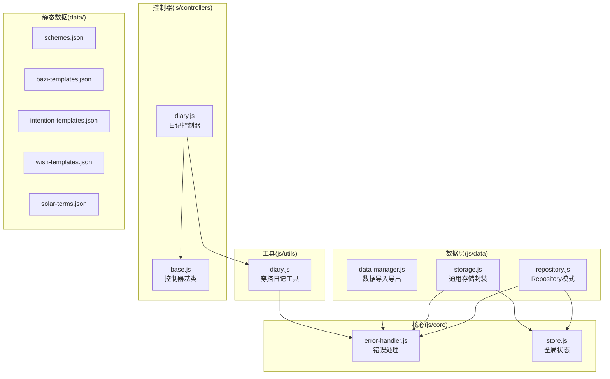
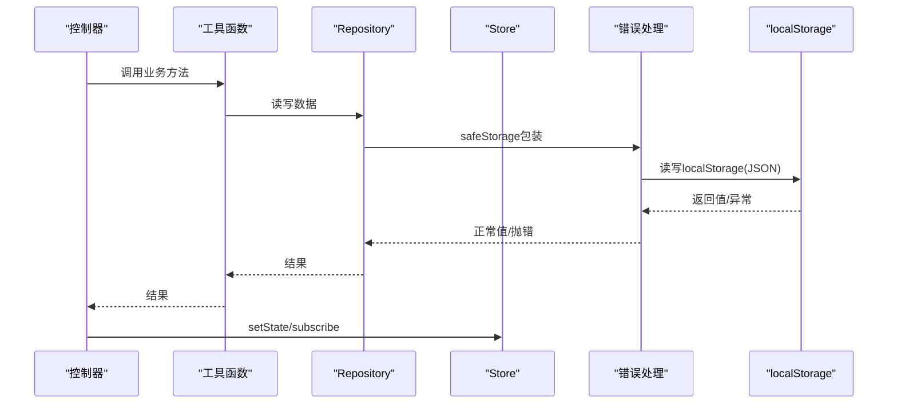
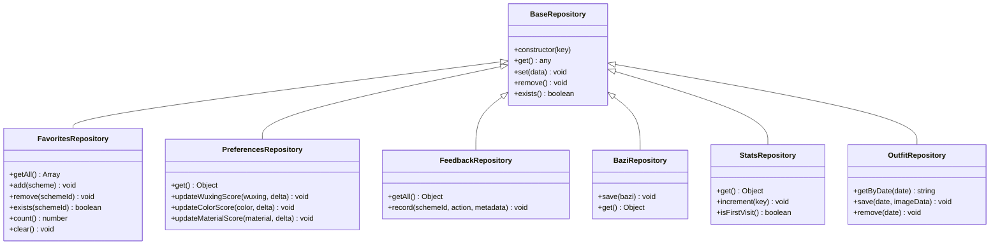
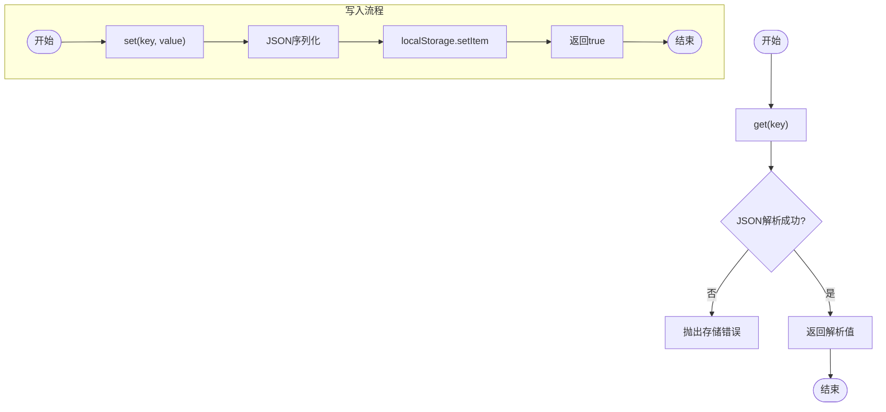
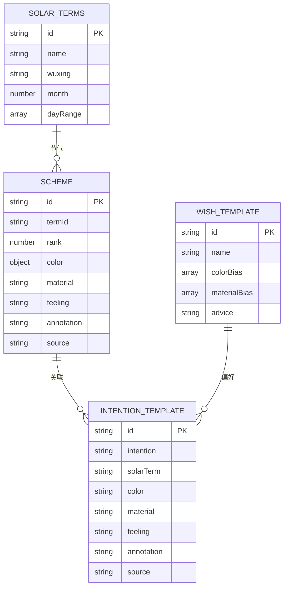
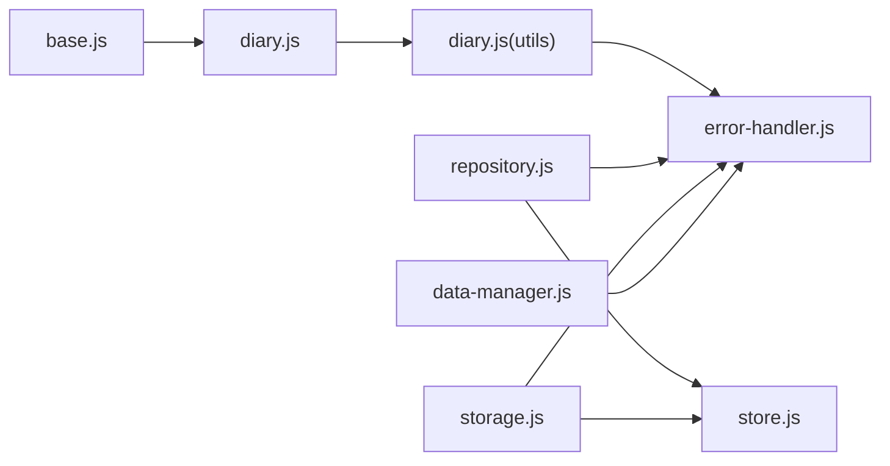

# 数据模型扩展方法

<cite>
**本文档引用的文件**
- [repository.js](file://js/data/repository.js)
- [storage.js](file://js/data/storage.js)
- [data-manager.js](file://js/data/data-manager.js)
- [store.js](file://js/core/store.js)
- [error-handler.js](file://js/core/error-handler.js)
- [diary.js](file://js/utils/diary.js)
- [schemes.json](file://data/schemes.json)
- [bazi-templates.json](file://data/bazi-templates.json)
- [intention-templates.json](file://data/intention-templates.json)
- [wish-templates.json](file://data/wish-templates.json)
- [solar-terms.json](file://data/solar-terms.json)
- [diary.js](file://js/controllers/diary.js)
- [base.js](file://js/controllers/base.js)
</cite>

## 目录
1. [简介](#简介)
2. [项目结构](#项目结构)
3. [核心组件](#核心组件)
4. [架构总览](#架构总览)
5. [详细组件分析](#详细组件分析)
6. [依赖关系分析](#依赖关系分析)
7. [性能考虑](#性能考虑)
8. [故障排除指南](#故障排除指南)
9. [结论](#结论)
10. [附录](#附录)

## 简介
本指南面向希望在现有数据架构中添加新数据类型、修改存储结构并实现数据同步与备份恢复的开发者。文档基于仓库中的数据层、存储层、数据管理模块以及静态配置文件，系统讲解Repository模式扩展、存储策略定制、静态数据配置扩展，并提供可直接落地的扩展示例与最佳实践。

## 项目结构
项目采用模块化组织，数据相关的核心文件位于 `js/data`，静态数据位于 `data/` 目录，控制器位于 `js/controllers/`，状态管理位于 `js/core/`，工具函数位于 `js/utils/`。

**图表来源**
- [repository.js](file://js/data/repository.js#L1-L394)
- [storage.js](file://js/data/storage.js#L1-L145)
- [data-manager.js](file://js/data/data-manager.js#L1-L376)
- [store.js](file://js/core/store.js#L1-L212)
- [error-handler.js](file://js/core/error-handler.js#L1-L190)
- [diary.js](file://js/utils/diary.js#L1-L242)
- [base.js](file://js/controllers/base.js#L1-L131)
- [diary.js](file://js/controllers/diary.js#L1-L440)

**章节来源**
- [repository.js](file://js/data/repository.js#L1-L394)
- [storage.js](file://js/data/storage.js#L1-L145)
- [data-manager.js](file://js/data/data-manager.js#L1-L376)
- [store.js](file://js/core/store.js#L1-L212)
- [error-handler.js](file://js/core/error-handler.js#L1-L190)
- [diary.js](file://js/utils/diary.js#L1-L242)
- [base.js](file://js/controllers/base.js#L1-L131)
- [diary.js](file://js/controllers/diary.js#L1-L440)

## 核心组件
- Repository模式：通过BaseRepository及派生类实现对不同数据类型的统一存取接口，内置安全的localStorage包装与基础CRUD操作。
- 通用存储封装：提供带命名空间的键前缀、批量清理、业务方法等，便于扩展新数据类型。
- 数据管理：支持版本化导出、校验、导入、预览、合并与清理，保障数据迁移与兼容性。
- 全局状态：Store提供响应式状态管理，支持订阅与批量更新，便于UI与数据层联动。
- 错误处理：统一的错误类型与安全包装函数，确保存储异常可捕获与用户提示。
- 穿搭日记工具：基于localStorage的日期键值存储，支持日历/时间线视图与统计分析。
- 静态数据：JSON模板文件定义了方案、八字模板、意图模板、心愿模板与节气信息，作为只读数据源。

**章节来源**
- [repository.js](file://js/data/repository.js#L46-L81)
- [storage.js](file://js/data/storage.js#L9-L49)
- [data-manager.js](file://js/data/data-manager.js#L8-L22)
- [store.js](file://js/core/store.js#L30-L63)
- [error-handler.js](file://js/core/error-handler.js#L5-L15)
- [diary.js](file://js/utils/diary.js#L19-L32)

## 架构总览
数据流从控制器触发，经过工具函数与数据层，最终持久化到localStorage；同时通过数据管理模块实现备份与恢复。

**图表来源**
- [diary.js](file://js/controllers/diary.js#L19-L440)
- [diary.js](file://js/utils/diary.js#L38-L75)
- [repository.js](file://js/data/repository.js#L24-L41)
- [error-handler.js](file://js/core/error-handler.js#L153-L163)
- [store.js](file://js/core/store.js#L30-L63)

## 详细组件分析

### Repository模式扩展指南
Repository模式通过抽象存储实现，支持多种数据类型，当前已实现收藏、偏好、反馈、八字、使用统计、上传照片等仓库。扩展步骤如下：
- 定义存储键名常量：在StorageKeys中新增键名，保持命名规范与唯一性。
- 新建仓库类：继承BaseRepository，实现get/set/remove/exist等基础方法，按需扩展业务方法（如统计、聚合）。
- 注册实例：在文件末尾导出新实例，供其他模块使用。
- 数据验证：在set方法中增加参数校验与默认值处理，确保数据一致性。
- 错误处理：统一通过safeStorage包装，避免异常中断流程。

**图表来源**
- [repository.js](file://js/data/repository.js#L46-L394)

**章节来源**
- [repository.js](file://js/data/repository.js#L9-L21)
- [repository.js](file://js/data/repository.js#L46-L394)

### 存储策略定制
- localStorage封装：提供安全包装与键前缀，避免冲突并统一序列化/反序列化。
- 业务方法：针对特定数据类型提供便捷方法（如最后结果、反馈、上传照片等），减少重复逻辑。
- 批量清理：按前缀清理，便于版本升级时清理旧数据。
- 版本控制：数据管理模块通过版本号与兼容性检查，确保导入数据的正确性。

**图表来源**
- [storage.js](file://js/data/storage.js#L9-L21)

**章节来源**
- [storage.js](file://js/data/storage.js#L7-L49)
- [data-manager.js](file://js/data/data-manager.js#L8-L22)

### 静态数据配置扩展
静态数据以JSON文件形式提供，建议遵循以下规范：
- 文件命名：使用语义化名称，如 `intention-templates.json`、`wish-templates.json`。
- 结构设计：顶层包含数组或对象，数组元素包含标准字段（如id、name、colorBias等）。
- 字段规范：统一使用英文字段名，值类型明确（字符串、数字、布尔、数组、对象）。
- 加载机制：通过fetch或静态引入方式加载，注意跨域与缓存策略。

**图表来源**
- [schemes.json](file://data/schemes.json#L1-L509)
- [intention-templates.json](file://data/intention-templates.json#L1-L493)
- [wish-templates.json](file://data/wish-templates.json#L1-L47)
- [solar-terms.json](file://data/solar-terms.json#L1-L42)

**章节来源**
- [schemes.json](file://data/schemes.json#L1-L509)
- [intention-templates.json](file://data/intention-templates.json#L1-L493)
- [wish-templates.json](file://data/wish-templates.json#L1-L47)
- [solar-terms.json](file://data/solar-terms.json#L1-L42)

### 数据一致性与性能优化
- 一致性保障
  - 使用Repository的原子操作，避免并发写入导致的数据不一致。
  - 在set前进行参数校验与默认值填充，确保数据结构稳定。
  - 对于复杂对象，采用深拷贝策略，防止外部引用污染内部状态。
- 性能优化
  - 合理使用localStorage，避免单键过大；必要时拆分为多个键或压缩存储。
  - 批量更新时使用一次性序列化，减少多次IO。
  - 对频繁读取的数据进行内存缓存，结合Store的响应式更新。

**章节来源**
- [repository.js](file://js/data/repository.js#L160-L167)
- [store.js](file://js/core/store.js#L11-L25)

## 依赖关系分析
- 控制器依赖工具函数与数据层，通过BaseController提供的订阅与状态管理实现UI联动。
- 工具函数依赖错误处理模块，确保存储异常可捕获与用户提示。
- 数据层依赖错误处理模块，提供安全的localStorage包装。
- 数据管理模块依赖数据层的键集合，实现版本化导出与导入。

**图表来源**
- [base.js](file://js/controllers/base.js#L1-L131)
- [diary.js](file://js/controllers/diary.js#L1-L440)
- [diary.js](file://js/utils/diary.js#L1-L242)
- [repository.js](file://js/data/repository.js#L1-L394)
- [storage.js](file://js/data/storage.js#L1-L145)
- [data-manager.js](file://js/data/data-manager.js#L1-L376)
- [store.js](file://js/core/store.js#L1-L212)
- [error-handler.js](file://js/core/error-handler.js#L1-L190)

**章节来源**
- [base.js](file://js/controllers/base.js#L1-L131)
- [diary.js](file://js/controllers/diary.js#L1-L440)
- [diary.js](file://js/utils/diary.js#L1-L242)
- [repository.js](file://js/data/repository.js#L1-L394)
- [storage.js](file://js/data/storage.js#L1-L145)
- [data-manager.js](file://js/data/data-manager.js#L1-L376)
- [store.js](file://js/core/store.js#L1-L212)
- [error-handler.js](file://js/core/error-handler.js#L1-L190)

## 性能考虑
- 存储层
  - 将大型对象拆分为多个键，避免单键超限。
  - 使用批量序列化，减少多次IO。
  - 对频繁读取的数据进行内存缓存。
- 导入导出
  - 导出时按需过滤空值，减小文件体积。
  - 导入时支持预览与合并，避免误操作。
- UI联动
  - Store的响应式代理仅在值变化时通知订阅者，减少不必要的渲染。

[本节为通用指导，无需具体文件分析]

## 故障排除指南
- 存储异常
  - 当localStorage不可用或配额不足时，错误处理模块会抛出存储错误类型，提示用户清理空间或检查浏览器设置。
- 数据解析错误
  - JSON解析失败时，统一抛出数据解析错误类型，建议检查数据格式与编码。
- 网络与超时
  - 网络请求超时或失败时，统一抛出网络错误类型，建议检查网络连接与服务端状态。
- 数据导入失败
  - 导入前进行版本与结构校验，若不兼容或为空，返回错误列表以便用户修复。

**章节来源**
- [error-handler.js](file://js/core/error-handler.js#L18-L25)
- [error-handler.js](file://js/core/error-handler.js#L153-L163)
- [data-manager.js](file://js/data/data-manager.js#L106-L135)

## 结论
通过Repository模式与通用存储封装，项目实现了可扩展的数据层；配合数据管理模块与静态配置文件，能够高效地实现数据的增删改查、版本迁移与备份恢复。遵循本文档的扩展步骤与最佳实践，可在不破坏现有架构的前提下快速添加新的数据类型与存储策略。

[本节为总结，无需具体文件分析]

## 附录

### 扩展示例：新增“心愿”数据类型
- 步骤1：在StorageKeys中新增键名常量
  - 参考路径：[repository.js](file://js/data/repository.js#L9-L21)
- 步骤2：新建仓库类
  - 继承BaseRepository，实现get/set/remove/exist与业务方法（如添加、移除、查询）
  - 参考类：[repository.js](file://js/data/repository.js#L46-L81)
- 步骤3：注册实例
  - 在文件末尾导出新实例
  - 参考路径：[repository.js](file://js/data/repository.js#L380-L385)
- 步骤4：实现数据访问方法
  - 在utils中新增对应工具函数，封装localStorage读写
  - 参考路径：[diary.js](file://js/utils/diary.js#L19-L32)
- 步骤5：数据验证与默认值
  - 在set方法中进行参数校验与默认值填充
  - 参考路径：[repository.js](file://js/data/repository.js#L160-L167)
- 步骤6：数据同步与备份恢复
  - 在DATA_KEYS中加入新键，确保导出/导入包含该数据
  - 参考路径：[data-manager.js](file://js/data/data-manager.js#L12-L22)
- 步骤7：静态数据配置
  - 在data目录新增JSON文件，定义心愿模板与字段规范
  - 参考文件：[wish-templates.json](file://data/wish-templates.json#L1-L47)

### 扩展示例：新增“穿搭日记”数据类型
- 步骤1：定义存储键名
  - 参考路径：[diary.js](file://js/utils/diary.js#L8)
- 步骤2：实现CRUD方法
  - getDiaryRecords/getDiaryByDate/saveDiaryRecord/deleteDiaryRecord
  - 参考路径：[diary.js](file://js/utils/diary.js#L38-L75)
- 步骤3：统计与分析
  - getDiaryStats/getStreakDays
  - 参考路径：[diary.js](file://js/utils/diary.js#L147-L229)
- 步骤4：控制器集成
  - 在日记控制器中绑定事件、渲染视图、调用工具函数
  - 参考路径：[diary.js](file://js/controllers/diary.js#L19-L440)

### 数据迁移与版本兼容
- 版本号管理
  - 在数据管理模块中维护版本号，导入时进行兼容性检查
  - 参考路径：[data-manager.js](file://js/data/data-manager.js#L8-L11)
- 数据校验
  - validateImportData检查版本、结构与数据有效性
  - 参考路径：[data-manager.js](file://js/data/data-manager.js#L106-L135)
- 导入策略
  - 支持预览、合并与覆盖三种模式
  - 参考路径：[data-manager.js](file://js/data/data-manager.js#L143-L184)