# 服务层扩展指南

<cite>
**本文档引用的文件**
- [engine.js](file://js/services/engine.js)
- [recommendation.js](file://js/services/recommendation.js)
- [repository.js](file://js/data/repository.js)
- [app.js](file://js/core/app.js)
- [store.js](file://js/core/store.js)
- [error-handler.js](file://js/core/error-handler.js)
- [scorer.js](file://js/core/scorer.js)
- [scoring-config.js](file://js/core/scoring-config.js)
- [weather.js](file://js/services/weather.js)
- [results.js](file://js/controllers/results.js)
- [render.js](file://js/utils/render.js)
- [index.html](file://index.html)
- [sw.js](file://sw.js)
</cite>

## 目录
1. [简介](#简介)
2. [项目结构](#项目结构)
3. [核心组件](#核心组件)
4. [架构概览](#架构概览)
5. [详细组件分析](#详细组件分析)
6. [依赖分析](#依赖分析)
7. [性能考虑](#性能考虑)
8. [故障排除指南](#故障排除指南)
9. [结论](#结论)
10. [附录](#附录)

## 简介

本指南面向希望在现有服务架构基础上添加新业务服务的开发者。项目采用模块化设计，通过服务层、数据仓库层、控制器层和视图层的清晰分离，实现了高度可扩展的架构。本文档深入讲解服务类的设计模式、依赖注入机制、错误处理策略、异步操作处理、数据仓库集成，并提供具体的扩展示例。

## 项目结构

项目采用前后端分离的模块化架构，主要分为以下层次：

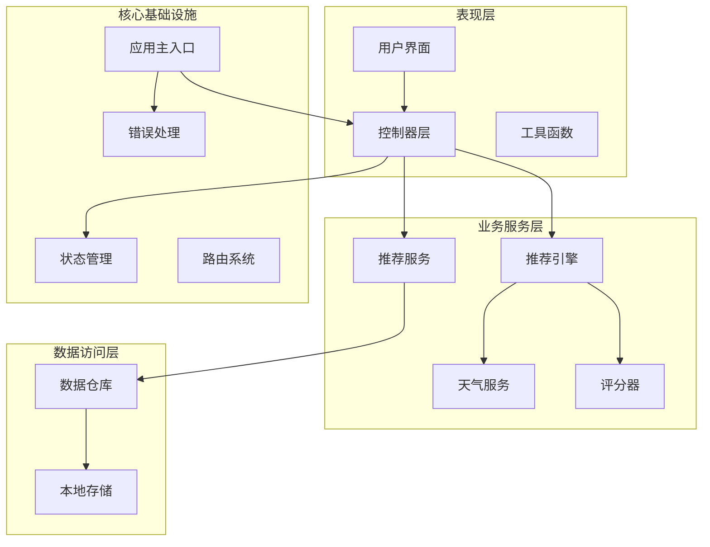

**图表来源**
- [app.js](file://js/core/app.js#L36-L196)
- [engine.js](file://js/services/engine.js#L1-L425)
- [repository.js](file://js/data/repository.js#L46-L394)

**章节来源**
- [app.js](file://js/core/app.js#L1-L206)
- [index.html](file://index.html#L1-L79)

## 核心组件

### 服务层架构模式

项目采用服务导向架构（SOA），每个服务模块负责特定的业务领域：

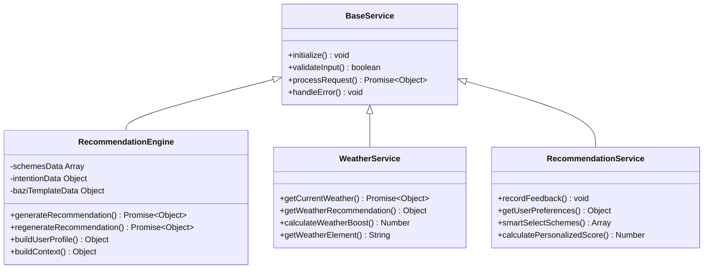

**图表来源**
- [engine.js](file://js/services/engine.js#L323-L421)
- [weather.js](file://js/services/weather.js#L119-L138)
- [recommendation.js](file://js/services/recommendation.js#L145-L184)

### 数据仓库模式

数据访问层采用Repository模式，提供统一的数据抽象：

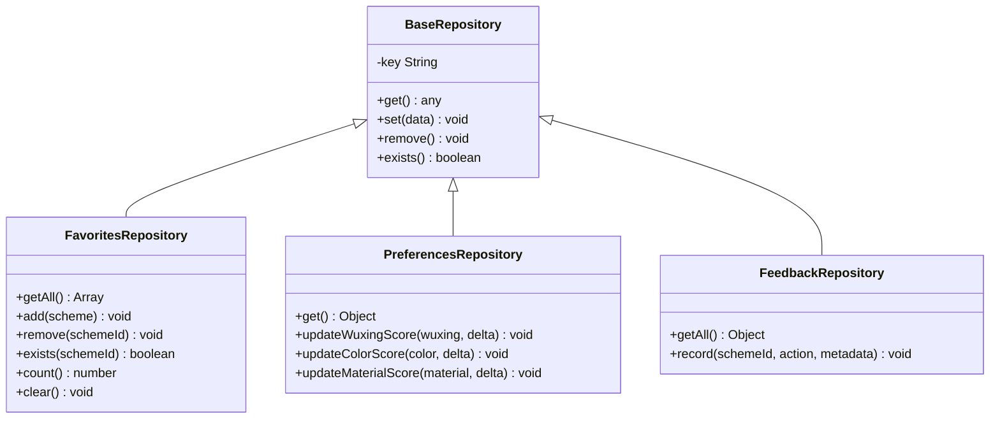

**图表来源**
- [repository.js](file://js/data/repository.js#L46-L394)

**章节来源**
- [repository.js](file://js/data/repository.js#L1-L394)
- [engine.js](file://js/services/engine.js#L1-L425)

## 架构概览

### 异步操作处理流程

项目采用现代JavaScript异步处理模式，结合Promise和async/await：

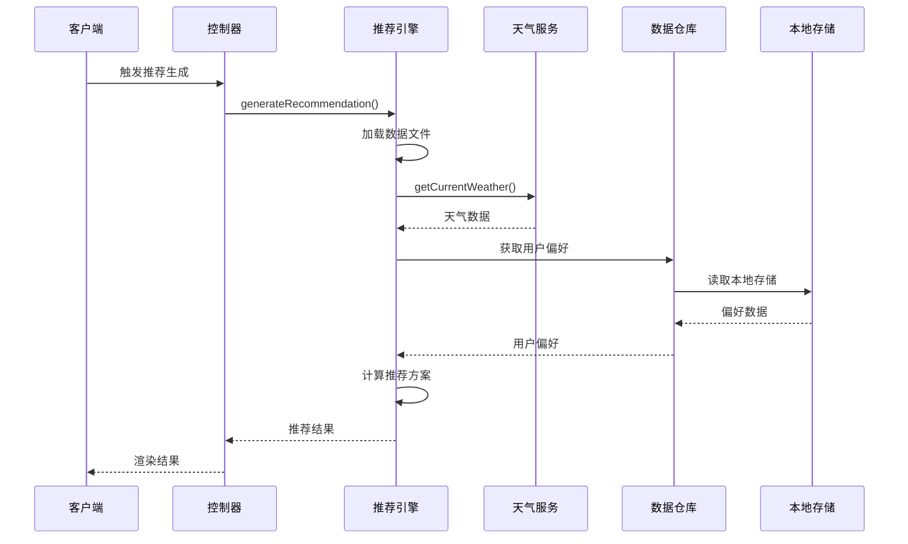

**图表来源**
- [engine.js](file://js/services/engine.js#L323-L393)
- [weather.js](file://js/services/weather.js#L135-L138)
- [repository.js](file://js/data/repository.js#L24-L41)

### 错误处理策略

统一的错误处理机制确保了系统的健壮性：

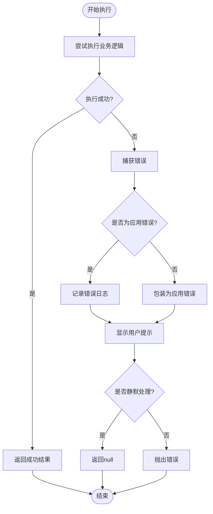

**图表来源**
- [error-handler.js](file://js/core/error-handler.js#L45-L79)

**章节来源**
- [error-handler.js](file://js/core/error-handler.js#L1-L190)
- [app.js](file://js/core/app.js#L48-L73)

## 详细组件分析

### 推荐引擎服务

推荐引擎是整个系统的核心服务，负责综合多维度因素生成个性化推荐：

#### 核心算法实现

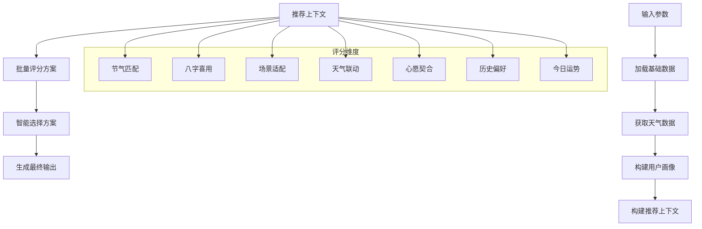

**图表来源**
- [engine.js](file://js/services/engine.js#L218-L299)
- [scorer.js](file://js/core/scorer.js#L29-L75)

#### 评分器设计模式

评分器采用策略模式，支持灵活的评分策略：

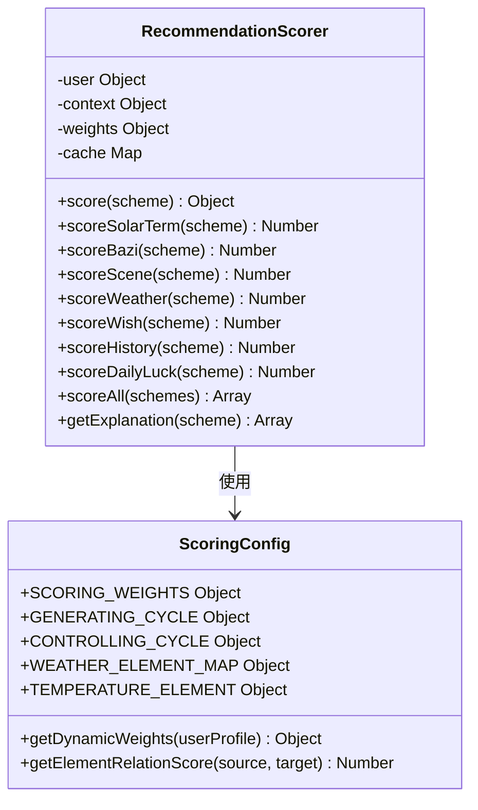

**图表来源**
- [scorer.js](file://js/core/scorer.js#L14-L317)
- [scoring-config.js](file://js/core/scoring-config.js#L7-L128)

**章节来源**
- [engine.js](file://js/services/engine.js#L218-L393)
- [scorer.js](file://js/core/scorer.js#L1-L317)
- [scoring-config.js](file://js/core/scoring-config.js#L1-L128)

### 天气服务集成

天气服务提供了实时天气数据获取和推荐功能：

#### 天气数据处理流程

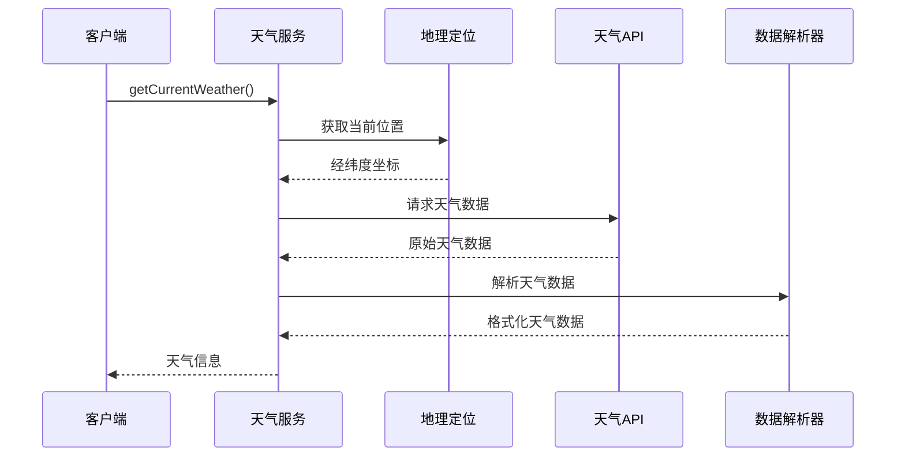

**图表来源**
- [weather.js](file://js/services/weather.js#L135-L138)
- [weather.js](file://js/services/weather.js#L119-L129)

**章节来源**
- [weather.js](file://js/services/weather.js#L1-L340)

### 用户偏好管理系统

用户偏好系统采用Repository模式，提供完整的偏好管理功能：

#### 偏好数据流

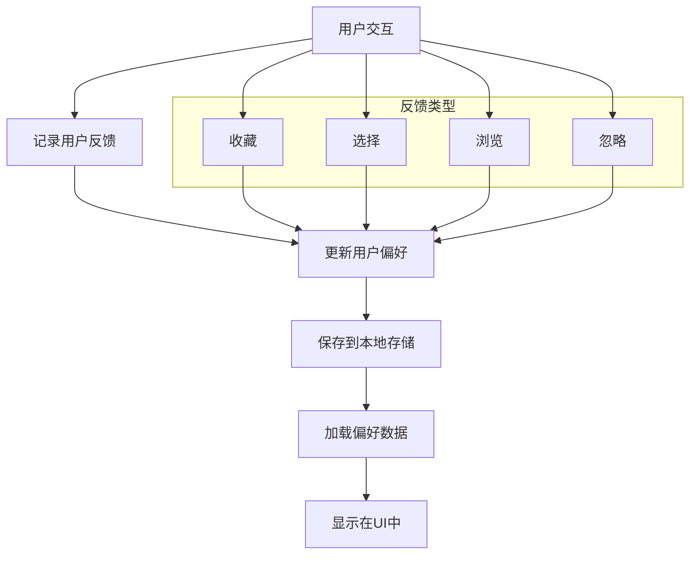

**图表来源**
- [recommendation.js](file://js/services/recommendation.js#L145-L184)
- [recommendation.js](file://js/services/recommendation.js#L192-L218)

**章节来源**
- [recommendation.js](file://js/services/recommendation.js#L1-L466)

## 依赖分析

### 模块依赖关系

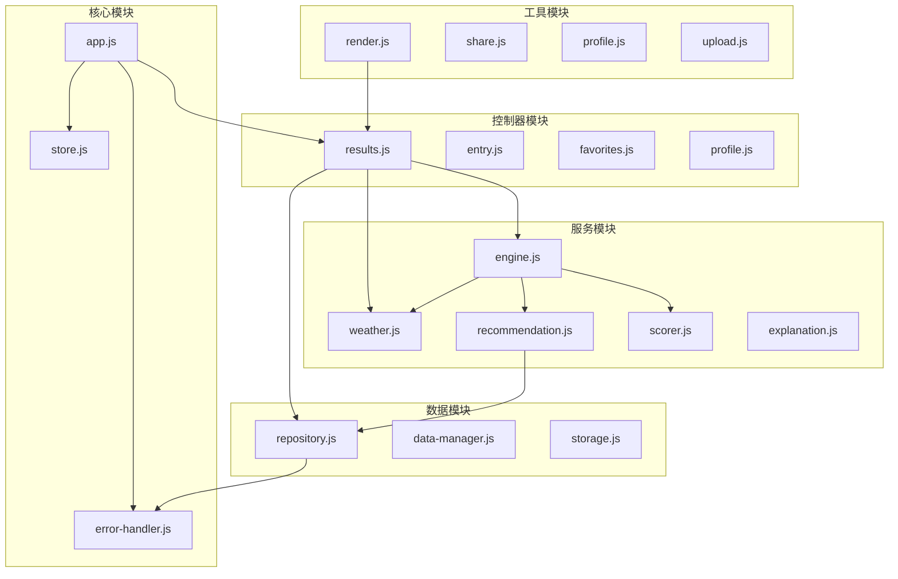

**图表来源**
- [app.js](file://js/core/app.js#L14-L21)
- [engine.js](file://js/services/engine.js#L6-L9)
- [repository.js](file://js/data/repository.js#L6)

### 服务间通信机制

服务层采用事件驱动和状态共享的方式进行通信：

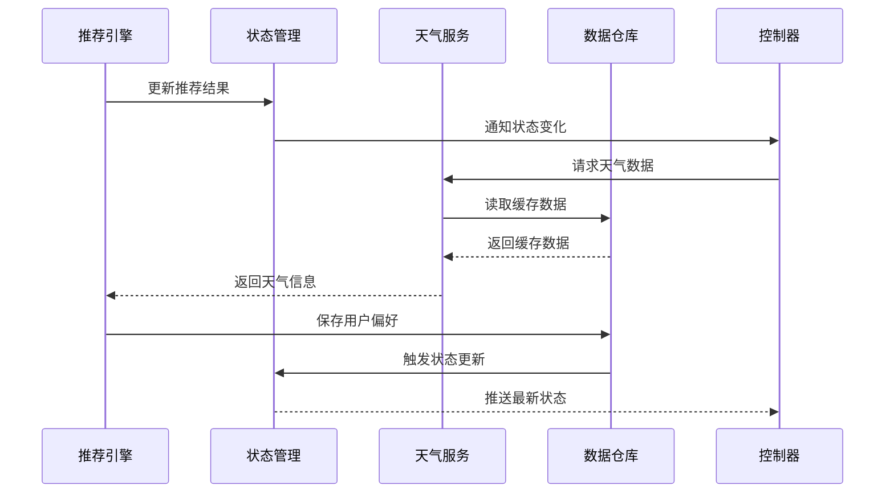

**图表来源**
- [store.js](file://js/core/store.js#L130-L141)
- [engine.js](file://js/services/engine.js#L356-L363)

**章节来源**
- [app.js](file://js/core/app.js#L1-L206)
- [store.js](file://js/core/store.js#L1-L212)

## 性能考虑

### 异步操作优化

1. **并发数据加载**: 使用Promise.all并行加载多个数据源
2. **缓存策略**: 内置数据缓存避免重复请求
3. **内存管理**: 使用WeakMap和缓存机制控制内存使用

### 错误处理优化

1. **渐进式降级**: 网络失败时提供基础功能
2. **超时控制**: 10秒超时防止长时间阻塞
3. **静默处理**: 可配置的错误静默模式

### 性能监控建议

```javascript
// 性能监控示例
const performanceMonitor = {
  startTime: Date.now(),
  measure(name) {
    const endTime = Date.now();
    console.log(`${name}: ${endTime - this.startTime}ms`);
    this.startTime = endTime;
  }
};
```

## 故障排除指南

### 常见问题诊断

#### 网络请求失败

**症状**: 天气数据无法加载，推荐功能受限

**解决方案**:
1. 检查网络连接状态
2. 验证API密钥有效性
3. 查看浏览器开发者工具的网络面板

#### 本地存储异常

**症状**: 用户偏好丢失，收藏功能失效

**解决方案**:
1. 检查浏览器隐私模式设置
2. 验证localStorage可用性
3. 清理浏览器缓存数据

#### 推荐结果异常

**症状**: 推荐方案不符合预期

**解决方案**:
1. 检查用户输入数据完整性
2. 验证八字数据准确性
3. 查看评分器日志输出

**章节来源**
- [error-handler.js](file://js/core/error-handler.js#L168-L189)
- [weather.js](file://js/services/weather.js#L101-L133)

## 结论

本服务层扩展指南提供了在现有架构基础上添加新业务服务的完整框架。通过遵循模块化设计原则、采用Repository模式、实现统一错误处理机制和优化异步操作，开发者可以快速扩展系统功能而不破坏现有架构稳定性。

关键要点包括：
- 服务类应遵循单一职责原则
- 使用依赖注入确保松耦合
- 实现完整的错误处理和降级策略
- 采用Repository模式保证数据访问的一致性
- 优化异步操作提升用户体验

## 附录

### 扩展开发最佳实践

#### 新服务开发步骤

1. **需求分析**: 明确业务需求和数据依赖
2. **接口设计**: 定义清晰的API接口规范
3. **实现服务**: 遵循现有代码风格和模式
4. **集成测试**: 确保与现有系统的兼容性
5. **性能优化**: 实施必要的性能优化措施

#### 代码质量标准

- 遵循ES6+语法规范
- 使用语义化的变量和函数命名
- 添加必要的注释和文档
- 实现完整的错误处理
- 编写单元测试覆盖关键逻辑