# 样式扩展策略

<cite>
**本文档引用的文件**
- [main.css](file://css/main.css)
- [components.css](file://css/components.css)
- [index.html](file://index.html)
- [app.js](file://js/core/app.js)
- [base.js](file://js/components/base.js)
- [modals.html](file://views/modals.html)
- [welcome.html](file://views/welcome.html)
</cite>

## 目录
1. [简介](#简介)
2. [项目结构](#项目结构)
3. [核心组件](#核心组件)
4. [架构概览](#架构概览)
5. [详细组件分析](#详细组件分析)
6. [依赖关系分析](#依赖关系分析)
7. [性能考虑](#性能考虑)
8. [故障排除指南](#故障排除指南)
9. [结论](#结论)

## 简介

本指南旨在为现有CSS架构提供全面的样式扩展策略，详细介绍如何在现有的"五行穿搭建议"项目基础上进行主题定制和组件样式扩展。该项目采用现代化的CSS架构设计，包括模块化样式组织、CSS变量系统、BEM命名规范和组件样式隔离策略。

项目的核心特色包括：
- **设计令牌系统**：完整的CSS变量体系，支持主题定制和动态切换
- **模块化架构**：分离基础样式和组件样式，便于维护和扩展
- **响应式设计**：基于断点的移动端优先设计
- **动画系统**：丰富的CSS动画和过渡效果
- **无障碍支持**：完整的键盘导航和屏幕阅读器支持

## 项目结构

项目采用清晰的文件组织结构，将样式分为基础样式和组件样式两个主要部分：

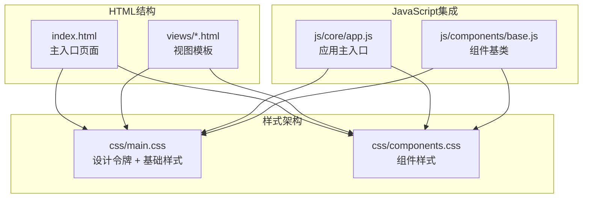

**图表来源**
- [main.css](file://css/main.css#L1-L130)
- [components.css](file://css/components.css#L1-L50)
- [index.html](file://index.html#L1-L20)

**章节来源**
- [main.css](file://css/main.css#L1-L130)
- [components.css](file://css/components.css#L1-L50)
- [index.html](file://index.html#L1-L20)

## 核心组件

### 设计令牌系统

项目建立了完整的CSS变量设计令牌系统，提供统一的主题控制机制：

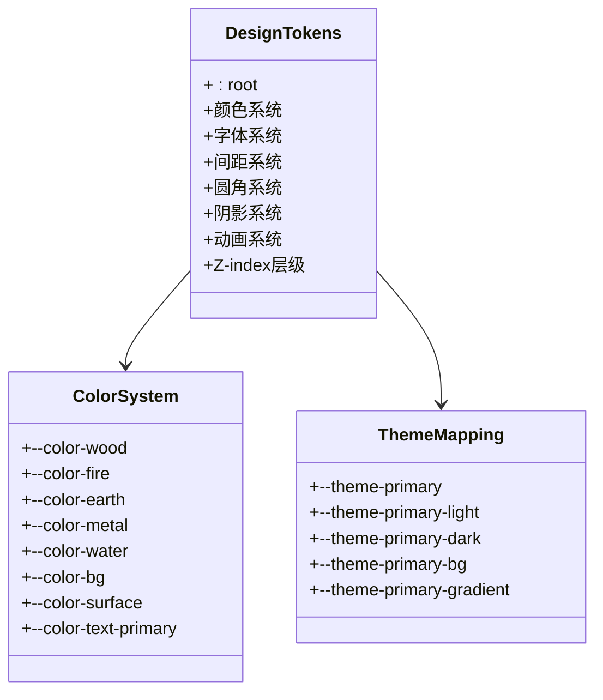

**图表来源**
- [main.css](file://css/main.css#L5-L130)

设计令牌系统的关键特性：
- **五行动态主题**：基于五行理论的颜色系统，支持根据节气动态切换
- **中性色体系**：背景色、表面色、文本色的完整层次
- **功能色系统**：成功、警告、错误、信息等状态色
- **响应式断点**：预定义的移动端断点参考值

**章节来源**
- [main.css](file://css/main.css#L5-L130)

### 基础样式架构

基础样式层提供了整个应用的视觉基础：

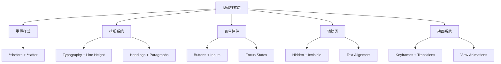

**图表来源**
- [main.css](file://css/main.css#L135-L297)

**章节来源**
- [main.css](file://css/main.css#L135-L297)

### 组件样式系统

组件样式层专注于可复用UI组件的设计：

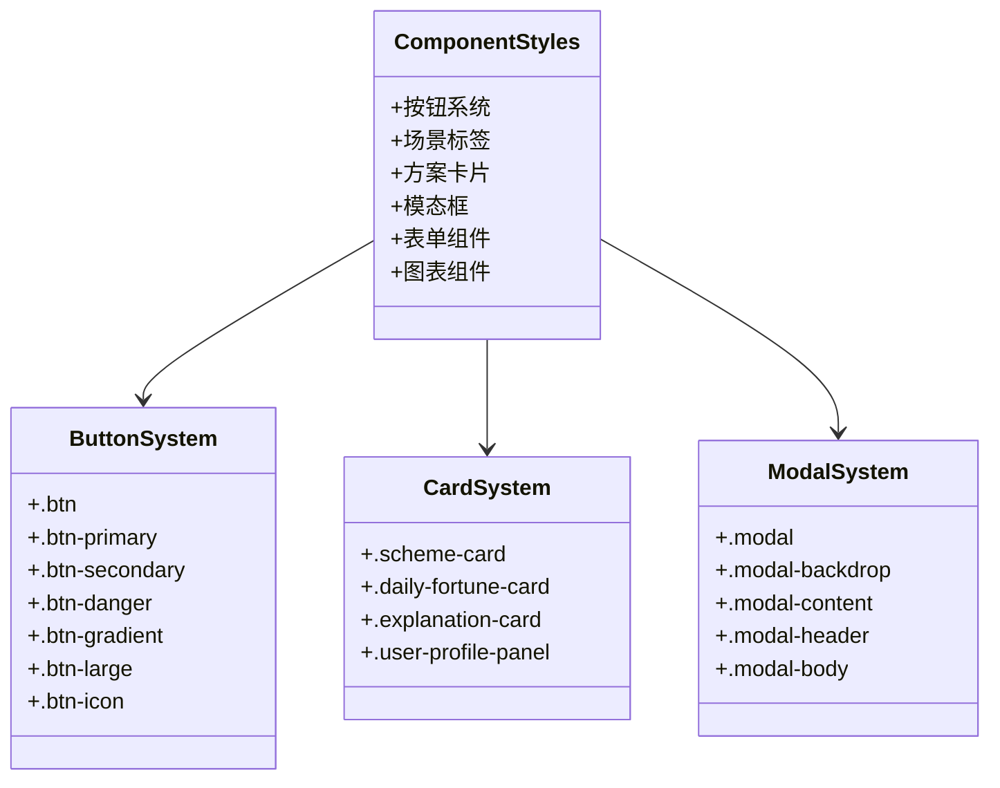

**图表来源**
- [components.css](file://css/components.css#L5-L50)

**章节来源**
- [components.css](file://css/components.css#L5-L50)

## 架构概览

项目采用"设计令牌 + 基础样式 + 组件样式"的三层架构模式：

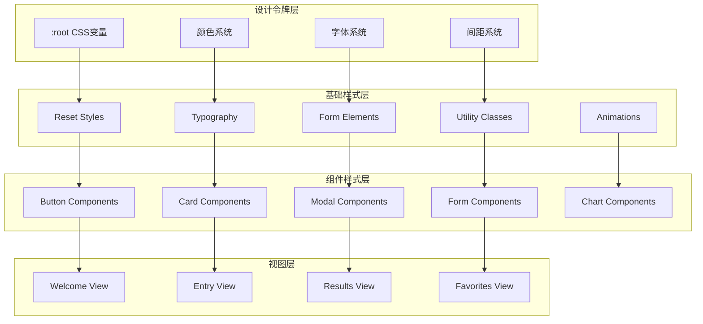

**图表来源**
- [main.css](file://css/main.css#L1-L130)
- [components.css](file://css/components.css#L1-L50)

## 详细组件分析

### 按钮系统扩展

按钮系统是项目中最复杂的组件之一，提供了多种变体和交互状态：

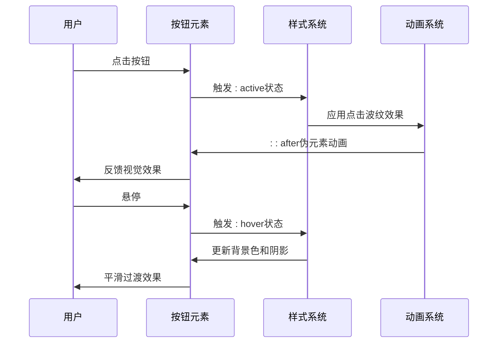

**图表来源**
- [components.css](file://css/components.css#L424-L443)

按钮系统的扩展策略：
- **颜色变体**：支持primary、secondary、danger、ghost等不同视觉强调
- **尺寸变体**：提供标准、large、icon等不同尺寸规格
- **状态管理**：完整的hover、active、disabled状态处理
- **动画效果**：点击波纹、缩放、阴影变化等微交互

**章节来源**
- [components.css](file://css/components.css#L5-L97)

### 方案卡片系统

方案卡片是核心业务组件，展示了推荐的穿搭方案：

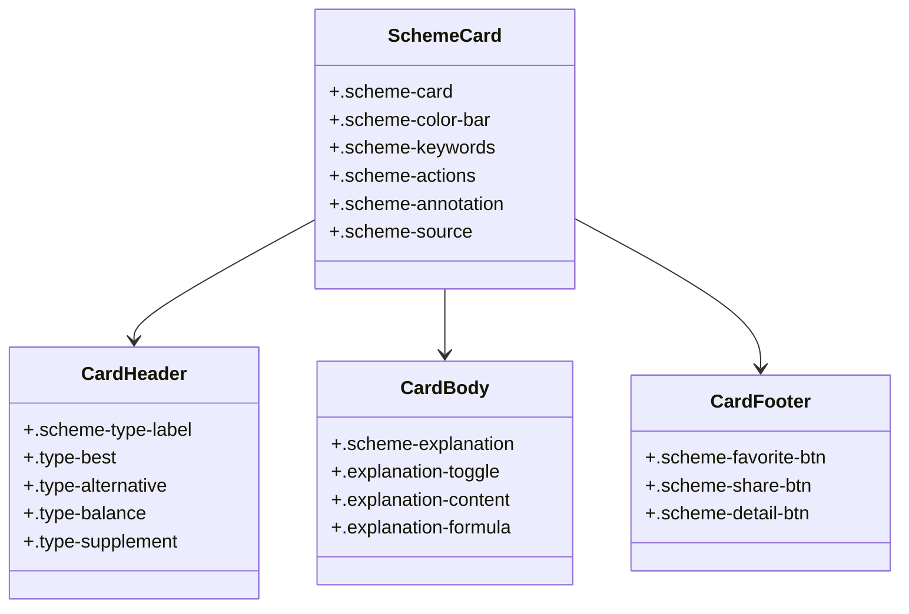

**图表来源**
- [components.css](file://css/components.css#L244-L467)

卡片系统的特性：
- **类型标识**：四种不同的方案类型，对应不同的视觉标记
- **展开详情**：可折叠的解释面板，支持展开/收起动画
- **交互反馈**：收藏、分享、查看详情等操作的视觉反馈
- **响应式布局**：在不同屏幕尺寸下的自适应表现

**章节来源**
- [components.css](file://css/components.css#L244-L467)

### 模态框系统

模态框提供了弹窗交互的基础组件：

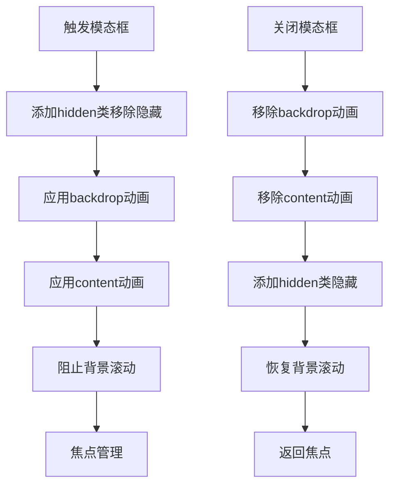

**图表来源**
- [components.css](file://css/components.css#L879-L933)

模态框的扩展能力：
- **内容区域**：灵活的头部、主体、底部结构
- **动画系统**：淡入、缩放等组合动画效果
- **无障碍支持**：ARIA属性、键盘导航、焦点管理
- **响应式适配**：在移动设备上的特殊处理

**章节来源**
- [components.css](file://css/components.css#L879-L933)

### 表单组件系统

表单组件提供了完整的表单控件集合：

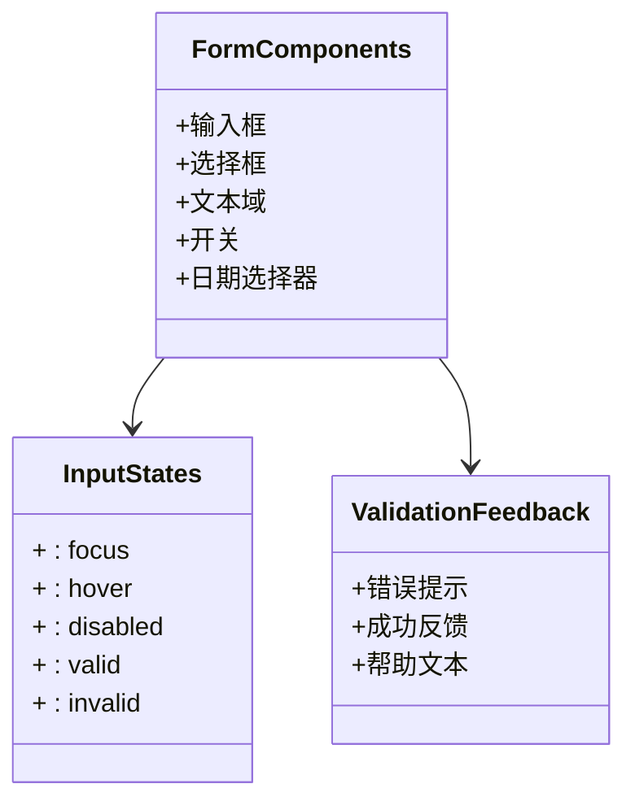

**图表来源**
- [main.css](file://css/main.css#L197-L237)

表单组件的特点：
- **一致性设计**：统一的边框、圆角、阴影风格
- **状态反馈**：完整的交互状态和视觉反馈
- **无障碍支持**：完整的键盘导航和屏幕阅读器支持
- **响应式适配**：在移动设备上的优化表现

**章节来源**
- [main.css](file://css/main.css#L197-L237)

## 依赖关系分析

样式系统的依赖关系体现了清晰的层次结构：

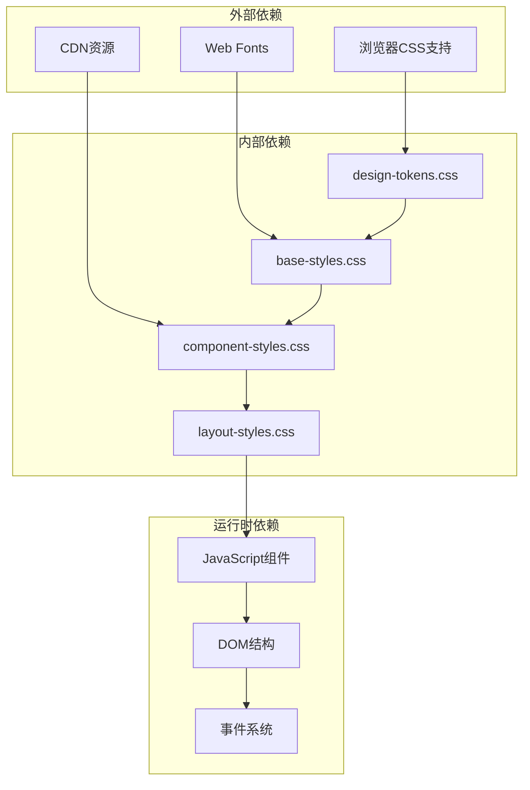

**图表来源**
- [index.html](file://index.html#L9-L15)
- [app.js](file://js/core/app.js#L1-L31)

**章节来源**
- [index.html](file://index.html#L9-L15)
- [app.js](file://js/core/app.js#L1-L31)

## 性能考虑

### CSS变量优化

项目充分利用CSS变量系统提升性能和维护性：

- **减少重复**：通过变量统一管理颜色、间距、字体等设计元素
- **动态切换**：支持主题的快速切换而无需重新编译样式
- **计算优化**：浏览器原生支持CSS变量，避免JavaScript计算开销

### 动画性能

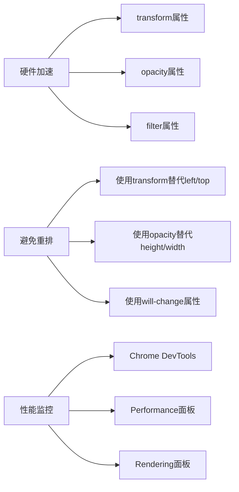

**图表来源**
- [main.css](file://css/main.css#L302-L390)

### 响应式优化

项目采用移动优先的设计策略：

- **断点设计**：预定义的断点值，支持常见的设备尺寸
- **渐进增强**：从基础样式开始，逐步添加复杂效果
- **媒体查询**：合理的媒体查询使用，避免过度嵌套

## 故障排除指南

### 常见问题诊断

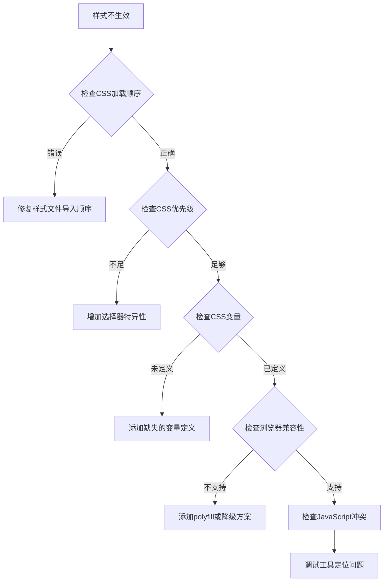

### 调试工具推荐

- **Chrome DevTools**：Elements面板检查样式继承和覆盖
- **Performance面板**：分析动画和重绘性能
- **Rendering面板**：查看CSS变量和动画状态
- **Network面板**：检查样式文件加载情况

**章节来源**
- [main.css](file://css/main.css#L494-L503)

## 结论

本样式扩展指南为"五行穿搭建议"项目提供了完整的CSS架构扩展策略。通过设计令牌系统、模块化样式组织、BEM命名规范和组件样式隔离，项目实现了高度可维护和可扩展的样式架构。

关键优势总结：
- **统一的设计语言**：通过CSS变量系统确保视觉一致性
- **灵活的主题定制**：支持动态主题切换和个性化配置
- **良好的可维护性**：清晰的文件组织和命名规范
- **优秀的用户体验**：丰富的动画效果和无障碍支持
- **性能优化**：合理的架构设计和最佳实践

对于后续的样式扩展工作，建议遵循以下原则：
1. 优先使用设计令牌系统，避免硬编码值
2. 保持BEM命名规范的一致性
3. 重视组件样式的独立性和可复用性
4. 充分利用CSS变量实现动态主题
5. 关注性能优化和浏览器兼容性