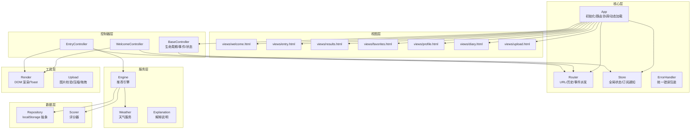
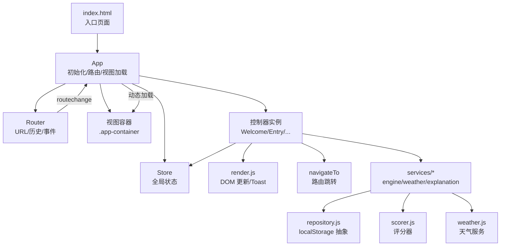
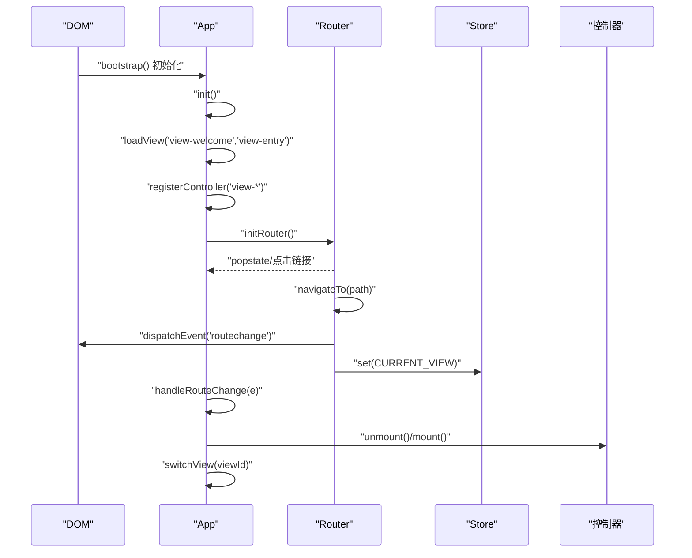
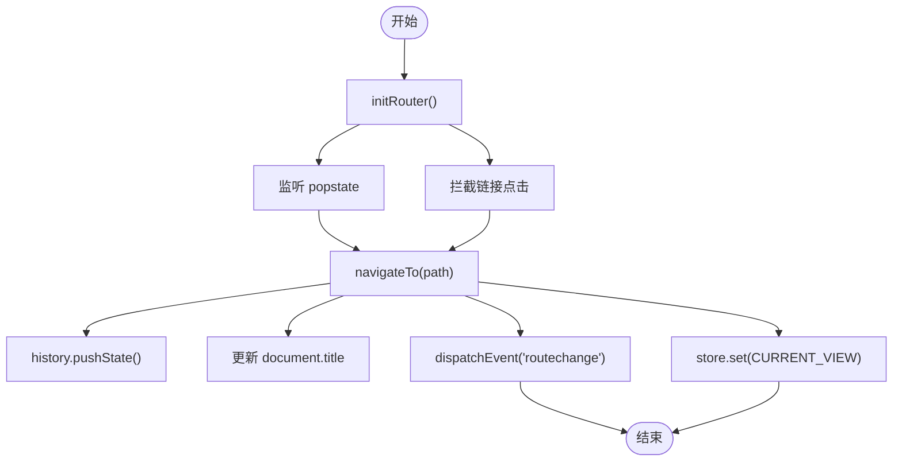
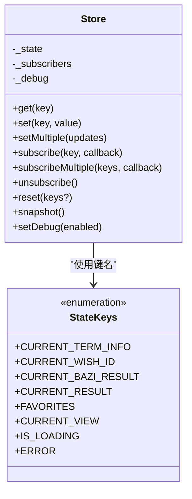
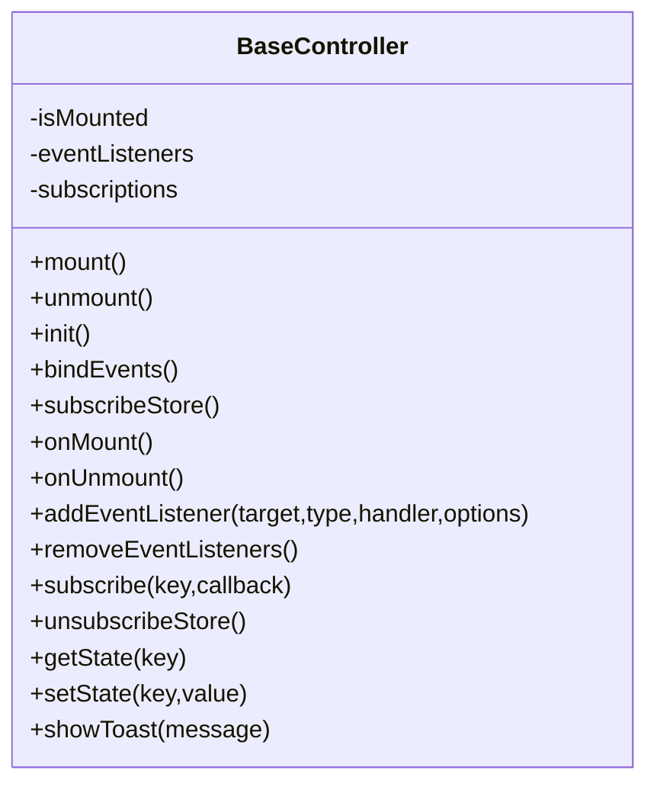
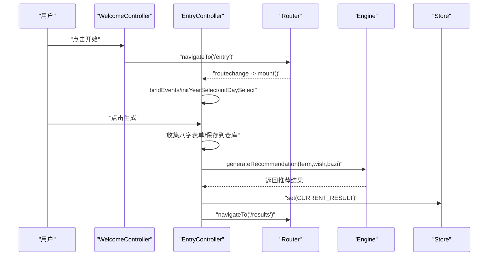
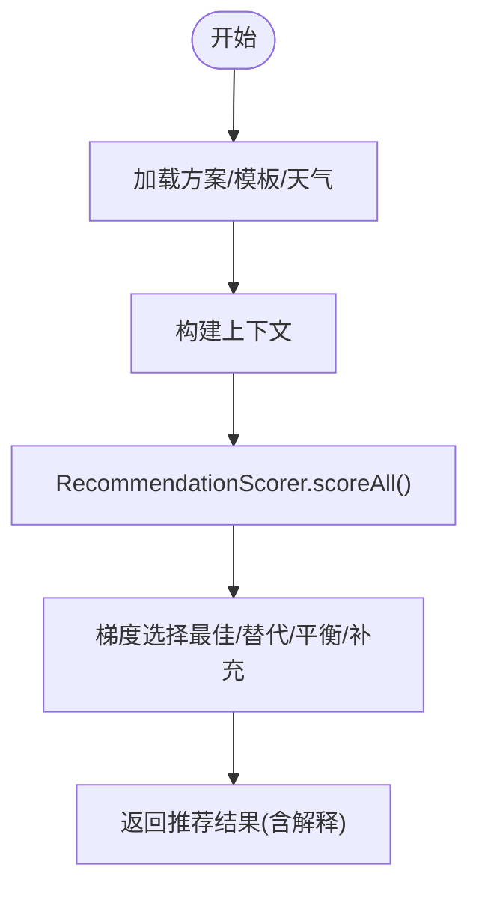
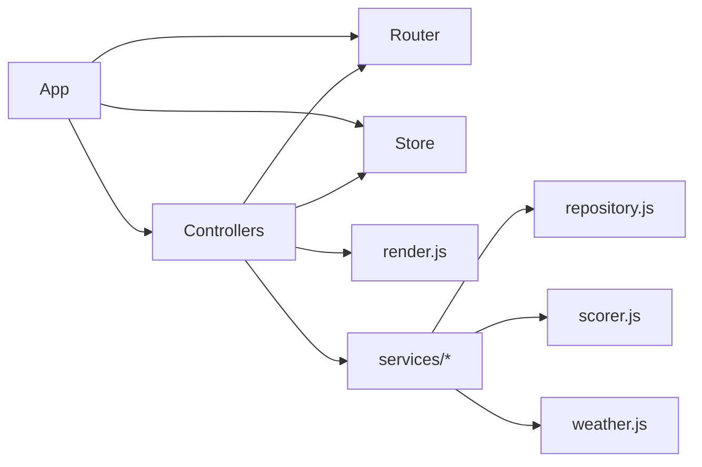

# 架构理解

<cite>
**本文引用的文件**
- [index.html](file://index.html)
- [app.js](file://js/core/app.js)
- [router.js](file://js/core/router.js)
- [store.js](file://js/core/store.js)
- [base.js（控制器基类）](file://js/controllers/base.js)
- [welcome.js](file://js/controllers/welcome.js)
- [entry.js](file://js/controllers/entry.js)
- [error-handler.js](file://js/core/error-handler.js)
- [render.js](file://js/utils/render.js)
- [engine.js](file://js/services/engine.js)
- [repository.js](file://js/data/repository.js)
- [scorer.js](file://js/core/scorer.js)
- [weather-widget.js](file://js/components/weather-widget.js)
- [upload.js](file://js/utils/upload.js)
</cite>

## 目录
1. [引言](#引言)
2. [项目结构](#项目结构)
3. [核心组件](#核心组件)
4. [架构总览](#架构总览)
5. [详细组件分析](#详细组件分析)
6. [依赖分析](#依赖分析)
7. [性能考虑](#性能考虑)
8. [故障排查指南](#故障排查指南)
9. [结论](#结论)
10. [附录](#附录)

## 引言
本指南面向希望深入理解“五行穿搭建议”项目的开发者，系统讲解其基于 MVC 的前端架构设计与实现细节。文档重点覆盖以下方面：
- MVC 模式在项目中的职责划分与交互机制
- 模块化设计原则与模块间依赖关系
- App 类作为应用入口与控制中枢的作用，包括初始化流程、路由协调与动态视图加载策略
- 控制器基类的设计理念（生命周期、事件处理、状态管理）
- 状态管理模式（Store 设计与 StateKeys 使用）
- 关键流程的序列图与时序图，帮助快速掌握架构要点

## 项目结构
项目采用按功能域划分的模块化组织方式，核心目录与职责如下：
- js/core：应用核心基础设施（App、Router、Store、错误处理、评分器）
- js/controllers：各视图对应的控制器（WelcomeController、EntryController 等）
- js/services：业务服务（推荐引擎、天气、解释说明等）
- js/data：数据仓库与存储抽象（Repository 模式）
- js/utils：通用工具（渲染、上传、分享等）
- js/components：可复用 UI 组件（如天气小组件）
- views：静态视图模板（由 App 动态加载）
- css：样式资源
- data：JSON 数据资源（节气、心愿、方案等）

**图表来源**
- [app.js](file://js/core/app.js#L1-L206)
- [router.js](file://js/core/router.js#L1-L142)
- [store.js](file://js/core/store.js#L1-L212)
- [base.js（控制器基类）](file://js/controllers/base.js#L1-L131)
- [welcome.js](file://js/controllers/welcome.js#L1-L151)
- [entry.js](file://js/controllers/entry.js#L1-L241)
- [engine.js](file://js/services/engine.js#L1-L425)
- [repository.js](file://js/data/repository.js#L1-L394)
- [scorer.js](file://js/core/scorer.js#L1-L317)
- [render.js](file://js/utils/render.js#L1-L487)
- [upload.js](file://js/utils/upload.js#L1-L145)

**章节来源**
- [index.html](file://index.html#L1-L79)
- [app.js](file://js/core/app.js#L1-L206)
- [router.js](file://js/core/router.js#L1-L142)
- [store.js](file://js/core/store.js#L1-L212)

## 核心组件
本节聚焦于 MVC 架构中的三大核心组件及其协作方式。

- 模型（Model）
  - 全局状态中心：Store 提供响应式状态与订阅机制，集中管理节气、心愿、八字、推荐结果、收藏、UI 状态等
  - 数据仓库：Repository 抽象本地存储，提供收藏、偏好、反馈、八字、统计、上传照片等能力
  - 评分器：Scorer 封装评分逻辑，支持权重动态调整与缓存，便于测试与复用
  - 业务服务：Engine 负责推荐生成，整合天气、八字、场景、心愿、历史偏好与运势等上下文

- 视图（View）
  - 静态模板：views/*.html 由 App 动态加载并插入 .app-container
  - 渲染工具：render.js 负责 DOM 更新、Toast、模态框、卡片渲染等

- 控制器（Controller）
  - BaseController：统一生命周期（mount/unmount）、事件绑定/解绑、Store 订阅/取消订阅、状态读写
  - 各视图控制器：WelcomeController、EntryController 等负责具体视图的事件绑定、状态读取与导航

**章节来源**
- [store.js](file://js/core/store.js#L1-L212)
- [repository.js](file://js/data/repository.js#L1-L394)
- [scorer.js](file://js/core/scorer.js#L1-L317)
- [engine.js](file://js/services/engine.js#L1-L425)
- [base.js（控制器基类）](file://js/controllers/base.js#L1-L131)
- [welcome.js](file://js/controllers/welcome.js#L1-L151)
- [entry.js](file://js/controllers/entry.js#L1-L241)
- [render.js](file://js/utils/render.js#L1-L487)

## 架构总览
下面的架构图展示了从入口到视图、控制器、服务与数据层的整体交互路径。

**图表来源**
- [index.html](file://index.html#L1-L79)
- [app.js](file://js/core/app.js#L1-L206)
- [router.js](file://js/core/router.js#L1-L142)
- [store.js](file://js/core/store.js#L1-L212)
- [base.js（控制器基类）](file://js/controllers/base.js#L1-L131)
- [render.js](file://js/utils/render.js#L1-L487)
- [engine.js](file://js/services/engine.js#L1-L425)
- [repository.js](file://js/data/repository.js#L1-L394)
- [scorer.js](file://js/core/scorer.js#L1-L317)

## 详细组件分析

### App 类：应用初始化、路由协调与动态视图加载
- 初始化流程
  - 初始化全局错误处理器
  - 获取应用容器 .app-container
  - 预加载首屏视图（welcome、entry）
  - 注册首屏控制器
  - 监听路由变化事件 routechange
  - 加载基础数据（节气信息），写入 Store
  - 初始化 Router
  - 初始化统计（访问次数）

- 路由协调
  - 监听 popstate 与链接点击，调用 navigateTo
  - navigateTo 内部更新浏览器历史、标题，派发 routechange，并更新 Store.currentView

- 动态视图加载
  - loadView：按需拉取 views/*.html，插入到 .app-container
  - registerController：为视图创建控制器实例
  - handleRouteChange：卸载旧控制器、挂载新控制器、切换视图显示

- 导航
  - 提供 app.navigate，内部调用 navigateTo

**图表来源**
- [app.js](file://js/core/app.js#L47-L193)
- [router.js](file://js/core/router.js#L25-L79)
- [store.js](file://js/core/store.js#L78-L81)

**章节来源**
- [app.js](file://js/core/app.js#L1-L206)
- [router.js](file://js/core/router.js#L1-L142)
- [store.js](file://js/core/store.js#L1-L212)

### 路由系统：Router 模块
- 路由配置：ROUTES 映射路径到视图与标题
- 初始化：监听 popstate、初始路径处理、拦截链接点击
- 导航：navigateTo 更新历史、标题、派发 routechange、更新 Store.currentView
- 工具：获取当前路由、校验有效性、返回上一页、生成路由链接

**图表来源**
- [router.js](file://js/core/router.js#L25-L79)

**章节来源**
- [router.js](file://js/core/router.js#L1-L142)

### 状态管理：Store 与 StateKeys
- Store 设计
  - 响应式状态：通过 Proxy 拦截 set，仅在值真正变化时触发通知
  - 订阅机制：subscribe/subscribeMultiple，返回取消订阅函数
  - 批量设置：setMultiple
  - 重置：reset(keys?) 支持局部重置
  - 调试：snapshot、setDebug

- StateKeys
  - 统一枚举状态键：CURRENT_TERM_INFO、CURRENT_WISH_ID、CURRENT_BAZI_RESULT、CURRENT_RESULT、FAVORITES、CURRENT_VIEW、IS_LOADING、ERROR
  - 避免魔法字符串，提升可维护性

- 使用方式
  - 控制器通过 getState/ setState 读写 Store
  - Router 在导航时更新 CURRENT_VIEW
  - App 在初始化时写入节气信息

**图表来源**
- [store.js](file://js/core/store.js#L30-L187)
- [store.js](file://js/core/store.js#L193-L202)

**章节来源**
- [store.js](file://js/core/store.js#L1-L212)

### 控制器基类：生命周期、事件与状态
- 生命周期
  - mount：初始化、订阅 Store、绑定事件、调用 onMount
  - unmount：卸载前回调、取消订阅、移除事件监听
- 事件管理
  - addEventListener/removeEventListeners 统一管理
- 状态管理
  - subscribe/unsubscribeStore 与 Store 订阅联动
  - getState/ setState 便捷方法
- 工具
  - showToast 通过全局事件派发 Toast

**图表来源**
- [base.js（控制器基类）](file://js/controllers/base.js#L11-L131)

**章节来源**
- [base.js（控制器基类）](file://js/controllers/base.js#L1-L131)

### 视图控制器示例：WelcomeController 与 EntryController
- WelcomeController
  - onMount：动态获取容器、绑定事件、渲染节气横幅
  - 渲染节气信息：图标、名称、描述、五行标签、宜穿颜色
  - 事件：开始按钮导航到 /entry

- EntryController
  - onMount：初始化年月日选择器、恢复上次八字、初始化天气小组件
  - 事件：场景选择、心愿选择、精度切换、生成推荐
  - 生成流程：收集八字表单、保存到仓库、调用推荐引擎、写入 Store、导航到结果页、更新统计

**图表来源**
- [welcome.js](file://js/controllers/welcome.js#L13-L151)
- [entry.js](file://js/controllers/entry.js#L14-L241)
- [router.js](file://js/core/router.js#L57-L79)
- [engine.js](file://js/services/engine.js#L323-L393)
- [store.js](file://js/core/store.js#L78-L81)

**章节来源**
- [welcome.js](file://js/controllers/welcome.js#L1-L151)
- [entry.js](file://js/controllers/entry.js#L1-L241)

### 推荐引擎：Engine 与评分器 Scorer
- Engine
  - 并行加载方案、心愿模板、八字模板
  - 构建上下文：节气、心愿、八字、天气、场景偏好、今日运势
  - 使用 RecommendationScorer 批量评分并梯度选择方案
  - 返回包含解释信息的结果

- Scorer
  - scoreAll 对方案批量评分并排序
  - score 计算各项维度得分（节气、八字、场景、天气、心愿、历史、运势）
  - 缓存计算结果，减少重复开销

**图表来源**
- [engine.js](file://js/services/engine.js#L323-L393)
- [scorer.js](file://js/core/scorer.js#L266-L276)

**章节来源**
- [engine.js](file://js/services/engine.js#L1-L425)
- [scorer.js](file://js/core/scorer.js#L1-L317)

### 组件与工具：天气小组件与渲染工具
- 天气小组件 WeatherWidget
  - 继承组件基类，封装状态、渲染、事件绑定
  - 支持自动定位与手动城市选择，展示天气、建议与预报
  - 在 EntryController 中作为子组件挂载

- 渲染工具 render.js
  - showView、renderSolarBanner、renderResultHeader、renderSchemeCards
  - showToast、模态框显示/隐藏、收藏列表渲染
  - 与控制器配合进行视图更新

**章节来源**
- [weather-widget.js](file://js/components/weather-widget.js#L1-L215)
- [render.js](file://js/utils/render.js#L1-L487)

### 数据仓库与错误处理
- Repository
  - BaseRepository 抽象存储读写
  - Favorites/Preferences/Feedback/Bazi/Stats/Outfit 等专用仓库
  - 统一封装安全存储（withErrorHandler.safeStorage）

- ErrorHandler
  - withErrorHandler 包装异步函数，统一错误类型与提示
  - AppError、safeFetch、safeJsonParse、safeStorage
  - initGlobalErrorHandler 捕获未处理异常与 Promise 拒绝

**章节来源**
- [repository.js](file://js/data/repository.js#L1-L394)
- [error-handler.js](file://js/core/error-handler.js#L1-L190)

## 依赖分析
- 模块耦合与内聚
  - App 与 Router、Store、控制器之间存在强耦合，但通过事件与接口解耦
  - 控制器对 Store 与 Router 的依赖清晰，遵循单一职责
  - Engine 与 Scorer、Repository、Weather 服务松耦合，通过参数注入上下文

- 外部依赖与集成点
  - fetch 与 JSON 解析通过 ErrorHandler.safeFetch/safeJsonParse 统一处理
  - Service Worker 注册在 index.html 中，与应用无直接 JS 依赖

**图表来源**
- [app.js](file://js/core/app.js#L6-L21)
- [router.js](file://js/core/router.js#L6-L7)
- [store.js](file://js/core/store.js#L7-L8)
- [engine.js](file://js/services/engine.js#L6-L9)
- [repository.js](file://js/data/repository.js#L6-L41)
- [scorer.js](file://js/core/scorer.js#L6-L12)
- [render.js](file://js/utils/render.js#L5-L8)

**章节来源**
- [app.js](file://js/core/app.js#L1-L206)
- [router.js](file://js/core/router.js#L1-L142)
- [store.js](file://js/core/store.js#L1-L212)
- [engine.js](file://js/services/engine.js#L1-L425)
- [repository.js](file://js/data/repository.js#L1-L394)
- [scorer.js](file://js/core/scorer.js#L1-L317)
- [render.js](file://js/utils/render.js#L1-L487)

## 性能考虑
- 按需加载与懒执行
  - App 预加载首屏视图，其余视图按需 loadView，减少初始负载
  - Scorer 使用 Map 缓存评分结果，避免重复计算
- 状态更新最小化
  - Store 仅在值真正变化时触发订阅回调，降低无效渲染
- I/O 优化
  - ErrorHandler.safeFetch 设置超时，避免长时间阻塞
  - Repository 使用安全存储封装，减少异常导致的崩溃

[本节为通用指导，无需特定文件分析]

## 故障排查指南
- 全局错误捕获
  - initGlobalErrorHandler 捕获未处理 Promise 拒绝与全局错误，统一显示提示
- 错误包装与日志
  - withErrorHandler 包装异步函数，输出 AppError，包含类型、时间戳与原始错误
- 常见问题定位
  - 网络请求失败：检查 safeFetch 与 HTTP 状态码
  - 数据解析异常：检查 safeJsonParse 与数据格式
  - 存储失败：检查 safeStorage 与浏览器隐私模式/配额限制

**章节来源**
- [error-handler.js](file://js/core/error-handler.js#L168-L190)
- [error-handler.js](file://js/core/error-handler.js#L45-L79)
- [error-handler.js](file://js/core/error-handler.js#L101-L133)
- [error-handler.js](file://js/core/error-handler.js#L153-L163)

## 结论
本项目以 MVC 为核心，结合模块化设计与清晰的职责边界，实现了从路由、状态管理到业务服务与数据仓库的完整前端架构。App 作为控制中枢，协调 Router、Store 与控制器；控制器通过 BaseController 统一生命周期与状态管理；Engine 与 Scorer 将复杂评分逻辑模块化；Repository 与 ErrorHandler 提供稳定的数据与错误处理能力。该架构具备良好的可维护性与扩展性，适合进一步引入组件化 UI 与更细粒度的服务拆分。

[本节为总结，无需特定文件分析]

## 附录
- 入口与脚本加载
  - index.html 通过 module 脚本加载 App.bootstrap，启动应用
- 视图与容器
  - App 将动态加载的视图插入 .app-container，控制器通过容器 ID 获取视图元素

**章节来源**
- [index.html](file://index.html#L58-L61)
- [app.js](file://js/core/app.js#L52-L56)