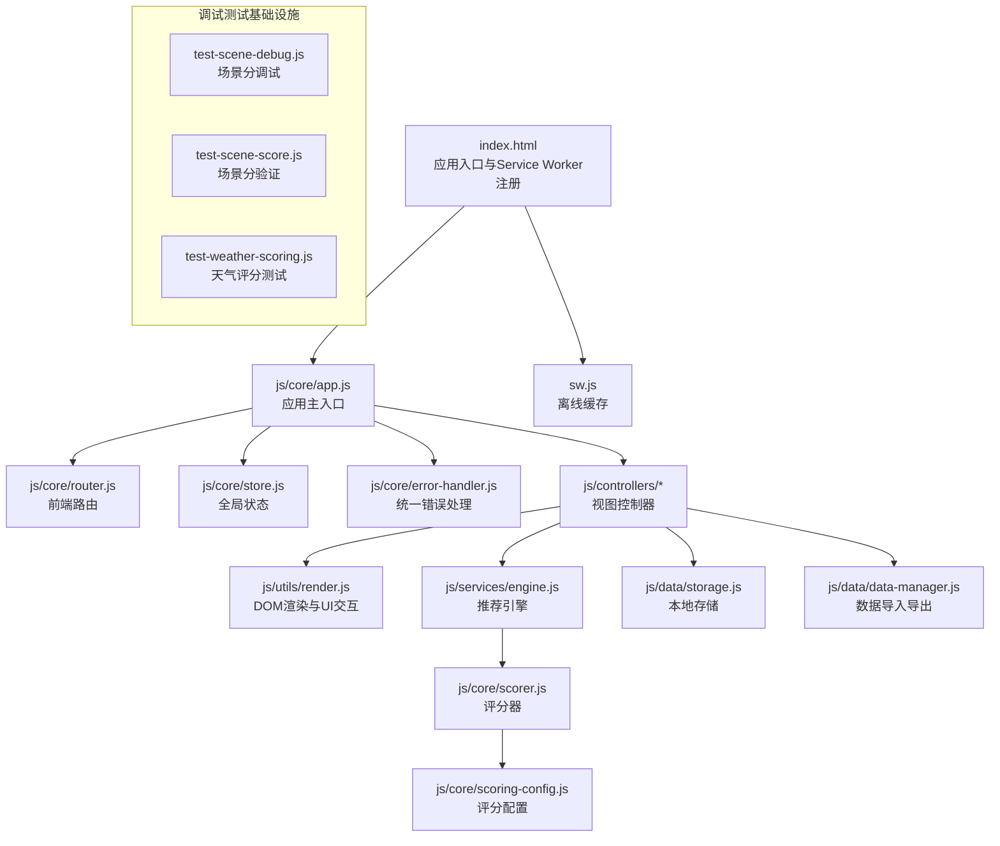
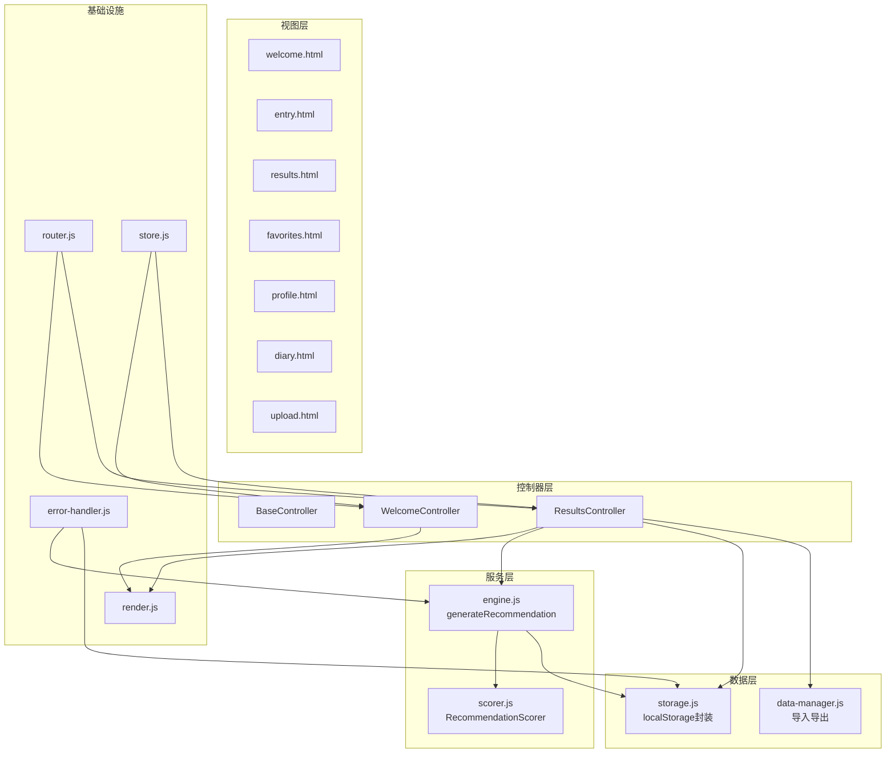
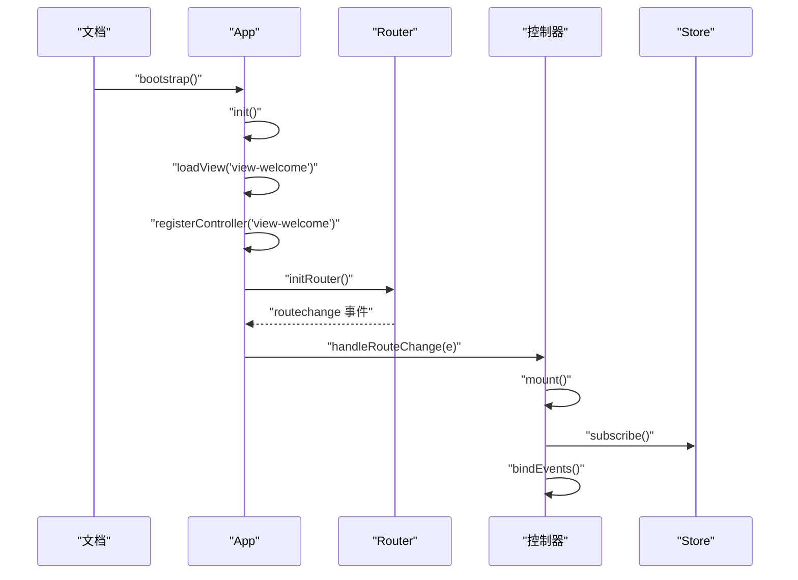
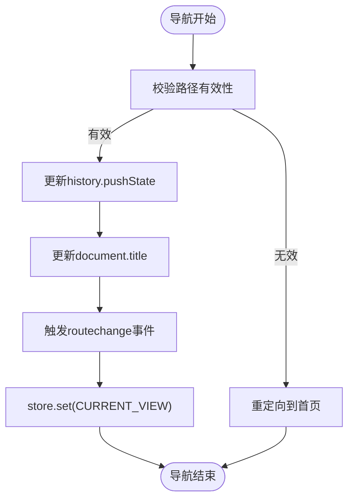
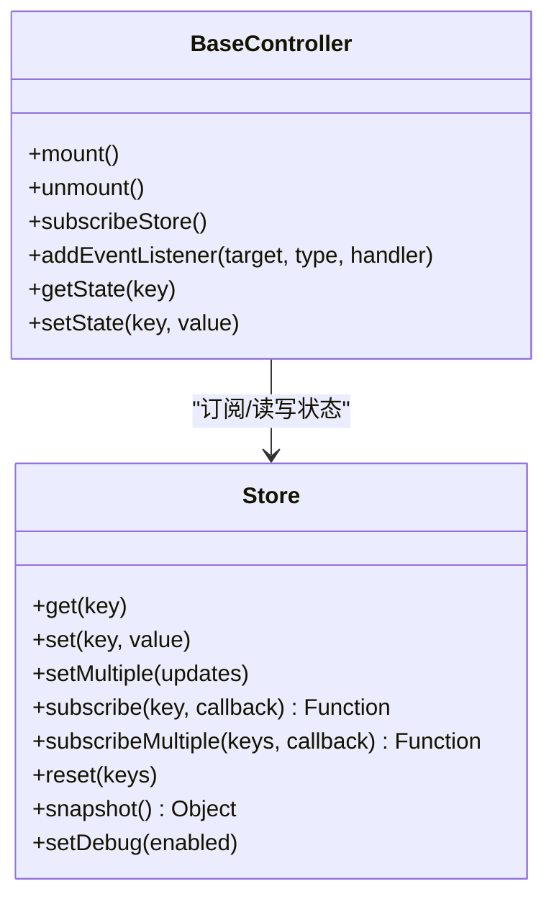
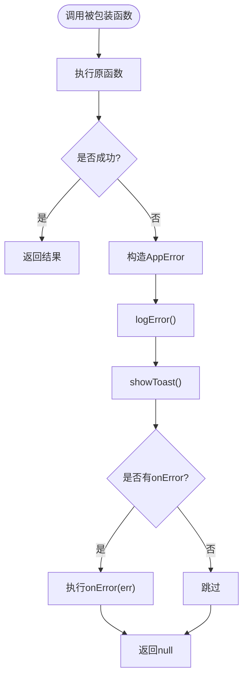
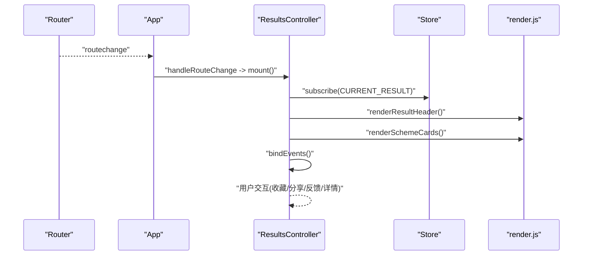
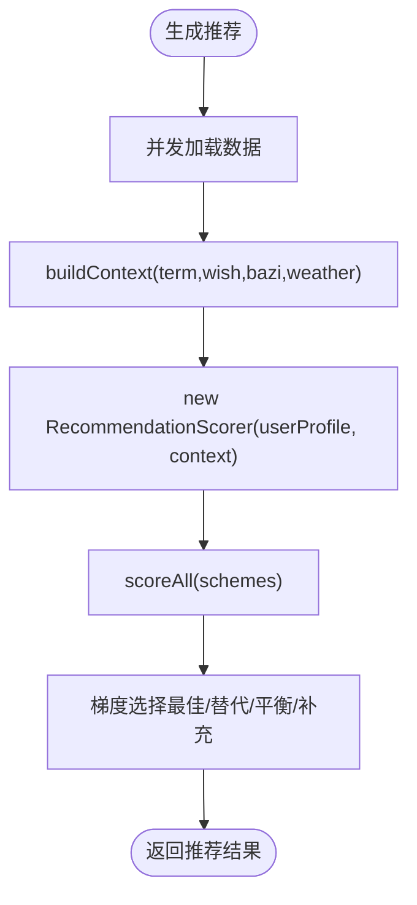
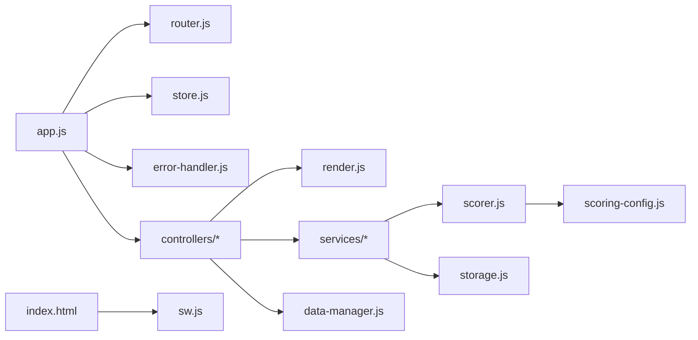

# 测试与调试

<cite>
**本文引用的文件**
- [index.html](file://index.html)
- [sw.js](file://sw.js)
- [js/core/app.js](file://js/core/app.js)
- [js/core/router.js](file://js/core/router.js)
- [js/core/store.js](file://js/core/store.js)
- [js/core/error-handler.js](file://js/core/error-handler.js)
- [js/core/scorer.js](file://js/core/scorer.js)
- [js/core/scoring-config.js](file://js/core/scoring-config.js)
- [js/controllers/base.js](file://js/controllers/base.js)
- [js/controllers/welcome.js](file://js/controllers/welcome.js)
- [js/controllers/results.js](file://js/controllers/results.js)
- [js/utils/render.js](file://js/utils/render.js)
- [js/data/storage.js](file://js/data/storage.js)
- [js/data/data-manager.js](file://js/data/data-manager.js)
- [js/services/engine.js](file://js/services/engine.js)
- [test-scene-debug.js](file://test-scene-debug.js)
- [test-scene-score.js](file://test-scene-score.js)
- [test-weather-scoring.js](file://test-weather-scoring.js)
</cite>

## 目录
1. [简介](#简介)
2. [项目结构](#项目结构)
3. [核心组件](#核心组件)
4. [架构总览](#架构总览)
5. [详细组件分析](#详细组件分析)
6. [依赖分析](#依赖分析)
7. [性能考虑](#性能考虑)
8. [故障排查指南](#故障排查指南)
9. [新增调试测试基础设施](#新增调试测试基础设施)
10. [结论](#结论)
11. [附录](#附录)

## 简介
本指南面向前端开发者，围绕该多视图单页应用建立完善的测试与调试体系。文档涵盖单元测试方法（测试用例设计、Mock 对象、断言策略）、集成测试方案（组件交互、API 集成、端到端测试）、调试工具与技巧（浏览器开发者工具、控制台调试、断点调试）、错误监控与日志记录（错误捕获、异常上报、调试信息收集）、性能测试策略（加载性能、内存泄漏检测、用户体验评估）以及具体测试与调试案例，帮助快速掌握测试与调试技能。

**更新** 新增调试测试基础设施章节，包含场景调试、评分测试、天气评分测试等专用测试文件，提供专门的调试和验证工具。

## 项目结构
该项目采用模块化组织，核心模块包括应用入口、路由、状态管理、错误处理、控制器层、服务层、数据层与工具层。页面通过 Service Worker 提供离线缓存能力，视图通过动态加载方式按需渲染。

**图表来源**
- [index.html](file://index.html#L58-L76)
- [js/core/app.js](file://js/core/app.js#L1-L206)
- [js/core/router.js](file://js/core/router.js#L1-L142)
- [js/core/store.js](file://js/core/store.js#L1-L212)
- [js/core/error-handler.js](file://js/core/error-handler.js#L1-L190)
- [js/controllers/base.js](file://js/controllers/base.js#L1-L131)
- [js/utils/render.js](file://js/utils/render.js#L1-L487)
- [js/services/engine.js](file://js/services/engine.js#L1-L425)
- [js/core/scorer.js](file://js/core/scorer.js#L1-L317)
- [js/core/scoring-config.js](file://js/core/scoring-config.js)
- [js/data/storage.js](file://js/data/storage.js#L1-L145)
- [js/data/data-manager.js](file://js/data/data-manager.js#L1-L376)
- [sw.js](file://sw.js#L1-L165)
- [test-scene-debug.js](file://test-scene-debug.js#L1-L103)
- [test-scene-score.js](file://test-scene-score.js#L1-L64)
- [test-weather-scoring.js](file://test-weather-scoring.js#L1-L170)

**章节来源**
- [index.html](file://index.html#L1-L79)
- [sw.js](file://sw.js#L1-L165)
- [js/core/app.js](file://js/core/app.js#L1-L206)

## 核心组件
- 应用入口与生命周期：负责初始化错误处理、路由、基础数据加载、视图预加载与切换。
- 路由系统：拦截链接点击、处理浏览器前进后退、维护当前路由状态并广播变更事件。
- 全局状态：集中管理节气、用户输入、推荐结果、收藏列表、UI 状态与错误信息。
- 错误处理：统一包装异步函数、安全的 fetch/JSON 解析/本地存储、全局未处理异常捕获。
- 控制器层：每个视图对应一个控制器，负责挂载/卸载、事件绑定、状态订阅与业务交互。
- 推荐引擎：加载数据、构建上下文、评分器打分、梯度选择方案。
- 渲染工具：视图切换、Toast 提示、模态框、卡片渲染、解释卡片生成。
- 数据与存储：本地存储封装、数据导入导出、数据概览与清理。

**章节来源**
- [js/core/app.js](file://js/core/app.js#L36-L196)
- [js/core/router.js](file://js/core/router.js#L25-L141)
- [js/core/store.js](file://js/core/store.js#L30-L187)
- [js/core/error-handler.js](file://js/core/error-handler.js#L45-L189)
- [js/controllers/base.js](file://js/controllers/base.js#L11-L130)
- [js/services/engine.js](file://js/services/engine.js#L323-L393)
- [js/utils/render.js](file://js/utils/render.js#L13-L486)
- [js/data/storage.js](file://js/data/storage.js#L9-L144)
- [js/data/data-manager.js](file://js/data/data-manager.js#L48-L184)

## 架构总览
应用采用 MVC 架构：控制器负责业务逻辑与事件处理，模型为状态与数据（本地存储、仓库），视图通过渲染工具输出。路由驱动视图切换，状态驱动 UI 更新，错误处理贯穿各模块。

**图表来源**
- [js/core/router.js](file://js/core/router.js#L9-L17)
- [js/controllers/base.js](file://js/controllers/base.js#L11-L130)
- [js/controllers/welcome.js](file://js/controllers/welcome.js#L13-L150)
- [js/controllers/results.js](file://js/controllers/results.js#L13-L613)
- [js/services/engine.js](file://js/services/engine.js#L323-L393)
- [js/core/scorer.js](file://js/core/scorer.js#L14-L316)
- [js/data/storage.js](file://js/data/storage.js#L9-L144)
- [js/data/data-manager.js](file://js/data/data-manager.js#L48-L184)
- [js/utils/render.js](file://js/utils/render.js#L13-L486)
- [js/core/store.js](file://js/core/store.js#L30-L187)
- [js/core/error-handler.js](file://js/core/error-handler.js#L45-L189)

## 详细组件分析

### 应用主入口与生命周期
- 初始化流程：注册全局错误处理器、预加载首屏视图、注册控制器、监听路由变化、加载基础数据、初始化路由、统计标记。
- 视图加载：按需加载 HTML，插入到容器，记录已加载集合。
- 路由变化处理：卸载当前控制器、注册/挂载目标控制器、切换视图显示。
- 导航：封装路由跳转。

**图表来源**
- [js/core/app.js](file://js/core/app.js#L47-L192)
- [js/core/router.js](file://js/core/router.js#L25-L79)
- [js/controllers/base.js](file://js/controllers/base.js#L21-L42)

**章节来源**
- [js/core/app.js](file://js/core/app.js#L36-L196)

### 路由系统
- 路由配置：路径到视图与标题映射。
- 初始化：监听 popstate、处理初始路径、拦截链接点击。
- 导航：更新历史、标题、触发自定义事件、更新 Store。

**图表来源**
- [js/core/router.js](file://js/core/router.js#L57-L79)

**章节来源**
- [js/core/router.js](file://js/core/router.js#L25-L141)

### 全局状态管理
- 响应式状态：Proxy 包装，变更时通知订阅者。
- 订阅机制：支持单键/多键订阅，返回取消函数。
- 调试与重置：快照、重置、调试开关。

**图表来源**
- [js/core/store.js](file://js/core/store.js#L30-L187)
- [js/controllers/base.js](file://js/controllers/base.js#L92-L120)

**章节来源**
- [js/core/store.js](file://js/core/store.js#L30-L212)
- [js/controllers/base.js](file://js/controllers/base.js#L11-L130)

### 错误处理与安全包装
- 统一错误类与类型映射。
- 包装异步函数 withErrorHandler：捕获错误、记录日志、显示提示、执行回调。
- 安全 fetch/JSON/Storage：超时、HTTP 错误、存储异常转换为应用错误。
- 全局错误监听：未处理 Promise 与全局错误。

**图表来源**
- [js/core/error-handler.js](file://js/core/error-handler.js#L45-L79)
- [js/core/error-handler.js](file://js/core/error-handler.js#L84-L92)

**章节来源**
- [js/core/error-handler.js](file://js/core/error-handler.js#L28-L189)

### 控制器基类与结果页控制器
- BaseController：生命周期钩子、事件绑定/解绑、状态订阅/取消、Toast 事件派发。
- ResultsController：渲染运势卡片、天气影响、收藏/分享/反馈、详情模态框、换一批占位。

**图表来源**
- [js/controllers/base.js](file://js/controllers/base.js#L21-L103)
- [js/controllers/results.js](file://js/controllers/results.js#L20-L46)
- [js/utils/render.js](file://js/utils/render.js#L109-L132)

**章节来源**
- [js/controllers/base.js](file://js/controllers/base.js#L11-L130)
- [js/controllers/results.js](file://js/controllers/results.js#L13-L613)
- [js/utils/render.js](file://js/utils/render.js#L109-L132)

### 推荐引擎与评分器
- generateRecommendation：并发加载方案/心愿/八字模板；构建上下文；评分器打分；梯度选择方案。
- RecommendationScorer：按维度（节气、八字、场景、天气、心愿、历史、运势）加权评分，支持解释生成与批量排序。

**图表来源**
- [js/services/engine.js](file://js/services/engine.js#L323-L393)
- [js/core/scorer.js](file://js/core/scorer.js#L266-L276)

**章节来源**
- [js/services/engine.js](file://js/services/engine.js#L323-L421)
- [js/core/scorer.js](file://js/core/scorer.js#L14-L316)

### 渲染与用户交互
- 视图切换、Toast、模态框、方案卡片渲染、解释卡片生成、详情模态框。
- 事件委托与展开/收起逻辑。

**章节来源**
- [js/utils/render.js](file://js/utils/render.js#L13-L486)

### 本地存储与数据管理
- storage.js：统一前缀封装 localStorage 的 get/set/remove/clear。
- data-manager.js：导出/导入 JSON、验证版本与结构、预览导入、清理数据、数据概览与格式化。

**章节来源**
- [js/data/storage.js](file://js/data/storage.js#L9-L144)
- [js/data/data-manager.js](file://js/data/data-manager.js#L48-L284)

## 依赖分析
- 模块耦合：控制器依赖路由、状态、渲染工具；服务层依赖错误处理与数据层；评分器依赖配置。
- 外部依赖：Service Worker 提供离线缓存；CDN 字体资源；浏览器特性（Web Share API、Service Worker）。
- 潜在循环依赖：当前结构以单向依赖为主，控制器依赖基础模块，服务层依赖基础模块，未见明显循环。

**图表来源**
- [js/core/app.js](file://js/core/app.js#L6-L21)
- [js/core/router.js](file://js/core/router.js#L6)
- [js/core/store.js](file://js/core/store.js#L6)
- [js/core/error-handler.js](file://js/core/error-handler.js#L5)
- [js/utils/render.js](file://js/utils/render.js#L5-L8)
- [js/services/engine.js](file://js/services/engine.js#L6-L9)
- [js/core/scorer.js](file://js/core/scorer.js#L6-L12)
- [js/data/storage.js](file://js/data/storage.js#L5)
- [js/data/data-manager.js](file://js/data/data-manager.js#L6)
- [index.html](file://index.html#L58-L76)
- [sw.js](file://sw.js#L5-L47)

**章节来源**
- [js/core/app.js](file://js/core/app.js#L6-L21)
- [js/core/router.js](file://js/core/router.js#L6)
- [js/core/store.js](file://js/core/store.js#L6)
- [js/core/error-handler.js](file://js/core/error-handler.js#L5)
- [js/utils/render.js](file://js/utils/render.js#L5-L8)
- [js/services/engine.js](file://js/services/engine.js#L6-L9)
- [js/core/scorer.js](file://js/core/scorer.js#L6-L12)
- [js/data/storage.js](file://js/data/storage.js#L5)
- [js/data/data-manager.js](file://js/data/data-manager.js#L6)
- [index.html](file://index.html#L58-L76)
- [sw.js](file://sw.js#L5-L47)

## 性能考虑
- 预加载与懒加载：首屏预加载欢迎与入口视图，其余视图按需加载，减少初始包体积。
- 缓存策略：Service Worker 预缓存核心资源，Stale-While-Revalidate 策略兼顾离线与新鲜度。
- 渲染优化：卡片渲染使用事件委托，避免重复绑定；动画延迟按序触发，提升感知流畅度。
- 状态更新：Store 使用 Proxy 响应式，仅在值变化时通知订阅者，减少不必要重渲染。
- 评分器缓存：RecommendationScorer 内部缓存计算结果，避免重复评分。

**章节来源**
- [js/core/app.js](file://js/core/app.js#L54-L60)
- [sw.js](file://sw.js#L52-L154)
- [js/utils/render.js](file://js/utils/render.js#L137-L201)
- [js/core/store.js](file://js/core/store.js#L11-L24)
- [js/core/scorer.js](file://js/core/scorer.js#L20-L22)

## 故障排查指南
- 全局错误监听：捕获未处理 Promise 与全局错误，统一显示提示并阻止默认行为。
- 错误日志：withErrorHandler 记录类型、消息、时间戳与堆栈，便于定位问题。
- 网络与存储：safeFetch/safeJsonParse/safeStorage 将底层异常转换为应用错误，明确错误类型。
- Service Worker：注册失败与激活过程的日志输出，便于排查缓存问题。
- 控制器生命周期：确保 mount/unmount 正确配对，事件监听在 onMount 后绑定并在 onUnmount 解绑。

**章节来源**
- [js/core/error-handler.js](file://js/core/error-handler.js#L168-L189)
- [js/core/error-handler.js](file://js/core/error-handler.js#L84-L92)
- [js/core/error-handler.js](file://js/core/error-handler.js#L101-L133)
- [sw.js](file://sw.js#L52-L94)
- [js/controllers/base.js](file://js/controllers/base.js#L21-L42)

## 新增调试测试基础设施

### 场景调试测试
新增的 `test-scene-debug.js` 文件提供了专门的场景评分调试功能，用于分析场景分从120分到最终显示值的变化过程。

#### 调试功能特点
- **双评分器对比**：同时测试旧版 `calculateSceneScore` 和新版 `scoreScene` 方法
- **详细分步分析**：展示五行匹配、材质匹配的具体计算过程
- **权重转换验证**：验证从原始分到显示分的转换逻辑
- **问题诊断**：帮助识别显示异常的原因

#### 关键测试场景
- **场景偏好匹配**：工作场景下土元素与棉麻材质的匹配
- **权重转换**：25%权重下的分数转换
- **异常情况排查**：显示30分而非预期25分的情况分析

**章节来源**
- [test-scene-debug.js](file://test-scene-debug.js#L1-L103)

### 场景分显示验证测试
`test-scene-score.js` 文件专注于验证场景分的显示逻辑，确保分数转换的准确性。

#### 验证内容
- **权重计算**：25%权重下的分数转换
- **四舍五入规则**：Math.round()的应用
- **边界值测试**：100分、80分、60分、40分的转换结果
- **异常情况分析**：为什么显示30分而不是25分的可能原因

#### 测试用例设计
- 原始分100 × 0.25 = 25 → Math.round(25) = 25
- 原始分120 × 0.25 = 30 → Math.round(30) = 30
- 权重0.30的假设验证

**章节来源**
- [test-scene-score.js](file://test-scene-score.js#L1-L64)

### 天气评分逻辑测试
`test-weather-scoring.js` 文件提供了完整的天气评分逻辑测试，模拟各种天气条件下的评分计算。

#### 测试场景覆盖
- **最佳组合**：夏天晴天 + 白色棉T恤（金）→ 优秀
- **不理想组合**：夏天晴天 + 红色羊毛衫（火）→ 不及格
- **平衡组合**：雨天15°C + 黄色雨衣（土）→ 良好
- **一般组合**：阴天20°C + 绿色外套（木）→ 一般
- **刚好及格**：冬天雪天-5°C + 黑色羽绒服（水）→ 刚好及格

#### 评分策略验证
- **天气五行关系**：相克（平衡能量）vs 相生（避免过旺）
- **温度调候**：温度五行与服装五行相克（调候得当）
- **材质实用性**：推荐材质列表的匹配加分
- **最佳实践总结**：天气五行克服装五行，温度五行克服装五行

**章节来源**
- [test-weather-scoring.js](file://test-weather-scoring.js#L1-L170)

### 调试测试文件的使用方法
这些调试测试文件提供了以下使用价值：

1. **独立运行**：通过 `node test-*.js` 命令独立运行
2. **逻辑验证**：验证评分算法的正确性
3. **问题定位**：快速定位显示异常的根本原因
4. **开发辅助**：为新功能开发提供测试参考

**章节来源**
- [test-scene-debug.js](file://test-scene-debug.js#L1-L103)
- [test-scene-score.js](file://test-scene-score.js#L1-L64)
- [test-weather-scoring.js](file://test-weather-scoring.js#L1-L170)

## 结论
本项目具备清晰的模块边界与良好的可测试性：控制器职责单一、服务层可独立测试、评分器逻辑可单元测试、状态与错误处理抽象明确。结合 Service Worker 的缓存策略与完善的错误监控，能够支撑稳定可靠的前端应用。

**更新** 新增的调试测试基础设施进一步增强了项目的可维护性和问题排查能力。场景调试、评分验证、天气评分测试等专用测试文件为开发者提供了强大的调试工具，能够快速定位和解决复杂的评分显示问题。

建议在现有基础上完善单元测试覆盖率、集成测试与端到端测试，并持续优化性能指标与用户体验。同时，充分利用新增的调试测试基础设施，建立更完善的测试体系。

## 附录

### 单元测试方法与示例路径
- 测试用例设计
  - 输入参数覆盖：边界值、空值、异常格式、缺失字段。
  - 输出断言：返回结构、错误类型、副作用（状态变更、DOM 更新）。
  - 异步场景：超时、网络失败、存储异常。
- Mock 对象使用
  - 使用代理或简单对象替换 fetch、localStorage、定时器。
  - 使用 Spy/Stub 记录调用次数与参数。
- 断言策略
  - 等值断言：返回值、状态值。
  - 类型断言：错误类型、DOM 节点存在性。
  - 行为断言：事件触发、订阅回调执行、缓存命中。

示例路径（不包含具体代码内容）：
- 错误处理包装函数测试
  - [withErrorHandler 包装函数](file://js/core/error-handler.js#L45-L79)
  - [safeFetch 超时与HTTP错误](file://js/core/error-handler.js#L101-L133)
  - [safeStorage 存储异常](file://js/core/error-handler.js#L153-L163)
- 评分器单元测试
  - [RecommendationScorer.scoreAll](file://js/core/scorer.js#L266-L276)
  - [RecommendationScorer.scoreSolarTerm](file://js/core/scorer.js#L81-L86)
  - [RecommendationScorer.scoreBazi](file://js/core/scorer.js#L91-L116)
  - [RecommendationScorer.scoreWeather](file://js/core/scorer.js#L152-L193)
  - [RecommendationScorer.scoreScene](file://js/core/scorer.js#L121-L147)
  - [RecommendationScorer.scoreWish](file://js/core/scorer.js#L198-L210)
  - [RecommendationScorer.scoreHistory](file://js/core/scorer.js#L215-L237)
  - [RecommendationScorer.scoreDailyLuck](file://js/core/scorer.js#L242-L259)
- 状态与控制器测试
  - [Store.subscribeMultiple](file://js/core/store.js#L118-L124)
  - [BaseController.mount/bindEvents](file://js/controllers/base.js#L21-L52)
  - [ResultsController.bindEvents](file://js/controllers/results.js#L255-L359)
- 数据与存储测试
  - [storage.js 封装](file://js/data/storage.js#L9-L27)
  - [data-manager.js 导入/导出](file://js/data/data-manager.js#L48-L184)

### 集成测试方案
- 组件间交互测试
  - 路由到控制器：模拟 popstate 与点击事件，断言控制器 mount 与事件绑定。
  - 状态订阅：断言状态变更触发 UI 更新与事件回调。
- API 集成测试
  - 推荐引擎：Mock 数据文件与评分器，断言返回结构与解释。
  - 网络与缓存：Service Worker 缓存命中与回源逻辑。
- 端到端测试
  - 页面生命周期：首屏加载、导航、收藏/分享/反馈、详情查看。
  - 离线场景：Service Worker 缓存可用性与降级提示。

示例路径（不包含具体代码内容）：
- [路由导航与事件](file://js/core/router.js#L25-L79)
- [控制器生命周期](file://js/controllers/base.js#L21-L42)
- [推荐生成流程](file://js/services/engine.js#L323-L393)
- [Service Worker 缓存策略](file://sw.js#L99-L154)

### 调试工具与技巧
- 浏览器开发者工具
  - Elements：检查视图切换与卡片渲染。
  - Console：查看错误日志与调试信息。
  - Network：观察资源缓存与回源。
  - Application：查看缓存与本地存储。
- 控制台调试
  - 在控制器与服务层关键节点添加日志，记录输入输出。
  - 使用断言与条件断点定位异常分支。
- 断点调试
  - 在路由变化、控制器挂载、评分器计算、渲染函数中设置断点。
  - 结合 DevTools 的 Call Stack 与 Watch 面板分析调用链。

**更新** 新增调试测试基础设施的使用技巧：
- **场景分调试**：使用 `test-scene-debug.js` 分析场景评分异常
- **显示逻辑验证**：使用 `test-scene-score.js` 验证分数转换规则
- **天气评分测试**：使用 `test-weather-scoring.js` 测试各种天气条件下的评分

**章节来源**
- [js/core/error-handler.js](file://js/core/error-handler.js#L84-L92)
- [sw.js](file://sw.js#L112-L154)
- [js/controllers/base.js](file://js/controllers/base.js#L21-L42)
- [js/utils/render.js](file://js/utils/render.js#L457-L486)
- [test-scene-debug.js](file://test-scene-debug.js#L1-L103)
- [test-scene-score.js](file://test-scene-score.js#L1-L64)
- [test-weather-scoring.js](file://test-weather-scoring.js#L1-L170)

### 错误监控与日志记录
- 错误捕获：全局 Promise 与错误监听，统一 AppError 类型。
- 异常上报：在日志中记录类型、消息、时间戳与堆栈。
- 调试信息收集：Store 快照、路由状态、控制器挂载状态。

**章节来源**
- [js/core/error-handler.js](file://js/core/error-handler.js#L168-L189)
- [js/core/store.js](file://js/core/store.js#L176-L178)

### 性能测试策略
- 加载性能测试
  - 首屏时间：测量首屏视图加载与控制器挂载耗时。
  - 缓存命中率：Service Worker 预缓存与 Stale-While-Revalidate。
- 内存泄漏检测
  - 控制器卸载：确认事件监听与订阅在 unmount 中移除。
  - DOM 与全局变量：避免残留引用。
- 用户体验评估
  - 卡片渲染动画与交互响应时间。
  - Toast 与模态框的显示/隐藏性能。

**章节来源**
- [js/core/app.js](file://js/core/app.js#L54-L60)
- [sw.js](file://sw.js#L52-L94)
- [js/controllers/base.js](file://js/controllers/base.js#L38-L42)
- [js/utils/render.js](file://js/utils/render.js#L137-L201)