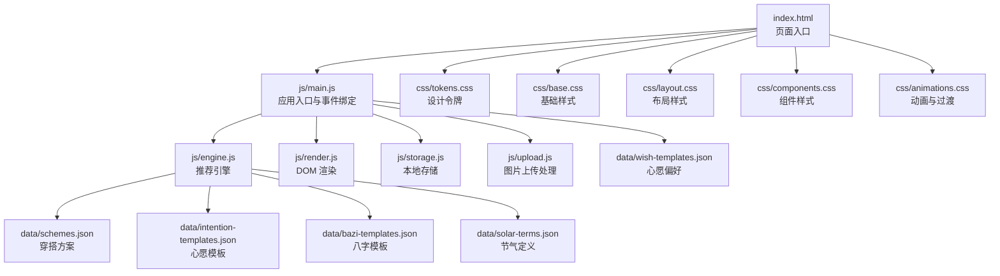
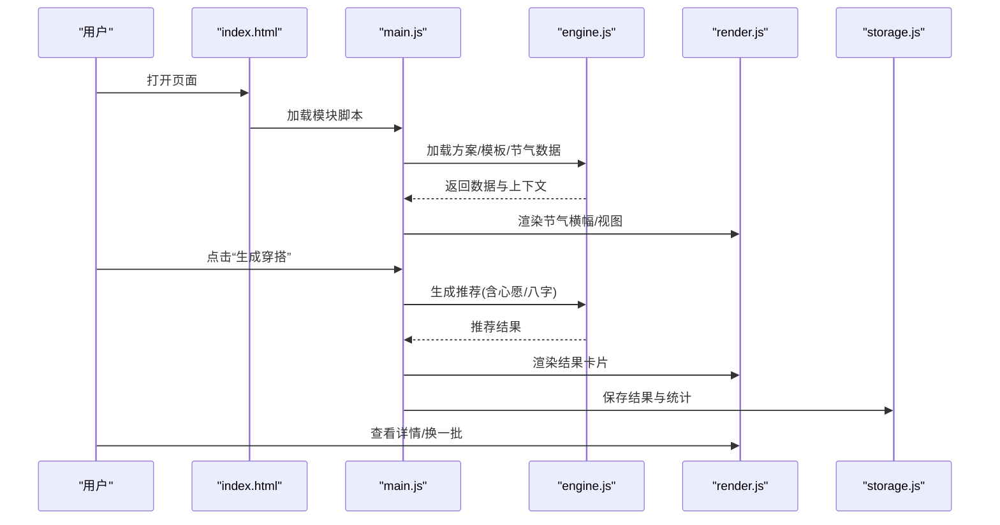
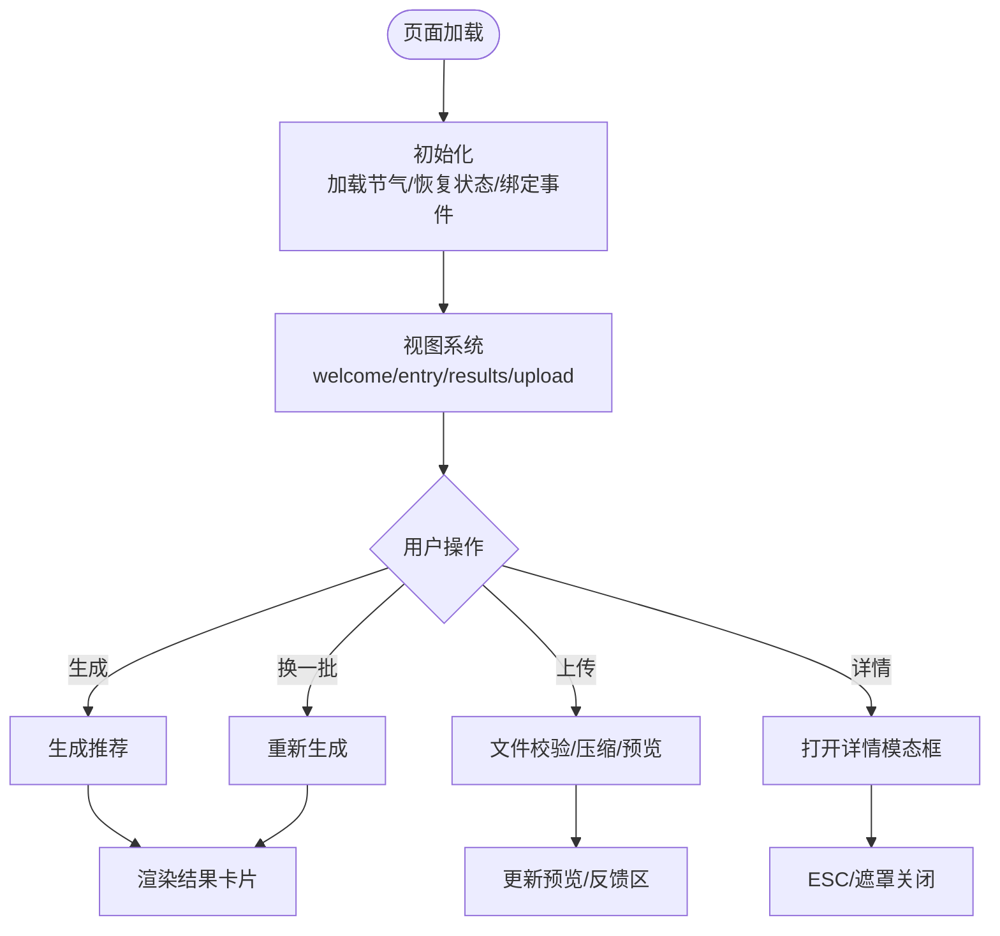
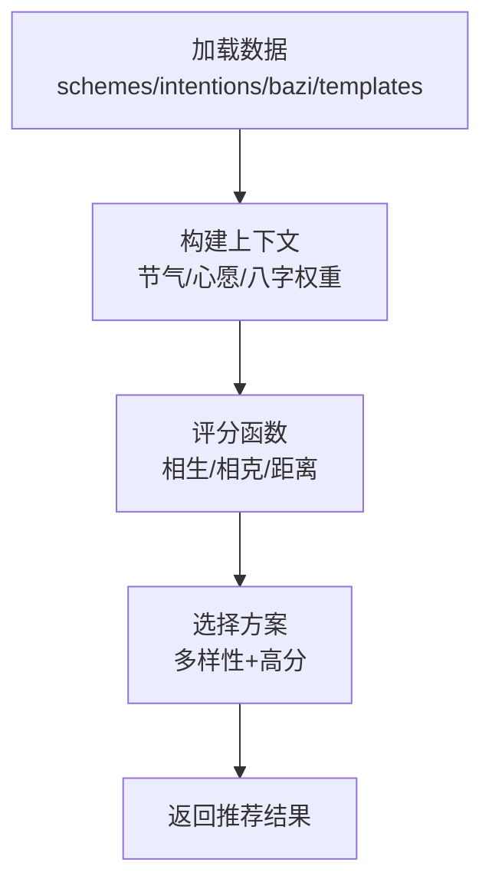
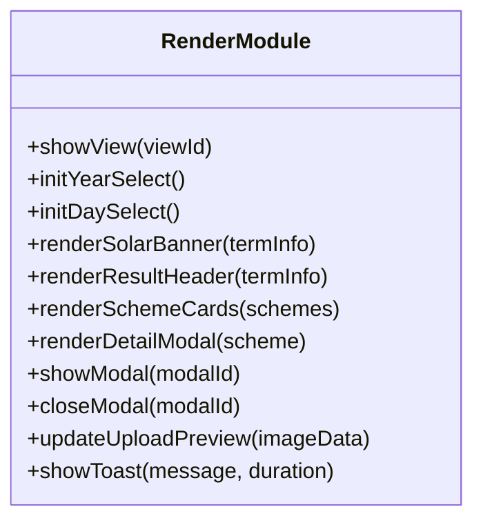
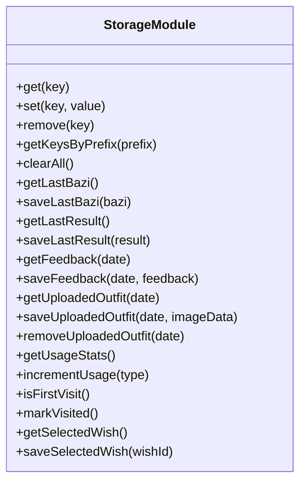
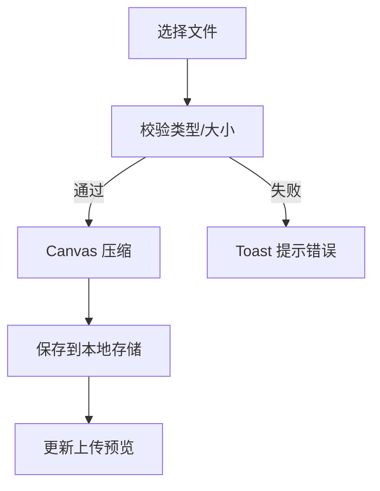
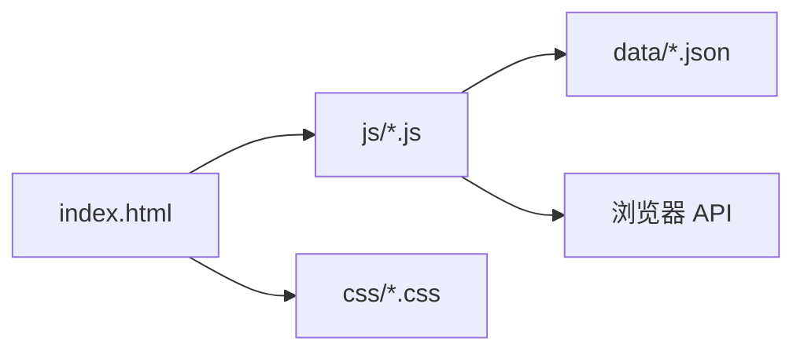

# 环境搭建

<cite>
**本文引用的文件**
- [index.html](file://index.html)
- [main.js](file://js/main.js)
- [engine.js](file://js/engine.js)
- [render.js](file://js/render.js)
- [storage.js](file://js/storage.js)
- [upload.js](file://js/upload.js)
- [tokens.css](file://css/tokens.css)
- [base.css](file://css/base.css)
- [layout.css](file://css/layout.css)
- [components.css](file://css/components.css)
- [animations.css](file://css/animations.css)
- [schemes.json](file://data/schemes.json)
- [intention-templates.json](file://data/intention-templates.json)
- [bazi-templates.json](file://data/bazi-templates.json)
- [solar-terms.json](file://data/solar-terms.json)
- [wish-templates.json](file://data/wish-templates.json)
</cite>

## 目录
1. [简介](#简介)
2. [项目结构](#项目结构)
3. [核心组件](#核心组件)
4. [架构总览](#架构总览)
5. [详细组件分析](#详细组件分析)
6. [依赖分析](#依赖分析)
7. [性能考虑](#性能考虑)
8. [故障排查指南](#故障排查指南)
9. [结论](#结论)
10. [附录](#附录)

## 简介
本指南面向希望在 Windows、macOS、Linux 上快速搭建“五行穿搭建议”项目开发环境的开发者。项目采用原生 HTML/CSS/JavaScript，无需 Node.js 构建工具链，直接通过本地静态服务器即可运行与调试。本文将提供：
- Node.js 版本要求与现代浏览器支持说明
- VS Code 插件、ESLint、Prettier、浏览器调试工具推荐
- 本地开发服务器启动方法、热重载配置与跨浏览器兼容性测试步骤
- 本地存储与数据加载流程说明，帮助理解运行机制

## 项目结构
项目采用“页面为中心”的前端组织方式：HTML 页面引入多个模块化的 JS 文件与样式文件，数据以 JSON 形式存放于 data 目录。

图表来源
- [index.html](file://index.html#L1-L236)
- [main.js](file://js/main.js#L1-L317)
- [engine.js](file://js/engine.js#L1-L335)
- [render.js](file://js/render.js#L1-L272)
- [storage.js](file://js/storage.js#L1-L116)
- [upload.js](file://js/upload.js#L1-L145)
- [tokens.css](file://css/tokens.css#L1-L109)
- [base.css](file://css/base.css#L1-L168)
- [layout.css](file://css/layout.css#L1-L252)
- [components.css](file://css/components.css#L1-L338)
- [animations.css](file://css/animations.css#L1-L207)
- [schemes.json](file://data/schemes.json#L1-L509)
- [intention-templates.json](file://data/intention-templates.json#L1-L253)
- [bazi-templates.json](file://data/bazi-templates.json#L1-L103)
- [solar-terms.json](file://data/solar-terms.json#L1-L42)
- [wish-templates.json](file://data/wish-templates.json#L1-L47)

章节来源
- [index.html](file://index.html#L1-L236)
- [main.js](file://js/main.js#L1-L317)
- [engine.js](file://js/engine.js#L1-L335)
- [render.js](file://js/render.js#L1-L272)
- [storage.js](file://js/storage.js#L1-L116)
- [upload.js](file://js/upload.js#L1-L145)
- [tokens.css](file://css/tokens.css#L1-L109)
- [base.css](file://css/base.css#L1-L168)
- [layout.css](file://css/layout.css#L1-L252)
- [components.css](file://css/components.css#L1-L338)
- [animations.css](file://css/animations.css#L1-L207)
- [schemes.json](file://data/schemes.json#L1-L509)
- [intention-templates.json](file://data/intention-templates.json#L1-L253)
- [bazi-templates.json](file://data/bazi-templates.json#L1-L103)
- [solar-terms.json](file://data/solar-terms.json#L1-L42)
- [wish-templates.json](file://data/wish-templates.json#L1-L47)

## 核心组件
- 应用入口与事件绑定：负责初始化、视图切换、用户交互与调用渲染/存储/上传模块。
- 推荐引擎：加载数据、构建上下文、评分与筛选方案。
- 渲染模块：负责视图切换、卡片渲染、模态框、Toast 提示等。
- 本地存储：封装 localStorage 的键空间与业务方法。
- 上传模块：文件校验、Canvas 压缩、拖拽与键盘支持。
- 样式系统：设计令牌、基础样式、布局、组件与动画。
- 数据层：节气、方案、心愿与八字模板。

章节来源
- [main.js](file://js/main.js#L1-L317)
- [engine.js](file://js/engine.js#L1-L335)
- [render.js](file://js/render.js#L1-L272)
- [storage.js](file://js/storage.js#L1-L116)
- [upload.js](file://js/upload.js#L1-L145)
- [tokens.css](file://css/tokens.css#L1-L109)
- [base.css](file://css/base.css#L1-L168)
- [layout.css](file://css/layout.css#L1-L252)
- [components.css](file://css/components.css#L1-L338)
- [animations.css](file://css/animations.css#L1-L207)
- [schemes.json](file://data/schemes.json#L1-L509)
- [intention-templates.json](file://data/intention-templates.json#L1-L253)
- [bazi-templates.json](file://data/bazi-templates.json#L1-L103)
- [solar-terms.json](file://data/solar-terms.json#L1-L42)
- [wish-templates.json](file://data/wish-templates.json#L1-L47)

## 架构总览
下图展示从页面加载到推荐生成的关键流程，包括数据加载、上下文构建与渲染更新。

图表来源
- [index.html](file://index.html#L1-L236)
- [main.js](file://js/main.js#L1-L317)
- [engine.js](file://js/engine.js#L1-L335)
- [render.js](file://js/render.js#L1-L272)
- [storage.js](file://js/storage.js#L1-L116)

## 详细组件分析

### 组件 A 分析：应用入口与事件流
- 初始化：加载节气信息、恢复上次选择、绑定事件、初始化上传区、统计访问。
- 事件流：开始体验、返回、心愿选择、生成/换一批、上传、保存反馈、详情弹窗。
- 与渲染/存储/上传模块协作，保证状态一致性与用户体验。

图表来源
- [main.js](file://js/main.js#L1-L317)
- [render.js](file://js/render.js#L1-L272)
- [upload.js](file://js/upload.js#L1-L145)

章节来源
- [main.js](file://js/main.js#L1-L317)
- [render.js](file://js/render.js#L1-L272)
- [upload.js](file://js/upload.js#L1-L145)

### 组件 B 分析：推荐引擎与评分算法
- 数据加载：并发加载方案、心愿模板、八字模板与节气定义。
- 上下文构建：根据当前节气、心愿与八字结果构造权重。
- 评分与筛选：按五行相生/相克关系与节气距离打分，保证多样性与高分优先。
- 结果返回：包含方案列表、模板与时间戳。

图表来源
- [engine.js](file://js/engine.js#L1-L335)
- [schemes.json](file://data/schemes.json#L1-L509)
- [intention-templates.json](file://data/intention-templates.json#L1-L253)
- [bazi-templates.json](file://data/bazi-templates.json#L1-L103)
- [solar-terms.json](file://data/solar-terms.json#L1-L42)

章节来源
- [engine.js](file://js/engine.js#L1-L335)
- [schemes.json](file://data/schemes.json#L1-L509)
- [intention-templates.json](file://data/intention-templates.json#L1-L253)
- [bazi-templates.json](file://data/bazi-templates.json#L1-L103)
- [solar-terms.json](file://data/solar-terms.json#L1-L42)

### 组件 C 分析：渲染与视图系统
- 视图切换：隐藏/显示对应 section，实现多视图导航。
- 卡片渲染：动态创建方案卡片，支持查看详情弹窗。
- 模态框：Backdrop 点击与 ESC 关闭，避免滚动穿透。
- Toast：全局提示消息，自动消失。

图表来源
- [render.js](file://js/render.js#L1-L272)

章节来源
- [render.js](file://js/render.js#L1-L272)

### 组件 D 分析：本地存储与使用统计
- 前缀隔离：统一前缀避免键冲突。
- 业务方法：保存/读取心愿、八字、结果、反馈、上传图片、使用统计。
- 清理与遍历：支持按前缀查询与清理。

图表来源
- [storage.js](file://js/storage.js#L1-L116)

章节来源
- [storage.js](file://js/storage.js#L1-L116)

### 组件 E 分析：图片上传与压缩
- 校验：类型、大小限制。
- 压缩：Canvas 缩放与质量迭代，目标大小控制。
- 交互：点击、拖拽、键盘激活；预览与移除。

图表来源
- [upload.js](file://js/upload.js#L1-L145)
- [storage.js](file://js/storage.js#L1-L116)

章节来源
- [upload.js](file://js/upload.js#L1-L145)
- [storage.js](file://js/storage.js#L1-L116)

## 依赖分析
- 运行时依赖：浏览器原生 API（fetch、localStorage、Canvas、FileReader、DragEvent 等），无第三方库。
- 构建期依赖：无需 Node.js、Webpack、Vite 等工具，直接使用原生 ES Modules。
- 数据依赖：data 目录中的 JSON 文件作为推荐与渲染的数据源。

图表来源
- [index.html](file://index.html#L1-L236)
- [main.js](file://js/main.js#L1-L317)
- [engine.js](file://js/engine.js#L1-L335)
- [render.js](file://js/render.js#L1-L272)
- [storage.js](file://js/storage.js#L1-L116)
- [upload.js](file://js/upload.js#L1-L145)
- [schemes.json](file://data/schemes.json#L1-L509)
- [intention-templates.json](file://data/intention-templates.json#L1-L253)
- [bazi-templates.json](file://data/bazi-templates.json#L1-L103)
- [solar-terms.json](file://data/solar-terms.json#L1-L42)
- [wish-templates.json](file://data/wish-templates.json#L1-L47)

章节来源
- [index.html](file://index.html#L1-L236)
- [main.js](file://js/main.js#L1-L317)
- [engine.js](file://js/engine.js#L1-L335)
- [render.js](file://js/render.js#L1-L272)
- [storage.js](file://js/storage.js#L1-L116)
- [upload.js](file://js/upload.js#L1-L145)
- [schemes.json](file://data/schemes.json#L1-L509)
- [intention-templates.json](file://data/intention-templates.json#L1-L253)
- [bazi-templates.json](file://data/bazi-templates.json#L1-L103)
- [solar-terms.json](file://data/solar-terms.json#L1-L42)
- [wish-templates.json](file://data/wish-templates.json#L1-L47)

## 性能考虑
- 图片压缩：Canvas 压缩与质量迭代，兼顾体积与清晰度。
- 数据加载：并发加载多份 JSON，减少等待时间。
- 动画与过渡：合理使用 CSS 动画，尊重“减少动态效果”偏好设置。
- 本地存储：避免过大对象，及时清理历史数据。

## 故障排查指南
- 页面空白或报错
  - 检查浏览器控制台是否存在网络错误（无法加载 data/*.json 或字体资源）。
  - 确认 index.html 中的 script type="module" 与相对路径正确。
- 无法生成推荐
  - 检查 data/*.json 是否完整加载（Network 面板）。
  - 确认节气数据与模板 ID 匹配。
- 上传失败
  - 检查文件类型与大小是否符合校验规则。
  - 确认 Canvas 写入与 toDataURL 成功。
- 本地存储异常
  - 检查浏览器隐私模式或禁用 localStorage 的情况。
  - 使用 Application 面板查看 localStorage 内容与键空间。

章节来源
- [index.html](file://index.html#L1-L236)
- [main.js](file://js/main.js#L1-L317)
- [engine.js](file://js/engine.js#L1-L335)
- [render.js](file://js/render.js#L1-L272)
- [storage.js](file://js/storage.js#L1-L116)
- [upload.js](file://js/upload.js#L1-L145)

## 结论
本项目无需 Node.js 构建工具即可运行，适合在任意主流现代浏览器中进行开发与调试。通过本地静态服务器即可满足开发需求，配合 VS Code 插件与浏览器调试工具，可高效完成功能迭代与兼容性验证。

## 附录

### A. 开发环境搭建步骤
- 克隆项目
  - 在任意目录执行 git clone 命令获取仓库。
- 安装依赖
  - 本项目无需第三方依赖，直接使用浏览器原生 ES Modules。
- 启动本地开发服务器
  - 推荐使用浏览器自带的本地服务器能力（例如 Chrome Dev Editor、VS Code Live Server 插件，或 Python http.server/Node http-server）。
  - 注意：由于项目使用 ES Modules，需要在支持 CORS 的本地服务器或通过 file 协议在受支持的浏览器中打开。
- 热重载
  - 可使用 VS Code Live Server 插件或浏览器自动刷新功能，修改文件后自动刷新页面。
- 跨浏览器兼容性测试
  - 在 Chrome、Firefox、Safari、Edge 上分别打开 index.html，检查样式、交互与动画表现。
  - 关注 localStorage、Canvas、FileReader、ES Modules 的支持情况。

### B. 现代浏览器支持说明
- 支持范围
  - Chrome、Firefox、Safari、Edge 等主流现代浏览器。
- 关键特性
  - ES Modules（import/export）、fetch API、localStorage、Canvas、FileReader、DragEvent、CSS 变量与媒体查询。
- 不支持场景
  - IE 与旧版移动浏览器可能不支持上述特性，建议使用现代浏览器进行开发与测试。

### C. VS Code 推荐插件
- Live Server：提供本地静态服务器与自动刷新。
- ESLint：代码规范检查（见下文配置）。
- Prettier：代码格式化（见下文配置）。
- Auto Rename Tag / HTMLHint：辅助 HTML 开发。
- Bracket Pair Colorizer：括号层级可视化（可选）。

### D. ESLint 配置
- 规则建议
  - 禁止 console.warn/console.error（保留 console.log 用于开发）。
  - 强制使用单引号、末尾逗号、分号可选。
  - 严格模式：es2021，模块化：es6。
- 配置文件位置
  - 在项目根目录创建 .eslintrc.cjs 或 .eslintrc.json，添加 rules 与 env 设置。
- VS Code 集成
  - 安装 ESLint 插件，在工作区设置中启用 ESLint 自动修复。

### E. Prettier 格式化设置
- 规则建议
  - 单引号、尾逗号、分号可选、行尾无空格。
  - printWidth 控制在 100 左右，保持可读性。
- 配置文件位置
  - 在项目根目录创建 .prettierrc 或 .prettierrc.json。
- VS Code 集成
  - 安装 Prettier 插件，设置默认格式化程序为 Prettier。
  - 在保存时自动格式化（editor.formatOnSave: true）。

### F. 浏览器调试工具配置
- Console
  - 使用 console.log 输出初始化与关键流程日志，便于定位问题。
- Network
  - 检查 data/*.json 与字体资源加载状态。
- Application
  - 检查 localStorage 键空间与容量。
- Performance/Memory
  - 监控 Canvas 压缩过程与内存占用。
- Device Toolbar
  - 模拟移动端尺寸，验证响应式布局。